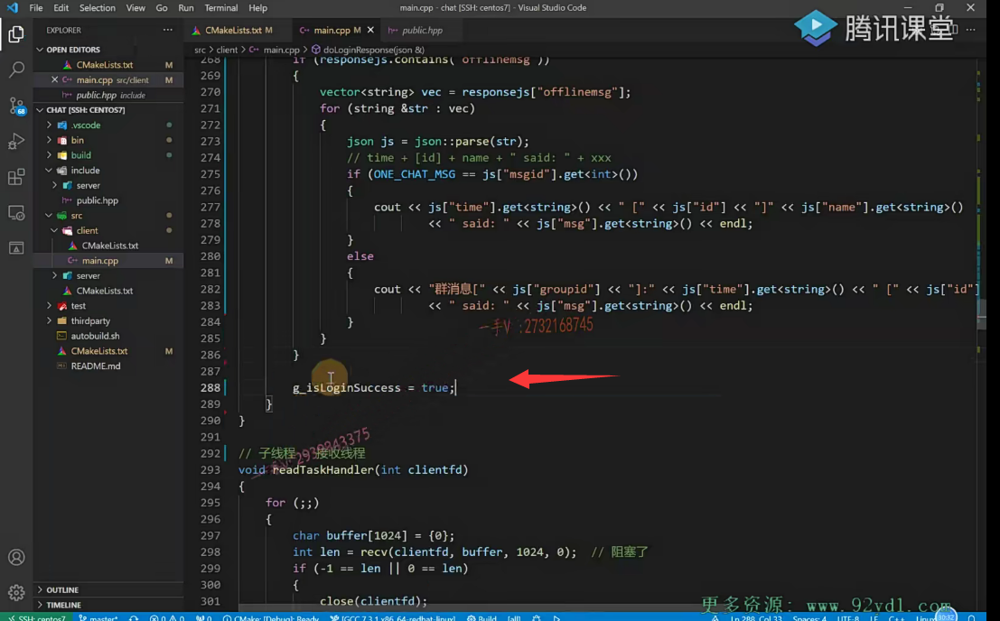
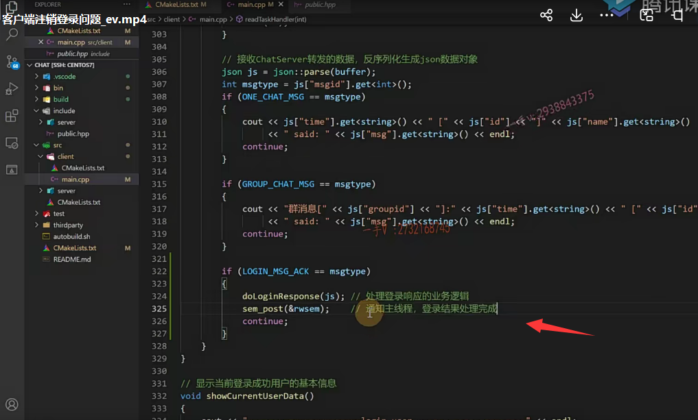

# 客户端注销登录问题

同学们，这节课呢，我们给大家来纠正一下我们的这个集群聊天服务器，客户端上可能会存在的一个问题啊。

我们大家在学习的时候，有的同学呢，出现过这个问题啊，但是有的同学呢，却没有出现啊，

这个问题是概率性的。那么，到底这个问题是什么？以及它的原因是什么？以及我们该怎么样去修改啊？

那这节课呢？我们带着大家统一来看一下这个问题。那么你看看你有没有出现过，

你出现的时候你是怎么去分析定位它的，你最终把它修改了没有？你是怎么修改的？

那我们把这个集群聊天服务器的代码，这个git克隆下来，这是从github上这个克隆下来的，

克隆下来以后我去编译啊。

我们之前写的一键编译脚本嘛，对吧？

能看到这应该是把项目整个都已经学完了，应该对于项目的这个整个的编译过程啊，构建过程以及代码的这个逻辑流程应该是算是比较熟悉的啊，

那么然后我这边进bin目录，然后这个shell下我运行它的这个服务器啊。比如说在6000端口上，

这里边起一个客户端。chat.clan t幺二七点零点零点一。连接服务器的六间端口，

这个是登录，首先登录是吧？

登录完了以后，这个是填写啊，我们之前注册过的，在服务器上成功注册过的这个账号。

呃，他账号的ID是个幺三，然后密码我输入正确完了以后呢，就会进入这个主目录对吧啊？进入这个主界面功能界面，

### 遇到的问题

然后这里边有一个功能就是注销啊，我们有位同学在测试这功能login out注销。注销完了以后呢？

你看注销从呃主界面由功能界面回到这个登录界面，登录界面以后呢？

又继续选择这个login。那么，选择呃填写一个账号，然后继续登录一二三四五六。

嗯，大家有没有遇到过这个问题？

这个呢，我们在讲课的过程中，我给大家是在优班图幺八点零四server版本下去开发的，

这个问题呢复现的概率非常小，

但是你看在centos下，它的复现概率一般是非常非常大的啊。

呃，这个你在你的这个电脑上啊，它也不一定会复现，

但是这个问题它是确实存在的，

这是什么问题呢？

### 不知道有没有登录成功，类似程序假死在这

好，我们一点点告诉大家。

那么首先啊，我们在执行我们的程序的时候，如果出现像这样的情况啊，那这样的情况，

如果说是登录成功。它是不是会出现一个这样的一个信息打印相当于就是当前登录用户是什么，然后会有一个好友列表跟群组列表的一个显示以及当前的shell支持什么样的命令啊？这叫功能界面到主界面来了。

那么这个好像是没有显示，那是登录成功了，还是没登录成功，或者好像感觉还是卡到这了，怎么回事？对吧？

一般像这种假死的程序呢？

## gdb attach调试

我希望大家都去gdb attach attach到它的这个进程上，先去看一看它大概是执行到哪里死掉了是吧啊？

那么，在这里边，我们因为是客户端程序，好像再次登录以后，刚才是注销，再次登录好像没有反应了？

那么，在这gdb attach，然后attach一下，这是客户端程序，它的PID是四二零七。

### 先看下线程的数量 info threads

==那么大家来看看啊。在这里边我先看一下线程数量==

因为根据我们的设计，我们的客户端是有两个线程，一个是专门的读线程，一个是专门的写线程，

我们的主线程应该是专门接收客户端的这个输入，专门接收用户的输入啊，接收用户的输入，然后进行发送对吧？

我们新起的这个子线程专门是用来进行receive接收啊，然后打印信息那么在这里边，

我们很容易看到，这是我们的两个线程诶，

### bt

### 观察调用堆栈发现连个线程都在main.cpp:119行阻塞

你发现啊，这其实很明显，两个线程现在都在receive  BT back tress打印一下线程的这个调用堆栈。

这主线程main点cpp幺幺九，我们回到我们的这个客户端，这个程序来，你看main点CPp幺幺九。诶，到这来了对吧啊？到这来了嗯，大家。看一下啊，现在是阻塞在这里了。这是主线程。呃，很明显很明显，

### 切换子线程 thread 2 查看线程调用堆栈

我们的这个子线程是不也在receive上啊？

而我可以切一下。大家来看啊，我切到我们的这个2的二子线程来，

以后又查看了一下它的线程调用堆栈。

他现在在read task handler，这是我们创建的这个子线程啊  

子线程289 receive这。289 receive。哎，289看到了吧？289 receive 也阻塞了。

那也就是说，现在的现象是什么现象？

是客户端。刚才登录成功，然后注销退出，

==然后又重新去登录的时候，客户端没有反应了，==

那我通过GDP attach，这是我们经常在学习或者工作中遇见程序不往下走了，

感觉好像像是卡到这儿死到这儿了，或者死锁到这儿了是吧？

那我经常呢？我看到这个现象，我没有办法去一下定位到代码到底哪在哪里出现问题了，

因为代码可能很多嘛，是吧？

==那我可以很简单用GDP attach attach到我们的正在运行的进程上来，大致的看一下它里边的所有的线程以及线程的这个调用堆栈的详细信息，==

我们就大概能够定位到我现在的这个任务是阻塞在哪里了？

或者卡死在哪里了？okay吧。

### 发现我们在主线程写线程中阻塞了，在子线程读线程中也阻塞了

好了，那我们先把这个shell最小化一下，

我们先来分析一下我们这个。

因为我们现在确实是这个接收线程，也就是这个读线程啊，现在receive这阻塞了。

而我们的主线程，也就是我们的写线程，发送线程呢，也是在幺幺九这里边阻塞了。

## 分析代码逻辑

那么其实你仔细看一下，你就能发现问题了，大家来一起跟我看看，

### 客户端 打包一个json登录包，然后我们发送

刚开始我们第一次登陆的时候。登录这个打包了一个登录的json的这个序列化的数据发送到是不是服务端了啊，

然后我们就在这个send。

### 主线程 send登录请求后 recv等待服务器的响应

就在这个main线程就在主线程里边，就直接在send的后边，就直接receive了OK吧啊

receive了以后呢，

在这里边阻塞就是等待我们服务器给登录的这个消息进行一个响应是吧？

### 得到响应后进行相应的处理

好得到响应以后呢？我们把这个网络接收到的数据呢？进行json的这个反序列化，得到我们的json对象，

然后在里边拿到相应的字段进行业务的处理是吧？处理完了以后呢？

那我们做了一个什么事情哦，我们做了一个启动了一个子线程。

==注意我们子线程是在这启动的，也就是说我们之前的设计是让他登录成功以后，然后把这个子线程也就是这个独线程给启动了，==

而且我们这里边用了一个所谓的静态的局部变量。来控制了一下子线程启动的个数，对吧？

子线程启动以后，这里边给子线程read task handle了，这是我们C++幺幺的这个线程创建。

看过我们的这个C++高级课程，里边应该都知道C++11里边啊，这个C++语言上实这个实现了这个多线程编程啊，这个非常方便的，让我们用C++的线程库来编写，可以跨平台编译的这个代码啊，多线程代码这样一来呢，你这样的线程呢，就可以在linux下编译运行，也可以在WINDOWS下编译运行，或者在这个Mark下是不是编译运行？

运行啊，而大家在这里边之前直接使用linux p three的库的话，就只能在linux下运行了OK吧啊。这是语言级别的这个多线程编程okay，

完了以后就是启动子线程完了。就是is May running，把这个变量呢改成true，

然后进入这个May menu，进入May menu以后呢？

就是我们之前看到的。就是我们之前看到的这一对。

就是登录成功以后的信息打印对吧啊？

### 注销并没有把子线程关掉

okay。现在是。现在是什么？现在是它注销了。

注销其实我们并没有做太多的事情，尤其是我们注销并没有把这个子线程关掉。OK吧，这是最重要的，

我们注销并没有把这个子线程关掉啊，

## 梳理一下 注销后再次登录的逻辑 找到问题

那也就是说注销以后了啊，注销以后了。

我们再进行登录的时候。在这我们主线程去send send完了，主线程马上receive，

但你注意啊。第一次登录成功了，以后呢，我们把子线程启动了，对不对？

子线程启动以后，它子线程里边就循环在这进行receive了。

### 出现了子线程和主线程都再收，会导致服务器给主线程的响应被子线程抢到了

第一次登登出就是注销以后，哎，注销以后再进行登录的话，是不是变成主线程在这里边发了一个send主线程在receive，

然后我们子线程也在干嘛？子线程也在receive。明白了吧。

那么，实际上我们是想要主线程发的这个登录消息由主线程来接收它的响应receive

在这里边接收了以后，这里边就不会阻塞。就往下走，继续我们登录的流程了，

但是在这里边第二次再登录时候，由于怎么样，由于子线程抢到了这个receive。

因为我们主线程跟子线程处理的都是同一个的fd啊，子线程把这个数据receive了，就是登录的响应消息。

但是子线程这里边没有做任何处理，对吧？

我们之前只处理了，在这里边只显示了单聊跟群聊的消息啊，

然后它转了一圈，又阻塞在receive。

==而由于我们登录的响应消息，被子线程这里边receive接收了。==

所以导致我们主线程这里边的receive呢，怎么样？并没有接收到任何消息，所以阻塞到这里，

==所以导致我们主线程也receive在这里。而子线程也怎么样也receive到这里？==

我相信我已经说的够明白了吧啊，好了，那么这个问题呢，我们现在已经解释清楚了，

也就是说呢，我们现在啊。这个原来在客户端的设计上啊。忽略了这一点。

### 之前设计存在缺陷，我们主线程既作为发送也作为接收线程

实际上，我们在设计的时候啊，设计的这块设计的不太好，所以我们这节课给大家说，我们改一改啊，我们改一改。

我们的主线程专门就是作为发送线程，子线程用来做接收线程啊？哎子线程专门用来做接收线程。这是子线程做这个接收线程，

==但是我们没有做的特别彻底。没有做的特别彻底，按这样来说的话，就主线程只管发送，而子线程只管接收，==

==但是在这里边我们主线程又做发送又做接收。能明白吧。==

所以这里边我要怎么样啊？我要重新去给它设计一下啊，重新去给它设计一下，那么大家来看我是怎么设计呢？

## 重新设计

首先，我们在这给大家画了一个简单的图。

那我们之前从逻辑上，我们已经分清楚主线程跟子线程啊，它各自的这个功能呢，

就是主线程做发送线程，子线程做接收线程。

但是我们在写的时候发现主线程里边又去send，又去receive对吧？

那么在这里边，我们首先要改动的一点就是。我们客户端socket创建socket connect服务端成功以后，

我们就给他把这个子线程启动起来，而不是说是在这个登录成功以后再去启动这个子线程，没有必要，

我这个连接服务器都连接成功了，这个TCP连接都创建成功了，我就把这个子线程啊给它启动起来，

专门做一个什么，大家看这启动子线程，我这画了一个箭头，那么这个啊，

这边是属于一个主线程，这边是子线程。

子线程专门开始for死循环，在这里边进行receive接收服务端的响应消息，也就是专门做一个read操作，读线程OK吧？

那么，在这里边启动子线程，专门进行读操作以后呢？

我们主线程进来一个首界面了，就是那个一登录二注册三退出嘛。对不对？

那我现在要做的事情就是，比如说拿登录来说啊，登录在这里边，我们提示用户输入这个ID和这个密码呀？

完了以后打包这个json数据就进行数据的这个序列化，把我们原始的数据序列化成json的这个字符串？

==然后进行一个send。哎，通过网络发送出去，就是发送到服务端，==

==那服务端在这里边响应的话，响应那统一都是由这个子线程来进行一个接收。没问题吧啊，==

那比如说这个。客户端发送的这个登录消息嘛，我们每一个消息是不是都有类型的，

那么子线程在这里边接收消息的时候，它可以根据消息的ID就是message log跟ack就可以识别，

这是一个登录的响应消息。OK吧啊，

### send请求后，send是不阻塞的，所以我们应该等待一下响应

那么在这里边需要注意一下，就是我们主线程在这里边send以后，

那你不能直接就走啦。你因为send它是不阻塞的嘛，对吧啊？

那完了以后呢？你在这里边是不是应该等一等 ，等什么呢啊？

你怎么样才继续向下执行呢？你有两种，要么是登录成功，要么是不是登录失败啊？
登录失败，你继续到这个首界面登录成功的话，你就要进我们的主界面功能界面了，是不是

### 并且登录成功不成功应该在子线程中判断，需要添加通知机制

那么到底在哪里来判断成功不成功呢啊？判断成功或者不成功是在我们子线程这里边判断的呀。对不对？

所以我们这里边应该还要添加一个通知机制就是主线程啊，

发送线程send以后在这里边应该等待，

比如说我们等待一个信号量上啊，然后子线程来接收这个登录的响应消息以后。

然后呢，根据登录的响应消息，成功或者失败，对不对诶？

这个应该还是要写一些标志对吧？登录了成功了，或是登录失败了，

### 来通知我们的主线程是登录成功还是登录失败

然后完了以后，然后通过一个信号量。告知我们主线程，这就是相当于是线程间的通信了嘛，是吧？线程间的通信本身就是一个线程的执行依赖，另外一个线程是不是做完某一件事情啊？

本身线程的调度是没有顺序可言的嘛啊，通过信号量通知一下，

然后我们主线程再继续往下走，继续往下走，

那我们肯定要判断一个变量，到底你是登录成功了还是登录失败了？

登录失败的话，那我继续是不是转到首界面了？

登录成功的话，我就要进入主界面了okay，

## 小结一下

### 第一点 子线程创建的位置

在这里边我们就是要改这几点第一点。

我们子线程创建的地方，我们要精简挪地方，就是当我们客户端连接服务器，连接connect成功以后，就要去创建这个子线程。

### 第二点 登录注册 登录的响应接收都由子线程来处理，并且用信号量来通知主线程继续处理

好吧，第二个是登录和注册啊，这两个我们肯定都得改，

我们先说一个登录啊send以后呢？send后边那些代码我们都要移到子线程？

就是我们主线程不接收了，所有东西全部由子线程来接收。好吧呃，

如果涉及了主线程往下走，还需要依赖子线程接收处理一定的逻辑呢，

我们在这里边用一个线程的通知机制，用什么用sem？

好，我们信号量就可以了。

那C++11里边只提供了这个互斥锁跟条件变量啊，没有信号量，所以在这里边信号量我们还是选用这个linux原生的这个pthread库里边呢sem信号量通知就可以了啊，

### 还需要添加一个标志，通知主线程是登录失败还是登录成功了

那么一个是信号量，另外一个还要干什么呀？

哎，还要增加一个标志，因为信号量只是通知通知我们这个主线程啊，

子线程已经把登录消息的这个响应是不是处理完了？

==这个主线程知道啊，那边处理完处理完了以后，那到底登录成功还是失败了呢？==

==在这里边需要记录一个变量。是不是啊？需要记录一个变量，==

### 这个标志变量最好定义成原子类型 会在多个线程访问

那么你注意这个变量啊，很明显又要在子线程访问，又要在主线程访问，相当于就是两个线程呢，是不是一共享变量啦？

==所以呢啊，为了防止出错对吧啊，我们这样的变量呢，尽量都把它定义成原子类型呢，==

因为大家知道对于变量啊。在多个线程里边去读去写对吧啊，对于共享的变量，多个线程里边去读写去写，

它并不是一个原子操作。

==好，我们c++11里边提供了基于cas实现的这个线程，安全的atomic类型是非常好用的啊，它自带only pal属性对吧啊？在多线程编程里边非常的好用。==

啊，原来我们只能使用操作系统，原生的linux，原生的用起来比较麻烦。C++11现在提供了这么方便呢，

我们就直接可以用起来。

这个在我们C++高级课程里边也有给大家提到过，在这里边我们就直接解决好，不做理论的这个铺开讲解了。

啊，那基本上就是这么多啊，基本上就是这么多，最后我们把登录改一下，把注册改一下就OK了啊，

好那么大家来看一下，我就开始改了。

第一步，那我们说了，先把这个线程的这个地方挪一挪啊。就这个大家改的时候呢，

包括工作中啊，去改东西的时候都看一看，包括这个readthreadnumber。就这三个地方，再没有其他地方了是吧？

所以我现在既然我要把线程的启动挪到其他地方去。那他们就怎么样？没有用啦啊。

### 连接成功后，就创建子线程专门负责接收

弄到什么地方哎，就是进入这个首界面connect成功后我们就放到这了。

那么在这里边我加一个打印。就是连接服务器成功啊。启动接收子线程，专门用来接收啊。

好的吧，那么注意一下啊，这里边就没有了，

另外啊，我们刚说了啊，主线程 send以后呢？

==呃，因为send不阻塞对吧？send以后到底是又往首界面走呢？还是往功能界面这个主界面走呢？==

==这完全看我们子线程是不是处理登录响应消息的一个结果啊？==

==在这里边需要一个信号量，还需要一个全局的一个变量来标识，到底登录成功还是没成功啊？==

### 在这里使用linux的信号量 和 c++11的atomic

在这里边，我们选择用linux的信号量。
然后还有一个用C++11的atomic原子类型。

### 线程间的通信

那么我们之前把这个变量的定义跟函数的声明都给它燃到一块了啊。（没有改动，只是换位置）

okay，那么在这定义这个是用于读写线程之间的这个通信。

因为你注册跟登录不可能同时进行的嘛，

对吧？所以用这个通信的话，用一个信号量就可以了啊。

在这里边，3 SEM杠t用一个rw SEM吧。

另外，我们就是记录登录状态是否成功。atomic布尔值就可以了嘛，对吧啊

true或者FALSE布尔值就可以了，记录登录状态啊，记录这个登录状态。

我用atomic是因为这个变量啊，在多个线程里边又要读又要写，对吧啊，

防止这个由于线程安全啊，线程安全所产生的静态条件问题。

啊，这个大家在操作系统多线程里边应该都会去学过这些东西啊呃，

对于这个单变量啊，单变量的这个普通变量的一个值得修改，一个值得读取，在多线程中没有必要去用那么重的锁互斥锁来控制它。用基于CS的这个原子类型就可以了。

### 初始化一下信号量和标志变量

g杠a。login.e success.

给他初始化一个是吧？FALSE刚开始没登录成功嘛，是吧啊？

okay，那就是这个样子了。

好，那么这个信号量我们得初始化一下啊，是吧？

信号量得初始化一下。啊，在刚才这块啊，刚才这块在我们这里边初始化这个读写线程通信用的信号量，哎呦。

信号量啊，信号量sim for semi in it an it

那么第一个是我们写的信号量的一个地址，因为信号量它也是一个资源计数，对吧？

这个simo post就是给资源的，这个给信号量的资源加一啊simo weight就是给这个信号量的资源减一。

所以它需要修改这个信号量的这个资源计数，所以我们肯定要把这个信号量的地址传进去OK吧？

然后第二个参数p12的是做线程间通信，还是做进程间通信，我们切成零啊，

我们现在是一个两个线程嘛，同一个进程的两个线程通信就可以了。

初始的这个资源计数为零啊，信号量初始的资源计数，我们给成零，

### 信号量的destory

那么既然init呢，我们在什么地方给它destroy一下呢？login地方吧。

这个给他怎么样？destroy一下啊

OK，那么这是它的一个初始化，跟这个信号量资源的释放啊。

好，那然后呢？我们就要来改一下了啊，我们就要来改一下了。

这块修改了信号量，跟这个都变了，现在我们要把send后边原来的接收全部放到哪里啊？

放到接收子线程里边，

大家来跟我看一看，我们先来改造一下子线程啊。

## 修改子线程

子线程原来这里边。那我们就继续往这补呗。log in message ack是吧？

loge n message ack=message type。

这个就是处理登录的响应消息，对吧？

登录的响应消息好像是很长啊，因为他做的事情会比较多一点，

所以在这我们上面这个是单聊消息，跟群聊消息只是做一个消息打印就行了，

这里边我们封装一个函数吧啊dolog inresponse.读log in response需要传什么参数呢？

### 定义一个函数读登录消息

我们这个读线程无非就是把数据读出来，对吧啊？

数据读出来那么反序列化成json，我们就把反序列化以后，这个json的这个对象给它传进去就行了啊。

这个相当于就是处理什么啊？处理登录响应的业务逻辑对吧？

==那你处理完了以后，你不管是什么，不管是你登录成功还是登录失败，你给给人家这个主线程通知一下，==

==因为主线程肯定是等在这个信号量上，等待你子线程处理完登录的响应告知主线程到底是登录成功了还是登录失败了？对不对啊？==

### doLoginResponse()

然后在这里边。okay，那完了以后我们把这个do log in response写到哪里呢？

好，我们就写到这个主线程跟这个子线程的中间吧。

这个传了一个json对象是吧？

那我们用引用来接收吧啊。

好，大家来看，这个是处理登录的响应逻辑啊，登录这一块。

receive这就不要了，这是我们子线程，人家已经receive了是吧？

这块我们都不要了啊，都不要了，这块都不要了。

从这块json哇，好多啊。okay，那我们把这就全部拷贝过来了，哎呦，还有这一块啊。

肯定不包含这两行啊，肯定不包含这两行，

因为这两行是在我们主线程主这个首菜单里边做操作处理的，我先都拷贝过来，

然后我们删一下。嗯，往前退啊。这个用的是什么？呃，这个就不用了，这个相当于是我们子线程已经pass过了，已经反序列化过了是吧？

啊，这里边用的都是response gs，那我把这个形参改一下啊

OK，这个相当于就是子线程子线程在这里边receive了receive了，以后呢receive了它。

把这个buffer里边数据反序列化成json，我们直接传到我们的do log in response里边来了是吧？

### 主线程之前做的业务都删除  只做接收

然后这里边直接处理登录失败，登录成功啊。

这个没有了。好，那我就先放这啊，我就先放这了，

那我们反过头来把我们原来主线程这里处理一下。那这就全部怎么样？这里边就全部不需要了。全部都不需要了。

为什么呢？因为我们主线程刚说了，他现在只做什么处理啊？只做一个发送。只做一个发送是吧啊？

### 全局变量g_isloginsuccess每次发送前置为false

那你别着急发送之前呢？

==你应该先把那个is login success我们。来给它制个false吧好吧啊，保险一点，==

因为它可能会做登录登出登录登出

是不是每次发送登录的时候都先给它制成一个false？

### 等待信号量  子线程来通知

完了以后呢，在这它就会怎么样？

sem for wait？这个rw。这个相当于在这里边等待这个信号量。

由谁来通知啊？子线程处理完我我这发的send是吧啊？登录的这个登录的。响应消息后呃通知这里。

这个通知完了以后啊，这里边没有得到子线的通知，这里边就一直阻塞，对吧？

得到通知了以后呢？这就起来了。

主线程被唤醒以后，那我们在这判断一下吧。如果这东西等于个等于true了，那就说明什么登录成功了，

登录成功了，那你就要进入什么呀？进入这个聊天的这个菜单页面了。是不是啊？

如果没有登录成功的话，那相当于那就继续在这个循环里边转又是让用户选登录注册还是退出嘛？

没有问题吧，

然后在这我们需要在我们刚才的地方改一改啊，

这是登录失败了。登录失败，把它制成什么？

啊，其实我们刚才最初始化的时候就是send之前都已经制成FALSE了是吧啊，

所以按理来说，只要登录成功，制成true就行了，那我们在这里边都写了吧？

登录成功。登录成功，在这里边。制成true。

这里边有没有从可能从中间跑掉呢？没有是吧，中间没有任何的return，或者是exit，所以登录成功的话，不管中间操作怎么样，这块是一定能到的

true就是登录成功会把这个变量制成一个true是不是？

OK，这里边只做业务啊，不要在这里边进行信号量通知，

我们说了在进行开发工作的时候，一个函数里边啊，就放它本身应该处理的逻辑就行了啊。

发通知这个主线程啊，信号量成立了，有资源可获取了，不应该属于do lo gen response，它只处理登录的响应好吧？

啊，获取登录的这个数，登录的响应数据来进行判断，登录成功或者登录失败。呃，完了以后呢？

在这你看会去唤醒这个通知这个主线程是吧？通知主线程登录结果。处理完成，是不是处理完成了okay？

处理完成了。那这是我们的这个什么呀？这是我们的这个登录是吧？

## 完善注册业务

那然后注册也一样啊。注册也一样啊，

注册在这里边，我们写一下吧。而我们现在纯粹就是主线程做发送，子线程做接收是吧？

这是注册的响应消息啊，这是我们当时都写了。

然后这个现在度十万。读reg。response吧也是传js啊。

对于注册来说。嗯，对于注册来说，我们应该也要去怎么样？通知一下啊。

这是注册结果，注册结果处理完成是吧？

OK，那么do reg response，

### doregResponse()

那我们同样的把这个拷贝一下。

这个是do reg response啊，do reg response。

这个是处理什么？处理注册的响应逻辑，

然后在这里边把注册的这个响应逻辑拿过来。这里边只剩的不receive了啊。

那相当于就是这一点了。是不是相当于就是这一点了？

你也不需要在这里边进行反序列化了，这个子线程已经反序列化好了，
把这个json对象都已经通过参数传进来了是吧？

#### name不好打印

我们看一样的。但这里边唯一的不好是这里边打印name，

因为这里边是注册成功或者失败，是不是都把name打印了一下啊？

嗯，因为原来在主线程写的时候上边就是。接收用户数的name可以直接访问，

但是现在是在子线程里边。啊，

我们就不改动太多了吧，你想在子线程里边记录注册用的是哪个name？

你可以在服务端把注册用的name。

呃，写到字段里边是不带回来啊？

嗯，或者说是因为我们的客户在客户端操作的时候，他刚输的名字底下。

我们也就不用特别的去提示了，是哪个名字注册成功，哪个名字注册失败，

他刚在这写的嘛，你刚在这注册的嘛，那你马上提示他当然知道。

刚才注册的是哪个成功哪个失败了是吧？所以我们在这为了简单处理，

我们在这直接就打印一个提示就行了啊name。

啊，这个不影响功能的。这是注册成功或者注册失败，这里边就不需要单独添加什么变量了，

为什么因为注册跟登录不一样，登录有可能是登录失败，回到首界面登录成功是不是要进入这个主界面功能界面啊，

但你注册成功，注册失败，你都是什么都是回到这个首界面的，

所以在这里边我们注册就没有必要像我们刚才的这个登录一样添加一个变量，用来控制成功或者失败了OK吧？

### 删除之前的注册处理逻辑

然后呢？在这儿呢我们那就要把这改一改了，不需要了。

是不是不需要了？

只要一个什么东西就行了。只要去等待这个信号量就可以了。

等待信号量啊。子线程处理完注册消息会怎么样？

会通知啊，会通知。okay，

那我们你看这个也比我们原来的代码是不是要简洁很多啊？要简洁很多。OK，

那我们基本上这个应该算是修改完了是吧啊？

修改完了就是这几点？

==我们现在纯粹是所有的响应都是在这个子线程里边接收，主线程只做发送啊。==

然后我们原来的这些这个我们因为这个变量是在多个线程里边处理，所以我们给它定义成原子类型了，

而且有读有写的，对吧？这些变量我们检查一下。它都是在什么do log in response里边，

这个函数也是在do log in response里边调用的呀。

是不是show count user data？啊，所以它都是在这个子线程里边使用的，所以不涉及线程安全问题啊，用vector就可以了，

因为我们sc+stl库里边的容器都是。都不是线程安全的，对吧？

现在只在子线程中访问的话，我们没必要考虑它的线程安全问题了啊。

okay，那我们就这就改完了啊，改完了以后呢？

## 编译测试

我们来编译看一看，看一下啊。嗯。这还结束不了了。结束不了啊，我们就来硬的。q，这个。嗯啊，已经结束了啊。可能刚没反应过来，那么在这我们重新的去编译一下。auto built.OK，这个编译成功，

那我们重新启一下刚才的这个服务器啊，这是客户端那么以logo一三一二三四五六。

login out.再来登录幺三。一二三四五六。

登录OK吧，没有问题是吧？log跟out，你可以多试几次幺三。一二三四五六这个现在肯定是没有问题的，

因为现在呃，我们完全是把接收，你看我现在这个用户名密码输了以后呢，

我现在只主线程发送，然后主线程等待在信号量上是吧子线程接收到以后呢？

处理完登录的结果会simo post是信号量资源加一，然后主线程呢，就能够获取这个信号量了，

然后通过读取一个登录的状态记录，登录登录状态的一个变量。就可以知道登录成功或者失败了，是不是？

log跟out再输入一个错的。幺三。idea of password is invalid好吧，

注册注册嗯。张三一二三。

啊name is already exist，register error那就是很明显，用户就知道了这个姓名是已经被注册过的是吧？

二。OK，这个name register success user ID is 24，do not forgit it相当于我们的号码一样是吧？

呃1 login那在这里边，我们24，然后密码是个一二三。okay，登录成功楼跟。out，然后再去登录，刚才是个多少呢？

24是吧？然后是一二三OK？

啊，这个就没有什么问题了，好吧好了，

那么我们这节课主要给大家去说了，我们在客户端设计上存在的这么一个问题。

啊，有的同学学习的非常细心啊，问到这个问题了，

那在这里边啊，我们统一的给大家去讲解一下，以及给出它的一个修改的一个方式啊。

那我们同学们在学习的过程中呃，不要只顾发现问题啊，还是发现问题了以后啊，还是要通过这个调试，

像我们刚才给大家讲解的用g db attach来调试你的程序。

或者是简单一些，加日志打印啊，在可能程序可能走到的地方全部加一些日志打印，对吧？

那么，大家随着逐渐的学习，从开始的知识的专项学习，到我们后边的项目实践练习啊，

在学习的过程中，一部分是知识的积累，另外一部分就是要更多的去积累解决问题的一些经验。

好吧，这个才是能够使我们能力成长更加快速的这个。

呃，刚开始学习有问题，问老师啊，不能说是一直有问题啊，一直不想去定位，不想去看，一有问题就两手一摊啊，老师这个问题怎么办？对吧？

这样的话呢，我们自身的提升也是很慢的好，那么这个代码我最终呢会推到这个git hub上让大家去。

git克隆代码的话，就能够拉下来。或者说啊，我们同学们看着这个视频，自己可以把这个代码呢，这个功能去修改一下啊，我们。把代码整个的去优化一下。

好，那这节课的这个内容就给大家讲到这里。