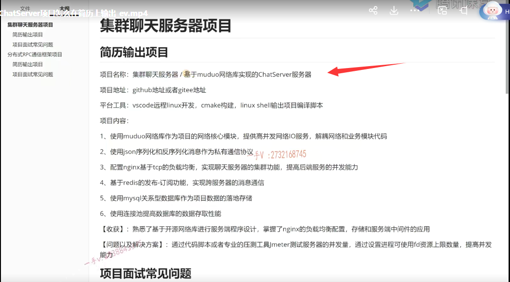

这节课开始我给大家讲一下，我们这个集群聊天服务器项目，大家在面试过程中遇到的一些通用的问题啊，很多同学在问的问题，那在这里边我们统一的给大家讲解一下，给大家有一个启发，大家可以下去呢，也去多去思考思考啊。

那么平时呢？有什么呃，还有疑问的问题，或者说是你自己在面试中跟面试官怎么聊的这个项目？

啊，有一些无法解决问题的，无法解决的问题啊，大家可以随时呢在QQ上啊，给我反馈一下。

那么在这里边嗯，我们只是把一些通用的问题拿出来给大家说一些比较简单的啊，明显是个人在面试的时候没有反应上来的那种答案，也是很清楚的那些问题，我在这里边就不讲了。

## 简历上怎么写项目

啊，首先第一个问题，我们说一下这个简历上怎么写项目啊？

我们同学们啊，有的同学，这个大家在简历上怎么写的这个项目？啊，也要问一下。而且问的人还不少。

首先我说一下啊。你在简历上写项目，它的一个格式就是这个样子的项目名称啊。

那么，项目名称来说的话，你集群聊天服务器也行，有些同学写基于muduo网络库实现的chat server服务器也行。那么，这个名字是你可以自己去起的啊，只要围绕着这个你项目的主题就行。好吧，这个没有一定的啊，

那同学们，你学整个项目，你也学了，你也思考了，对吧？

如果说没有一点点想法的话，那我觉得你这个项目也不应该往简历上写啊。

叫你起个名字，你都不会起，是不是

### github git操作

另外呢？我给大家在项目上呢，我们项目开发的过程中也是把这个代码都放在这个github或者是gi tee啊，

实际上这是我们国内的一个github呃git的这个远程代码仓库啊，访问起来比较快。

github现在已经被微软收购了。呃，这个访问起来特别的慢啊，

大家可以把你的这个代码啊，整个的这个推到你远程的仓库中，你在这里的github你登不上的话，

你在github上你注册一个账号啊，把代码推上去。

推上去以后可以把这个地址呢附到这里边啊。

### 项目平台的开发工具

那么，另外就是项目开发的平台工具，

我们是用VS code远程linux开发啊，我们现在大家在学习的过程中就给大家推荐用ubuntu幺八点零四。

呃，server版这个及以上啊版本或者就是centos 7，这也是我们云计算厂商啊，用的最多的像阿里云，腾讯云啊。

那大家在开发过程中所遇到的这个很多的问题，都是由于环境所导致的问题，大家用的是各种各样的版本，

有用WINDOWS下的linux子系统的严格版的。有用deep in的，还用用还有用这个幺八点幺四版本，幺五版本都是非常非常的早了。

那么。在这里边大家做开发啊，你注意一下好吧，注意一下，

那在这里边你也可以啊VS code远程send OS 7开发远程优班图server开发啊都行。

cmake构建整个工程项目linux shell输出项目啊，编译脚本那么在这里边，我再强调一下啊。

### 输出到简历的项目不要每个人都是一样的

我就是给大家讲这个东西是因为大家有一定的需求，但是我讲这个讲完这个，大家不要所有人，你的简历上这个项目你都这样去写。好了吧啊，

你是有一个自己的独立思考的，自主的一个人，你不是一个商品，你也不是一个产品，不是一个物品啊，没有任何的思想。希望大家改一改，这是对你好，因为毕竟啊，我们嗯学同一个项目的这个呃同学啊，很有可能投递的是同一家公司。

啊，你改一改好不好？不要一模一样啊，

我们有些同学就特别的懒，特别的犯懒啊，最好你啥都给我写好。

啊呃，这个注意一下啊，注意一下，注意一下该有的你有，但是里边具体写的时候大家可以自己去那个什么一下，自己去修改一下，

我们有的同学非常好的啊，让我去看这个东西的时候啊，最起码他写了一版。写了一版，

==只是让老师去给他订正一下，这里边会会有什么问题，或者没有写全写的不好，==

==有些同学就比较懒了，就直接我不会写啊，谁能告诉我这个该怎么写？==

啊，不要这个样子啊。项目内容其实项目内容这一块，我们主要就是紧抓着当前这个项目的核心的技术点。

注意写技术点。技术点啊，写技术点。用了什么技术？

同学们，不要在这不要罗列业务。罗列业务是没有什么意思的，而且这是我们个人开发，对吧？

你能实现多少业务？而且业务的实现这个东西，它不是一个技术活，是个体力活。

呃，你要有时间，有精力的话，我可以实现100个200个300个业务。是吧啊，那你的业务更不能跟QQ比了，

QQ已经在腾讯开发了20年，好多好多这个。嗯，参与QQ的开发团队，整个是成百上千甚至上万的人都有。对不对？

那么多人搞了20年，搞了这么一个东西，那你去罗列业务啊，没有什么太大的意义。

## 主要去写自己的技术点

### 最好偏底层的

好的吧啊，所以在这里边呢，你看我们这个稍微聪明点的同学都知道在这里边去写的时候写的这个是技术点啊。甚至呢，像muduo网络库啊，是基于reactor啊，

基于reactor模型的啊。这个高性能的开源网络库muduo库作为项目的网络核心模块啊，怎么怎么样？

嗯，这里边你看强调了muduo库对吧啊？提高网络并发这个lO服务解偶了网络跟业务模块的代码啊。

这个网络模块代码我们就不用输出了，这个muduo库都已经封装好了，我们只需要在on message里边去填写一下，什么填写一下我们业务代码是不是就可以了啊？

==那么，这个项目再配合我们手写muduo库的这个项目的话，你对于整个的业务场景啊，业务服务场景跟我们的这个底层的高并发网络服务的这个原理呢，都是比较熟悉的，==

### 手写接触过muduo网络库的底层开发，就能知道网络模块怎么实现

那面试起来呢就更好了，不管是问业务层怎么实现，还是问我们底层网络高性能网络模块怎么实现？

啊，基本上都有的说，都难不倒啊，

### json序列化反序列化

另外就使用json序列化反序列化，那么我们在公司里边做CS或者BS。

那基本上就两种序列化，要么是json，要么就是protobuffer，

在集群聊天服务器里边，我们给大家演示了json

在rpc分布式网络通信框架里边，给大家演示了protobuffer。

对吧啊，这两种呢，都是我们在公司里边常用的啊，常用的

### nginx 基于TCP的负载均衡

那么另外就是配置nginx，基于TCP的负载均衡啊，甚至你还可以强调哦，配置了这个基于IP哈希。基于轮巡的啊，基于这个weight权重的对吧？

我配置了nginx，基于权重的TCP负载均衡，基于轮巡的TCP负载均衡算法实现聊天服务器的这个集群功能

提高后端服务的这个并发能力啊，基于redis的发布订阅功能实现了跨服务器的这个通信。

### mysql 之前学习的mysql数据库连接池可以应用起来

那使用mysql关系型数据库作为项目数据的这个落地存储啊，

使用连接池啊，甚至呢，我们有些同学是非常的这个聪明呢，我觉得像我们这些课程，他根本都不用看，

而我们很多同学啊，把这个我们这个前面的小项目就是数据库连接池项目，直接拿到我们这个大项目里边来哦，

因为我们只要是访问，只要是访问mysql数据库的这些项目。

它都可以呃，把这个连接池数据库连接池拿进来。对吧啊，这有效了，提高了我们访问数据库，

我们业务服务器访问数据库的一个能力性能。

==对吧啊。好了，那么在这里边呢？实际上这一些点啊，这些技术点，大家有心留意一下我在课程的课程页面。==

==课程介绍页面都已经给大家写了啊，==

我不知道为什么，就是有很多同学呢，根本不去看。对不对啊？

这个核心技术点，其实我在课程页面上都已经写了，

### 简历上的每一行都拉长一点，可以使用简历模板

那么除了我写的这个啊，大家能不能再加上你自己的一些理解，一些措辞，一些修饰呢，对吧？

写的时候尽量我们在简历上去，写的时候尽量把这每一行呢稍微拉长点，不要出现太短的，

基本上来说我们这个没有错别字，字体整齐，把整个的这个简历给它，基本上布满的话就非常好了啊。

我们做校招的同学来说，基本上控制在一页就可以了，我们社招的同学呢，因为有实际的项目经验，项目这一块可能会描述会比较多一点。

我们基本上控制在两页啊，控制在两页，那么一页的话呢？就是一页的话就不要太空了，

把你的这个布局布一下啊。字数太多，就把字体减小一点啊，或者选择一个合适的，这个模板简历模板啊，

如果一页都空啊，证明你写你掌握的东西，写的东西根本就不够，

### 不去罗列业务，讲述技术点，实现的功能

那么第二个呢？就是如果是两页不要写一页半啊，像这种呢，尽量把第二页撑满，那就是把字体稍微调大一点，

==或者说是把我们的这个整个的个人技能描述，还有项目描述呢啊，再系统化一些啊，描述的更加详细。==

==更加丰富一些啊。这基本上就是项目名称啊，然后项目地址，平台工具，然后项目内容啊，项目实现了什么什什什么功能是吧，==

但这里边功能我强调了，让大家去描述技术点，而不是罗列业务，不要说我实现了登录注册。修改密码，

这个聊天当然你在这里边，你可以去呃，在后边的几点里边，你可以去提啊，可以去提，

但是不要一上来就是我实现了什么样的一些业务功能。这个它不是主角啊，这个功能点它不是主角。

### 可以添加一些项目收获都可以，展示自己的自学能力

好，那么在这里边。有些同学啊，在这里边呢啊，给我看的时候我看还写了这个，后边还写了项目的收获，这个也挺好的，这个也挺好的啊。就没有什么固定的模板，

其实是这个啊，只要你能够体现出来，你的一个自学能力，你的一个实践性的开发能力。

同学们，换位思考一下嘛，你作为校招或者是社招啊，三年之内的那么面试官面你的时候就希望你自学能力好一点？

啊，因为你未来肯定还有大的发展空间嘛，因为你，即将参加工作，或者是刚参加工作一两年两三年的。

啊，那你未来有大的发展的前提就是面试官认为你的自学能力不错哎，你手上还有一定的实践性的项目啊，

你能够自己搞定一些项目。

==对吧，所以在这里边呢，我们可以写一些项目的收获啊，你都学到了什么，==

### 也可以说我们解决了什么困难，出现了什么bug

或者我们同学呢？在做项目的过程中，出现了一些让人难搞的问题，或者说是搞了很长时间，不管是软件设计上的还是软件运行过程中出现了什么bug。那么你看我们的这个集群聊天服务器的这个项目。

是不是我们同学们在学习的时候，客户端这出现了一个问题，就是我们登录了以后注销，再进行登录的时候是不是？

就表现出来一个什么表现来出出于一种卡死的，一种阻塞的，是不是状态进不了，是不是主界面了？那然后呢？我在这个课程给大家，第46课就是项目问题汇总，这里边有客户端注销登录问题那么大家。

就可以把这个问题哎，你输出成一个你项目中碰到的问题，你是怎么去分析的？

你最后是怎么解决的？那我这个课程里边咱的这个。给大家输出的这个课程里边啊，42分钟这个有完整的，

我拿到这个问题，我怎么去定位啊？我怎么去定位以后我怎么去结合源代码思考？

==思考了以后发现问题，我又是怎么去解决的？==

==这整套的发现问题项目中发现问题，分析定位问题，以及最终确定解决方案来解决问题，整个都有啊。==

### 对待简历要认真

那么，同学们就可以在项目问题以及解决方案这里边简要的去描述一下，

那同学们描述的时候呢，注意一下你的措辞啊，有些同学措词的时候都已经有错别字了啊，这个标点符号也不通，同学们一定要把简历认真对待一下，

那是你敲开大公司的敲门砖啊，那是你的门面啊，对不对？不要老想着我，简历稍微写一下。到时候我面试的时候，我再跟他面试官好好表现，让他看一下我内心的小火山，对吧啊？不要这个样子，你简历都写的不好，简历都写的没有竞争力。

你简历筛选你都筛不过，对于这个简历筛选阶阶段啊，你都筛不过，你何谈的去走到面试阶段跟人家面试官再去？展示你的能力呢？是不是这样呢啊？

找工作无非就是投简历，简历筛选呃，参加机试或者笔试呃，技术面试HR面试就这几关。

我们把每一关的细节做好，同学们学到最后，大家都成高手了呃，能不能走到最后，看的就是细节。

简历上希望大家能够认真对待。

另外，在这里边，我要强调一下啊，你在这里边写项目收获，或者说是项目问题以及解决方案呃，你都行，或者你全部写上都可以。

我们有的同学呢，人家是把一个项目啊，把一个项目准备的，这个是吃的非常非常非常透，简历上就写这一项目。呃，项目基本上写的是非常的丰富，非常多，该写的都写了啊，这个也是没有任何问题的，甚至呢，他把。项目中遇到的所有问题都列出来了，可能列了两三个问题啊，都列出来了。

### 很多技能不仅是会配置利用，还要懂的相关基础知识

项目收获这里边，我再强调一下啊，这个熟悉了，基于开源网络库进行服务端程序设计，掌握了nginx的负载均衡配置存储和服务端中间件的应用在这里边呢，

就是相当于这句话的意思就是我知道了，用muduo网络库怎么去快速开发一个服务端程序对吧？

掌握了nginx的负载均衡配置很明显我在快速的为了提高后端单体服务的这么一个性能的时候，我可以很快的横向的给出部署多个是不是同样服务的机器呀？

然后用nginx作为一个接入机，配置一个负载均衡就可以了，

那这一点我也明白。nginx可以配置http负载均衡。就是它支持WEB服务器的负载均衡，也可以支持我们私有协议的基于TCP开发的这个后端服务器的一个负载均衡，

那这是我们都配置的，

那么存储，那就是意思就是说我们了解mysql了啊，你在这里边根据这个项目，你可能对于mysql sql的API编程，你了解了怎么去连接数据库，怎么释放连接mysql， 

API常用的进行数据增删改查的那些类型对象都有哪些是吧呃，如果你还准备了这个，还学习了mysql的这个核心。核心知识点课程的话，那你可以把mysql的重点也写一下啊嗯，

我见了这个表现了索引之类的啊，我又我通过explain已经检测了，

这个索引是可以生效的啊，提高了数据的什么查询能力。对吧啊，包括mysql核心这个讲解课程里边还有事物，那在这个项目中我们目前还用不到事物啊，用不到事物，

甚至呢，你看为了提高我们的这个一般来说，单体服务的这个服务器性能瓶颈很快的，

第一个肯定是出现在数据库，因为数据库它是磁盘IO嘛，对吧？

### 那如何去快速的提高我们整个的数据库的瓶颈，主从复制，进行读写分离

那如何去快速的提高我们整个的数据库的瓶颈呢？

那我们在数据库核心课程里边是不是也给大家讲了mysql可以主从复制进行读写分离的，

因为大部分的数据库操作都是修改的少，而查询的多嘛，那我们可以进行mysql的多机部署只用一台机器进行修改操作，

用多台机器进行什么进行一个查询，读取，操作，然后修改。

这个写机器的mysql跟多个读机器的这个mysql sql之间通过它的bin log 2进制日志进行数据同步就可以了。

啊，这个都是你有这个知识储备了，那么你在这一块就可以就mysql存储这一块，你可以发挥更多的空间，

你也可以写更多，那么在这里边。主要给大家说明的就是大家在这里边写的时候呢，

### 尽量往专业术语去靠

尽量往专业的术语靠一靠，因为有些同学在这里边，我记着啊，一位同学在这里边写了项目，收获就一句话啊，熟悉了代码的分层设计。我觉得你写一个集群的聊天服务器，只是熟悉了一个代码的分层设计，我觉得这句话根本就没有体现出来你在这个项目中的收获。对吧，你在学这个项目之前啊，你了解muduo网络库吗？

你会用muduo网络库快速的构建一个高性能的，这个基于reactor模型就是epoll加多线程模型的一个高性能网络服务器吗？

那你原来没有，你学完这个项目，你会了，这是不是你的收获？那我觉得这个收获应该要比你进行一个软件分层设计的一个收获，可能体现出来的价值会更大一点吧，同学们是不是？

而我意思是大家应该去写一些价值更大的啊，对于面试官好像能吸引住他的这个目光的。对着没有？

这里边我们还用了nginx负载均衡，负载均衡大家之前用过吗？没有用过对吧啊？

大家之前玩的都是单机的。呃，那快速的扩充我们单机的这个并发能力，

我们就是部署多机，部署多机就得用nginx负载均衡怎么配置？是不是呢啊？

那么存储mysql跟redis那大家之前呢？用redis可能只是用了它简单的一个基于kvalue的存储系统。

### redis类似于rabbitmq的功能，发布订阅

把原来存在数据库上的数据简单的存到这个缓存服务器上，

那你知不知道red is还有类似于我们mq的这个功能呢？就是发布订阅的功能，

我们可以实现跨服务器的一个消息通信。这些东西应该都是大家的收获，你自己想一想，

我就是本质上啊，希望大家这是写的。哎，有亮点啊，不要写太low，就是这个意思好吧，

如果你自己琢磨了半天啊，你不知道该怎么写，

你想问老师，那我希望啊，你先把自己能够写出来，最好的写出来，然后再QQ上发老师给你再订正一下，

看能不能？给出更好的一些建议，或者你已经觉得自己写的没有问题了啊，

你是根据自己能力写的，已经写到自己能力所能掌控的所能啊，

在面试中所能说出来的。知识的这个最好的一个啊，描述了那也可以okay的啊。

这个问题问题在这里边，刚已经给大家在这描述过了啊，我们这个项目本身就有一个问题在这里边给大家去罗列了啊。罗列了。

### 性能测试

另外呢，大家在做这个性能测试的时候啊，因为我们linux的每一个进程所能使用的fd，它进程使用fd是有上限的，对吧啊？

在这里边呢，我们在做压测的时候呢，可能刚开始压测只有几千，实际上对于我们嗯。八个g的内存啊，

四核的CPU呃，

基本上来说是并发量呃，我们只是测连并发的连接量的话，连接我们的这个集群聊天服务器单机可以。

呃，上限是可以到达两万的啊，那么每连接一个客户端，服务端是不是都要分配一个socket fd啊？来专门跟这个客户端是不是进行一个网络通信？

==那么也就是说呢，你并发连接量的这个上限啊，其实跟我们服务端进程啊，所能使用的这个fd的资源上限是有紧密关系的，==

==那我们可以。调整一下啊，设置一下我们进程服务端进程啊，它所能使用的fd的上限，我们可以提高更大的这个并发连接量，==

那么在这里边大家也可以写出来，我们有些同学就写了啊，我测试并发连接量我。

刚开始测试的时候是啊，比如说是五千六千，那么我怎么样啊？

我做了一个服务端进程的，一个fd资源使用上限的一个设置调整，

把可使用的fd的这个个数调大了，而我最后再去测的话，我发现最终能够达到这个两万左右的一个并发连接量啊，

这也是你项目中的问题以及解决方案。

好的吧OK，那么我们这节课啊，给大家说的细小的点比较多，主要就是围绕我们大家在这个简历上输出这个项目啊，是怎么输出的给大家说一下。

## 总结

那么在这里边，我们能够输出的点都是项目名称，项目地址，这个平台工具啊，或者是说是仓库地址都行啊，平台工具，因为这个一般人呢，是不会去写这个的。

但是我们能写出来，证明我们确实是做了，你有本事你面试官现场，你把这个地址打开都行。对吧啊，

但是你注意你这个地址一定要写正确呃，你写个错的面试官现场打不开也比较尴尬啊，对吧？

或者人家去做简历筛选的时候。呃，看你付了一个github的，这个远程仓库的代码地址打开一下，那打不开啊，也不太好，自己都检测一下啊。平台工具都用了哪些啊？在这里边我只是简单罗列一下，你用了什么样的工具啊？

比如说我们有些同学呢，还用了压测专门。专业的压测工具j meter对吧啊？

我们大家做项目在公司里边，可能大家更多的是做开发，做测试或者测开的同学j meter是。

不可能不接触的一个专业的，

这个软件测试工具既可以测http WEB服务器，也可以测TCP服务器的这个性能。

啊，它可以会生成很详细的一个报告。那么在这里边，你也可以写，如果你用这个错了啊，

项目内容就是刚给大家已经罗列了啊，已经罗列了。那在这呢。你可以写项目收获项目问题以及解决方案，就这几点。好，该注意的都已经给大家，

在这里边分享了，希望大家能够在简历上输出一个效果不错的啊，

描述这个角度也不错的啊，这个有一定层次的啊。描述语言呢，也是比较专业的啊，有很多的术语出现，

而不会显得太通俗，太low的啊，写一个高质量的简历，简历上写一个高质量的项目描述出来。

好，那么这节课我们就先给大家讲到这里，如果你还有跟这个项目在简历上如何输出啊？

这个其他的问题那么大家随时在QQ上啊，来跟我沟通吧好吧，大家经常跟我沟通的同学。

呃，也能看到你们基本上有什么问题，到QQ上的话，我基本上是看到一看到基本上都是会给大家回复的啊。

大家问我问题，加个QQ好不好？因为问我问题的人太多了，加个QQ，加个好友，我可以用语音给大家。快速回复啊，好，那这节课我们就说到这里。