# Ubuntu下安装boost库步骤

## 1.从github克隆boost源码

### 方法一：不建议直接克隆 开发版

```bash
#创建一个新的目录 放源码
mkdir package
cd package
git clone git@github.com:boostorg/boost.git
```

可以去下载最新的稳定版

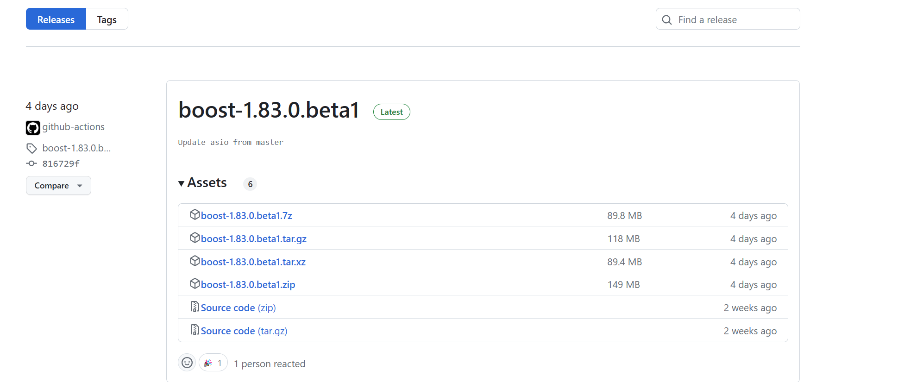

### 方法二：直接用老师给的老版的boost1.69版

Linux上安装boost库的步骤大致和Windows系统上一样。先把Linux系统下的boost源码包boost\_1\_69\_0.tar.gz拷贝到某一指定路径下，然后解压，如下：

```bash
tony@tony-virtual-machine:~/package$ ls
boost_1_69_0.tar.gz
tony@tony-virtual-machine:~/package$ tar -zxvf boost_1_69_0.tar.gz 
```

tar解压完成后，进入源码文件目录，查看内容：

```bash
tony@tony-virtual-machine:~/package$ ls
boost_1_69_0  boost_1_69_0.tar.gz
tony@tony-virtual-machine:~/package$ cd boost_1_69_0/
tony@tony-virtual-machine:~/package/boost_1_69_0$ ls
boost            boostcpp.jam  boost.png      bootstrap.sh  index.htm   INSTALL  libs             more     status
boost-build.jam  boost.css     bootstrap.bat  doc           index.html  Jamroot  LICENSE_1_0.txt  rst.css  tools

```

#### 演示

tar -zxvf boost_1_69_0.tar.gz 

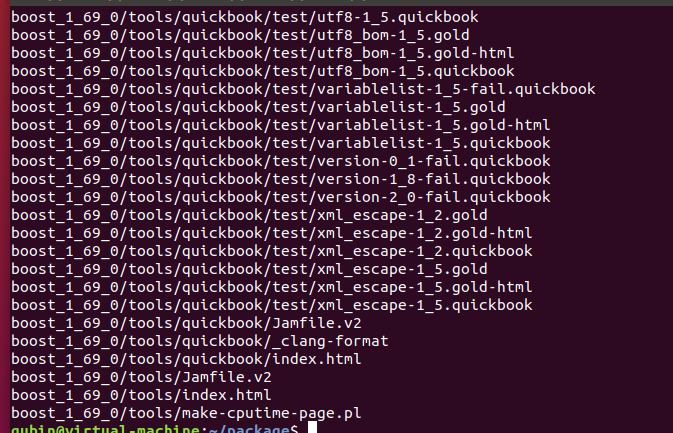


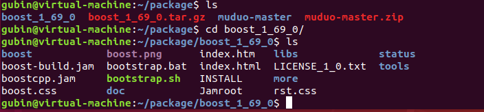


运行bootstrap.sh工程编译构建程序，需要等待一会儿，查看目录：

```bash
tony@tony-virtual-machine:~/package/boost_1_69_0$ ./bootstrap.sh 
Building Boost.Build engine with toolset gcc... tools/build/src/engine/bin.linuxx86_64/b2
Unicode/ICU support for Boost.Regex?... not found.
Generating Boost.Build configuration in project-config.jam...

Bootstrapping is done. To build, run:

    ./b2
    
To adjust configuration, edit 'project-config.jam'.
Further information:

   - Command line help:
     ./b2 --help
     
   - Getting started guide: 
     http://www.boost.org/more/getting_started/unix-variants.html
     
   - Boost.Build documentation:
     http://www.boost.org/build/doc/html/index.html

tony@tony-virtual-machine:~/package/boost_1_69_0$ ls
b2     boost-build.jam  boost.png      bootstrap.sh  index.html  libs             project-config.jam  tools
bjam   boostcpp.jam     bootstrap.bat  doc           INSTALL     LICENSE_1_0.txt  rst.css
boost  boost.css        bootstrap.log  index.htm     Jamroot     more             status

```

运行shell脚本 编译构建程序

./bootstrap.sh 

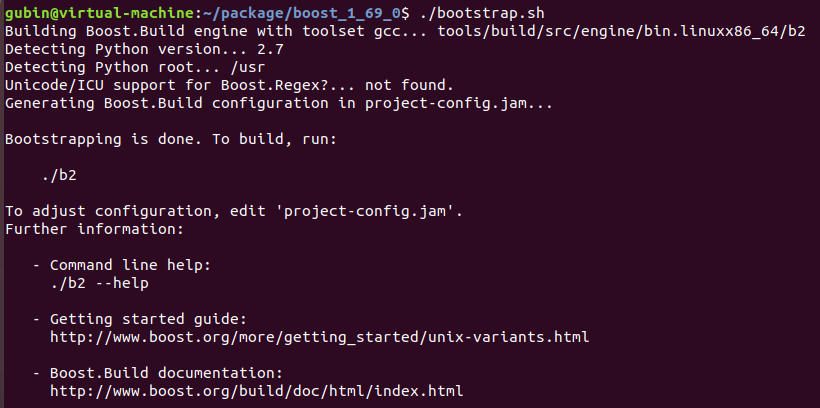

生成了一些新的目录

b2程序

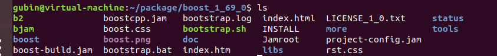

#### 运行b2

源码根目录下生成了b2程序，运行b2程序如下（boost源码比较大，这里编译需要花费一些时间）：  
【注意】：如果Linux系统没有安装g++编译器，需要先安装g++，建议g++4.6版本以上，能比较好的支持C++新标准，可以通过命令 g++ --version 查看g++版本号。

```
tony@tony-virtual-machine:~/package/boost_1_69_0$ ./b2
```

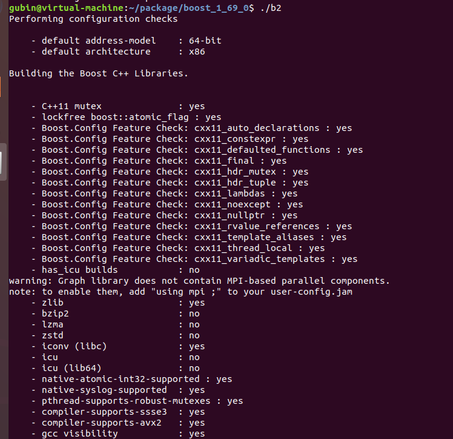


编译完成后，会有如下打印:  
The Boost C++ Libraries were successfully built!

**The following directory should be added to compiler include paths:**

```
/home/tony/package/boost_1_69_0
```

**The following directory should be added to linker library paths:**

```
/home/tony/package/boost_1_69_0/stage/lib
```

#### 演示：失败了

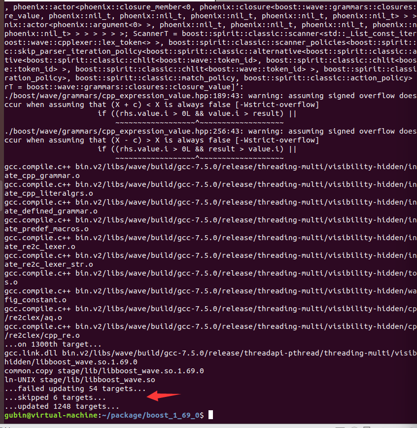

sudo ./b2再来一次  

还是一样

#### 解决方案：上网找问题

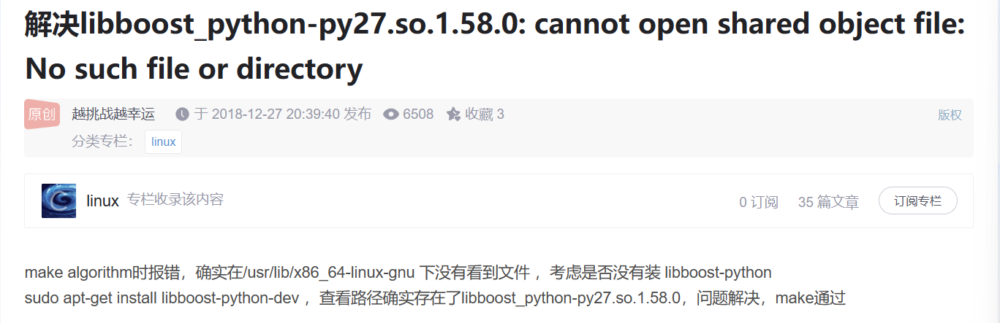

那就按照这个解决

```
sudo apt-get install libboost-python-dev
```

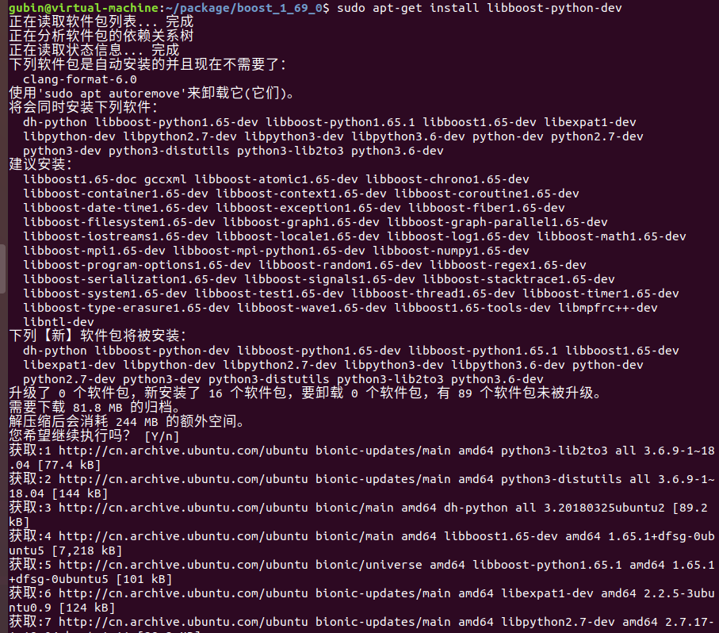


#### 成功解决，安装了boost

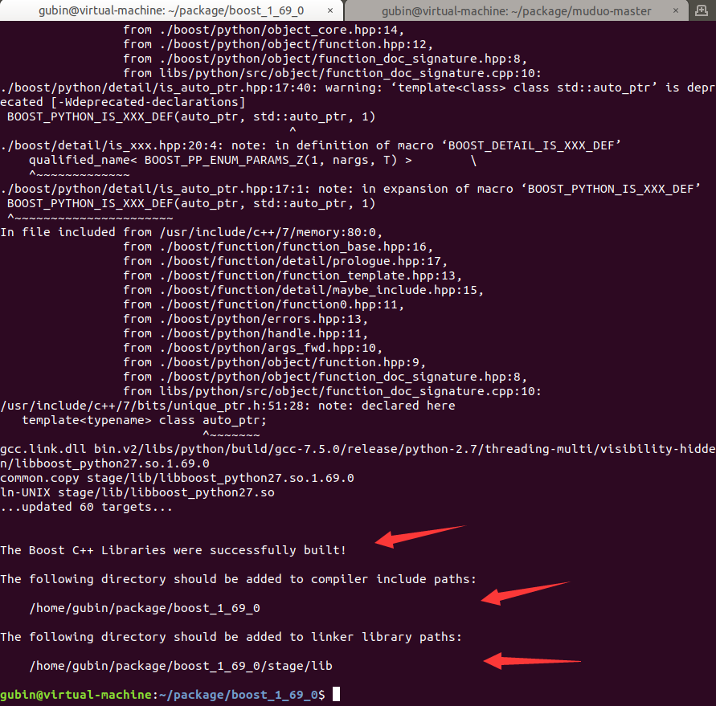


### 环境变量 安装在/usr/local

最后，再把上面的boost库头文件和lib库文件安装在默认的Linux系统头文件和库文件的搜索路径下，运行下面命令（**因为要给/usr目录下拷贝文件，需要先进入root用户**）：

```
su
```


```
root@tony-virtual-machine:/home/tony/package/boost_1_69_0# ./b2 install
```

一直在复制

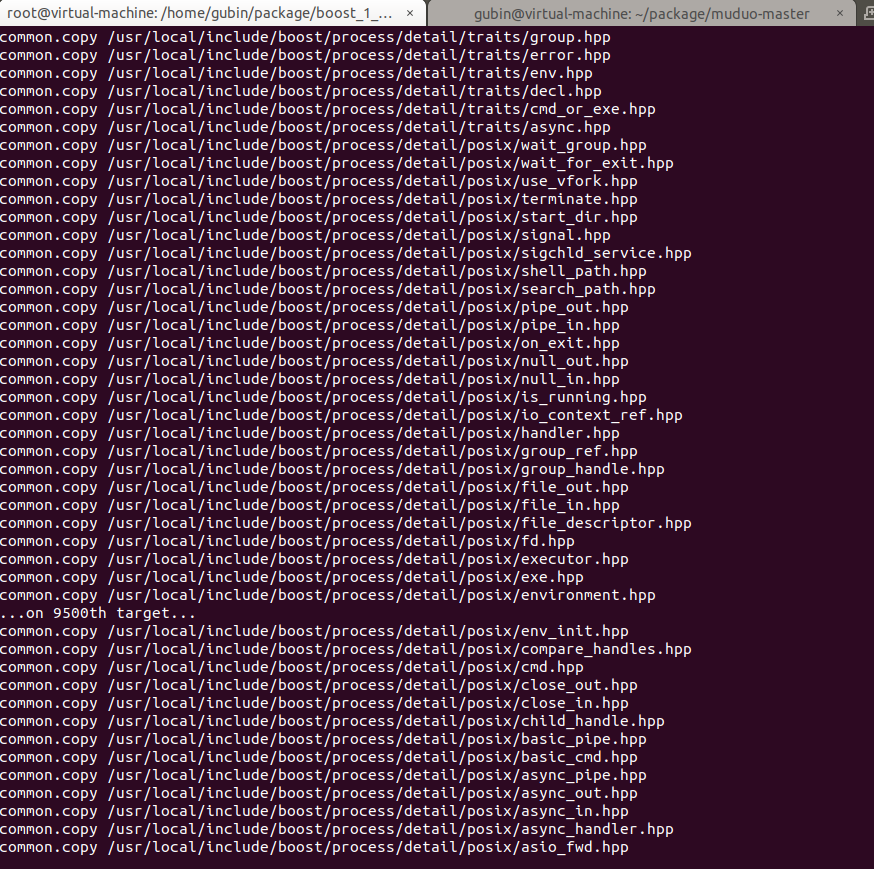

安装完成后，最后会有如下信息打印出来：

```
ln-UNIX /usr/local/lib/libboost_wave.so
common.copy /usr/local/lib/libboost_exception.a
common.copy /usr/local/lib/libboost_system.a
common.copy /usr/local/lib/libboost_chrono.a
common.copy /usr/local/lib/libboost_timer.a
common.copy /usr/local/lib/libboost_test_exec_monitor.a
...updated 14831 targets...

```

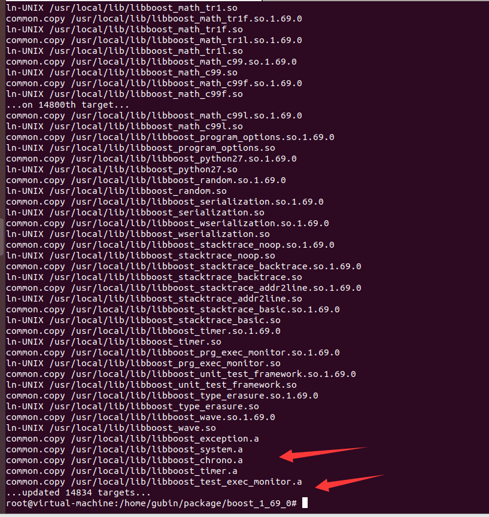


### 验证

验证安装boost是否成功，通过下面的代码验证一下：

```C++
#include <iostream>
#include <boost/bind.hpp>
#include <string>
using namespace std;

class Hello
{
public:
void say(string name) 
{ 
    cout << name << " say: hello world!" << endl; }
};

int main()
{
	Hello h;
	auto func = boost::bind(&Hello::say, &h, "zhang san");
	func();
	return 0;
}
```

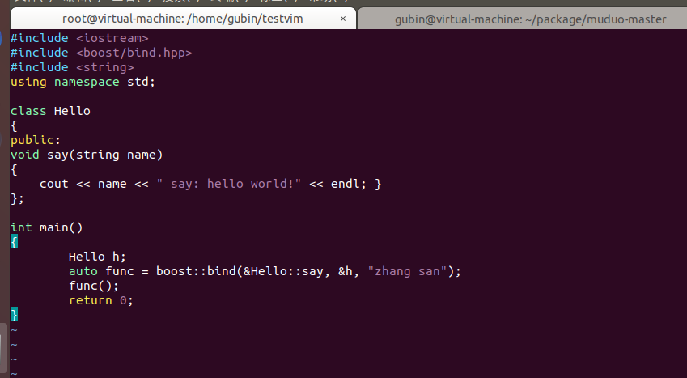

通过g++编译上面的代码，运行打印如下：

```
g++ testboost.cpp -o testboost
./testboost

```

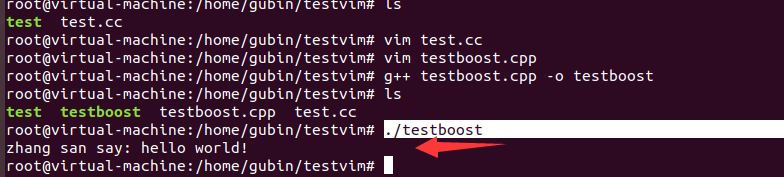

```
zhang san say: hello world!
```

至此，Linux下的boost库安装成功！


# 其他

安装占用磁盘大小

原本是25G

安装过程中

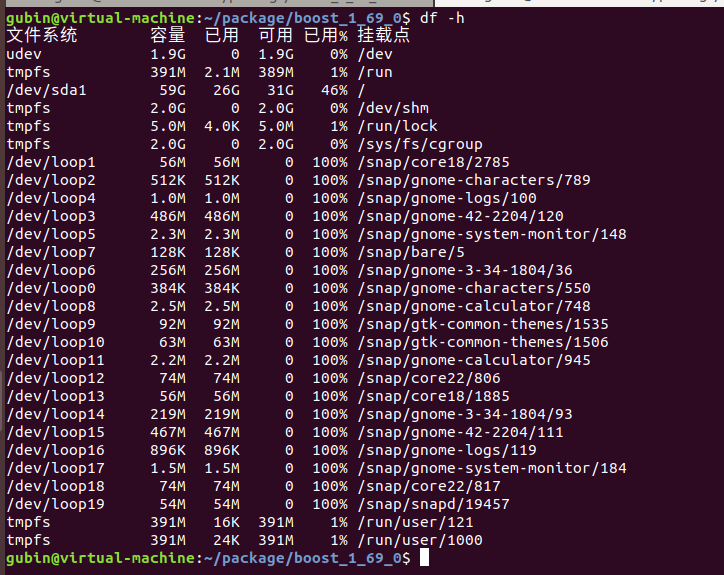

花了2个G

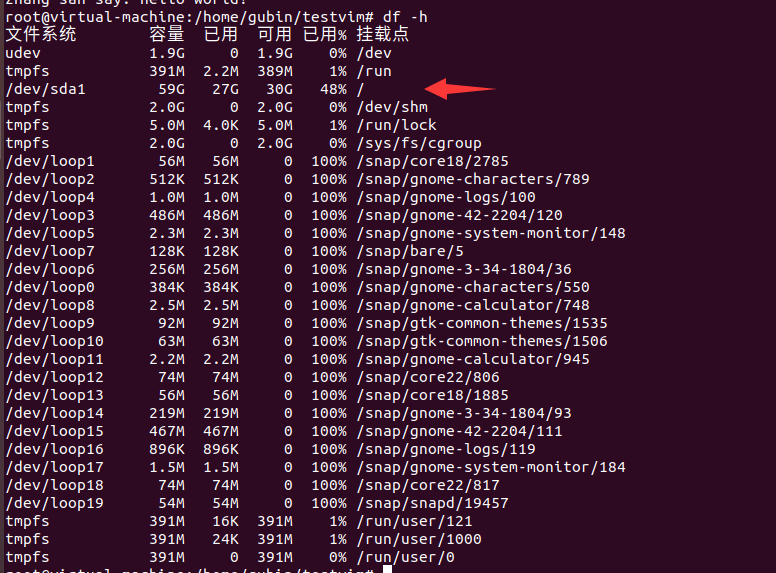
