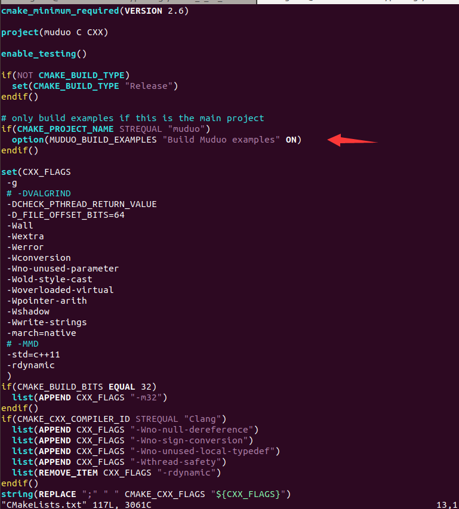
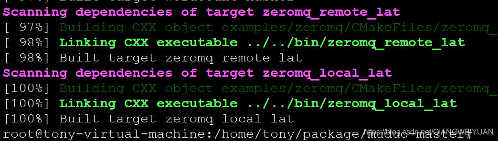
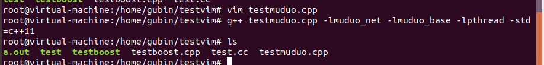

# Ubuntu下安装muduo

## 1.前提环境配置


## 2.从github拷贝muduo源码

方法一：**1.拷贝muduo的源码压缩包muduo-master.zip到Linux系统下**

```bash
root@tony-virtual-machine:/home/tony/package# ls
muduo-master.zip
root@tony-virtual-machine:/home/tony/package# unzip muduo-master.zip
```

解压完成后，进入muduo库的解压目录里面

### 演示


方法二：直接git clone 

```bash
#先创建一个新的目录放源码
mkdir package
cd package
git clone git@github.com:chenshuo/muduo.git
```


但是我发现我还是不应该去clone现在的开发版，应该找release版本


最后想了想，还是跟着老师使用老版本吧。

## 3.安装

### 3.1 vim CMakeLists.txt

**注意**，muduo库源码编译会编译很多unit\_test测试用例代码，编译耗时长，我们也用不到，vim编辑上面源码目录里面的CMakeLists.txt文件，如下修改：  
  
**保存并退出**，继续下面的步骤。

```
vim CMakeLists.txt

```




### 3.2 编译安装

**2.看到有一个build.sh源码编译构建程序，运行该程序（注意：muduo是用cmake来构建的，需要先安装cmake，ubuntu下直接sudo apt-get install cmake就可以，redhat或者centos可以从yum仓库直接安装**）：

拿ubuntu举例，如果没有安装cmake，执行下面的命令安装cmake：

```bash
root@tony-virtual-machine:/home/tony/package/muduo-master# apt-get install cmake
```


然后执行build.sh程序：

```bash
root@tony-virtual-machine:/home/tony/package/muduo-master# ./build.sh
```


最终100%编译完成：  


3.3 安装muduo

**3.编译完成后，在输入./build.sh install命令进行muduo库安装**

```bash
root@tony-virtual-machine:/home/tony/package/muduo-master# ./build.sh install
```

#### 失败报错


### 解决办法

可以发现错误是找不到protobuf库，CURL库


#### 忽略了

发现可以用root用户安装解决

```
sudo ./build.sh install
```


这个./build.sh install实际上把muduo的头文件和lib库文件放到了muduo-master同级目录下的build目录下的release-install-cpp11文件夹下面了：

```bash
root@tony-virtual-machine:/home/tony/package# ls
build  muduo-master  muduo-master.zip
root@tony-virtual-machine:/home/tony/package# cd build/
root@tony-virtual-machine:/home/tony/package/build# ls
release-cpp11  release-install-cpp11
root@tony-virtual-machine:/home/tony/package/build# cd release-install-cpp11/
root@tony-virtual-machine:/home/tony/package/build/release-install-cpp11# ls
include  lib

```


所以上面的install命令并没有把它们拷贝到系统路径下，导致我们每次编译程序都需要指定muduo库的头文件和库文件路径，很麻烦，所以我们选择直接把inlcude（头文件）和lib（库文件）目录下的文件拷贝到系统目录下：

```bash
root@tony-virtual-machine:/home/tony/package/build/release-install-cpp11# ls
include  lib
root@tony-virtual-machine:/home/tony/package/build/release-install-cpp11# cd include/
root@tony-virtual-machine:/home/tony/package/build/release-install-cpp11/include# ls
muduo
root@tony-virtual-machine:/home/tony/package/build/release-install-cpp11/include# mv muduo/ /usr/include/
root@tony-virtual-machine:/home/tony/package/build/release-install-cpp11/include# cd ..
root@tony-virtual-machine:/home/tony/package/build/release-install-cpp11# ls
include  lib
root@tony-virtual-machine:/home/tony/package/build/release-install-cpp11# cd lib/
root@tony-virtual-machine:/home/tony/package/build/release-install-cpp11/lib# ls
libmuduo_base.a  libmuduo_http.a  libmuduo_inspect.a  libmuduo_net.a
root@tony-virtual-machine:/home/tony/package/build/release-install-cpp11/lib# mv * /usr/local/lib/
root@tony-virtual-machine:/home/tony/package/build/release-install-cpp11/lib# 

```

### 移动 /usr/include   /usr/lib目录下 

相当于指定环境变量

mv muduo/ /usr/include/


mv * /usr/local/lib/


拷贝完成以后使用muduo库编写C++网络程序，不用在指定头文件和lib库文件路径信息了，因为g++会自动从/usr/include和/usr/local/lib路径下寻找所需要的文件。


**4.写测试代码，测试muduo是否能够正常使用，如下：**  
把muduo库的头文件和lib库文件拷贝完成以后，使用muduo库编写一个简单的echo回显服务器，测试muduo库是否可以正常使用，代码如下：

```cpp
#include <muduo/net/TcpServer.h>
#include <muduo/base/Logging.h>
#include <boost/bind.hpp>
#include <muduo/net/EventLoop.h>

// 使用muduo开发回显服务器
class EchoServer
{
 public:
  EchoServer(muduo::net::EventLoop* loop,
             const muduo::net::InetAddress& listenAddr);

  void start(); 

 private:
  void onConnection(const muduo::net::TcpConnectionPtr& conn);

  void onMessage(const muduo::net::TcpConnectionPtr& conn,
                 muduo::net::Buffer* buf,
                 muduo::Timestamp time);

  muduo::net::TcpServer server_;
};

EchoServer::EchoServer(muduo::net::EventLoop* loop,
                       const muduo::net::InetAddress& listenAddr)
  : server_(loop, listenAddr, "EchoServer")
{
  server_.setConnectionCallback(
      boost::bind(&EchoServer::onConnection, this, _1));
  server_.setMessageCallback(
      boost::bind(&EchoServer::onMessage, this, _1, _2, _3));
}

void EchoServer::start()
{
  server_.start();
}

void EchoServer::onConnection(const muduo::net::TcpConnectionPtr& conn)
{
  LOG_INFO << "EchoServer - " << conn->peerAddress().toIpPort() << " -> "
           << conn->localAddress().toIpPort() << " is "
           << (conn->connected() ? "UP" : "DOWN");
}

void EchoServer::onMessage(const muduo::net::TcpConnectionPtr& conn,
                           muduo::net::Buffer* buf,
                           muduo::Timestamp time)
{
  // 接收到所有的消息，然后回显
  muduo::string msg(buf->retrieveAllAsString());
  LOG_INFO << conn->name() << " echo " << msg.size() << " bytes, "
           << "data received at " << time.toString();
  conn->send(msg);
}


int main()
{
  LOG_INFO << "pid = " << getpid();
  muduo::net::EventLoop loop;
  muduo::net::InetAddress listenAddr(8888);
  EchoServer server(&loop, listenAddr);
  server.start();
  loop.loop();
}
```

使用g++进行编译，注意链接muduo和pthread的库文件，编译命令如下：

```bash
g++ main.cpp -lmuduo_net -lmuduo_base -lpthread -std=c++11
```


```
g++ testmuduo.cpp -lmuduo_net -lmuduo_base -lpthread -std=c++11
ls
```



### 服务端

编译链接完成，生成a.out可执行程序，上面的echo服务器监听8888端口，运行上面的a.out回显服务器如下：

```bash
root@tony-virtual-machine:/home/tony/code# ./a.out 
20190404 08:00:15.254790Z 42660 INFO  pid = 42660 - main.cpp:61
```


等待客户端连接，可以打开一个新的shell命令行用netcat命令模拟客户端连接echo服务器进行功能测试，命令如下：

```bash
tony@tony-virtual-machine:~$ echo "hello world" | nc localhost 8888
hello world

```

### 客户端


验证

客户端数据回显正确，看看服务器接日志信息打印如下：

```bash
root@tony-virtual-machine:/home/tony/code# ./a.out 
20190404 08:00:15.254790Z 42660 INFO  pid = 42660 - main.cpp:61
20190404 08:00:59.438626Z 42660 INFO  TcpServer::newConnection [EchoServer] - new connection [EchoServer-0.0.0.0:8888#1] from 127.0.0.1:33480 - TcpServer.cc:80
20190404 08:00:59.438707Z 42660 INFO  EchoServer - 127.0.0.1:33480 -> 127.0.0.1:8888 is UP - main.cpp:42
20190404 08:00:59.438812Z 42660 INFO  EchoServer-0.0.0.0:8888#1 echo 12 bytes, data received at 1554364859.438723 - main.cpp:53

```


到此，muduo安装成功，能够正常进行C++网络程序开发！


