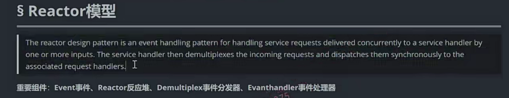
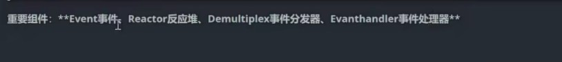

这节课呢，我给大家来说一下reactor模型。

像比较著名的这个muduo网络库，还有libevent啊，

大家在看它描述的时候呢，

介绍的时候都有看到它基于事件驱动的reactor模型对吧？

所以reactor模型还是一个比较常用的啊，非常著名的。啊，在设计高性能网络服务器的时候呢，可以采用的一种模型。

这段英文呢，是reactor模型在维基百科里边啊，在Vicky里边的一个标准的一个解释。

对吧，大家呢？可以把这个英文呢放在这个，比如说你在有道上啊，去翻译一下对吧啊，去翻译一下。啊，

从这个人家原汁原味儿的这个英文的这个原版的描述里边儿去体会一下人家的核心思想。

网上对于reactor模型的介绍呢？也是非常多啊，但是呢，水平参差不齐啊，

所以大家呢，学习的时候一定要过滤沉淀啊，不要把错的东西记到脑子里边。

实际上呢，像在说这些理论的时候呢，我还是不建议大家呢，大篇幅的去说呃，

理论方面相关的知识，我觉得还是大家把复杂的理论呢。沉淀出来，沉淀到核心点上啊，我们再去描述核心点就行了。

所以在这里边儿呢，我不打算给大家长篇大论的去纯理论上去抽象层面啊，

去描述reactor。

## Reactor组件 

## 四个

我告诉大家一个reactor模型，它装的组件就是这四个啊

event事件。reactor反应堆。demultiplex事件分发器。还有event handler事件处理器就这四个，

你在任何的reactor模型里边你都可以看见这四个组件。OK吧啊，那么这四个呢？

你看啊。Reactor反应堆那名字就是对吧？

demultiplex这是一个基于IO复用的一个事件分发器嘛，对吧？

那么这个是分发这个请求，然后处理啊，同步的并发的同步的是吧？to the associated这个绑定的相关的这个请求处理器，也就是说event handler。

那一个reactor模型，它就这四个组件，等我去讲这个reactor模型的时候，

我脑子里边就讲这四个组件之间的这个通信就可以了。是不是啊？

大家先看，我在这里边给大家画的这么一个图啊，画的这么一图OK？

在这里边大家看啊，竖向的，这是一个时序图啊，交互的组件之间

交互的一个时序图 。event，reactor，demultiplex，event handler事件，

反应堆事件，分发器还有事件处理器啊，

我们整个的这个基于reactor模型的这个网络服务器呢，

## 步骤

在交互的时候呢。

首先，我们呢会把事件注册到这个反应堆上啊，

所谓的注册到反应堆上，那就是说呢，我应用肯定是对这个事件感兴趣。

我请求反应堆帮我来监听我所感兴趣的事件，并且在这个事件发生的时候呢，去调用一下相应的我预制的这个回调handler。是不是啊这个handler，

所以我们所谓的向反应堆注册事件，意思就是说呢，

把这个事件event它以及对应的这个handler啊，都给到这个reactor反应堆。

### 简单理解反应堆就是一个容器，存放了时间和处理事件的方法

实际上呢，我们反应堆啊，你就可以理解为它存储了这么一个集合，

唉，存储了这么一个事件以及事件处理的结合。

当然了，你对事件的处理，在实际的使用中，你可以给它加更多更多的选项，比如说添加事件，添加的这个时间啊，事件响应的时间啊。是不是啊？

那这个呢？都是你可以额外添加的一些选项，

在这里边，我们说的最简单一点就是添加的时候添加了事件以及对应的处理器，就是这里边的event handler，一个event对应一个handler。

okay吧啊。那么，这个reactor反应堆就维护了事件event以及handler这么一个集合啊，然后呢？

## 多路复用事件触发器demultiplex

反应堆就可以通过相应的方法啊。实际上啊，如果在这里边儿，

我们多路复用事件触发器demultiplex，我们在这儿把它看成epoll就行了好吧？

实际上，反应堆在这里边，就是通过它提供相应的方法底层，也就是epoll control通过呢add modify或者delete啊。

啊，通过这个epoll control可以在这个事件分发器里边儿，针对于事件进行一个设置调整，那添加新的事件，修改已有事件的呃，修改已有的事件以及把已经添加过的事件进行一个删除，可以修改。好吧啊，

然后呢？启动反应堆以后呢？

在这里边我们反应堆的后端就会驱动这个事件分发器的启动。

这个是多路复用嘛？

多路复用不就是指的是我们的select poll epoll嘛，对吧？

在这里边儿，我们设计高性能的服务器，我们当然采用epoll的模型了。

所以在这里边儿呢，所有的反应堆的这个启动啊，驱动后端的这个多路复用啊，

### demultiplex就是开启epoll_wait

事件分发器实际上就是在开启epoll wait啊，

因为在开启之前呢reactor已经调用相应的方法呢，把用户把应用啊，注册过来的事件进行了添加调整以及删除，是不是啊？

多路复用开启epoll_wait开始我们整个服务器呈现出左侧的状态来等待新用户的连接，或者是已连接用户的读写事件。

OK吧啊，好了，如果呢监听到有新事件产生，

那么多路复用分发器在这分发器就会把这个分发的事件呢啊，

给反应堆返回给反应堆返回哎，

### 为什么给反应堆返回

为什么要给反应堆返回呢？

因为事件发生了，我们在reactor模型里边儿就要调用事件对应的一个处理器嘛啊。

你看the reactor design pattern呃，

这个反应堆的这个设计模式啊is an event handling pattern是一个事件处理的模型。

啊，对于这个并发提交的这个请求啊，

它是一个事件处理的模型，相当于事件回调的模型。

多路复用分发器在这里边呢，进行到事件发生以后，他也不知道事件对应的处理器在哪，

事件对应的处理器都是在反应堆里边维护的嘛，对吧？

所以呢，它把这个事件返回到reactor里边儿，reactor就会找到这个event对应的handler，

我们一般都是通过一个map表来存储。OK吧，

然后调用调用具体的event handler来这个读取，

比如说读取read先读取用用户的请求，是不是the incoming request读取用户的请求？

然后解码，因为用我们实际在通信的时候呢，大家也做过项目了，对吧？

我们数据不可能裸奔在网络上，我们一般都是要通过序列化，反序列化协议，

比如说json，比如说protobuf来对数据进行封装的，

那么在我后端服务器这里边儿接触到用户的incoming request的时候呢，

我们就会读先读过来数据，然后进行decode就是解码，解码就是这反序列化，

对吧？然后呢再进行处理compute计算或者业务逻辑处理，

处理完了以后再进行这个encode就是打包。就编码或者叫数据的序列化，

然后再send再发送到网络上去也就是说，给用户进行一个响应。

## 小总结

好吧啊，那整个的这个reactor模型的这个组件啊，四个组件以及组件之间的交互模式，每一个组件里边儿它做的事情都是什么，我就给大家描述了一遍。

### event reactor handler

简单来说event就包含了我们在编写网络程序的时候呢，包含了这个一个具体的fd事件嘛，我们对socket的事件感兴趣嘛，对吧？

呃，什么事件呢？啊，读写或者还有其他的一些信息是不是啊？

那epoll就是那些epoll i ne po out，这些都是事件类型。

啊，然后handler注册到这个reactor上，

reactor就维护了这个事件以及事件处理器的这么一个集合啊。

### demultiplex

然后呢，通过相应的方法呢，可以给多路复用分发事件分发器呢啊，添加就是epo control嘛，对吧添加？调整删除事件啊，

### 反应堆启动

然后呢，反应堆的启动就会驱动呢事件分发器的启动。

啊，来监听相应的事件，事件发生以后呢，

会返回给这个把事件列表返回给这个reactor 呢，

==就会去在map表找到这个event对应的事件处理器来调用，在这个event handler里边儿，==

主要从大的方向就是做四件事情，

先读取用户的请求read，然后再进行反序列化，也就是解码encode操作，

然后进行业务逻辑处理，compute计算对吧啊？

然后再进行编码操作，把处理的结果呢进行编码，也就是数据的序列化，

然后再send通过网络给用户返回一个请求对应的响应。

好不好啊？这里边儿呢？

我们说的这个相当于就是一个single reactor。

底下呢，我还给大家附了一个muduo库，实际上muduo库是一个multiplex reactor。

也就是说呢，这相当于就是一个reactor。

是吧啊，实际上呢呃，我们还有multiplex reactor。

实际上，在这个图，我一会来给大家解释啊。

这个图我来给大家解释，像在这种图里边呢呃，

就没有体现这个demultiplex。

啊，没有体现这个多路事件分发器好吧啊，

实际上这里边儿画的这个reactor呢，指的都是事件分发器。

就是大家呢，学着学着，你要能够去区分，要能够人家理解人的意思好不好啊？好了，

那么这个先看清楚，然后我再解释底下的。

通过这个图的解释，我相信大家对于reactor模型以及它重要的四个组件，它们怎么交互，它们分别都完成什么样的这个事情应该是明白了吧？

哎。我觉得应该问题不大了啊。

啊，在这儿呢，我再来解释一下，这是网上比较流，就比较这个流行的啊muduo库的这么一个reactor模型啊。

呃，是基于它的这个muduo库的代码呢？来画出来的。

实际上呢，大家可以在这里边这样去看一下啊，在这里边呢，相当于是。什么呢啊，相当于是这样子的一个操作，

就是这里边儿的mei reactor sub reactor所谓的反应堆啊。

实际上呢，在这里边儿就是都是代表着我们实际上啊，

反应堆里边儿的这个事件，分发器的组件就是这个。对multiplex is。啊，由他们监听到具体的事件的发生，然后调用事件的回调，

你看这就是read decode compute。读取用户的请求。嗯，解码计算编码再给用户返回，是不是就是我们刚说的疑问的handler做的事情啊？

就事件发生了，调用事件相应的这个处理器啊？

你看呢，这个实际上呢，在这里边这个图上呢呃，我觉得画的不太准确，我觉得呢，

他应该把什么画出来啊？把这儿都画成给multiplies，画成事件分发器啊！

reactor主要就是存储了事件以及事件对应的处理器。仅此而已。

okay吧啊，仅此而已，所以呢，在这里边化成reactor呢。啊，不太准确，

那么为什么人家画这儿呢？

实际上啊，这个图上这样画的意思就是把reactor跟demultiplex怎么样啊？

合二为一了，也就是说这张图上的这个reactor实际上唉，就是表示的是中间这两个竖杠中间这两个逻辑

就是把我们这张图上的reactor跟demultiplex这两个组件合二为一了，统一叫做reactor。

OK吧啊啊，我们在上边刚说的时候呢，一个reactor模型有四个组件，是不是啊？实际上呢，我们epoll wait在这里边，

我们没有必要，只有一个线程，是不是作为我们的事件循环？

我们可以开启多线程啊，对不对？唉，可以开启多线程，每个线程都进行事件循环了，我们不经常说，

比如说我CPU是四个核，那我就开启四个事件，

循环一个IO线程，专门监听新用户的连接线，

剩下的三个线程专门监听已连接用户的读写事件。

对不对？如果再有耗时的IO操作，比如说是传输文件，

我单独开线程是不是去处理那些耗时的IO操作啊？

呃，经典的模型就是这个样子嘛，所以在这里边这个Main reactor or sub reactor相当于就是我们这里边reactor multiplex的合体。

好不好啊？代表不同线程的这个事件循环啊，

事件循环完成以后呢啊，根据事件对应的这个handler进行请求的这个派遣啊，

分发对吧，再处理请求。

好的吧啊，那么我希望大家下一次呢，再去描述reactor模型的时候呢？

啊，能够把这张图列出来。把这四个组件说清楚。我觉得就很完美了。

## 结尾

好，那我们这节课的内容呢？主要内容就给大家说到这里啊，

那我们后边呢再去写目录库代码的时候呢啊，

写完以后也希望大家再能够反过头来在我们写的代码上再去找一找muduo库上的代码的event表示的是哪一些相关的这个模块reactor表示哪些相关的模块？

事件分发器是哪些相关的模块儿？

even handler是哪些相关的模块儿啊？

理论结合这个代码，事件理解起来呢就更好了。