那么我们现在啊muduo库的代码现在写完了啊，

使用muduo库的TCP server，

我们很快的建立了一个性能非常不错的。基于事件驱动的IO复用epoll加线程池这么一个模型的网络服务器。

对吧？现在我们去运行，它看一看结果。

我发现啊，这里边儿ld  ld是链接器的名称对吧？

有很多的链接错误，并不说这些方法，我没定义。

只不过这些方法人家是muduo库，在人家相应的这个库文件里边儿呢，

我们之前呢，可能大家写的简单代码不需要链接外部的库。

但是现在不行了啊，这需要在VS code上进行配置。

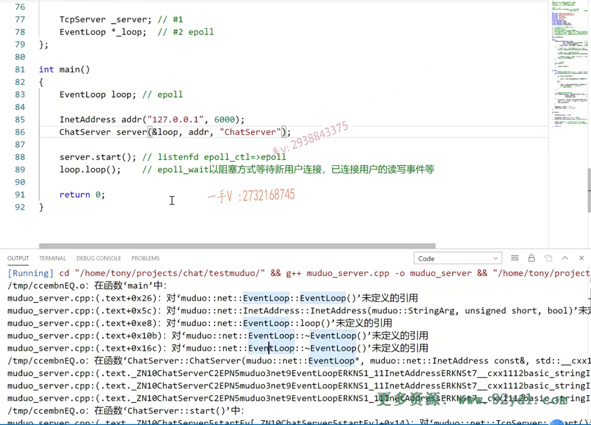


那么，暂且先不说配置这件事情，大家也可以直接在terminal上，

你用这个xshell也行。或者是VS code远程连接以后呢，

人家本身第二项terminal里边儿就有对吧？

你没有的话，你可以点这加号弄一个呗。选择这个bash 

bash就是这个命令行嘛，对吧？你还可以有多个？

这个split terminal翻个书啊，可以三个是不是？

不想有哪个了的话呢？鼠标点到这儿点这个。回收站啊，就可以了。


大家来看啊，在这儿呢，是我们这个项目里边现在有test json跟test muduo，对吧？

我进入这个test muduo。

这个terminal会直接切到你当前这个工程目录下来的。

这是有这么一个文件啊，你如果自己去编译的话，

那就是就像这样的链接muduo net啊。muduo base

有muduo base也有muduo net啊？那么net还有谁啊？p thread因为muduo库它里边儿的这个线程本身用的就是pthread库啊，


那么编译一下。没有写我们的这个文件是不是？muduo server点cpp啊。okay，在这里边诶，我们看看啊。

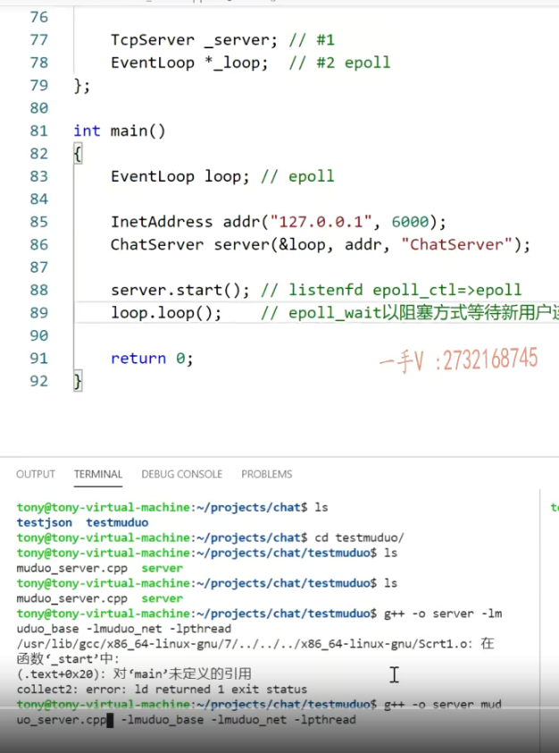

## 链接顺序有关

那这应该是muduo net在前边，对吧？因为muduo base，

它可能也链接了这个muduo net。所以呢，这有依赖关系的啊，有依赖关系的。像这个pthread就得写到最后面，因为他们前边呢，都依赖这个pthread了。

OK，那就是这个样子了，在这里边把犯的错呢，也给大家都看一下啊。先写muduo net，因为muduo base里边也依赖了这个so库好吧。

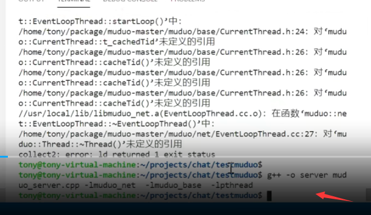

OK在这里边，我们编译出来了，


## 利用talnet检测

这个可执行文件在这儿呢，我们就直接可以运行它。

运行起来了，这是一个TCP服务器，

我们可以用talnet检测一下幺二七点零点零点一，刚才我们这也是主机的6000端口是吧？6000。

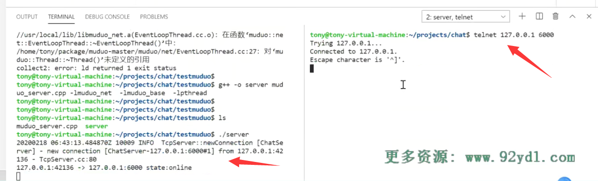

嗯，大家看连接上了，你看看这儿是不是就有muduo库的一个显示呢？

TCP server new connection你一个新的连接啊chat server这个服务器的名称是check server new connection。

from。这个啊，这是我们的打印，就是我们在的打印，这是对端的，是幺二七点零点零点一四二幺三六，这是我们客户端的端口是吧？

连接到了幺二七点零点零点一六千这个端口state，现在是online上线了

## 发送数据

OK吧？然后我发一个hello word。诶，你看回显回来了对吧？

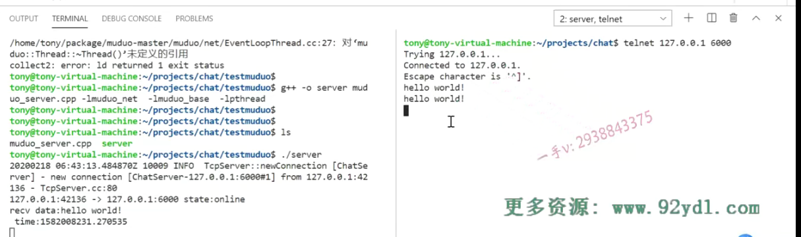

回显服务器那么在这儿呢，你看就received at a hello world，


==这里边on message，这里边就被响应到了==。

啊，还打印了时间，然后他又把接收到的数据呢在。

==按同一条连接上再发送回来，那么说hello world。==

没问题吧呃，那么。

再发一个啊，正常。

## 退出

然后呢？我退出。

你看退出了以后呢？这是telenet相当于一个TCP客户端啊，这完了以后呢？你看啊诶，这就显示了，

==你看on connection。证明on connection这个函数又被回调了==，

我们之前说了这个就是连接新连接创建以及连接断开都会响应的connected，

当然是FALSE了，所以进入else这里边儿打印了这个客户端到这个服务器state是什么offline？这个下线了，

我们服务器端就把相应的跟这个客户端通信用的。socket fd呢，直接给close掉啊，==你看这里边muduo库底层也有这个info的打印==啊，

remove connection in loop就是在事件循环里边儿呢。就把相应的这个什么东西啊，相应的这个连接就释放掉了，这就是一次完整的通信啊，

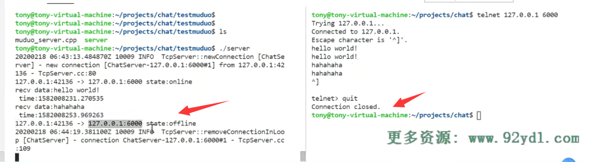


再来一个客户端又连接上。new connection是不是又连接上了？

这回这个客户端分配的这个端口是四二幺四二，跟刚才不一样。

是不是再进行通行？好的吧啊，再退出。

==这个talnet里边退出是ctrl，加上这个。方括号啊，右边这个方括号。quit.退出了==，这边有一个remove connection，

这个到这个端口呢state offline下线了。没问题吧？

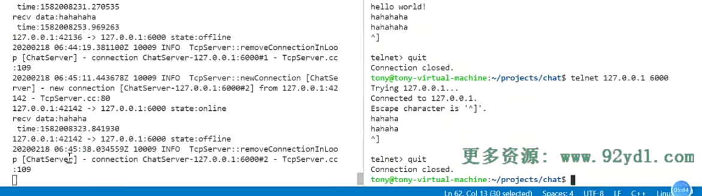


唉，这样呢，我们就很容易就写出了一个什么东西啊，写出了一个非常

健壮的这个基于事件驱动的IO复用的这么一个网络服务器。

关掉它。没问题吧啊，在这里边大家注意一下啊。


嗯，实际上你不想，你如果不想做这个VS code的配置的话，你这样去自己在。

这个shell上啊，直接去编译运行它啊，没有任何问题的啊。

这是一种途径，那么因为我们前边儿给大家说过VS code呢，不能算作IDE，不是集成开发环境好吧？

你点个按钮，这个编译点个按钮运行是不是还有项目？

有什么基于图形界面的配置啊？让你输入库路径啊，链接的库库的名称啊，头文件的这个路径啊，搜索路径啊，

这些东西呢都没有现成的，你直接可以写它，它需要通过配置文件。来配置啊，这个可能使用起来就稍微有一定的成本儿，对于有些同学不熟悉的同学来说。


### 演示

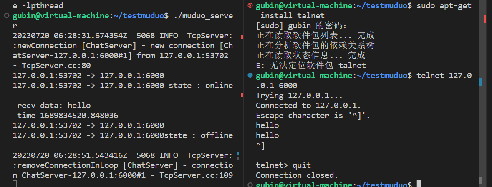


## vscode写代码

就是简便的话呢，你通过可以通过VS code，它有非常好的这个代码提示智能补全对吧？

你开发我们的项目啊，管理我们这个项目工程里边的所有的不同模块的文件，你可以用VS code

## linux下编译

让你编译的话呢，你可以直接在terminal这里边shell下直接编译，或者说是在xshell上啊。远程连接你的linux去编译运行，

这是没有问题的啊。


## vscode配置

那么，既然都已经说到这儿了，我再顺便啊给大家说一下，

基于VS code的一些常用的配置啊。

### F1打开配置对话框

那么在这儿大家来看你，可以先按f1这里边儿就可以把配置的这个对话框啊，给它打印出来。啊，打出来呃，

### 输入edit,选择c++edit configurations

因为我们现在是一个cdp文件，那肯定就是CC或者CA加文件了，对吧？你输入这个edit，你就会找到呢？

这个c++edit configurations json，你点击一下这个。

这个呢，相当于就是我们的一个编译的配置文件啊

VS code编译配置文件，还有它相关的配置文件都是json格式的啊，

都是json格式的，我们这个项目中啊，就会用到json。


对吧，那么在这里边儿啊，大家一般去写一个什么东西去写一个。命令的话啊，不管是用g++还是GCC，

一般来说你杠i后边儿写的是什么头文件？是不是搜索路径啊啊？

还有杠L，这是库文件，是不是搜索路径啊？

还有杠小l，这是什么？这是库的名称。是不是库的名称啊？

哎库的名称

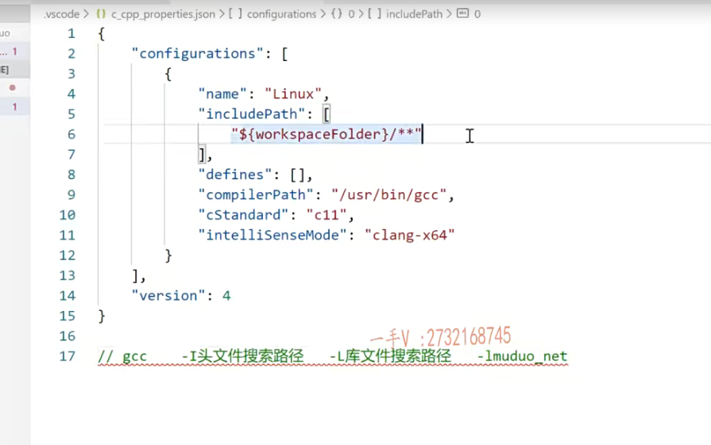

### include path文件搜索的路径

那一般在这里边include path呢？

在这儿你就可以加。你这些文件的搜索路径。

好的吧啊，文件的搜索路径。


那编译的所有链接的库的名称呢？

不在这儿写，就是include path，你可以添加搜索路径的好吧？

### /usr/include /usr/local/include默认搜索路径

呃，一般呢，如果说是在usr include或者说是usr这个local include

这两个一般头文件的这个路径呢，都是我们程序环境变量里边默认就包含的头文件的搜索路径，如果在这两个路径里边，你就不用在这儿加路径了。

### /usr/lib /usr/local/lib默认搜索路径

啊，没问题吧？同样的跟lab一样。

你要链接的这个静态库点儿a静态库点儿so动态库啊，如果在这两个user lab user local lab下。

那你也不用在这儿加头文件的这个，这这个文件的搜索路径了啊，

因为这两个是默认会去搜索的，


如果有自定义的路径的话，需要加上，否则它就找不到相应头文件或者库文件啊。好这个呢，就给大家简单说一下。

### cppstandard

还有呢，你看啊，在这里边儿，你还可以写什么东西呢？cpp standard。啊，有位同学，你建了一个这个C++文件，然后呢？想用一下C++幺四幺七的一些新的什么新的语法对吧诶，发现了怎么不识别呀啊不行，实际上它默认起来的都是C++11的啊。

那你可以在这儿cpp 就是C++嘛，标准诶C++幺七的标准，

支持C++17的标准。对不对啊？

那支持14的标准啊？支持11的标准。你可以在这儿去配置你的语言相关的一些选项。这是c_cpp properties case。没问题吧，

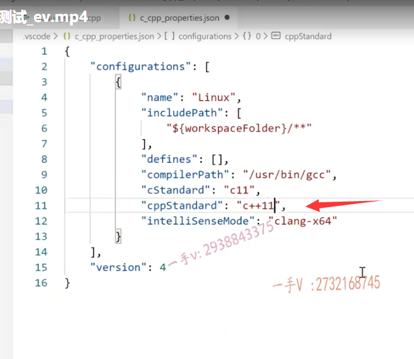

### ctrl+shift+b

然后呢？你还可以呢，怎么样啊？

嗯build编译

编译是build首字母是b是吧？ctrl shift b啊，

大家来看一下。在这儿呢，就是g++ build，

我现在是一个C++代码，当然是g++了啊，后边有一个齿轮。

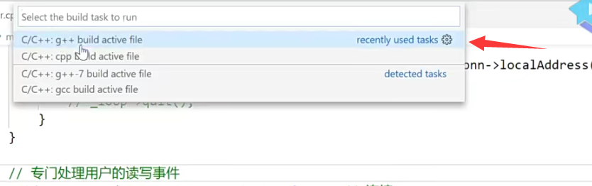


啊，我点一下，大家会看到有一个什么啊tasks.json

是不是实际上一个VS code它的这个工程啊，里边儿就三个配置文件，

一个是cc bp properties点json，一个是tasks点json，还有一个launch点json 

launch点json，主要是调试用的。而我们现在呢用不着，

其实呢，我们写服务器代码，我觉得调试的话，大家尽量去terminal上用GDP，自己去调试去。


好吧啊，也熟熟悉熟悉GDP调试的这个方式啊。

呃，那么在这儿呢？大家来看一下这个command，大家就看啊，

是用g++进行编译的对吧啊？user bin j++。

args这也相当于就是我们g++命令后边儿的一些选项。OK吧，

### 配置args选项

那在这儿呢，既然有选项啊，就命令后边的选项吧，那杠l muduo什么net？嗯，杠l muduo base，我是不是把这些选项就都可以写到这里边儿啊p thread？这是我需要链接的。

库muduo库还有p thread库线程库。都可以接到args里边。

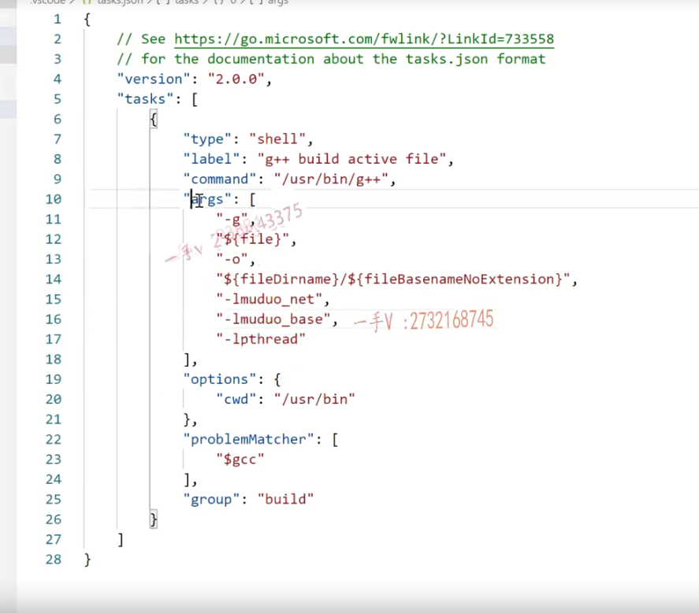

#### 演示

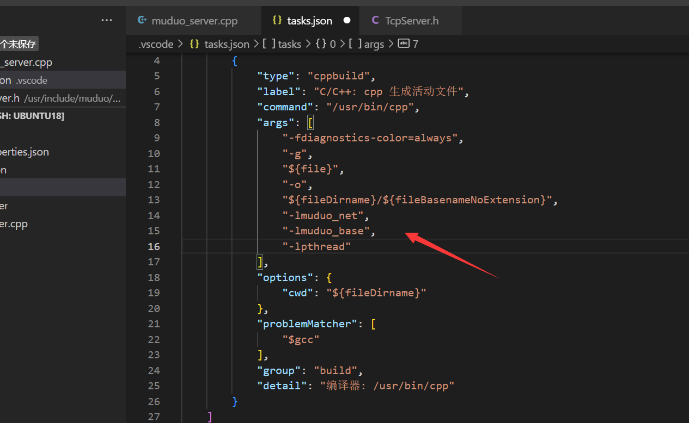

这个能够了解吧啊，写好了以后呢？

你看啊，我切到这个muduo server点cpp里边儿。

那在这儿。我ctrl shift b

把这点一下g++ build。就只是做了一个编译操作。

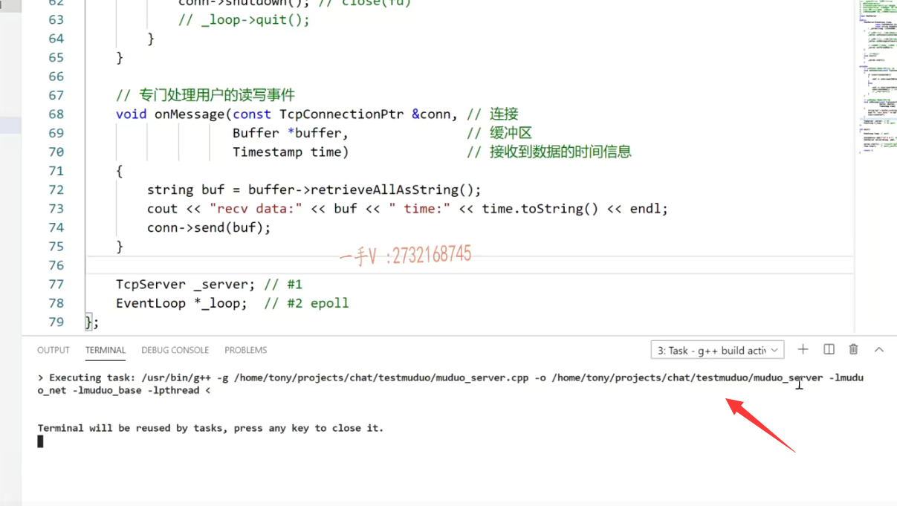

#### 演示

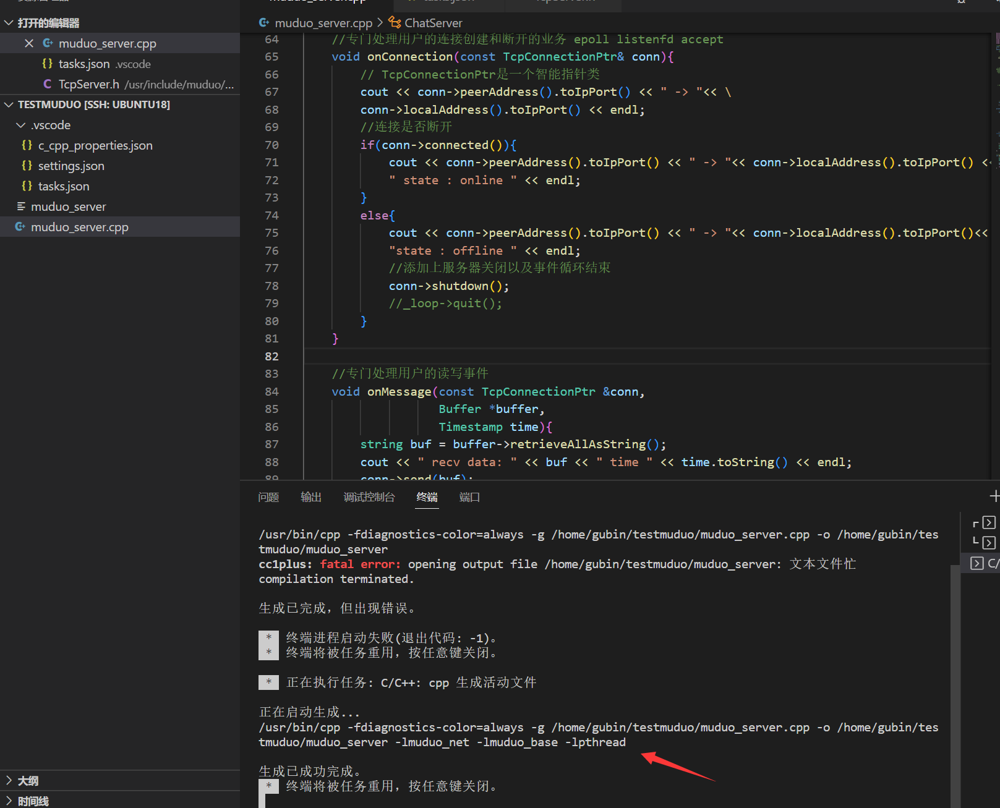


那么大家现在在这看啊，这是g++ g这后边的原文件的名称，杠o生成的可执行文件的名称，

后边杠l muduo net杠l muduo base杠lp threat是不是就都生成出来了？

没问题吧诶，生成出来了。

生成出来了，以后呢，我们可以在这看一看诶，你看这儿有没有刚才生成出来的muduo杠server啊？有吧muduo杠server。

启动啊，一样的。退出。啊，服务器就识别关闭了，有一个connection被remove掉in loop，是不是OK？

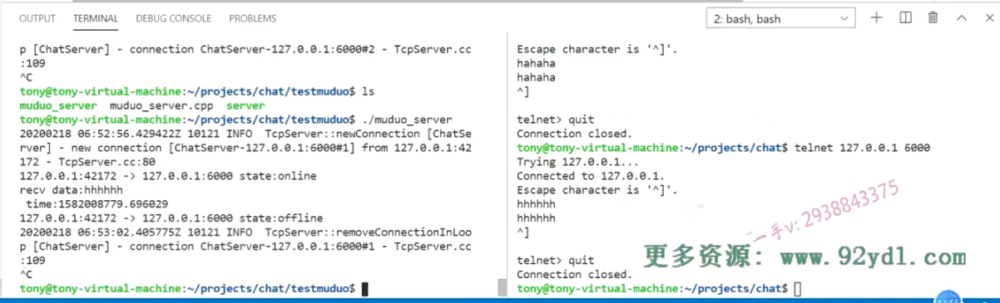


## 总结

这就是给大家介绍了一下它的一些操作方法啊，需要链接外部库的话呢，

我建议同学们在linux上开发，还是多用一下shell的命令啊。

这样呢，可以多多熟悉一下，它包括代码的调试啊，

我们借助VS code在这里边主要做的就是一个方便我们输出代码对吧啊，

管理项目的文件。

啊，当然了，你也可以在这里边儿task点，json里边儿呢去。

配置相应的命令。所要依赖的一些库啊，直接通过呢VS code进行编译，

得到最终的可执行文件好吧啊。


ctrl shift+b啊。build嘛，是不是？

好，那现在呢？到这里大家也可以呢，照着我这节课所讲的，把这个代码编译运行起一个talnet为一个TCP客户端测试一下你这个服务器到底是否按你所想的方式在运行，

你的输出的这些代码呢？是否都被调用到了？

啊，再加深一下，对于muduo库的一个使用的这个理解啊，

它非常的。使用起来非常方便，非常方便。好，那这一节课的内容呢？我们就给大家讲到这儿。


# 其他

一开始写的时候一些细节没注意


在你的代码中，出现了几个编译错误。让我们逐个解决它们：

1. 错误：`expected ';' after class definition` 这个错误是因为在类定义结束后没有加上分号。请确保在类的定义后面加上分号。

2. 错误：`invalid use of non-static member function` 这个错误是因为你在绑定回调函数时，使用了非静态成员函数。

   

   ### bind函数绑定非静态成员需要依赖对象实例

   ==在使用`bind`函数绑定成员函数时，需要注意，非静态成员函数的调用需要依赖对象实例，因为它们隐含地有一个`this`指针。==

   

   为了解决这个问题，你可以将成员函数改为静态函数，或者使用`std::bind`绑定时，将`this`指针传递进去。

让我们修改代码以解决这些问题：

```C++
#include <muduo/net/TcpServer.h>
#include <muduo/net/EventLoop.h>
#include <muduo/net/InetAddress.h>
#include <iostream>

using namespace std;
using namespace muduo;
using namespace muduo::net;

class ChatServer {
public:
    ChatServer(EventLoop* loop, const InetAddress& listenAddr, const string& name)
        : _server(loop, listenAddr, name) {
        // 绑定连接回调函数，注意传递this指针
        _server.setConnectionCallback(std::bind(&ChatServer::onConnection, this, _1));
        // 绑定消息回调函数，注意传递this指针
        _server.setMessageCallback(std::bind(&ChatServer::onMessage, this, _1, _2, _3));
    }

    void start() {
        _server.start();
    }

private:
    // 连接建立/断开回调函数
    void onConnection(const TcpConnectionPtr& conn) {
        if (conn->connected()) {
            cout << conn->peerAddress().toIpPort() << " -> " << conn->localAddress().toIpPort()
                 << " state : online " << endl;
        } else {
            cout << conn->peerAddress().toIpPort() << " -> " << conn->localAddress().toIpPort()
                 << " state : offline " << endl;
            conn->shutdown();
        }
    }

    // 消息到达回调函数
    void onMessage(const TcpConnectionPtr& conn, Buffer* buffer, Timestamp time) {
        // 处理接收到的消息
        // ...
    }

    TcpServer _server;
};

int main() {
    EventLoop loop;
    InetAddress listenAddr(9877);
    ChatServer server(&loop, listenAddr, "ChatServer");
    server.start();
    loop.loop();
    return 0;
}

```

上面的代码将非静态成员函数改为静态函数，并在构造函数中使用`std::bind`绑定回调函数时传递了`this`指针。这样，编译错误应该会被解决。记得在编译时链接正确的`muduo`库，包括`-lmuduo_net`、`-lmuduo_base`和`-lpthread`。