上节课呢，我们把时间类time stamp也写了啊。

时间类加上合适的注释。

呃，这两个类就是时间类跟日志类呢，是跟其他不相关的啊，

我们写到这一部分的话。

啊，我们写一段儿就给大家进行一个编译啊，

以免把所有的错误都留到最后解决起来呢，比较麻烦。

那么，我们先来看一下编译啊。

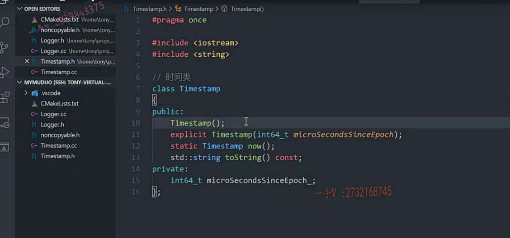

==鼠标打到这个cmakelists右键build all projects。==

它就用cmake来构建哦，有错误。

看一下前面是通过这个cmakelists。然后生成makefile文件，

然后这儿开始启动make对吧啊？这儿启动make。

make的话呢，你看这个timestamp原文件生成了。

这儿也logger日志也生成了。

链接也100%了，但是链接的时候出现错误啊。

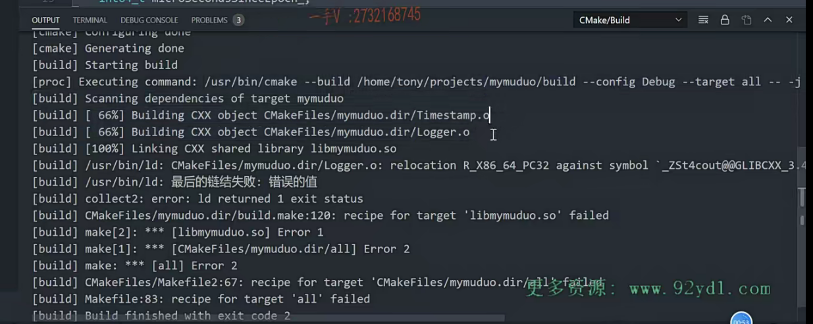

啊，这个好像是一个常见的错误啊，这个是跟编译器有关的，

我这个编译器特别的新啊GCC。

那么，大家看往后看，这有一个recompile with杠f pic，大家如果自己用GCC或者g些加编译过这个动态库的话。

你应该见过这个选项啊呃，编译动态库GCC或者g加加有一个share杠FPS e生成这个符号位置无关的啊，这个动态库。

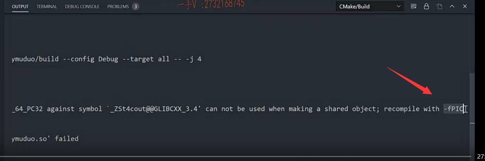

那么，如果你提示这个没关系啊，大家打到这个cmakelist里边，

在这编译选项这里边呢？加上这个杠f pic。就可以了，

人家都说了recompile with杠f pic啊，编的时候加上这个编译选项。

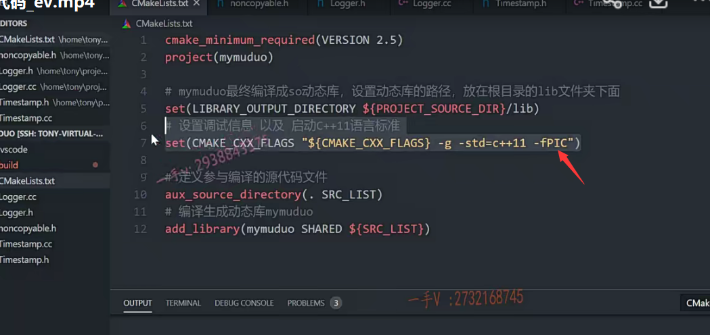

我们重新去处理一下。clean rebuild哦，清理一下，然后再重新编译。

OK，那这个就编译成功了，

生成了lab my muduo点so我们这里边儿生成so库对吧？

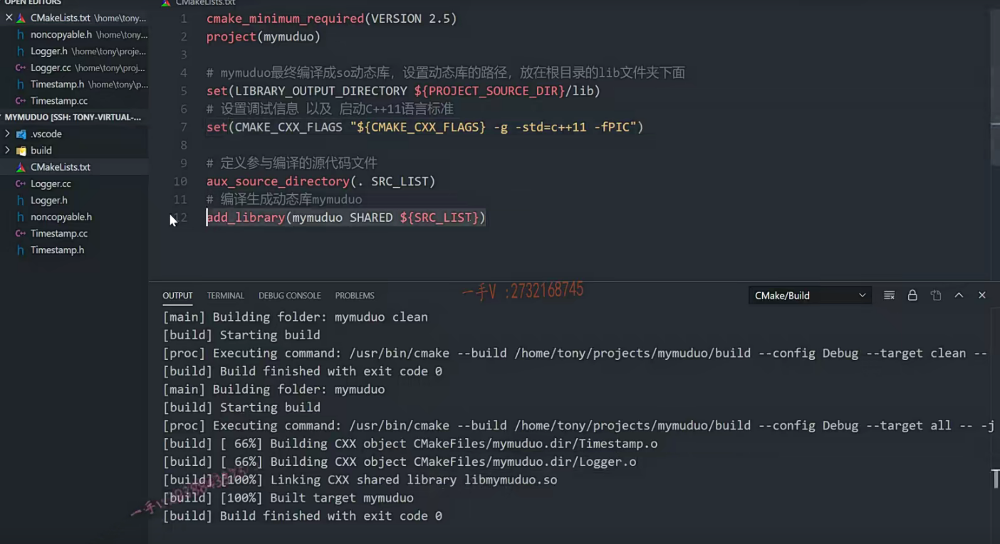

诶，但是这里边好像是这个lib。

mymuduo点so没有生成到我们期望的这个项目根目录的lib文件夹下。

就直接生成了b的目录下了。

#### cmakelist出现了点错误

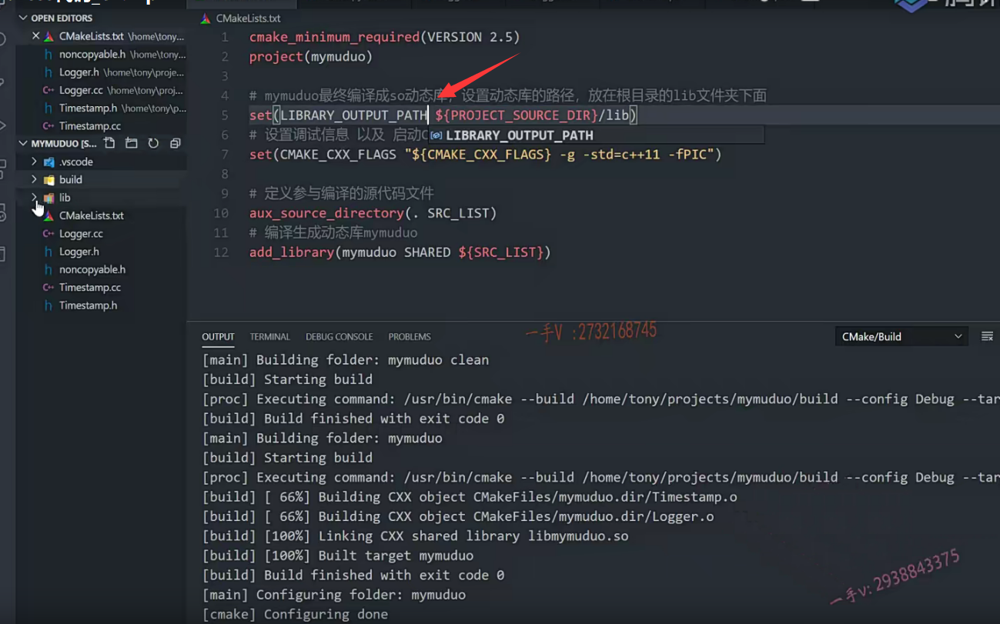

### 正确编译

对吧？同学们注意啊，这是library output path 不是directory。

注意一下，你看你保存一下这里边cmake就直接帮你更新了啊，

应该是我们的VScode帮我们做的对吧啊，直接更新了。

这是生成了这个lib，我们重新构建一下这个项目。

clean rebuild all projects.

大家来看这个so库生成成功了，你看是不是就在lib文件夹下啊

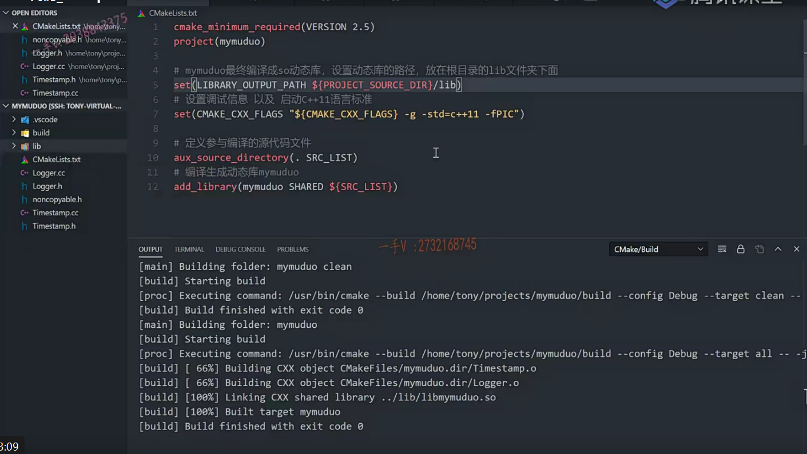

OK，这就是符合我们的期望啊，注意这里边不是directory，是path

我们最终库所放的输出的这个路径啊

path是路径的意思，对吧啊？

不管是静态库还是动态库啊，我们都输出到这里边指定的根目录的lib文件夹下好。

嗯，到目前为止是编译通过的这两个基础类，

我们现在输出完了呢，我们今天这节课继续来看啊。

我们看TCP server就是我们用muduo库编程，这个编服务器程序的这个入口的这么一个类，

我们经常自定义一个类，然后把TCP server对象组合一下，对吧啊？

这个呢？你当然我说的这个就是说muduo库的一个使用方式。

## Tcpsever类观察

你如果相对熟悉muduo库的使用的话呢，

编写服务器程序的话啊TCP server你应该不会陌生。

那在这里边儿大家看一下啊TCP server的构造函数，

它需要一个event loop就事件循环。

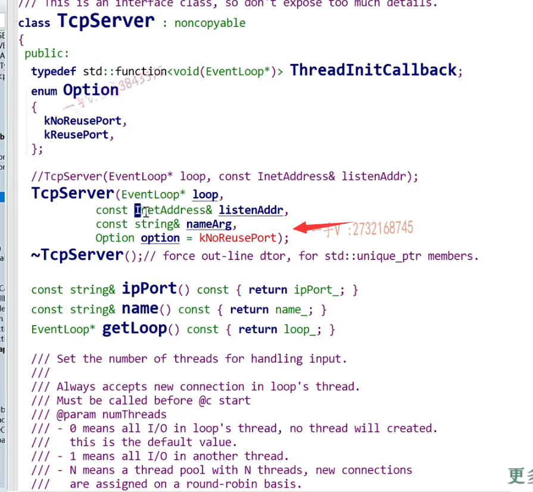

还记着没？我们给大家说reactor的时候，这个事件循环相当于就是这个多路分发器啊，多路事件分发器。

相当于就是我们的epoll嘛，对吧啊epoll？

这里边儿需要一个epoll这个eventloop，事件循环肯定是比较大的。

net address大家在编代码的时候应该用过这个啊，

因为你需要先定义这么一个对象来打包IP地址跟端口号来作为TCP server对象的构造函数的参数传进来是不是啊？

这个我们需要去处理一下，这也是个非常小的类，我们提前处理处理一下。

我们把边边角角的先处理完，

最后我们再说到核心的这个类进行一个详细的讲解啊。

### TcpServer成员变量

那他下边呢，看成员变量有什么accept or

啊event loop啊event loop threadpool这个事件循环的这个线程池啊，

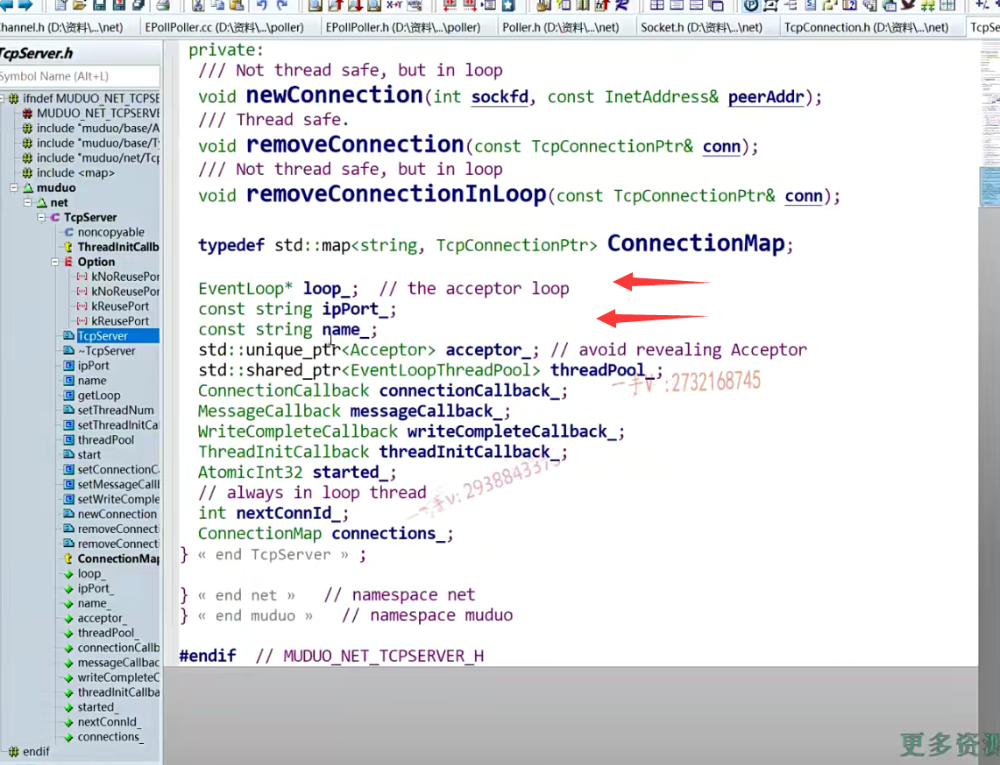

这个我们后边再看我们这节课的任务也很简单啊，

我力求给大家讲的非常清楚啊，就是大家不管是什么层级的，

这个水平都能跟得上我们的课程啊。

一是你把我讲的理论好好的去这个理清楚，

第二个就是我每一节课写的代码，我希望啊，你也原样的去照做一下。

好吧啊，照做一下。

## inetaddress

那么，我们来看一下inet address。

进来先大家看到这个inet address也是呃，这个是从一个copy able。

copy able.

从这个基类继承而来的，那这意思是什么呢？

这意思就是说呢，这个派生类对象是允许拷贝的啊，

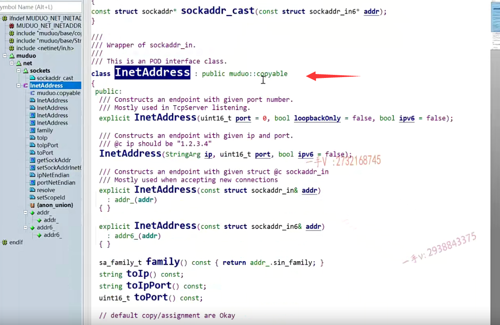

实际上呢，这个也没什么意思啊，这就是默认，就是C++11的这么一个语法，

默认生成就是空的，这个构造跟空的析构，因为默认生成本来就是空的是吧？那么，写这样的一个东西呢？

就是因为好的代码呢，是给别人看的。你注意啊，你的代码不是说我写的，别人越看不懂我的代码越好，你的代码这个字注释性越强，字注释就是什么意思呢？就是通过代码呢？就是很能一下就能明白作者要表达的意思。

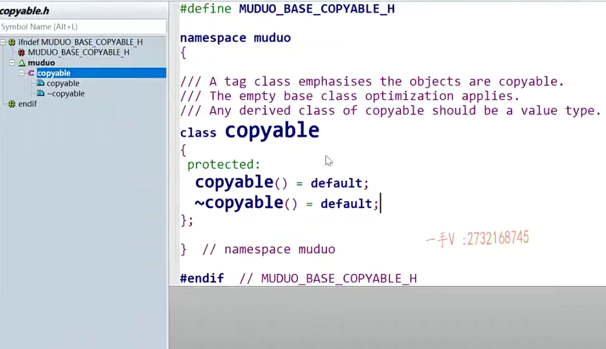

对不对？网上不流传这一句话吗？

什么是大牛啊？大牛就是看别人的代码，不一定能看懂。

但是你别人看大牛的代码是一眼就能看明白人家什么意思啊，

不是说大牛写的代码简单，是说人家的代码呢，自注释能力。

自解能力呢，特别的好。

你看啊，继承这么一个东西，一眼就能看出来这个类对象呢，是允许拷贝构造赋值的OK吧啊？

我们就把这个省了，我们说呢，我们不需要太多细节性的东西啊，

它的这个成员变量是什么呢？

它成员变量是一个联合体啊，是一个我们陈硕的这个muduo还是支持IPV 6的啊，我们不需要支持这么多，我们是了解它的这个服务器的编程的，

这个核心思想啊，所以我们只需要这么一个东西就行了。

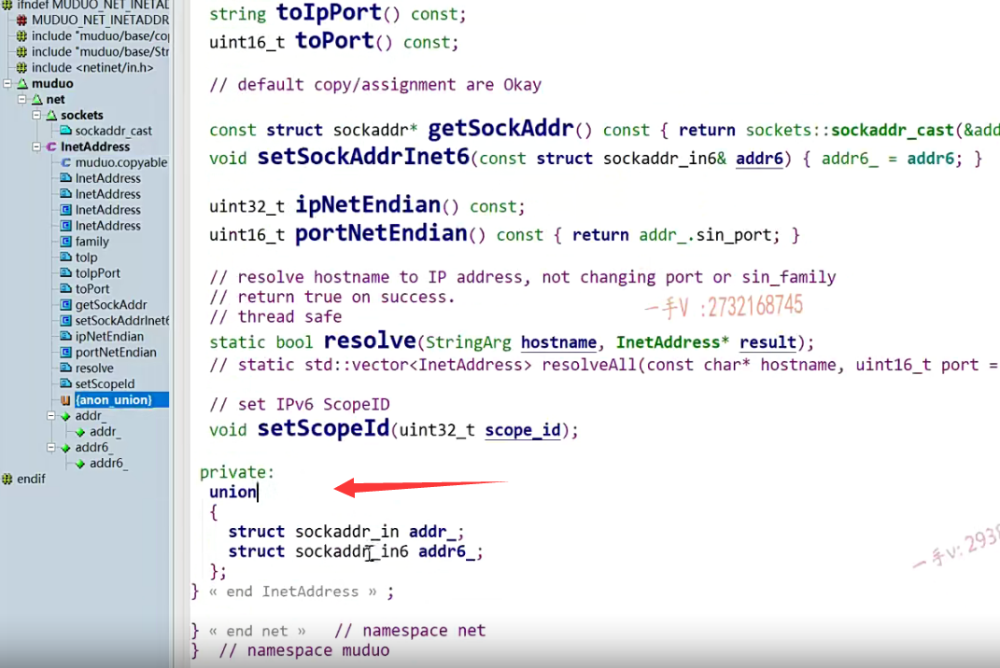

这么一个东西。啊sock add rin。

okay，那么我们来把这个。模块儿输出一下啊。叫inetess.点h。

然后是点CC。okay.inet.address.这个是封装。socket.地址类型啊。public.public.

private.注意我这我是我们在这个C++里边儿用的啊，

在C++里边儿用的话呢，那前面儿这个struct就可以省略了，

如果在C语言里边儿，你用这个sockaddr。前边儿这个struct的就是无论如何是省外不了，

因为在C++里边儿struct定义的东西本身是不是就可以看作一个类啊？

所以呢，这是sock addr。

### sockaddr_in 的头文件

sock，那这个是要使用sock addr？是不是得先包含这个头文件啊？

叫做arpa.inet点h对不对？

看看是不是这个里边的？哦，好像还不是这个，这个里边包含的是sockaddr相关的这些函数啊。

我们看一下是哪个图文件来着，想一想。叫做。net.硬点一持吧。对不对嗯stock addr在这个里边定义着呢啊？叫做sock add rina DDR。

在后边儿啊，不要加前边儿，防止和系统定义的这个变量冲突好吧，

我们说系统定义的变量呢，喜欢放到下横杠，希望放到前边啊，

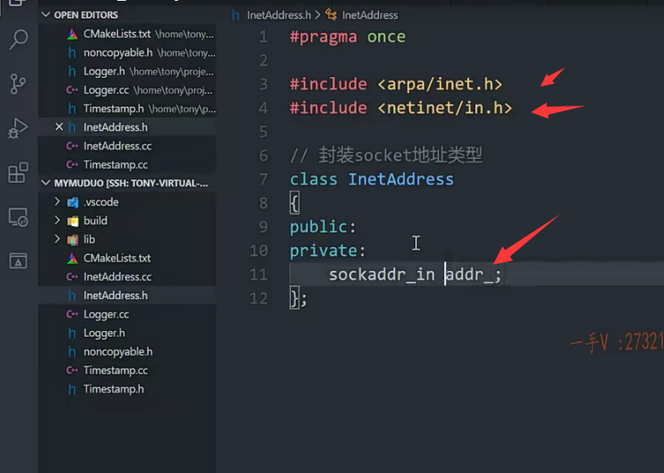

好，我们来看一下代码了。

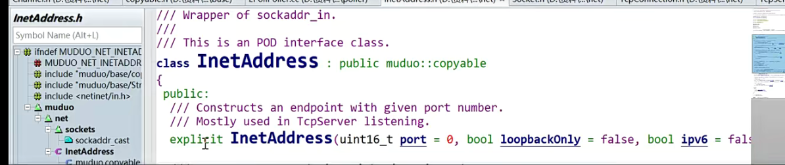

首先在这里边啊。写一下构造函数啊，

我们在写前边的类的时候也看到了人家构造函数，喜欢加explicit。

这实际上是一个好习惯啊，因为C++的隐式对象转换呢，

经常会让我们莫名其妙的看到。不是我们预期的一些结果啊。

所以大家从这儿也学学到一点。这个是port啊，是端口号。

然后就是一个IP地址吧啊。

我们不用像原作者那么那么复杂啊，我们也不用支持什么IPV6。

我们在这里边是否是还回地址跟设置的这个非还回地址，我们都当做一样无所谓啊，

我们在这儿直接定一个字符串。这也就是IP。

而且默认是个什么？

默认是这么一个东西啊，就是说你不传的话呢，

它默认是一个幺二七点零点零点一

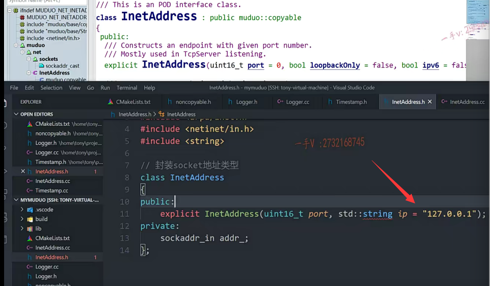

好的吧啊。继续。然后我们看一下这个应该是没有反应过来。

好了啊，先不管了。

那么，这个是构造函数给了啊？还有一个就是这样，就是直接传过来了一个sockeddrin

OK吧啊，直接传过来了一个，这个是IPV 6的，我们不看啊。

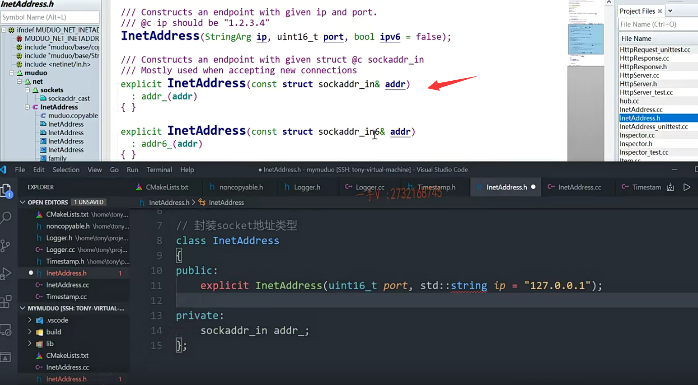

inet address.这里是const socked drina addr。in a ddr.

这个方法比较小，它就直接写在了这里边了。头文件里边了啊，

我们也写到这里。

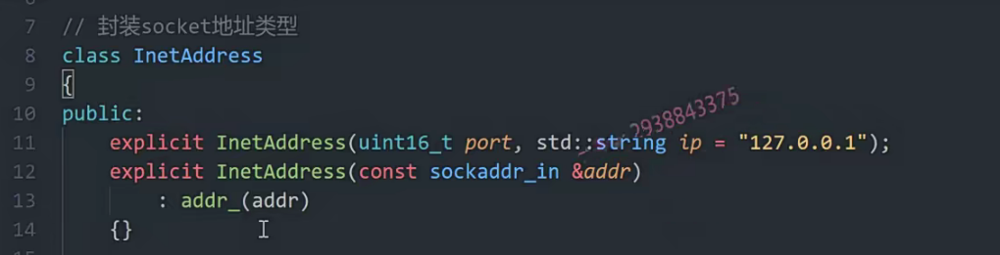

好，还有什么方法呢？应该是还有这几个方法。

to IP这些都是打印的时候我们需要的啊，

需要的这个类，经常需要，如果你编写了muduo库相关的代码，

你应该也打印调用过这些函数啊。

这是获取IP，这是获取IP post的信息，对吧啊？

这个是获取这个host端口号。

还有吗？应该这个方法，它也会用到const sock a vbr.get sock add.啊，

就获取它的这个成员变量。

外部进行一个调用啊。那这个方法我们也直接写到这就行了。

其他的方法实际上我们也都用不着了啊，

所以我们把它精简下来呢就是。

#### sockaddr可以强转为sockaddr_in

这样子的。大家看看啊。这块儿的话，这个是sockedr_in，这个是sockedr啊，这个两两个类型不匹配，实际上这个是可以进行一个类型强转的，直接转成这个类型就可以了。

啊，我们是这样吧，我们直接返回这个类型吧。sock点二杠一啊，

我们调用的时候用直接用这个类型就可以了。

好吧啊。然后另外就是。这个string一直是反应不过来，是不是嗯？

这是要取个地址，因为我们返回的是一个指针啊。

那没关系，我们一会儿写完看编译吧啊，这有时候是它这个IDE没有反应过来啊，没有刷新出来。

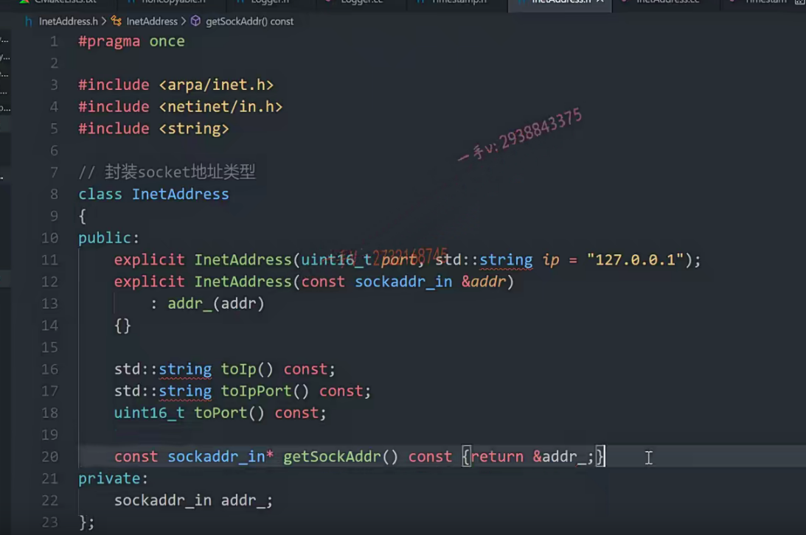

explict定义时就去掉

呃，那就是需要实现的，就是这几个方法啦。

在对应的CC文件里边。inet address.

往前这个不需要了。外边定义explicit不要参数的默认值，也不要参数的默认值，

不管是在声明还是定义，只能出现一次啊。这个是C++的语法，对吧？

不要忘了啊。然后类型作用域。

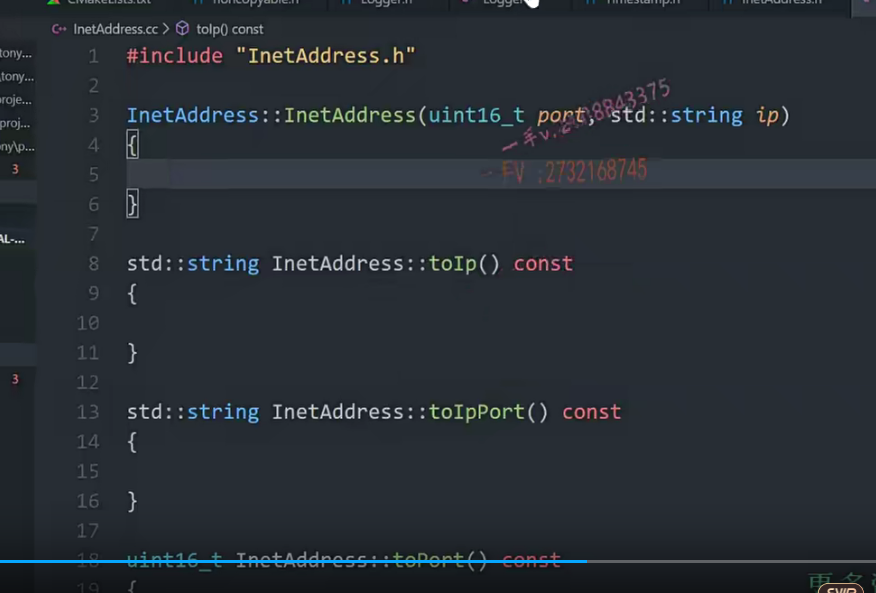

okay.大家来看一下它的这些方法都是怎么实现的呢？

这个是它的构造函数啊。

啊，构造函数的话，在这儿这是一些静态的这个断言啊，

我们省略IPV 6不考虑，

这就是我们在看代码的时候。像这个muduo库实际上已经很简单了，

大家在后边，我给大家更新这个nginx  red is源码的时候，

大家发现那些源代码啊。处理错误的情况，那场景是非常之多，

不是所有的分支场景你都需要看的啊，那你先抓住它的核心代码，

你了解它核心思想。

好吧，核心思想了解完了以后，你再可以去看它的一些分支的处理啊。

包括中级的源代码，就是大家看Linux内核源码的时候呢，其思路也是一样的啊，

所有代码你都是想从上往下一行一行往过去解读的话呢。

你读乱了，你读乱了

那源码的这个它的编写本来也是一个一个过程的迭代，对不对？

它不是说是一次性就从第一行写最后一行的。

大家一定要注意方法啊啊，看我们这个剖析的这么一过程啊，

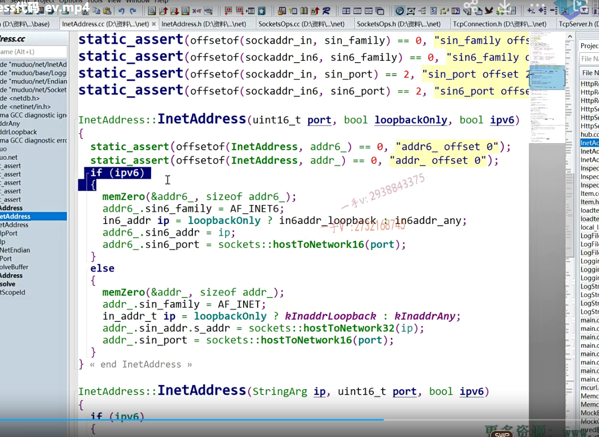

首先呢，memory zero搞了半天就是memory set，对吧？

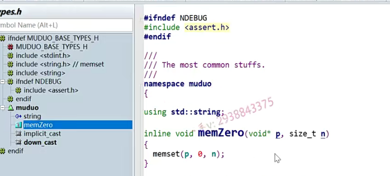

啊linux上还有一个bzero，是不是也可以进行赋零值的啊？

直接可以赋零值。

哦，这个函数意思就是说接受IP地址给我弄个号啊，

把这个成员变量add 2就是sock addr_in那个结构体变量给填上对吧？

对吧呃，family还有。pot还有这个什么东西呀？addr是不是这都是一些标准的操作，它把这些方法呢都封装在sockets这个里边啊，

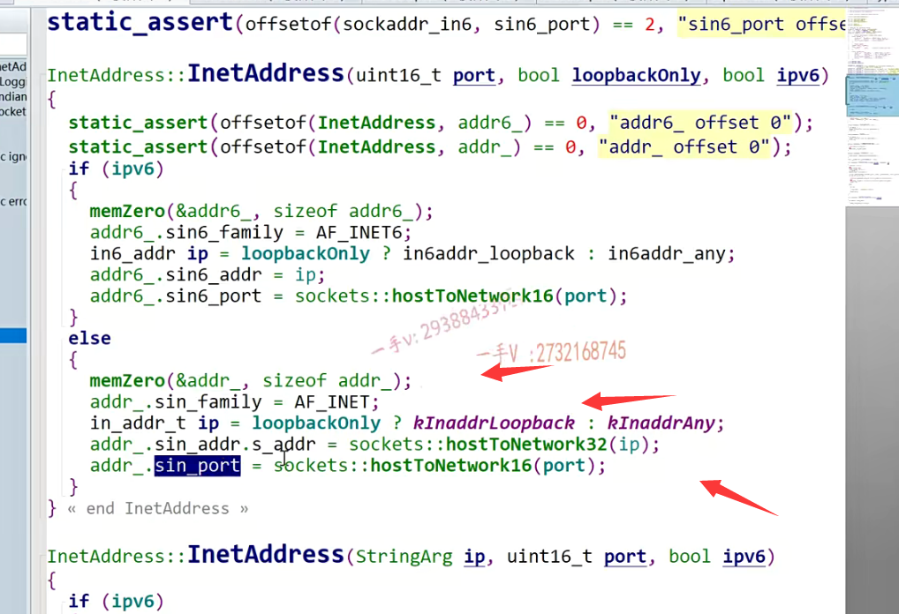

实际上底层调用的还是h two对不对？

这一系列的这些函数啊？

对吧，就是我们就不用封装了，这是封装了一下啊，封装了一下，

就是网络字节序跟本地字节序的一个转换的一个过程，

我们直接调用我们系统的API就可以了。好不好？

那这个就呼之欲出了。

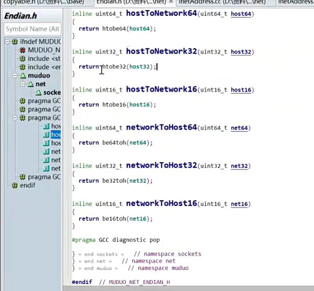

### bzero

bzero，我们可以在linux上查一下。这是需要b zero，

是需要包含这个strings.h点h啊，大家注意。strings.h。

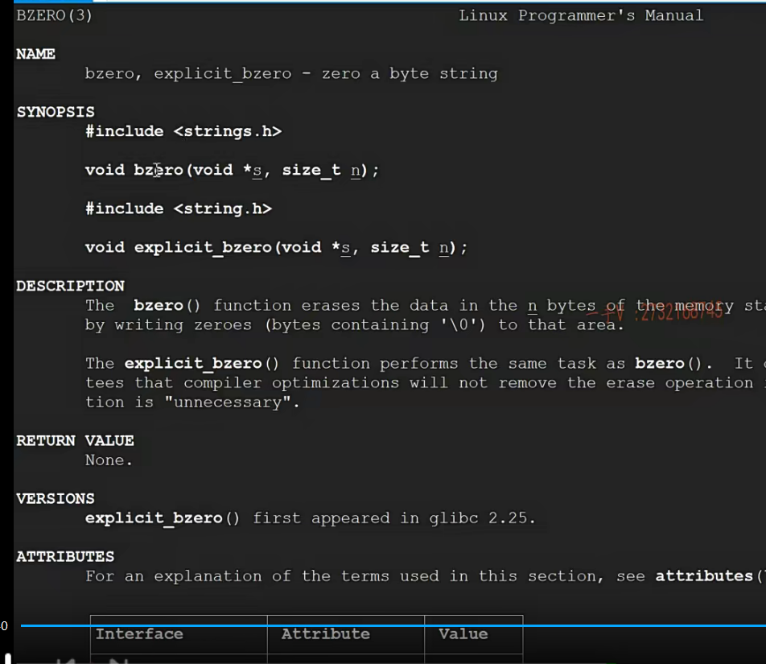

那先定用这个bzero。

第一个参数是缓冲区的这个地址addr地址啊，就是addr杠，

第二个就是它的这个大小。

好吧啊，这个这个东西呢，就是把它呢给清零了，

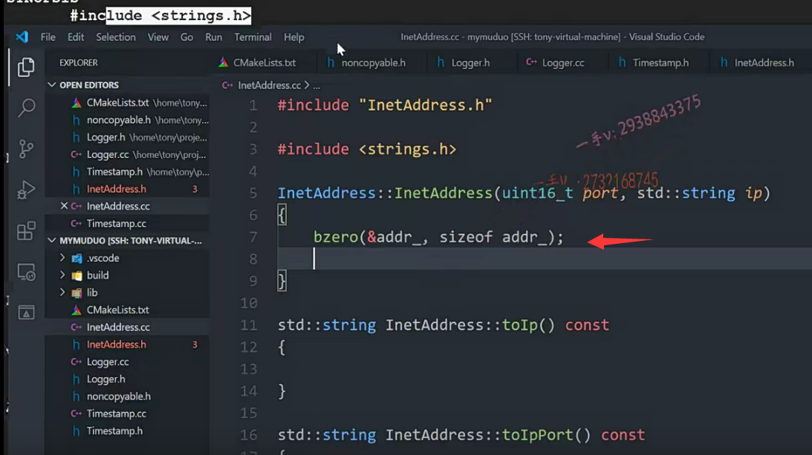

清零了以后呃，然后我们做的事情是。什么事情呢？

大家来想一想啊，那就给它一一的填写了addr.s in family=af杠inet。

然后就是addrport。这得是h two。ns就是htons就是host to net

就是把本地字节序转成网络字节序，大家知道两个不同的端要通信的时候呢，

咱俩的系统都有可能不一样啊，

我是小端，你是大端，对吧？网络都是大端字节序啊，

我们需要都转成网络字节序。

通过网络传输到对端以后，再从对端呢转成本地的字节去，

这样呢，互相传输的数据就都能识别了，对不对啊？我是小端，我以小端的模式传到你，你是大端解读，那你肯定解不出来。

我正确的原始的数据啊，我想要表达的意思，对吧？

在这里边儿就是这个port啊。

然后呢？这个就是addrs，addr等于inet，这是我的dress嘛。

对吧，它需要的是叉星，我们传的字是string得用string的c杠STR方法。

这就搞定了。这就是这个方法OK吧啊。

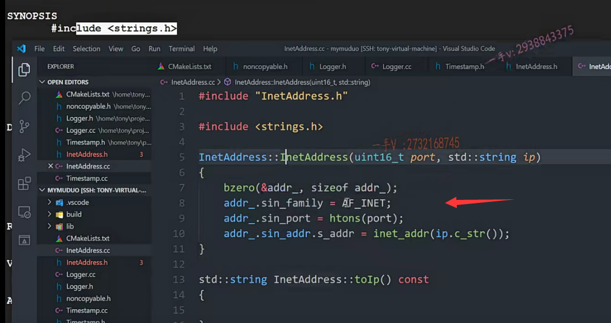

你看这些封装的时候呢，相当于我们原来在写socket程序的时候呢啊

对于在我们写服务器绑定之前，需要创建socket以及创建一个socket addr_in，对吧？

这net address相当于就是打包了IP地址的端口。

## toIp函数

#### 注意addr中是已经转换成网络字节序的

这个to IP把IP呢转成什么呀？打印它的这个IP地址。

啊，这个好处理吧，好处理是不是啊？

这个就是从addr杠硬里边读出来IP地址。

那你要注意啊，这addr杠杠里边这存的这个IP地址啊，已经被你转成这个网络字节去了。

好吧啊，已经被你转成网络自己去了

==inet_addr有两个作用，==

一个是把字符串转成一个整数的IP地址的这个点分十进制的一个整数的一个表示，

另外一个就会转成这个网络字节区，

我们要在本地查看，我们还得调用相应的方法把它转成这个什么？啊，刚才是这个转成网络字节序对吧？

存储下来，我们要把它从这里边读出来，转成这个本地字节序。

okay吧。啊，我们定一个char buf吧。64足够了啊。

然后调用它的这个什么方法呢？是个inet吧。met杠net two。net two是什么？应该是net two p啊。

第一个是地址，家族。IPV 4对吧？

第二个。就是它的这个s in a ddr。

第三个。就是我们写的这个buffer。

第四个就是buffer的长度啊，size of buffer。

okay了吧啊。大家注意这个函，这些经常使用的函数不要忘了啊。

这个就是说呢。呃，从这个里边儿啊，读出来这个整数的这个表示啊。

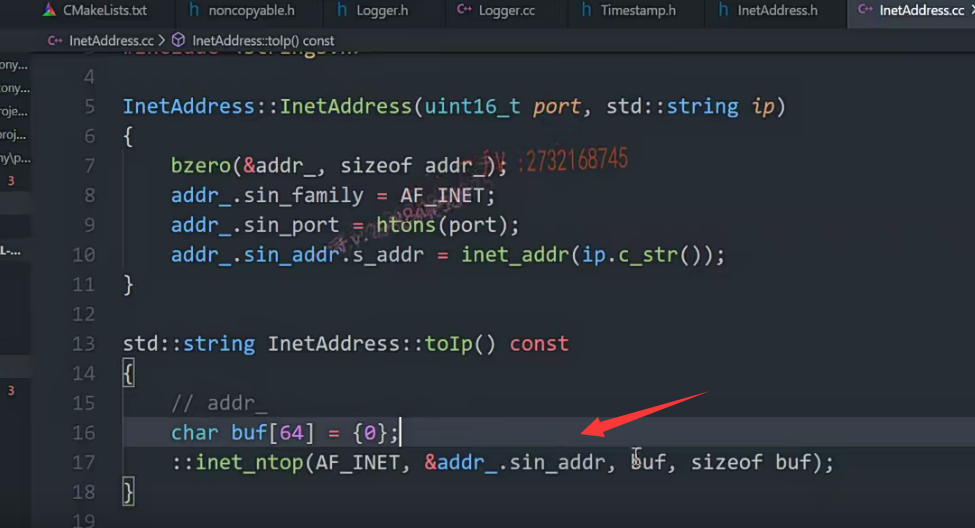

大家看这里边儿是个整数的表示，但是它是一个网络字节序，

我们还是还得需要把它转成什么呀？本地字节序。对不对啊？

然后呢？在这里边儿，我们把这个buf返回回去啊。好to IP。

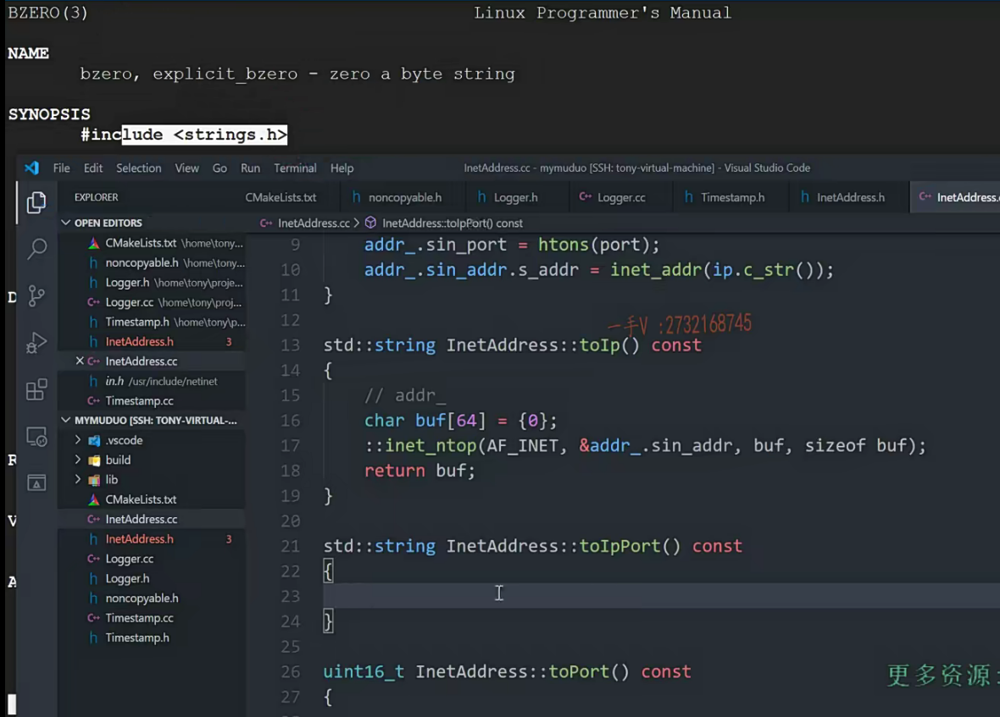

我们现在写完了，现在写一下这个。

to IP port，IP port的话也简单，

我们把它就是跟人家一样。就是写上这个IP。冒号pot

这种格式就可以了好吧啊。实际上，你可以直接看它的这个源码，

它就是这样去做的，它把这些操作全部封装在sockets里边儿。好不好啊？

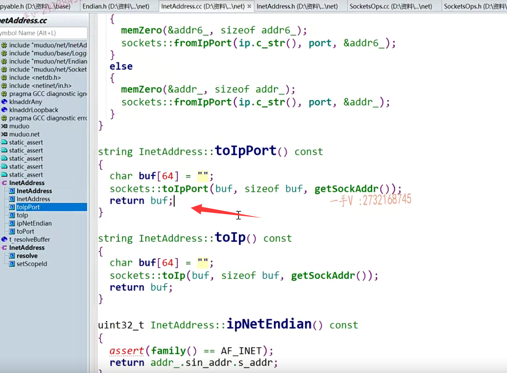

其实我们就是把它的这个裸代码直接写出来了而已，

这些东西我们就不看它了吧？

你想看的话，你可以跟一下啊。

那实际上做的事情呢，不复杂。呃，我把这块代码拷贝过来吧。

然后呢？我算一个这个end = string len.

包含一下字符串的这个头文件string点h啊。

在这儿string len string len算谁呢？

算这个buffer就是IP的，这个有效长度。对不对？

然后呢？我再把谁算出来呀？

我再把这个port算出来。后的就是ntohs呗addr杠点spot。

因为存到addr杠里边儿都是网络字节去转成本地字节去对吧？

然后呢？我们再给它。组装一个字符串。

从哪儿开始组装啊？从这儿从buf的这个后边儿就是刚填的IP地址，

后边儿继续往后写啊。

这个是写多长呢啊？我们如果不想填长度的话，就不用SN printf直接sprintf就行了。

直接在这里边，我们写个冒号，再写个百分之u啊，就是一个on sand。

那么，在这儿再填一个pot。就可以了。

好了吧啊，然后呢，我们再把这个buf返回回去。

这也相当于就是把我们的这个IP冒号port组合到一块儿，

跟人家返回回去了。okay吧啊。

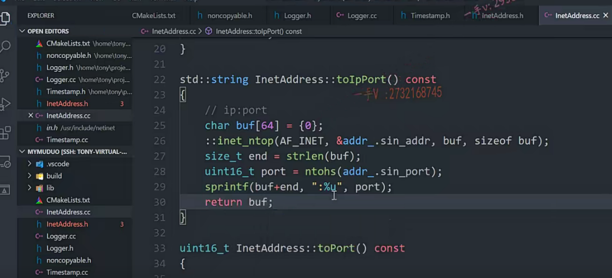

然后呢？再看一下这个to port。

那toport的应该是非常简单的，

就是ntohs。addr杠点s import这个是不是就完啦？

对啊，这个就完了，这不就完了。

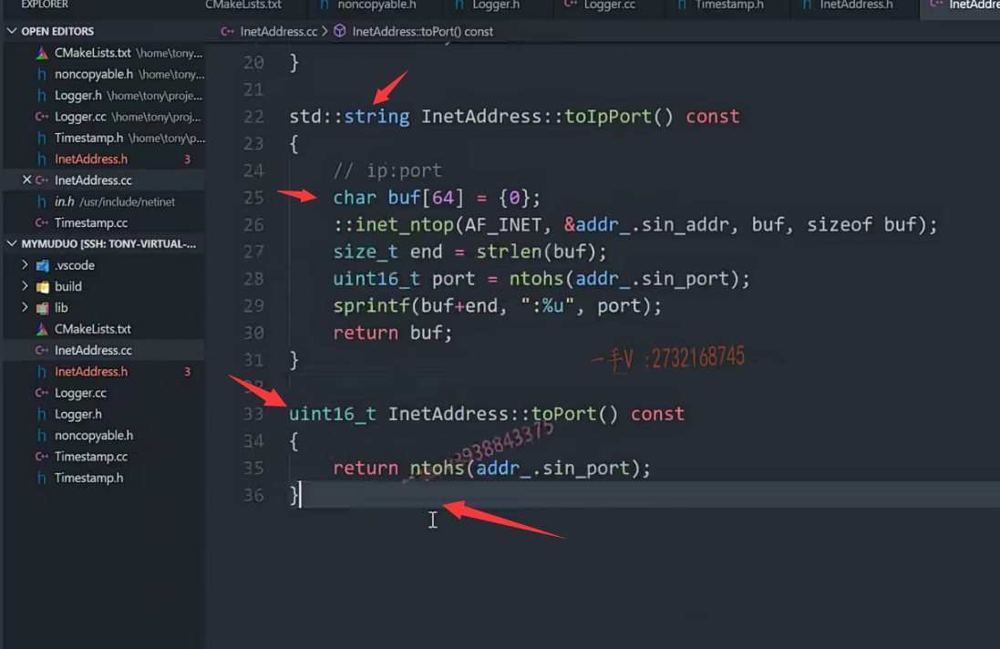

## 测试

啊，我们在这里边可以写一下简单的这个测试函数啊。

试一试看功能是否如我们所愿

inet address addr。八零八零。

好吧啊。这个我们得需要包含。输入输出的头文件。

cout，然后是addr点two。to IP port吧。

打印一个啊。这儿可以单文件执行。没问题吧啊，这个IP地址端口号儿打印出来就是这个样子。好了，

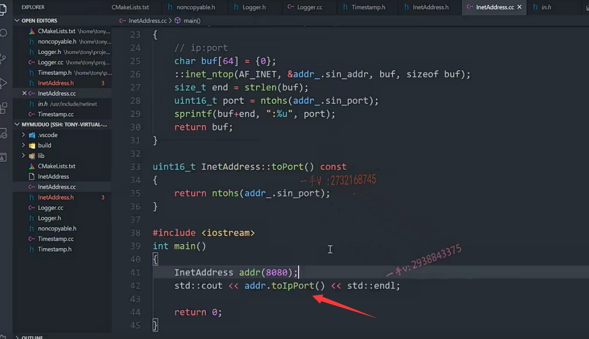

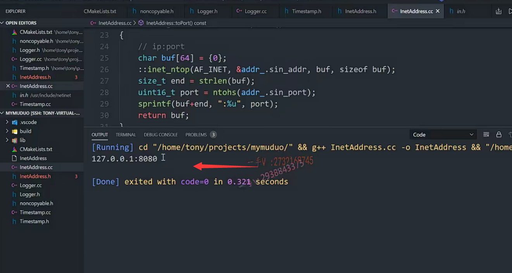

## 总结

那这节课我们要写的东西呢？

就是这个m net address

是对于谁的封装啊？就是对于这个。sock adrin的这么一个封装好吧啊，

绑定IP地址跟端口的这么一个封装。

好，那我们再构建一下吧。

总体的构建一下这个项目。这个是clean rebuild.

没什么问题了，好吧。行，那这节课的内容我们就说到这里啊，

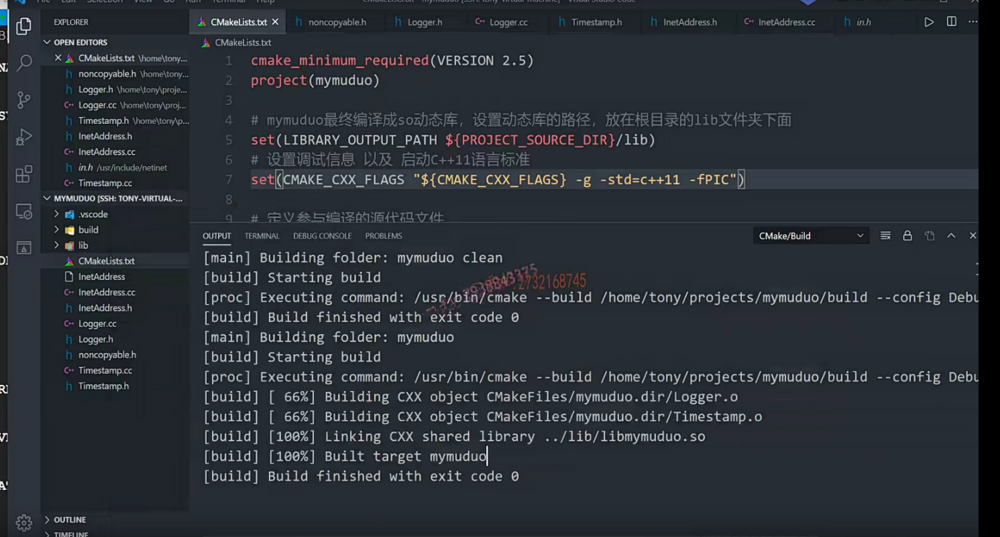

希望大家呢，跟着这节课的代码也完成一下这个。这节课的作业任务啊，把这个我们上课写过的东西呢，自己手写一下。