这节课呢，我们继续接着前边儿把channel这个类型的成员给它填完啊。

我们上节课呢，把它的这个成员方法填了一部分，

把它的这个成员变量主要输出了一下啊。

我们说它里边主要放的是一个channel所属的是个事件循环，对吧？

然后就是fd以及fd感兴趣的事件以及最终poller给我们channel通知的，

你发生了什么样的事件？就是在这个fd上对不对？

以及呢，根据不同的事件进行相应的一些回调操作。

==这些回调肯定不是在channel里边决定的，==

==这些回调肯定是用户指定的，通过接口呢，最终传给channel。==

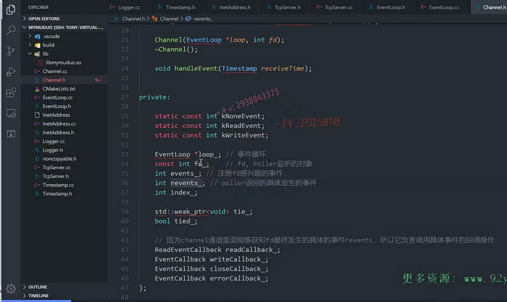

channel来负责调用，因为只有channel才知道fd上到底发生了什么事件。

读事件，写事件 error事件还是close事件。对了吧啊

## 这节课 补充channel类

好，那这节课呢？我们把channel的这些方法呢？

我们给它填完啊呃，上节课我们看到了handle event啊。

呃，在这里边儿大家看。

很明显，这个从人家的这个方法的名字命名，我们都能知道这个是处理事件的。fd得到poller通知以后。

啊，处理事件怎么处理事件呢？就是调用相应的是不是方法？

就是回调方法是不是来处理事件啊？这是肯定的，对吧？

所以从这儿呢，也就是大家另外一个就是学到啊。

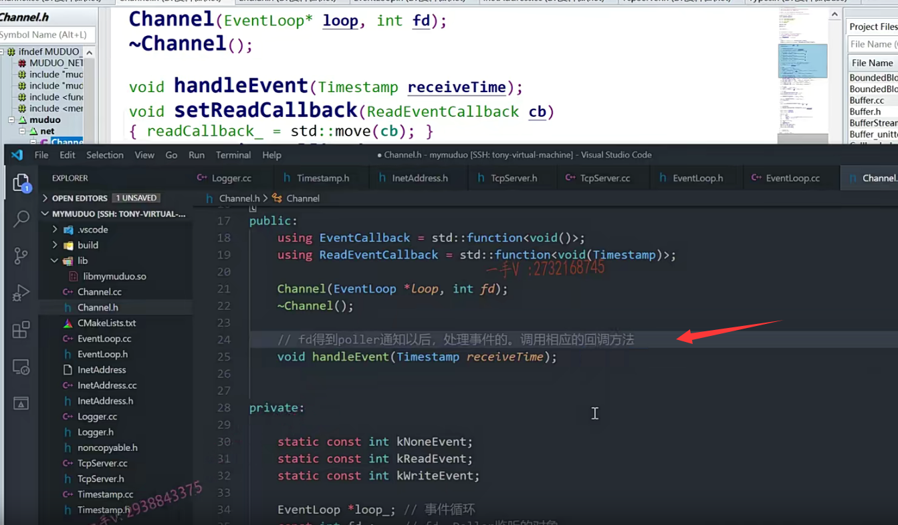

## 题外话 起名

呃，我们在方法命名的时候呢，一定要见名知意啊，

我前边儿讲课已经给大家说过了啊。就是大家随着这个积累的这个书写代码的这个能力啊，

逐渐的就会变成一个大牛啊。

大牛是怎么定义的啊？大牛在业界是怎么定义的？

但大牛在知乎上是这么定义的啊就是。大牛看别人的代码。不一定能看明白，但是别人看大牛的代码是一眼就能看明白。

这说的是大牛水平不行吗？看别人的代码看不明白，并不是的，对吧？

这说的意思就是大牛在写代码的时候，不管是从命名还是从逻辑处理上。

人家都能够保证写的非常的清楚，非常的清晰啊，你只要掌握一定的这个基础能力。你是绝对能够看懂人家的逻辑。对不对？代码写的不是给自己看的，是给别人看的。对吧啊，是给别人看的，

希望别人能看得明白，看得清楚，是不是如果只给自己看啊，就自己明白。让计算机明白，那不如直接用汇编语言去编写程序算了。对了吧啊，这是我们说的题外话。

## set回调方法

handle event接下来就是四个set，

那我们说了啊channel并不知道具体去做什么样的回调，

它只是能被动的去执行你给它设置的回调。

这些回调的这个成员变量都是私有的，所以它提供了这四个对外的接口啊。

这个是设置回调操作啊，是回调这个函数对象吧，好不好？

我们写的具体一点，因为都是function嘛。对吧，

因为都是function定义的啊。

void set read call back，

==希望大家也动动手写一下啊，不要老是在那抄。呃，不是不是抄啊，不要直接ctrl c ctrl v拷贝啊。==

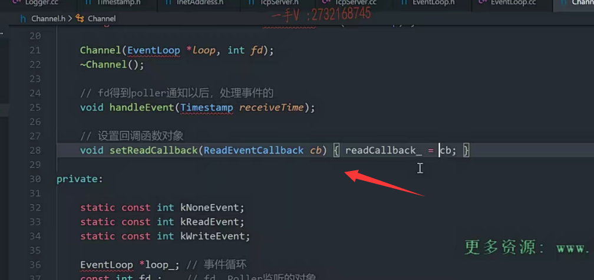

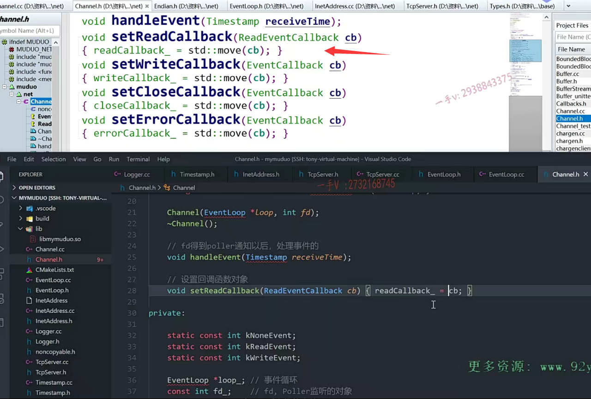

### move

那么，在这里边就是readcall back=cb。

呃，在这又学到了一个，就是人家用的都是move对吧？

因为cb跟这个成员变量在这里边都属于组织有变量，名字又有内存。

那这里边儿因为function是一个对象，

对象的话，我们都假设它是很大的占有很多的资源，

在这里边儿调用的就是对象的这个赋值function函数，

对象的赋值操作对不对啊？实际上呢嗯。

==在这里边儿，相当于他把cb要转成一个右值，先把cb的资源直接转给他。是不是==

因为除了这个函数cb这个参数啊，这个形参的局部对象，它就不需要了嘛OK吧？

move这个前边儿，给大家在应该是C++高级课程里边儿讲过啊，

它是把一个左值转成一个右值的对不对？

set right call back.这应该是event callback。cb啊。

这是right call back=move。cb o

kay.再来一个就是set close call back。是event callback cb。

同样的是close call back。参数的这个call back传给我，成员变量记住。记录了四个回调，对吧？set error callback。好的吧。cb啊。这是error callback st d move。

这个现在就完了。是了吧啊，这个现在就okay了。那么接着往下。这现在是这么一个态。

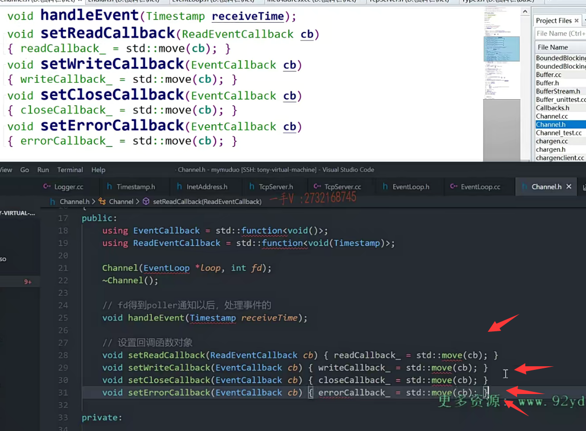

### tie

之前给大家有说过tie的成员变量。做什么事情？

是不是这是一个智能指针？

我们头文件memory已经包含了啊。

这个在这里边儿就是主要防止当channel被手动remove掉。还在执行这个channel还在执行回调操作，

哪些回调操作就是上边这些回调操作对吧啊？

所以呢，channel在这里边儿啊，用了一个弱智能指针来监听当前这个channel啊是否已经被remove掉了？

因为event loop里边有remove channel好吧啊，

event loop我们还没有输出。那么到时候输出的话呢？大家就明白了，

但是现在他的这个角色大概的这个掌控范围你是明白，

我们从前往后介绍了TCP server。到event loop， 

event loop里边包含的poller跟channel event loop，

在这里边跟poller跟channel相当于都是我们这个multiplex多路事件分发器，这里边相应的操作好吧啊。

好，那么大家先大概知道它的这个角色，到时候我们再写它的这个代码方法的时候呢，你再仔细的再去看一下啊。

### fd

呃，这个是fd。相当于返回了什么呀？

相当于我们返回了这个成员变量fd这个成员变量的这个值，值是吧？

### events

还有int events，events返回了fd所感兴趣的事件。

### epoll监听后，设置fd真正事件

set revents.为什么要提供一个revents的这么一个set方法呢？

你有没有想过？自己回答一下，各位。

这是在设置在fd身上真真正正发生的事件，但是谁去监听事件呢？

channel本身能监听自己的fd发生什么事件吗它？

他不能偷懒，在监听的就epoll，监听的对吧？

epoll监听事件以后呢，肯定是设置了channel所就是表达的这个fd相应的发生的事件嘛，

所以它要提供一个对外的公有接口来设置嘛。没问题吧啊。

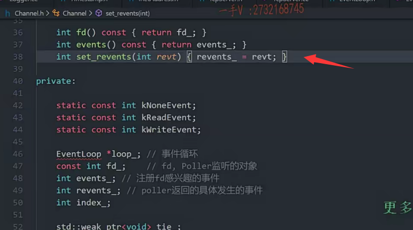

### 表示当前fd有没有感兴趣的事件

这是一个，还有一个布尔is nine event。

这个相当于。嗯。none event a.k nine event.

这个相当于就是表示啊，当前的这个channel也就是底层的这个fd啊，

到底有没有注册感兴趣的事件？

对吧啊，那我们说了这个是读事件，这是写事件，这是没有任何事件嘛。

是不是啊？这只是一个标识啊，标识。

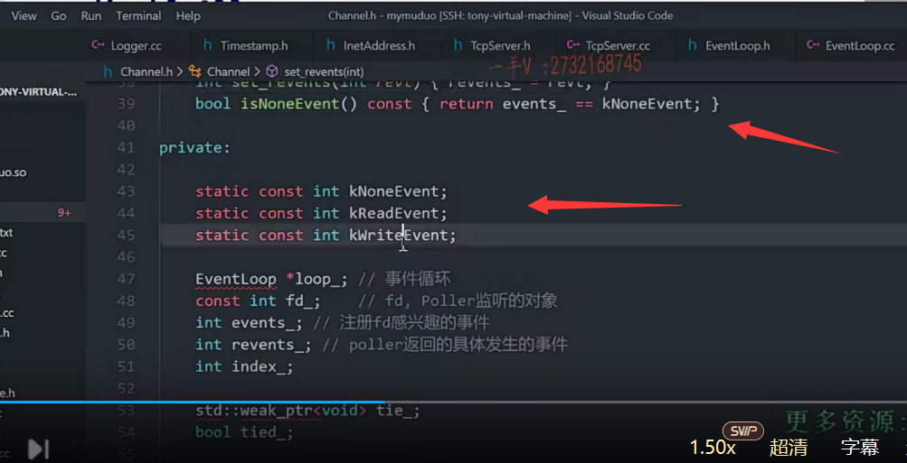

### fd感兴趣的事件添加，删除等 通常使用位运算

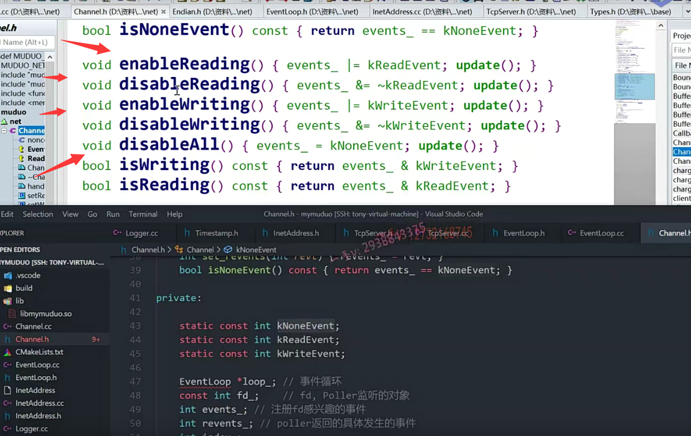

接下来就是这个inno enable reading。

从这名字能看出来，这是使能，使它可读，使它不可读，使它可写，使它不可写。这个disable就是禁止所有的操作。

各位，你想啊。channel，我们说的它包含的是fd跟他感兴趣的是不是事件啊？

如果我是fd的话，我不能说是我对读事件感兴趣。

那poller就知道fd对读事件感兴趣了，

那实际上我们在编程的时候，你fd对某个事件感兴趣，

==你不得通过epoll_ctrl来进行add添加。fd的事件。modify修改一个已经存在的fd的时间，或者是delete删除一个fd的事件，这个应该都明白吧，==

这一步的基本编程嘛，对不对？

所以对于一个channel来说啊。如果你想写这些方法enablereading.

==意思就是说我现在呢，要让fd对这个读事件感兴趣。==

==对吧，所以呢，给它的成员变量，这个成员变量events记录的就是fd所感兴趣的事件嘛，要给它相应的位置上read event。==

read event相当于就是这个读事件

这个相当于就是写事件

这个相当于就是对任何事件都不感兴趣啊。

相当于把这个读事件呢，==给这个events呢，相应的位给置上了啊，==

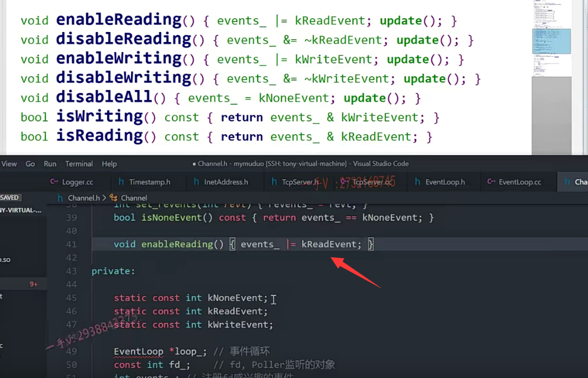

### update就是调用epoll_ctl

置上了以后呢，然后在这里边儿进行一个。update 

update.你现在用脚猜都能猜出来update，

就是在调用这个epoll control。是不是在调用epo control啊？

调用epoll control呢？就通知poller调用这个epoll control

把fd感兴趣的事件添加到epoll里边，

没问题吧啊？这个就是设置fd相应的事件状态。

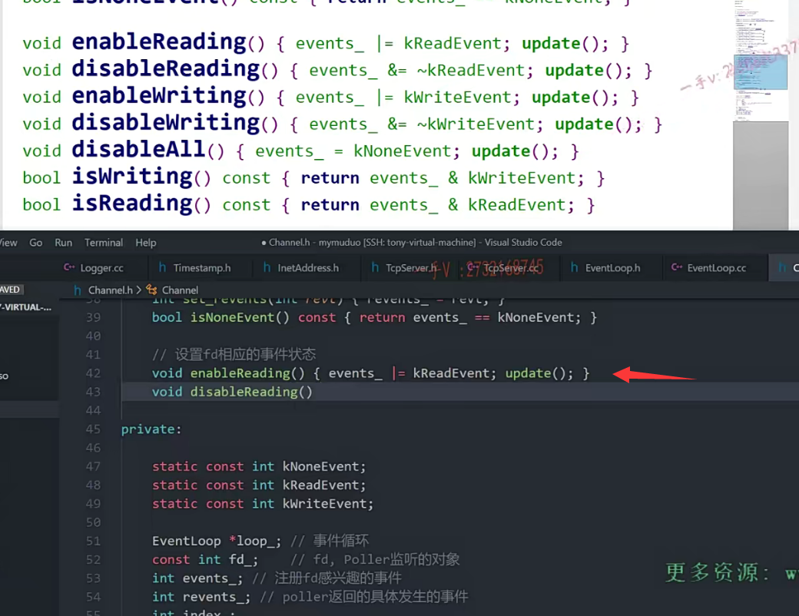

啊使能啊禁止啊，对吧？

想一想啊，想一想跟。它只不过是在根据这个reactor的这个组件再进行一个OP的一个封装。

实际上，在底层预期的过程呢？

该有什么过程还是得什么过程？

epoll create epoll control epoll wait。

对吧，一个操作都不能少啊，

你注意把它对应到我们原始的这个操作上就好理解，那这个是使能使能的话，

就是把相应的这个位去掉，对不对？

#### 位运算 去掉 就是与上 取反的

去掉的话，那这个也简单啦。先把这个遇的疑问的呢，先给它取个反。

对不对哎？取反以后呢？然后再与一下。

没问题吧？那原来的这个取个反的话就是read的那一位是零了，其他位都是一，那不影响read的位以外的其他的位上的是不是数值啊？

并把read那一位给它置成零了，这就是去掉了，

去掉了以后呢？那就是在update更新一下。

上面解释一下，应该都明白了，

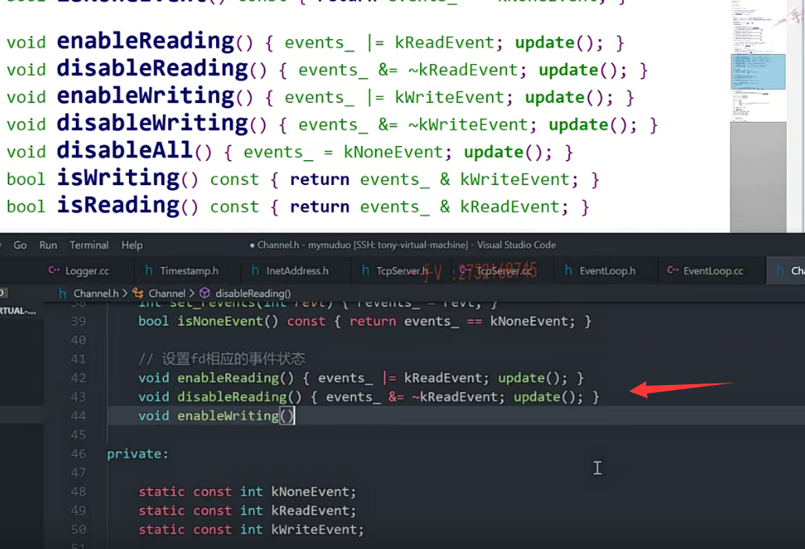

所以呢？enable rating在这里边，我就直接写了啊。

k right event.update.events语上。给它取反update。这都是转过来了，算了，我还是用原来的吧，把它们写到一行啊，

不长。然后呢，接下来的这个是什么呢？disable all。

那就直接是events等于谁了？knonevent。update.

好的吧，然后这就是两个部位值。is rewriting is reading，

我觉得呢，跟上边儿这方法呢，放一块儿吧。

### 返回fd当前的事件状态

这方法的组织没有做的很讲究啊。返回fd。

当前的这个事件状态啊。布尔先拷贝一下，刚才剪切过来的is writing。

那就是return events。k right event.was is reading?

return大家来看啊events。k read read event.

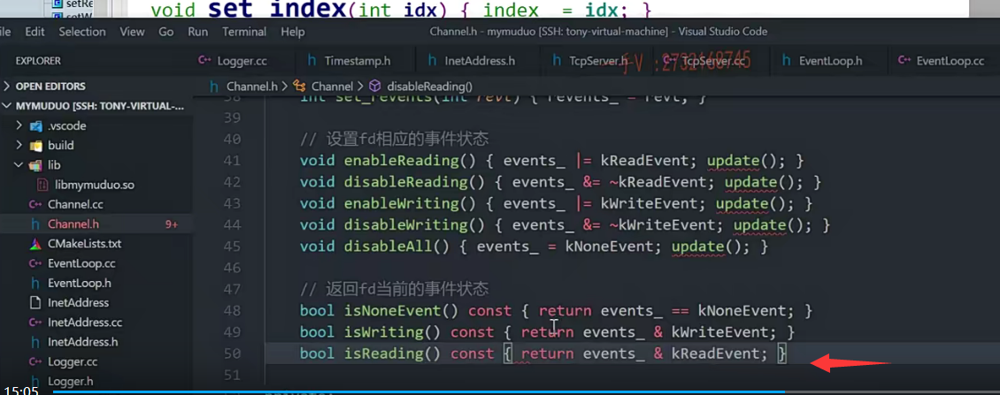

这三个方法应该问题不是很大吧？啊，意思能了解啊，

### index相关

然后这个是for poller的，这个index 

index呢作用有，但是作用不是很强啊。

这个我们到用的时候再看好吧，这个方法既然有，就先给大家写到这。

这个我们先不做额外的解释啊。

这是跟业务强相关的，跟这个多路时间分发器本身呢，逻辑上的呃，相关性不是很强啊。

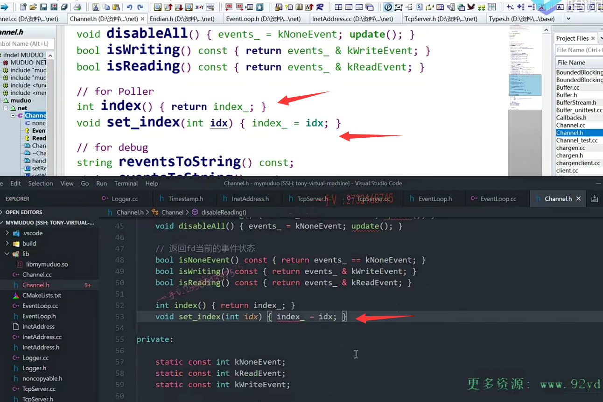

然后这是events to string events to string，

就是说呢，调试用的，

想把呢fd感兴趣的事件以及真真正正发生的事件，最终发生的事件呢，打成这个字符串啊。

好进行调试log hup跟日志相关的，我们不管啊，我们不管

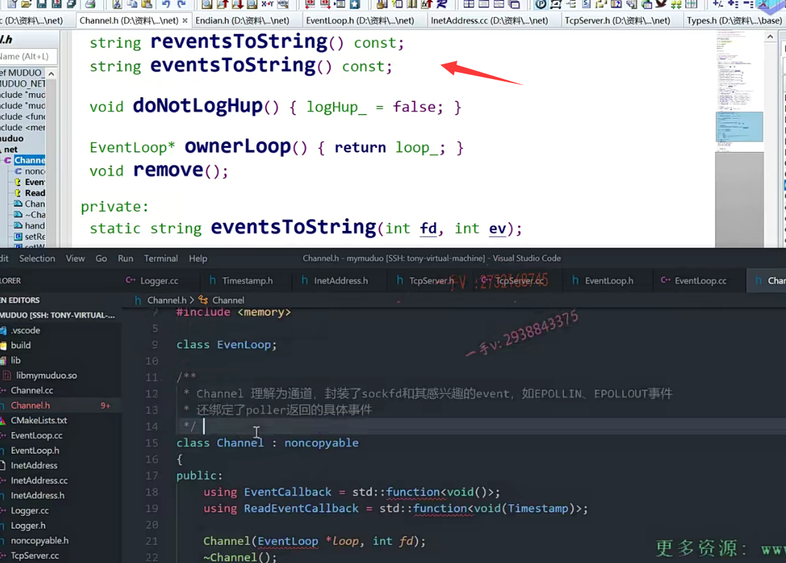

## 再次强调 eventloop和channel poller的关系

#### ownerloop函数就是判断当前channel属于哪个eventloop

ownerloop 是什么意思啊各位？

owner属于 loop。

event loop跟channel它俩谁是包含谁啊？

channel包含event loop。想想还是event loop包含channel

开玩笑嘛，==肯定是event loop包含channel嘛==，

event loop我们看的时候我们就看到了event loop相当于事件循环。

在这里边就这玩意儿相当于就是事件分发器一样。

eventloop在这里边就是这一角色。

eventloop作为这个角色，它里边包含了epoll，就是那个poller

另外就是epoll感兴趣的这个fd，以及它对应的事件最终发生的事件。

被muduo库封装成这个channel了，

我相信你，现在我把这个已经强调很多遍了，相信大家现在对于event。poller跟channel，它们的之间的关系应该能想明白吧，

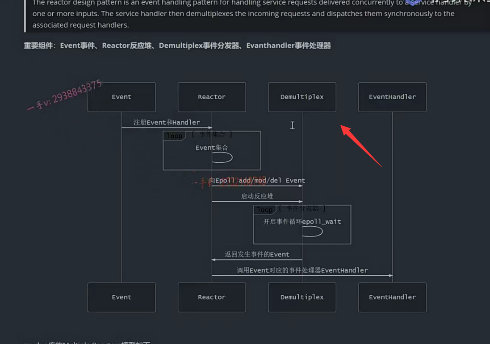

你eventloop包含了poller跟channel。对不对啊？

channel里边包含了fd以及感兴趣的事件，以及最终发生的事件，当然这些事件啊，最终我要向poller里边注册。

发生的事件由poller给我channel，是不是进行通知

channel得到相应fd的这个事件，通知以后

调用我们预制的相应的回调操作就行了。

我觉得已经说的很清楚了啊，如果你还是有点乱的话呢，

你结合着这张图呢。再去想想eventloop channel跟poller之间的关系。

## 题外话 线程

而且我们说了。那我们不可能在多核的这个系统上用一个线程作为event loop，我们肯定会设置跟核数呃CPU，核心数量一样的，

是不是这个event loop线程啊？所以一个线程就是一个loop。

啊，不是说了吗？eventloop什么？one loop per thread就这个模型啊，

现在是我们设计高性能服务器经常采用的模型嘛，对不对？

你像muduo库libevent还有这个libev这些。c++加写的开源网络库，

遵循的都是这么样的一个网络设计模型。

啊，我说了这么多，想表达什么意思呢？

表达意思就是说呢，这个owner loop意思就是说呢，当前这个channel属于哪个eventloop？

一个线程有一个event loop，

一个event loop里边有一个poller，

一个poller上是不是可以监听很多很多的这个channel啊？

所以呢，每一个channel应该都是属于一个eventloop的。

但是一个eventloop 它可以有很多的这个channel。

要不然怎么称作多路呢嘛？对不对啊？

多路就是一个线程呢，我们可以监听多路的这个channel多路的这个fd的啊。

所以在这儿eventloop *owner。return loop.好吧，

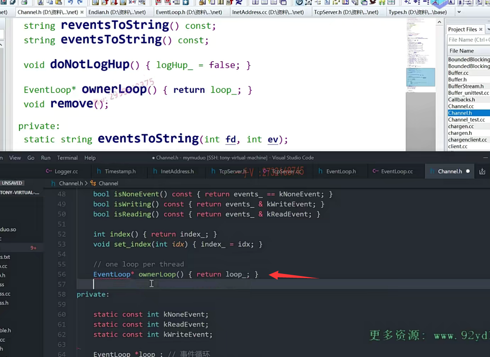

然后这个是remove。

这种肯定就是删除channel用的啊。

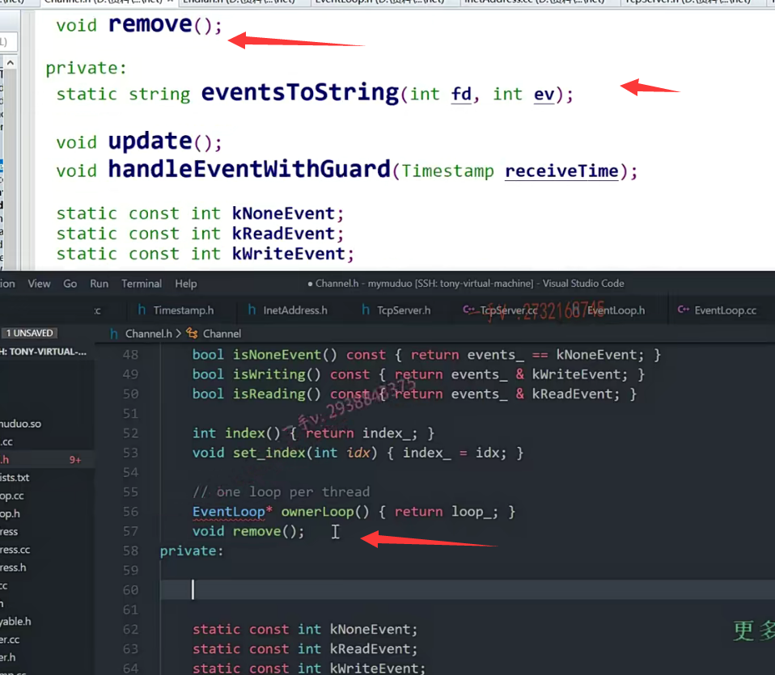

另外就是events to string，

这肯定也是跟debug相关的啊，

我们不管接下来就是私有的，这里边的两个方法既然是私有的，

那肯定是给内部接口调用的。

不会让外部对象来调是吧？

那就是update。这是更新，我们前边调用了，是不是啊？

还有一个是什么呀handleevent.with.guard guard.timestamp.receive time.

处理事件with guard受保护的处理事件。

从这名字上来看，跟我们前边儿写的这个handle event应该是很像，

估计是这个handle event。调用的就是底层的这个handle event with guard。

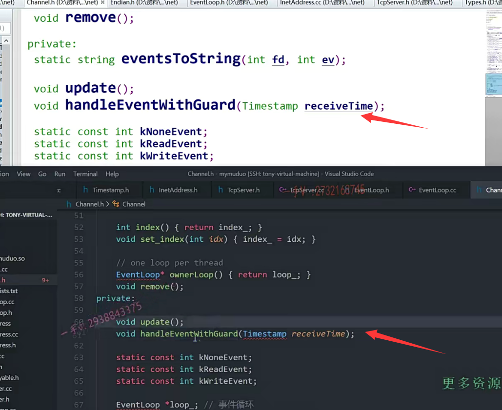

#### 与前面类似，可能前面会调用它来实现

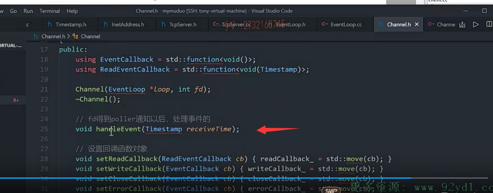

okay吧。好了，那到这儿的话呢，我们相当于是把这个channel的所有的成员呢，我们给它输出了。好吧啊，

大家跟着我们上课的这么一过程，

首先从原理上脑子里边儿一定要有这个reactor模型几大组件以及组件之间的交互图啊，

实际上跟muduo库这里边区别不是很大，

跟这个网上流传的这个muduo库的multiple reactors。

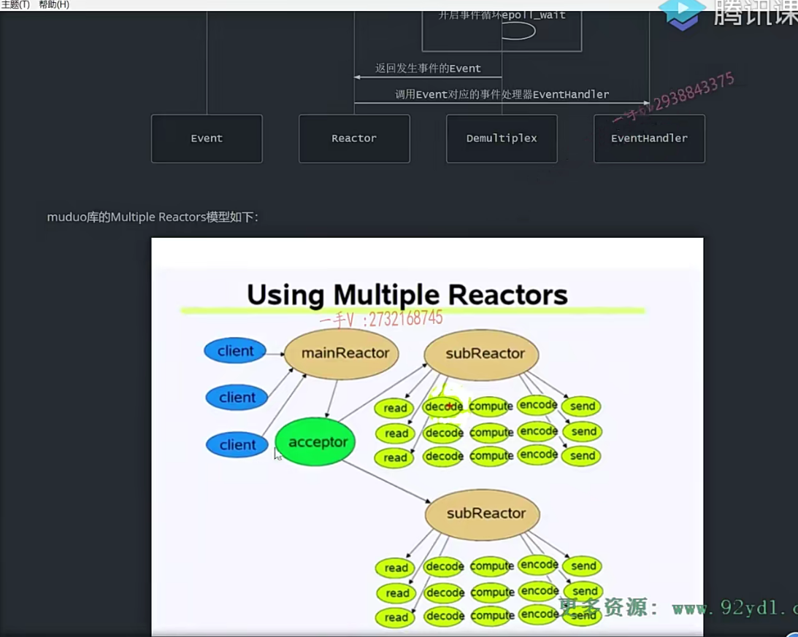

对不对？就是多路事件分发器eventloop，

这里边有多个线程，每个线程里边都有一个多路分发器啊。

搞清楚，在这里边我写一下啊，

搞清楚理清楚。event loop.还有谁？还有channel。poller之间的关系。

他们在reactor模型上。对应谁呀？对应多路事件分发器。好不好？

而且采用的是one loop per red。

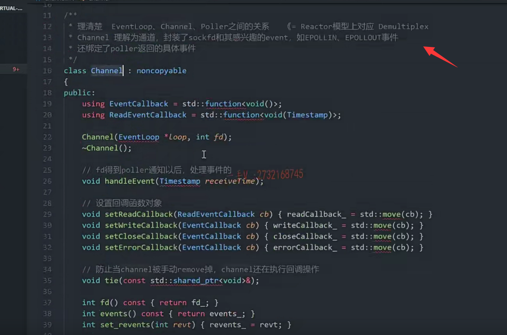

## 总结

好了，那么这节课呢？

我们主要是从它的这个成员上啊，把这个channel呢给它补齐成员的声明上。

所以具体的方法我们都还没有实现，对吧？

我们放在下节课来实现，大家呢？

这节课把相应的代码该写的写了，把这些方法呢？

呃，具体呢，主要的是分成哪几组？

分别完成什么样的事情？搞清楚，做到心里有数啊，

把模块跟模块之间的关系呢，也理清楚。对不对？

虽然。大家独自起来看看，看这个muduo库可能看比较复杂，

经过我们给大家的剖析，

我希望呢，大家一定要借助实践把这个图记到记到脑子里边，

到时候我面试的时候说的时候呢？它无非就是个reactor模型嘛。

它里边涉及的所有的这个类。对象我都可以安到这个reactor模型上对不对啊？

你不可能永远把这个代码记脑子里边代码这么多，是不是啊？

这你能记住。对吧，记得乱七八糟，到时候说表达的时候又语无伦次，

没有前后逻辑铺垫啊，面试官觉得我们看。源码都是骗人家的，对不对？

毕竟你说出来感觉逻辑性不是很强嘛，所以在我们脑子里边留下的是设计，留下的是图啊，我们到时候去讲的时候呢，

我们就可以把它里边所涉及的一些类呀跟这个图强相关 关联起来了。

对不对啊，大家？看或者记带图的东西应该都是非常方便，高效快速的啊，

也是欣然接受的。

看不带图纯文字的东西，相对来说大家都是比较抵触，接收比较慢，记忆也是要花很长时间的，而且忘的还快。

对吧啊好，那这节课的内容我们就先说到这里。