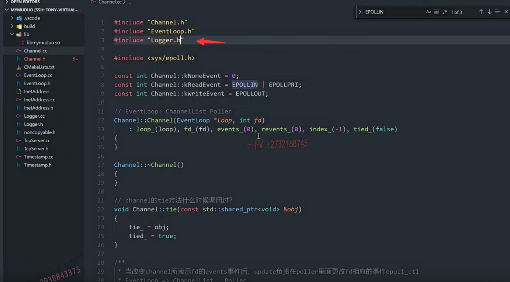

这节课呢，我们继续啊，写这个channel的这个代码的实现啊，

之前呢，我们把channel这个类的成员变量跟成员方法，我们都列出来了啊。

好，大家来跟我看这个代码，人家怎么写？

首先先是成员变量定义。

我们之前说了，它用knoneevent  kreadevent 跟kwriteevent分别来表示了相应的什么东西啊。

相应的这个事件。这里边默认用的这个是poll的事件，

对吧？pollin pollin pollout。

实际上不是说是它默认用的poll，它默认用的epoll。

啊，它在这里边定义了neven tread event，read event

==相当于把这个poll跟epoll它的事件的一个表示呢。就给它统一起来了啊，统一起来了。==

好，大家来看啊，我在这里边把它们拷贝一下。在相应的。

那我们首先得包含一下这个channel点h了啊。

### 定义静态成员的细节

在内外定义静态成员的时候，不管是成员变量还是成员方法。

==我们不需要再添加，是不是前边的这个static啦？==

但是作用域不要忘了啊。这是零。

read event.epollin 是不是in啊？

在这里边还有epollpri.

呃，这个epoll的这个表示呢？我们应该是要包含人家相应的头文件啊。

sys/epoll.h啊，

我们看一看。搜一下epollin有吧哎

epollin epoll epoll pri对不对epo out啊？这些都有。

那么这些你。编写过epoll 我们应该都是熟悉的，对吧？

在这儿呢，我们把这个事件也写上epollout。

我们说了muduo库里边儿支持了poll跟这个epoll啊，

默认用的是epoll，我们写的时候我只用epoll就行了，

不支持poll了啊，而且呢，它用poller来抽象了具体的这个多路事件分发器啊，

我们只写poller这个事件分发器的一个抽象类，

还有再写一个具体的epoller就行了。

好，接下来就是channel的这个构造函数，对吧？

我们把channel的构造函数呢？

写过来你，构造函数无非就是对成员变量的一个初始化了，对不对？

在这里边就是loop。把外边传进来，这个loop。

在这里边嘛，大家想啊eventloop呢，

那底层我说了，它包含了这个。很多的channel 

channel list是不是跟一个poller啊？

那么每一个channel都属于一个loop的。

所以在这里边把channel所属的loop呢，记下来啊

### 构造函数初始化

记下来以后呢，在这里边。这个逗号写到我写到前边大部分的这个。什么呀，

大部分的这个C++的开源人家都是这样表达的啊。

还有这个events。revents这fd感兴趣的事件。

就是要注册到epo里边事件，以及最终poller通知的事件呢，

现在都是初始化成零了啊

index初始化成负一啊。

还有这个什么？tie。false   

它是个布尔值，对不对？

eventhandling跟add to loop。

我说它没用啊，说它没用的意思是实际上你搜一搜看一看嘛。

大家来看啊。你看他在这里边。在具体处理的时候，

刚开始是true处理，完了以后是FALSE对不对？

还在哪里呢？啊，还在这里边用的，这里边只是用作了一个什么，只是用作了一个断言，

对不对啊？我们断言是在给bug版本在起作用

release版本断言根本就无法执行，

所以在这里边儿他做这些事情最重要的作用就是说呢，

你看什么时候用到了？

处理事件的时候poller通知这个channel你的你的fd上感兴趣的事件发生了

channel是不是调用相应的这个回调操作啊？

你看到了没？它执行回调操作之前，先设置了那个true

执行完以后设置成FALSE

在channel析构的时候。断言了一下，就是意思就是说什么呢？

这要为true嘛，这取了个反嘛，取了一个逻辑取反嘛，

所以这是FALSE 也就是说呢channel析构的时候呢？

==我得保证它上面没有正在处理的什么，没有正在处理的回调操作，对不对？==

就做这么一件事情，我们不断言的话呢。这个我们就不用了啊。

就这样理解就行了好吧啊，不是说每一个成员变量我们都得去记着，

我们扣的是它的核心的思路

remove这里边是置了个false，什么时候用呢？

啊，也是在断言的时候用。对不对啊？

remove的话才置成这个false。

初始化是false，也就是说呢，

在channel析构的时候呢，要保证呢。保证什么？

保证它被remove掉了，因为remove以后才会致FALSE。

是不是啊？

什么时候制成true啊？

update的时候制成true的。对不对啊？

这个channel呢？要被remove掉才可以析构remove，

相当于就不用了，就析构掉。

好了吧，或者说这个channel从来没有被用。初始化也是FALSE，

也可以通过这个断言。

所以它两个的这个作用，最终呢，就是在channel析购的时候，

一个是保证没有正在被处理的回调操作，

一个是保证channel呢，要么是从来没使用过，要么是被remove掉以后呢，

是不是才能够析构啊啊，这两个都是保证了channel在析构的时候呢，

是符合一个正常的逻辑的，是从来没用过，或者已经被人用完了。对不对唉？

==已经从这个event loop里边删删除掉了，remove掉了才能够正常的进行一个析构好吧，==

所以他俩没有做具体的一些业务逻辑的操作，只是最终用作一个断言，

所以我们现在先把它去掉，你想加上也没有问题的好吧？

所以呢，最终我们剥离出来了，最小化的一个什么东西呀？

最小化的一个构造函数。

啊，各位。就是这个样子。好了吧啊。不是tie，是这个啊tied

它也是一个方法是吧？

这构造函数现在就说完了啊，接下来就是它的什么函数啊？

接下来就是它的这个析构函数了。

我们拷贝我们自己的代码啊。

在这里边，相当于这个析构函数什么也没做，什么也没做啊，

什么也没做，这两个是断言这个表示什么呢？

这个is in loop thread啊，

is in loop thread。这个呢，是属于loop的一个方法，

我们后边再着重给大家介绍这个的方法呢？

你从方法名字上就能看到is in loop thread 

loop是什么，event loop嘛？

==一个eventloop是一个事件循环，==

==一个事件循环是跑在一个线程里边儿，一个线程里边儿有一个事件循环，==

==线程跟事件循环是一一对应的。==

==一个事件循环里边有很多的channel，有一个poller这些关系，==

==你现在应该理清楚，==

这个就表示什么意思呢？

这个就表示呢，判断是什么当前啊这个loop是否这个是否是在它所在的这个线程去析构的这个channel。好吧啊，

这个应该是很好理解的吧，这个应该很好理解的啊。为什么呢？

因为我这个channel是属于某一个loop的，

那当然由这个event loop是不是进行一个进行一个remove进行一个析购啊？

对不对？我是一个event loop，你是一个event loop，

在我这个event loop里的poller里边，我监听了一个channel，

为什么凭啥由你来进行析购呢？

这不合理啊，对吧？所以在这判断了一下，

如果呢这个channel的析构是在我当前的时间循环，

而且在当前的时间循环所在的线程里边的话。

在这里边儿，又进行了一个断言。好不好啊？

又进行了一个断言，判断了当前的channel是不是属于当前这个loop。

这个意思能搞清楚吧啊，应该能搞清楚啊。

要搞清楚他们的从属关系，所以这里边儿没有任何释放资源的操作，全部都是断言。

我们就不写了啊，好，这个已经完成。

### tie

然后就是这个tie。先给它放到这。先给它放到这里。

这个是tie 这个等于这个什么呀，等于这个o BG。

这是这个弱智能指针。用于观察者。

来观察一个什么东西呀？来观察一个强制能指针嘛，对不对啊？

这个obj就是这个形参引用的外部的一个对象。是不是啊？

这个应该是属于强弱智能指针的一个应用场景之一，在C++高级课程里边，

强弱智能指针的时候呢？

已经给大家说过了啊，对于到现在这个程度，应该是对于智能指针的应用，应该是要了然于胸的。

这个是绑定过了，绑定过了这个tag就给它制成什么？置成这个true。

好的吧啊，置成true。

### update

好，那在这里边，我们再来看update就是这个方法。

这个方法的作用是什么？大家在脑子里边想一想，作用是什么？

这个update的方法的作用是不是就是在使能当前channel所表达的这个fd的事件的时候呢？

是不是向poller里边去更新相应fd的时间了？

对，所以呢，这个方法的作用是当改变channel所这个表示fd的event事件后，

#### update负责在poller里面更改fd相应的事件

需要这个update。负责在poller里面更改fd相应的事件

就是之前通过给大家说了，通过这个poller在哪里呢？

poller人家跟channel是两个不同的模块儿啊。

对不对epoll有你channel来管的吗？

没有嘛，而且channel跟poller是属于不同的组件嘛，对不对？

你在channel里边update，你根本不可能访问到这个poller去嘛？

但是他们俩都是属于谁的呀？它们俩都是属于event loop的，

event loop我们给大家说了，它包含了一个channel list。

也就是包含这个channel以及一个poller，

#### channel本身无法向poller注册fd事件

所以呢，channel本身呢？向poller里边儿注册fd对应的事件。

是做不了的，==因为他又没有一个poller对象==，对吧？

所以他肯定是通过event loop来去做这件事情。

这是爸爸，这是两个孩子，对不对啊？

现在这个孩子1想想调用孩子2的一个方法，

这俩孩子之间是个独立的。谁也不拥有谁啊，

这个孩子一向爸爸说一下。让孩子二做一件什么事情，对不对啊？

就是这个意思，所以update大家来看啊。

他做的事情呢就是。通过channel所属的所属的event loop调用这个poller，

一个event loop里边就一个polar嘛，

对吧？polar的相应方法注册fd的evnets事件。好的吧啊。

在这里边儿调用了loop里边儿的方法，

你要调用loop里边儿方法，那你就得包含谁了，你就得包含eventloop了。

我们把该写的都写上好吧。

那在这里边，你注意。这个我们现在可没有实现event loop相应的方法呀

update什么？channel.

好在这里边，我们先把这个注释掉吧。好不好啊？

### 需要后面去补代码，因为现在eventloop还没写

在这里边要添加代码，

注意。add code.我们写add code。

到时候呢？在这儿搜索一下AD code，我们就知道呢。

我们需要补全哪些东西了？这个我们先放着。

大家能理解它的意思吧？

### update靠调用eventloop的方法去向poller中注册fd event

update是干嘛的呢？

在使能这个通道fd相应的事件的话呢？要更新。

要向epoll里边去更新fd的事件或者添加或者删除对吧？

但是channel跟poller之间互不所属，怎么办？

它俩都属于event loop。

所以呢，那就得通过eventloop来调用了，

你看update channel的时候把当前对象this就把channel直接传进去了。

是不是啊？channel直接传进去了，

这个里边肯定就是什么呀？

通过event loop啊访问poller的具体方法。

从传进去的这个参数channel里边拿出来fd以及对应的event事件啊？

因为你在update之前，事件已经填上了嘛，是增加事件还是减少事件？

对不对？它已经填上了。

然后就可以调用poller相关的方法来注册更改添加删除fd相应的一个事件了。

这个逻辑应该很清楚了吧啊update注意啊。着重解释了一下，

### remove

然后是remove。我们看一下这个。remove.

那么这个remove呢？

第一个断言啊，我们不需要。

第二个是个FALSE。had to loop这个复位值的判断，我们也不需要啊。

remove.你不能自己把自己删了嘛，

#### 在channel所属的eventloop中删

这个所谓的remove就是什么呀？

在channel所属的eventloop中删。

因为我们说了很多次了eventloop包含了一个poller跟很多的channel，

对吧啊？所属的一个eventloop中把当前的channel删除掉。

==event loop里边肯定用一个容器来存储了所有的channel。==

对不对？这个我们之前应该都看过啊。

==是不是channel list是一个vector存了所有的channel的一个指针，==

因为你传的时候传的都是个this嘛。对吧？

好了，你看穿的都是个this，

所以。你知道吗？

这个event loop里边包含了一个vector，

vector里边放的全部都是什么呀？全部都是channel * 是不是啊？

所以。在这里边儿做的事情就是loop。remove.channel  this.

这个现在也没有提供相应的方法，

我们把这个关键字写到这啊add code。

更新这个通道，删除这个通道对不对？

添加通道，那就是创建一个通道的对象不就完了吗？

是不是啊？创建通道添加到一份和度，里边就是增加，这是更新通道，这是删除通道，

你看相应的这个方法就。都有了是吧啊？

然后这里边就是一个handle event了。

好，我们再把这个handle event。

呃。handle event给他看了啊。

好像就剩这个handle event跟谁了？好像就剩个它，

还有私有的方法，里边一个它。

对吧，来我们把这两个方法呢，都给它添上。

okay，那handle event来，大家来跟我观赏一下啊，

它是怎么样实现一个逻辑含义的啊？

这是先定义了一个什么东西啊？

先定义了一个强智能指针guard

然后就是否绑定过。

然后呢？如果是绑定过。那也就是说它这个成员变量里边儿。

==tie就监听过一个channel。就监听过当前的这个channel，是不是啊？==

把弱智能指针提升成强智能指针

那也就是说呢，在这里边大家来看啊。

这个是什么意思呢？

==把这个弱智能指针通过lock提升成强智能指针啊？==

看相应的当前的这个channel啊，是否存活？

如果存活的话呢，继续处理。

如果你没有tie过的话呢，

那相当于你就直接处理，相当于你就没有进行tie这么一个逻辑。

好不好啊？你没有进行过tie的这么一个逻辑。

==那实际上呢，在这里边大家先能不能简单的去理解一下，==

==就是handle event就是在处理事件。==

它为什么要分成tied的跟非tied在这里边儿要进行提升一下，

那我们知道tied呢，

==是在前边儿的这个tie方法的时候是不是才赋的一个true啊？==

但是我们现在的整个的逻辑思路是在channel本身上，

我们现在并没有看到tie这个方法在哪里被调用过。对不对啊？

### 这里没法知道tie在什么时候调用过

==所以这里边我们欠了一件事情，就是欠了大家一件事情，==

==就是这个tie在什么时候调用过？==

对吧啊，什么时候调用过channel的。tie方法什么时候调用过？

我先不这么延伸啊，我先不这么延伸，

我要这样延延伸的话呢，

我就没有办法，一个模块一个模块的去剖析了。

好吧，乱七八糟的扯来扯去的，

因为我们在整个的这个库中啊，模块儿跟模块儿之间的交互肯定是会很多的啊。

我们不要着急，要有章可循好不好啊？

有章可循，这是我们后边呢，补上就行了，对吧？

因为呢，现在对于tie知道他在哪里调用哈，

我觉得在这里边儿根本就不影响我们去阅读channel的这个逻辑嘛，

在这无非就是从弱智能指针提升成强智能指针嘛，

最终调用的是不是都是handle event vis car这么一个方法啊？我们暂且认为它能够进入正常的进入这个逻辑就可以了。好吧啊。

那么，在这里边就是先定义我们把代码写上啊先。

那我们不用定义到外边儿了，定义到里边儿就行了，

因为这个guard在else里边儿是不是又没有用啊？所以tie的。

如果执行tie这么一个逻辑，那就是说share的ptrvoid guard god

等于tie点lock这个lock可不是加锁啊，这是提升对吧？

如果呢，不为空。表示提升成功。

是不是再handle event with guard就行了？receive time rece I？v1 time.

好吧，在如果未知形态的逻辑在这呢，直接调用这个handle event。with guard.没有问题吧啊，

那这个handleevent他在这里边逻辑，我们就写完了，

唯一欠的就是一个tie逻辑呢，是怎么触发的？

触发以后怎么表现？我们现在能够明白什么时候触发的啊？

我们把这个先遗留下来，它肯定是在其他模块触发的。

好吧啊，到时候我们找到调用这个channel的，这个tied这个地方就可以了啊，

就一下就能明白它为什么要执行这个逻辑了，

我们后边再说。

### handleEventWithGuard 来执行相应的回调操作就行了

剩下就这一个方法了handle event with god，

那么这个东西呢？应该是很明显了吧，

==就是根据你具体接收到的事件来执行相应的什么来执行相应的这个回调操作就行了。==

对吧啊，来执行相应的回调操作就行了。所以呢，

在这我们就直接写吧。

if这是什么东西呢？

revents.这个是与epoll hup是不是？

或者说是。这是epollin。这是出问题了，对吧啊？出问题了。

如果close call back的这个回调不为空，那么请执行这个回调。

这一般就是发生异常了。对不对啊？发生异常了，我们把它关掉啊，我们把它关掉，断开了close了，是不是？

呃，然后在这里边我们。这个是error了啊，

If r events与上这个一l或者是一epo我们好像没有这个n val这么一事件。

也就是epollerror就行了，与上啊。

如果发生错误，那在这里边。我们执行什么东西呀？

是error callback不为空的话，就执行这个错误处理的这个逻辑回调好吧啊。

那如果是什么事件呢？是epoll in的事件，那相当于就是。

有可读事件发生了，对不对？

read call back。在这里边就是read call back。

receive time.这有一个时间。

read的call back里边呢？是不是需要传递一个时间啊啊？

我们给它传进去就行了。

然后呢，最后就是一个什么？

epoll out了是吧？ribbon

如果说是epo out有可写事件的话，

在这里边儿。writecall back.

那就执行writecall back。

那这个方法很明确的，就是根据啊。

根据poller这个监听的channel发生的具体事件。

根据poller通知的channel发生的具体事件。

由channel负责调用具体的回调操作 ，好吧啊，

主要就是读写四个读写错误以及close关闭。

好不好啊？就这四个操作。

那现在呢？我们的这个channel这一部分呢，也就都写完了。

okay吧啊，channel这一部分也就都写完了。

在这里边儿，我们包含下什么东西啊？包含像这个logger吧。

## 加一下相应的日志打印

我们加一下相应的一些打印。好吧啊，

加一下相应的打印。

这应该是加个loginfo吧？

我们就是channel。channelhandle。even tr events.

对吧，我们就写成这样子啊。

然后呢就是revents。

okay，我们就写成这个就可以了。对的吧啊，你如果想加的话呢，

### 编译器内置的打印信息宏

那一般调试的时候才加，就是加这个编译器内置的像这个function啊。

line啊，对吧？

可以都打印出来，

可以知道这是哪个函数啊，还有__ file __啊，

哪个文件哪个函数哪一行对不对啊？打印啊，消息就更详细了啊。 

现在呢？我们把还没有实现的都注释掉了啊，

能实现的我们都写了编译一下吧。

哎呦，编译这个是有什么有错误的啊？

channel我们看一看channel点h第22行。

expect.括号before星。那么这里边。我们。呃，event是吧？

这个类型不认识啊。e event我们少写了一个t啊，少写了一个t sorry。没关系，我们一编译就能看出来了。再来进行一个。

### 右键cmakelists.txt   clean rebuild

clean rebuild.啊，没问题，

这个我们现在就暂时整个项目编译是没有任何问题的100%啊。

这个one hundred percent。

## 总结

行，那大家呢？

这一节课的主要任务就是把channel的啊，这些相关的方法我们都实现了。

==唯一个欠缺的两个就是loop相应的方法没实现，==

==第二个就是我们还没有看到tie触发的地方。==

触发以后做什么我们现在知道了，

没有看到它触发的地方，

我们到时候分析分解其他模块儿的时候组建的时候呢？

我们再看tie在什么时候被调用过？

好吧，行，那这节课的主要内容就先给大家说到这里。