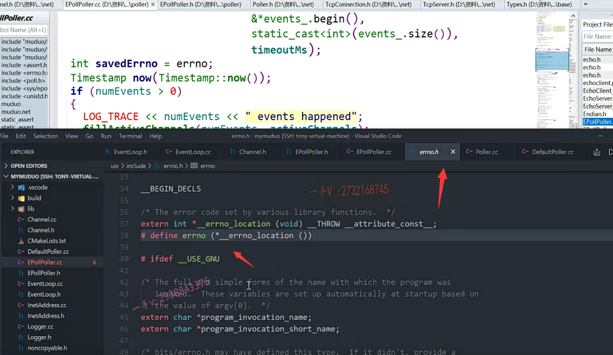

上节课呢，我们给大家把epollpoller这个模块的update channel remove channel跟它调用到的这个update啊，我们把它的逻辑说完了，

这节课呢，我们把这个epollpoller这里边儿剩下的这个poll。

也就是说我们之前呢，在构造函数中啊，映射的是呃epoll create对吧？

update channel跟remove channel，这里边儿映射的是epoll control，

现在呢？poll就是epoll wait。

就是epoll使用的三部曲啊，第三部了啊。

### 给之前的日志增加函数名，使用系统内置的宏

那么在说之前呢，我们把这个之前的日志这块儿，我们再丰富一下吧，

之前这块儿加的日志呢，并没有体现出来这是哪个函数的，对吧啊？

我们再给它加个func吧，加个func是百分之s，

因为函数名是一个字符串嘛，是吧？是一个字符串啊，

加了这么一个东西。

==嗯，像文件名字啊，函数名以及所在的行号啊，这个都是我们编译器默认内置提供的宏，==我们直接使用就行了啊。

呃，然后这个呢？应该是个function，对不对？function啊。function，

那我们把这一句拷贝一下。

拷贝一下给我们的这个remove channel呢，也去加一个什么吧，

也去加一个日志吧啊。加一个日志好了，这是fd ，就是上边的这个fd啊。

这是remove呢，我们channel就不需要了吧？

好吧啊，我们就只打印谁呀？只打印这个函数名跟fd就可以了。

这是在remove channel。

好，我们给update channel跟remove都加了一下日志的调用啊，

日志你想怎么打就怎么打好吧啊，你想说出什么内容，这都是由各位自己的啊。

在这里边儿，不必一味追求的统一啊，有个人来在这里边儿呢，因为这是重要的接口，我们给这里边儿演示一下。

给大家说明呃，重要的接口，我们一定还是要加一些相应的日志啊，未来万一出问题了，我们好去定位为问题。

## poll实现

### poll日志

好，那poll这里边一上来就是日志啊，我们也加上吧。

这个是叫做poll啊，

这里边的这个日志啊，实际上应该是。大家来想啊，后这里边儿是监听了所有的这个fd以上的事件的，

所以这里边儿调用肯定是非常频繁。对吧，

所以这里边如果用log info的话，log info是无论如何它都会输出的，

那么这个日志的输出呢，将作为我们poll进来必须要做的事情的话呢，

==将对我们poll的执行的效率呢，有所影响啊，==

对吧？==像一般这个啊呃，这里边儿呢，我们应该选择debug更合适，==

因为不开启debug模式的话呢log debug是不是它是不显示的，

就不会影响poll的这个调用效率，因为poll它可能是在高并发的情况下，

它短时间进行大量的调用啊，如果我们默认是没有开启debug的log debug，它是不会显示任何信息的。

没问题吧啊，这里边。==实际上，应该用log debug输出日志,更为合理。==

好吧啊，那我们为了到时候呢呃，直接运行起来就可以看到整个程序的运行流程啊，

直接就能看到运行流程。

还是在这里边用log info进行打点，把这个日志呢全部输出出来啊，

这个是。func.百分之s啊。然后在这里边是fd total count. 百分之d。

在这儿打印一下channels点size。

==(下面这里写的时候,漏掉了调用函数名，应该加上__ function _ )==

## eventloop poller channellist 关于poll方法的关系

那么，大家来注意一下啊，

之前我们给大家说过了，这个event loop里边呢，人家有一个channel list。

就是所有的channel啊，所有的channel。那么都是在event loop里边管理的。

那这个channel创建以后呢？就是向poller里边儿注册的，还有未注册过的，

全部放在event loop里边儿的channel list。

如果呢，某些channel向poller里边儿注册过了，

那么这些channel会写到poller里边儿的成员变量有一个channel map里边儿。

好的吧啊，那么poll的这个方法呢？

==还是通过eventloop来调用的poller里边的什么方法啊？这个poll方法的。(相当于基类里的同名函数)==

好吧啊，第一个参数就是一这个event loop事件循环啊，给这个poll。就是给这个lO复用啊，给这个lO复用具体的epoll的这个lO复用传的这个最后一个参数就是超时时间，

第二个呢就是active channels，大家看这是用指针进行传递的，

也就是说eventloop，到时候呢，人家会创建一个channel list，

并把创建好的channel list的地址呢？传给这个poll 。

poll这个函数的作用是？通过epoll wait监听到哪些fd发生了事件，

也就是哪些channel发生了事件，把真真正正发生事件的channel呢？

==通过这个形参填到event loop提供的那个实参里边。（因为传的是指针）==

没问题吧啊，也就是说呢，

==这个函数主要的作用就是通过epoll wait把发生事件的channel呢通过这个参数active channels告知给谁呀？告知给event loop。对不对啊？告知给event loop好了==

event loop里边。具体拿到这个active channels以后，它做什么业务逻辑，

那我们现在先不要着急event loop的这个代码逻辑，我们还没有实现呢。

我们现在是poller跟channel。我们把它俩实现完poll呢，

我们今天马上就完了啊，

### epoll_wait的封装

大家来跟我看看。

调用poller的poll啊，然后呢，就开启这个事件循环啦。

那在这里边儿number events。是调用epoll wait。

第一个参数是什么呢？就是epoll的这个fd。这个没错吧，

#### 第二个参数 怎么能拿到vector底层的那个数组的起始地址呢

你看第二个参数是什么？

各位第二个参数本身应该是存放发生事件的fd的event那个数组，

但是呢，实际上为了更方便的扩容啊，为了更方便的扩容，我们装events的这个数组用的是vector。对吧啊，

但是呢，人家第二个参数是需要这个数组的起始地址，

vector底层就是数组嘛，

==你怎么能拿到vector底层的那个数组的起始地址呢？==对不对？

你看应用是很巧妙的，你应该是又学了一招儿，如果你之前没接触过这个的话，

首先begin evens的begin，反问的是这个容器守元素的迭代器。是不是啊？

首元素的迭代器。它底层是个啥数据结构嘛？这个vector底层是个数组嘛？

也就是说events.beigin返回首元素的这个迭代器。==也就是返回了首元素的地址==。对不对？

==但是它是用一个面向对象的iterator来表示的==，

解引用是啥意思？解引用就是首元素的那个值嘛？是不是首元素的那个值啊？

唉，由于首元存放首元素，那个值的那块儿内存取个地址，这相当于就是什么东西啊，

这相当于就是我们vector底层的数组的起始地址。

好的吧啊。这个非常的，这个巧妙啊，

#### 第三个参数  类型安全的强转

然后呢？再是长度，那就是events点size了。

这里边儿之所以做一个强转，是因为呢？

==这个size人家返回的是size_t就是无符号32位的int，==

但是呢，epoll的第三个参数是需要一个int有符号的int，对吧？

==在这里边采用了这个C++的这个类型，安全的这个强制转换==，

这个在这个C++语言里边已经给大家讲过了啊，我们直接使用。

最后一个是什么？最后一个就是epoll wait的这个调用的这个超时时间啊time out。

那么，这就是这个函数的调用epoll wait封装。

那么在这里边，我们看一看后续的处理。

首先呢？在这儿一上来先。

用一个局部变量save number errno，把这个全局的变量errno记录下来。

因为大家知道这个error number是我们库里边的是不是我们库里边的呀？它属于一个全局的，

### 多线程访问全局变量errno可能会出错，所以用局部变量记录

但这个poll可能在多个线程里边都会被调用。

啊，因为一个线程就是一个event loop，

一个event loop底层就有一个poller嘛，对吧啊？

所以呢，有可能多个这个event loop啊，

多个event loop的poller在执行的时候都可能访问这个errno都

可能出错，都可能去写errno number，

所以呢，这里边儿。呃，调用完了以后呢？

先用一个局部变量，把这个errno 存起来啊，存起来，

### 获取当前时间

然后做了什么事情呢？

获取了当前时间，对吧？

我们有没有包含时间的这个？应该是在它的这个头文件里边包含过啊，包含过的话，

那我们就直接使用了。timestamp.写个now。那就是。timestamp那获取当前的这个时间啊。

if number events如果大于零，这表示什么表示呢？

这个有发生，已经发生这个相应事件的是不是这个fd

表示发生事件的fd的这个，个数就事件的个数对不对啊？

那么，在这里边儿，它加了一个日志啊。

但这些日志呢，我们应该是用实际上用log debug输出是最合理的原因，刚才已经说了啊。

这在这里边就是多少个events，是不是happened呀？百百分之d。eventshappened.

好吧啊。然后在这里边就是number events。

完了以后呢，在这儿==调用就是fillactive channels==。

发生事件的这个event的这个个数就是这个numberevents嘛，对不对？

第二个呢？我们就把这个active channel呢？也传给这个fill active channels。好吧啊，

这个呢，我们具体逻辑是什么？我们一会儿来写，

### vector需要扩容的情况 events是poller中的vector容器

我们先把这个poll的大逻辑来看完啊。

在这里边，==如果说返回的number events跟你实际的这个events的长度是一样的，==

那也就是说呢，

这一轮啊，你这个events这个vector啊，

==所有的监听的，所有的event都发生事件了，==

那就要进行一个扩容啊，说不定发生事件的比这个是不是还多啊？

啊比当前的vector里边所容纳的events还多，

所以呢，我们接下来呢，就是扩容的一个操作啊，

各位，这个是number events啊，number events。

我们直接可以用这个来对比，等于events点size。

就是返回的发生事件的个数呢，跟这个vector里边儿的元素是不是个数是一样的了啊？一样的话呢，我们对这个vector呢？

==就进行一个扩容了啊events点resize==。是原来的多长啊？

==二倍扩容。对吧啊，原来的2倍扩容。==那在。

### 如果没有fd发生事件

else如果是numberevents=0的话，这表示什么呀？

这表示nothing happened，

==就是属于epoll wait呢，这一轮监听过程中啊没有fd发生事件==

==只是由于time out超时了，对吧啊？只是由于time out超时了。==

在这儿我们就不频繁输出这个了吧？输出个debug啊。

嗯，这个是哪个函数？time out.啊，这是time out返回了啊。

再else的话，你看呢？它有什么处理？

einter就是外部的这个中断对吧啊？

外部的中断一般来说呢，我们还是要继续呢，执行我们的业务逻辑的对不对？

所以你看啊，这里边如果是。如果是一个einter，

save errno等于这个linter

就是一个响应的外部中断，那没关系，应该是if 进不来，

那继续就转到这个，转到这个是不是继续进行业务处理啊啊？继续进行业务处理。

而如果在这里边，这个save number不等于一个外部中断，

那也就是说由其他的错误类型引起的，

在这里边儿，它把这个error number赋了一下，

然后干什么呢？然后它用了一个log error，

那我们也用log error吧。运行log l进行输出，

#### 用局部变量记录当前线程的errno，因为errno是全局变量，其他线程也会修改，所以需要事先记录

有些同学问为什么把savedErrno又赋给errno，这是由于它的这个日志系统的这个输出。

因为在它的这个log system error里边儿，

它访问的是系统的全局变量error number。

好吧啊，它为了记录呢，当前这个loop里边具体的发生的错误的值，

那么它应该在输出的时候呢，把这个savedErrno再复到errno上来。

要不然的话呢，你看在最开始的这里savederrno拿到了errno的值，

但是呢，中间处理的过程中，其他的loop有可能也发生相应的错误，

把全局的这个errno的值给写了，

这里边儿再去输出错误消息的时候呢？就不一定能拿到最开始它这个loop里边的这个错误了好吧，

==这里边实际上是为了适配啊，它的这个日志系统logs is error。因为它里边访问了errno，所以这里边把errno重置成它之前，就当前这个loop之前发生的这个错误的值啊。大家知道这么一个处理就行了==。

呃，这是发生了这么一个东西。errno好了，这就是记录了一下。

对吧啊。

而最后呢，把什么返回回去了。把这个now返回去了啊，

就是具体的发生事件的时间点返回去了。

对不对啊？这就是这个poll做的事情，主要就是调用epollwait。

等于零,属于超时，

小于零，是发生了错误，对吧？

是大于零的话，那就是真的有返回值指定的个数的fd发生事件了。

把这些事件呢填到人家参数给暴露的这个指针啊，

通过这个指针修改实参的值，

也就是把发生事件的channel，到时候都填到人家event loop给你提供的那个实参上。

## fillactivechannels函数

好吧，那么接下来我们就看一下这个fillactivechannels。

它的逻辑你应该能想明白，它应该是非常简单的啊。

那么注意你回想一下啊，你回想一下。

在这里边，我们当时呢，往epoll里边放的时候。

就是这个update放的时候，你看啊，

我们这个epoll event ，event点data fd就是我们要监听的fd。

然后呢？给这个data的这个ptr是不是绑定了这个fd对应的这个channel啊？

### 拿到了fd就相当于拿到了channel，这两通过event.data绑定了

你记住啊，那也就是说在epoll event里边。

==如果我们看到发生事件了，我们通过event点data点fd，拿到发生事件的fd的话，==

==我们就可以拿到从同一个event的data点ptr，拿到这个fd对应的channel了，==

这个意思你明白吧？

因为你当时放的时候是把这个channel就绑定到这个event data的ptr这个void*指针上了这个，

当时我也给大家强调。这相当于就是channel，相当于就是这个fd附带的参数，

对不对啊？

好，那你看看这里边的逻辑啊。

首先呢，for循环。这是发生事件的events对吧啊？

那在这里边events中括号I。点这个data点ptr。

### events是vector<epoll_event> 

events就是什么呀？events就是这个用vector括起来的epoll event嘛。

对不对啊？epoll event。

拿到这个channel。

这中间是调试用的，你都可以不看，因为它取这两个值，主要是为了断言用啊，

然后我们看这第一句。

第一句看完了，以后呢？

### channel中三个重要成员 fd events revents

你看channel set events。

channel里边儿有三个重要成员，

一个是fd，就是它表示的一个fd事件啊，socket这个fd事件文件就是这个socket网络描述符嘛，对吧？

另外一个就是events，它这个fd感兴趣的事件，

第三个就是revents。就是真真正正发生的事件，

#### channel就是通过fd获取  events_[i].data.ptr

你看现在呢，就是把这个发生的事件填到这个channel里边儿来了。

然后呢，把这个channel通过那个event loop给的这个参数呢？

我把这个发生事件的这个channel是不是给你呀？对不对啊？

那发生事件的channel从哪来呢？

==我们说了嘛？就是这个fd同样的这个fd 的ptr绑定的，==

==你看同样的这个fd同一个event data的ptr绑定的是不是就是这个fd对应的channel啊？对这个能够明白吧啊，这个要明白啊。==

好在这里边呢，我们把fillactive channels来写一下。

for循环inti=0 I小于多少啊？还小于number。number events，加加I。

然后在这里边做的就是channel。等于我们写个静态的类型，转换cast channel*

==为什么channel星呢？因为呢event点data点ptr呢，它的类型是一个void*嘛，==

对吧啊？这里边进行一个类型强转。events中，括号I点data，

这就是对应的，是不是event呀？就是这个event点data点ptr。点p点啊。

好吧啊，然后呢？做的事情就是channel.set events.

就是现在发生事件的这个event的。events，

然后把发生事件的这个channel啊。

通过这个形参设置到eventloop给的实参里边儿。

那这样一来eventloop就拿到了它的poller给他返回的所有发生事件的。

是不是channel列表了？

唉，它就可以处理了。

它怎么处理呢？

它就看你发生了什么事件嘛，你不是读事件就是写事件，要么是close事件，要么就是error事件嘛。

是不是就这几个呀啊？当时我们写channel的时候呢，我们也都写了啊。

好了，那这个fillactive channels的这个逻辑也就完了。

大家仔细呢，把这个函数的逻辑想一想，看能够想明白吗？

好了，那我们说到这里的话呢，那这个epollpoller的这个模块的这个所有的代码呢，

我们就都说完了啊。

## 总结

主体上啊，主体上就是我们再强调啊，

主体上就是eventloop下就是管理了channel跟这个poller 

一个loop，一个poller对吧？

啊，但是一个loop有多个channel，

这poller呢？在event loop里边儿是通过它的抽象基类来表示的。

啊，可以做到呢，灵活的给它让这个基类的指针指向不同的，具体的lO复用对象，

我们这里边只实现了这个epoll，对吧？epollpoller。 

muduo库里边儿，人家支持了epoll跟poll两种方式啊，

通过poll抽象基类里边儿。规定了这些方法啊，纯虚函数的这些接口

在我派生里边儿重写一下。

那就可以达到在event loop里边站在抽象的层面，

是不去访问我们epoll的具体实现了。

这个epollpoller的构造函数，这里边儿对应的就是什么epollcreate

析构函数就代表的是epoll的这个fd的一个close啊。

这是另外呢，就是epoll control就对应的是epoll poller里边的update channel跟remove channel，

### epoll poller里边的update channel跟remove channel是channel去调用的

注意一下。这里边儿还是channel调的啊

channel呢？那之前说了channel呢？

在这里边儿通过调用呢？

因为channel得把自己注册到poller上啊，

或者在poller上更改已经注册过的自己的是感兴趣的事件啊。

比如读事件变成写事件，写事件变成读事件啊，

那么但是channel我们说了跟poller之间是无法直接通信的啊，

那channel调用的是它父组件了，这个event loop update channel remove channel，

那event loop的update channel跟remove channel最终还是调用到了这个epollpoller的头上就这两个做的是epoll control的动作。

好吧啊，最后就是epoll wait就是我们的这个epollpoller的poll函数。

对吧，灵活的使用了一个vector，可以自动的进行扩容啊，

每一次呢，鉴定到发生事件的这个个数是这个。

那么，那这些相应的事件就填到这个vector里边儿。

如果这个。number events现在跟我们的这个vector的长度size是一样长的话

那就有可能呢，还有更多的发生的这个事件的这个channel呢？

我们并没有被处理，

所以首先呢，你这个vector得扩容，

我们下一轮儿是不是再继续处理啊？

因为我们这里边儿采用的是LT模式，

没有处理的，它会不断上报的好吧，

muduo库呢？没有采用ET模式，之前也有给大家讲到呢，muduo库采用LT模式的一些考虑的地方所在，大家可以反过头去去看一看啊。

好了，那么最后就是我们写了fill active channels。

这最终的目的呢，就是把发生事件的这个channel啊，通过这么一个形参返回给，

是不是event loop啊？让event loop获知。

event loop拿到这些active channels干什么事情？

那我们到时候在event loop里边儿再具体查看一下。好

希望经过这几节课的讲解呢，

大家能够首先呢，把channel通道跟这个poller抽象层

还有具体的一个，还有复用的实现epollpoller的逻辑。给它想明白。

好吧啊，希望多看一看。

我们在课堂上力求呢，是把重点呢，是翻来覆去的讲翻来覆去的讲。

生怕同学们呢，不理解，或者说是没有想清楚，忘掉啊，

希望呢，把我们上课不断强调的东西呢。多去理解一下啊，

把这些一一个模块儿，一个模块儿理解起来了，我们再累积更多的模块儿的话呢，

它们之间的调用关系就在我们脑子里边儿就越来越清晰了。

## 最后做一个编译 发现错误

那我们最后再做一个编译吧啊。

有这个错误，我们来解决一下这个错误啊。

呀，这个错误还不少啊。

### 加一个分号

看一下log点h那么是在37行？在37行。这里边哦，那是因为这句代码我们没加什么，没加分号对不对？

哎，这展开的时候就出错了啊。

再来解决一个错误，我重编一下，因为有可能后边儿的错误是由上边儿的错误引起的啊。

再来epollpoller .CC的第22行。

这个日志没有加分号儿对吧啊？没有加分号儿注意修改一下。

### 少头文件 close函数需要 unistd.h

第27行来看看。27行。这里边儿是。

那这个close has not been declared，对吧？

 man close这个方法unh TD。少加一个头文件。

### 少__ FUNCTION __

okay，继续来进行一个编译。

还有错误啊，这个错误，我们看一下啊，

各位，我们把这个包括这个警告也都处理了。

log点h。百分之s expects argument of tab叉星，but。argument 4还是tap？哦。

啊，我们这个。我们这个好像是写的不正确，对吧？来我们看看这个在什么地方？这个是在这里。e poller CC的34行。啊，百分之s。你百分之s的话，相当于你想把这个东西填到这儿是吧？

==那这不对啊，那少个东西啊，杠杠。function.==

### 有符号改为无符号 还是不行

再编译。还是什么呀？还是这个34行啊，还是这个34行，我们再来看一下。嗯，in expansion of microlog infer。这是百分之s，百分之s，对应的是这个，对吧？第二个是百分之d。对应的是channels点size。channels是这个map。点size。

s的话是个整数。

这个应该是给了一个警告，对吧？给了一个警告啊。

我们再来看看。size tab比如说是这里边儿啊，它嫌这个是一个on size into n size in t。是无符号儿的，这里边儿却是一个有符号儿，

那我们用百分之u来打印吧。这里边儿它还是不行是吧？还是不行。

### 应该什么打印呢？ 应该lu

呃，这个应该是用什么来打印呢？各位。

这不是错误，这是个警告啊，百分之u。百分之u expects argument of type on 3的int是需要一个on 3的int是吧？啊but argument five has tap。这个size type就是channel点size，是一个l。on 3的int。那就是一个。ul呗。lu还是ul我们看一下啊。啊，不是ul啊。这个格式化字符，我们得看一看。

警告也都全部去掉啊。嗯，好像那就是什么了？

==那就是一个lu了，把刚才那个警告去掉了，对吧啊？==

刚才那个警告去掉了，这就是一个long型的unsigned。

啊，long型的on suns注意。

### 拼写错误 LOGERROR

注意第58行58行，我们再来看啊58行，这个怎么了？has not declared in this scope。

那就是我们没有包含头文件吗？这个已经包含了呀哦，是log error r。

我们这个没拼对啊。

继续来进行编译。

再来看啊，我们把这些错误都一个一个解决。

大家遇到错误。我仔细看一看啊，仔细看一看，

不要把错误看到错误发生了，直接就问别人啊，

这样少了很多自己解决错误的这个机会，对于自己的能力的提升是很有限的啊。

不要光为写代码，不会去处理错误啊，你的这个能力上升啊，是有限的，

当你把错误处理的麻利的很的话呢。你对代码的这个理解能力呢，

也会更进一步啊。

### ==却写成赋值了

75行。我们看一看75行，这个left value requires left allow of。你看index是一个什么东西啊？index是个int嘛，对吧？

它表示，channel在poller里边的一个状态啊new。k deleted.这个拼的不对吗？哦，这成负值了，对吧？哈哈。比较对不对？

### 不建议使用memset使用bzero

再来memory set。啊，我们别用memory set了吧？

我们之前不是用过那个b zero嘛？是不是啊？那我们也就直接使用b zero吧。

b zero，我们之前使用过的时候是在strength点h里边儿，对不对？

所以第132行我们看看啊。就是这b。zero b zero啊b zero，我们来瞧一瞧。

两个参数，第一个是内存的起始地址，第二个就是长度啊。

你中间这个不需要了，它默认就是负零的啊。

继续okay 一切正常所有的代码上出现的错误，

我们也到目前为止，我们就都解决了啊，

希望呢大家呢，在碰见问题的时候啊，多花一些耐心去解决一下，

这是非常锻炼能力的啊。

好，那我们这节课的主要内容就给大家说到这里。