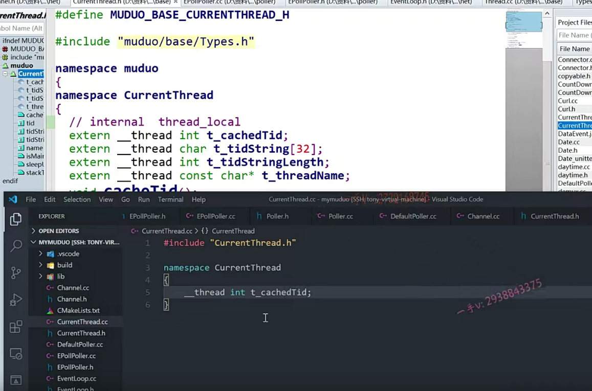

到目前为止呢，我们把这个event loop下管理的这个poller跟channel呢，

我们代码都已经写完了啊。

那么，现在轮应该都轮到这个event loop了，事件循环了啊。

事件循环在这里边儿呢，大家来跟我先看一下课件上啊，

课件上呢就是main reactor，实际上也就是说呢。

在这里边儿event loop对应的就是reactor这个反应堆的这个组件。

啊，那我们之前写的epollpoller对应的是哪个组件呢？

对，就是这个多路分发器的这个组件，事件分发器多路事件分发器。

它就是依赖一个IO复用epoll实现的。

那么也就是说呢，这个reactor来调用用事件分发器相应的操作

对应我们的muduo库上就是event loop调用poller相应的操作。

这个是没有问题的嘛。对吧啊，

我们的这个eventloop呢，你看我们channel。

我们之前都看了channel呢，在这里边儿啊，

通过调用eventloop相应的方法。

那loop相应的这个update channel啊remove channel啊。

这些最终还是event loop调用了这个poller epollpoller相应的方法。

在反映这个在这个事件分发器上呢，

针对不同的channel呢，添加channel，这个修改channel的事件啊，

删除channel相应的一些事件。

好吧啊，那么这节课呢我们？

就要开始进入eventloop代码的这个分析，这个书写了，

但是在写它之前呢，我们这节课还无法直接开始它的逻辑啊。

因为它里边儿涉及了一个内容，什么内容呢？

大家可以看到啊，因为呢，我们的tcp server提供了一个set thread number。

### 为什么要去获取线程id

你使用过它的这个TCP server呃，编写呢服务器程序的话呢，

你应该知道呃TCP server有一个set threadnumber这么一个函数，也就是说呢，

我们的这个服务器程序啊。不一定就只有一个event loop，

我们可能有很多的event loop。

在这里边这个你看这个黄色的，这个reactor呢，相当于就是event loop，

你看可以每一个线程是不都有一个event loop啊？

对了吧啊，每一个event loop它都有很多的channel。

自己channel上发生的事件，要在自己的这个event loop线程里边去处理。

所以为了控制这些相关的逻辑呀。

event loop里边，这里边涉及了获取当前线程的ID。

所以我们这节课先不过多的去扩展event loop的逻辑，

我们这节课的任务是如何获取当前线程的线程ID？

## 线程id的概念

注意是线程ID啊，线程ID什么意思呢？

在这里边给大家举个例子啊，你看这个mysql，我这个当前linux上的mysql

这么一个my server的服务进程，它的PID是个961。

这是进程的ID对吧啊？

那么这里边儿我用top杠HP九六幺查看的是？

my服务的这个进程里边所有的这个线程。

==我们获取的是这个ID，也不是大家用pthread库里边调用那个什么pthread杠self==

==那个打印出来的不是系统里边儿显示出来的这个线程ID==

我们打印出来是这个线程ID要的是这个线程ID。

好吧啊，怎么获取呢？

那我们这节课呢？就来看一下muduo库里边封装的这个线程ID。

如果呢？你以后能用到的话呢，需要获取当前线程的线程ID，

那么这节课所写的内容呢？你也就可以用上了啊。

那大家来跟我往这儿看一下，这里边儿有一个current thread杠，这个作用域下的一个tid啊。

首先呢，这里边儿是一个整形变量，应该属于一个全局的变量，是不是全局的变量啊？

唉，这是全局的变量。

而这个全局的变量啊，是用__thread来修饰的，什么意思呢？

这__thread相当于就是这个thread local。

### __thread的含义

实际上C++11也给我们提供了这么一个threat local，这么一个修饰啊，

系统里边本身也提供了

这样__thread这个修饰，这表示呢，

这虽然是个全局变量，同学们全局变量是不是本身应该是所有线程所共享的？

每一个线程看到的都是同一个，是不是全局变量啊？数据段嘛，

所有线程是不是共享的？

那么加这个thread或者C++11里边定义变量，

==用thread local来定义的话呢，那相当于就是说呢，这虽然是个全局变量，但是呢，它会在每一个线程里边存存储一份，存储一份拷贝。==

==这个线程对于这个变量的更改呢，别的线程是看不到的。==

好的吧啊，在多线程里边使用会比较方便一点。

那因为呢，现在是每个线程里边儿都有自己的一个tid嘛，

那你定一个全局变量不可能存所有线程的这个tid啊，对不对？

应该是每一个线程一个tid。所以加了一个__thread，

就表示了每一个线程都有自己的一个t杠catch的tid。

## cacheTid

好吧啊，这里边有一个函数catch did，

因为tid的这个访问是一个系统调用，

总是从用户空间切到内核空间的话呢会比较浪费效率，

所以第一次访问以后呢，就把当前这个线程的tid给它存储起来，

后边如果再调用访问的话呢，直接从缓存里边这个变量里边拿就行了。

好吧啊，那么你看啊，这就是这个获取tid当前线程tid的方法。

这个呢buildin expect这是语句的一个优化啊，语句的一个优化对于这个感兴趣的话，大家可以上网去查一查吧，

在这里边因为这是属于一个语句比较底层的一个优化。

在这里边，我们就不赘述了啊。

如果说这个tid=0，也就是说这个tid当前现在的tid还没有获取过。

如果不等于零，就是获取过的话，直接把线程的tid缓存的值是不是直接返回回去啊，

如果是cache tid的话。

这里边调用了一个get tid。

你看实际上它就是用了一个system call，用了一个系统调用。

sys杠get tid用了一个系统调用，获取了当前线程的这个ID值。

这个没什么大的问题吧啊。

好了，那我们大家来看看，

我们先创建一对儿这个文件，

一个是current thread点h以及current thread点CC。

thread点h。以及。current thread点CC

啊。这里边它定义了一个namespace，我们也定一个吧。current threat啊。

那在这里边，我们也定一下。首先包含图文件。这是定义了一个。__thread。然后是in TT杠catch cached。tid,

好的吧啊。你看它的定义就在这里边，初始化给了一个几啊，

## 全局变量去申明一下

初始化给了一个零是不是？那我们就初始给零。

然后在这里边儿呢，把这个全局变量放在头文件中去extern一下啊。去声明一下。

然后对外提供的这个接口。有什么呢？

有void cache tid。

然后呢，有一个in line，一个内联函数

是内联的话，它只是在当前文件起作用，

那么也就是可以把这个内联函数的定义写在头文件当中是没有问题的了。是吧。

built啊。是这个。bull t.built in.expect.t cach.就是这个cash的。

==如果是零，那就是说还没有获取过什么呀？==

==还没有获取过当前线程的ID，那cachetid()一下。==

==如果它本身就不等于零了，那就是直接把当前线程的tid给返回回去就可以了。==

okay吧啊，

然后在相应的这个CC里边我们。

需要把谁实现一下？需要把这个catch tid实现一下啊。

这个catch tid实现的时候呢？

又是拿这个控制了一下t杠kh的tid，

如果等于零。在这里边儿就是__thread的tid等于什么呢？

等于static cast。PID杠t。sisco，我们看一下这个sisco。

是在哪个头文件里边？需要包含这两个头文件。sis call对吧？

是个sys。get.tid这是通过系统调用，获取了当前线程的ID啊。

通过Linux系统调用。获取当前线程的tid值。

好了，那我们看一下这些东西呢？

应该是也是需要包含相应的头文件的啊。看看能不能man出来，这个man不出来。

### __builtin _ expect在哪个头文件中

那我们看看。它里边有没有包含相应的头文件呢？这个是types.h啊。

嗯，跳不过去，跳不过去的话，不管了，

我们先不能不管，我们把这个呢给它放在头文件当中吧。

UN STD，它应该就是包含在UN STD这个。

哎，这个系统文件这个系统的头文件里边儿的啊。编译一下。

这个因为目前还没调用，是不是？

这个问题不大啊，问题不大，这现在是不报错了？

主要就是要包含这个系统的，这个标准的这个头文件啊US TD。

这就是获取当前线程的这个线程ID这么一个思路。

好吧啊，非常的简便。

再捋一下啊，刚开始呢，这肯定是零零的话呢，

来通过系统利用获取一下当前现在的tid赋给它如果后边呢，

再有获取当前线程tid，

那么这个t catch的it ID就不会等于零了，就直接返回去。

对吧啊，这个没有问题，

好这节课的这个内容呢，我们就先说到这里，

希望大家呢，把这个current thread。

作用域里边儿的这个tid获取当前线程的tid的这个逻辑呢？

熟悉一下啊。

