这节课开始，我们进入这个event loop的这个解析啊，以及代码书写。

eventloop，我们说了啊，在这里边相当于就是reacter模型里边

相当于就是reacter反应堆的这么一个角色。

那么，我们之前写的poller跟epollpoller相当于就是事件的多路分发器，

这里边角色掌控了epoll的。所有的操作对吧？

不过呢，event loop这里边代码上面注释，

你看reactor and most one percent。

因为我们在使用muduo库的时候，

是不是要自己去创建一个event loop对象啊啊？

然后呢？你如果在使用的过程中，你不调用TCP server的set three number？

那就整个这个服务器的结构中只有一个主线程，

也就是你自己创建的这个eventloop。

主事件循环也就是这个main reactor所在的线程

at most就是这个one per thread。

就是最起码你是不是得有一个线程啊，来支撑啊？

那我们这节课先主要来分析一下event loop的成员，它都有哪些成员好吧？

我们把这个成员来分析一下，

首先呢，在上边儿我们能看到啊，

==它使用了这个channel跟poller进行一个类型的前置声明，==

那我们声明一下吧啊。这个channel跟class poller类型的前置声明。

那么接着呢，因为我们要用noncopy able这里边呢，既然作为基类。

编译的时候就需要看到non copy able里边儿所有的内容，

所以你仅仅non copy able进行前置声明是不行的啊。

必须得包含头文件了，这个没得商量。non copy able.

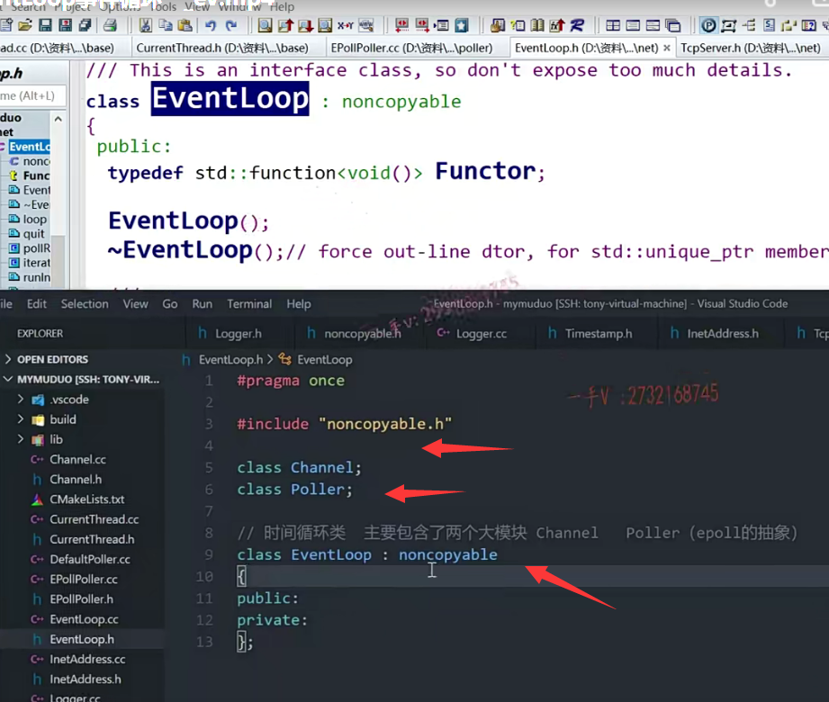

好了，接着呢。

它还用到了这个函数对象类型，对吧？function那我们需要包含一下C++的这个相关头文件啊，functional。

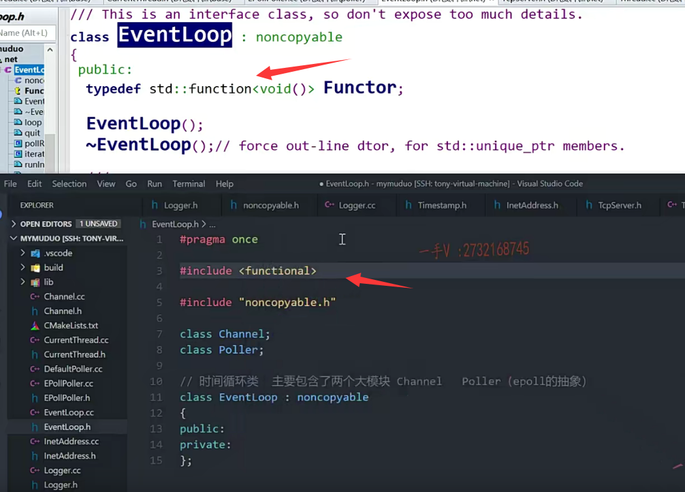

这里边先定义了这个function，

我们先定义出来吧啊using fuctor。等于STD。function.

就相当于定了一个回调的类型啊？

哎，回调类型，现在我们基本上都用C++11的这个新规定的，这个using。

扩展了using的这个功能，原来它只支持。

呃，就是什么呢？using namespace是不是啊？

这是我们之前用的，它只有那个功能，然后呢？

现在还可以代替原来的这个type define用来进行类型的这个重命名啊。

## 看Eventloop 成员变量

好，我们先观赏一下它的这个成员变量吧啊，

这里边所谓的这个k困啊，包括这里边run at run after run ivory啊，

在哪个时间点运行一个回调？

多长时间得累时间以后再执行一个回调，以及每隔多长时间执行一次这个回调有关时间的这么一个管控处理啊？

我们暂时先不实现。

那么，大家来看，在这里边呢，这现在应该都不陌生了。

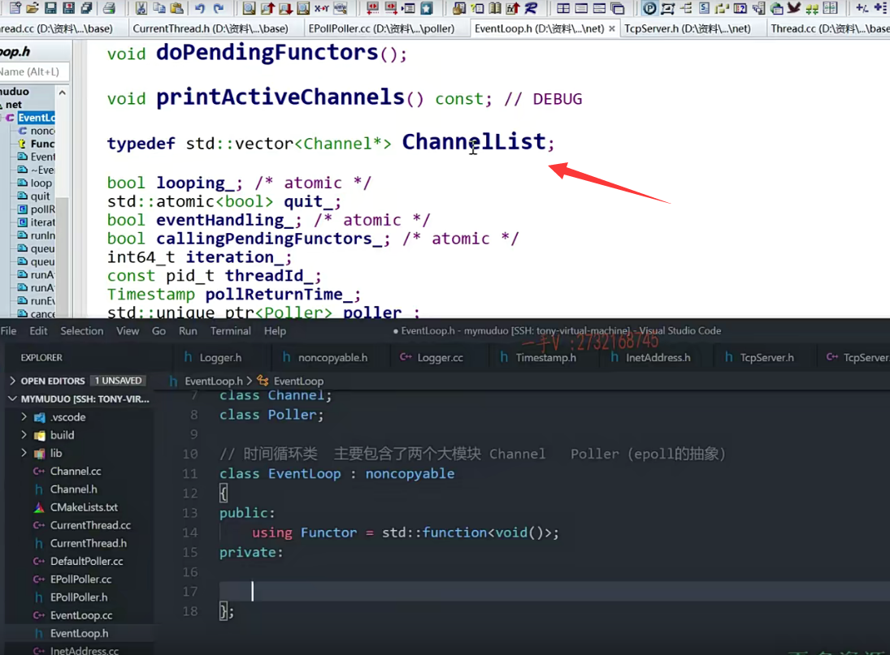

## ChannelList  包含vector头文件

定义了这个channel list，

原来是不是给大家说过event loop里边有一个channel list event这个loop啊，

它管理了很多channel。

它还有一个poller，一个event loop事件循环，

是不是管理了？在这里边管理的是不是一个poller啊啊？

好，那么在这里边我用using 这是channel list啊。等于STD。

先要用到这个vector的话呢，我们也包含一下这个头文件吧。

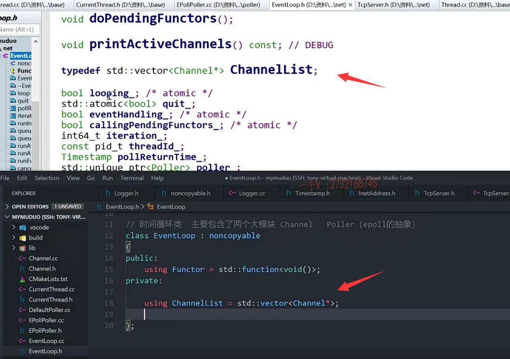

s td VC TOR.这是channel*啊。

好了，那么大家来看啊，这个looping啊，

看这个意思呢，因为我们这节课先不分析它的这个代码的实现啊，人家好的这个命名呢，能够见明之意，对吧？

这个布尔值的looping，

我们看这意思应该是来控制一个布尔值来控制事件循环是否正常进行，还是说是退出循环？

在这一块儿呢，这个作者啊，陈硕也加了一个注释。说是atomic，

尽量把它定义成原子类型的，

对吧？那我们就在这儿去处理一下吧啊。

呃，怎么去做成原子类型的C++11给我们提供了现成的东西啊？

==我们说了嘛，我们这个重写muduo库的目的之一就是把原来依赖boost库的全部给它转成这个C++11依赖的可以做到这个跨平台，对吧啊？==

### 原子操作

C++11提供了多线程，相关的很多的这个内容啊啊，

这里边有个atomic头文件。

那既然是个布尔值。atomic.布尔

okay吧，looping。

这相当于就是一个原子操作的，这个布尔值啊，原子操作的布尔值，原子操作。

==通过这个底层呢，就是通过cas实现的好吧啊，==

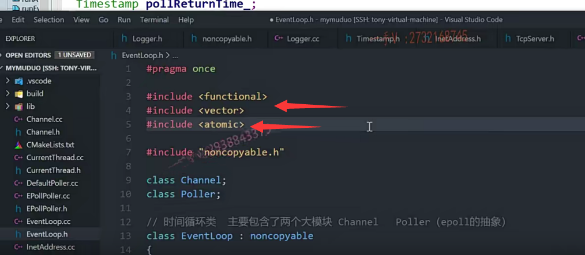

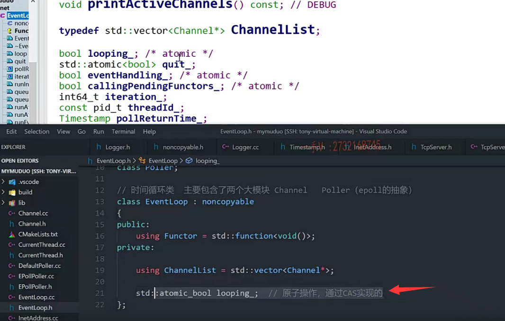

### quit

这是注意一下这一点啊。这还有一个quit。

这个quit在这里边相当于就是退出，应该也是需要的。

因为我们一般都是在其他线程里边去调用啊，

去调用这个event loop的quit。

对吧啊，我们如果在当前线程里边。

当前的这个loop线程里边基本上都是在处理事件啊，使用poller在处理事件。

你想想你在使用的时候，你在使用的时候

是不是比如说啊？客户端全部断开连接以后，你的服务器也进行了quit，

你基本上会调用一个loop的quit方法，是不是来退出事件循环啊？对，

那我们暂且在这里边，大家就把它认为其实不用认为啊，

这应该是标志啊。标志标志退出loop不循环。对吧啊，

感觉好像它的这个looping跟quit。

啊，好像这个作用有一些重叠，是不是啊？

没关系，我们先通过人家的这个名字来分析，到时候具体写CC文件的时候呢，

我们再来看在逻具体的业务逻辑上他们怎么处理啊？

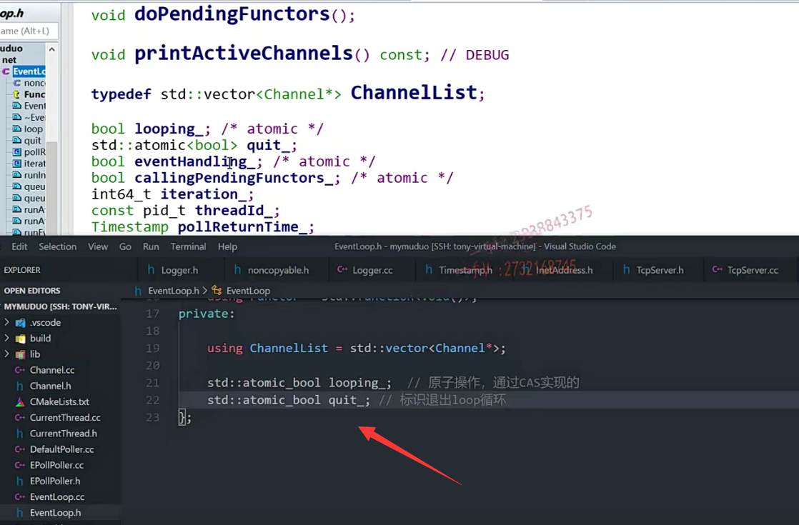

event handling.对这个成员的来说的话，我印象不是很深刻啊，

所以我暂且先不用它嗯，到时候实现的话，

如果非要用我们反过头来，再加上就可以了。

这个需要的啊。atomic atomic布尔值，这个叫做calling。pend喷灵functor s。

这是干什么用的呢呃？

这个标识啊，我们先写出来啊。

呃，标识是这个当前loop是否有需要执行的这个回调操作啊。

在这里边，大家不明白这个呃，这个东西呢，无所谓啊，

因为我们还没有到看实现的地方呢嘛啊。

这个不需要了，

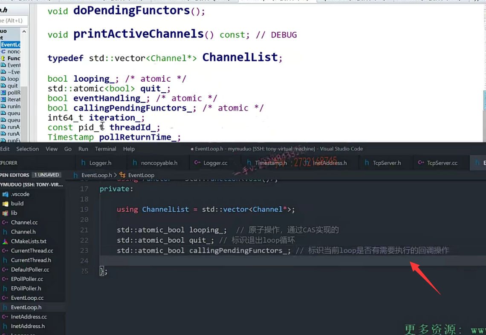

### threadId_

这里边有一个thread ID

上节课，我们已经说了，如何在代码上通过这个系统调用？

啊，并且缓存是不是当前loop所在线程的这个ID啊啊？

我们在这里边。PID杠t啊，然后是thread ID。okay.

当前线程的这个ID啊。记录loop。

记录当前loop所在线程的这个ID。

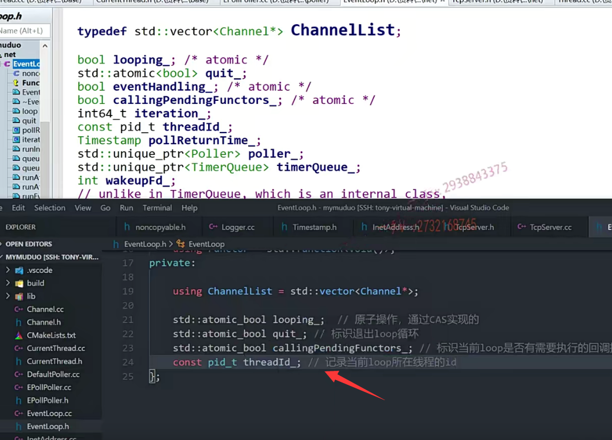

我在这里边稍微解释一下啊，那么在这里边啊，

大家看看这个课件啊。

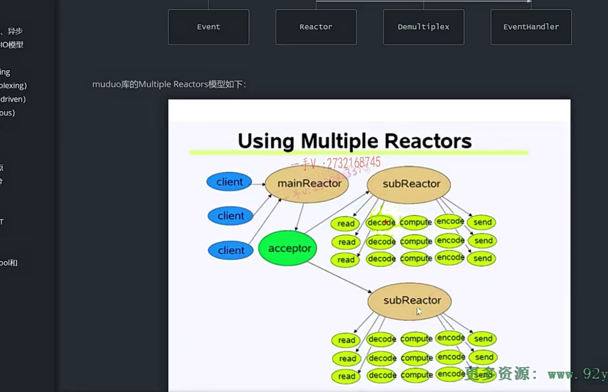

## 流程说明

你想啊，

这个Main reactor它最终啊，

如果我们是多线程的，这个就是我们设置了set thread number

是一个==多线程的，这个反应堆模型啊。==

==它 mian reactor在这里边，相当于就是只是监听新用户的连接，就处理accept。==

拿到新用户的这个通信的这个fd啊，把fd跟fd感兴趣的事件呢，打包成一个channel。

==然后呢，唤醒我们某一个，它是采用轮巡的方式唤醒这个worker reactor，就是工作线程。==

来把这个channel扔给一个工作线程。好吧啊，

工作线程上的一个reactor就代表一个event loop。

每一个event loop。每一个这里边的worker event loop啊，

就是工作线程的event loop。都监听有一组channel，

==每一组channel 发生的事件都得在自己的event loop线程里边去执行。==

没问题吧，不会说是在我这个工作线程去执去调用执行你这个工作线程loop里边监听的channel的回调操作。

注意一下，在代码上呢，

==它就是通过这个thread ID。因为所有的ID作为loop的一个成员变量，就记录了创建的event loop对象所在的线程ID。==

==到时候跟当前线程ID 比较，就能够判断eventloop在不在他自己的线程里边。==

好吧啊，这个大家先给大家铺垫一下，

大家有这么一耳朵啊，听过我说说过这么一个逻辑上的一个处理。

到后边呢，我们逐步给大家展开，

我们现在是一个模块，一个模块给大家讲啊，

最后讲完了以后呢，我们会给大家整体的，再把流程整个走一遍啊。

多理解几遍啊，只有好处没有坏处啊

timestamp，大家注意在这里边不是定义指针。

是吧，不是定义引用，是定义变量，

那就得编辑器就得决定这个变量的大小了，所以光进行 time step的这个类型的前置声明是不行的，

必须得包含这个头文件了啊。人家才能看到time stamp的全貌，

才能知道time step类型是个啥定义的，变量占多大内存空间。

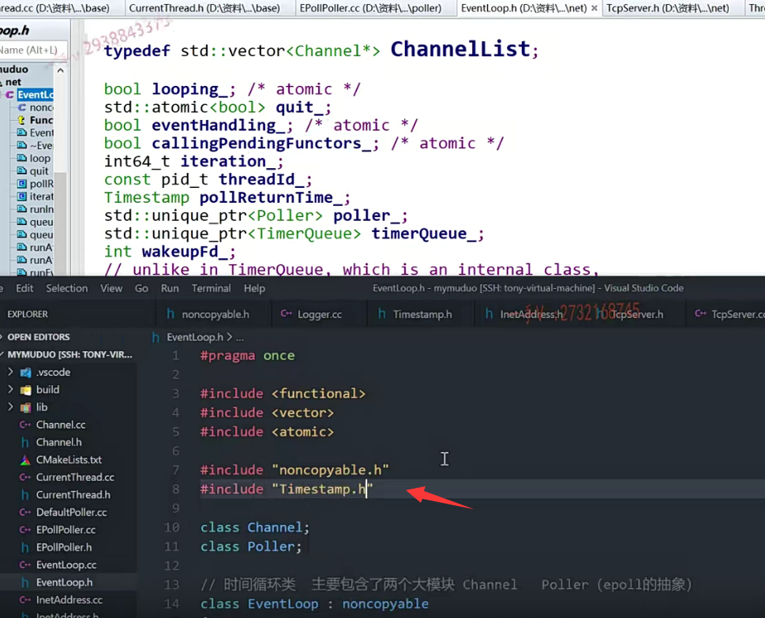

### pollReturnTime

timestamp  pollReturnTime 这我们不说了吗？

event loop是不是调用的是多路事件分发器啊啊？

事件分发器epoll_wait开启循环以后呢？

就监听事件发生，有事件发生以后呢？

是不是就会给这个reactor返回发生事件的这个event呀？

我们把这个epollpoller都写完了，我们知道他==给这个event loop就是这个reactor==返回的是active channels，是不是把所有呢发生事件的这个channels？

都给eventloop返回回来了，

==所以这里边记录的就是poller返回发生事件的channels的时间时间点啊，时间点。==

这不是时间嘛，从名字上就能看pull return返回，是不是时间啊？

唉，这就是。好的，这个编程规范命名风格。

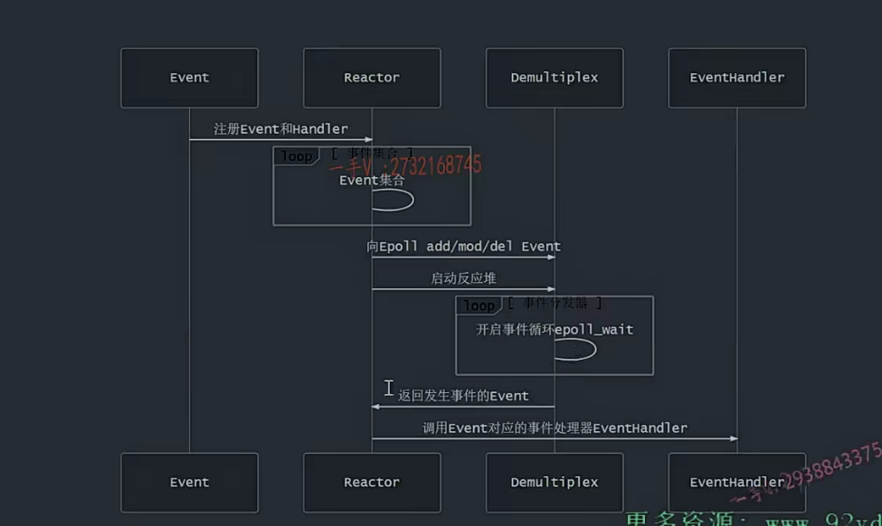

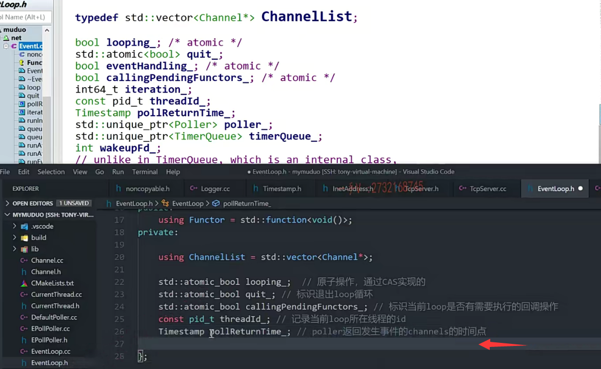

好了，然后再有一个就是智能指针。

大家来看智能指针，我们应该是包含哪个头文件呢？memory memory，对吧？

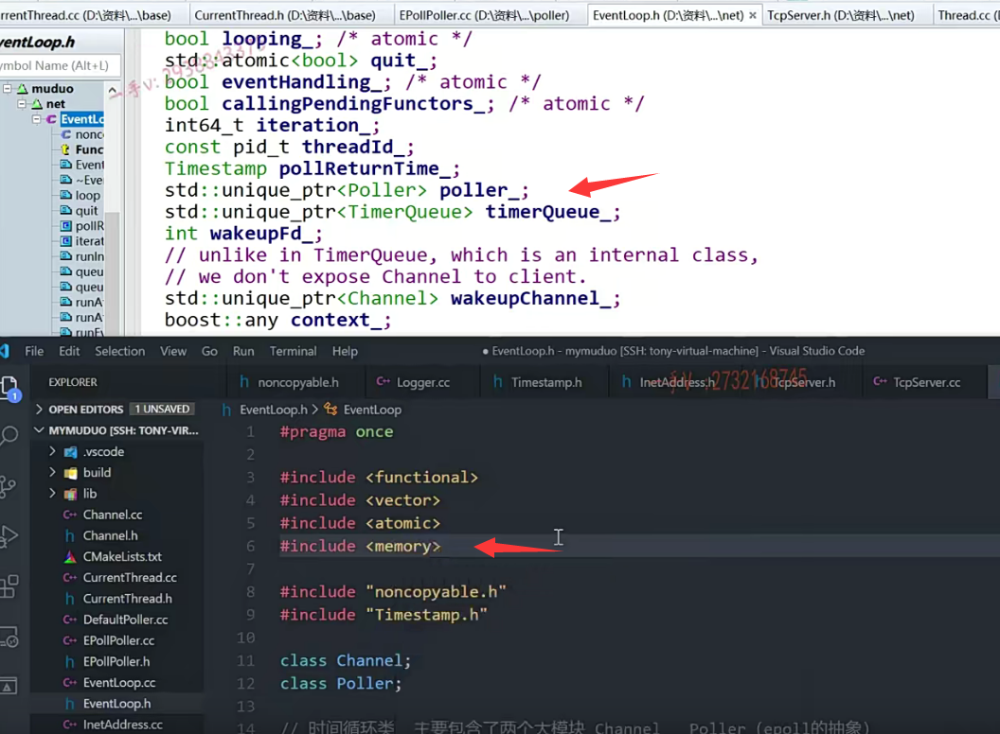

这个智能指针没忘吧，这也是我们强调大家去重点学习的啊。动态管理资源。

这个就是evnet loop所管理的这个poller啊，管理的这个poller。

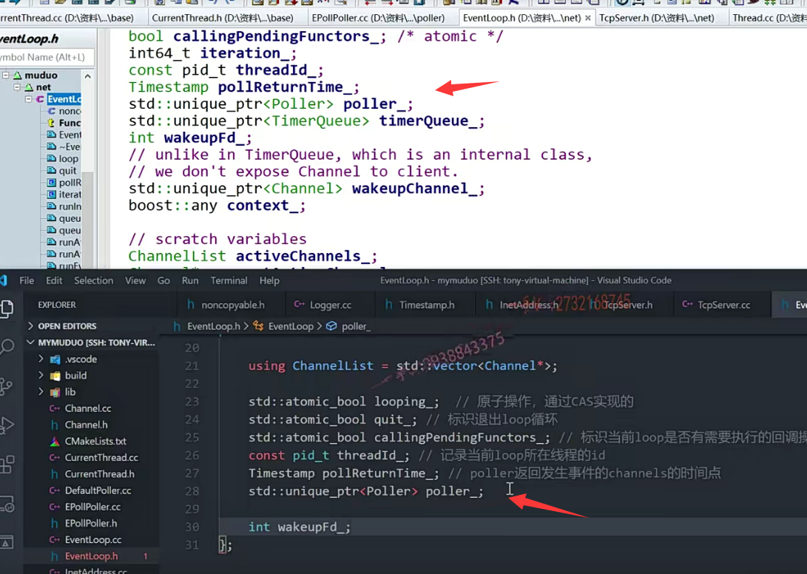

## wakeupFd

timerqueue，我们就不说了。

wakeupfd，同学们啊，这个你一定给我打起12分精神，

你再说muduo库main reactor给这个sub reactor如何分配新连接的时候呢？

所采用的这个负载算法就是个轮巡操作，对吧？

那它是怎么唤醒的呢？各位

main reactor跟sub reactor，

==这些sub reactor如果呢？说是没有事件发生的话，他们这个loop所在的线程都是阻塞的。==对不对？

假如说现在main reactor监听到了一个新用户的连接，

得到了表示这个新用户连接fd以及感兴趣事件的一个channel的话，

他把这个channel怎么扔给这个sub reactor呢？

他们都在睡觉啊。对不对？

假如说你通过轮巡，你现在呢？决定把这个新用户连接的这个channel分发给这个sub reactor，你怎么把它叫醒啊？

各位，你怎么把它叫醒？咋叫醒的？你怎么处理？

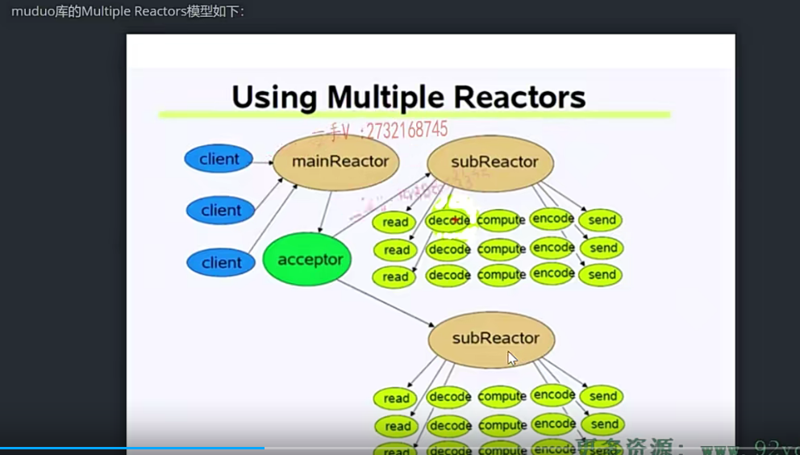

这其实就是统一事件源的这么一个原理了啊。

那么，在这个libevent，大家应该也听过libevent是用一个用c写的也是一个经典的reactor模型的。

呃，底层也是epoll+nonblock啊，加这个线程呢？这么一个网络模型啊。

它采用的是socket pair。就socketpair。

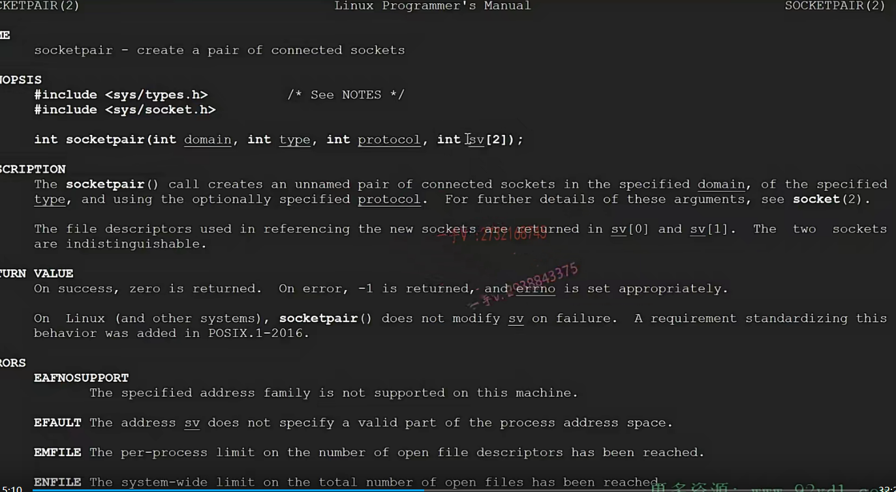

就是创建了一个本地啊socket的一个数组跟管道不一样的是

这两个这个socket呀，是都是可读可写的啊，

不像管道。只能一端读一端写。

好吧啊，这就不延伸展开了，

## eventfd 线程间的通信机制

那么muduo库里边采用的机制呢？也是比较新的啊，

是这个Linux内核里边提供一个新的就是叫做event fd。

那创建了一个eventfd。

那么注意一下啊，event ff tcr is an。event fd object that can be used as an event w eight notify

你一看见这个wait notify你就知道了，这不是线程间的通信机制吗？

对不对啊？就是我这个线程啊，可以notify，可以通知你其他线程，你起来做事吧。

对不对by using by user space applications and by the kernel to notify user space applications of events？

就是说呢，它调用这个方法，这是个系统api，

就是在内核，可以直接去notify用户空间的一个应用程序。

让它的一个线程，让它起来是不是做事情啊？效率非常之高啊，

大家建议大家在网上呢，去多查一查它的一些介绍好不好啊？

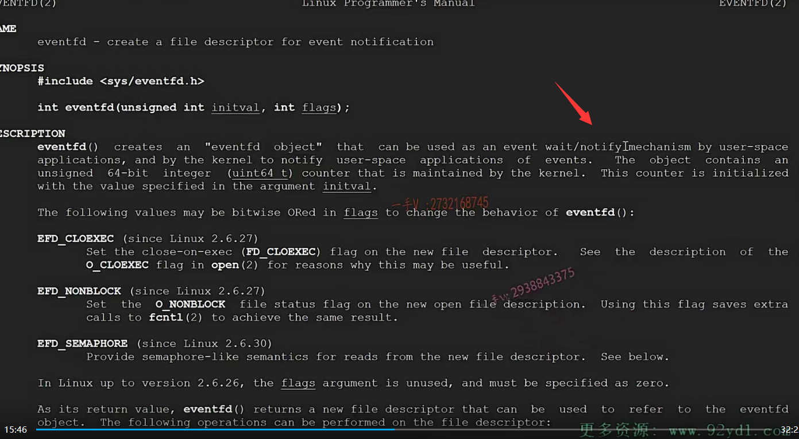

那么，这个wakeup fd在这里边就是我们用event fd.这个函数创建出来的。

好吧，这个主要的作用是干什么呀？当Main loop获取一个新用户的channel。

通过轮询算法选择一个sub loop。

也就是这里边画的一个sub reactor反应堆，

现在在这里边说的就是event loop指的就是这图上的一个反应堆。

好吧啊，大家呢？注意区分一下啊。

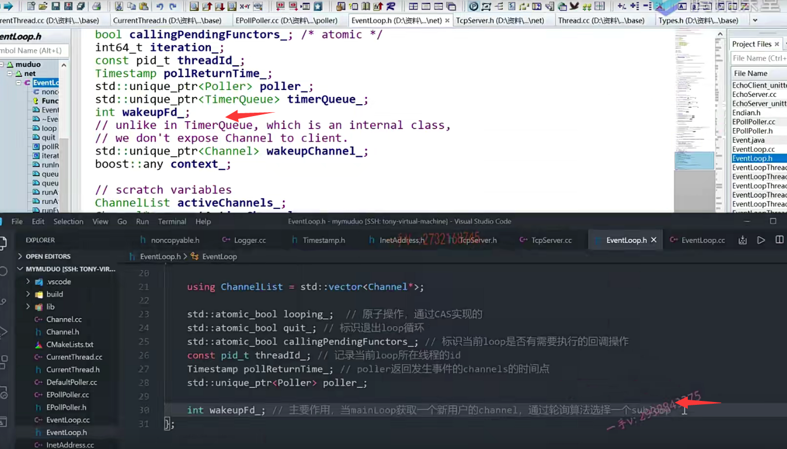

通过轮询算法，选择一个sub loop，

但是sub loop都在睡觉啊，都有可能是不是在睡觉啊？

通过该成员通知，应该是唤醒sub loop处理channel。

没问题吧？哎，注意一下啊。很相似了。

muduo库里边儿这个main loop 唤醒 subloop

用的是event fd这个系统调用。

相当于是调用这个以后

==在内核空间可以直接notify，相当于是这个线程间的一种通信机制效率会比较高一点。==

呃，刚才给大家说了lab event用的这个就是主loop跟这个子loop之间的这个通知机制啊，

==是主loop跟子loop之间都创建了socket pair，相当于双向通信的socket。==

==走的是网络通信这么一个模式。==

其效率是不如这个event fd的。

啊，所以muduo库呢？因为muduo库写的时候呢这个。相对来说是比较新的啊，比较新的，

所以用了这个内核的这个事件通知机制啊event fd。

在这边希望大家学到这一招啊，如果你没有用过的话，希望你记住这一招，非常不错。好，

## 智能指针 wakeupchannel_

这是wake up channel啊。

STD.unique ptr channel.wake,wake,wake up.channel.

那么，这个wake up channel肯定要把wake up fd，

是不是得给它封装起来呀？

因为我们在poller里边儿并不会直接操作fd，

我们操作的都是channel嘛。对不对啊？

==这个wake up channel里边应该包含了wake up fd以及感兴趣的事件。对不对啊？==

==都打包成这个channel了==

这个context我们不需要。

然后这里边还有一个什么？

就是channel list active.channels，

这就是event loop所管理的所有的这个channel，对吧？

然后呢？channel* current active.channel，

实际上你要这个current active channel要也行，不要也行，

因为它用这个指针主要的作用又是在它代码上去做一些断言操作啊。断言操作，

我们可以不用。

写上吧。

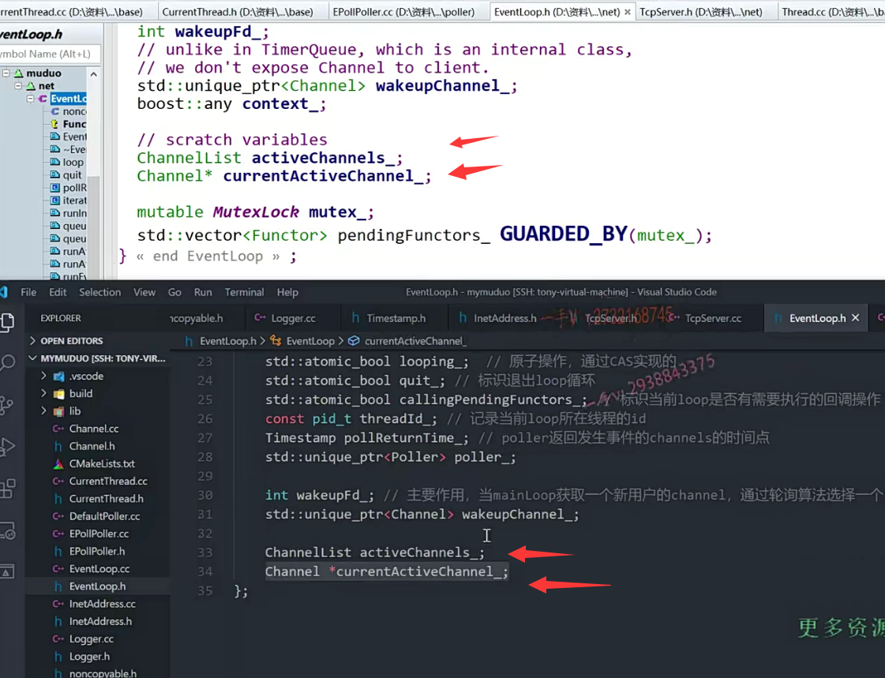

啊，这里边用到的这个锁，因为诶，

它有一个pending factors，

实际上是跟前边这一块呢是有关联关系的啊。

这个是标识，当前loop是否有需要执行的回调操作，

那如果有的话，那那些回调在哪儿放呢？

==那些回调就都在这个vector里边儿放着呢。==

这个function函数对象类型之前都定义过了，

它里边儿放的回调都是返回值，是void 不带参数的，是不是回调操作啊？

在这我们写一下吧。vector.functor function叫做pending functor s。

这里边儿呢，相当于是声明用锁来，是不是保护这个啊？锁

来保护这个pending functor s。所以它需要一把锁。

一把锁的话，我们直接需要用到这个C++11的mutex就行了。

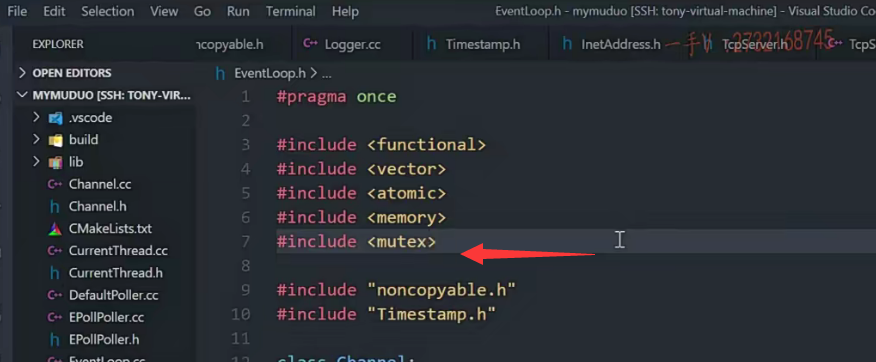

okay，那么在这里边看一下。stb.mutex.

来写个mutex下横杠。没问题吧？

这个是存储这个loop需要执行的所有的回调操作。

好吧，存储loop需要执行的所有的回调操作啊。

那么，在这里边儿。

互斥锁所用来保护上面vector容器的线程安全操作。

好了吧啊，线程安全操作。

那么，这是它的这个成员变量啊，

我们把它的成员变量，首先呢，输出了一下，

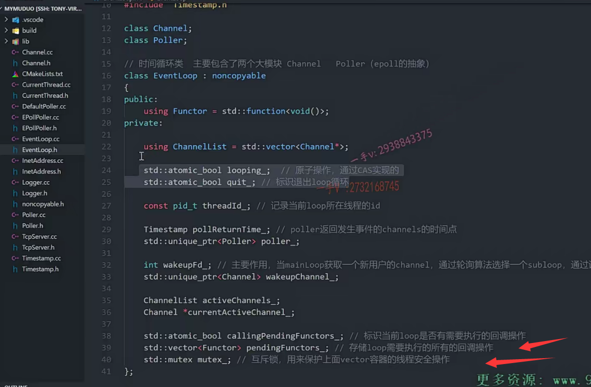

这两个是跟这个事件循环本身呢？

是否继续循环，是否继续loop下去，相关的控制变量对吧？

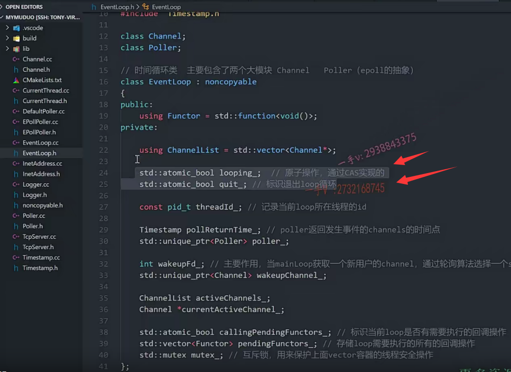

这个呢，是标识了创建event loop的线程的ID。没问题吧啊，这个到时候呢，也有用处啊。

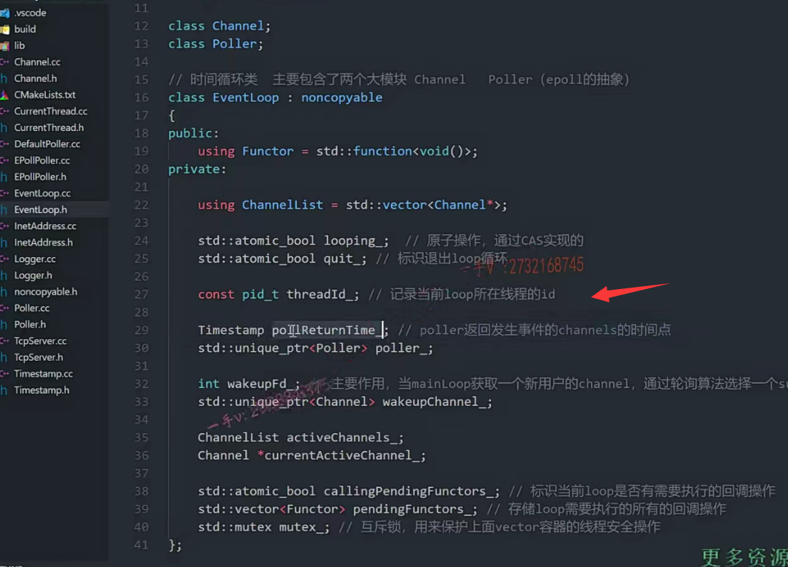

这个呢，是跟poller有关，

这是event loop所管理的poller，帮它监听所有的这个channels上发生的事件对吧？

这个是poller给他返回发生事件的channels的时候的一个事件时间点啊。

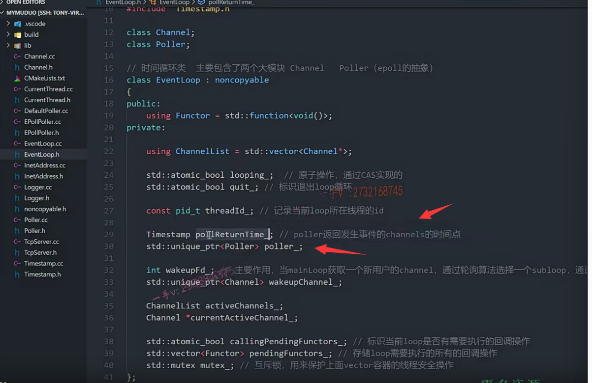

==这个呢，是用于wake up channel==

注意它调用的是什么呀？

==调用的是event fd这个函数啊，==

将来呢，要作为啊，就是主loop 给worker loop。

通知唤醒notify啊，唤醒这个工作线程上的这个loop。

主要作用就是完成这件事情。

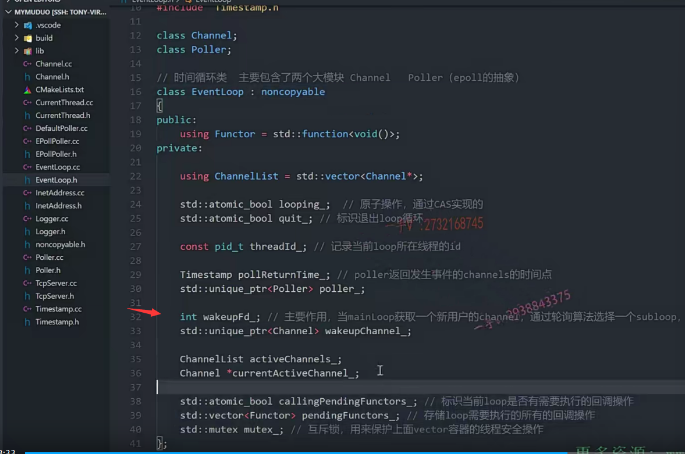

这个是存储了这个event loop下的，所有的这个channel相关的啊。

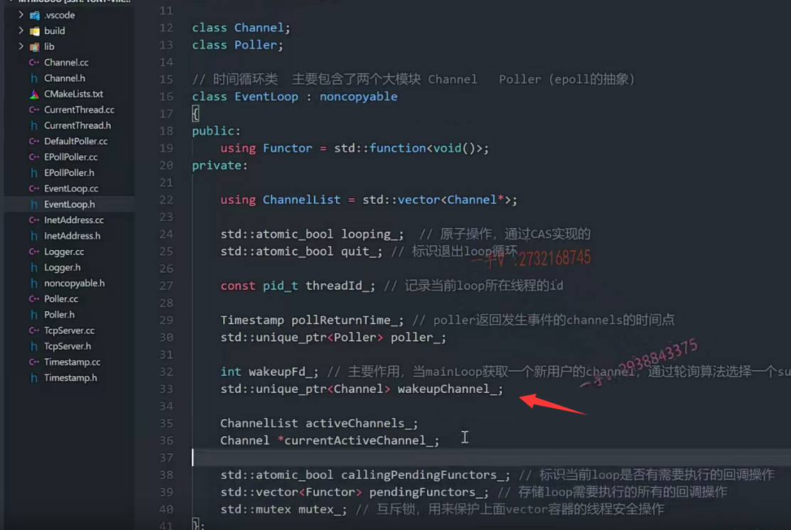

这个是这个loop上需要执行的，这个回调操作。

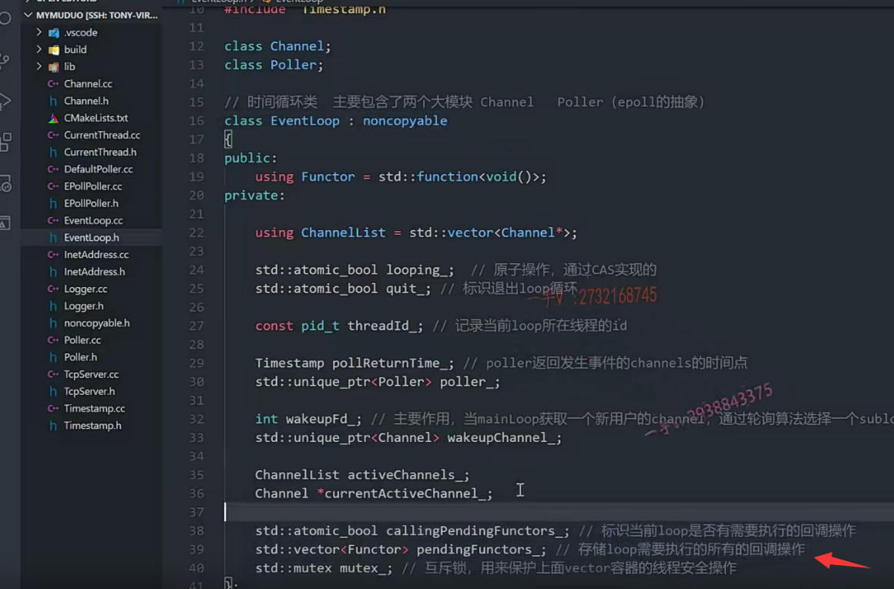

先这几类呢，我们先放到这里边儿。

好吧，为什么要这些东西？

我们同学们先不要着急，我们逐渐的先把它每一个组件给它分析清楚。

啊，最后我会给大家从前到后从上到下去，

给大家整体的去叙述一下他们设计的一个优点。

好吧啊。那么，这是成员变量完了啊，

# 成员方法

成员方法我们也汇总一下吧啊，

首先呢，是它的什么呀？构造跟析构函数。

OK，这是一对。

然后呢？就是loop。

这个loop也是我们需要调用的嘛，对吧啊？

开启事件循环嘛？

你回想一下，你用TCP server跟event路边写这个基于muduo库边写服务器程序的，

这个编程的这个步骤啊。

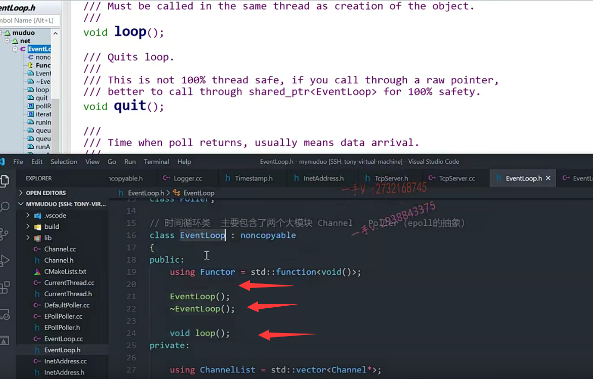

然后呢？这个是什么？quit啊，quit。

这一个。time step.Paul return return can.const

这个是非常简单的一个函数啊。

这个我们不需要了，

run in loop。void run in loop.这有一个回调。to rcb.

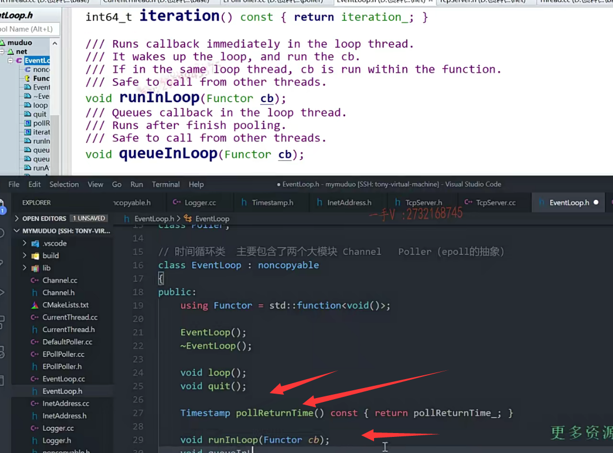

还有一个queue in loop。fuctorcb.

==runInloop跟queueInloop，这两个是我们后边给大家着重强调的啊，==

着重强调的为什么？

同样是在loop中执行，一个就是在当前loop中执行，

一个是要放到队列中。转到这个loop所在线程里边，再去执行，

为什么有这样的说法？

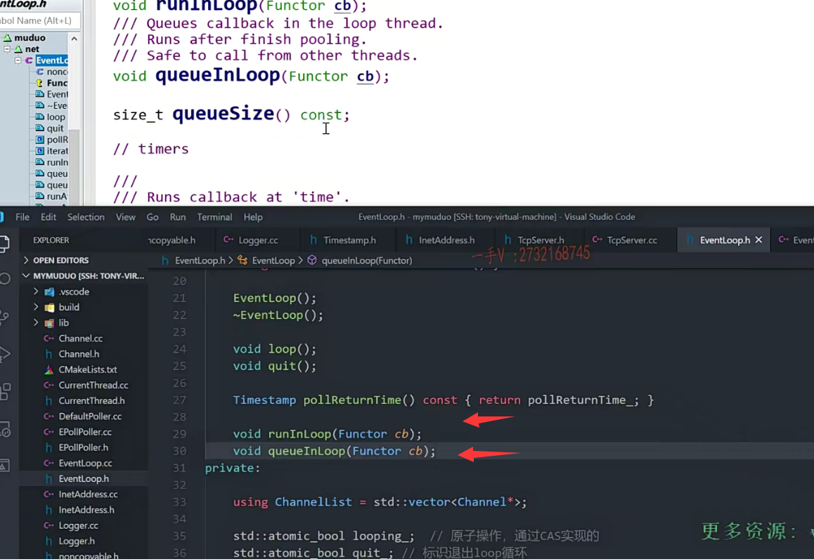

好吧啊，这个呢？实现eventloop代码的时候，

给大家详细道来啊run at run after run every。

在这些东西呢，我们就都怎么样啊？

就是跟定时器相关的这个任务处理，我们先不关注啊，

### wakeup()

这里面有wake up。

wake up这函数，你现在猜都能猜出来它是干什么的，干什么的诶？

Main reactor用来唤醒sub reactor的，对吧？

### updatechannel()

update.这个应该你也不陌生吧？channel

调用的就是loop的update channel remove channel是不是

来间接调用poller相关的update channel跟remove channel。

来更改在poller上channel相关的fd的是不是事件呢？

channel* channel。

void remove.channel channel.

这里边这个has channel应该是我们用不着啊，用不着写上吧。channel，

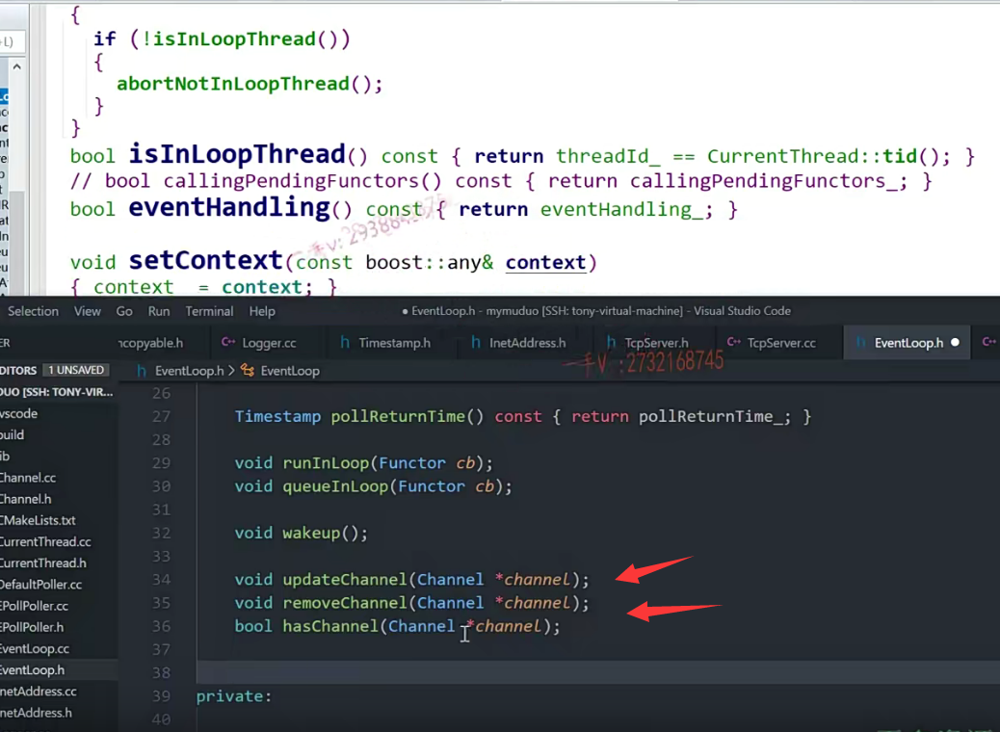

然后这是一个assert in loop thread。

啊，是一个断言这个loop师傅在当前线程，

## isInLoopThread()

你看。我们把这个函数写出来is in loop.是不是thread呀？

这个是event loop，当时event loop对象创建的时候，

所有的线程ID这个是拿了一下什么？

我们包含一下头文件啊。current threaten h.

这个是拿了当前线程的ID这两个如果相等的话，

证明啊这个event loop这个对象呢？

现在是不是就是在他所创建它的？是不是这个loop线城里边啊？

那就可以正常执行回调，

如果没有在创建它的这个eventloop对象的线程里边呢，

那就得queueinloop。

当唤醒到它自己线程的时候呢，才去执行这个loop相关的回调操作啊。

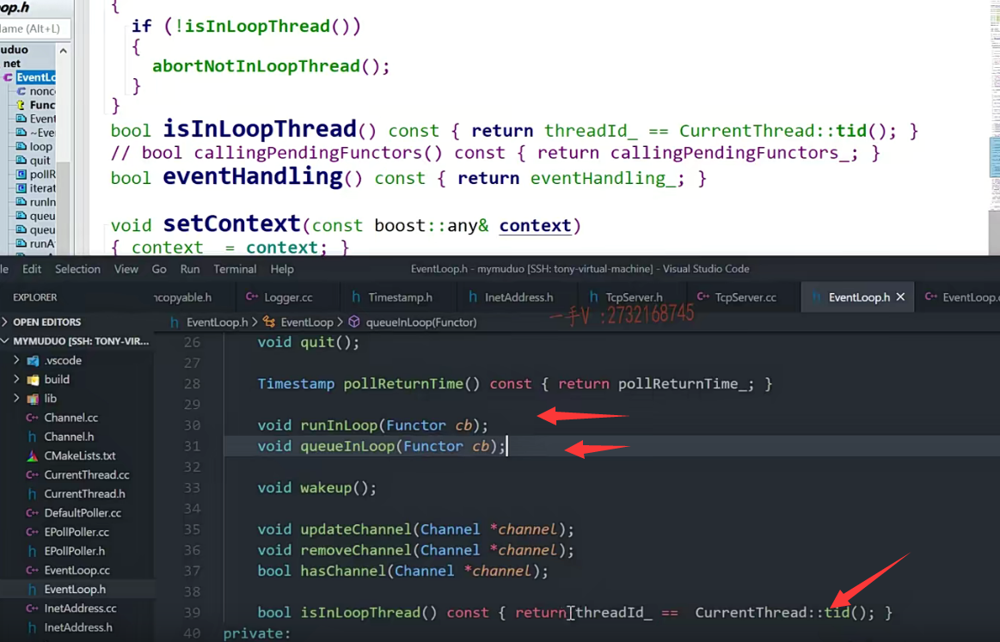

那么，这里边的eventhand handling我们不需要

set contest，这些都不需要啊。

需要那么在这我们再补几个内部接口。

一个是void 的handleread

你看这里边主要是唤醒用的wake up用的对吧，

另外一个就是do pending fuctors.to.rs do pending factors

执行回调的啊。

然后print active channel，这是debug主要打印的，

打印一下活跃的这个channel。

OK，那我们event loop相关的这个成员，我们就都给大家呢，

进行这个输出了。

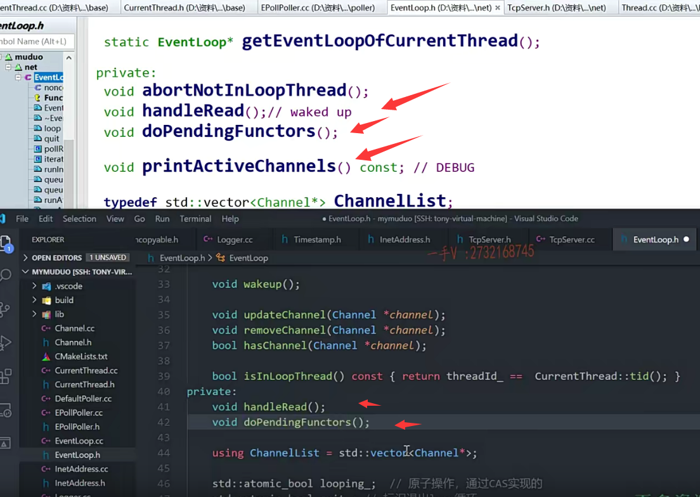

在这我们补一下这个什么吧。

补一下注释吧啊。

这个loop是干什么的？开启事件循环啊。

然后这个是退出事件循环的。

然后这个是在当前loop中执行。

这个是放入。执行谁呢？执行就是参数的这个回调嘛？执行cb啊。

把cb放入队列中。啊，放队列中这个。

到loop。然后是唤醒loop所在的线程。执行cb。

okay吧，

那么wake up。是用来唤醒谁的唤醒loop所在的线程的。

这个是呢。event loop的方法调用的就是谁的方法啊？poller的这个方法就这几个

好吧啊。

这个是判断event loop对象是否在自己的线程里面。

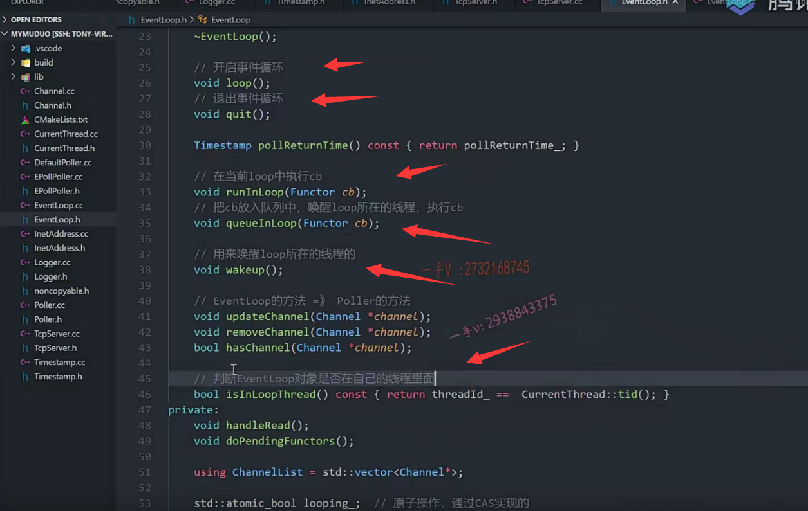

好的吧啊。

OK，这个呢是主要是处理wake up的唤醒相关的逻辑，

这个是执行回调。

回调都在这个vector容器里边放着呢是吧啊？

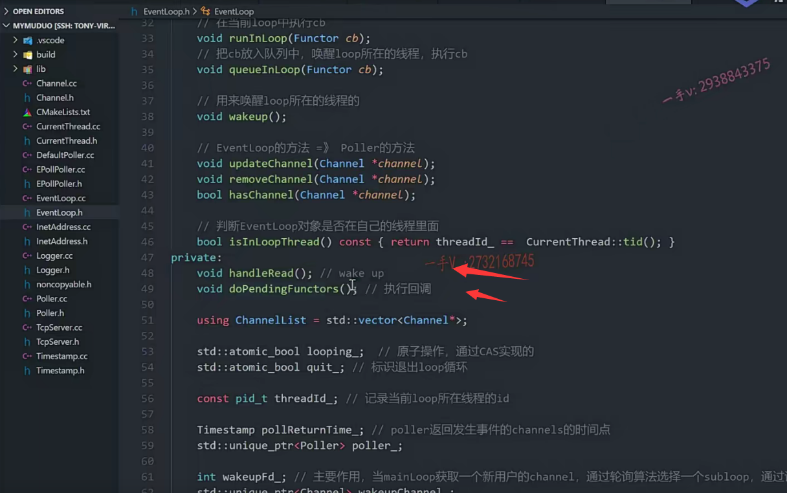

很明显event loop的这个逻辑呢，稍微有一点多，

因为它掌控了poller啊，掌控了channel，

我们之前写的时候所有的是不是这个组件啊啊？

好，那这节课我们的这个任务呢？就到这里，

我们主要是给大家呢，把event loop的一个必须写的核心的成员呢，

给大家梳理了一下。大家呢？

也可以呢，先把这个eventloop的成员，

重点的成员梳理一下啊，

这里边我是借着呢，它的这个命名来分析，

先给大家列了一下这些成员的这个意义啊，完成的相关的这个操作。

还有一些肯定不明白，那我们讲它的这个具体实现的时候再给大家一一道来。

这节课的内容就先给大家讲解到这里。