这节课呢，我们来继续看event loop点CC

就是event loop里边儿的这个成员，他的一个具体的实现啊。


### t_loopInThisThread一个线程创建多个event loop

好，我们到这个event loop点CC里边。

首先呢，大家一上来就看到了这个东西。

thread event loop*啊t_loop in this thread=1个空。

这东西是干什么用的呢？

这东西它的主要作用啊，各位就是防止呢一个线程创建多个event loop。

相当于呢，它现在在这里边是一个全局的一个event loop类型的一个指针变量嘛，

对吧，当这个一个event loop对象创建起来的时候呢，

它就指向那个对象。

那么，在一个线程里边儿，再去创建event loop对象的时候呢？

==由于这个指针不为空，所以它就不会再创建了。==

好吧啊，它主要起这么一个作用。okay吧。

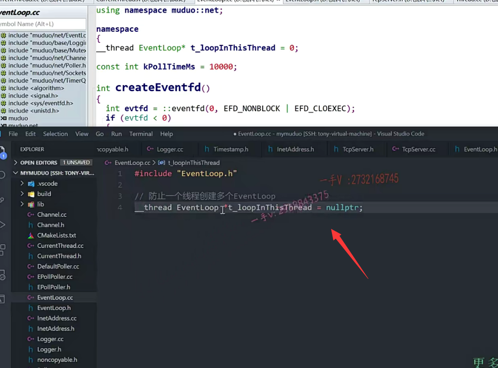


### __thread修饰的作用

那在这里边为什么加这个__thread呢？

加这个__thread我给大家说过了，这东西就是一个thread local的这么一个机制。

啊，这不加这个的话，这是一个全局的变量，所有线程是不是所共享呢？

我们说一个线程里边儿就有一个event loop嘛。对不对？

所以呢，这将成为每一个线程访问它的时候，在每个线程里边都有它的一个副本啊，

都有它的一个副本。

那么也就是说呢，在每一个线程里边儿只有一个event loop，

==不能有多个event loop就是通过这个全局变量指针来控制的啊。==

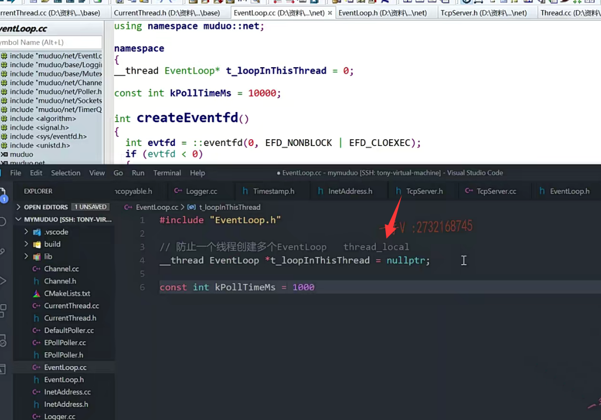


然后呢，他定了一个全局的这个MS.

像现在猜都能猜出来，这是干什么用的？

这就默认定了一个poller的，是不是超时时间啊？

定义默认的。poller这个IO复用接口的超时时间。

相当于就是十秒钟对吧啊，十秒钟。

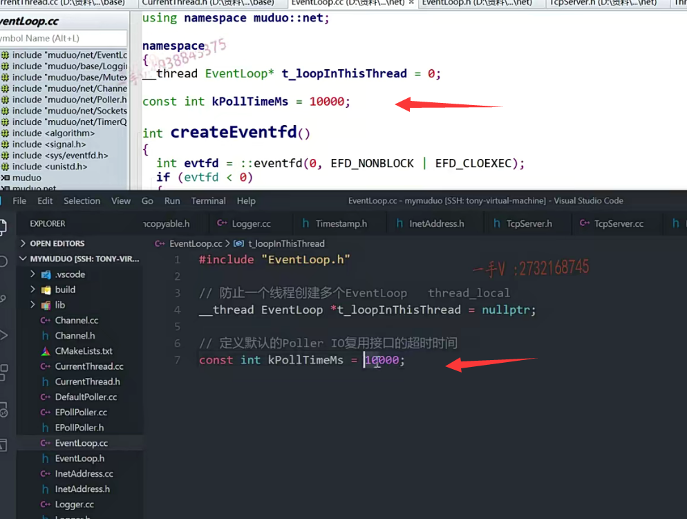


好，再往下来看，

这是一全局函数，我说什么来着？

你还有印象没？create event fd这些函数呢，就是调用了系统的这个接口啊 event的fd我们来看看这个函数是在这个头文件当中啊，各位。

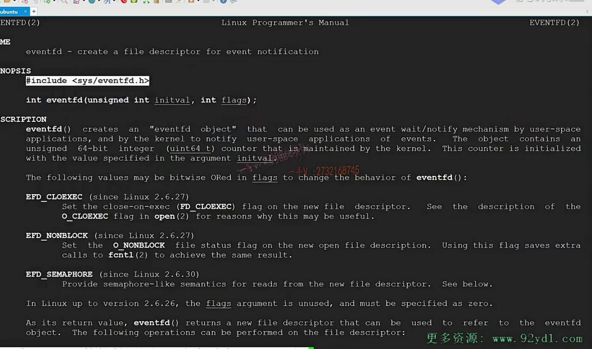


### wakefd    eventfd

好吧啊，在这个头文件当中。

然后呢？我们把这个头文件都包含上吧。

在这个文件里边应该都会使用的到。

==这就是创建了一个wake up fd啊。==

用来干什么？主要作用来干什么？

用来通知睡觉的这个eventloop起来。

有一个新的这个连接的用户的channel是不是要扔给你来处理呀？

要不然呢？这些sub reactor都在睡觉啊，没有办法唤起来做事情。

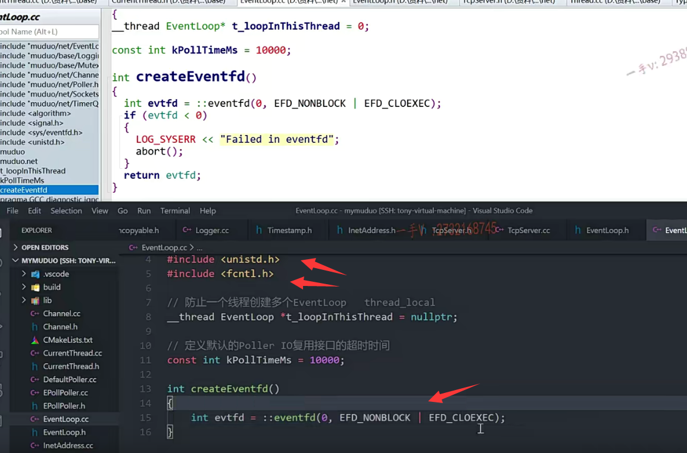


### fatal错误，如果eventfd返回小于0

那么，如果说eventfd，如果小于零的话，

那这个相当于就出错了，出错的话没有又没有办法向下继续执行了，

因为通知都没法通知了，

那就是接到新的是不是channel也有没有办法去处理事情了，所以。

这是一个error所不能容忍的

必须得是什么呀？必须得是fatal啊，所以我们包含了。这个我们的日志头文件，

这里边应该是一个log fatal。这叫做event fd errno

错误的这个原因是什么？那百分之d啊。包含一下这个头文件啊。

这里边呢，自带了exit对吧？event fd.

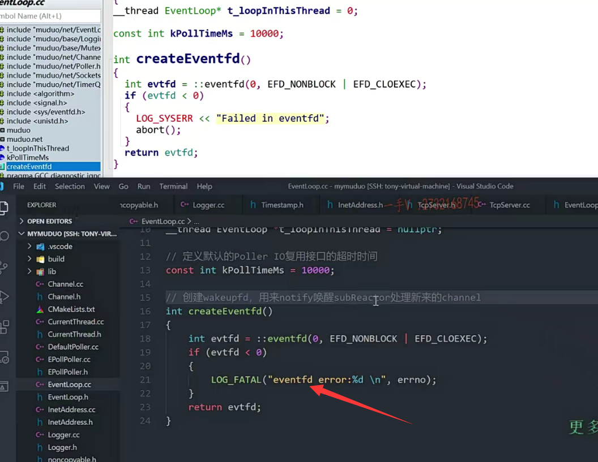


好了，这是创建wake up fd.

用来通知sub rector.

通知也就是说，用来唤醒对吧啊？

==用来notify 唤醒 sub rector.处理新来的channel，==

==Main reactor是通过轮巡的方式来唤醒的啊，==

这个我们都可以在代码上看到。


## 构造函数实现

继续往下，这就是event loop的什么了？构造函数了啊，

构造函数构造跟析构函数，我们先贴过来实现一下。

那么大家来想一想，它的这个构造跟析构都要去做哪些事情？

对成员变量一一进行一个初始化操作，对吧？

我们来看，首先是looping啊。looping一上来呢，就是FALSE，

刚开始还没有开始开启循环啊。


quit刚开始呢，也是一个FALSE啊。

然后呢？event handling我们没有用到啊，


然后就是这个calling.functions.

刚开始没有需要处理的回调，也是FALSE。


然后这个thread ID。这就是在创建这个event loop嘛，

调用event loop的这个构造函数的嘛，是不是？

所以呢，怎么去获取event loop对象所在的线程呢？

啊，就在这里边直接通过current current thread。tid就可以了。啊，


然后呢？就是poller啊poller。

那这个我们得包含poller的头文件了。

好poller。poller new default.这是获取默认的，是不是poller啊？

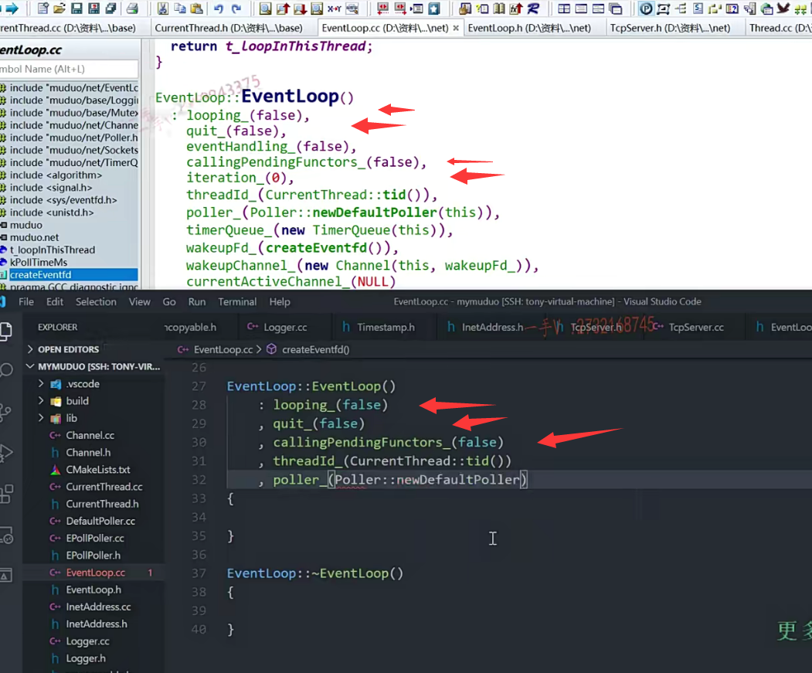


### 实现一下之前没有实现的Poller::newDefaultPoller

那我们用的就是什么epoll啊？

那在这里边，我们得把这个什么来实现一下啊。

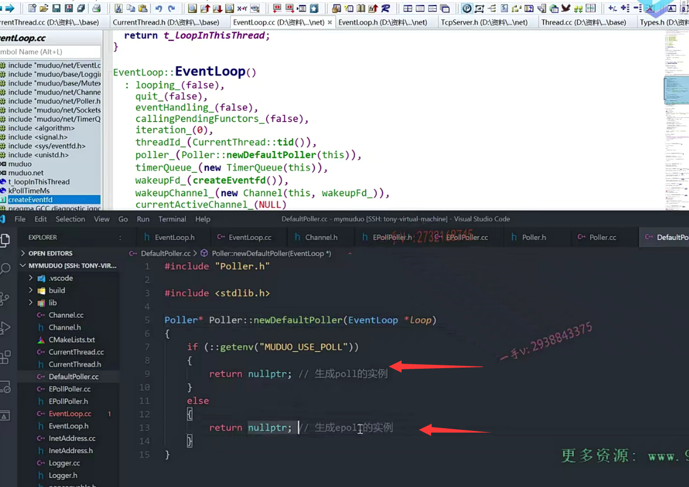


填上include epollpoller。

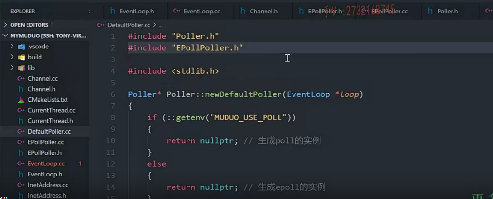

那么，在这里边获取的是。

new了一个什么啊？e polle poller.好吧啊，就是这个loop。

好了，我们这个底层的这个epollpoller的这个对象实例呢？也给它new出来返回回来了。

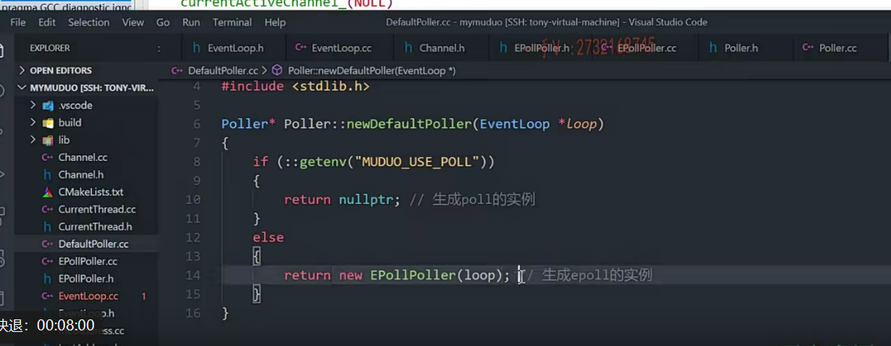


### 包含this

好，继续。这里边需要this。因为参数需要个loop，

对吧啊？

因为poller跟channel一样，都是要需要记录呢，它们在哪个loop里边儿？

当前对象本身就是loop，所以直接传this进去就可以了。

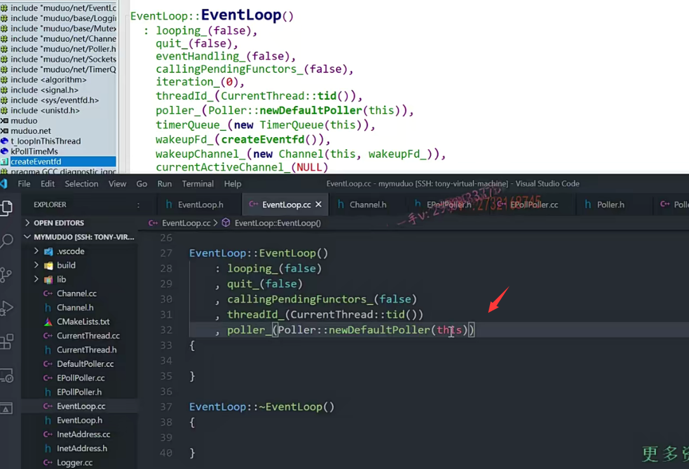


然后接下来是timerQueue，我们不需要啊


wake up fd轮到wake up了。

这个就是我们刚才上边用这个函数创建的一个wake up fd.


okay吧，然后wake up channel呢。

诶，这里边就是new一个，那我们得先包含channel的头文件。

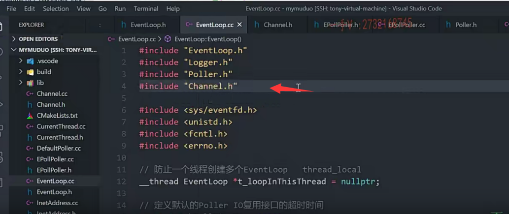


那么，在这里边new channel this 

channel需要知道它所在的这个loop(this)对吧？

另外一个channel是打包fd的。

啊，把这个wake up fd给到，

所以你看我刚给大家说了wake up channel啊，

包含的是不是就是这个wake up fd啊？

相当于是什么呢？相当于就是每一个sub reactor上啊，都监听了什么呀？

都监听了这个wake up channel嘛。

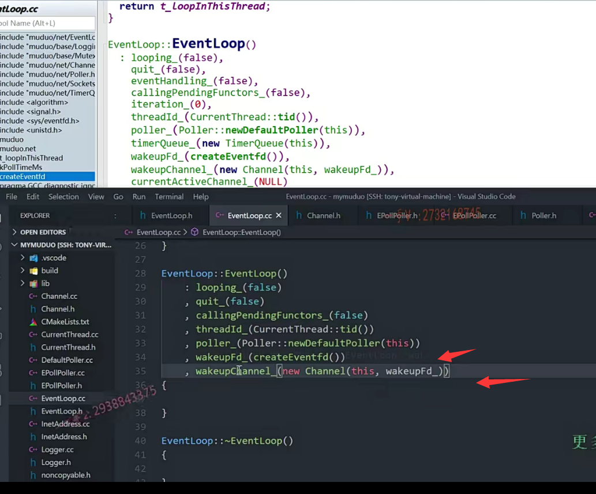


这一个reactor就是一个event loop嘛，

每一个event loop是不是都有一个wake up channel？

他去监听着呢。

啊，所以当这个Main reactor呢去notify啊，

去notify这个 wake up fd的时候啊。

相应的，这个sub reactor就是event loop呢，就被唤醒了啊，就这意思。

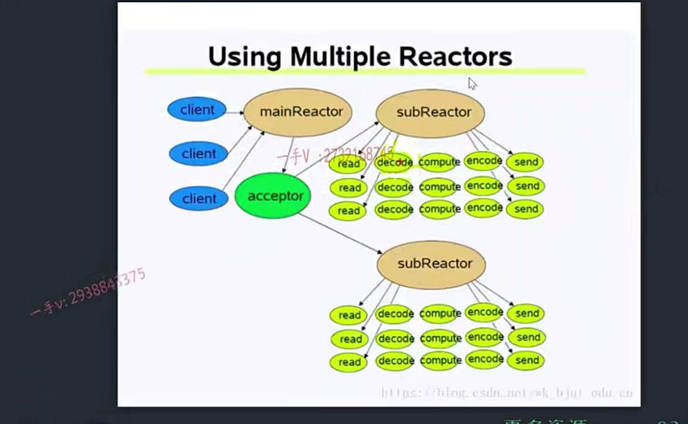


然后给这个current active channel。先填个这个空。

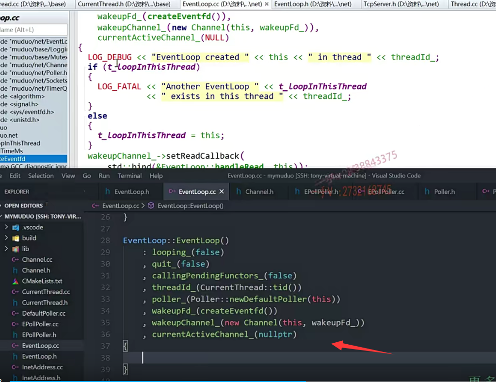


okay了，那么这里边呢？

它是用了一个log什么啊？log debug对吧？

那我们也用一个log debug吧。

==logdebug默认是不显示的啊，加启动的时候加上相应的宏才会显示。==

event,loop.created.这应该是个百分之p  this它打印了对象的是不是地址啊？

in thread百分之d。一个是this，一个是thread ID。

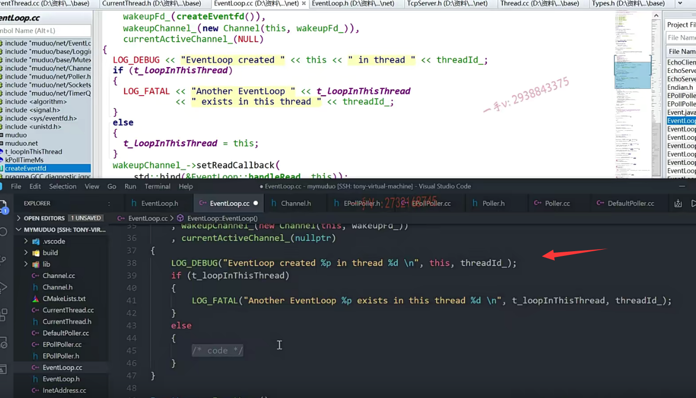

打印好了，以后呢？

你看啊，如果这个t_loop in thread这个不为空，

那就说明啊。这个线程已经有一个，是不是loop了？

那不创建了啊？嗯log怎么样fatal？它直接就给exit掉了啊，

an oth一样another event。event loop.百分之p啊EX n sexists。in this.thread百分之d。t_。loop in this thread以及这个thread ID啊。

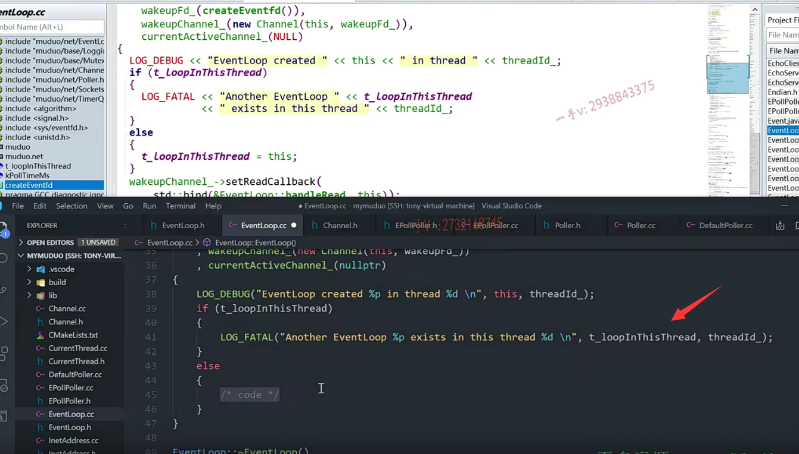


好,else为空，为空的话，

也就是说当前这个线程第一次创建了一个event loop对象，对吧？

那就给这个全局变量，这个指针赋一下值。

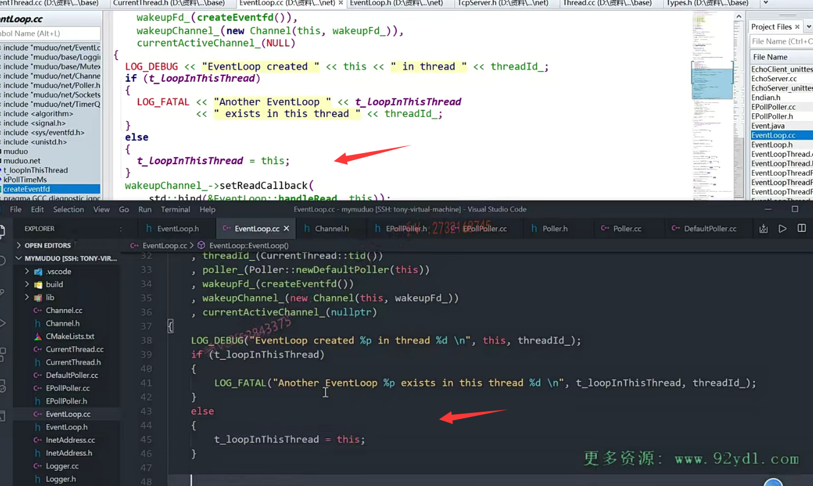


好的吧啊，大家来看一看。

那么在这里边。大家注意一下。你现在呢？

## wakeupchannel只是注册，缺少事件

wake up channel在这里边，只是注册了一个wake fd。

==你还没有给它设置呢，它所感兴趣的事件嘛，对不对？==

那到时候这个channel往poller上放也没法放啊。

==或者也不知道你要让他监听这个fd相关的是不是什么事件啊？对不对啊？==

==那在这里边接下来你看两个操作就是设置wake up 这个fd的事件类型以及发生事件回调操作好吧啊，==

发生事件后的回调操作。


实际上呢，这个wake up fd这个回调操作也不需要做什么，

最主要的wake up fd在这里边儿就是唤醒谁呀。

就是唤醒这个sub reactor啊，就是唤醒这个sub reactor，

就是唤醒event loop，


你看这不就是event loop的loop了吗？

它们阻塞在这个地方吗？对不对啊？

那么我主loop就可以通过呢？这个wake up fd来唤醒你的子loop。

那你从这就返回了，就可以接着去处理下边的是不是事情了，

你就可以把新给你的这个channel啊。

*对吧啊，就可以处理给处理*给你新扔给你的这个channel了。

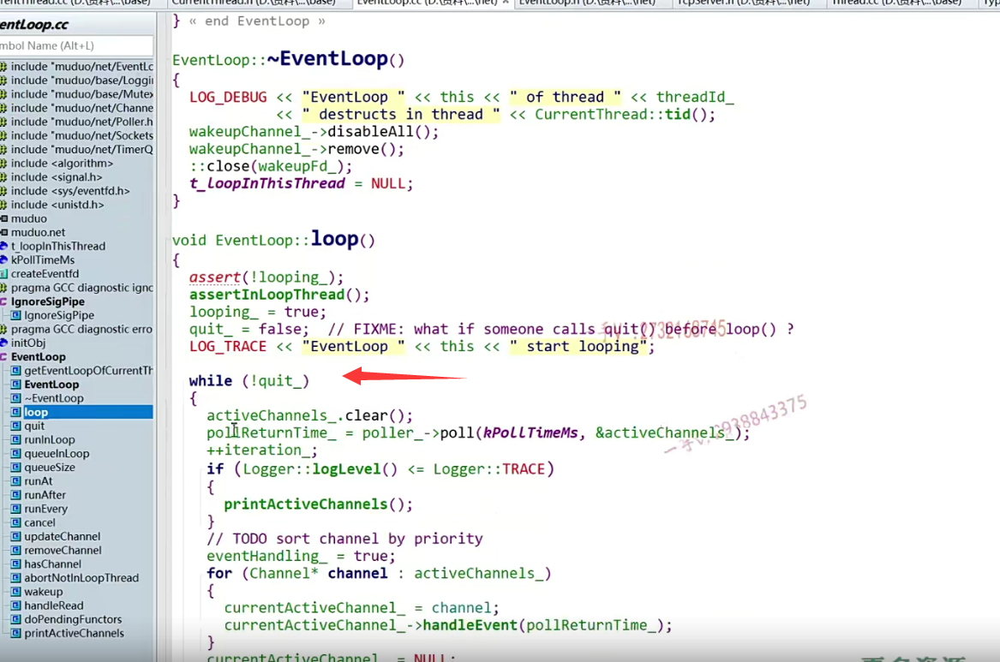


好吧啊，在这里边主要是这两件事情，

大家来看wake up channel调用的方法set read call back。

那刚开始是enable reading嘛？

就是添加了这个channel所监听的这个socket fd的，是不是read事件啊？

当然是读事件了。对吧，读事件发生以后呢，在这里边所做的事情呢。

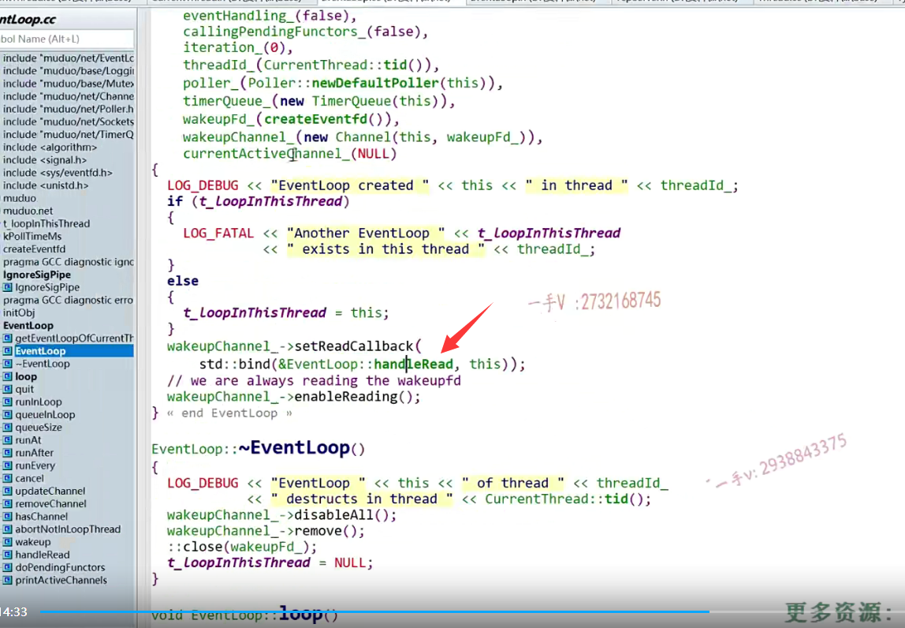


你看啊。这个handle read它其实也没做什么，

它就是呢，把fd wake up fd上的这个消息呢读取出来。

这个其实是不影响的，

最重要的呢，就是唤醒相应的这个loop。

好吧啊，唤醒相应的这个loop。

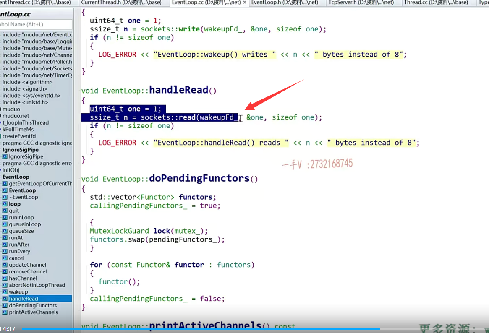


## 实现handleread

在这里边呢，我们先把这个handle read在这里边给实现了吧啊。

在这儿呢，我们也不用调用sockets里边read的，

它相当于只是把我们的这个read封装了一下啊，

所以在这里边儿呢。

我们不要这个了。

我们就直接是read的，第一个就是fd ，就是wake up的fd。

第二个参数是个什么？是个buf是吧？是个buf，

那就是第三个参数就是长度okay。

==这个n如果不等于这个，那么在这里边相当于只是一个error。==

==这只是个读出现错误了，不影响这个是我们程序运行可以接受的啊，不会直接去fatal。==

reads 百分之d。嗯嗯嗯。我们给它写一个n。

好了，==这相当于就是这个函数，具体读了几个字节，应该是读八个字节，==

==因为它发的时候发了八个字节。==

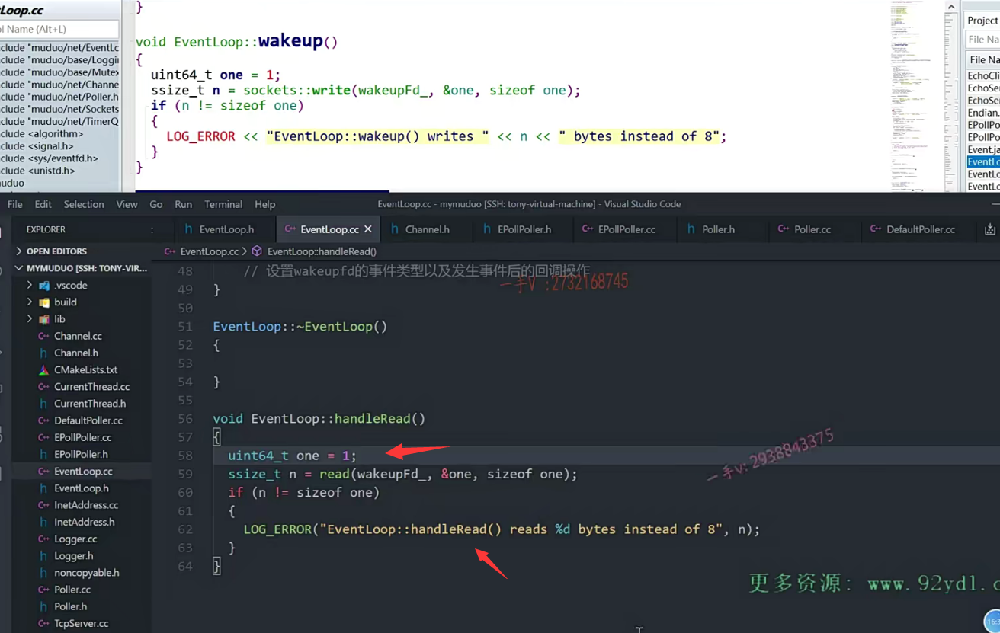

一个常整数对吧啊，我们说发啥不重要，

### 最重要的是

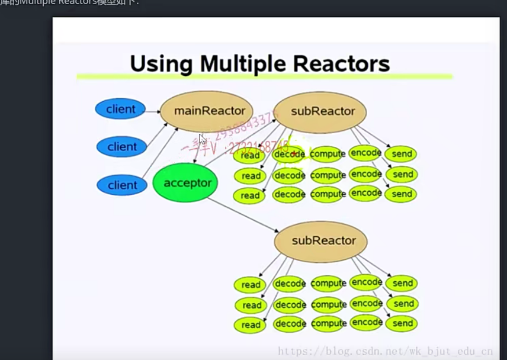

最重要的是你的这个每一个sub reactor监听了一个wake up channel，

我的Main reactor就可以通过给你的wake up channel 发送就是write一个消息，

你是不是就能感知到了哎，能感知到这个wake up fd上有read事件发生了，

你就返回了，你就起来了，你就去做事情了。

==你做事情就可以拿到我扔给你的新用户连接的，是不是channel啦？==

==就可以把新用户连接的channel加到某一个子反应堆上了啊，也就是子loop上了。==


### 继续完成构造函数

好，那在这我们把这个构造函数呢去实现完

wake up channel.这是sest read call back是不是啊？

这里边用到了这个绑定器啊，用到了绑定器。

绑定一个event loop的这个handler的函数啊。this就okay啦。

绑定器跟这个函数对象在C++高级课程里边。

也已经给大家讲过了啊，已经讲过了，绑定器跟函数对象是在C++里边做事件通知，

几乎都要用到了，这个你不能不熟悉啊。

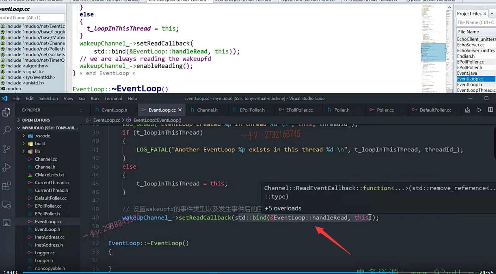


好，然后呢？

就是再给这个wake up channel？

enable它的什么事件啊？reading事件。

==这样一来呢，就是每一个event loop都将监听wake up channel.的epollIN 读事件了。==

==相当于呢main loop  Main reactor就可以通过给wakeupfd写东西来通知sub rector是不是起来了？==

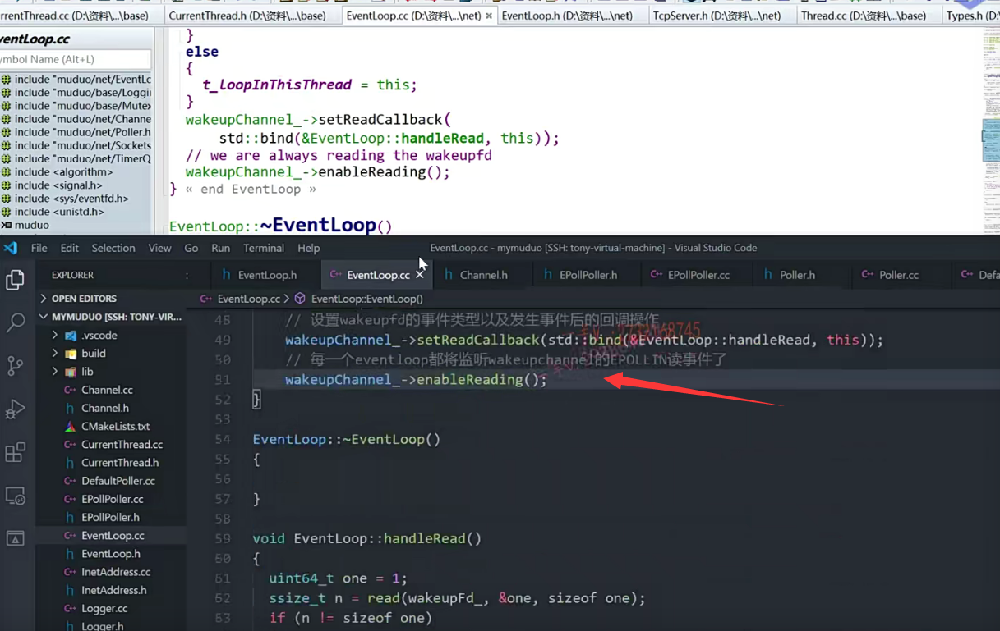


okay，这就是event loop的构造函数做的事情，大家来看看。

## 析构函数实现

### close之前做的事情

析购呢，析购就是对于资源进行一个回收嘛啊。

啊，这里边主要做的就是呢wake up channel.disable.

==disableall呢？==是什么意思呢？还记着没有？

==它相当于把所有的事件制成这个non event了，==

==也就是说对所有的事件都不感兴趣了。==

对吧啊，然后呢wake up channel再写一个remove，

==那就是把channel本身呢？从哪啊？从poller中啊移除了是不是啊？==

从poller中删掉了。


然后最后再==close。这个wake up fd。==

最后给这个t_loop in this thread，再给它置个空。

这就是干什么了？这就是把资源呢给回收了。

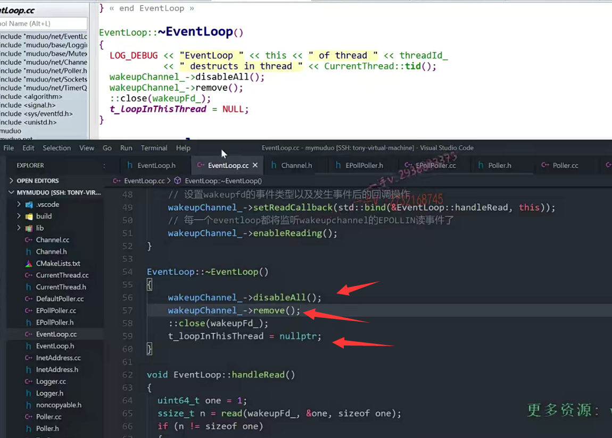


啊，把相应的资源给回收了，我们看一下它的这个成员变量。

这些呢，都不用去进行特殊的回收，包括这个智能指针呀，

会自动调用poller的这个析构的。

对吧啊，因为你获取的时候是一个new 的一个epollpoller。

所以到时候人家会执行这个delete，这是智能指针的主要作用之一嘛啊，


包括这个channel，你是不是也是new出来的？没关系嘛，智能指针。析构会new这个呃，会delete这个资源的。

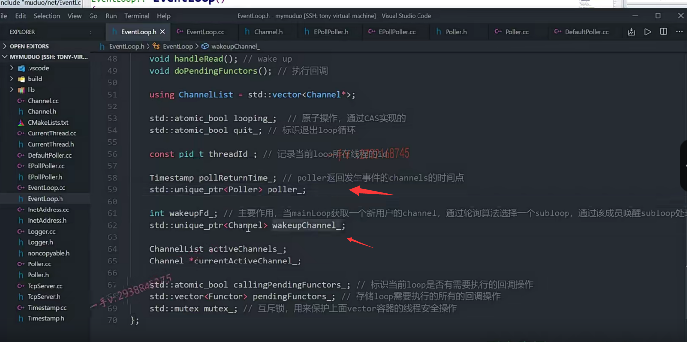


好吧，唯一你需要做的就是把这个wake up fd创建的这个文件描述符啊。

你要手动的去close。

然后在close之前呢，需要禁止。

disable它所有的事件，并把这个channel删除掉啊。

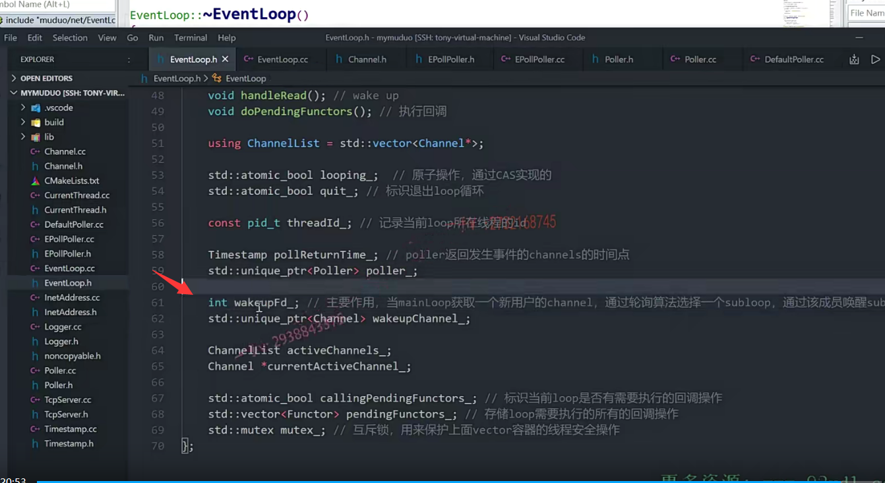

## 总结

好，那这节课我们主要的作用呢，

就是围绕着这个event loop的构造函数跟析构函数。

把它的这个成员的这个初始化以及wake up channel。

啊，以及这个全局变量，这个指针。

资源的释放给大家说了一下。


希望大家呢，多花点儿时间去思考一下

eventloop作为反应堆reactor的核心，

其要完成的功能相对来说还是比较多的。

啊，那么把这些成员呢？多理解理解，

有助于我们在写他的其他的这个成员的业务逻辑方法的时候呢？

你应该理解的就更快速更准确了啊。

好，那我们这节课的内容就先给大家说到


# 补充：

## 绑定器

在C++中，绑定器（Binder）是指一种技术或模式，用于在函数调用时将参数绑定到特定的值或对象上。绑定器使得在调用函数时可以预先设置一些参数，从而在稍后执行函数时不需要再提供这些参数，而是直接使用绑定器中的值。

C++中有几种实现绑定器的方式，其中最常用的包括：

1.  **std::bind**：这是C++标准库中提供的函数，可以用于创建函数对象，将参数绑定到函数调用上。std::bind允许我们指定要调用的函数，以及在调用时要使用的参数，可以绑定部分参数或全部参数。
    
    ```C++
    #include <iostream>
    #include <functional>
    
    int add(int a, int b) {
        return a + b;
    }
    
    int main() {
        auto addFive = std::bind(add, std::placeholders::_1, 5);
        std::cout << addFive(10) << std::endl; // Output: 15 (10 + 5)
        return 0;
    }
    
    ```
    
2.  **Lambda 表达式**：Lambda 表达式也可以被看作是一种绑定器，因为它可以捕获外部变量，并在稍后的函数调用中使用这些变量。
    
    ```C++
    #include <iostream>
    #include <functional>
    
    int main() {
        int factor = 5;
        auto multiply = [factor](int x) { return x * factor; };
        std::cout << multiply(10) << std::endl; // Output: 50 (10 * 5)
        return 0;
    }
    
    ```
    

绑定器的作用在于：

1.  **部分参数绑定**：当我们希望在调用函数时只传递一部分参数，而另一部分参数已经预先确定时，绑定器可以非常有用。这样可以简化代码，减少冗余的代码书写。
    
2.  **延迟调用**：绑定器可以将函数调用延迟到稍后的时间点，这在某些情况下是非常有用的。例如，可以在事件处理中绑定特定的处理函数，等事件触发时再执行。
    
3.  **适配器模式**：绑定器可以帮助我们将一个接受多个参数的函数转换成一个接受较少参数的函数，从而使其能够适应不同的接口或回调函数。
    

绑定器是C++中强大且灵活的特性，可以提高代码的可读性和灵活性。然而，在使用绑定器时，要注意绑定的参数和函数的匹配性，确保参数类型和数量的匹配，避免潜在的错误。