好，我们这节课呢，继续把event loop剩下的这个接口，我们给它实现完了啊。

然后接着呢就是。

它的这个run in loop。还有queueinloop。

那各位往这看一下。从名字都能看出来，

runinloop就是直接在我当前的loop中执行这个call back。

而queueinloop就是说呢。要把这个缓存到队列里边缓存起来，而不在当前的loop执行，不在当前的loop执行，

肯定这cb呀相关联的这个channel也并不在你这个loop当中嘛，是不是

## runinloop()

看一下啊？runin loop

if is in loop thread，这是什么意思呀？就是loop。应该是在当前的loopthread中。执行是不是call back呀？

哎。那么，在这里边就直直接执行它就行了。好吧

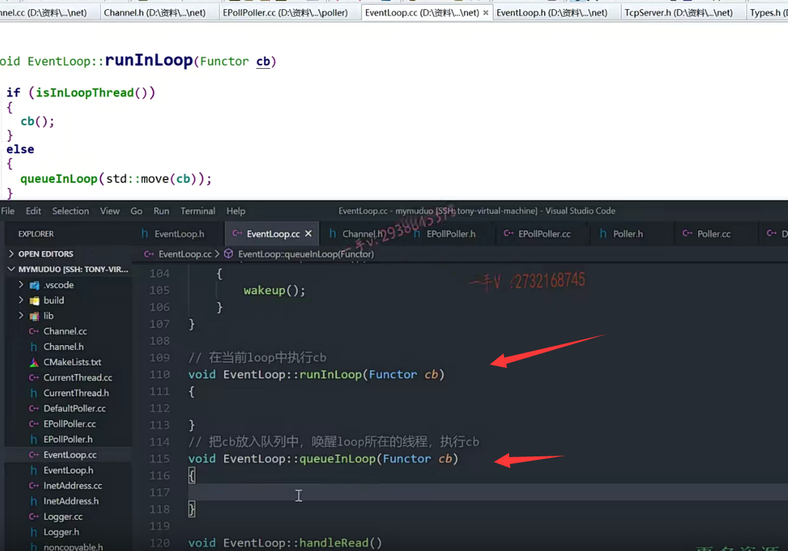

### 在非当前loop线程中，那就去唤醒那个loop 线程的cb

else是什么意思呀？在非当前loop线程中，执行Cb。

就是我们之前说的，你有可能在sub loop 2里边。去执行了subl up 3，去调用sub loop3的一个run in loop().对不对？

因为你访问的是subloop三。你subloop三这个对象又跟这个sub loop 2所在的线程又不是一一对应的，对不对？

==因为一个loop有自己的运行，在自己的线程里边了嘛？==啊，

所以在这里边，就是我们说了，在非当前loop线程中执行cb，那怎么办啊？

==那这个就需要唤醒谁啊？唤醒loop所在thread执行cb。==

==这里边的cb实际上都是跟channel相关的，==

==每一个loop里边呢，都是管理了很多的这个channel。对不对。==

==你loop管理的channel上边儿所需要做的这个回调操作啊？==

==你当然是需要在你这个loop所在的thread中去执行了。==

所以这里边儿呢，就直接调用了一下下边儿的那个函数叫queen in loup。OK吧，

 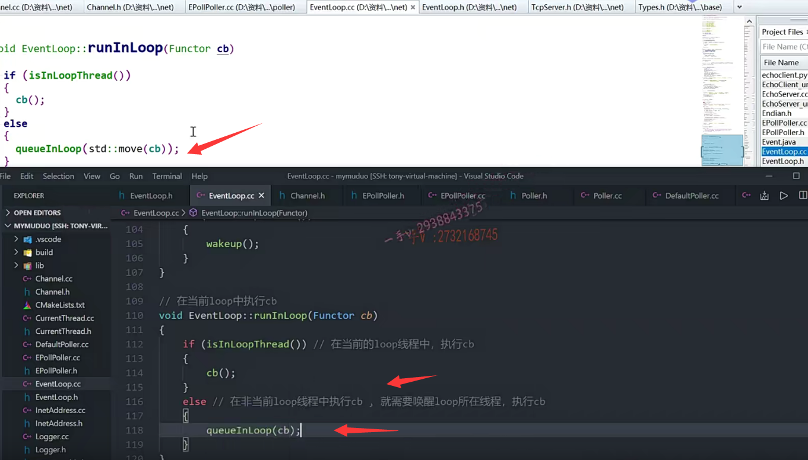

## queueInLoop()

那再接着queuein loop里边来看，一定是不是有一个wakeup唤醒？哎，

我们看到了一个wake up。好吧啊，

那这个cb先怎么缓存起来呀？先放到这个vector里边，你看这个ping factors。就是个vector。

因为呢，要执行的cb可能不止一个，可能有好多呢，对吧啊？

## 有并发访问 需要锁

因为呢，在多个loop里边都有可能啊，同时呢，是不是调用另外一个loop的相应的一个这个runinloop让他去执行回调啊，

所以呢vector这里边呢，涉及并发的访问需要通过这个锁的这个控制啊。

==我们包含memory这个头文件。==

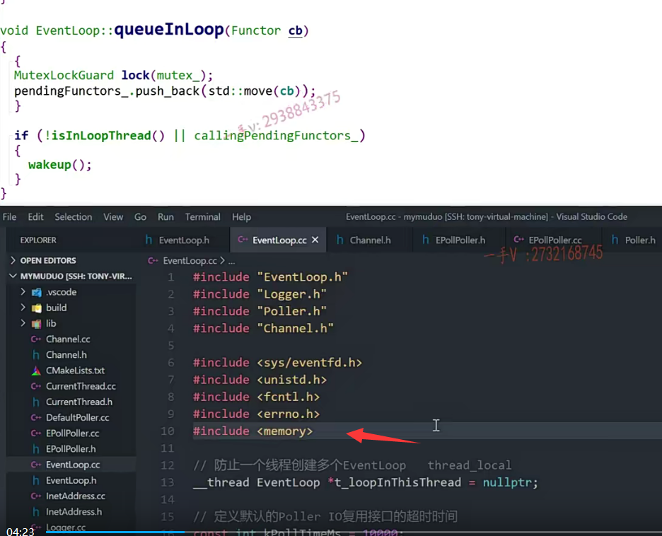

### 使用智能锁  使用emplace_back

嗯，大家来看看。那这里边用到锁，用到锁，

那我们就用到智能锁是吧？unique lock啊。STD.mutex.

这里边lock谁呢？mutex.

pending factors点push back。实际上，推荐大家用emplace back 

这直接cb就行了。

就直接在相应的这个底层的这个vector的这个内存上去构造一个cb。好吧，跟push back, 

push back是拷贝构造啊， emplace back是直接构造，这是C++11里边新增加了这些容器里边儿新增加的这一些方法啊。

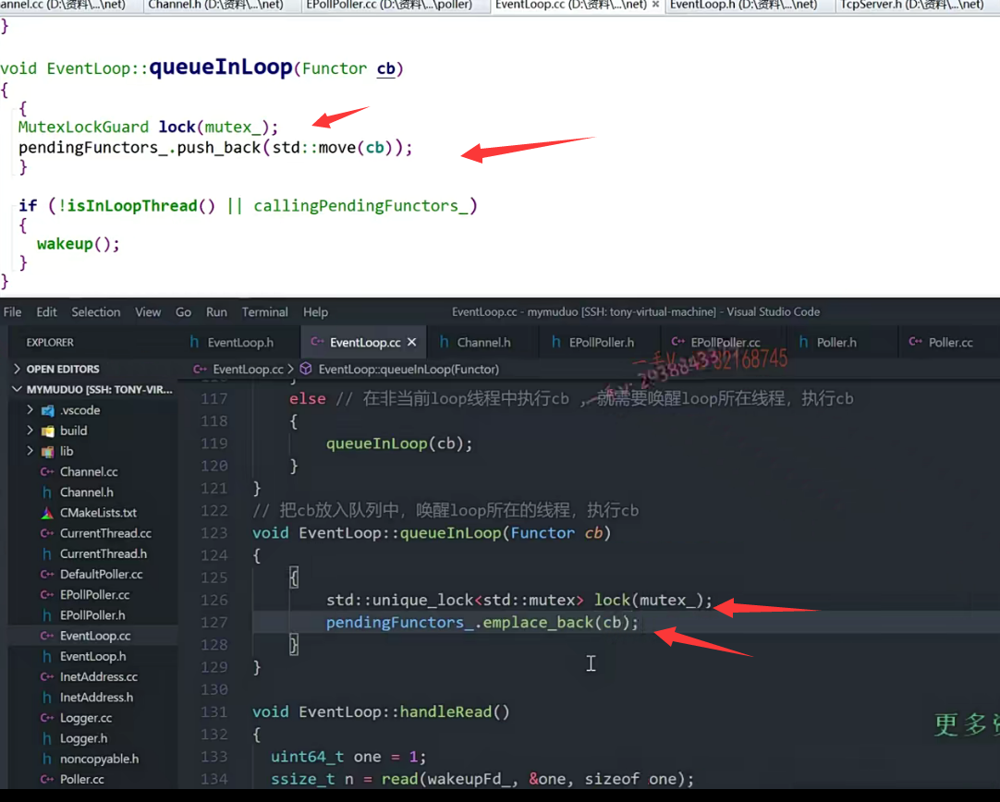

好，那在这里边儿注意一下，

接下来是不是该唤醒相应的需要执行上面回调操作的loop的线程了。

是不是需要唤醒了？

if第一个是is in loop thread。

那这必须嘛，刚才就是因为这个条件不满足，是不是才queueinloop的？

那就是说当前的线程啊，跟我就是跟我当前调用的这个loop呢，它不是一一对应的，

就是loop不是这个线程的。是不是啊？

需要把这个loop相应的线程给它唤醒起来。对着没哎，

那我就wake up这个。这就是唤醒loop所在thread。

能够明白吧啊，唤醒这个loop所在thread。

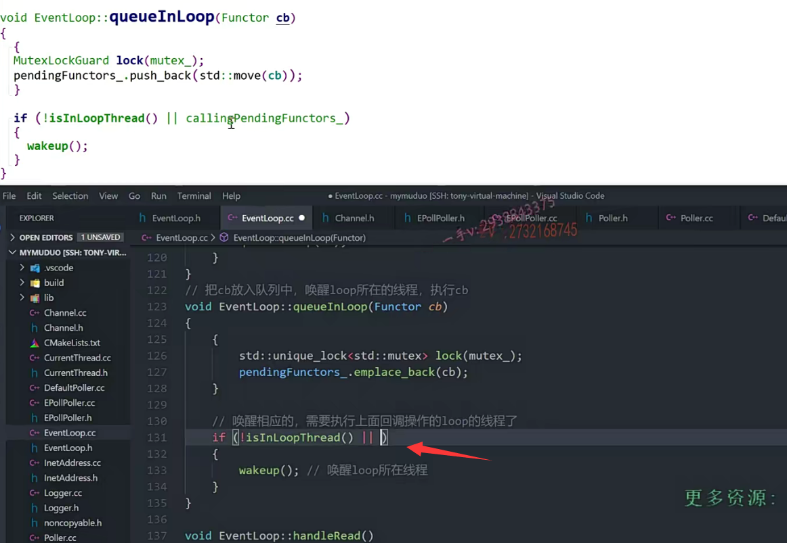

### callingPendingFunctors_

大家看这里边还有一个什么呀，还有一个calling。painting factors，

这个是在哪里呢？大家来看看啊，这个呢是？

在这里边，这个是在这里边啊，

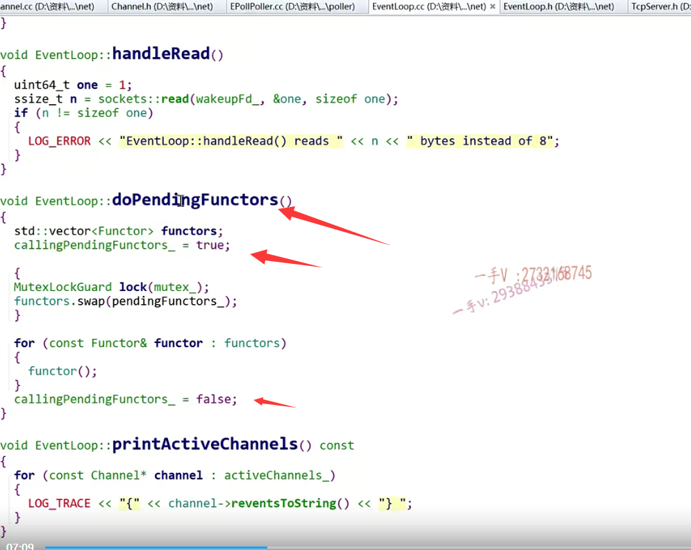

这个接口我们还没写呢，这个是刚才具体的去调用这个，去执行回调的时候啊，

那么这个我就先给大家。这个逻辑呢，我们就先不解释吧。

先给大家放到这里边。

它有一个或这个为true的时候是吧啊？

这里的。calling pending factors逻辑待解释。

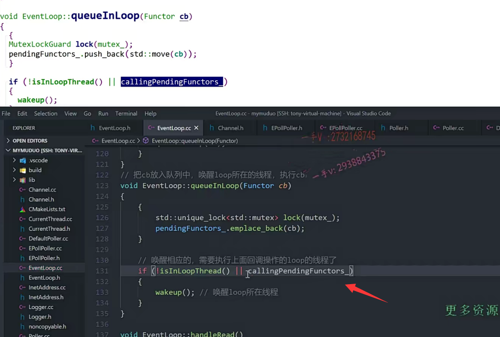

那么，同学们能不能自己先想一想呢？

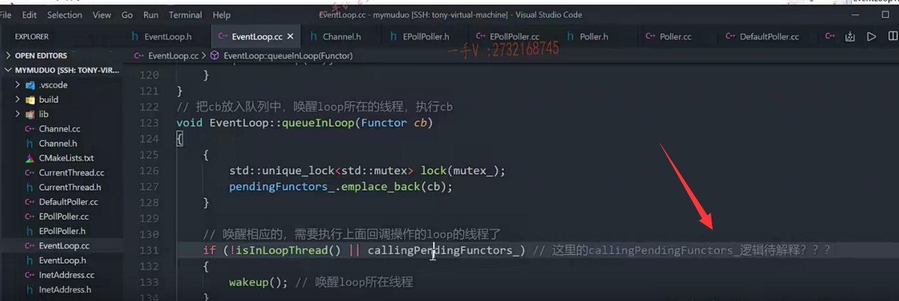

啊好，在这里边呢，queueinloop啊，这底下我们都不需要了。

还有这几个啊？包括我们底下这还有一个就是执行回调操作的方法。

我们这节课争取把这几个接口呢，都给它处理完。

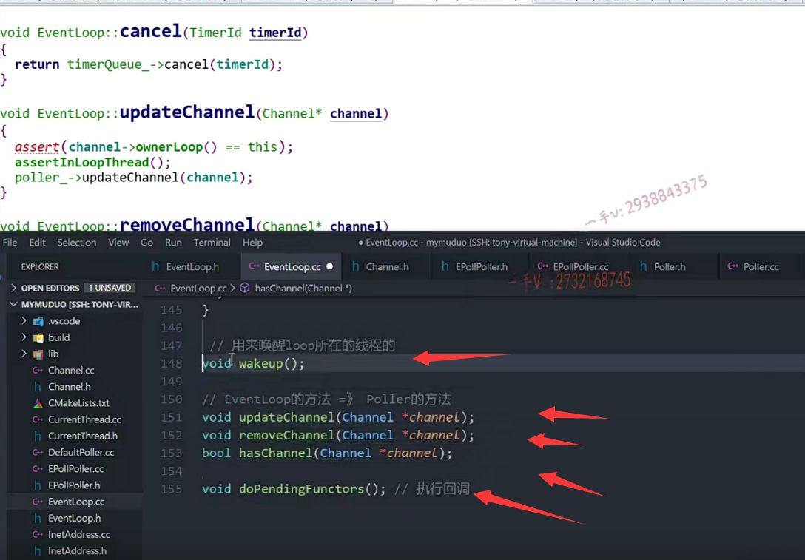

调用event loop。想想啊，想一想这些接口。我们都实现哪些东西？

这个update channel跟remove channel，这个应该是非常好处理的吧？

对不对？这个呢，就是我们channel本身在更改自己的事件的时候呢，

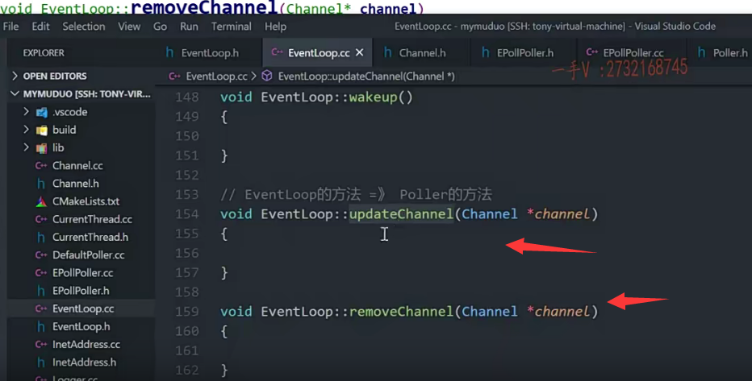

调用了是不是这个？当时在这还注释着呢，调用了loop的update channel跟loop的是不是remove channel啊？

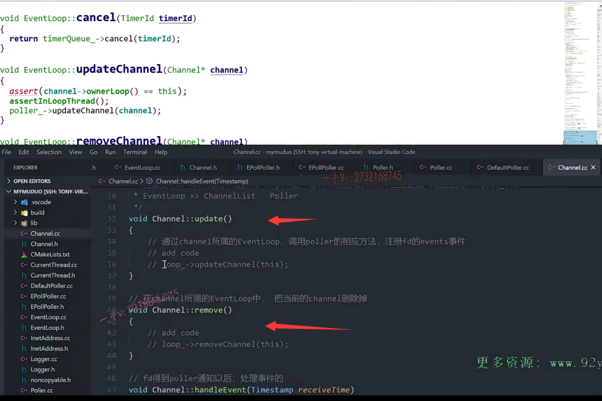

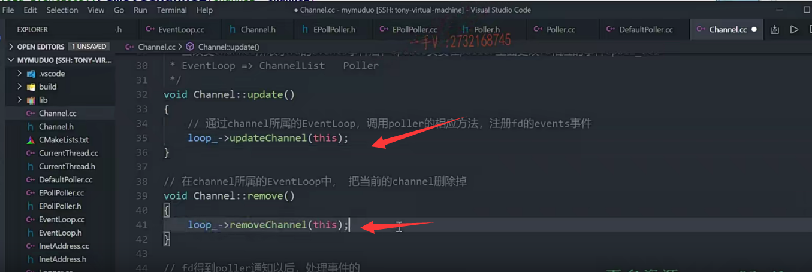

在这里边相当于就是channel要改变它。在poller上这个状态啊，要添加到poller上，

要更改在poller上的这个事件，或者说是从他注册的poller上把它给删除掉。

它无法直接访问poller，所以得通过event loop来访问，

==所以所谓的这个event loop的update channel啊，==

==那就是通知底层的这个poller的。update channel把这个channel传进去。对吧？==

remove channel。poller remove channel调用poller的remove channel。

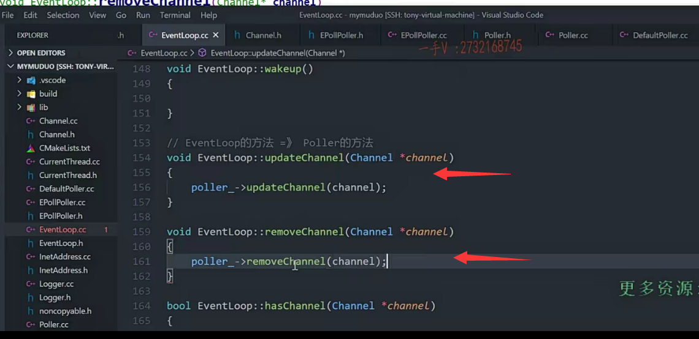

haschannel这个应该标呢，还是谁呀？poller的。OK吧啊，

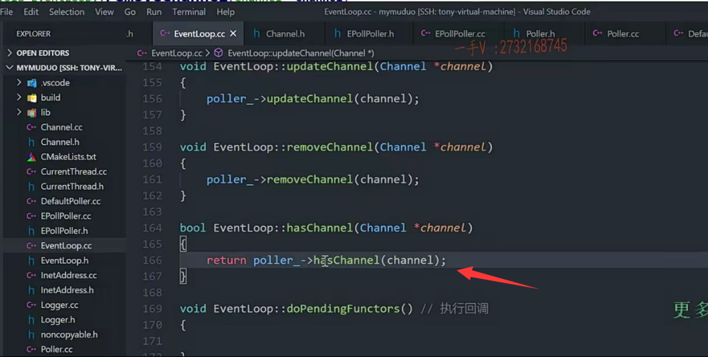

那实际上这些东西呢，都是channel向poller问的，

但是channel跟poller无法直接沟通。

对不对啊？那么channel就是通过eventloop，通过他们的父组件来间接跟poller沟通的。

好，这几个接口应该是很快，我们就完成了啊，

## wakeup()

那么接下来呢？就是这个wake up啊，

wake up非常简单。

这就是向这个wake up fd.写一个数据就行了嘛，写一个数据嘛，

这个wake up channel它就响应了嘛。是不是就有数据可读了？对不对啊？有数据就可读了。

因为我们事先注册了wake up channel的这个读事件enable reading读事件，

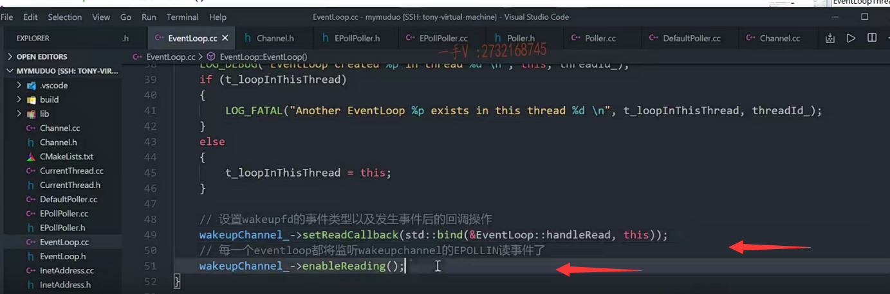

### 唤醒就是给他写一个数据

==我们现在想唤醒某一个loop。==

==向这个loop的这个wake upfd写一个数据，它是不是就被唤醒了？==

它的这个channel上就事件可读了啊？

所以在这里边，你看啊uint 64。万=1个一

你其实写啥都无所谓啊。CS杠tn等于。right第一个就是sock fd，也不是sock fd啊，是wake up。fd，

然后写数据的缓冲区就是这个one。大小呢size of。

OK吧，如果写的这个不等于谁啊？size of one就写的数据啊。

==返回值就是真真正正写的数据，跟我们传入的这个缓冲区的大小如果不相等的话==，就证明这是出错的。

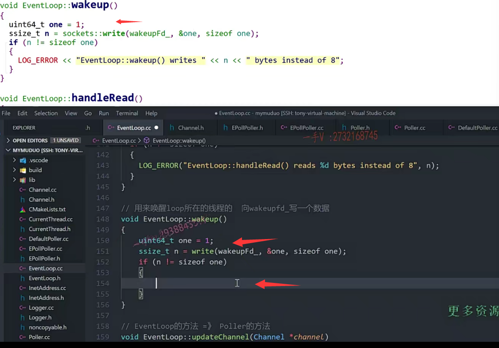

### 判断写入的数据大小与返回的大小是否相等

这应该是个error级别的。对不对啊？一个error级别的。

或者说是你把它级别定高一点，定成fatal级别的。写数据就能写错，

就有可能意味着这个子线程是不是根本就无法被唤醒啊啊？

那muduo库上这里边是一个error级别的，我们写一个error级别的吧。

event loop rights.百分之。这是n是吧n的话，这是一个long size in t。这是一个long size杠t，应该是个。lu.对不对？等于五啊。bats instead.tead instead of eight.

好了，这就是wake up。

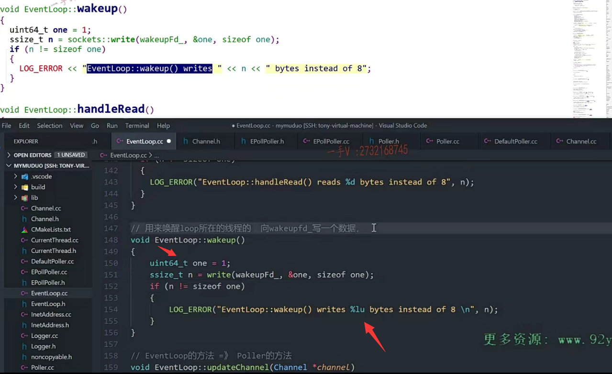

那么wake up.channel就发生读事件。

这个当前loop就会loopthread就会被唤醒。好吧啊，

就会被从这个poller的poll阻塞处，唤醒起来做事情啊，它就是这么做的。

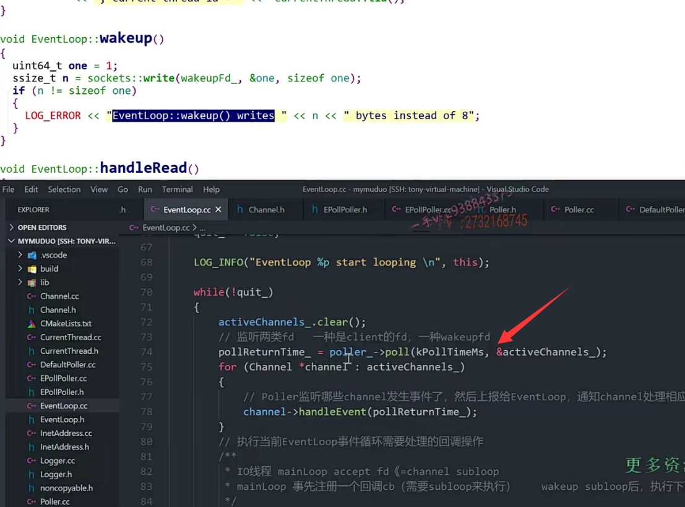

大家好好的去。去理解一下人家的这个代码的调用流程啊，

这个muduo库的这个设计的oop的这个思想呢，还是非常不错的啊。

handle read我们也处理了吧？handle read没做什么，就是读写了个一，看最终读个一。

实际上，写啥读啥无所谓，就是为了唤醒loopthread啊，来唤醒起来了以后呢，

去执行是不是回调啊？执行回调。

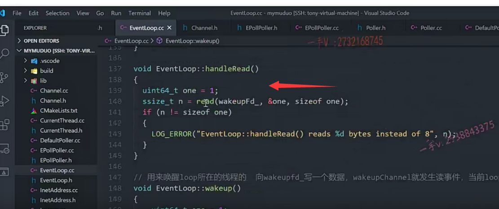

okay，大家来看一下。

在这里边，我们执行回调。

你看在这里边写执行回调的时候，你能你又能学到一招，

## dopendingFunctors()

### swap()的使用

首先它定义了一个局部的一个装回调的这个vector。

然后把这么一个变量置成了一个true。

对吧啊，然后加了一个锁，把pending factors什么意思呢？

就是把刚才你往里边装回调的。

我们来看一下啊。这是不是你跟queueinloop，你往里边儿装回装这个回调操作，这个回调函数cb呀，

然后把这里边儿通过所控制着？

人家在这里边，==现在呢是pending factors跟这个局部的这个funds 1交换(swap)，==

==相当于就是把这个pending factors置空了。==

==然后把所有的在这里边儿（指的是queueinloop中的vector pendingFunctors）放的，需要待执行的回调全部放到这个局部的vector对象里边儿==，

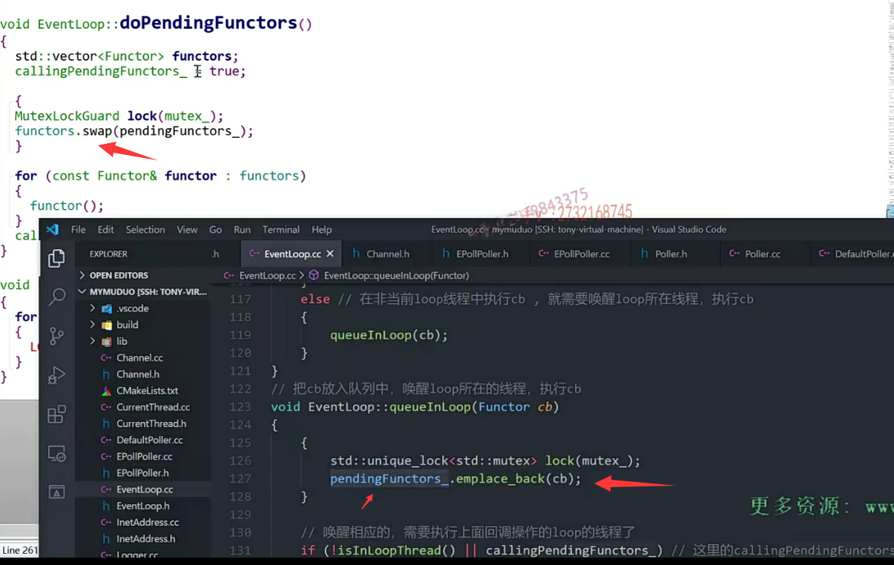

大家想一想为什么要这么做，这样做的好处是什么？

很明显，这里边我在执行回调的时候，

我根本不需要定义这个局部的vector functors，

那么也就是说。这个函数在执行的时候，

因为它不断的需要从vector里边拿一个回调执行，拿一个回调执行。

所以拿一个就是拿出来删掉，拿出来删掉vector。

哎，那你你这个loop在一边执行回调的时候呢，

别的loop就是main loop有可能像你这个子loop里边是不是注册回调啊？

那也就是说你如果这个loop待执行的回调比较多的话，

因为你这里边必须得用锁来控制vector。

 vector没处理完的话，锁是不能释放的，导致没loop无法及时的向你这个sub loop里边去注册新的方式是不是会导致呢？

这种情况下会导致没loop阻塞，

在向你下发channel的这个操作上就会造成服务器的时时延变长。没问题吧？

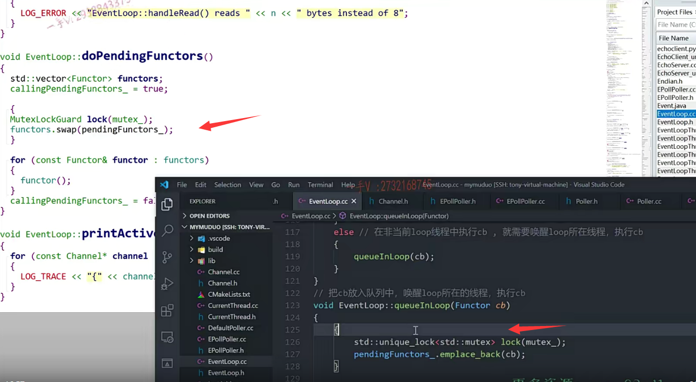

### 使用swap 局部变量 来交换  可以减少延迟，否则vector一个个释放太慢

唉，这个就非常好，这个呢，用所控制vector拿vector跟这个局部的对象一交换，

相当于呢，把你待执行的vector全部装到这里边来了，局部的 vector里边来了啊，

把你这个vector pending factors就解放了，对不对？

我在这可以从局部的这个vector取出回调，慢慢去调用。

而也不妨碍你main loop向子loop写回调的时候往这个pending function functions里边去装这个call back。

这双方两个地方可以应该是并发操作。

能理解吧。这就是它的好处。

你仔细想啊，不要光光看一下，这里边用一个呃，为啥要定一个局部的victor跟这一交换，这有什么意思呢？是不是。

这意思大了去了？啊，意思大了去了。

在这我们写一下啊

Std::vector.functor.tors factors.这是calling pending factors。等于true。

calling pending funder就是需要执行，是不是回调啊？

开始那么这里边这些变量。来看都是原子类型的，对吧？

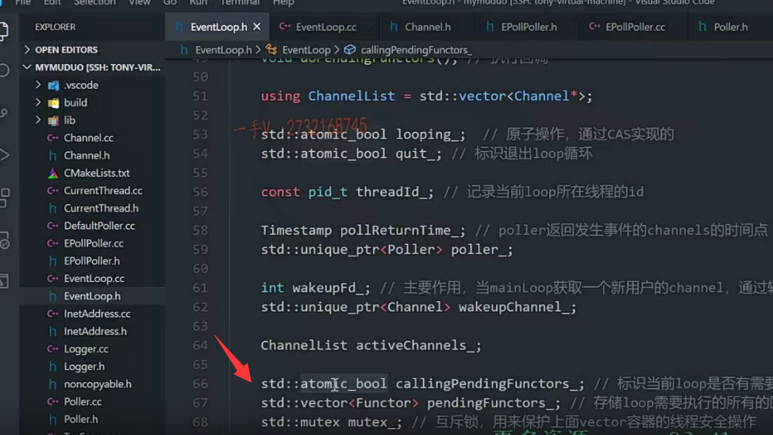

再移上来。先是STD。

这是unique lock.STD mutex.lock mutex.

那么，在这里边儿执行一下functors局部的vector对象swap。

==跟这个pending factors一交换。相当于把这个pending factors解放了。==

是不是啊？解放了，

==现在即便是我还没有执行完，当前这个loop需要执行的回调。我也不妨碍main loop向这个loop，当前这个loop里边儿是不是去写回调啊？==

==因为pending factors我已经不需要了，已经把它释放了。==

==啊，出了这个右括号，这个锁就没了嘛，是不是锁就释放掉了啊？==

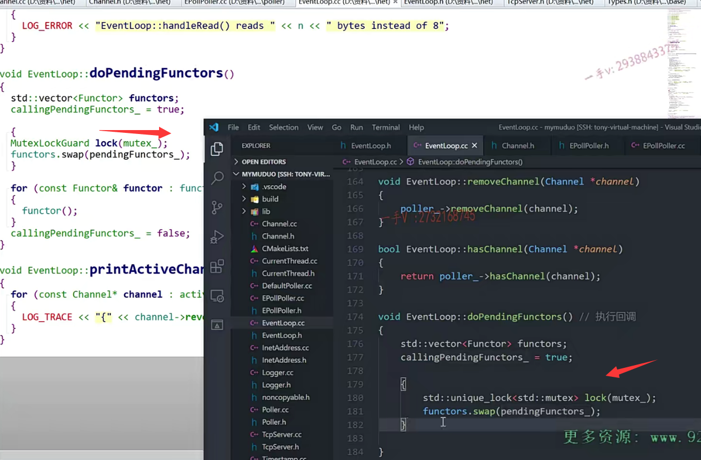

那么在这里边，你看啊，

这就是执行什么呢？const a function。functor.

来执行这个functions。调用相应的这个回调。

完了以后再calling pending functors。把它制成一个FALSE。

好的吧啊，注意一下啊，注意一下。

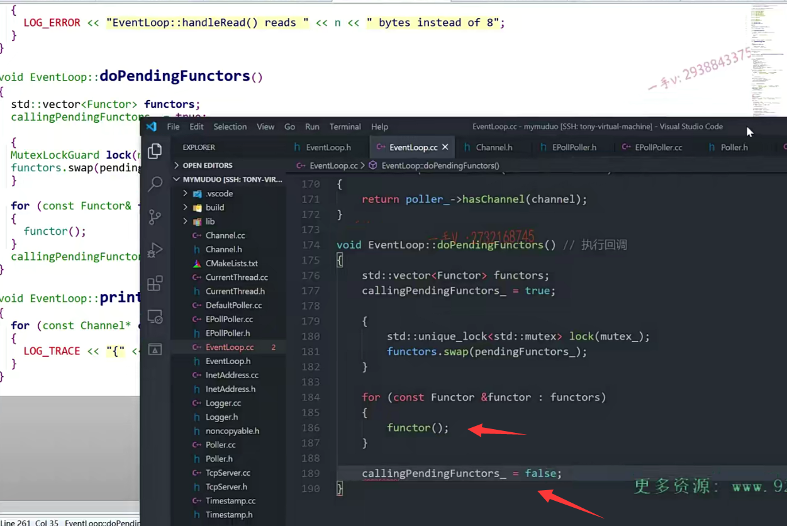

## Functors（）在TCP server中实现

那在这里边儿注册的回调都有哪些回调呢？这个别着急。

啊，这个不要着急，各位啊，

谁能向这个main loop里边写东西啊，

那肯定就在TCP server里边了。

TCP server，我们还没有去实现呢啊，

大家先注意，这里边就是执行当前loop需要执行的回调。

诶，回调操作。好了吧啊，

你像这个变量，现在控制的这个范围呢，就是当前这个thread啊，当前这个loop呢，在执行回调。对不对？

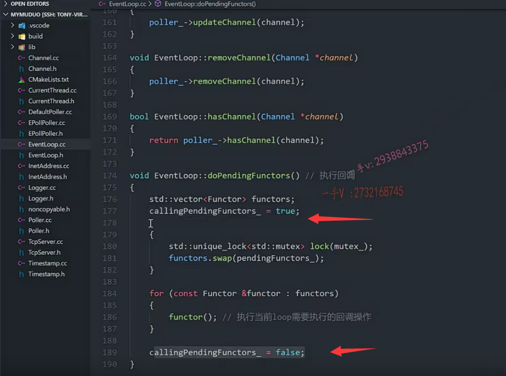

当前这个loop在执行回调这个do pending factors刚才在哪里调了呢？

这不就是在loop中调用的吗？叫do pending factors嘛？对吧啊，

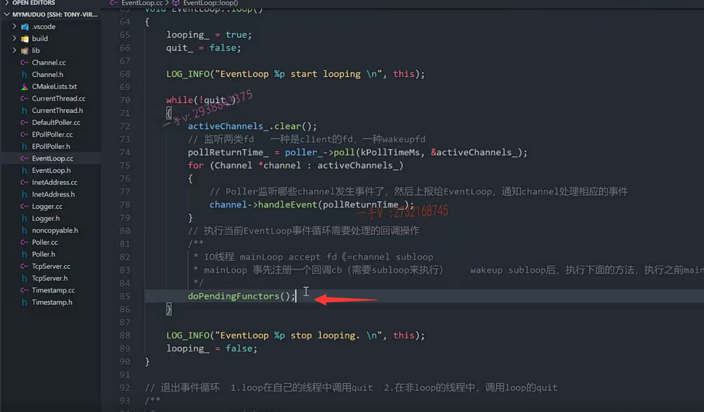

## 之前的callingPendingFunctors逻辑

所以呢，反过头来你再看我们刚才在这里边儿啊。

欠大家一个逻辑叫queueinloop。

好吧，什么时候要wake up？

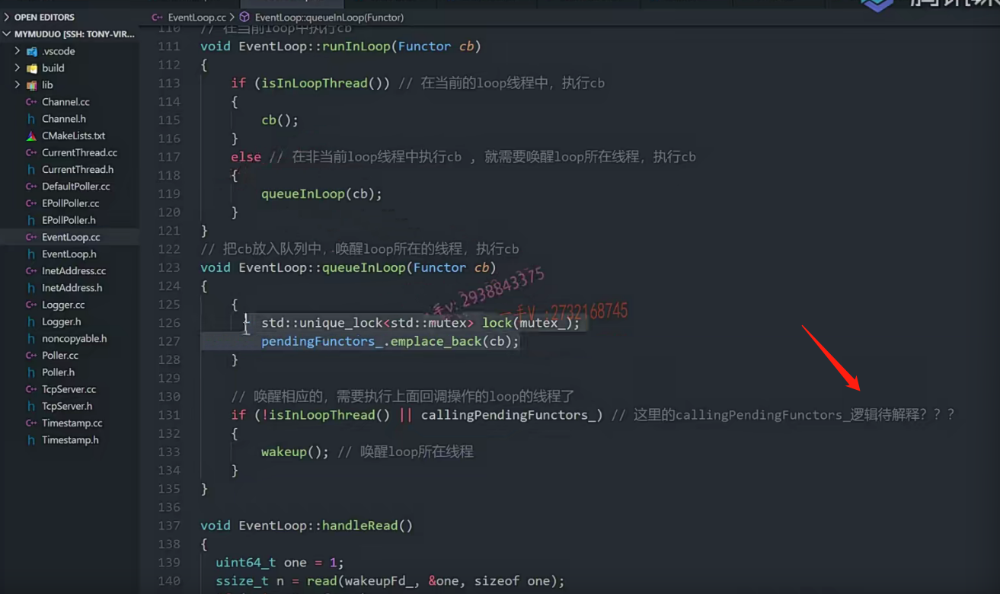

这里边是不是写什么了啊？这里边给pending factor里边去写回调了，

有两种情况，一种是。这种情况我们刚才解释了，对吧啊？

你这个loop上要执行的这个回调，但是呢，当前运行代码的线程却不是你这个loop对应的线程。

所以要把你这个loop所在的thread给你wake up，唤醒起来去执行回调，

另外一个就是我确实是在当前这个loop对应的thread。去执行回调，但是呢？

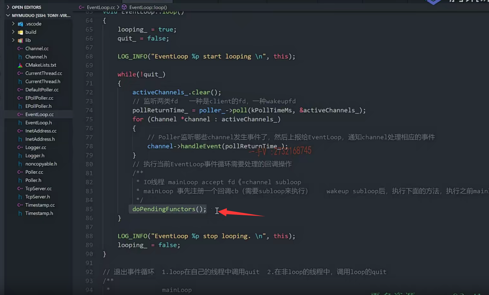

### 上一轮没结束，callingPendFunctors依然是true

我上一轮儿这个loop补起来以后，是不是正在执行回调啊？

正在执行回调，你又给我当前的loop，是不是写了新的回调啊？

你看写了新的回调嘛，

写了新的回调。我正在执行回调，我还把当前loop上的回调没执行完呢，

那也就是说这儿没有做完，

这儿是true还是FALSE啊？这儿还没写成FALSE呢，这儿是不是依然是true啊？

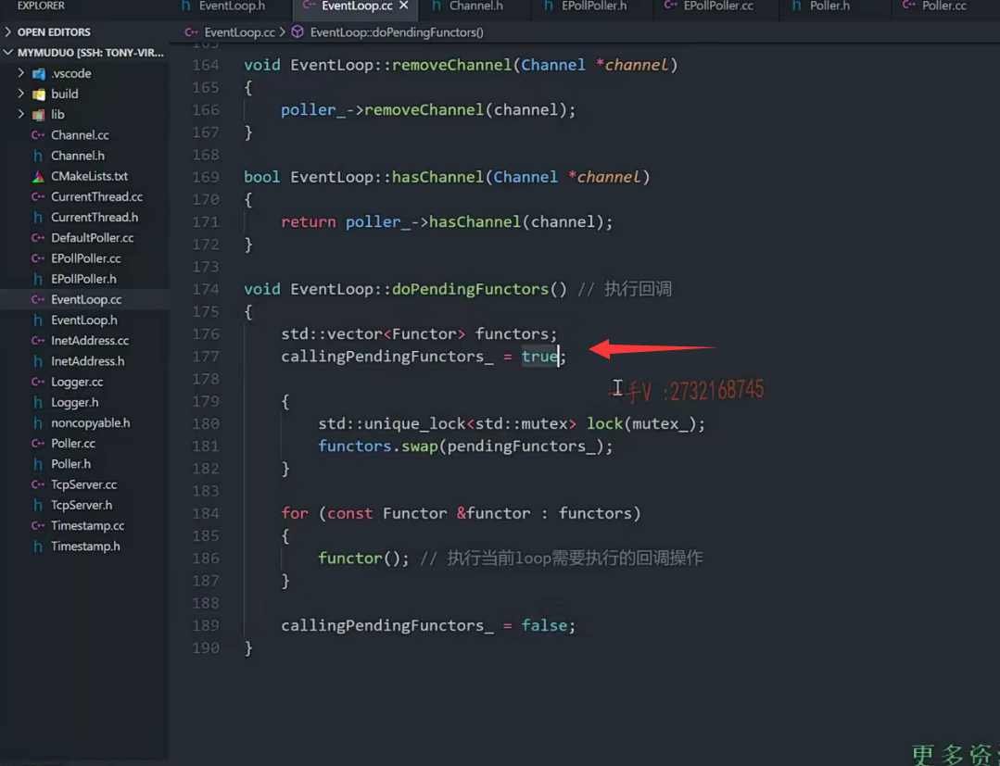

### 回调执行完了以后，又阻塞   会有这种情况

那么你想一想啊。

如果我上一轮的这个回调执行完了以后。

他回过头来，是不是又阻塞在这个poll上了？

那你怎么让他去继续执行？

在你执行上一轮儿回调的时候呢，实际上啊，已经有main loop向你这个子loop里边儿是不是写新的回调啊？

你上一轮儿回调执行完了以后，你又阻塞在这里边儿了。

你哪儿来的机会再去写，再去执行新的回调？

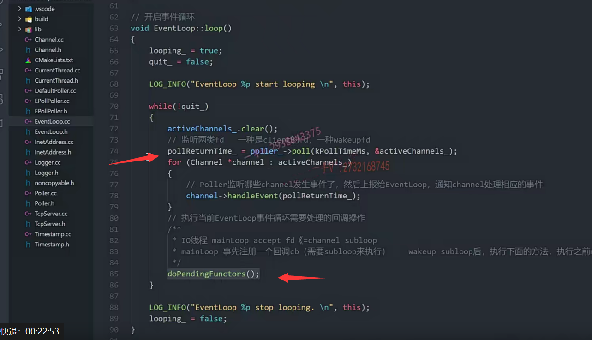

## 但是回调执行完了以后，又阻塞 这种情况   依然需要wakeup

### 所以需要再加或 判断 callingPendingFunctors为true

对吧，所以在这里边呢，它的这个逻辑意义就是说。

或这个或者这个为true这个为true表示什么意思呀？

这个为true就表示我当前的这个loop啊，正在执行回调。没有阻塞在路上。OK吧啊，

正在执行这个回调，没有阻塞在这个路上。

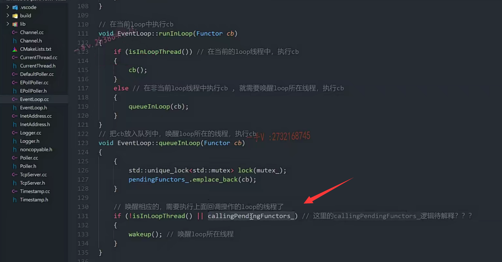

那么，如果说我什么也不管的话，

==那他执行上执行完上一轮的这个之前遗留的这个call back以后，==

==他又回到这个poll了。它就阻塞了，==

==所以呢，在这种情况下，我也依然要去wake up把当前的这个loop唤醒一下==。

啊，把当前的这个loop唤醒一下，

也就是说给wake up channel写这个写一个数据写个one=1。对不对？

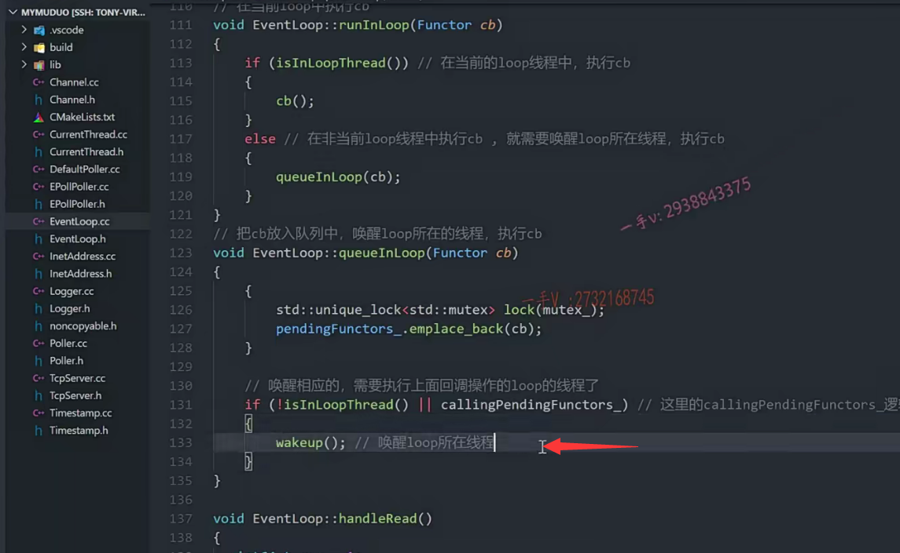

当它执行完之前的这个回调以后，再阻塞，再碰上以后呢？

唉，它就又把它唤醒起来了。继续执行回应。

能够理解吧啊。

这个呢，含义就给大家解释了啊。

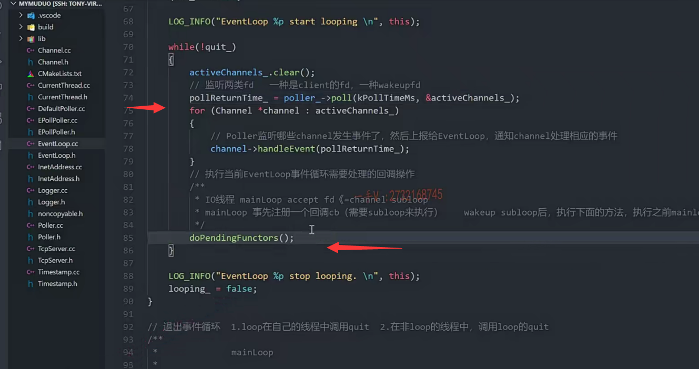

## 再总结一下

那这里边我给大家再写一个注释吧。

或上这个的意思是。

当前loop已经正在执行回调。对不对哎？

正在执行回调，现在你又给当前loop是不是添加了新的回调啊？正在执行回调。

但是loop又有了新的回调。

是不是那势必他执行完当前的回调，他是不是又去阻塞阻塞住了？

啊，又去阻塞住了。

对吧，需要把当前的这个loop呢，再唤醒再执行，给它新添加了这个call back。

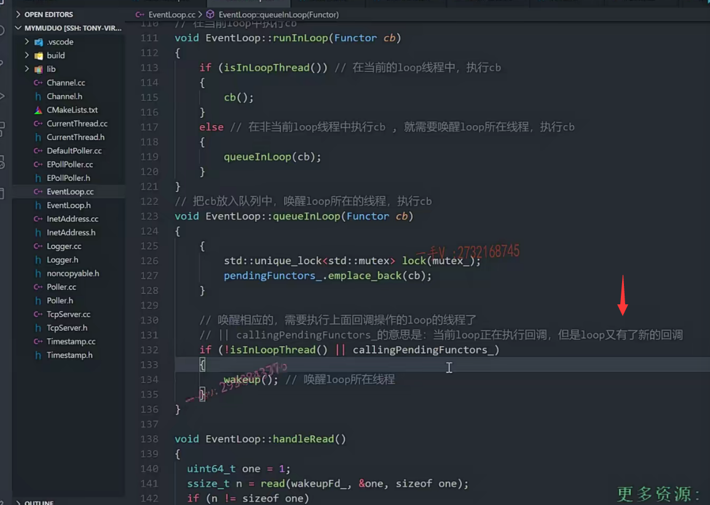

这个的这个逻辑过程啊，我觉得还是非常不错的啊，大家去体会一下，体会一下啊。

那么注意啊，我们有一些。

在这里边，我们event loop也算是说完了啊，event loop也算是说完了，

## muduo 没有使用生产者消费者队列，而是之间通过eventfd来通信

我把注释别写到这儿吧。那么，大家注意一下啊，注意一下。

如果说我们给main loop跟sub loop之间添加一个。

在这儿呢啊。添加一个就是代表生产者。消费者的线程，安全的队列。

main loop只负责生产，生产往这队列里边放channel，

而sub loop呢？负责消费。从这个队列里边拿channel消费。

我们就用这个队列把main  loop跟子loop就给他隔开了。

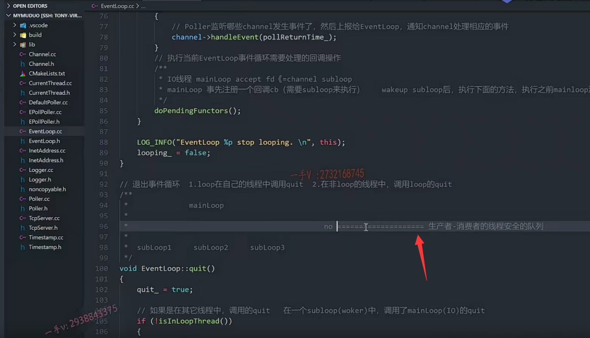

这样做的好处呢，是逻辑呢？相对来说就好处理了，但是呢，

我们muduo库里边呢，是没有这个。

他们是之间是直接通信的，怎么通信就是通过这个wake up fd？

通过event fd这个系统调用，创建了这个wake up fd。

通过wake up fd来进行线程间的直接的notify唤醒的。

对吧，所以在这里边儿啊，大家发现啊，这里边儿这个函数在执行的时候啊，它的逻辑相当的这个巧妙。

希望大家呢，花一点时间费点心思，把这里边好好理解一下。

## 总结

好吧啊，那到这里边的话呢，

我们event loop的代码呢，也就算执行完了写完了啊。

我们再检查一下这个其他的channel，我们之前呢注释的也都已经全部给它放开了啊。

还有包括epoll poller。

这个代码我们也就都已经执行完了啊，写完了。

那么，到目前为止，我们是把核心的一个event loop channel跟poller三个大模块的代码就都写完了，

希望大家呢啊，好好捋一捋思路啊。

好吧啊，我们还有好几个模块还未完成啊，我们埋头苦干，继续奋斗啊，

再经过几节课的讲解，我们把所有的模块儿呢，都处理完了以后，

我们再从整个儿的架构上来看一下呢，它的各个模块儿之间大方向的这么一个通信的过程啊。

好，那这节课的内容就先给大家说到这里。