上节课呢，我们说完了这个thread。

这节课我们来说这个event loop thread。

上节课的那个thread就是只关注于一个线程，对吧啊？

这个event loop thread相当于就是绑定了一个loop跟thread。

让这个loop呢运行在这个thread，就是在这个thread里边儿去创建一个loop，

one loop per thread嘛。

对吧，所以你看他的成员变量啊，有一个loop，也有一个线程啊，

一个线程对应一个loop，一个loop对应一个线程。

这边还有其他的有关信号量跟互斥锁相关的东西，

我们都是使用C++11里边提供的啊。啊，这个不需不使用系统提供的了，使用起来呢，更方便快捷。

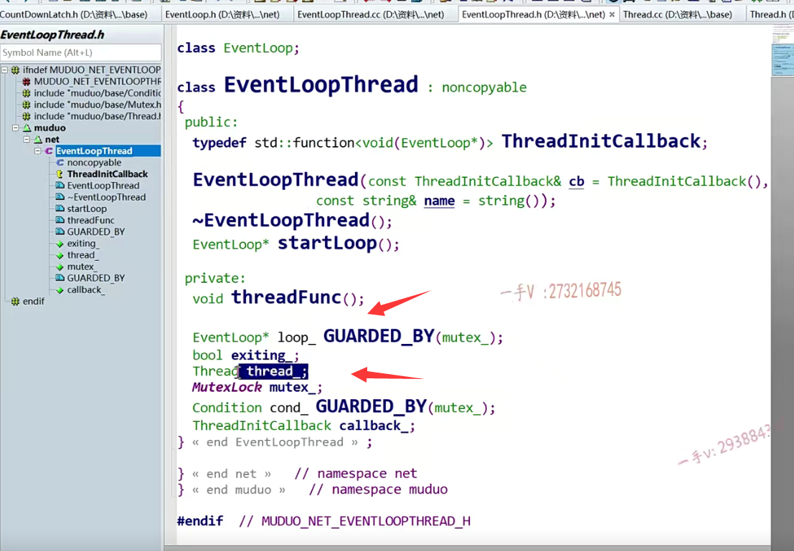

# eventLoopThread类实现

### 包含noncopyable

好，那我们先创建两组原文件啊event event event loop。thread dn h.CC，

我们先来定义它的这个类event loop thread。

我们来一块看一下啊，

首先呢，不用说。包含它的这个non copy able。继承他的non copy able。public.private.

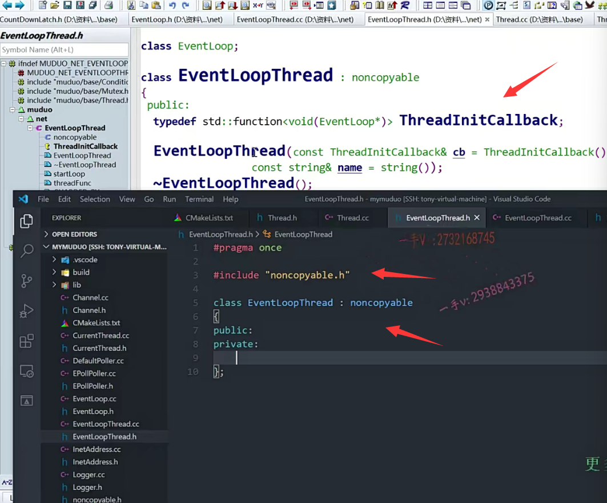

## 成员变量

这里边它有一个threadInitcall back，就是线程的一个初始化的一个回调，

就是呢，因为底层呢，这是一个loop是运行在一个线程里边儿的，

你要做一些初始化工作的话呢，

你可以给它传递一个。看看到了没？

通过构造函数呢，这都是从这个上边一直往下传递过来的啊，

就是可以呢，你传递这样的一个回调函数对吧啊？

在这个event loopp刚创建，就是在这个线程里边创建一个event loop后呢？

可以第一次先调用你这个函数进行一个初始化操作啊，

如果呢，你没有传相当于什么也不做好吧？

那在这儿呢，我们把这个类型先定义一下吧，就是using thread init call back.

等于个什么类型啊？需要把这个function类型也包含一下啊。 functional。

然后在这里边就是STD。functional.void.event loop星。

==需要进行一个类型的前置声明。event loop.==

好在这大家来看一下啊。首先呢，第一个就是event loop。

然后是布尔值exiting 是否退出循环，对吧？

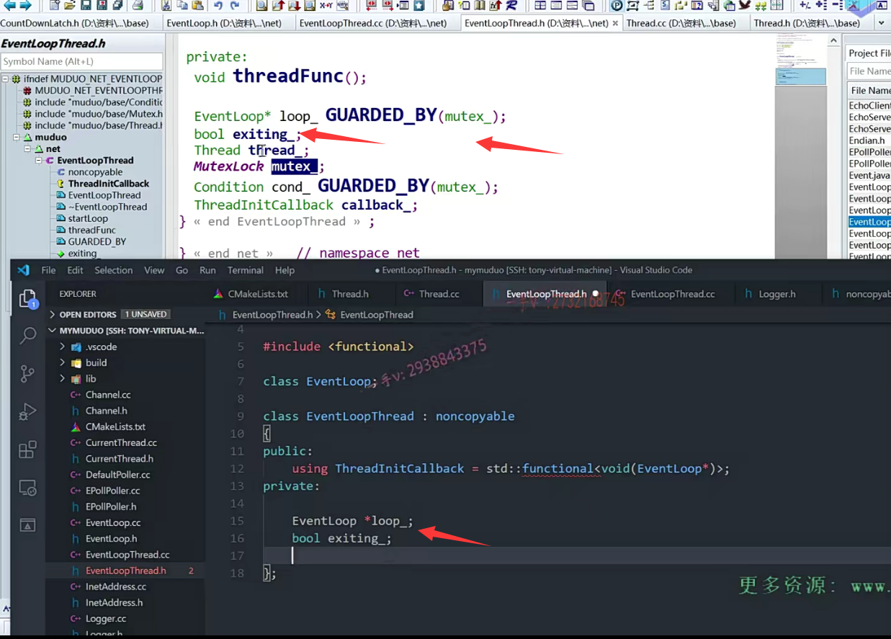

这里边guarded by mutex相当于就是注释了啊 运用锁呢，来控置它们，

它们的使用跟互斥锁是相关的啊，

我们到时候在代码上具体来看。

这个用了thread的对象，所以得包含thread这个头文件。thread点h。thread.

然后是mutex。用到了互斥锁。还用到了条件变量啊。

STD mutex.mutex.

condition variable.这是cond。好，这是成员变量啊，

我们就给它输出完了，

还有最后一个记录初始化操作的啊，call back。

这是成员变量。我就不一一注释了，这个应该已经是很明显了，大家可以自行加一些注释啊。

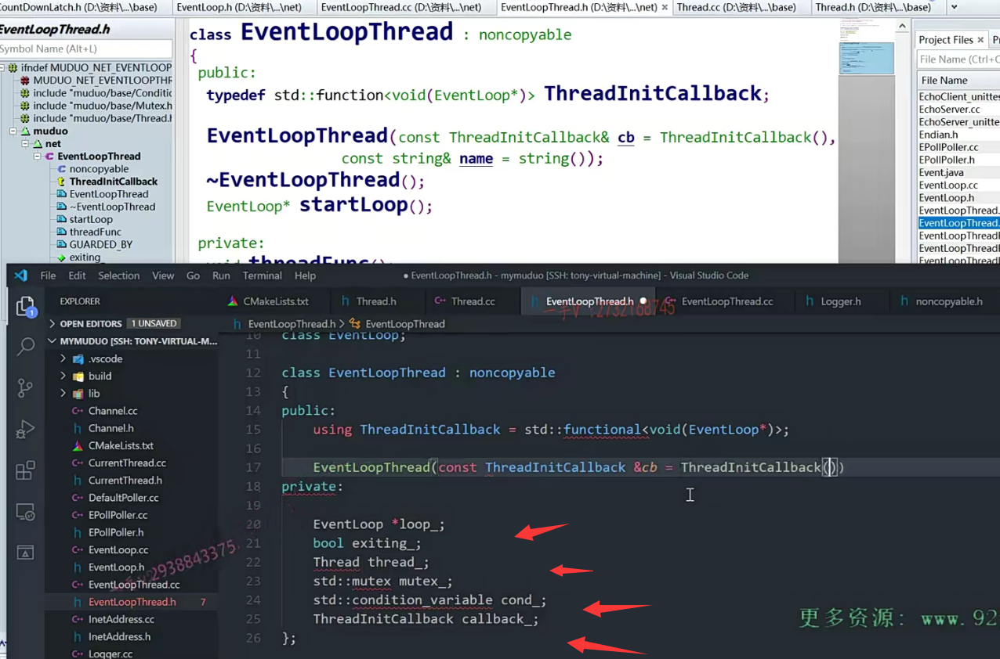

## 构造函数定义

它的这个构造函数啊。

我们看一下它的这个构造。它的构造呢？

首先会传进来一个线程的初始化回调cb count需要还需要string。这是它的这个析构函数。

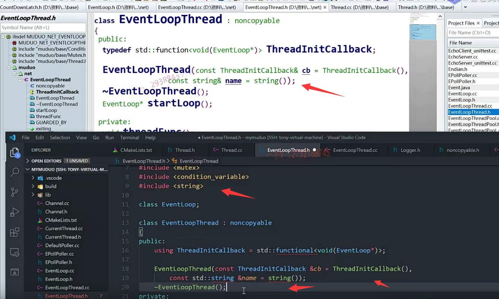

好了，然后呢？还有start loop？

event loop.有start loop。开启循环，对吧？

还有一个什么东西呢？还有一个线程函数，

这个线程函数呢？才在里边去创建loop。

大家接下来跟我来写一下它的这个成员方法啊，

看成员方法里边儿它是怎么去结合loop跟thread来实现one loop per thread这么一个模型呢？

总共是四个方法，我们放在它的这个CC里边，include这个event loop thread点h。

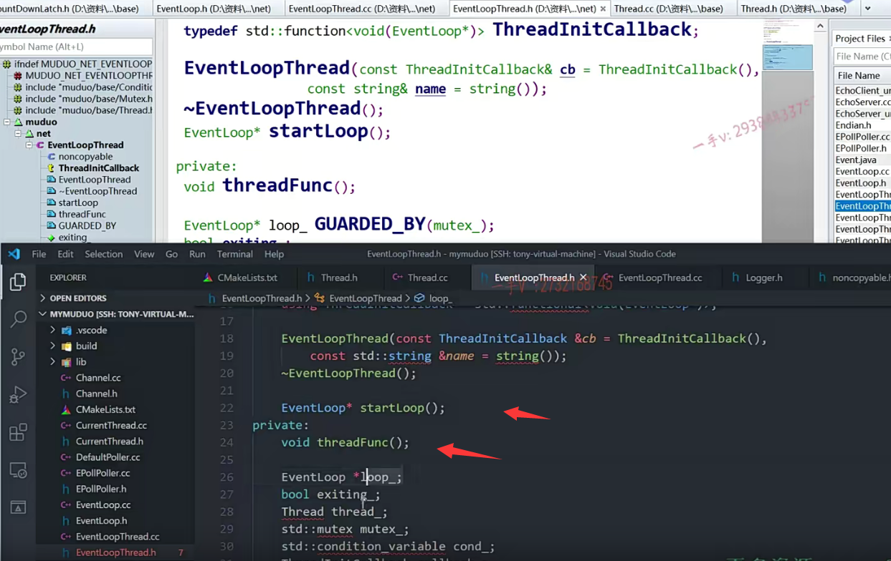

## 四个成员函数的实现

## 构造函数的实现

好，看一下这个构造函数，

我们首先都要做哪些初始化。

首先在这儿呢，loop是一个空那必须的，

因为event loop thread才去创建一个线程去创建一个loop对象的，对吧？

所以刚开始的loop指针是一个空。

然后是exiting。这刚开始是1 FALSE啊。

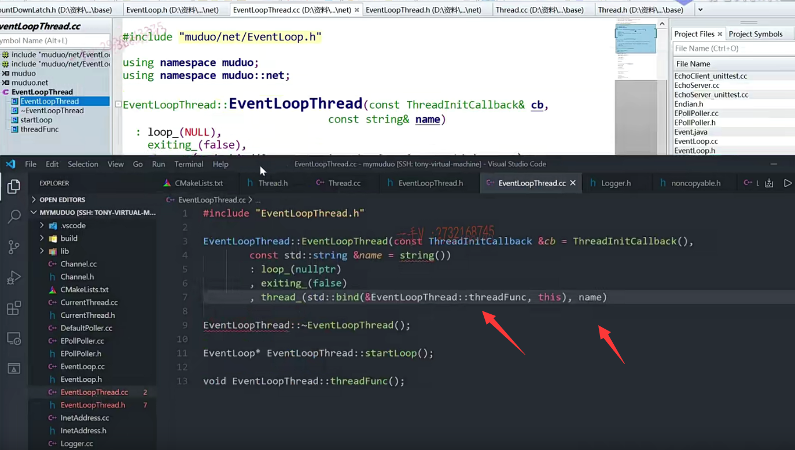

#### 就是说EventloopThread传进来参数，然后Thread的创建由于绑定器的使用，只需要给name就行，底层的线程函数绑定好了

然后呢？这是thread。

thread在这里边使用了这个绑定器，给它绑定了一个线程函数是谁呢？

就是我们event loop thread的thread func。

好吧，绑定了这个this。

这是thread的构造函数。这是我们thread的构造函数，大家来看啊，我们上节课写的。需要一个线程函数，再需要一个name，对吧？

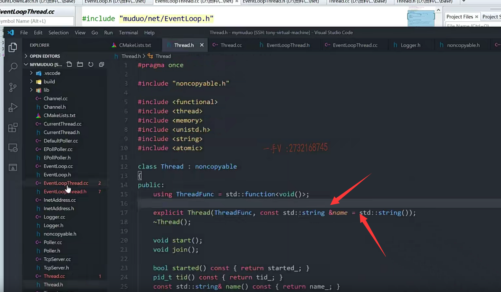

唉，现在这儿呢，就是在event loop thread这里边。

他创建了这么一个thread的对象。

注意，此时这个子线程还没创建起来呢，

子线程的创建是我们手动调用start的时候呢，这里边才创建线程。才去执行呢，

我们给线程下发的这个线程函数。

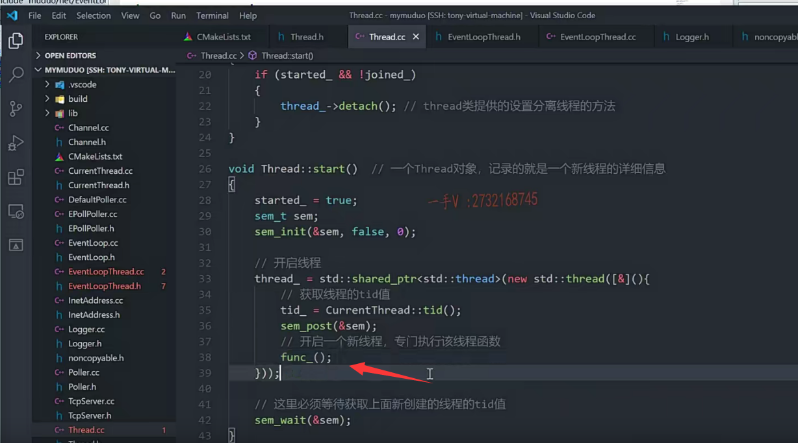

就是哪里呀？就是这个。（指的就是这个threadFunc）

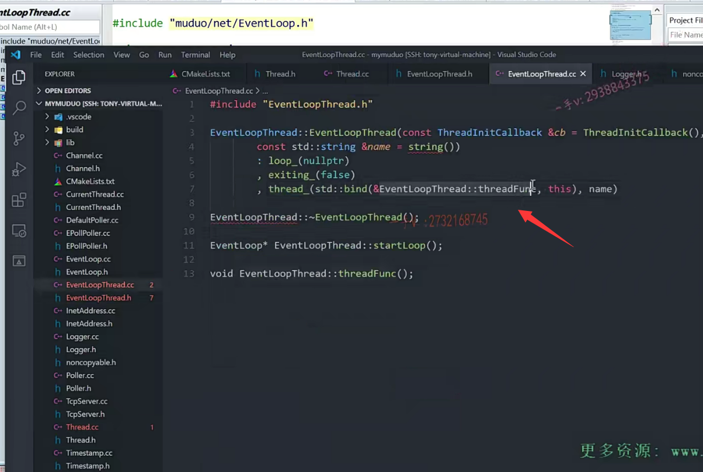

OK吧？

唉，这就是绑定的一个回调函数。眼睛放亮啊。

好在这里边呢，还做了什么事情啊？还做了这个mutex，

这都是默认构造啊。这都是默认构造。

call back cb.

这里边也不用实现什么东西了。

==注意C++的这个condition variable，不需要初始化的时候放mutex，人家也没有这样的构造函数啊。==

使用起来比系统的API更简单。

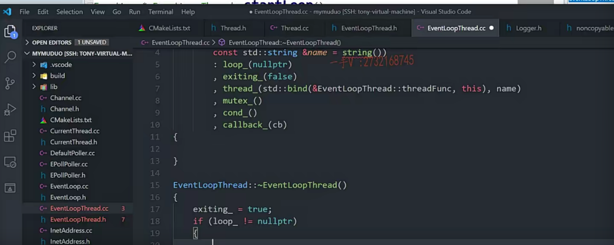

## 析构函数的实现

exiting就要退出了是吧？那就是true啊。

如果说你的loop不等于什么，不等于空。

那叫干嘛呢？那叫loop quit.

这要包含一下什么头文件啊？event loop的头文件了。

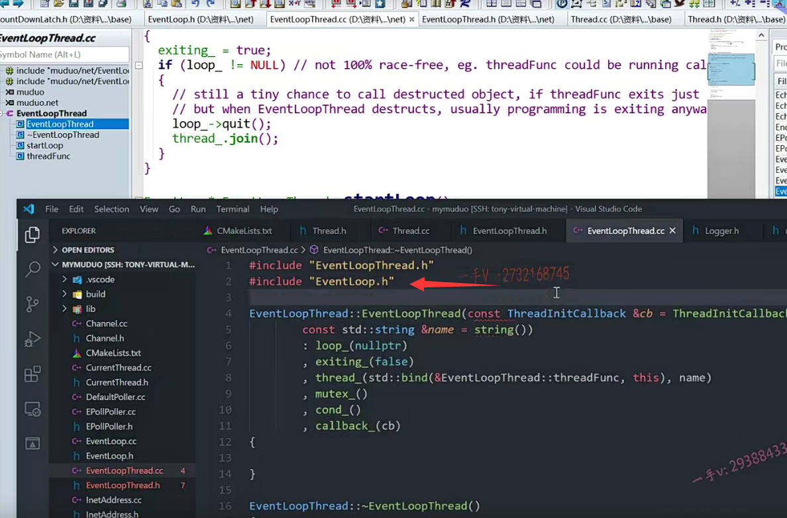

这表示，线程是不是已经在退出啊？

线程在退出的时候呢？那在这里边儿，把这个线程里边儿绑定的事件循环呢？也给它退出了去。okay吧啊。

然后等待它底层的这个子线程结束。对不对？

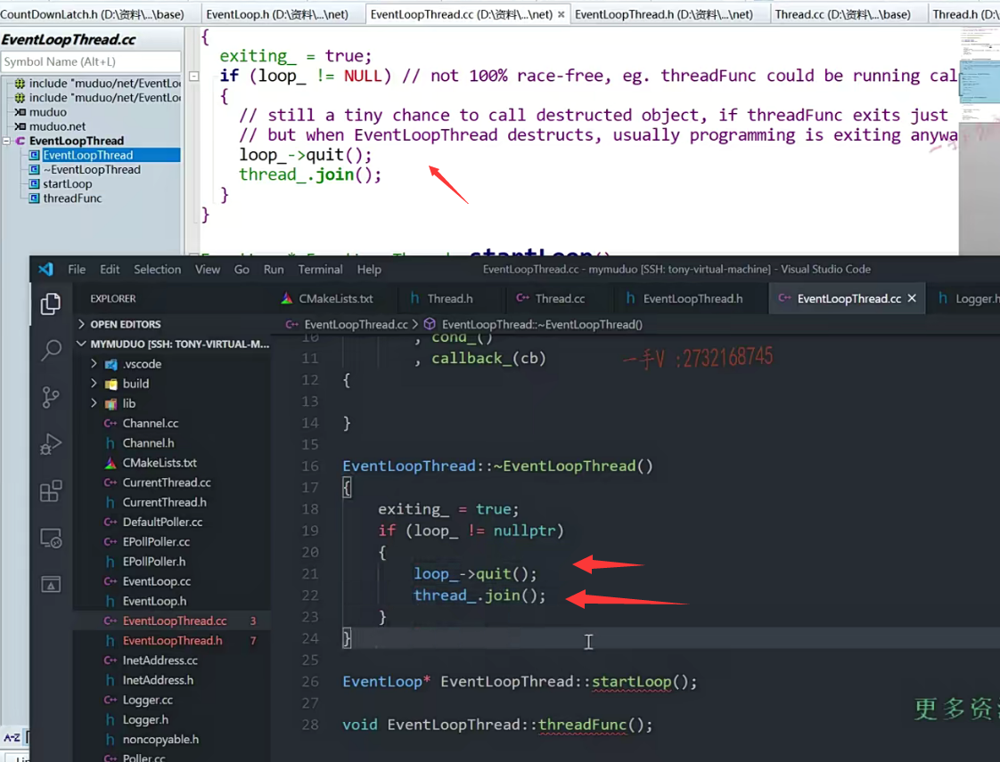

## startLoop()实现

好那么在这里边来看一下啊，这是start loop。

怎么叫startloop呢？

首先一上来就是这都是启动循环了是吧？

所以一上来首先呢，这儿就干嘛了？

这是不是就是启动底层的这个线程啊。

启动线程以后，它执行的是哪个函数啊？

执行的是这个func func是谁呢？

func就是构造函数的，构造的时候呢？你传进来的。

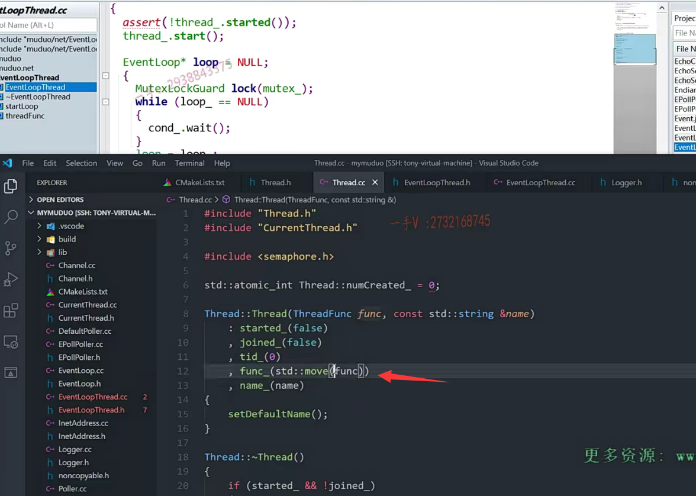

也就是我们现在这里边的什么？event loop thread。

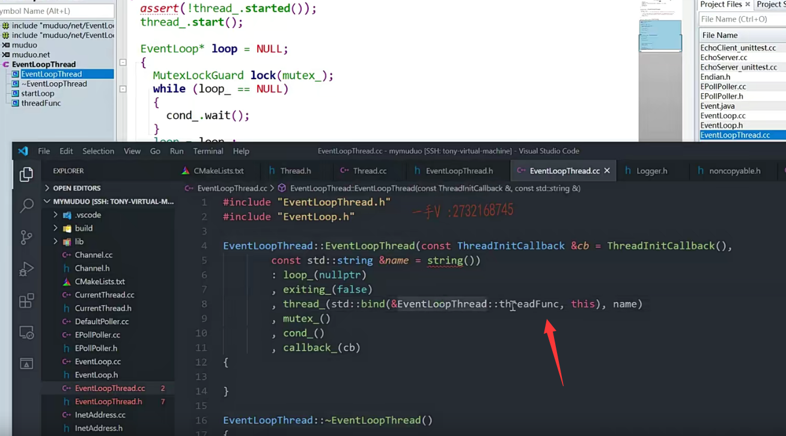

也就是说呢，同学们，各位在这里边儿睁大眼睛，你看一看，

当你在这里边儿调用啊，它的star loop去开启循环的时候，

它首先就是开启了底层的一个新的线程。启动底层的这个新线程。

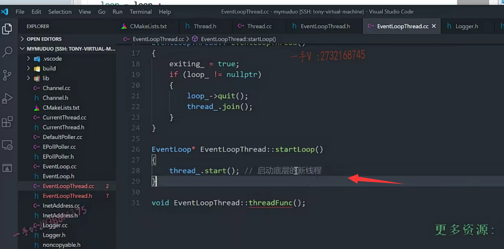

启动底层新线程以后，它执行的是哪个线程函数呢？

执行的就是你下发给底层线程的这个回调函数，

也就是当前eventloopthread的。thread func.在这里边儿做了什么事情呢？

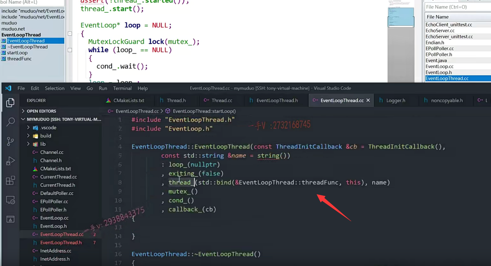

你注意啊，我备注一下。

下面这个方法是在单独的新线程里面运行的，

==因为你每次start。这里边执行的都是起的都是一个什么新线程。好了吧。==

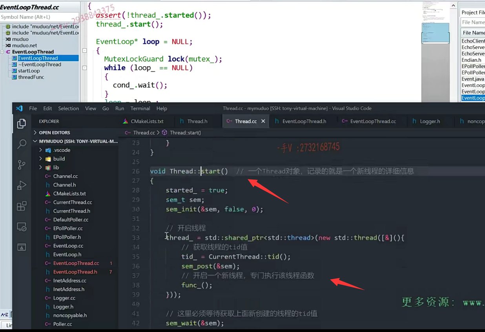

## threadFunc()

### 体现one loop per thread模型

你看下边这些事情，我就先不做啊，我在这里边看你看启动新线程，

以后在这里边一上来哦，

一上来它就是创建一个独立的eventloop和上面的线程是一一对应的。

所以呢，这就叫做什么呀？

各位，我们终于在这里边瞧见了他所谓的one loop per thread模型了对吧啊？

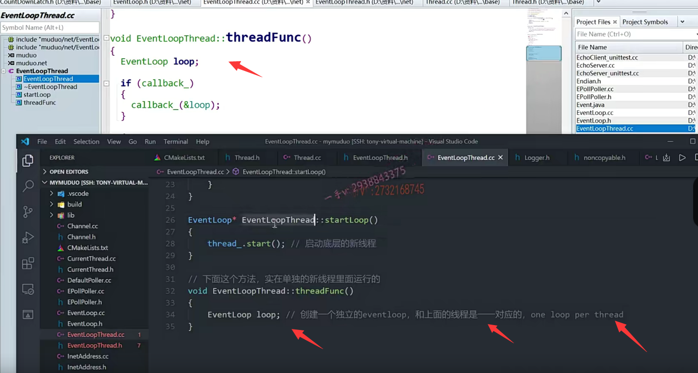

你说你要面试的时候把这个one loop thread能说到muduo库，具体的类具体的一些方法上。

这个不相信面试官。他还不能够认同你深入的剖析过muduo库对于epoll加对于lO复用加nonblocking加多线程的这个网络服务器的这个设计模型。不够了解对吧啊，

我们已经说到这儿了，怎么可能还不够了解呢？

### 执行thread init call back()初始化回调

注意start到这儿啊，

那么你看啊，这个loop起来了，

==以后我们刚说了，你是不是可以事先给它传入一些init的这个回调啊？==

如果有一定的回调。就是这些东西。thread in it call back，

所以你看init call back什么时候执行呢？

就是呢，在底层起一个新线程。啊，去绑定一个loop的时候呢，

什么事情还没做呢，就是先如果呢，你传递过这个thread init call back，人家在这里边就给你先调用这个回调，

可以把当前这个线程绑定的loop对象传给你，

这个回调函数你可以针对这个loop。做一些你想做的事情啊。

好吧，那么大家来看啊。

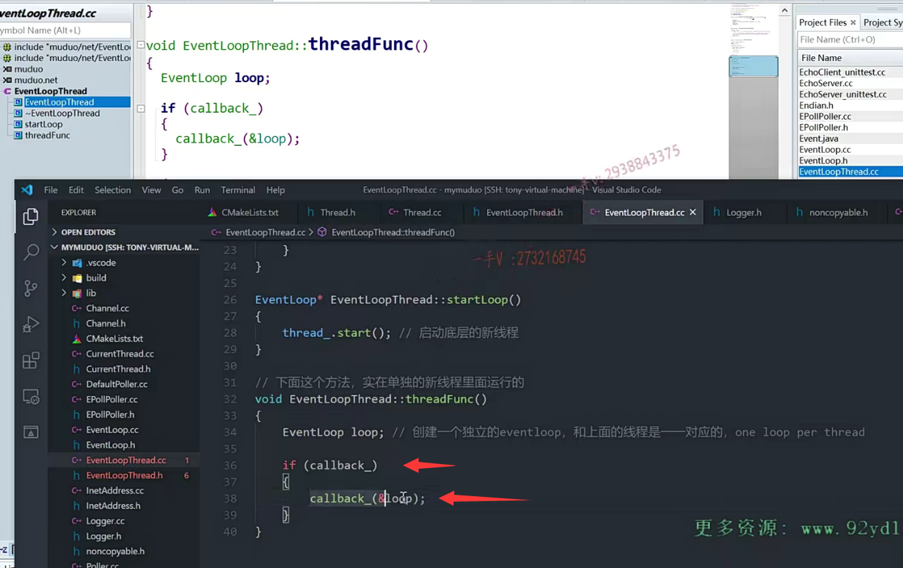

### 为每个loop加个锁

大家来看，那在这里边，我们继续来读一下，

在这里边。它的这个成员变量啊，

它的成员变量呢，是需要指向这个loop的啊，

它的成员变量是需要指向这个loop的。

那这里边还用锁进行控置了，那也就是说呢？

不能对这个loop同时是不是进行修改啊？

那么你看。在这里边，我们用到了智能指针，那还得包含一下。这个应该不算是memory头文件里边的。

我们看能不能直接访问呢？STD。叫做。unit lock啊STD mutex。lock MU tx.okay.

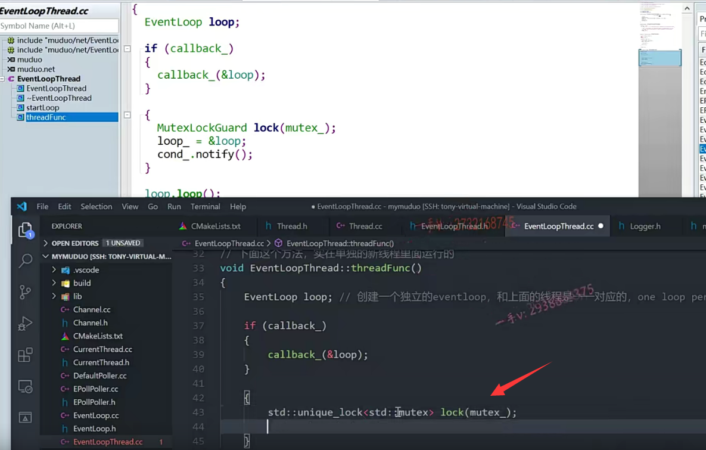

loop.等于这个线程新创建的loop，

它的成员变量还绑定了一个loop，就这个loop指针指向了loop对象，

就是运行在这个线程里边的loop对象。

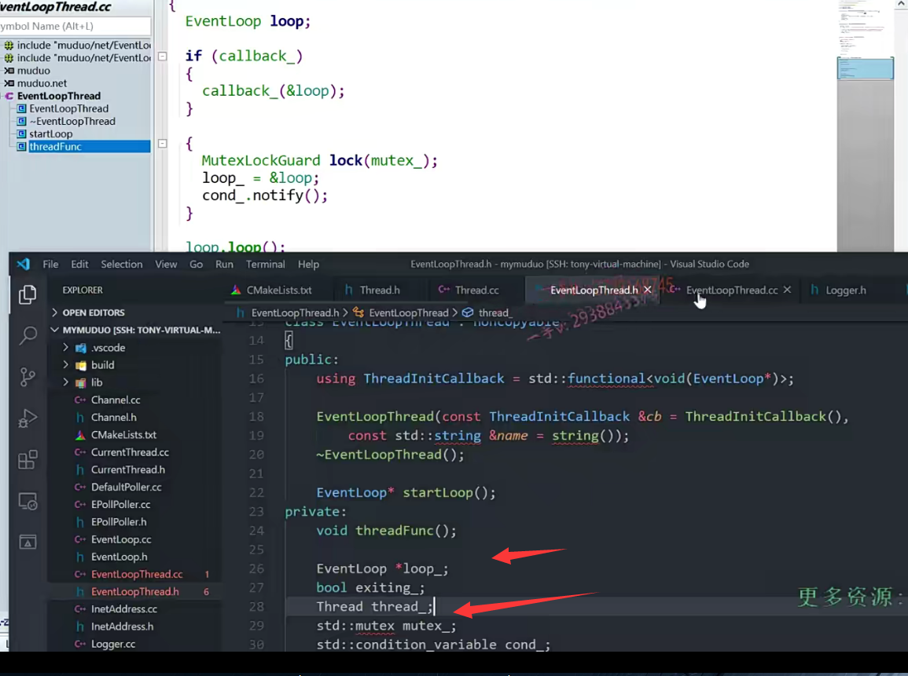

### threadFunc函数中有条件变量,必须等loop对象初始化好了，才通知其他线程来处理

对吧，好了，然后怎么样呢？然后呢？

通过这个什么东西呀？notify()。

我们来怎么样啊？我们来notify one 吧啊。

就通知一个就行了好吧啊，通知一个就行了，等待在这把锁上的条件变量，

使条件变量成立。

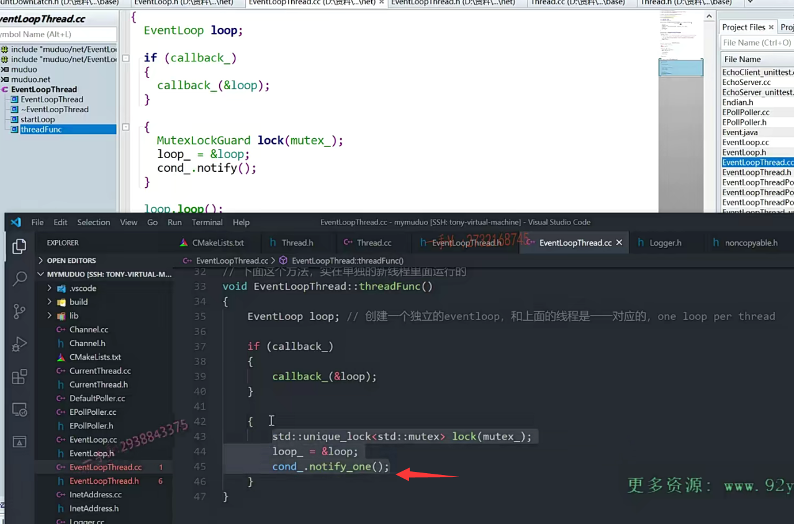

那通知他谁来接收呢？

那当然就是上边这个了。

我们先来把它写完，你看看它是什么意思啊？

even the loop。loop等于一个nullptr。

那么，各位在这里边儿什么意思呢？当我们去start loop的时候，

这底层才创建一新线程呢？相当于当我调用start loop的话呢，

这块儿就下来了，这块儿是一线程start，

这个开新线程执行的线程函数，这儿又是另外一个线程。对不对？

这才是真真正正啊去执行这个loop的线程，

那么到下边的时候呢。那我们这里边loop有没有初始化好，我们还不知道呢，

所以得等它初始化好了，用loop指针指向loop对象了。

通知我，我起来在这儿，我才能访问这个loop指针了，是不是？

### 后面这块是判断新线程有没有创建loop

大家来看一下啊。在这儿。同样的先。

我们直接把这块拷贝过来吧啊。unit clock.然后这是while。

很明显。loop如果等于谁的时候空的时候，那就是说呢，这个创建的新的子线程。

还没有执行到这儿呢，还没有通知我呢，对吧啊？

那我就一直怎么样啊？wait就一直wait参数传一个上面的这个lock就行了。

等待在这把互斥锁上，是不是啊？

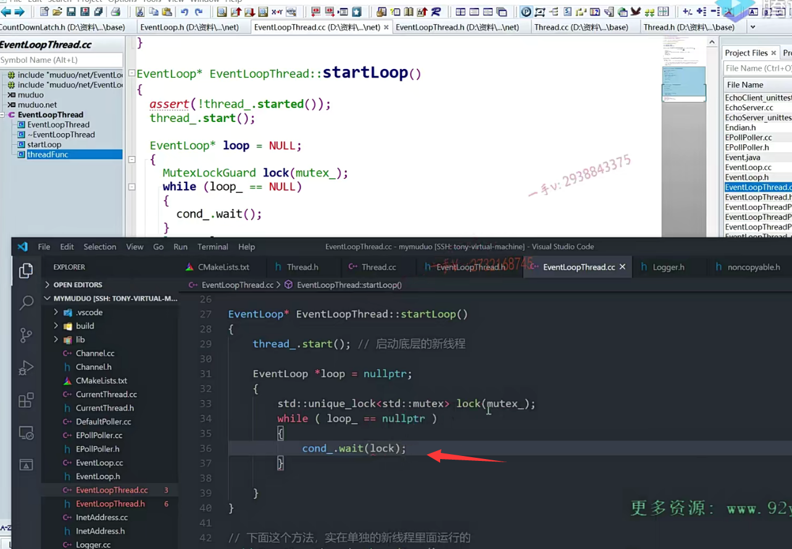

### 将子线程中得到的loop_赋值给父线程的局部变量loop

出来唤醒出来了以后呢？那就说明了。

这块通知这块了嘛，通知这块通知起来了，以后那就说明了。怎么样了？

这个loop等于呢？就是我们记录的成员变量。就是loop杠。

记录了这个新创建的这个线程里边真真正正的绑定了这个loop对象的地址，

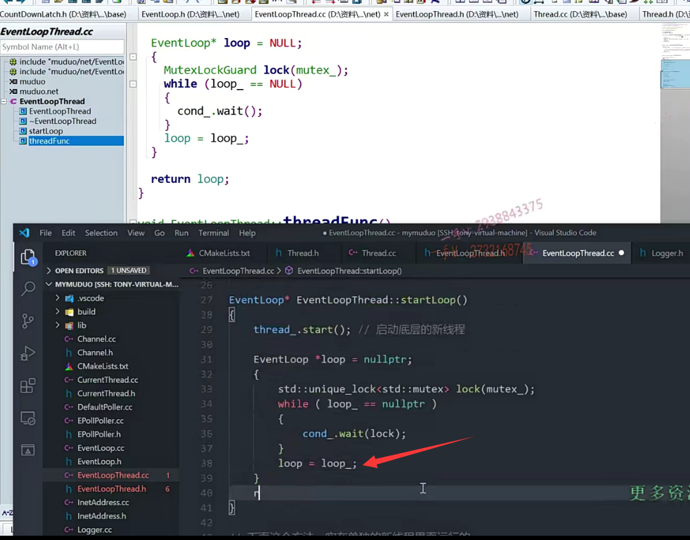

### start loop就会获取新线程里单独运行的一个loop对象的地址

对吧？然后呢？再把谁返回去啊？

再把这个loop返回去，也就是说呢，上边调用我这个start loop就会获取什么呢？

哎，获取呢？一个新线程，

这个新线程里单独运行了一个loop对象，

然后可以把这个loop对象的地址呢返回回去。

这里边相当于做了一个线程间的一个通信操作。

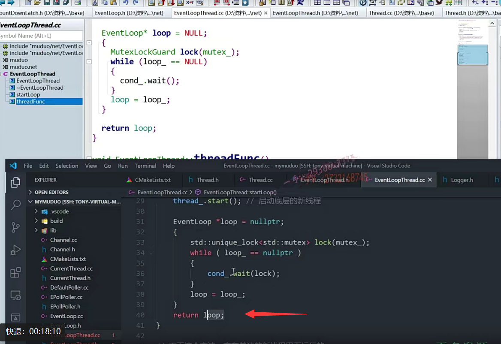

### 子线程里边执行的eventloop的loop函数，调用底层的poller的poll监听或者处理读写

好，那么在这儿呢？

这是我子线程里边执行的loop，

那我loop当然要干嘛呢？loop点loop啦。

这里边相当于是不是执行了eventloop的loop函数。

开启了底层的这个poller 的poll 了。对不对哎，

就开始进入阻塞状态来，监听远端用户的连接或者是已连接用户的读写事件了。

好吧，

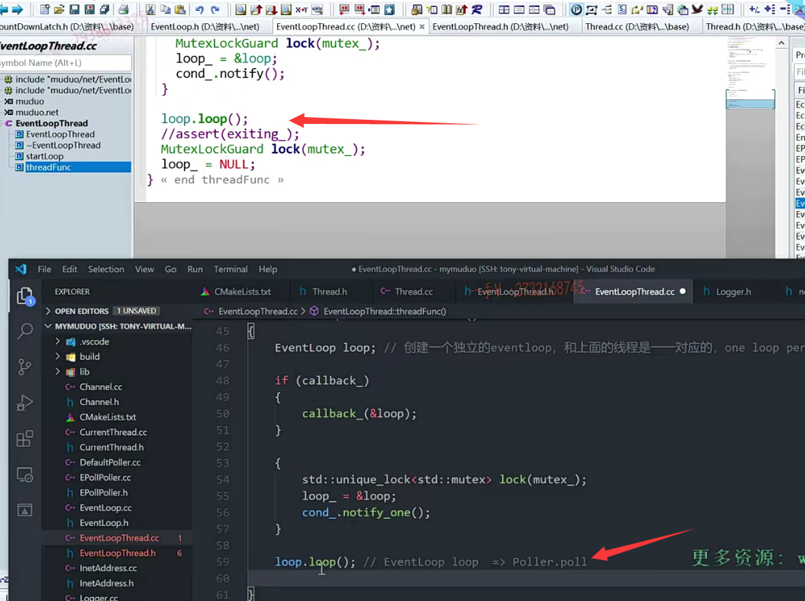

这里边相当于是loop返回了，那也就是当前线程的这个底层的这个poller返回。

返回了对吧啊？

呃，不玩了。不玩的话呢，在这里边把他的成员变了loop置成一个空。

好吧啊，置成一个空在这边，

同样的，他用锁进行了一个保护啊。

okay，loop等于空没问题吧啊。

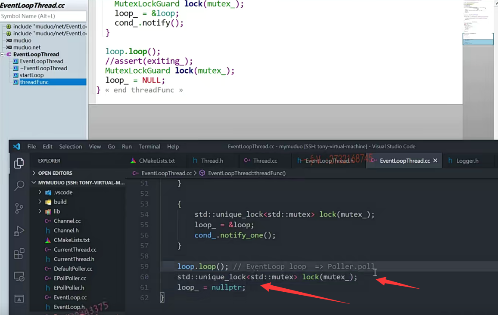

那一般上来说，这个loop是一直会在这里边进行工作的啊，

能到下边来，那就证明我们服务器的程序要关闭掉了啊，要关闭掉了，

不进行这个事件循环了。

## 总结

好，那这里边相当于就是我们这个eventloopthread这个类它的这么一个核心的一个操作，

实际上跟我们上节课写的这个thread，它是搭配使用的，

上节课专门是处理线程的，

这节课是处理线程绑定eventloop thread，就是绑定一个线程，跟它里边运行的一个loop的。

好吧啊，希望大家呢，把这个好好理解一下thread里边执行的这个线程函数。

就是我们event loopthread，给它里边下发的这个。

thread fuc.就是这个线程函数这边定义了一个loop啊。

好，我们继续编一下，目前来说是没有报错是吧啊，目前来看是没有报错。

因为没有别人引用到它，暂时没有参与编译啊。

没关系。我们肯定会用到的啊。

哎，==上节课呢，我们看代码里边总是有一个错误的，==

==这个提示是因为join前边没有加类的作用域。==

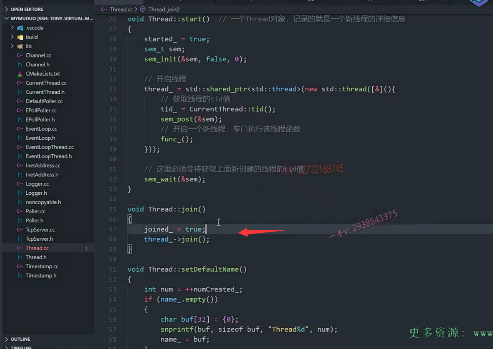

像我们讲课过程中有一些小的疏忽，一些语法上的东西呢，

大家可以自行进行一个添加啊，到时候最后呢，编译的时候也编译器也会报错的。

根据报错呢，处理一下也可以。

好，那这节课我们就主要给大家把这个event loop thread说了一下。

希望大家呢，好好理解并自己呢，把代码输出一下。

好，那我们这节课的主要内容就给大家说到这里。