从这节课开始呢，终于轮到这个TCP connection了啊。

我们这几节课呢，就把TCP connection这个类相关的成员以及方法的实现呢，我们还有它的这个意义啊，涉及的一些精华所在，我们就都给它过一遍。

那么大家首先呢，跟我回想一下啊，TCP connection是用在什么地方呢？

它主要就是用来打包成功连接服务器的客户端的这么一条通信链路的啊，

我们之前已经在这个TCP server中写过。

我们结合着大家把我们之前这个这张流程图啊，

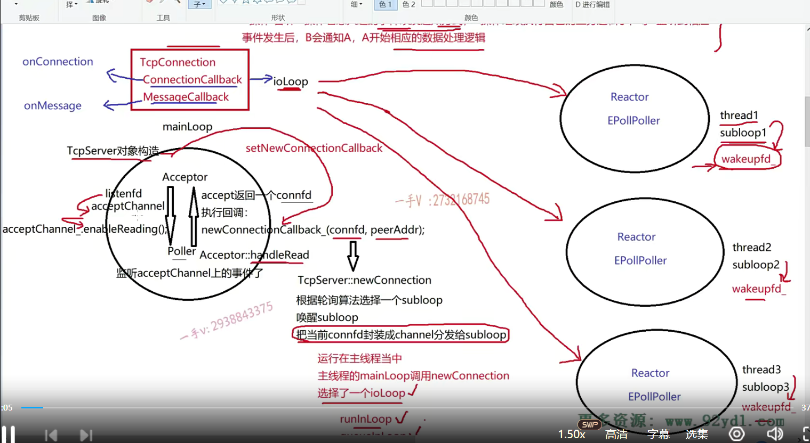

就是在TCP connection书写之前呢，就是把acceptor说完以后。

好，我们已经把这张图呢，大致的它的这个流程已经可以画出来了，对吧啊？

那么在这个main  loop根据这个轮询选择一个io loop，这是个指针，

指向了具体的通过轮询选择出来的一个sub loop。

选择出来了，以后呢？就要把从这个accept上读出来的这个connection fd打包成最终打包成这个connection是不是要注册到相应的这个sub poller上啊？

也就是说，在代码上呢，TCP server这个new connection的这个时候啊，

就会根据获取到的这个connection fd来封装TCP connection对象，

那也就是说tcp connection就意味着啊，是一条客户端跟服务器已经建立连接的客户端。

啊，就代表已建立连接的客户端的一条通信链路了，好吧啊。

那么，我们直接在代码上来看啊，来看一下它的实现的一些细节。

那么在这里边，我们先把这个类型的这个前置声明，我们也写了吧channel。class event loop.还有谁呢？还有class socket那必须的。

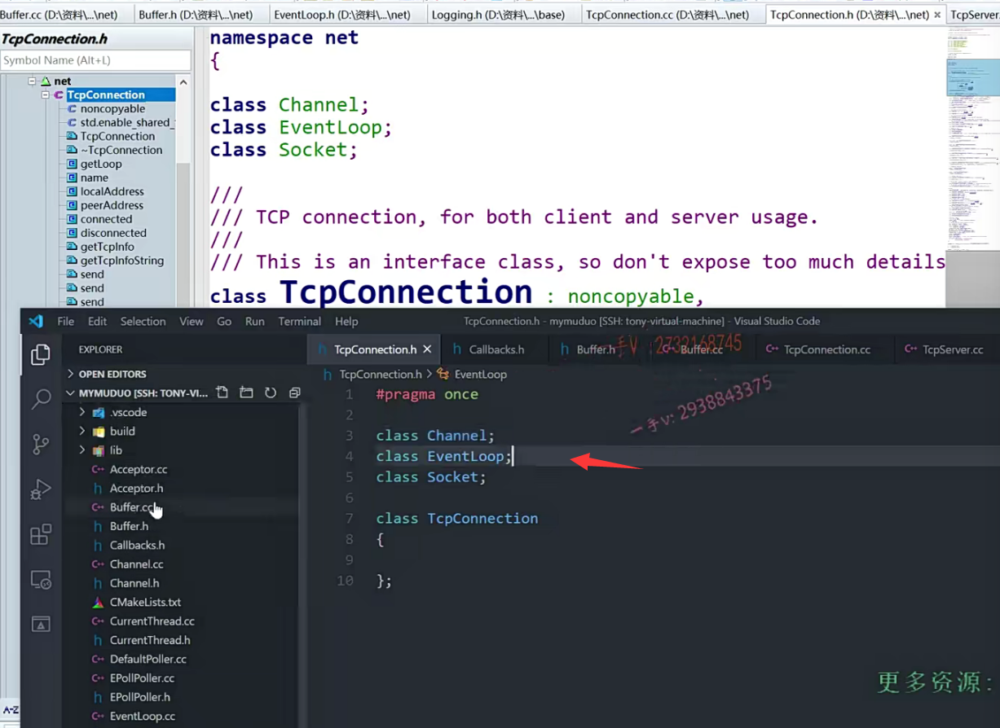

这connection表示，一条连接。

连接最重要的就是通讯用的这个socket了对吧？

而且连接最终给的是sub loop，所以它肯定得需要loop啊。

这个连接呢只是保存了一些就是客户端通信相关的所有的这个数据，但是呢，最终呢，我们epollpoller的这个事件分发器。

呃，就是这个loop里边的这个事件分发器上主要监听的还是一个channel。是不是

所以呢tcp connection的一部分数据，包括这个socket就打包成这个channel扔给这个poller了啊？

poller呢，在监听到channel上有事件发生以后呢，就会去回调channel上的是不是这些什么close callback error callback read call back read call back是吧？

这些call back都是谁给channel的呢？也都是channel从connection里边拿过来的。

OK吧，所以大家可以看到这个TCP connection里边有这些set connection call back，message call back，

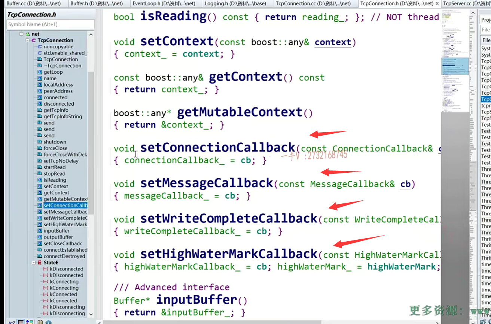

这就是用户给了TCP server， 

TCP server呢再给了这个TCP connection好吧啊

TCP connection最终把这些东西呢设置给谁，

设置给channel。

channel呢？就可以加入这个poller， 

poller见到channel有相关事件发生的话，哎channel呢，就可以调用相应的这个回调。好吧啊。

那么，在这里边儿，我给大家呢，先提出来这个，我们在写到相应的方法的时候，再给大家强调一下啊。

好，这里边呢，那得先包含这个谁了，noncopyable.h。

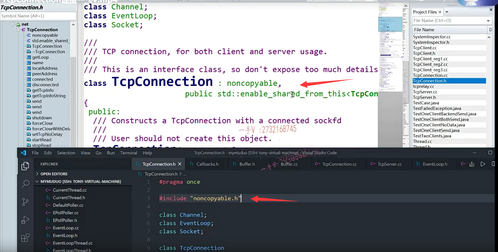

啊，还用到了enabled shared from this，这就是得到当前对象的一个智能指针啊，得到当前对象的一个智能指针。

注意，这个enable enable shared from this在这里边这个智能指针相关的这个理论呢啊，请大家参考我的这个博客啊。博客这篇文章的这个地址呢？

会附在我们的课件上啊，在这里边儿有关智能指针的这个基础知识我就不再赘述了啊，我们主要是来剖析muduo库的这个网络核心代码的。

那么，需要包含相应的这个memory文件啊。none copy able.

然后是公有继承。public.st den able.shared from this.TCP connection.public.private.

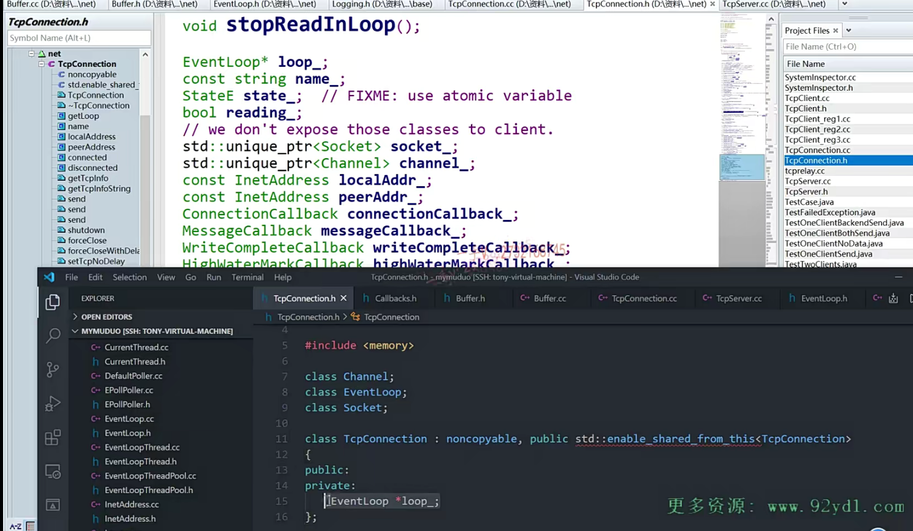

okay啊。先来看成员吧。

首先呢，它有一个什么呀？event loop，这个就不一定是谁了，这个就不一定是base loop了。

好吧啊，这里绝对不是base loop。也就是main loop，因为TCP connection都是给谁的，因为TCP connection.诶，这里边我按了这个insert了啊。

大家稍等一下。嗯。因为这个TCP connection。都是在sub loop里边管理的，所以呢TCP connection的这个loop啊，肯定指的是图上这里边的某个sub loop。

okay吧啊，这个main loop根据这个轮询算出来了。

好，接下来呢？是这个string啊，一个连接的名字啊。string那么我们写一下STD。这还是个const的啊。必须得初始化的name。

还有一个什么，还有一个state啊，use atomic variable。这个呢，是一个枚举本身表示这个连接的一个状态啊。那我们也写出来吧。

statee是吧？叫做k disconnected。disconnected已经断开了

k connecting connecting正在连接

k connect connected已经连接上了。

k disconnecting.disconnecting正在断开连接是吧？

就是已经断开连接，正在断开连接，正在连已连接啊。

那既然要用一个。在这里边，我们就得用atomic啦。因为它是。这里边儿注明fix me啊人，作者也说在这儿注释了，需要修改这里啊。

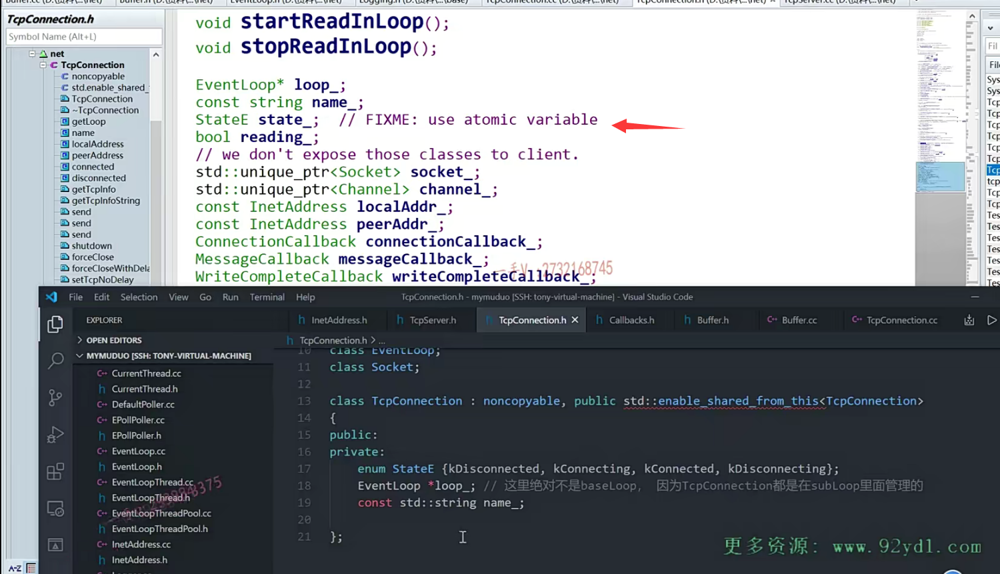

那肯定就意味着这里这个东西在多线程里边使用了嘛，是吧啊？atomic atomic什么枚举就是整形嘛？

atomic int。state，

然后再写什么布尔值啊reading reading。

好，还要写这个什么STD unique unique pdr。socket socket.

这connection肯定里边要有一个socket嘛，对吧？前置声明了。

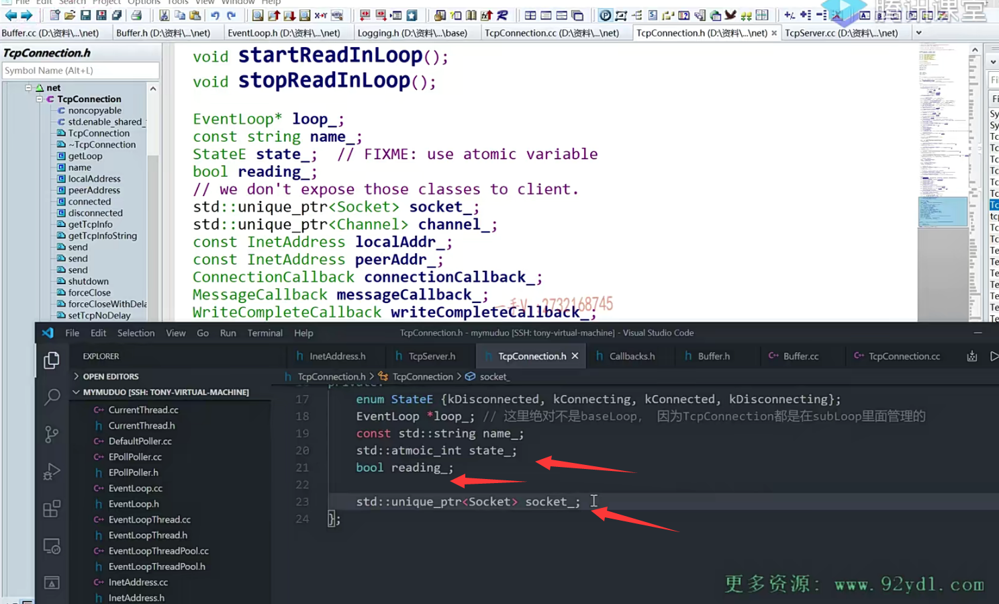

然后这个是STD。unique ptr.channel channel.

OK，这还有这个inet address，这里边定义了变量，

所以需要知道这个类型的大小，所以我们必须得包含这个类型inet address点h。

就是const inet address。我们为什么找不着它的类型呢啊？叫local addr

那就记录的是当前主机的啊。

这个就是peer对端的客户端的IP地址端口号啊。

这就得填这些回调了call backs啊。

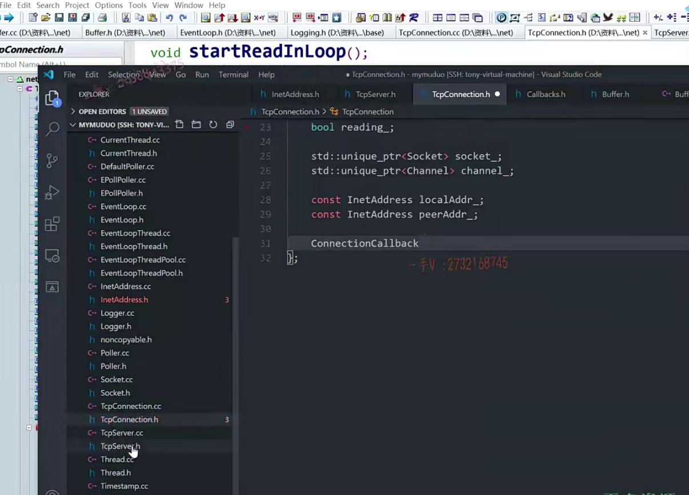

那么，各位，这是谁呀？connection.call back.这是不是那个TCP server里边也有一套啊？

因为是用户通过TCP server的接口设置的啊。

然后呢？TCP server呢？再扔给TCP connection 。

TCP connection，再扔给channel啊？

然后poller监听channel channel上有事件发生，就会调用相应的这个回调啊TCP server回调到TCP connection。 

TCP connection再到channel好。

这些回调，那我们就直接拷贝一下呗啊。拷贝一下，能够直接用。

大家看一下，我这直接用了啊，

你看connection call back connection call back message call back read complete callback。

它还有一个什么，还有一个高水位的，这个call back啊，

难道这些call back我们还没有写吗？去看一下啊，去看一下。

OK，到我的这个call backs里边来。

这都已经写了，就除了这个高水位的，这个没写啊。

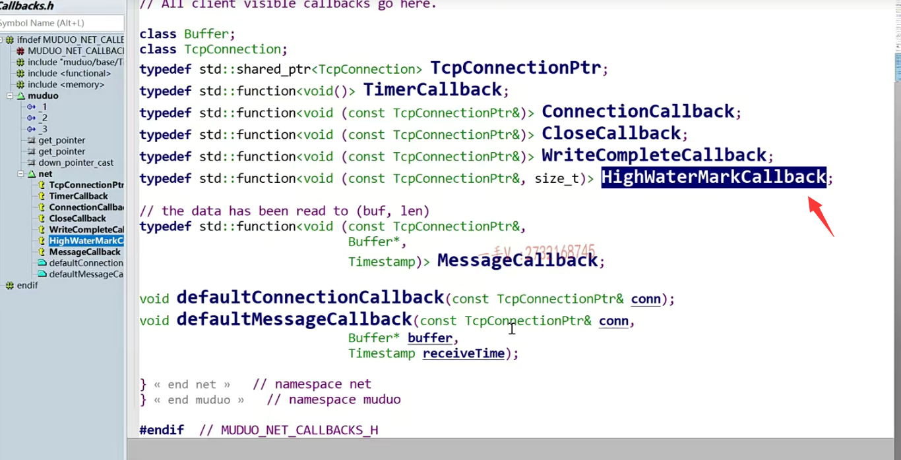

### 添加高水位处理回调函数

高水位在这里边表示的意思是什么意思呢？

就是说呢，你看水位线，水位线嘛，因为我们水位线你不能越过越过水位线就要出危险，就有问题了，水就洒了就没了。对不对啊？

我们水位就得控制在水位线以下，这样才安全。

对吧啊，那你说在这里边，我们这个发送数据的时候呢，它对端接收的慢，你发的很快。

那是不是数据就就被丢失掉了？就有可能出错了，对吧啊？

你这也不正确呀，这个接收方跟发送方这个两边的速率呢，要趋于一致。啊，趋于接近，才是一个良好的这个网络状况嘛，对吧？

数据发生异常的这个概率呢？也是非常小的，所以有一个水位控制啊。

这个水位控制，具体怎么控制？

那比如说到达水位线了，那你比如说可以暂停发送。是吧啊，

这些所谓的这个处理回调也是你可以自己设置的。

在这呢，我们添加一下这个水位回调啊。using谁呀？high.hi GG hi water.watermark.call back.水位线sdd。function.跟这一样啊，跟这一样，

跟这一样，无非就是多了一参数。多了哪个参数呢？size杠t啊好。

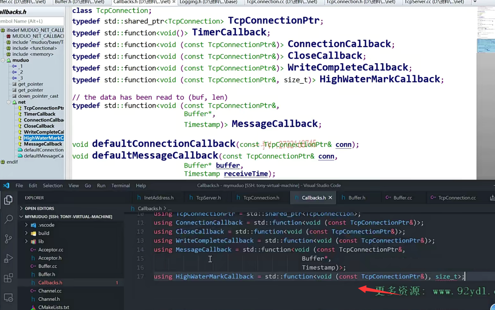

okay了，那这个我们就都有了是吧？

close call back也有了啊。回来。

啊，这个直接拿过来吧，太长了啊。不想写了close call back。

close call back.close call back，按它的这风格就是首单首字母小写啊close call back。

好吧，这是一个什么水位标志，high water wark。多少算水位嘛？是不是啊？数据量到多少算水位水位线？

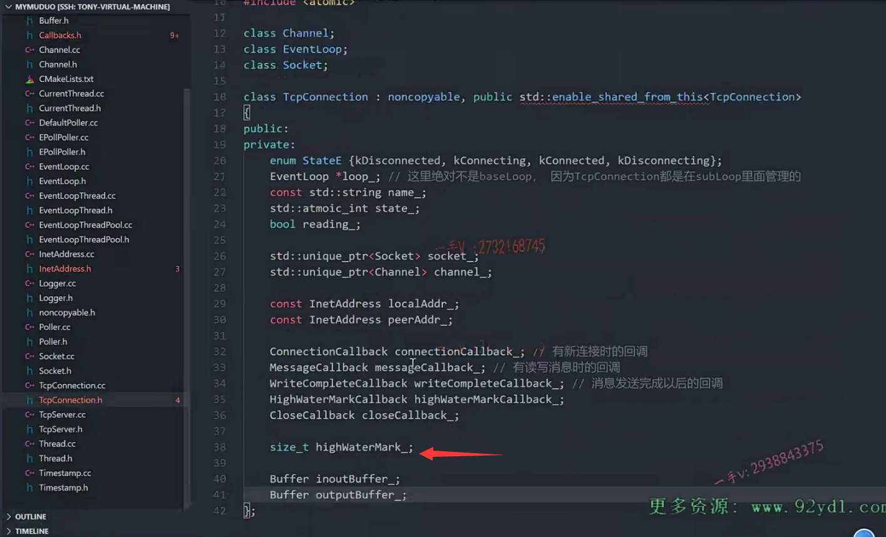

然后呢？就是buffer，那我们得包含buffer了，因为人家用buffer定义对象了，就得知道buffer类型得多大是不是？而不是说一个前置声明就能搞定的

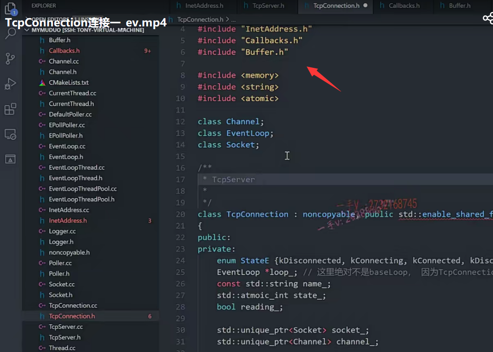

input。buffer。读的是吧？

output.buffer写的。完了啊，完了这个就完了。这个成员就完了。

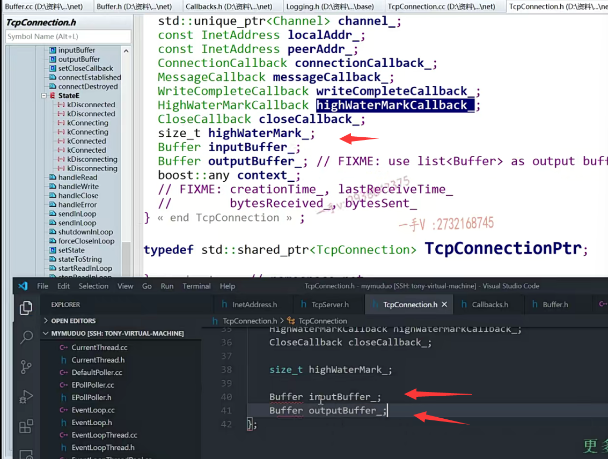

### 再说一遍流程TcpServer

好吧啊这个成员就完了，在这里边我给大家注释一下啊，注释一下。

TCP server.啊，通过呢谁呀acceptor。这个有一个新用户连接，通过accept，accept函数拿到谁呀？拿到CON nfd通讯用的fd。

然后呢？就可以打包谁了？打包TCP connection了。

okay吧啊，包括设置相应的这个回调。

OK吧啊，相应的回调，再把这个回调设置相应的channel。

channel呢？注册到这个poller上。

poller进入到事件以后呢，就会调用channel的回调操作。

好吧，这个流程要搞明白channel的，

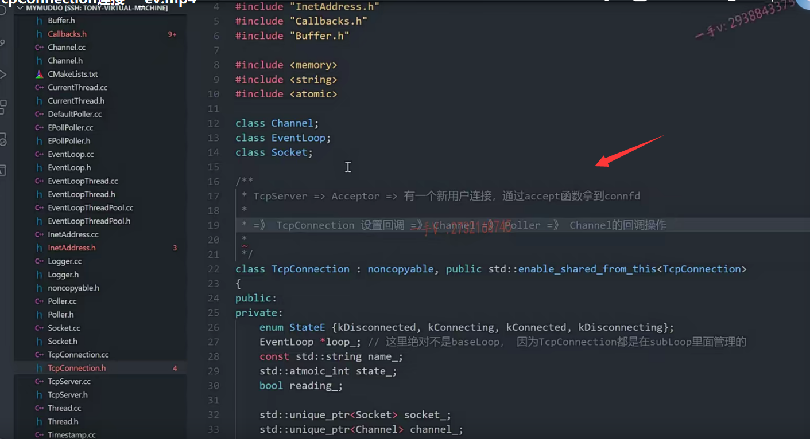

这个回调操作就在这里边handle event with guard。

这之前我们都说过了啊。再给大家在这里边强调一下。

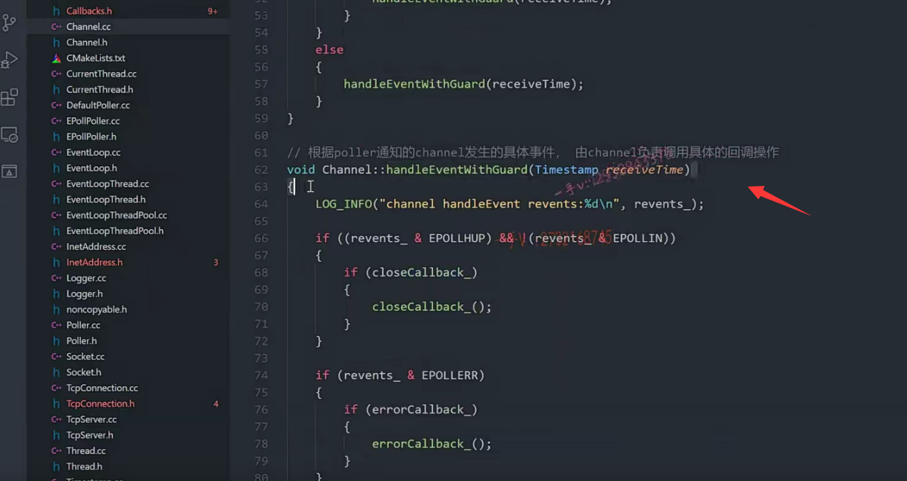

到现在为止，我们基本上把类型该说的就都说了啊，该说的这个类型就都说了。

这个我们到后边总结吧啊，先说人家TCP connection不要总是跑题啊。

这是成员变量，完了再说一下成员方法呗啊，成员方法必不可少的成员方法。

## 成员函数

### 构造函数

首先是它的构造函数。

大家来跟我看。是event。loop loop.再来。const.string.name.有没有包含词缀有？再有什么shock fd，那这你肯定是得TCP server给我们是吧？再是const inet address。local addr.再拷贝一份。再给我来个。

peer peer address.

### 析构函数

这是析构。

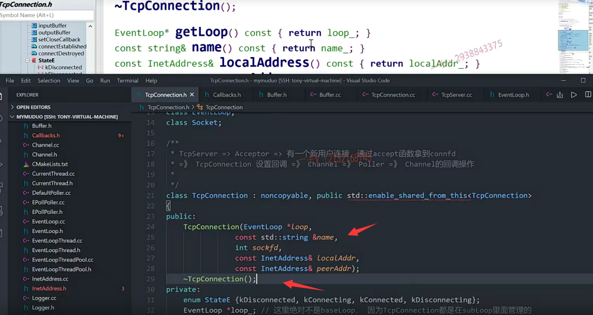

### 普通的获取一些参数的方法

event loop，这是人家来了一个get loop。就返回了这个TCP connection所在的这个事件，循环是哪个？

然后是const啊，这些东西呢，实际上都不一定能用到啊。

你事先不写也行，到用到的时候补上也可以，这些方法非常简单，我们就不强调它的什么意思了啊？那这两个呢，也非常简单吧。

count ress坚持手写一下啊，同学们不要总是。ctrl c ctrl v拷贝粘贴啊。

写一下再减少一下自己这个敲代码的，这个正确率啊。peer address写的时候呢，也注意一下细节。

就看别人的代码都能看懂，自己一写呢，到处都是错误，人家经常在公司里边形容我们新进公司的同学啊。写了三行代码，出了四个bug。这有点不可思议，对吧？

都是一些细节性的这个问题啊。

connected.cost return state.等于谁k connected。返回状态啊，是否是？

连接成功了，

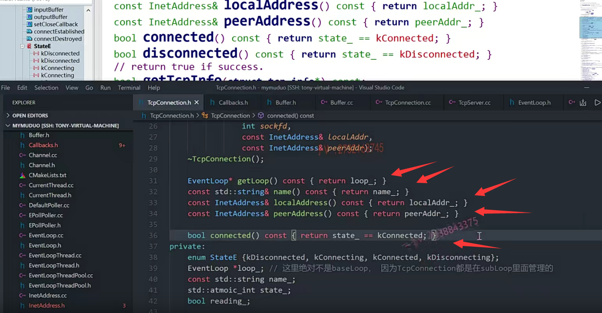

这个我们是不是在muduo库编程的时候，在on connection这个回调方法的时候，也经常调用啊来看它。连接是成功了还是失败了？

因为on connection方法，我们注册回调的时候呢，只要是跟连接相关的，是不是都会去回调on connection啊？

那连接成功还是失败？我们可以通过这个connected方法啊。去它怎么样？去获取相应的信息啊，

这disconnected这个我们就不写了，用到的时候再补啊。

### 发送数据，关闭连接方法

send这个好啊，这是。发送数据用的是吧？我们就这一个就行了，其他不需要。

shutdown也得有。shutdown是关闭谁的？我们也经常用。

这发送数据的是吧？这个是关闭连接啊，关闭当前连接。

客户端断开了，在服务端有一个TCP connection是描述客户端连接的，那服务端得把这个tcp connection对象给它处理掉不需要了是吧啊？不需要了。reading or not,start read,stop read.这些东西呢，应该我们。应该是都会用到啊，应该都是会用到。

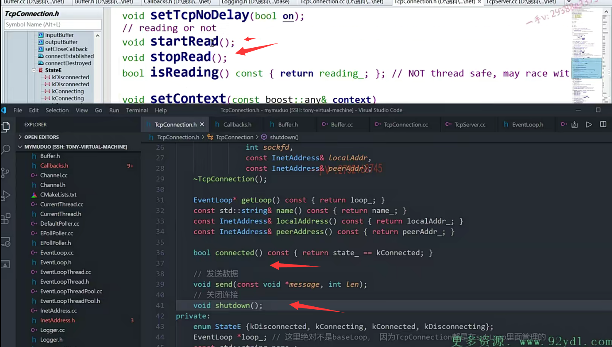

### 复制了一些回调函数

在这里边，我偷个懒吧。我在这呢，直接拷贝一下行不？

但是我建议大家呢，去自己写一下啊，比较泛滥，写的时候呢？再想一想啊。这些回调的这个赋值顺序是怎么样来的啊？

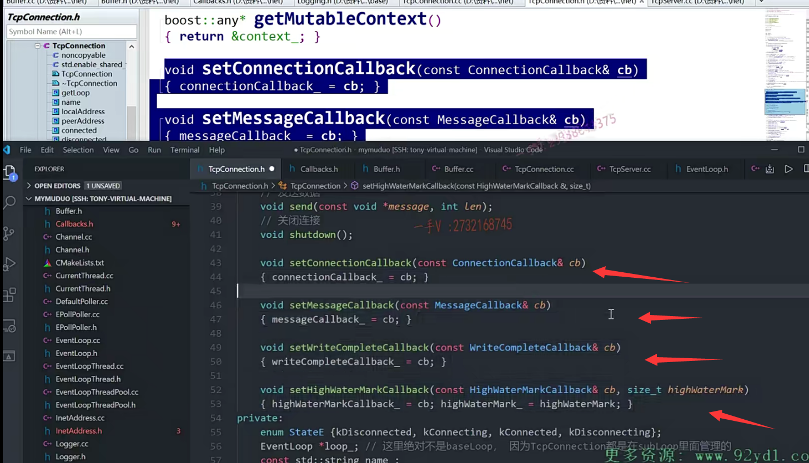

好像这些东西呢。像这些方法，我们用到的话，我们再补吧啊，我们再补吧。

这是比较重要的。

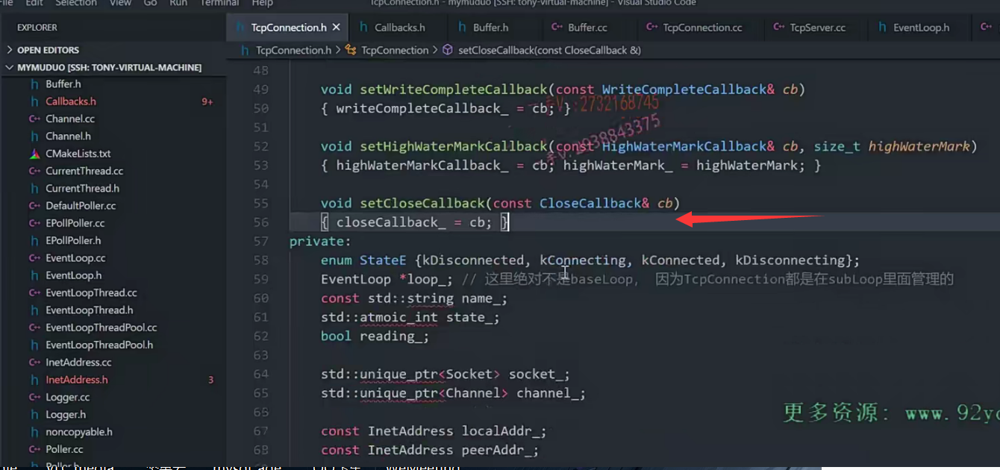

### 连接建立，连接销毁函数

connect什么estab。li shed.建立连接了okc TD est。royed.建立action established。连接建立了是吧？连接销毁。

okay.还有timestamp，我们也得包含相应的这个头文件。times tab点h。

那这四个我们必须。必须有啊。是不是诶？这四个我们是必须有的。

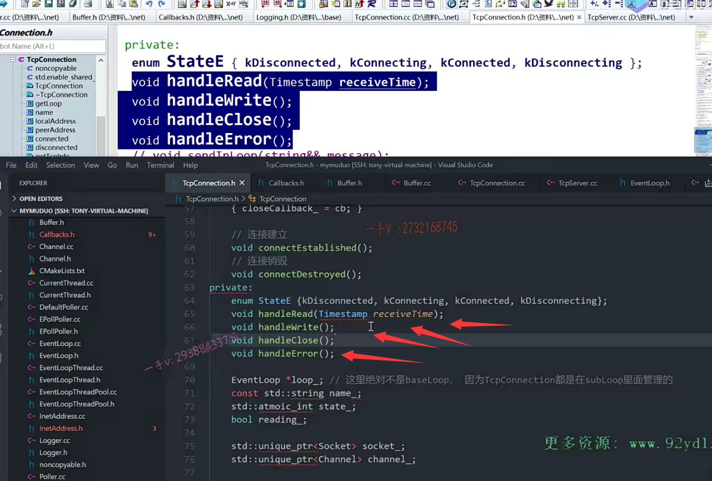

sendinloop send in loop我们要这一个就行了啊，我们不需要那么多。

这个方法就是通用的嘛void星嘛，是吧？

shutdowninloop这些东西。呃，下边这些方法我们有用到的话，我们再去添加吧。好吧啊。

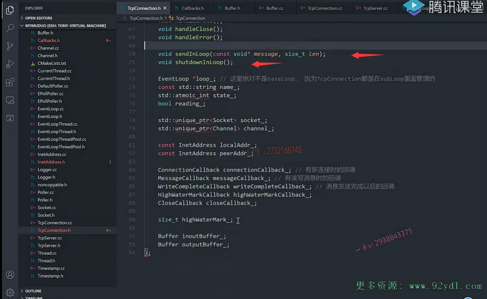

好，这是把TCP connection相应的，这个成员我们先输出了一下啊，

它里边儿就是包含了。

回调是一组嘛，对吧？回调一组。这高水位跟这回调要放一块儿了啊。

回调是一组。

数据的缓冲区是一组。

然后就是socket channel。

对吧啊，所给的channel

你看这就是跟谁很像啊，这里边就是这里和这个acceptor类似啊，

因为acceptor是他是在谁里边呢？它是在这个main loop里边了吗？对不对？

而TCP connection是在谁里边的？是在这个sub loop里边的。

他们都需要去封装，把底层的socket，这是listen fd，这是connect fd封装成channel呢。

在相应loop的这个poller里边儿，是不是去监听事件了？啊，

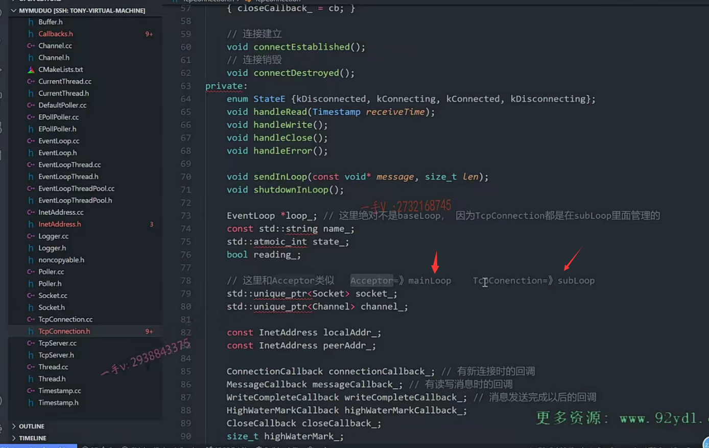

我们之前呢accept or已经写过嘛，你看这个set这个read back。是不是呃，

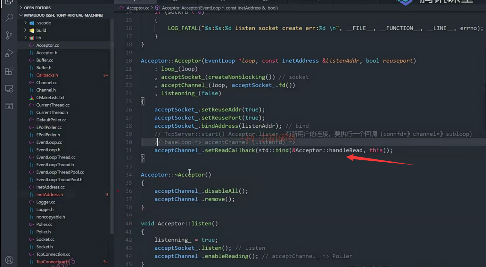

跟这个channel，

而我们马上也要写TCP connection相应的方法，你看跟acceptor很相似啊，很相似的描述不同角色。

acceptor就是来描述这个在主loop里边那个监听新用户连接的啊，

connection是以连接用户的读写事件。

好，这节课我们还有时间，我们就继续写吧。TCP connection点h。来把它的这个构造函数呢？

先构造跟析构，我们先实现一下。

在这里边，我们得必须得包含什么了log了，这是肯定的，因为这是属于一个大类啊。出的问题比较多，所以我们一定要怎么样啊？要把这个日志要加上。

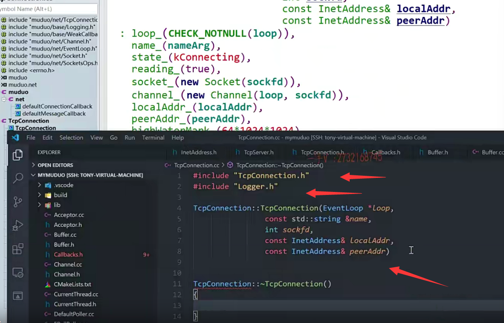

## 构造函数实现

来我们看一下啊。看一下这个tcp connection。

TCP connection同样的一上来先干什么？

这个是给loop是不是赋值啊？

### 给loop赋值，但是需要先定义一个静态的检查函数，静态是为了防止重名

那这checkloopnotnull这是不是跟当时的这个谁里边一样TCP server里边一样？

然后把这个人拿过来呗，是吧？呃，这写个什么？这写个静态的吧。

要不写静态的话，到时候编译的时候会定义这个名字冲突啊，我们经常会做这样的事情。check loop not什么，not none。loop，

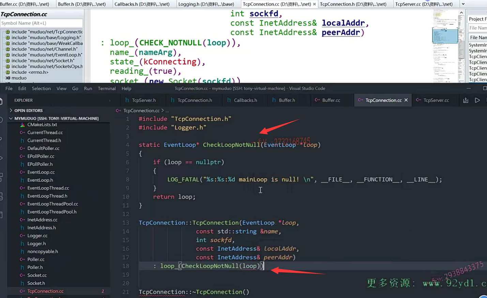

okay吧。

### 改下这个静态函数中的日志

这个TCP connection loop is none.改一改这里边的这个日志。

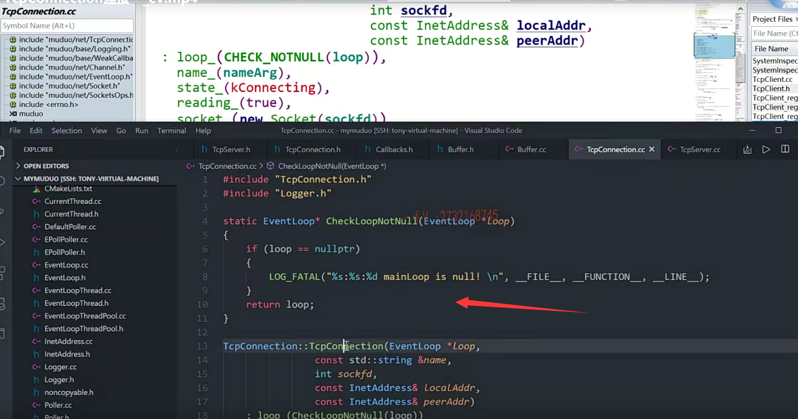

第二个是什么参数啊name？

name arg哎呦。这里边好像没有发现有name arg啊哦，这是给这个第二个参数写了一个name arg对吧？好了arg。

第三个参数是什么参数呢？是一个state。ste.connecting

哦，这是给了一个正在连接初始的状态，对吧？

然后是这个reading。true，

然后是socket。这个应该不陌生吧。socket.

那在这里边呢，那就得包含相应的头文件了。是谁？呃，是socket。socket socket点h对吧？然后还有谁呀？channel点h。还有谁来着？eventloop点h对吧？

这个应该要用到的啊，应该要用到的。用不到我们再加吧啊，一上来加一堆头文件，头文件在CC家里边编译时要在原文件中展开的。

很浪费编译的时间，大家现在可能写的程序都比较少，公司级的这个百万行级的项目一编都编半个小时乘小时来计算的啊，一个小时几个小时。

像安卓的这个源代码呢？整个的源代码一编译啊。得花两个小时，这还得借助分布式编译。好几台电脑共同来编译啊哈，所以呢，节约编译时间也是非常有必要的啊。

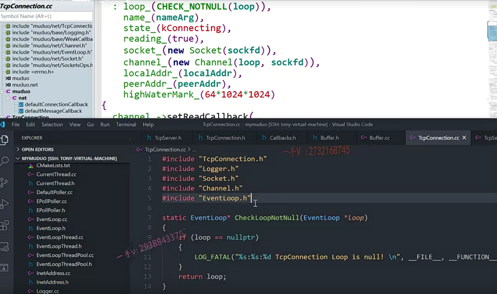

sock fts ockft没问题啊。看一下怎么了？啊，

好了没反应过来。

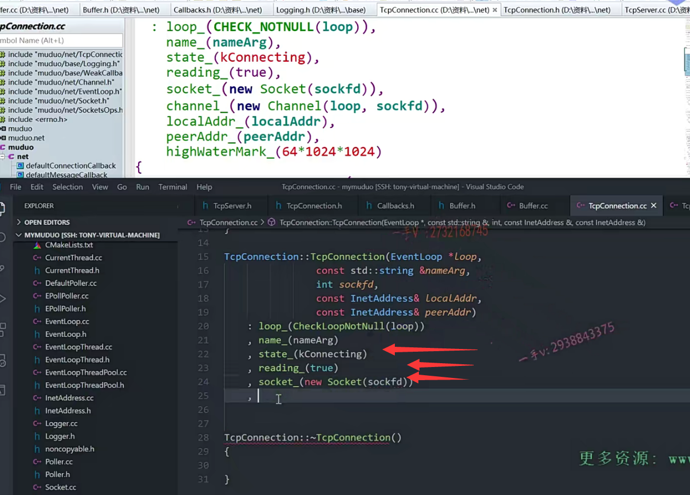

channel是new channel。给了loop，给了sock。fd.

好吧啊，channel本身就是对于这个socket fd以及他感兴趣事件的一个封装啊。

然后是local addr给的是local addr，

然后是peer addr。给的是per addr。

好了，然后再给了一个什么？高水位的这个水位线。是个64，

64是吧？乘以幺零二四，64k再来一个幺零二四，64M。64M，

==那就是超过64M就到水位线了。==

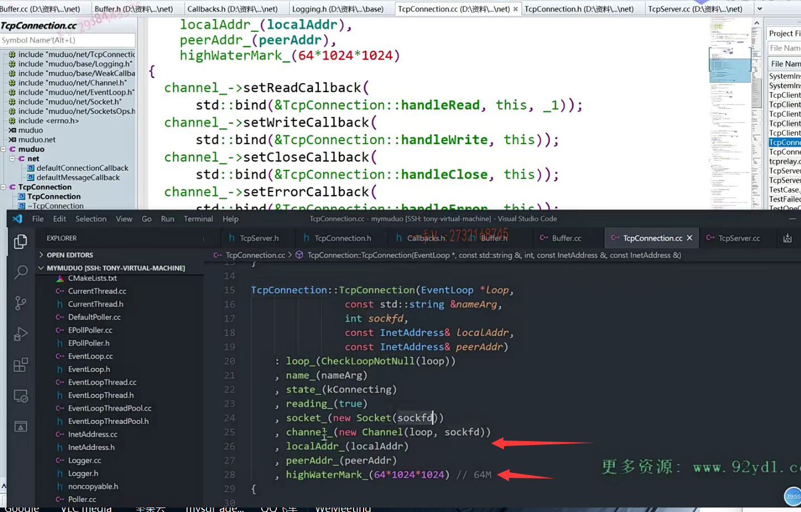

### channel的回调函数   回顾

你看你要做一些什么样的回调操作，比如说停止发送，对吧啊？

好，大家看。就是把TCP connection里边的socket封装的一个channel，

是不是又设置一堆的什么set read call back，read callback close，callback error，callback。

就是为了到时候呢。poller通知channel发生相应的事件以后呢？channel是不是能够执行它之前在TCP connection里边预制的这些回调啊？

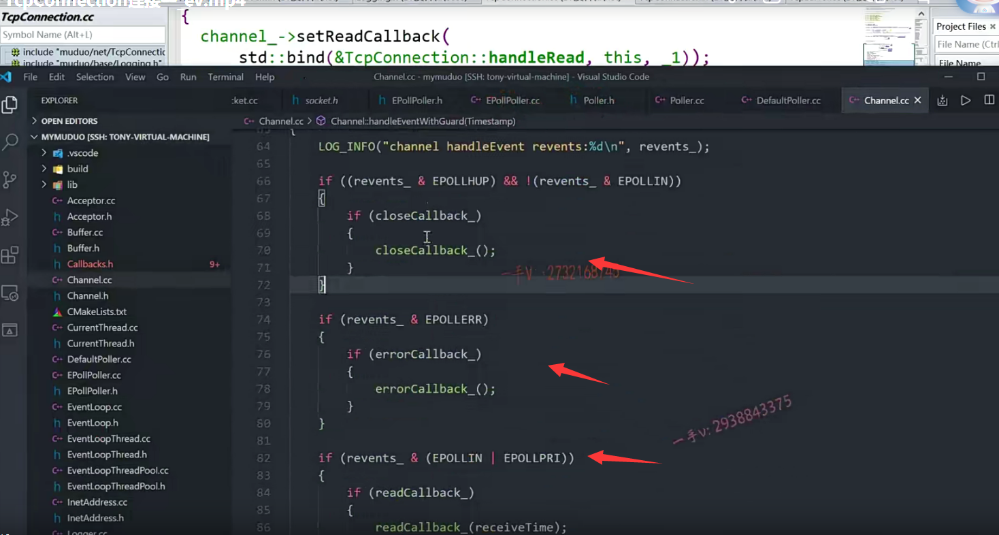

### acceptor回调函数回顾

acceptor之前也设置了，但是accept or这里边只关心了一个read call back，

就是他只关心新用户连接拿到新用户连接通信用的这个connection fd就可以了，

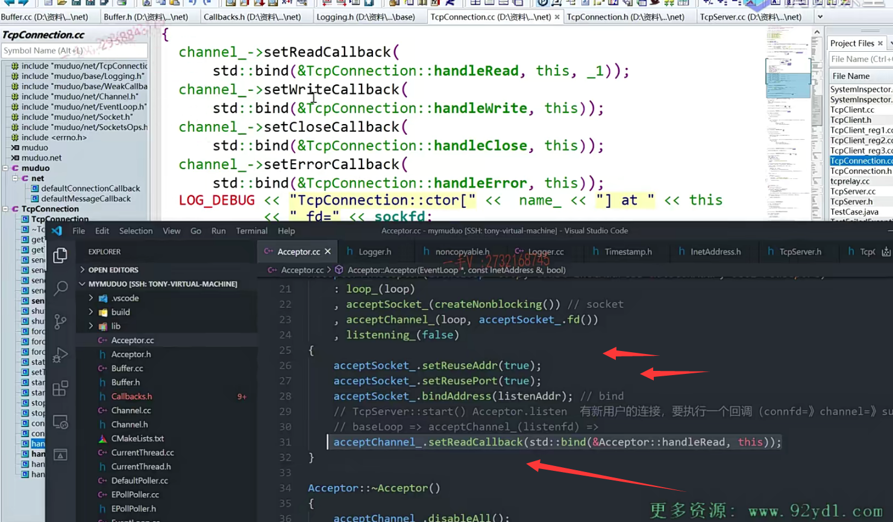

### TCP connection的回调函数

而在这里边。

已连接用户在这里边儿所感兴趣事件都就比比较全面了，

有读事件，写事件。这个关闭connection的事件，还有一些出错的，这个事件回调都有

accept channel，你之前是不是只注册了一个read call back呀？

在这注意对比一下啊。

好，我们把这个写写了呗。

那在这里边channel。先set read call back。要办的还得包含呢谁呀？functional函数对象绑定器啊。就是STD。办的办的谁呢？办的这个TCP connection里边哪个方法啊？hand read。是吧this。stb.参数占位符。

please holders.一个参数。

然后再是channel。set right call back.s kd.办的谁呀？TCP connection。里边的handle，right？this没有参数。channel said close call back.STD.band.TCP connection.这应该是handle clothes。

this这些方法呢？这些TCP connection的这些方法。

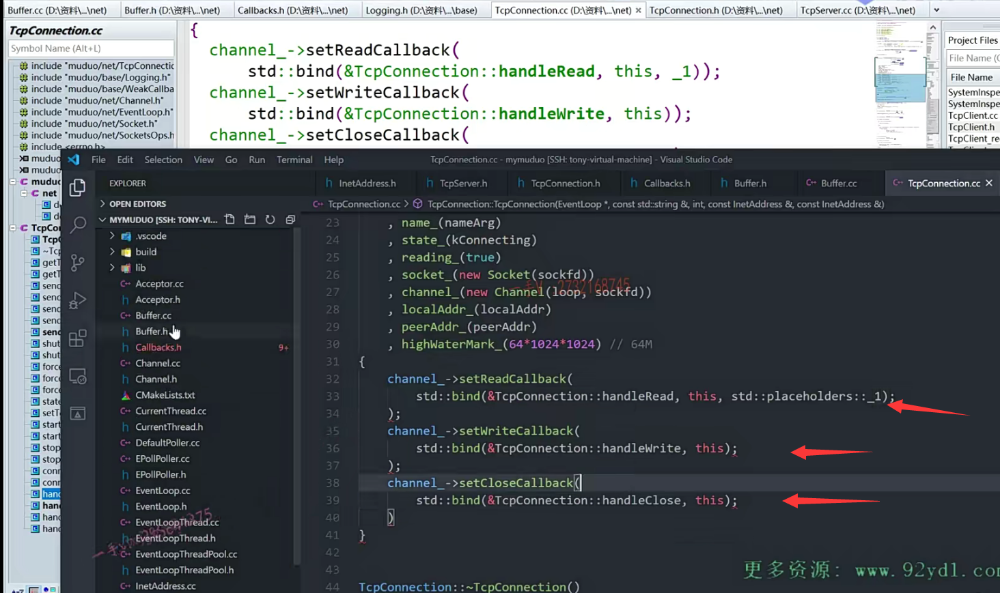

记住，就是到时候呢，poller通知channel的时候调用的这些回调好吧。

应该能，这里边应该能明白吧啊，

我们有一些同学呢，基础有点差啊，想问题总是比较慢，希望你把这些我强调的都好好的去想一想，好好的去想一想啊。哦，

这些地方呢，不需要再加什么了。不需要再加分号了，这是参数对吧？channel在SAT哎呦。啊，上面没有分号。英文分号不要打成中文的了

set error callback的时候。这就是STD。band TCP connection.叫做handle error。this 

okay.然后它加了一个debug啊。log.我们加个in分吧，

需要这个输出的啊。

TCP connection，它是输出了啥？它输入了一个ct or。name百分之s位。对吧at。fd等于百分之d。

那么在这里边，我们分别给这个name。啊点c杠STR。还有这个sock fd。是不是啊？用这个格式化字符串打印这个。可视化。字符串还是很方便的啊

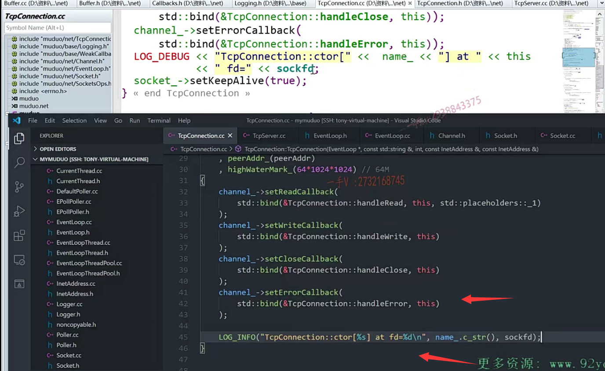

比这个这个C++方便点，C++的这种格式组装还是比较复杂的。

没有这个c风格的，这个方便。

socket所以没有绝对好的东西。c跟C++可以混合编程啊，可以混合编程利用各自的优点。

set keeplive，这就是启动了这个TCP socket的这个保护机制啊，保护机制。

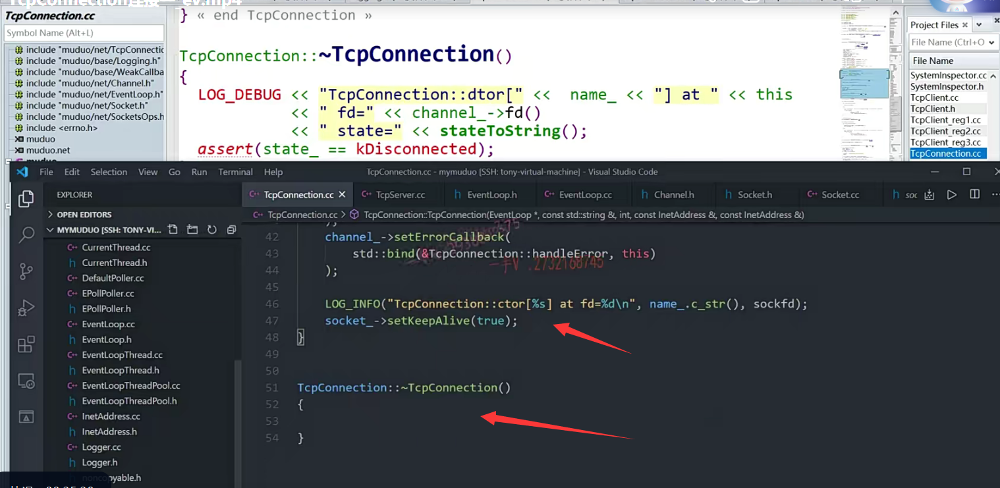

好，下面给channel啊，设置相应的回调函数，poller监听到给channel通知感兴趣的事件发生了，channel会回调相应的什么？操作函数的好吧啊，会回调相应的操作函数的。

这就是它的这个构造函数。

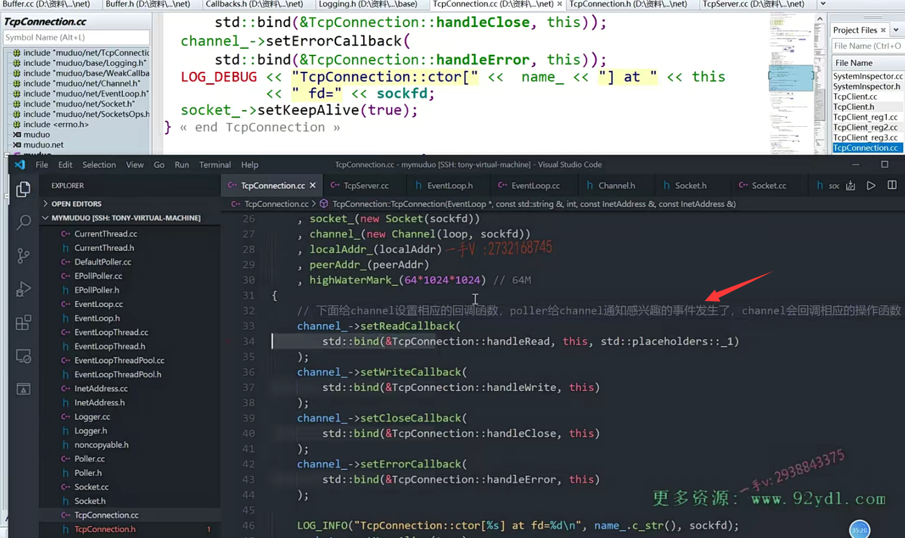

我们实现完了再来看一下这个析构。

因为TCP connection，这里边儿没有自己开辟任用这个其他什么资源，包括这两个new出来都是通过智能指针来管理的。他也不用自己手动释放，

对吧？所以析构函数这里边没做什么事情啊，只是做了一个断言断言，

我们就不管了，然后做了一个打印啊。

啊，我们打印一下吧啊，muduo库打印了。

这个叫TCP connection。杠dt or。中括号百分之s。at fd等于百分之d。然后state等于。c等于那我们也就是直接写个百分之d吧。好吧，

在这呢，就是name点c杠STR。

第二个还是。channel指向了fd。

第三个参数是state是吧啊state？直接打印一下state就行了。

好，那在这里边百百分之s，这个是百分之d百分之d。

都没啥问题啊。这枚举应该是让想让我们转成整形。

不管这个红色波浪线具体是什么问题，到时候我们看代码。编译编译出来有什么问题我们再改。

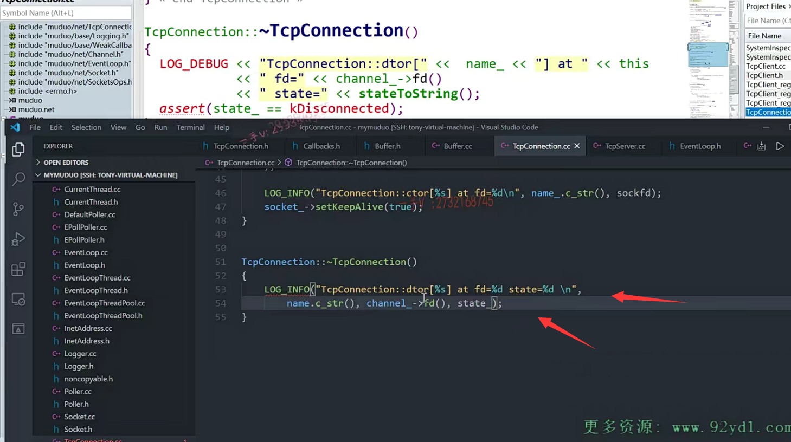

这是构造跟析构。

好，我们就先说到这儿，后来大家呢，也跟我一块把这个TCP connection的这个成员输出一下，把它的构造析构，这节课我们先给它。搞定好吧啊行，那这节课的内容我们就先说到这里啊。