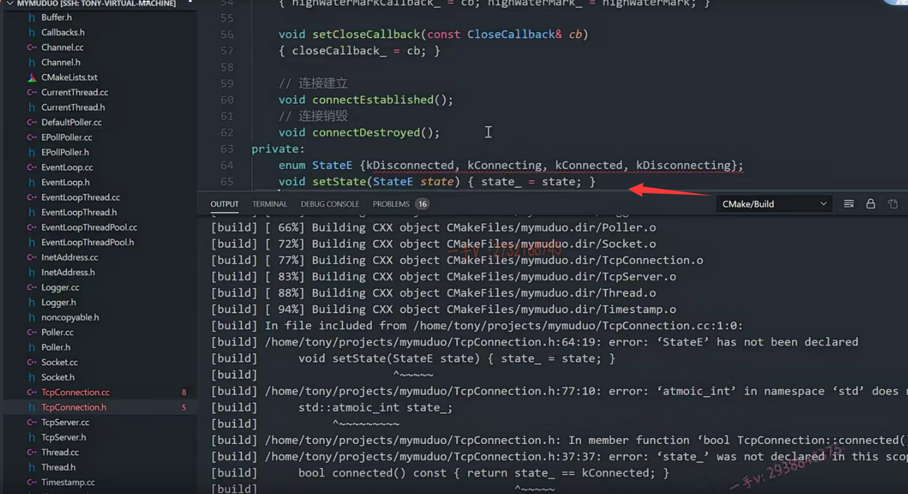

这节课呢，我们来继续说TCP connection。

上节课我们把TCP connection的这个构造函数啊，

对于channel的这个绑定的这个读事件处理，写事件处理close事件处理以及错误事件处理的这个回调都绑定，

那我们这节课先来把这几个函数呢，先处理一下。

这几个函数我们声明都声明过了啊。

我在这里边声明减过来。

然后开始定义前面加上类的作用域。

## handleread()

先来看这个handle read，

handle read就是channel上的这个fd事件啊

fd有数据可读，那你就读呗。

那在这里边还用到了这个errno啊。

应该是要用到，所以先包含一下系统的这个头文件errno.h。

handle read.int saved err，no=0，先等于0 ss size。

sizes杠tn等于什么？等于inputbuffer。

为什么我的input buffer呢？看不着。后。input啊，put。output buffer对吧？

把这两个文件放一块。好切换。

input buffer点read fd这个我们之前写了，

它第一个是channel。它就是这个fd。是不是啊？

这个fd其实多了啊，不一定是channel fd，因为它放都是一样，你也可以socket拿出socket是不是fd啊？它都是一样的。

对不对？因为他给的时候呢，你看socket也是这个fd channel是不是也是这个fd啊？

就灵活一点啊，灵活一点。save air number.好吧，

if n大于零，这也就表示呢，

有数据了是吧？唉，有数据了，有数据的话在这里边。

say message call back.这也相当于就是。以建立连接的用户有可读。可读事件发生了。调用用户传入的这个回调操作。

就是大家经常用的这个on message嘛。对吧啊，

大家经常用的这个onmessage call back。

第一个是STD。share的。from.this share from this什么意思？就是获取了当前TCP connection对象的一个智能指针。okay吧，

第二个是什么？input.buffer，

第三个是什么？rece I receive time.还记得没on message，你不不就三个方法吗？哪三个？

那不就是三个参数嘛，哪三个参数呢？第一个是connection ptr是不是connection的这个智能指针啊？

对，第二就是buffer。buffer儿星

第三个就是一个时间的一个表示。是不是参数都已经给你串进来了？唉，都串进来了。

如果在这里边呢？else if n等于谁？n=0。n=0表示的意思呢，在这里边就表示什么？

呃，相当于客户端断开了，那这里边就处理谁呀handle close？

再else。那接下来呢？是不是就是有的出错了？

出错在这里边，人家做的是errno等于saved number.

然后在这里边打了一个log error。

是不是表示一个TCP connection handle read出现了一个error，它error了。

然后再handle error执行一下handle error回调，

所以就是在有事件可读的话呢，

在这里边主要就是正常数据读取正常。利用应用层事先注册的这个消息回调，对吧？

把相应的这个当前connection。我把connection给它的原因是它还需要从connection是不是去给我发送数据呀？

对，这里边还有这个数据到底是什么？对吧啊？它可以调用这个buffer的retrieve OS string。来获取呢muduo库给它读取的数据是不是这是读取数据的这个时间点？

这个就是handle read方法就完了。

## handlewrite()

再来看这个handlewrite？

handle write 

channel.这里边有一个is writing，对吧？就是是否可写啊？是否可写判断了一下？

size杠tn等于你看在这里边，我就是说呢，它不好的地方。

这里边又用到了这个裸的这个write，然后把output buffer啊。通过在这里边儿获取output buffer的一些细节的东西去write，

实际上在这里边儿我们可以直接怎么样啊？

直接调用output buffer的这个writefd。这多好呢。

是不是跟这个read fd一样，我们都封装一下？

okay吧啊，我们都封装一下。

### 封装writefd()

封装一下。

就是把所有的这个fd的读写呢，都给了这个output buffer。

这样一来呢，output buffer的这个细节怎么写？

是不是就不需要在这个TCP connection里边暴露了全部封装在output buffer本身里边啊？

往哪个里边写呢？channel。fd.就这一个参数就完了。

### buffer.h定义

好吧，那我们直接去补上吧啊，补上来给buffer补上。补上，

在这里边。先补上这个write？

通过fd发送数据啊，可为。ss，杠t。write fd.in tfd.啊，

应该还有第二个参数，对吧？还有第二个参数啊。

### buffer.cc实现

好，我们把这个方法呢实现一下。这应该也是比较简单的啊。

因为怎么实现人家代码上已经给出来了，

只不过我们把它又进行了一次封装而已。

n等于谁呀？等于这个write 

write.第一个是谁？第一个就是这fd。

第二个是谁呢？第二个就是这个peak。

对吧，第三个是。这个readable bytes

就完了，这是它底层的细节嘛，对不对啊？

我们为什么需要知道呢嘛？

这就是出错了。跟这都一样。是吧啊，如果这里边发送成功的话呢，那就在这里边把这个。n怎么样啊？n给它去返回回去。好不好啊？

这是大于零。啊，这小于零就是出错啊。

还有就是如果是小于等于零的话，这都怎么样了？都表示一个error了，

对吧？我们在这里边儿查一查吧，查一查它等于零的时候是个什么情况呢？返回值啊，看看write？return value.our success number of bytes written is returned zero ins。nothing was written

用zero的话表示。没有写任何东西是吧啊，

没有写任何东西。小于等于零的时候啊。

呃，这个小于零表示错误好吧，大于等于零，我们就都返回了，因为在外边人家判断了大于零跟等于零的情况。

OK，那我们在这里边把write fd封装在buffer里边，就这样写就可以了。好了吧啊。

这应该要包含write的这个头文件啊，叫做unh TD点h。

再回到我们的TCP connection里边。那这样就是不是就感觉非常良好啊？

啊，细节都封装在这个output buffer里边了啊。

然后呢n大于零表示有数据发送成功。

output buffer点retrieve。tr retrieve retrieve n.那相当于这个n个数据呢，已经处理过了嘛？是不是啊？处理过了。

然后呢f output buffer点readable bytes。等于零，那这就表示已经发送完成了。是不是发送完成了？唉，就发送完成了。

如果不等于零，那就表示这一轮还没有发送完成嘛，那继续发送嘛。

对吧？disable writing。就不可写了，从可写变成不可写了，

因为你可写的时候把数据已经写完了啊。

然后在这呢，你看。

如果你有这样的一个回调诶，人家现在就给你怎么样啊？

人家现在就给你执行这个回调。

### 为什么在这里边是一个queueinloop

==为什么在这里边是一个？queueinloop呢，==

各位。能不能回答一下？

call back，然后是什么呀？然后还是share from this。shield.from this.okay.

那么在这里边，我们就把相应的呃这个event loop我们得包含它头文件了，你看调用这个event loop。对象相应的方法了是吧？event loop点h。

这个我们前边啊，已经见过好多了。

runinloop queueinloop不对吧？

来告诉我。这里边儿这句话为什么要用 queueinloop？

这个 queueinloop我们之前讲了。就是唤醒这个loop对应的thread线程执行是不是回调啊？每一个loop，它的成员都有一个wake up fd嘛？

### 思考

实际上，我认为啊，在这里边儿。大家也可以思考一下啊。

TCP connection就是属于某一个这个sub loop。

一个sub loop代表的就是一个线程嘛，对吧啊？

那它能够被通知，能够调用到TCP connection上的这个handle read，

==肯定是它所属的那个线程poller呢，给他通知相应的事件，让他去调用，==

==所以我认为在这里边直接应该是这个loop==

肯定在这里边执行这个方法的时候，肯定是在TCP connection所在的什么所在的这个线程？对不对啊？你不在这个线程中，那这个线程对应的loop也不可能监听，也不可能给你去通知读写事件嘛，对吧啊？

所以但是这里边这样写也是没错的。也是没错的，

==大家能够知道在这里边。我提出的这个问题就可以了，好吧啊？==

呃OK，那在这里边就是执行这个回调嘛，执行就就跟我们上边的。这个地方回调一样，

你在这里边用queueinloop也是一样，也是一样。

这loop就是在当前的这个线程就直接执行这个回调了是吧啊？

那么，如果这里边还有一个分支条件要处理，

如果当前的这个state是个kdisconnecting就是正在关闭。是不是啊？

正在关闭。你这里边呢？就是读完数据了，我这里边TCP connection的这个状态呢，是disconnecting。

可能此时呢，客户端怎么样？客户端断开了，或者我服务器呢，调用了啥？调用了这个shutdown了是吧啊？那在这里边呢？直接调用shutdowninloop吧。OK吧，

关闭这个，shutdowninloop就是在当前所属的loop里边呢，把这个TCP connection给它删除掉。

好，继续来看这个f。

这个我在这里边，我们执行一个日志吧啊error。TCP connection handle,write?好吧啊。那OK，那这个handle write，我们也就写完了。

啊，就是这样一个逻辑，就是写数据嘛，写完了以后如果用户定制了数据发送完成的这个回调，调用一下啊。okay吧啊，调用一下。

好，那接着呢，我们就是。

诶，它还在这里边还有啊？还有就是最外层的这个，这个if就是可读才读读数据呢。

这表示什么？这表示要执行这个handle write呢，但是channel呢，却并不是可写的对吧啊，并不是可写，这也属于一种异常处理。

在这里边呢。就是log error吧。这个表示呢connection。

tc p connection.fd等于百分之d。所以is什么down？no more.ting.不再发送数据了啊channel。小的这个fd。

因为对于channel来说，你对于channel，我们看看有没有给channel提供过相应的方法呢？

因为在这里边儿，你会实时的去更新这个channel的这个底层fd的这个感兴趣的这个事件呢？是不是啊？

如果在这里边。你已经对它的这个。就是写事件啊，就是在上一轮儿监听之后呢，你在channel上已经设置了，对于这个写事件不感兴趣的话呢，那如果再通知的话，在这儿。就会打印这样的一个错误日志好吧。

handle close的话呢？这里边也都做了一些什么，做了一些。

断言日志的这么一个打印啊。

咱们把日志打印先写一下吧login fo。打日志只有好处没坏处啊。

但是日志打印的要合理呢。百分之d。channel指向的fd。state handle close.

只有在已连接或者是正在断开的这个状态。才能够去close，对吧？

set state.sed.key disconnected.这个方法我们还没写呢，

是吧？写一下，加上啊。

void set state.这里边是。一个state e。state.好了，

然后这就是channel。they save all那就是。

对所有的事件channel所有的事件都不感兴趣了。对吧，把它从这个pollerr上所有的事件通过epoll control全部删掉啊。

这有个TCP connection ptr。看一下，

看一下这里边做了什么事情，大家来看。

这是相当于连接要断开了嘛，

连接断开首先呢，你要回调一下什么通知一下用户的on connection，因为因为用户注册的on connection主要就是连接成功。

连接建立跟连接断开都会响应的。

另外一个就是什么，另外一个就是close call back人家用户专门这个注册了。这个连接关闭的这个事件回调是吧啊，

我们一般都是注册on connection跟on message就可以了。

on close跟on error都比较少啊，除非你要做一些工业级的项目，那这些事件你都得必须处理的详细啊。

我们平时写的。on connection跟on message足够了啊，足够了。这就写一个当前这个CON nptr就行了啊。

STD.shared.from this.connection.call back.这个conn。ptr.还有什么？还有close call back在这里边CON nptr。

看到作者在这儿写，就有点儿稍微啊，稍微有一点儿不太讲究了啊。

==因为它之间之前调用这些回调的时候都会判断这个回调啊是否注册过是吧啊，是否有效？这边没判断，就直接调用了。==

这个我不再做做哎，做一下吧啊。执行连接关闭的回调。这关闭连接的回调啊。那关键是这个关闭连接的回调，他专门去注册了一个回调是吧？

实际上这个连接关闭的回调呢？在这。是不是也可以啊？也可以去处理啊，也可以去处理。

然后最后呢，就是一个handle什么最后一个就是handle error啊handle error。

首先呢？get socket error啊，它通过系统调用。

看一下。我们把这个方法就直接写到这了啊。

这是get sock opt。那我们在写socket的时候呢，相关的头文件。应该是都要用上了。

因为我们要把这些东西都直接写在谁里边啊？直接写在TCP connection里边啊。

大家来看into PT value。

然后是so CK len杠t是吧？opt len。等于size of opt y6。

然后在这里边直接调用get sock opt。

这个是channel指向的，这个fd是吧？

然后呢sol socket.so error.opt y6。opt len.

如果返回值小于零代表出错。

唉，这就不返回，我们直接打印吧啊。我们就直接打印了。

这个相当于就是。in terror啊，in terror。刚开始等于零。

这err就等于er no。否则的话，err=opt。是不是这个value啊？

最后呢，我们用一个log error打印一下啊。

这是TCP connection handle error。都加了。函数名在这，我们也加一下吧啊。handle error什么呢？它的这个。name百分之s。so.杠error。百分之d。一个是name杠点c杠STR。一个就是err。

好了，那么这里边的这个错误日志，我们也就打印了啊。

我们把这个代码编译一下吧。有编译错误还不少，来一个一个解决吧。

## 解决编译错误

### 参数没写到参数列表中

call backs点h第17行。怎么了？wrong number of template arguments？哦，这写错了是吧？

得在这儿呢。写得写到参数列表里边嘛，是不是啊？

这个我们写不对，重新再编一下。

### 枚举类型是私有的，所以方法只能定义在枚举类型后面

TCP connection点h第64行。

state e.哦，那这个呢？用的这个枚举类型是私有的部分定义的，对吧？所以那我们就只能定义在哪里了。

定义在这个枚枚举类型的这个后边了啊，定义在这个枚举类型的这个后边。

### atomic拼写错误

重新编译。

再来看TCP connection点h的第77行。这个怎么了？

哦，这拼错了是吧？atomic atomic int。

### 这里成员变量是name_

再来看TCP connection点CC。第61行。invalid use of member function.name这个是did you forget的括号是吧？

看一下啊这。百分之s，百分之d，百分之d。

name c杠ST。哦，是name杠。我没有name是吧？好再编译。处理错误，

### 枚举类型转成整形

不要着急，一个一个看一个一个分析啊。

哎呦，这怎么还是log点h里边出错了？不要看logo点h肯定是我们传的时候呢。

有一些问题。析构函数里面。这个是枚举类型对吧？把它转成整形类型吧啊？

因为我们用百分之dd打印它编译器，可能它不会从这个什么，不会从这个枚举类型给我们自动转成这个整形。

刚才那个错误就没了是吧？handle read.

### shared_from_this是没有std作用域

这第71行。来看看。is not a member of STD.shared from this啊。哦，它不是STD，它是个全局的是吧？那我们出错了。把名词空间作用域给它去掉。再来改。还是has not been declared。这个呢？还是？找不着它的定义啊。has not been declared.

shared.from this.嗯。再编一下看看。今天的这个视视频啊，录屏录的有点晚啊，这个感觉这个错误的还是挺多的啊。所以同学们在。做的时候啊，还是要调整一下状态啊。101。a那变了，那就是跟我们刚才的处理一样。幺零幺。就是没这个。

我们看一下刚才的这个71行。哦，这就直接是在share的杠PT二点h里边，对吧？通过memory头文件是能直接找着的，但是呢，它没有。作用域没有名字，空间作用域，所以不需要加。101。那改成这个。

### 枚举转成整形

继续来编译。handle clothes.不要去看logo点h啊这。

有时候这编译错误呢，不是说是这儿错了，有可能调用人家的地方出错了啊。handle close又去打印枚举了。整形转成，枚举他会。但是枚举转成，整形需要我们手动处理一下。

这就是你自己呢？去实践的时候得到的一些经验，以后出相同类似的问题的时候呢，就有经验了啊，就知道。它是什么？怎么回事儿了？

OK，那这些错误呢？我们就都改正了啊，都改正了，

到目前为止tcp connection里边还有一些方法呢，我们还是没有实现的啊，那这节课我们就先说到这里。剩下的方法我们后边再给大家一一实现一下，这节课的内容就先说到这。