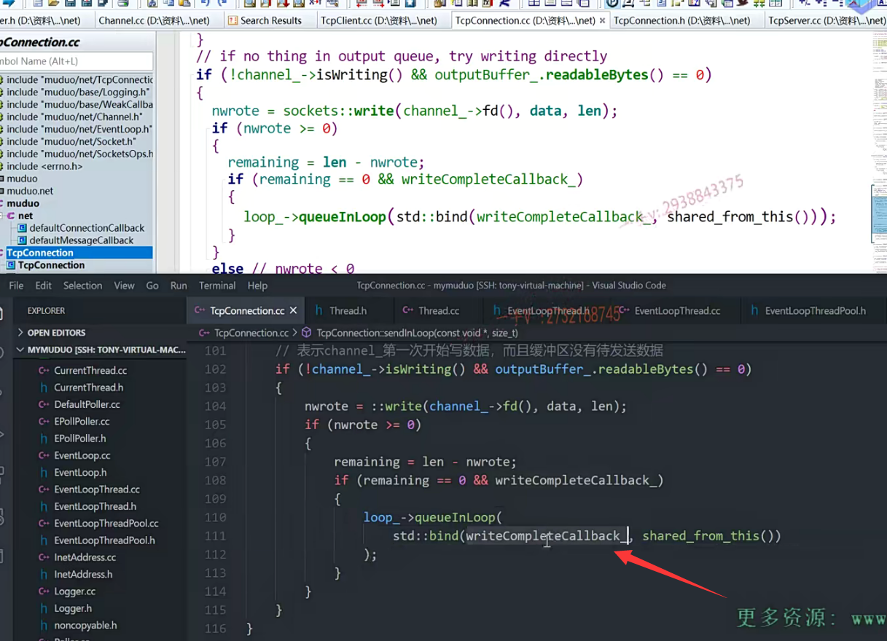

### 回顾上一节课

上节课呢，我们把tcp connection这个类的构造函数，析构函数还有它的读写。

close以及error相应的这个回调，我们把它的这个逻辑代码写完了啊。

注意一下，我们说TCP connection啊，除了管理一个socket，一个channel。

它毕竟是个connection，它还管理了state，就是当前这条连接的状态。初始的初始的时候是connecting。连接成功是connected断开连接shut down的时候呢，是disconnecting对吧？

最终。把这个底层的这个socket关闭完以后呢，就会是。disconnected对吧？总共是四种状态啊，

然后里边管理了这个socket channel，channel是最终注册到poller上的啊。

这是一个高水位，害怕我们发送的太快，而对方呢？接收的太慢，对吧？那么在这里边。呃，

我们给这个channel绑定了四个操作啊，四个回调操作，

### 逻辑梳理

那么这个channel呢？我们给大家说了这个channel，最终呢？在poller给channel通知相应事件的时候呢，就会去回调相应的操作，

这都是TCP server，我们用户给TCP server的

TCP server又把这些回调给到这个TCP connection 。

TCP connection，又给到channel。

 channel最终注册到poller里边。

poller通知channel， channel调用相应的回调。

对吧，这TCP connection是专门描述啊，以建立连接客户端跟服务器之间的联系的，

所以呢，这些回调呢？针对已连接的这个客户端呃，注册的是比较全面的

啊，我们之前说在main loop里边呢，我们专门管理acceptor的acceptor

实际上也就是那个listen fd也是一个socket fd，对吧？

啊，它主要就是绑定了一个就是read call back，其他没绑定啊。

呃，它的主要作用就是监听新用户的连接，返回这个socket对吧啊？

返回socket。跟客户端，通讯等所有内容打包成TCP connection，

注册相应的回调啊，这些东西都是在TCP server里边实现的。

==我们TCP server当时实现了一半儿，是不是啊？还没有实现完啊？==

我们这节课呢，继续来把TCP connection相关的这个方法实现完成以后呢？

我们最后呢？再来看这个TCP server啊，

基本上呢，我们代码的这个书写也趋于尾声了啊，

上节课呢，我们在写TCP connection相应的一些回调方法的时候呢。基本上大致的逻辑呢，大家都能够搞清楚，但是其中一些实现的逻辑呢，还是跟我们今天所要实实现的，这个成员方法。那还是有很多关联关系的啊，希望大家呢呃，除了学习呢，今天这节课本应该学习的内容之外。

啊跟之前讲的TCP connection相关的这个方法，它们的这个综合连接啊，再去思考一下它们内在的一些联系啊。

# 这节课

好，那么我们先来看一下这个从上往下排吧，看这个send。

send那么各位。

我们在编代码的时候呢，在onmessage，我们给用户会注册一个on message，这个呃，

用户会给这个TCP server这个注册一个这个on message方法就是已建立连接的用户有读写事件的时候呢啊，尤其是我们感兴趣的是读事件，对吧？on message会响应。

我们在on message方法里边儿去处理完一些业务代码的话呢，

我们会send给客户端是不是去返回东西啊？那就是通过调用这个send的。

这就是给客户端返回东西，

那么大家可以看到本身呢，在我们的这个TCP connection里边啊，

它的成员变量里边都有两个buffer啊，这个buffer呢是？

你看这个buffer。这个是呃，接收数据的缓冲区啊，我们服务端不仅仅是接收数据，还要给客户端。这个返回数据对吧啊？发送数据的这个缓冲区啊？缓冲区，两个缓冲区，

我们send相当于就是往output buffer里边是不是去发啊？

### 缓冲区的作用

那么我们发的时候呢？我们应用可能会写的很多啊。

而就是从我们底层的这个传输层到这个网络层到链路层的物理层啊。它不一定有我应用，是不是发的这么快啊？

所以我应用呢发的数据才会需要用一个缓冲区呢给它积累起来，

而且我们设置了一个水位线，对吧啊？

不能我应用发太快，底下根本就没有发出去。

啊，那么我应用的这些数据也被丢掉了，是不是啊？

### 简单一点，只提供参数为string的send方法

好，那在这里边呢，我们把这个方法呢？逐一的实现一下send

我们来这样去做吧，这里边儿有三个send，有什么这样的接触，两个参数的啊，接触stream piece。

这相当于是对字符串的一封装，这个muduo库里边还有buffer啊，我们简单一点吧啊，我们简单一点就是，

我们都是接收string类型的这个数据。

因为到时候因为大家都用过这muduo 

muduo库，你们send的时候我我们大家send时候最终发这个的时候呢？最终就是你看啊。

呃，我们最终都是把数据呢组装成就是序列化成这个json或者是PB都是。转成相应的一些呃字符串，

然后呢，通过这个网络是不是发送出去呀？

所以我们这个。就不需要人家专门是不是处理成buffer，而且buffer呢？如果我们用户只有字符串的话，

这个buffer也没有相应的带字符串参数的，是不是构造函数啊？

最终也无法直接转成buffer，所以我们干脆在这里边对外提供的接口直接就提供string作为参数啊，

这样用户用起来呢会更方便一点啊。这个string的同文件，我们添加一下吧。

### send的声明

那么大家来看啊，我们的这个send方法有没有提供过？还没有是吧？

那就是提供一下，send就是std。string

我们直接写这个buffer就行了。

### send的定义

可以，大家注意啊，注意注意跟我看一下。到相应的这个CC文件里边来。好，大家来看啊那。

再者就是为了什么呀？为了这个参数接收效率高一点。我这个呢？直接用个这个引用吧，对吧？不需要再构造形参的这个使证对象了啊。

同样的const string引用啊buffer儿。

好了，那在这里边儿我们看看啊，那你要发送数据肯定是你当前的连接的，这个state呀，你得是一个什么状态啊？connected就是已建立连接的状态，是不是才能发送数据？这个我们应该是很好想来的啊。

这个loop is in loop thread.那很明显。就是判断呢，这个loop当前啊，

当前执行的这个线程是不是跟这个loop对应的，也就是说当前的这个loop是不是？在它对应的这个线程里边啊，我们一般上来说呢，就是肯定是在当前的这个。什么里边啊？在当前的这个线程里边儿。呃，是不是去执行这个方法啊啊？

因为这TCP connection对应的这个channel最终注册到了某一线程的这个poller里边，对吧？poller给它去通知的话，肯定也是在相应的loop线程里边儿是不是去通知的啊？

但是呢，我们有一些应用场景呢，会把connection全部记录下来。记录下来以后就有可能说是在其他线程里边啊，去调用connection进行send的，这个数据的一个发送啊，这都是有可能的。

所以在这里边呢。还是用到了我们之前的这个running loop跟queuein loop啊？

所以实实际上无所谓了，人家在running loop里边，我们之前写不也判断了吗啊，如果这个loop就是当前执行线程就是loop，所在线程就直接执行相应的回调，如果没有的话呢，就是queueinloop。

呃，每一个loop底层都有一个wake up fd，就是通过给wake up fd写一个整数啊，

然后呢，就把loop对应的这个线程唤醒，然后在那个线程里边是不是去执行回调啊？啊，这个逻辑也是非常清晰的好吧啊。

在这我们就直接写它调用了一个什么呀send in loop啊，

send in loop。调用了一个方法。这个send in loop，那就这个方法，

我们把这个方法先怎么样啊？也是先把它给哦，这sendinloop我们都已经怎么样了？声明都已经给出来了，对吧？

这之前好像是没给完，我们还有shutdowndown.我们就都先写到这儿吧，这个声明嘛啊。

sendinloop里边传什么参数呢？

它需要的数据起始地址跟数据的长度，

那么这也就是buffer点c杠STR。以及buffer的什么size。OK吧啊，

否则的话呢，那是不是就是？执行一个回调啊

执行一个回调。这形成回调。实际上，这里边应该是直接queueinloop不就行了。

因为如果是is in loop thread在上边儿，这儿直接是不是都已经执行了？

这sendinloop 完了以后呢buffer。retrieve all.不要忘了这个，我们不是指针了是吧？这个是我我我们是一个引用变量直接调用就行了啊retrieve。哦。那这个我们就不用管啦，我们现在是不是直接是传的是什么？传的是我们的这个string对吧啊，我们已经不管buffer了buffer让外边儿调用方自己去管去啊。

这是一个回调啊，这绑定的回调是TCP connection，sendinloop跟上边这一样的，上边这标呢，就是当前的这个sendinloop

对吧？那我们就直接写了loop。

这个指向了run in loop第一个参数是什么来着？

第一个参数就是TCP呃，应该是STD。band.对不对？

第一个参数是。取地址TCP connection。的这个send in loop是吧？

第二个参数是什么？第二个参数是this，

第三个参数是？还是一样的啊，buffer点c杠STR。

最后一个就是buffer点size。

okay，那这个我们就完了啊，这个我们就完了。

好了吧，实际上都是执行这个sendinloop啊。

好，那这个sendinloop在这里边儿，大家看看sendinloop，这就是发送了。是不是就是发送啊？

发送数据，那你注意一下啊，你这个发送。

就是应用写的快，因为是非阻塞lO嘛，对吧啊？

应用只管写写的快而内核发送数据慢。

那也就是说我们需要啊，把发送数据写入是不是缓冲区啊啊？

写入缓冲区啊，而且设置了水位。水位回调。

好吧啊，防止发送太快，大家来跟我看一下这里边的逻辑啊。

注意看一下，这跟我们之前哪个啊handle write？还是有非常紧密的关联的啊，

因为我们之前的handle write在buffer里边的这个read fd里边是不是有读的这个缓冲啊？

我们利用它的这个readv啊，利用了一个非常巧妙的一个栈上的这么一个空间啊，进行了一个读数据的这么一个缓冲。

==那么，写数据的缓冲在这里边儿是怎么处理的呢？它结合了sendinloop以及handle write具体怎么做，==

### sendinloop()实现

大家来跟我看一下。s钢t。wrote.就是write啊。

size杠t remaining啥意思？就没发送完的，是不是数据啊？哎，没发送完的数据，

那刚开始初始化就是你要发送的数据呢？

都没发送的嘛啊，初始化就是len是吧？

fault fault error记录了一个是否产生错误啊？好在这呢，

#### 判断底层的状态后，再做处理

如果你的state=k disconnecting，不好意思，在这里边呢，你不能发送了。

这意味着你之前都已经调用过connection，都已经调用过shutdown了。是不是啊？之前调用过该connection的shut down啊，不能再进行发送了。

这也相当于刚好是用底层用一个state状态来控制呢，函数跟函数之间的一些互斥关系的对吧？

你shut down都已经调用了，你不能再调用send了是不是？

所以在这里边儿直接呢，就是一个log，我们写一个log error吧啊。disconnected啊。give up.writing.已经断开了。应该是断哦，这是connected是吧？不是connecting。是kd is disconnected。give up writing.

注意一下，然后这直接就return了。

#### 判断是否要发送

否则的话呢，向下。

向下是什么意思呢？因为刚开始呢。我们注册的都是我们感兴趣的都是socket，是不是读事件啊？

写事件刚开始呢，有没有注册过啊？没有，因为我们一开始有新的把socket封装成新的channel的话呢？

我们都是对它的什么感兴趣啊，我们一般都是直接enable reading，

就是对它的这个读事件epollin。感兴趣的。是不是啊？

所以呢，刚开始呢，在在这里边呢channel啊，这个writing is writing就是。他是否对写事件感兴趣？

OK吧刚开始对写事件还不感兴趣呢，所以这也是FALSE FALSE的取一个反应就是true。是不是啊啊output buffer点readable？再次等于零。

#### 判断发送成功

啊，这个表示什么呢？各位意思来看看

这就是channel第一次开始写数据，而且缓冲区没有发送数据，

或者是说是你第一，真的是第一次发送，原来没发送过，所以output buffer没有东西。

或者就是说你以前发送过，但是呢output buffer里边缓冲的数据全部全部被发送完了，所以它readable bytes现在是个零。是吧啊，

那我干什么那我就发送呗啊。

这里边就是。write第一个就是channel的这个fd。往前乘fd data。len好吧，如果。它大于等于零，就说明呢怎么样啊？发送成功了，是不是发送成功了啊？这是message啊，

各位。我们写成data吧，跟人家的这个代码一致啊。这表就发送成功了。

啊一上来，先是记录了一个remaining。等于len。减去什么？nwrite就是我要发送这个len长度的，这个数据实际上这返回的就是具体的发送的这个数对吧啊，

有可能我们一次性发送的数据呢？比这个TCP的这个发送缓冲区，整个的缓冲区的大小是不是还长啊？所以肯定存在len要比nwrite要长。对不对？

#### 如果发送完了,执行readcompletecallback回调

那如果没有就如果小或者是刚好，对吧？

那就是remaining等于零就表示呢，这里边要发送的数据全部发送完了，用不用缓冲啊？也不用缓冲是不是啊？

而且read complete callback怎么样？

在这里边。这个写入完成事件的这个回调，是不是人家用户也已经注册过了？那在这里边就直接怎么样？loop想了a指向啊queueinloop。STD.band呃，

哪个回调呢？那就是write。complete callback.还有一个就是。shared from this.

没问题吧，这里边就执行一下这个read complete connection的这么一个回调方法。

既然一次性各位，既然一次性都发送完了。

既然在这里边一次性发送完了啊。我注释上。

既然在。在这里一次性。啊，这里数据全部发送完成。

就不用再给channel。设置epoll out事件了。

那也就是说呢啊poller呢，就不会再对channel的这个epoller的事件感兴趣了，

那也就会不会再去执行它的handlewrite回调方法啊不会的

handlewrite什么时候执行嘛啊？这个你应该清楚嘛，handlewrite什么时候执行？

就是有epoll out这个事件的时候才执行的嘛，是不是。

当然现在人家send的时候呢？这已经一次性都已经发送完了。对吧啊，

所以呢，就不需要呢，再在像poller上注册当前的这个channel的这个。writing事件就时eopll out事件了，

这直接呢，就执行这个完成的回调了这一块呢，就不用再执行了。好吧

#### 如果是非阻塞错误

啊，但是。你看在这里边啊，

在这里边else。这里边人家也写了啊，这个表示什么呢？

这表示wrote小于零了。这表示出错啊，有可能出错。

对吧啊，出错的话呢，在这里边表示什么意思呀？

大家来看一下啊，大家来看一下。nwrote把它。重置成一个什么？把它重置成零。对吧啊，重乘零。

if error number不等于E would block。

e5的block是什么意思呀？e5的block是？

嗯，由于非阻塞没有数据正常的这么一个返回是吧啊，

#### 如果是其他错误

不等于这个。那就其他的错误的话log。那他就要被认定一个是真正的一个什么？真正的一个错误了是吧？

send in loop这么一个错误了。

okay吧，如果error number=1个。这个是e pipe或者是。pipe啊。或者是e number等于谁呀？等于个e connect。conn.re.reset.

就是那个pep或者是reset。就是接收到对端呢的一个socket的这么一个重置了是吧啊？

那就证明有错误发生了，这里边给这个当前这个变量制成了一个true。

好不好啊？这里边表示呢？这个sick pap。还有这个reset。收到一个链接重置的这这么一个请求啊。就发生错误了。好，

继续往后看。那么在这里边。大家来看看，

如果你是错误的话。那就不进这个if语句，那就走掉。是不是啊？

### 那如果没有发生错误

那如果不是这些错误。跳出来了。啊，跳出来了。

是因为什么才跳出来了？各位来看一看啊。

从这块往后走。下边 if fault error没有发生错误。对吧，连接是正常的。而且你这个remaining大于零。

那就说明什么？说明当前这一次write并没有把数据全部发送出去。

所以剩余的数据需要保存。

需要保存到这个缓冲区当中啊，

然后给channel注册呢？epoll out事件啊，

poller在这里边儿，因为工作的是LT模式。对吧啊。

如果缓冲区在这里边啊，如果缓冲区空余就是TCP发送缓冲区空余

poller是不断的会给上层上报相应的这个fd的epollout事件对吧啊

poller会？后来发现了。这个发送就是TCP的发送缓冲区有空间

你上一次已经发送完了，对吧？好会通知相应的sock，那通知相应的sock也就是channel嘛，对吧啊调用handle.write回调。方法对不对啊？

注意在这里边啊，我给大家写这了。就是read call back

对于channel来说是red call back。对于channel来说，是read call back，

但是channel的red call back是谁给的？还是TCP connection给的嘛？啊TCP connection给他的这个read call back给的是谁呀？给的就是handle write？

所以那也就是说，

在这send时候呢，如果这一次没有发送完，

那么未发送的数据啊，应用就要写到这个缓冲区里边，然后给channel注册这个epollout的事件。

对吧poller呢，发现上一次已经发送完了，发送缓冲区有空间啊，那么就会

回调channel的这个read call back，

也就是回调在这里边connection的handle read继续怎么样诶？这个channel is writing。

有这个对这个什么事件感兴趣了，对这个写事件感兴趣就继续吧，

缓冲区里边儿的什么数据怎么样？发送完成。

直到缓冲发送，缓冲里边数据全部发送完成。okay吧。

我在这儿把这个继续补完方法。

最终啊，那也就是调用方法把发送缓冲区中数据全部发送完成。

他下一次再发送不了的，这个发送发送了一次，还没有发送完成，没有关系了啊，

因为呢？这个只要poller发现呢，发送缓冲区发送完以后空间有这个发送，缓冲区有剩余的空间。它就会触发呢，这个相应的这个channel的。呃e pollout事件啊，就会回调channel的read call back

就会回调TCP connection的handlewrite。直到把发送缓冲型数据全部发送完成为止。

好吧啊，所以我们给大家说了啊，你看这一块儿呢，是不是就跟hand write来结合起来了？

啊，发送缓冲区不断的发送啊，

这个接收缓冲区啊，接收缓冲区在这个readfd里边就全部给处理完了好，

### 执行高水位回调的条件

我们看一下这个sendinloop啊，剩下的这一块儿呢，我们该怎么去实现呢？

首先定了一个o的len来各位，但o的len是什么？output buffer readable readable bytes.

这就是目前发送缓冲区剩余的什么？剩余的发送数据的长度。

那如果说old len加上你现在还有继续发送的remaining大于这个水位线了啊，

而且它还有个什么？就是o的len。得小于什么high water Mark。

就old line之前的是小于的。加起来大于

如果之前的old line已经大于这个了，说明呢，上一次是不是已经调了这个高水位的这个回调了？对吧啊。

那么在这继续。水位回调的这个call back有的，那么在这呢？直接调用一下路。指向的昆印度。STD.办这是。high water Mark call back.

shared from this.还有一个old len。加上什么？加上这里边的remaining。那就是数据的这个长度对吧啊？

那就是这个高水位回调啊。

唉，这个第一个就是connection，第二个就是现在未发送的这个数据的这个长度。它默认是个64M对吧啊，64M。水位线。

### 调用完水位线回调后，将待发送数据加入缓冲区

好，那在这儿呢？来看我们。

这是调用了一个水位线回调，调用完这个水位线回调以后呢？

你看啊，在这里边儿唉，是不是就把待发送数据呢？就append的添加到继续添加到我们的这个缓冲区当中啊啊，添加到我们的这个缓冲区当中。

超二星data。我们是不是12星？这是个位的星转成叉星，对吧？

加上啊，这个缓冲区已经发送了一部分了，发送了这么长，那剩下的是不是就要写到缓冲区里边儿啊？remaining 

okay吧。这就是带缓冲的这个长度啊。这个一定要写的吧？

is writing刚开始还没有对写事件感兴趣呢。

那channel就是enable writing嘛。对不对啊？

这里一定要注册channel的写事件。啊，写事件。写事件，

否则怎么样啊？

否则poller不会给channel通知什么通知epoll out。

不通知epoll out。那也就没有办法去驱动啊channel调用它的read call back，

也就没有办法去最终去调用啊TCP connection handle write把这个发送缓冲区的数据全部发送完成。对不对啊？

## 总结

好，大家在这里边。这块逻辑应该是没什么问题了吧啊send，

这就是send相关的这个逻辑了。

那我们这节课呢，应该主要啊，主要给大家讲的就是send这一块。

这也是非常重要的啊呃，结合了这个send发送发送缓冲区以及呢，

它是怎么去缓冲这些发送的数据，

最终如何把缓冲的这些数据全部发送完成？

啊，这里边儿结合了这个send又结合了channel poller相应的通知以及最终TCP connection，这个handle write方法。

希望把这块好好理解一下啊，然后相应的把这个代码也完成一下啊。编译一下，我们代码处理一下错误。

### 没有实现，暂时注释

第75行啊。这个shutdown。先把这个注释掉啊。

OK啊，这节课写的代码呢？都已经编译通过啊，

希望大家呢，相应的也完成一下。代码输出的任务，并把这个send相关的逻辑呢，把它理清楚好吧啊，这节课的内容就说到这。