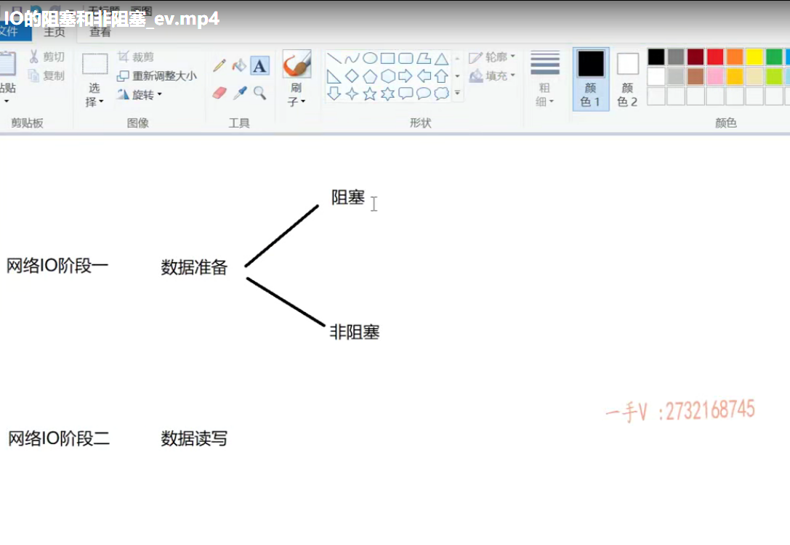
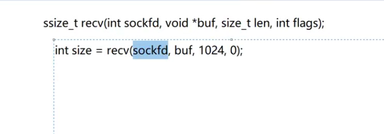
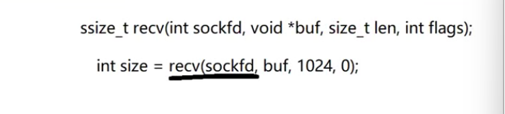
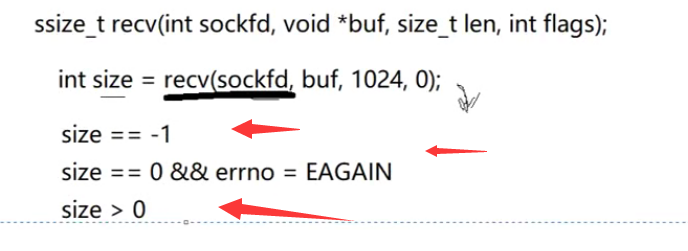
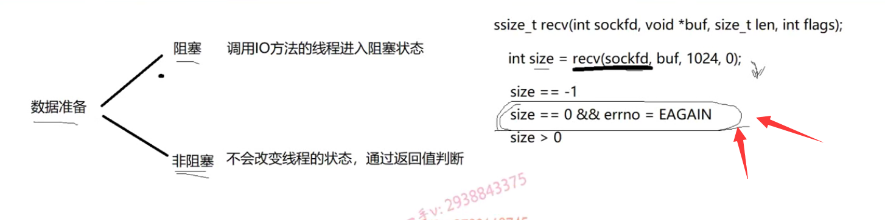
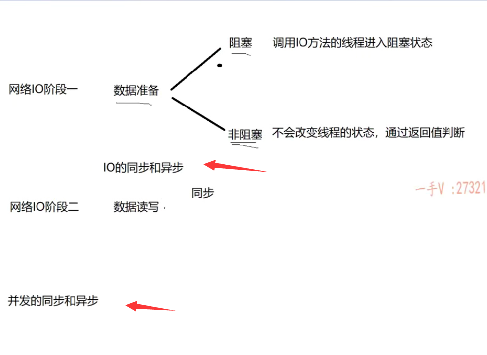
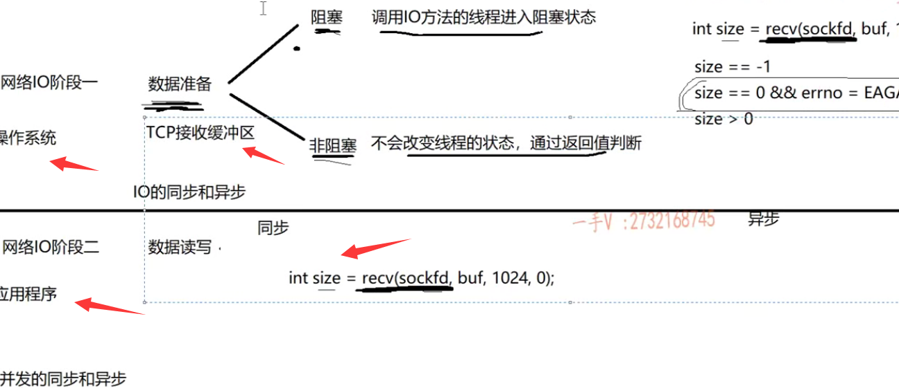
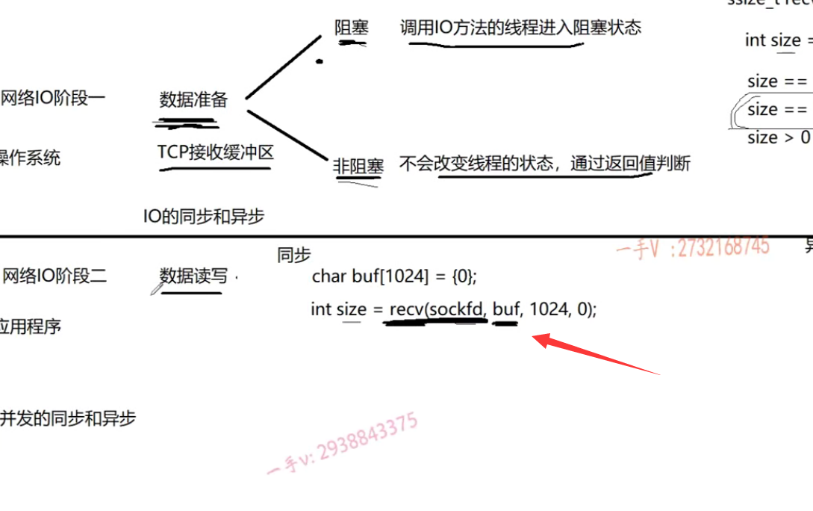
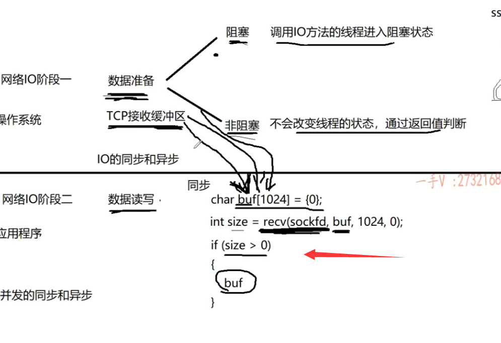

这节课呢，我带着大家一起再来学习总结，回顾一下我们网络lO相关的这个概念啊。

阻塞非阻塞，同步异步。

那让我们100位同学都说一下这四个词汇的概念，可能都有自己的答案，而且都觉得自己说的是正确的，对吧？

但是呢，我觉得大部分同学肯定都有这么一个感受，就是自己能不能再说的更好一点。更学术化一点，更专业，更高大上一点。说的更全面一点，对吧啊？

我相信呢，作为后台开发啊，开发测试。啊，我们搞这个研发相关的同学在没有这样对这个知识的，这个追求的这么一些想法啊，我说的更全面，能不能说的更好？啊，我可能觉得你不太适合这一行，对不对？好了，

那么大家在学完这一节课以后呢？能不能从我的表述中啊？

学到一些东西，能够在自己组织一下语言。对不对啊？当我们再一次有机会在面试官跟前或者给别人在讲述这个阻塞非阻塞同步异步的时候呢？能够说的更专业一点，更全面一点。

好吧啊，我们的目的就达到了，当然大家在学习过程中有任何的问题，还是老操作啊。在这个群里边问，或者是咨询老师的个人QQ私信啊，我看到的话都会及时回复的。

### 两个阶段

那么大家来跟我看一下啊。实际上，不管是什么样的IO，内存IO磁盘IO还是网络IO啊，

它都包含两个阶段。

那在这里边，我们就不扩展那么多了，

### 网络IO

我们主要说的就是网络IO啊，数据准备跟数据读写。

这个同学们都反对吧？我们从作为服务器啊，接收客户端的请求。

我得先监听你客户端有没有数据过来呀？这是一个状态，

另外一个数据过来了，我该怎么去读写？这又是一个状态，对吧啊？

实际上我们阻塞非阻塞，同步异步就是分别是这两种状态下的不同的方式的一个体现。

大家来跟我看，所以我们从一个典型的网络lO的两个阶段来看，这四个词语啊。

就是数据的准备。还有这个数据读写。

数据准备在这里边儿分成什么了啊？分成两个状态。

那么大家来看。就是阻塞和非阻塞状态。

阻塞状态跟非阻塞状态，大家注意数据准备啊，IO的两个阶段。

网络lO阶段一。这是网络lO阶段二。

好吧啊，分为阻塞跟非阻塞。

那不要光说理论啊，结合实践一点啊，在这里边呢，我们给大家查到了这样的一个系统的API接口。就是这个receive。对不对啊？

receive好吧啊，这个应该大家都调用过写过网络程序都调用过对吧，我们一般调用的时候呢？都是写一个返回值接收，size啊，等于receive第一个呢，就是我们的socket。socket fd第二个就是一个buffer啊，第三个就是这个buffer的大小，

比如说我们1k对吧啊，第四个有个默认传零就行了。

那么，如果在这里边这个sock fd相当于就是我们代表的，这是系统的一个文件描述符，就代表一个lO嘛，对吧啊？

那在这里边儿默认是阻塞,在创建的时候，当然你在代码上也可以把它设置成非阻塞，是不是如果是阻塞的话，那么它的体现是什么？

当我调用一个阻塞IO的话呢，在这里边就是如果这个sock fd上没有数据到来，没有数据可读receive嘛，是不是哎？

没有数据可读的情况下。这个receive会返回吗？不会，它会造成我当前线程怎么阻塞？

就是我一直阻塞。等待你这个sock fd上有数据到来。没问题吧，都来干嘛呢？都来读的嘛，是不是啊？

就是如果它是一个阻塞的这个lO的话，

大家先听我去讲解，然后我们后边再给大家统一的去总结一下好吧啊，尤其是那些知识掌握还是不是太熟悉的同学，注意听一下啊。

socket fd默认工作在阻塞模式，当我调用这个IO方法的话呢，如果这底层的这个IO数据还没有准备好的话。这是会造成当前线程阻塞在这个IO接口上。

### recv有返回值

好的吧啊。那在这里边儿，如果它返回了，也就是说呢，在这里边儿啊。

如果它返回了。那就是有数据，是不是可读了啊？

那接着就是数据读写了，那咱怎么读？对不对啊？

这就是下边这个阶段二，咱暂且不说。在这里边儿，如果说是阻塞的话，返回的话，这个返回值表示什么意思呢？就是我最终读的数据的大小是不是啊？

### 设置为非阻塞

非阻塞，如果说我在啊receive之前我把这个sock fd。我给它设置成set nonblock，就是把它设成一个非阻塞，那在这里边receive的体现是什么？

### 不会造成当前线程运行状态的改变

==如果这个socket fd上没有数据到来的话。receive呢，是直接就返回回来，它不会造成当前线程怎么样啊？当前线程阻塞，当前线程运行状态的改变。==

没问题吧啊，它相当于在这里边儿凯fd，如果没有数据准备好的话，==它是不断的会空转CPU的==。啊，那在这里边呢？我们一般这样去判断啊，这样去判断，

### size值判断

如果size呢，等于负一的话，这表示什么呀？这表示呢，远端是不是断开连接了？

如果size=0啊，而且呢，number等于eagain或者是e would block。

对不对啊？满足这个条件，表示什么？比方这个recv呢啊？==返回并不是由于远程关闭连接或者是远程有数据过来了。是连接好着呢，但是远程没数据啊，==

返回的原因是非阻塞lO返回了。啊，就是暂时呢，没有网络数据到来，但连接是正常的。

好吧啊，如果size大于零呢，这就表示呢，有数据来了，我读了这么多大小的数据。

没问题吧，这就是说在我们数据准备好，或者是没准备好的时候呢，

我们在这一个阶段的两种状态的体现，体现阻塞还是非阻塞啊，

### 小总结 

#### 阻塞

阻塞呢，就是让当前线程，就是调用IO方法的这个线程啊，进入阻塞状态。

什么时候唤醒呢啊？数据可读的时候有数据准备好的时候。啊，我们当前这个线程呢，就可以受调度啊，进行数据读写了，对不对啊？

#### 非阻塞

如果是非阻塞的话呢？它不会改变线程的这个状态。对不对？

那怎么去判断返回值？到底是连接断开呢？还是说是非阻塞lO返回呢，还是说是读到数据了呢？

对不对啊，通过返回值判断怎么判断呢？

这里边给大家写了，尤其是这个在我们。编写非阻塞IO这个代码的时候呢，是一定会看到啊，

我们IO方法返回值，这样去判断的。好吧啊，这是两种状态。

#### 重点注意非阻塞IO的判断

## 阶段2 数据读写

再说我们阶段二。那么，阶段二在这里边儿分为了什么呀？又分为了两个状态。

哪两个状态呢？先说第一个啊，我们这样去画吧。

先说第一个同步，再说第二个异步。

### 主要指IO的同步和异步，与并发的同步和异步做区分

那么在这里边，我们说的同步跟异步啊，主要指的是这个lO的同步和异步在这里边儿，

我们为什么要给大家去强调lO的同步跟异步呢？

因为呢，我们还有一种应用层的同步跟异步的概念啊，叫做并发的同步和异步。

好吧，这主要指的是应用纯应用层面的，

这个指的是系统跟应用层面的，就是涉及IO的网络IO的同步跟异步。

### 操作系统中的同步和异步主要指IO的同步和异步

在这里边主要讲这个操作系统，理论里边你看到的同步跟异步一般指的都是这个lO的同步跟异步，

### 业务上同步和异步指的是并发的同步和异步

我们大家共同你跟我啊，咱俩在一起写一个项目的时候呢，咱俩在聊业务的时候，==咱俩说业务上的同步跟异步的时候呢，那当然指的就是并发的同步跟异步了==。我们在聊业务呢，还管什么操作系统呢？是不是啊？

所以呢，大家在聊东西的时候，你是在聊操作系统相关的这个lO的理论呢？还是在聊纯业务是不是？

对于同步跟异步的概念，你搞清楚啊，

虽然是两种场景下的同步跟异步，但是呢其思想是一样的啊。

同步是什么？大家再来看receive。

在这里的这个receive接口啊，在数据没有准备好的时候，就是这个sock fd数据没有准备好的时候啊。它的体现呢？如果这个socket fd是阻塞状态的话呢？

这个receive是会让当前线程进入阻塞状态的，对不对？

如果有数数据来了，唉，如果它底层有数据来了，

那么这个线程呢？就醒了。

醒了以后呢？他不能啥也不做啊，receive啊，你要给我收数据呀，你要读数据对不对啊？

大家都知道。

### 画图表示

你看我画一，我画一条线，

这个线的上方呢，就是操作系统。这个线的下方呢？就是我们的应用程序。对不对啊？就是我们的应用程序。

现在呢？我在我的应用程序上是不是调用了一下receive啊？没问题吧啊，调用了receive。

这个receive这个socket fd我不管它工作在这个阻塞模式还是非阻塞模式。

首先呢啊，它数据没到的话，就是我刚说的它分别在这两种状态下。这个就是使线程阻塞，

### 非阻塞我们会编写循环判断

非阻塞，这个我们一般会编写一个循环不断的让CPU空转啊。当receive真真正正收到数据的时候呢，是不是才返回呀对？当真的有数据准备好了，

### 数据准备好，是因为我们有TCP缓冲区

以后呢？我们要读这个数据，这个数据所谓的数据准备好了，是因为我们在内核上有TCP的接收缓冲区嘛。是不是唉，就是接收缓冲区有数据了。

有数据，那就是数据可读了嘛？那怎么读数据呢？

是操作系统给我读好。然后直接通知我呢，还是得我自己去读啊，

这个buffer同学们来看这个buffer，这个buffer是内核的buffer，还是我们用户层的一个buffer啊，

这个buffer呢，你想一想嘛，这肯定是你用户层的嘛。应用层的嘛，

这是你自己去定了一个char buf[1024].

没问题的吧啊。那当然，

在这里边呢。我们为什么说这个接口是同步的接口呢？因为当数据准备好了以后就是操作系统的这个socket fd对应的TCP接收缓冲区，里边有内容的话呢，我们receive就可以开始接收了。

### 应用程序卡在这里，去搬

接收的话是什么啊？是我应用程序卡在这里。从这个接收缓冲区搬。

也就是说，==从内核里边的这个TCP接收缓冲区，不断的把数据往我应用层的这个buffer里边==，是不是搬啊？

在搬的过程中，同学们注意听啊。这receive数据准备好了以后，它就要把内核的TCP接收缓冲区就是这个socket fd对应的TCP接收缓冲区的数据。不断的往我buf里边搬。

因为你敢给我返回size大于零的话。这就表示你是不是从内核搬了多少字节的数据过来了，

我就要开始访问buffer了，buffer里边就得有内容了，什么内容呢？

就是你从这个tcp接收缓冲区搬过来的内容。在这个内容没搬完之前，我这个receive能往下走吗？走不了。

是不是啊？嗯，当然你不要跟我抬杠，你不receive不是很快就返回了吗？啊，那计算机在做这件事情的时候，当然是很快了，

我们关注的是。这数据是谁搬的？操作系统在这里边儿搬好，通知你的还是你自己吭弛吭呲自己搬的？

### 是自己搬的，不是操作系统搬的

咱自己搬的。对着没有哎，自己搬的。

搬完了以后呢？receive才返回，回来了我们才看到了啊，我搬了多少数据啊？这数据都在buf里边。

所以这叫做IO同步，

### IO同步的意思  事情都是应用程序自己做

IO同步的意思就是说，当我调用了这个网络IO接口的时候啊。

对不对啊？

当这个IO阶段一数据准备好以后，在数据读写的时候。

这个是我应用层，我自己调用的这个网络IO接口，自己去读自己去写的。

这个耗时的过程都花在我的应用程序上。就是这个receive这个方法在调用的时候，这个数据如果没有搬完的话receive一直是在这里边，不会往下返回的。没问题吧啊。这叫做IO同步，

就这事这事都是我自己做的。

### IO异步下节课讲

好，那我们再来解释一下这个异步的话，

我们放到下一节课来写吧啊，我们每一节课时间稍微短一点，大家看的也不是那么的累啊。