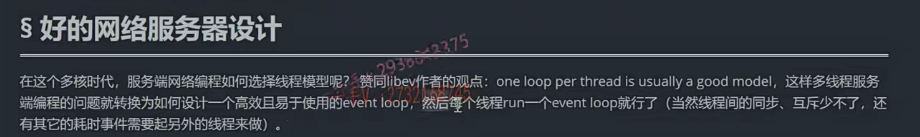
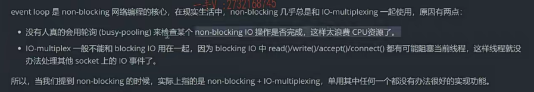
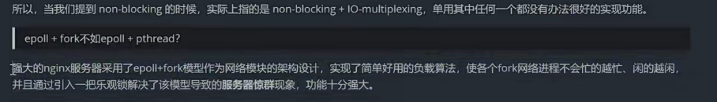
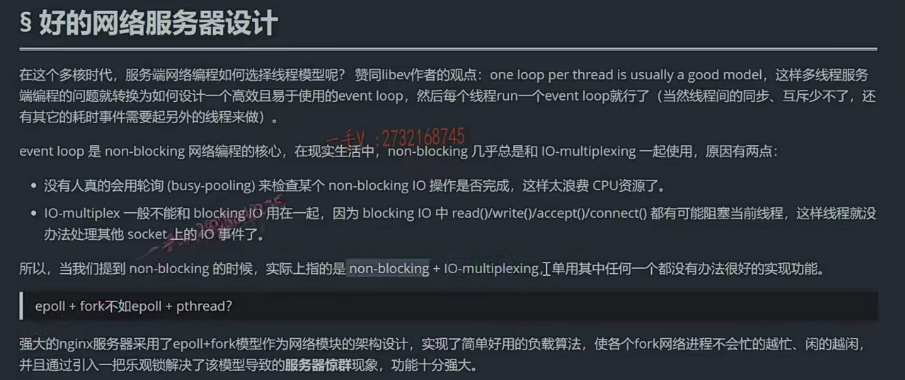

## 良好的网络服务器该怎么设计

这节课呢，我来给大家说一下啊，我们来一起学习一下一个好的网络服务器的设计，

或者叫做性能不错的网络服务器的设计。好吧啊。

那么。一个好的网络服务器该怎么设计呢？在这个多核时代。

呃，服务端网络编程该如何选择线程模型呢啊？

如何选择这个线程模型？非常赞同这个libevent，

one loop per thread is usually a good muduo。

在一个线程里边儿有一个事件循环，通常是一个非常好的，这个做法非常好的，

这个模型事件循环。事件循环。名词儿上说是事件循环，实际上你脑子里边儿反映出来的就是我们的lO复用。

好吧啊，我们一般呢，都使用这个lO复用做一个事件分发器啊，

那么后边儿我会给大家讲reactor模型，会再给大家去讲反应堆。

还有事件分发器在一个reactor模型里边儿所处的这个角色啊，

我们为什么要那些组件？大家先别着急，先来跟我看。

这样多线程服务端编程的问题就转换为，如何设计一个高效且易于使用的事件循环了。

然后呢，每个线程运行一个事件循环，这不就是我们的moduo库吗？

对吧？所以这句话谁说的呀啊？

这就是muduo库的作者陈硕大神说的嘛。对不对啊？大神说的话，我们还是需要好好的去理解一下的。

那么然后呢？每个线程再去执行一个event loop就行了啊？

当然，线程间的同步互斥少不了

还有其他的这个耗时事件需要去另外的线程来做啊，这都是陈硕在这个知乎上啊，写的一些非常有内容的也大家非常赞同的一些。

啊，网络服务器设计的一些非常好的一选择点，考虑的点。

好吧，所以这里边儿呢muduo库的设计也秉承这个one loop per thread is usually a good model啊。设计了这个线程，

基于线程的event loop事件循环啊，事件驱动，事件回调啊，

这是它非常不错的设计。啊，我们到时候呢，后边再重写muduo网络库核心代码的时候呢，希望大家呢，多多留意，多多思考一下啊。

eventloop事件循环是非阻塞网络编程的核心。

在现实的生活中啊，非阻塞。几乎是和lO multiplexing，就是lO复用一起使用的。

也就是说呢。lO复用一般呢啊，我们需要给它里边儿注册是不是socket呀？

一般我们注册的都是非阻塞的socket。

我们不会把一个阻塞的socket注册给它，不是说不行啊，在你代码级别上呢，当然是行了，你可以给它里边儿注册阻塞的IO跟非阻塞的IO。是不是啊？

那或者说是你单单就使用非阻塞IO。

你说你使用这个非阻塞l在这儿，你图了个啥嘛？是不是内核数据没有准备好，

你为什么要不断的去询问，不断的询问你好好睡觉不行吗？

啊，你睡觉了，是不是这个CPU就不会再把时间浪费到你当前的这个应用线程或者应用进程里边儿了？

你把CPU时间面出让给别的线程不好吗？

对不对？你为什么在这儿啊？好好的，你不睡觉，你在这儿不断的问内核数据准备好没？数据准备好没？你这不纯粹浪费时间嘛，是不是？

## 非阻塞IO一般和IO复用一起使用

### 单独使用都不是很好实现一个网络服务器

那你说照你这样说，非阻塞lO就没有立足之地了呃，不是这样的啊，

说了非阻塞lO跟lO复用单独使用。一般是啊，你看所以当我们提到这个非阻塞的时候，实际上指的是非阻塞lO，加上这个lO复用是一块使用的。

单用其中任何一个。都没有办很好，就都这个没有办法很好的实现相应的一个网络服务器的功能。

OK吧啊，这个观点我们是相当赞同的，也是说的非常有理的。

啊，你反过头来看嘛，因为我们说的你使用非阻塞，你单单使用个非阻塞lO不是纯粹浪费时间吗？

是不是啊？好了，你单单使用lO复用啊，你把默认的工作在阻塞模式下的这个socket给它。

这个编程上大家应该都有呃，都要都要理解，

因为我们讲这些课知识储备都给大家说了，你要最起码要知道select poll epoll的编程对吧啊？

## epoll加阻塞IO的坏处

### IO线程阻塞无法返回到epoll_wait,其他socket无机会

在这儿我就直接说了啊。

那么，你在使用lO复用的时候呢啊，由于一个线程啊，调用一个lO复用接口，一个epoll会监听多个套接字。是不是啊？

如果说你套接字都是工作在阻塞模式下，那当epoll给你返回一个有可读事件发生的socket的话。

你为了把这个socket身上的这个数据读完。你会不断的读，因为它是阻塞的socket。你总会阻塞。阻塞住吧。

你总会把数据读完以后，因为你也不知道什么时候读完数据嘛，

你总是会不断的去尝试这个去读，去读这个socket数据，读完没读完没？

你最后一次肯定是不是阻塞住啊？

那你阻塞在某一个socket上以后那没有机会再回到epoll_wait，

这样是不是其他的socket就再也没有机会？再被处理了。是不是啊？

那当然了，你说我不重复读，我一次只读一次不行吗？

那也可以呀诶，这也就是说我们不是说啊。不是说lO复用不能把阻塞的这个socket塞到lO复用里边儿，只是说呢？

使用非阻塞lO是最好的，对不对？

尤其是我们工作在ET模式下的，这个epoll对吧啊？那么我们需要呢？

自己应用程序把这个socket上的数据不断的去读完，此时如果你的socket是一个阻塞的话。啊，最终会由于这个socket上没有数据而导致当前线程阻塞而导致epoll wait再也回不到epo wait了。是不是啊？

### 结论：IO复用+非阻塞IO结合使用

那这个epoll_wait的上注册的所有的事件都没有办法去监听了。

所以单单用lO复用不行的，单单用非阻塞l也不行的，它俩得一块儿结合着使用。

好的吧啊。这就是最好的模型了。

那么。它们两个啊，非阻塞几乎是和IO这个复用一起使用的原因，

### 陈硕说的2个原因

有两点没人真的会用轮巡的来检查某个非阻塞IO操作事故环节。

这样太浪费CPU资源了。

这不是我写的啊，这是还是人家这个陈硕说的好不好啊？那当然了，这个大家都是这样认为的嘛，

是吧？是不是人家这些话也说的没错，在这里边儿我就直接贴了啊，因为我觉得我自己用语言写出来也不一定有人家陈硕大神组织的好啊，对吧啊，我就把这些好的东西呢，直接给大家附到这里边了啊，

那么l复用啊，一般不能和阻塞lO用在一起。

因为阻塞lO中的这些方法都有可能阻塞，是不是当前线程啊？

这样线程就没有办法去处理其他socket上的lO事件。

所以呢，我们一般呢，这个lO复用都是和非阻塞，

因为非阻塞它不会阻塞当前线程啊，是不是？

啊，所以当我们提到这个非阻塞的时候呢？

实际上我们不会单单去用非阻塞IO的。我们都是指的是lO复用。

==基于lO复用的非阻塞==，

socket的使用单用，其中任何一个都没有办法很好的实现功能。

## 再加上线程池

所以呢，我们一个好的服务器设计，一般呢都是lO复用来操作非阻塞的这个socket，再加上这个线程池啊。

一般这个线程池的线程个数呢，是会和我们CPU的核数。核心数量是一样的啊

像这个C++的这个muduo网络库啊，对吧？

还有JAVA里边的这个netty网络库，mina网络库啊。都是这样设计的啊，都是这样设计的。这已经被实践验证了，这种模型是非常不错的。

one loop per thread it's usually a good啊，a very good muduo。

好吧啊，好在这里边儿，

我们先从理论上给大家说一下，我相信我们大部分同学在自己去写一个性能不俗的网络服务器的时候，

==也都是会采用这种epool加线程池的方式啊epool加这个非阻塞lO加线程池的方式来实现这个服务器的。==

好吧啊，那在这里边呢，我们同学们在学习的时候呢在。

这个线上啊，会问我这样的问题，那老师是不是就是说这个one look per thread？这个模型呢，就是终极的这个网络服务器设计的模型了啊，

还有没有更好的模型呢啊？让我开开眼界。

## Nginx

那当然有了。我说那你看一下nginx服务器,nginx是一个非常强大的http服务器，对吧啊这个？

嗯，它的服务器模块呢，引用了一个非常简单的，这个负载均衡。

人家还多进程来监听新用户连接啊，不像你epoll加这个线程池一般只有一个lO线程在监听新用户的连接，其他工作线程。处理已连接用户的读写事件，对不对啊？

### epoll+fork

那么，它采用的是epoll+fork啊，

很多同学，我不知道怎么回事，可能才去学习。这个自己学习这一部分内容的时候，可能对于fork有一些误解吧啊，总觉得fork效率不高是吧，觉得现进程太重，效率不高。

啊一听我说啊，这个nginx是epoll+fork。

行，那它肯定不如epoll加这个线程来的效率高是吧？

是吧啊，那同学们不要这样的去去去判断，这样太武断了啊，

如果真的是像你说的epoll+fork不如epoll+pthread，

那人家nginx为什么不采用one loop per threat的模型呢，是不是啊？

此fork非彼fork大家呢？还是要静下心来。去在积累有一定积累的程度上去看一看Nginx的这个网络模块的代码，后边我也会更新nginx网络模块代码的这个课程的代码。

大家可以留意更新，留意更新啊，去看一下，

当然采用了epoll+fork模型作为网络模块的架构设计，你看人家是怎么设计的？

不是你想象的，你写的那几十行代码的epoll+fork好吧啊，两码事差的太远了，实现了简单好用的负载算法。

使各个fork网络进程不会忙的越忙，闲的越闲，

并且通过引入一把乐观锁，解决了该模型导致的服务器的精群现象啊，

功能十分强大啊。

这一段话不是陈硕说的，这段话是我写的好吧啊，我写的我用最简单的力求用最简单的这个语言把nginx解释的网络模块的好处

给大家汇总到这里。啊，汇总到这里，希望你能够认识到它确实性能不俗呢，

对不对啊？实际上EPoll+f跟EPoll+pthread呢？

我们如何去选择呢，那他们有不同的应用场景，是不是啊？

在这儿我们就不大量展开，对于nginx的解释了好吧嗯，

大家有兴趣可以先自己去。看一下，我这里边已经给大家把方向啊，都指出来了，

或者你留意我后续对于Nginx网络模块源代码的一个底层原理的一个剖析好吧啊。

好，那在这里边，我们看完这个我们又看了一下单独使用非阻塞lO不太好。

单独使用lO复用也不太好，

分别对应这里边儿的第一点跟第二点是吧？

我们最终呢留下来了一个结果就是。one loop per thread这个模型就是我们epoll加非阻塞lO加上线程池，

线程池的数量一般呢，就对应我CPU的核心数量。四核的八核的一般这个生产环境上的这个服务器一般都是32核64核都很正常的，对吧？

大家现在都在腾讯云或者阿里云上去租一个服务器啊，服务器上都有选项的，是不是啊？都很强大。

呃，那么这个好的网络服务器的这个设计模型就是这个样子，

muduo库也是采用这个样子。

所以在后续我们去写目录库的代码的时候，大家也可以留意观察一下。

muduo库是不是做到了这里边儿所描述的一个好的网络服务器设计，

应该考虑的事情呢，IO复用加非阻塞lO再加线程池。好吧啊。

