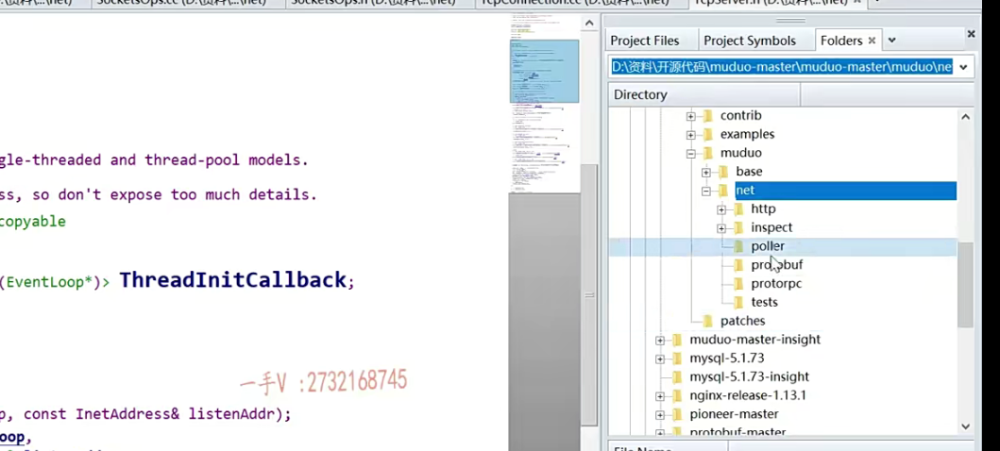
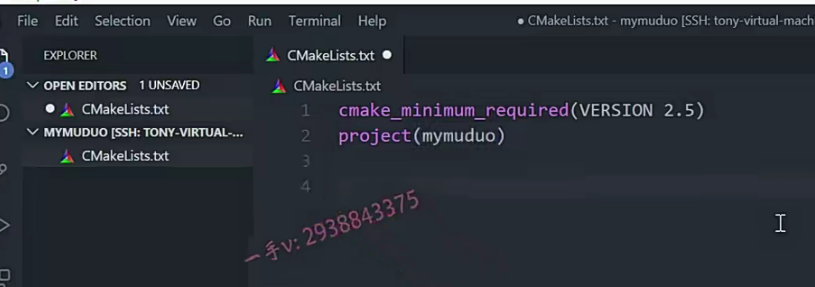
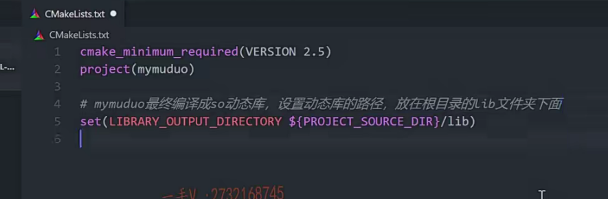
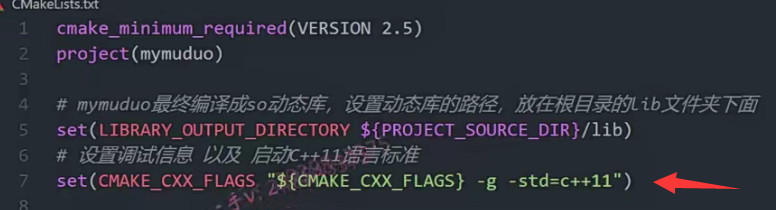
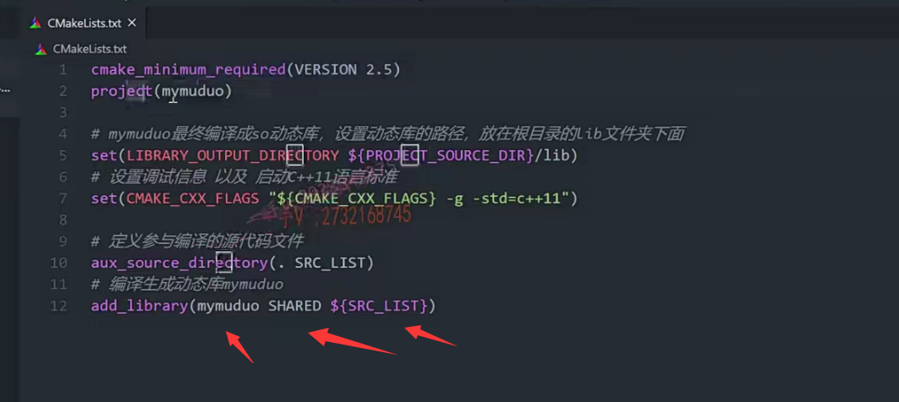

啊，这节课呢，我们就正式开始muduo库代码的书写了啊，

我们一步一步来啊，不求快。

力求呢，把整个儿的这个项目书写的这个逻辑思路啊，

包括代码的，包括编译的，我们都说清楚啊，给大家力求简洁明快，

不雷赘

那么首先这节课我们简单一点呃，大家在看muduo库的时候啊。

你会看到muduo库的源代码下呢？

它有两个，一个是base,一个是net啊，

这个base里边儿放了一些公共的一些代码文件啊

net里边儿放，就是跟它网络相关的啊。

像这poller啊，

就是具体的这个多路事件分发器啊，

它还集成了protobuffer啊，这些东西http。

那么，在我们写的时候呢？我们就不组织这么复杂了好吧，

我们主要窥探的是它的这个网络模块儿。

所以我在这里边示例的时候，就是我把所有的代码都放在我的这个根目录文件夹里边就行了，我建了一个mymuduo。

这个是VS code远程连接了linux啊，

这个创建了一个my muduo。

文件夹我把所有的项目源代码都放到这个文件夹里边儿，

所以呢，在这儿我先构建一下编译环境吧，那就非常简单了。

## cmake构建项目

#### 编写简单cmakelist.txt没有多级目录的

cmake list.TXT

我写这个cmake的话呢，那相当于让这个目录下所有的源文件是不是都参与编译啊？

好，那么大家来跟我回忆一下cmake怎么写？

我们这个cmake是非常简单的，我们这个项目也没有这个目录层级啊，

也不用在每一个目录下都写cmakelist，

我们只需要在根目录下写一个，

让这个目录下所有的源文件都参与编译。

大家先不要去翻一些笔记啊，先跟我来想一想，这个都要怎么写？

## 先写版本

先写什么版本是吧？是cmake。many required.就是一个version啊，

我们就是要求呃，你当前这个环境系统环境。呃，装的这个simic的版本必须大于等于25，你才可以编译我当前这个项目好吧啊？

## project

project我们就起个my muduo啊，my muduo就可以了。

因为我们这是一个什么东西呀，我们这是一个网络库，对吧啊，

并不是一个可以直接执行的一个应用服务，

所以呢，我们最终呢会把它编译成一个动态库吧啊，

呃，muduo库本身呢？

你看啊muduo库本身是编译成静态库的对吧啊？

在做集群聊天服务器的时候，也给大家详细讲了它本身编的是静态库。

它呃的这个安装，如果大家嗯。去用过muduo库，你就学

#### muduo利用很多boost库

#### 最终改成C++11编写的，不依赖boost

觉得它的安装真的是很难受啊，为什么呢？

因为我们的这个muduo库啊，用了boost库里边很多的东西。是吧啊，

那我们在写的时候呢，就全部就脱离boost库了，

我们用C++11，对吧的的这个新的这个语法标准啊。

全部呢把现有的muduo库里边跟boost库相关的，我们全部给它干掉啊，

我们全部呢由C++语言本身来完成。

使用muduo库直接编译成so库跟头文件，提供给用户使用就行了，好吧，

所以我们最终呢把这个网络库编译成so库啊。

### 动态库放的目的目录

在这里边，我们设置一下，还记不记得

我们应该把这个库编译以后放在根目录的这个lib文件夹里边是不是啊？

那么cmake有一些预定义的这个。参数像library output directory就是设置一下什么东西呀？

这个相当于就是my muduo最终编译成啊so动态库，

这是设置动态库的路径。

在哪个路径呢？project.叫做。source DIR.这个呢，

==也是cmake预置的一些变量，表示当前的这个源码的根目录啊==，

源码根目录底下的这个lib这个文件夹嘛。对不对啊？放在根目录的lib文件夹下面。

### 设置调试信息

好吧啊，然后就是设置调试信息。

因为这个代码比较多啊。

到时候写完以后运行起来的话呢，可能会发生一些错误啊，

我们到时候想调试调试的话，需要加上调试选项。

好了吧啊，那么我们这是属于C++的项目，所以它就是cmake。

大家来看一下啊，应该就是cmake_cxx_flags。

这就是相当于我们用g++命令编译的时候，给它命令后边指定的这个编译选项。好的吧啊，

那么这个呢，我们在这里边这样写一下。

==在它原有的编译选项的基础上。加上什么东西呢？==

加上这个杠g。

好吧啊。有些同学的这个本地的这个编译环境呢，这个g++的版本如果不是非常新的话，默认C++11的这个语法并没有打开，所以在这里边儿，你需要加一个-std=c++11。

这个你别忘了啊，以及启动c++11语言标准。是不是进行编译呀啊？你像我这儿的话，我这个就可以省略了。啊，我这儿的这个编译器非常的，这个版本非常的新，它默认就已经开启支持C++11的这个标准了啊，

如果你比较老的话，我们有些同学问问题的时候呢，错误很明显，就是当前的这个语义啊，需要C++11的这个支持。编译器默认没有开这个啊。好，那这就完了，

### 定义参与编译的源文件 放在一个变量中

是不是接着呢？

我们用这个来定一下什么东西呢？

这个是定义啊。aux source directory.

这个是定义参与编译的源文件啊。

相当于定义了一个变量，名字放在src list里边儿了点儿呢，

就指当前目录所有的源文件。

### 生成动态库

好吧啊，那么现在我们是什么东西呢？

现在我们要把它变成这个编译动态库。

是不是编译动态库啊？

那就不是add execution。

add的library对吧？就写成my muduo吧，然后再写成shared。

是不是这个好像是个static，是静态库默认就是静态的，

shared就是动态库OK吧？

有哪些原文件构成呢？就由我们上边定义定义过的编译生成动态库my muduo。

## 总结

好了吧啊，所以呢，我们在这个根目录底下cmakelist里边就定义这么几个就行了。

版本我们工程的这个名字对吧？

设置编译成动态库放在项目根路径的lib啊，

文件夹下设置调试信息以及启动C++11标准。

把当前根目录下的源文件名字组合起来放在这个变量里边儿啊，

这个是引用这个变量就是所有的参与编译的源文件名字生成一个动态库，

名字叫最终会生成一个libmymuduo.so。

好，那这个编译环境呢，那我们在这里边儿就写完了好吧啊，

现在没有源码，到时候有源码的话呢，我们到时候去把它启动一下，

看是否可以编译正常，那么这节课我们的任务就这一个啊，

把这个这个项目的根目录的底下的这个cmakelist顶级的这个cmake文件写好后边可以用它来直接构建我们的这个工程的这个源代码生成这个动态库so库。

好吧嗯。