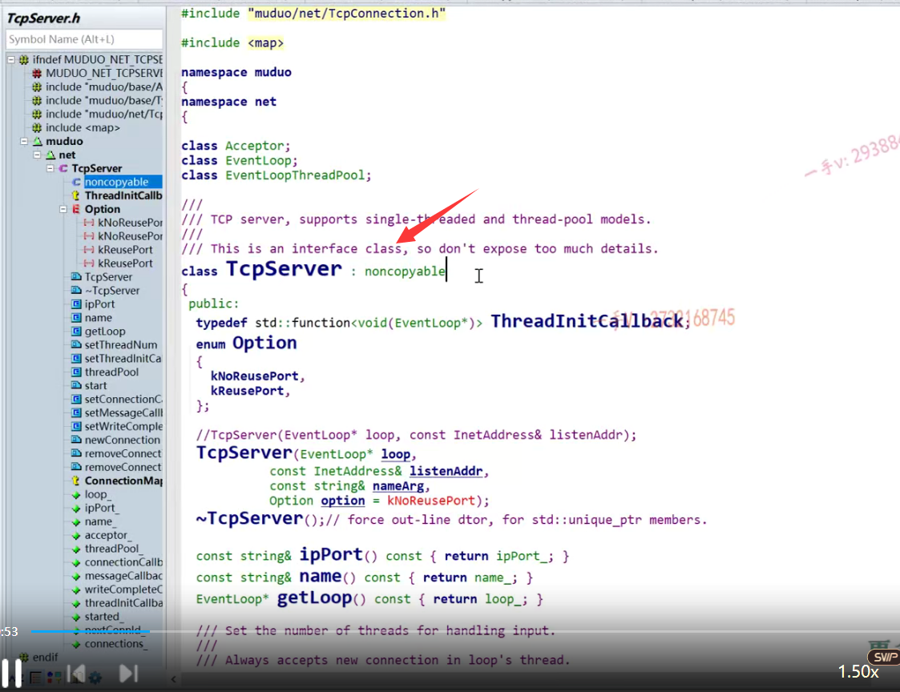
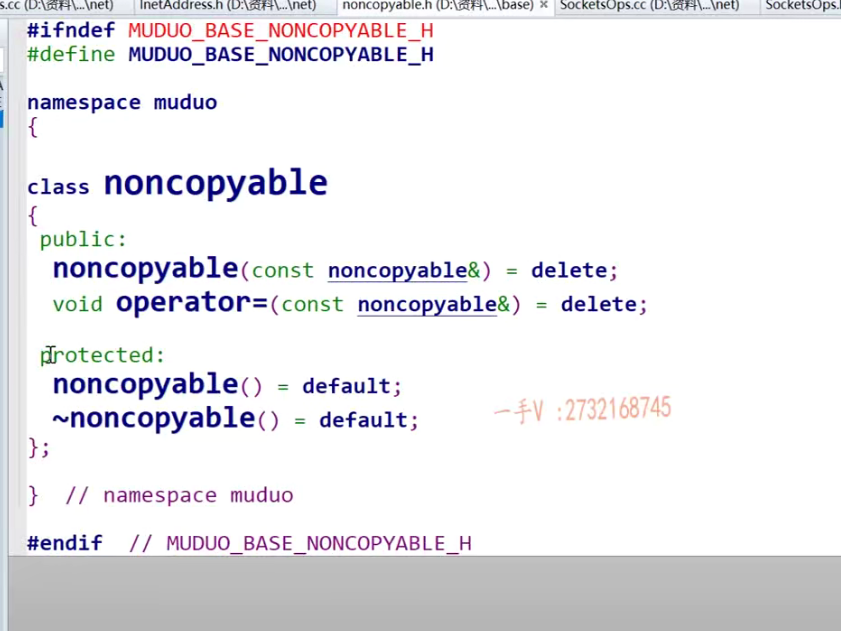
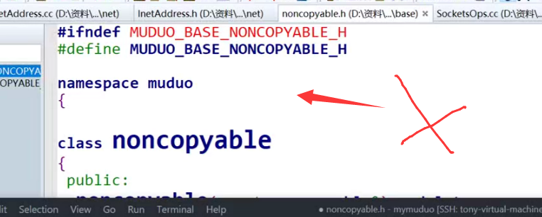
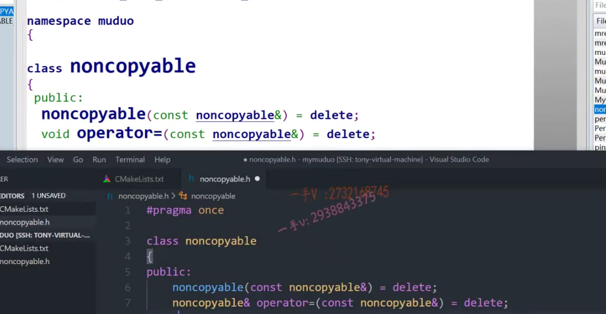
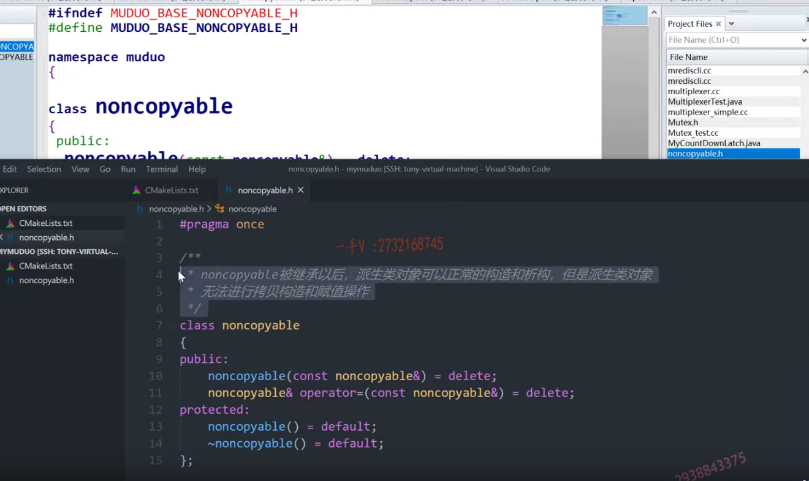

这节课呢，我们来继续说下一个问题啊。


那么在代码上，不管你是用它的这个接口类TCP server编写服务器，

还是用TCP client呢编写客户端程序。

还是你在看它源码的时候呢，看很多相关的类啊，像包括event loop啊，socket呀，accept啊。

对吧，包括它的channel，connection你都会发现一个特别有意思的东西，

就是它每一个类都是从这个noncopyable继承而来的啊。


那么同学有没有问一下呢？这个东西到底是啥呀啊？

### class默认继承为私有继承

这个没有写继承方式，默认是个什么继承？

啊，前面儿是class的话，就是私有继承，

前面儿是struct的话，默认就是公有继承，这个都是C++的一些基本知识啊。

啊，大家在剖析源码的时候呢，把你学的东西呢，都能够从脑子里边倒出来，对吧啊，这就是知识的一个综合应用嘛啊。

不要学了，放到那儿面试官问的时候呢，你还想不起来，那你学那干啥呢？




#### delete

那么同学们。我们这个noncopyable从名字上来看

就是n就是不啊，copy就是可复制的，不可复制，

我们看一下进去。啊，这个noncopyable。它是把这个什么呀？

==它是把它的这个拷贝构造跟赋值直接给delete掉了啊==，

这是C++11的操作，我们能明白对吧？

#### default

另外呢，就是呃，这是个default，这是默认的这个构造跟默认的析构，这也是C++11的这个新语法意思相当于就是给后边儿直接套了一个空大括号儿，默认实现就行了，因为这两个函数编辑本身默认就可以产生了，对吧啊？



#### protected

这是个保护的，保护是什么意思？

就是派生也能访问，但是外部是不是无法访问啊？


### 继承noncopyable让类不可考虑构造，也不能赋值

也就是说你看啊，这里边有这么一个特点。

TCP server的对象能创建。

因为派生类对象的创建会调用基类的这个构造函数啊基类的这个构造跟析构呢，人家是保护的派生类，是可以访问的，

所以这个不会影响派生类对象的创建跟析构对吧啊？

那么但是这里边把这个基类的这个拷贝构造跟赋值直接delete掉了，那么同学们注意，

当我们在使用的时候呢，去对TCP server的对象进行拷贝构造跟赋值的时候呢，

你注意派生类的拷贝构造跟赋值肯定要先调用基类部分的拷贝构造，跟赋值啊？

然后才是派生类特有部分的拷贝构造跟赋值嘛，

但是基类部分的拷贝构造跟赋值函数直接被delete掉了，

那也就是说我们的这写的这个类啊，从这个类继承而来，

它的好处就是直接让这样的类不可考虑构造，也不能赋值了。是不是啊？


这个设计呢？是不错的，为什么呢？

有些同学说那搞得这么麻烦干什么？

我也可以不从他这个继承而来啊。

我可以把TCP server的拷贝构造跟复制在这里边delete的掉啊，

当然可以了，是不是那但是你想一想，这是一个大的项目，

这个项目里边有100个类，那你要让100个类都不能够进行拷贝构造跟复制的话，你要在这100个类里边写100次把拷贝构造跟赋值delete掉吗？

这肯定是不那么好看的，是不是这种设计非常的丑陋啊？


呃，这样的设计非常不错。那么，利用了这个派生类的这个构造析构，拷贝构造跟赋值都会调用到这个基类相应的方法，这么一个逻辑啊。


以非常简单的以继承的方式来让派生类对象能构造析构，

但是无法进行拷贝构造跟赋值。

OK吧啊，所以呢，我们这节课这个任务就是把这个noncopyable这个类输出一下就行了啊，

我们不拷贝吧，我们自己来写一写，写了问问大家也去想一想啊。

如果让你去写的话，让你去限制一些类，不能进行拷贝工作跟复制的话，

你会不会想到这样的方法？还是说仅仅我只是会简单的。

### 其他方式取消类的构造和赋值

#### private    delete

==把当前这个类的拷贝构造跟赋值放到private里边==，或者说是用CA加幺幺的delete把它们delete掉。


你会不会想到这种方法呢？我们定一个这个头文件啊，program once

这跟大家之前接触到的什么if nodefine啊，define end if

就是防止头文件被重复包含一样。

只不过那个是语言级别的，这是编译器级别的，

现在的编译器都是支持这个pragma once对吧啊，

防止编译器的呃，防止这个头文件被重复，包含这比较轻便啊，

我们写这个就行了。

在这里边另外一个就是我们为了简单，我们就不写这些。

在这里边，我们就不写这些namespace了好吧啊，




我们直接写这个noncopyable注意吗？

我也是学人家大神去抄代码，抄就得有个抄的样子，

不要老是ctrl c ctrl v啊。拷贝粘贴，这个是公有的，

因为你都把方法delete了，是不是这个方法都已经被删除了啊？

这个相当于就不能用了啊？啊，不能用了，

所以你也无所谓，把它放到什么私有的里边没有关系了。已经不用了啊，

#### 返回引用还是void，都无所谓，连续赋值就是引用

我不拷贝他的，拷贝我的。const.引用这是拷贝构造delete掉。

然后再把赋值这赋值重载函数返回void返回当前对方的引用无所谓，就看你做不做连续赋值。现在已经被delete掉了，其实都不用考虑那么多了，对吧啊？人家写个void还是有意义的，最起码比我少打几个字母。





对的吧啊。因为你都用不着了嘛啊。

在这儿呢。你的拷贝构造跟这个赋值被delete，

但是你的构造跟析构呢？还是要实现的，

==因为派生类对象的构造是要调你基类的构造包括析构也是一样的，对吧啊？==

这个我们也给它写一个default。相当于就是默认实现啊。

好了，加上注释，我们给我们的代码加上一些详细的注释啊各位


### 注释

noncopyable被继承以后派生类对象可以正常的构造和析构，

但是派生类对象无法进行拷贝构造和赋值操作对的吧啊，


==主要是因为派生类相应的操作都要调用基类相应的方法，

这已经被delete掉好不好？

## 总结

那么，在我们写具体的这个派生类的时候呢？

我们不想让他去做这些事情，拷贝和复制。

我们直接从noncopyable继承而来就可以了，希望大家学到。这种手法啊，好这节课的内容，我们就说到这。




# 其他

### 补充知识点

### protected继承

#### 什么叫这意味着派生类可以使用基类的protected成员，但不能通过派生类对象直接访问这些成员。，举例说明


当派生类以protected方式继承基类时，它可以直接访问基类的protected成员，但外部代码无法通过派生类对象直接访问这些继承的protected成员。

举例说明如下：

```C++
#include <iostream>

// 基类
class Base {
protected:
    int protectedVar;

public:
    Base() : protectedVar(10) {}

    void showProtectedVar() {
        std::cout << "Base's protectedVar: " << protectedVar << std::endl;
    }
};

// 派生类以protected方式继承基类
class Derived : protected Base {
public:
    void accessProtectedVar() {
        // 派生类可以直接访问继承的protected成员
        std::cout << "Derived accessing Base's protectedVar: " << protectedVar << std::endl;
    }

    void modifyProtectedVar() {
        // 派生类可以修改继承的protected成员
        protectedVar = 20;
    }
};

int main() {
    Derived derivedObj;
    
    // 错误！无法通过派生类对象直接访问继承的protected成员
    // std::cout << "Derived object's protectedVar: " << derivedObj.protectedVar << std::endl;

    // 错误！无法通过派生类对象直接调用基类的成员函数
    // derivedObj.showProtectedVar();

    derivedObj.accessProtectedVar(); // 正确，通过派生类的成员函数访问基类的protected成员
    derivedObj.modifyProtectedVar();
    derivedObj.accessProtectedVar(); // 正确，通过派生类的成员函数修改并访问基类的protected成员

    return 0;
}

```

在上面的例子中，我们有一个基类`Base`和一个以protected方式继承`Base`的派生类`Derived`。在派生类中，我们可以直接访问基类的protected成员`protectedVar`，而在外部代码中，我们无法通过派生类对象直接访问或修改`protectedVar`。通过派生类的成员函数，我们可以访问和修改继承的protected成员。


#### 什么叫外部无法访问，举例


外部无法访问是指在派生类以protected方式继承基类后，除了派生类及其成员函数外，其他类或代码无法直接访问继承的protected成员。

举例说明如下：

```C++
#include <iostream>

// 基类
class Base {
protected:
    int protectedVar;

public:
    Base() : protectedVar(10) {}

    void showProtectedVar() {
        std::cout << "Base's protectedVar: " << protectedVar << std::endl;
    }
};

// 派生类以protected方式继承基类
class Derived : protected Base {
public:
    void accessProtectedVar() {
        std::cout << "Derived accessing Base's protectedVar: " << protectedVar << std::endl;
    }
};

// 其他类
class OtherClass {
public:
    void tryAccessProtectedVar(Derived& derivedObj) {
        // 错误！其他类无法直接访问派生类继承的protected成员
        // int value = derivedObj.protectedVar;

        // 错误！其他类无法直接调用派生类继承的基类成员函数
        // derivedObj.showProtectedVar();
    }
};

int main() {
    Derived derivedObj;
    derivedObj.accessProtectedVar(); // 正确，通过派生类的成员函数访问基类的protected成员

    OtherClass otherObj;
    otherObj.tryAccessProtectedVar(derivedObj); // 错误！其他类无法直接访问派生类继承的protected成员

    return 0;
}

```

在上面的例子中，我们有一个基类`Base`和一个以protected方式继承`Base`的派生类`Derived`。然后我们有一个其他类`OtherClass`，该类试图访问派生类的protected成员`protectedVar`和调用派生类继承的基类成员函数`showProtectedVar()`。然而，这些访问操作都会导致编译错误，因为外部的`OtherClass`无法直接访问或调用派生类继承的protected成员和成员函数。只有派生类及其成员函数可以直接访问这些protected成员。


## 防止头文件重复包含


防止头文件重复包含是为了避免编译时的冲突和编译错误。在C++中，可以使用以下方法来解决头文件重复包含的问题：

1.  使用预处理器指令：在头文件的开头和结尾使用预处理器指令，通常是条件编译指令，如#ifndef、#define和#endif。

```c++
// 示例头文件 "example.h"
#ifndef EXAMPLE_H
#define EXAMPLE_H

// 这里是头文件的内容

#endif // EXAMPLE_H

```

2.  使用#pragma once：这是另一种防止头文件重复包含的方法，它是非标准的，但被广泛支持。

```c++
cppCopy code// 示例头文件 "example.h"
#pragma once

// 这里是头文件的内容

```

使用以上方法之一可以确保头文件只被包含一次，无论在多少个源文件中使用，从而避免重复定义和编译错误。当编译器遇到#ifndef或#pragma once时，会检查相应的宏是否已经被定义，如果已定义，则跳过整个头文件内容，否则将头文件内容包含进来。

注意：在C++中，头文件通常包含类声明、函数原型、宏定义等内容，而实际的函数实现和全局变量的定义通常放在对应的源文件中，以避免多重定义错误。