上节课呢，我们给大家把这个noncopyable它的这个实现的意义以及功能作用给大家说了啊。

防止派生类对象进行拷贝构造或者是赋值操作的，

但是能够让派生类对象正常的构造跟析构啊，

# 完成muduo的日志系统

这节课呢，我们在完成另外一个任务，就是完成我们当前这个网络库muduo，网络库的日志系统啊，

日志对于一个软件来说呢，还是非常非常重要的啊。

很多时候当软件应用以后啊，正式的应用以后呢，

用GDP调试呢是有很多不便的，

那么日志是我们来处理问题啊。最直接的这么一个最佳的途径啊。

那么muduo库里边儿的这个日志，我觉得设计的还不是非常的好，

在很多的这个C++的这个日志里边儿啊。

呃，实际上都是用这种格式化字符的方式呢来进行日志的输出的啊，

因为这种格式化字符的这个日志输出。

啊，可以，这个很好的，按我们个人按作者的这个风格啊，进行一个输出对吧？啊，很好的去组织输出的格式

好，那我们这节课把这个日志相关的这个代码我们写一下啊。

我们定一个头文件log点h。

我们再定一个log点CC。

OK吧，这是我们日志相关的。

这是防止头文件被重复包含对吧啊？

## 步骤

首先在这里边儿大家来看我定一下日志的这个级别

## 日志级别

### info 跟踪一些核心的流程

基本上来说正式的日志最起码分成这几个级别就是info。

info是啥呢？info就是打印啊，打印一些重要的流程信息的啊，

大家运行muduo库以后呢，你会发现muduo库运行过程中随着客户端的连接。通信以及关闭。

muduo库本身人家的日志输出也是有的，对吧啊？

那么这info呢就是一个正常的一个日志输出。跟踪一些核心的流程啊，这是一种。

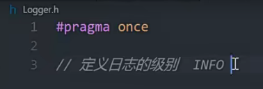

### error

那另外一种就是error。

error那样的话就是一些错误。

但是这些错误呢，是不影响软件正常继续向下执行的啊，

不是说这个error我就得exit好吧，这是属于这一类的错误。

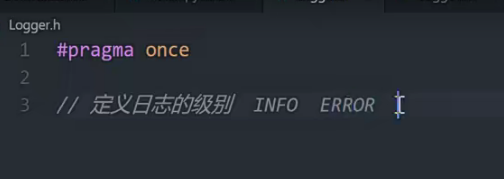

还有一种就是fatal 

fatal那就是毁灭性的打击，那就是这种问题出现的话呢，

系统是无法正常向下继续运行了啊就得输出关键的日志信息，然后exit对吧？

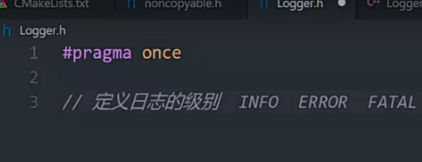

### debug

另外呢，就是debug就是些调试信息。

调试信息呢，一般来说是非常非常多的，可能我们在系统正常运行的情况下，会默认把debug日志呢会关掉啊。

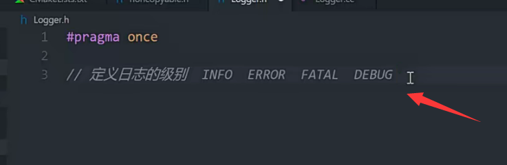

当我们需要去输出debug日志的时候呢，

我们才打开一个开关，比如说通过配置文件读取啊。

或者我们在这里边处理简单一点，我们就通过一个宏来控制，

如果你运行程序的时候加上一个宏，我就开启呢muduo库的这个调试的这个信息对吧啊？

这比较方便，那么这个我们就定义成一个枚举吧啊。

定义成一个log level。这里边有info。这表示是普通信息吧是吧？

还有error。这个是错误信息。

啊，然后是fatal。fatal是这个崩溃了call信息啊。

现在call down了是吧啊？call down这个无法挽回的啊，无法挽回的。

debug这个算是调试信息。

好了吧啊。OK，那么在这里边我们输出一个日志类啊。

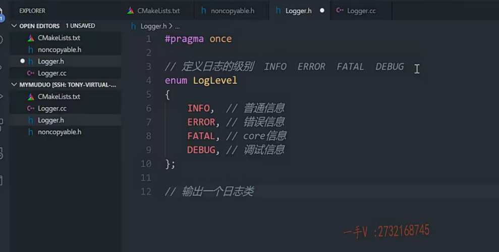

## 单例日志类

我们这个日志类呢？

跟这个我们写分布式通信框架框架，那个项目一样，日志类我们都写成一个单例就可以了啊。

这个是一个log。public.private.啊，

而且还不需要进行什么东西啊？不需要进行一个拷贝构造。

是不是啊？不需要进行拷贝构造跟赋值，那我们也可以利用起来。

### 利用noncopyable不需要拷贝和赋值

利用谁呀？利用我们的这个non copy。让他从谁继承起来呢？

从noncopyable继承下来是吧啊？

#### 单例

这是构造函数私有化。

然后呢，再给它加一个什么呢？

这是get或者instance吧啊。获取唯一的实例。获取日志唯一的实例对象

大家写代码的时候，把相关的注释呢，尽量加全一点啊，

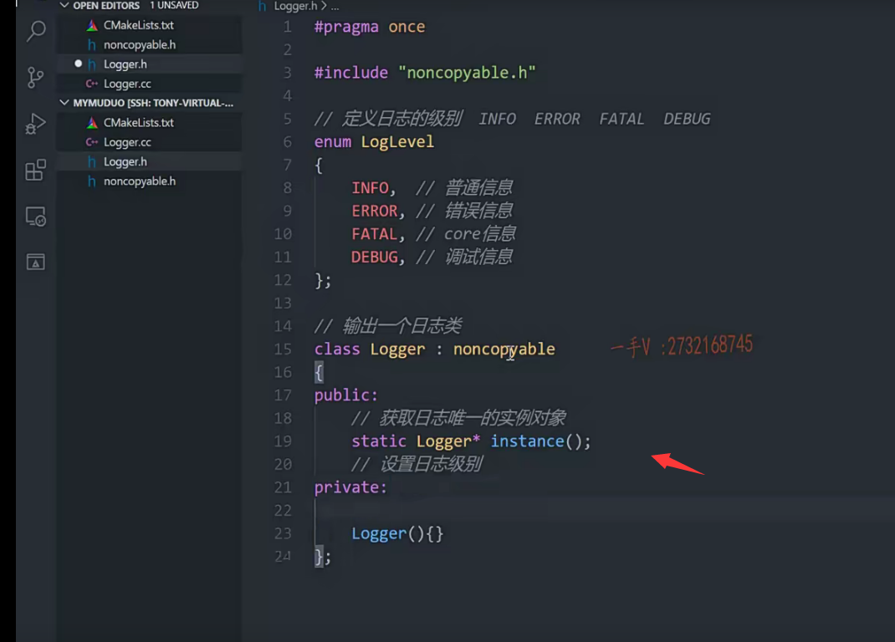

### 设置日志级别

然后设置日志级别，这级别是有的，

因为我们到时候输出的话呢，我们输出的信息里边儿肯定要分级别的嘛，对吧？

到时候万一出错的话呢，

我们打开这个，或者我们直接看日志，我们就搜那些error啊fatal啊，

造成我们系统这个软件运行。啊，就是产生错误的那些关键性的一些信息啊。

呃，在这呢！枚举就是一个整数啊！log level.

#### 为什么muduo给成员变量后面加杠

那么我们到时候写这个呃muduo库的代码的时候，大家发现啊，在muduo库里边，我们陈硕了大神去写类的成员变量的时候都是给成员变量后边加一个下横杠啊，那么大家可以从点点滴滴啊。

只要你有心，到处都是可以学习的东西啊，那么为什么他总是在成员变量的后边儿去加一个下横杠呢？

比如说我们看一下TCP server啊，大家看是吧，有些同学老是往前面加啊，

或者是m杠

首先呢呃，给我们成员变量去添加一些这些有意义的标准性的东西呢，

有助于区分成员变量跟函数的局部变量，对吧？

这是有意义的，或者说是还有的是都以小m开头或者是m杠，对吧？对吧啊，

那大家呢？有可能会问为什么不放到前边呢？

因为我们系统的一些变量啊，在定义的时候都是。写成下横杠什么什么什么，

所以呢，当你自己在写代码，写我们应用代码的时候呢，

==如果你也是定义以下横杠开头的话呢，很有可能跟系统级的一些变量产生冲突==

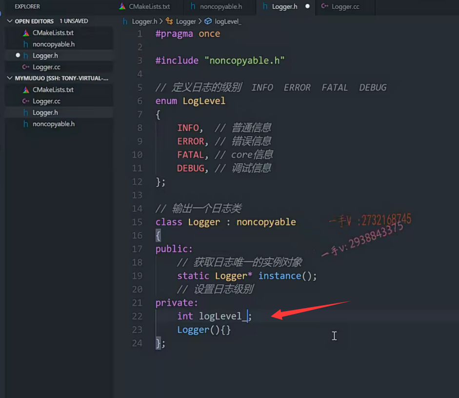

OK吧，所以这就是我们有一些这个项目的，这个C++项目的代码你会发现呢，

它保持的这种风格是把相同杠放在变量的后边是为了去和系统的变量啊，

不产生冲突好吧，

因为系统的一些变量。它是以下横杠在前边开头的啊，这个是定义日志级别，

#### 设置日志级别

我们设置一下set log.level

好吧啊，再提供一个写日志的这个接口吧。log.

写日志的接口，我们接收的就是个字符串吧啊，字符串我们直接用C++的了。那么在写的时候呢？

这个是库里边的，这个是我当前这个项目里边儿了啊，

我们把它区分开放在进行一个空格，进行不同的分类啊，

这也是人家一些好的编程规范里边儿所要求的啊，好的编程规范要求写的代码呢就是。嗯，写出来呢，非常好看啊，

因为这个写代码确实是主要是给别人看的，不是给自己看的啊。

这是一个message。好，那这个。类我们在这里边类型的定义，我们输出完了，

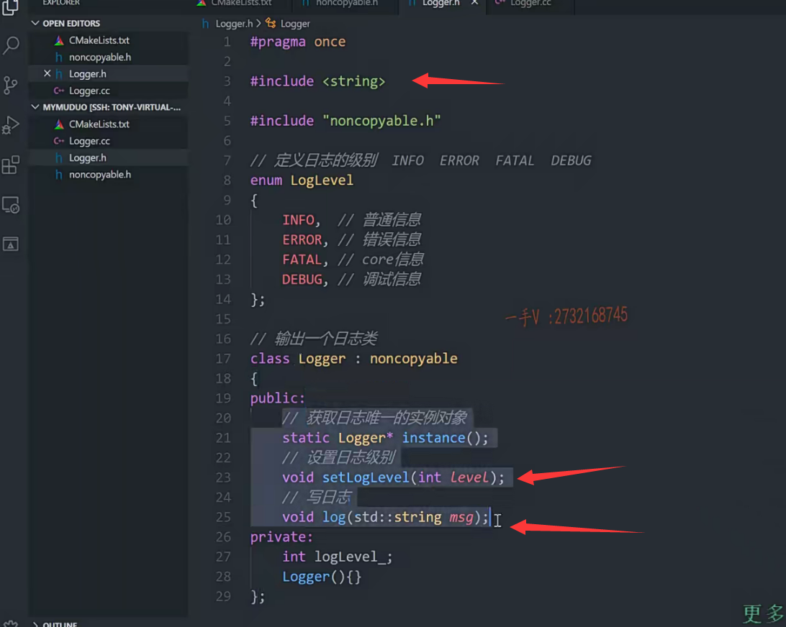

### logger.cc完成定义

然后我们把它呢拿到哪里呀？

拿到log里CC里边啊include。log点h啊。

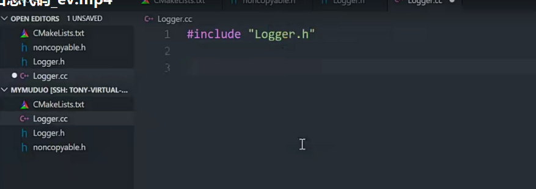

### 静态函数的定义不要static

我们来看看。在外边儿写的话，就不需要static了。

前边加上这个作用域啊。

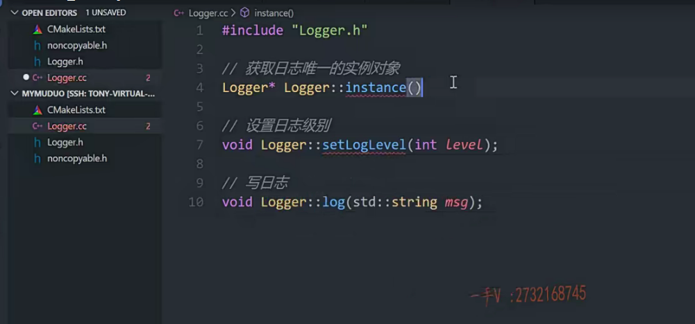

单例非常简单，实现一个log。然后返回这个log就行了。

对吧，而且这还是一个线程安全的啊，非常的精简。

no，这是个引用吧。我们写的是什么？哦，我们写的是这个返回的一个指针是吧？返回引用吧。你用调用方法的时候，用点儿也方便，

#### 修改为返回引用

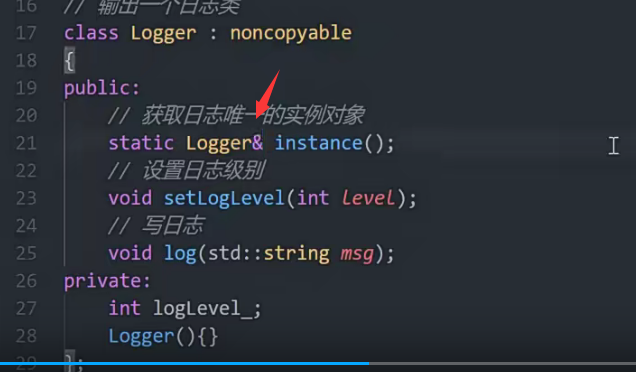

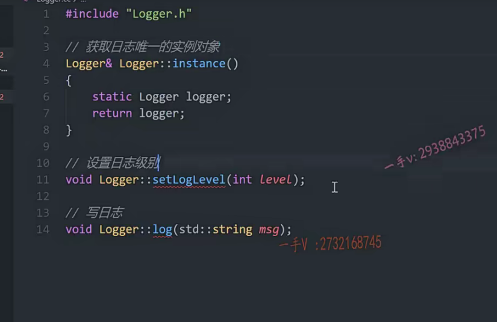

对吧啊？也方便。set log level，那这个也简单。

log level.等于level。好了吧啊。

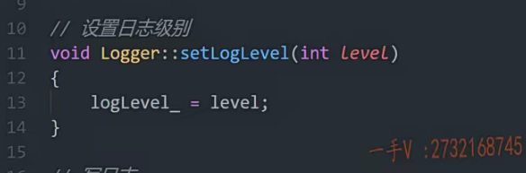

### 写日志 按照自定义格式

那这个就是写日志了啊，写日志的话呢，

我们这个是直接打印出来，

打印到我们标准的这个控制台上就可以了。

好的吧啊，所以呢，我们想一种格式啊，我们想这样去打印啊。

先打印它的这个级别信息，就是什么info啊fatal啊error啊？debug这些东西，

然后再打印一个time啊打印当前的年月日及时间信息。

okay吧，然后再打印叉叉叉再打印你这个message。你传递进来这个message。

好的吧啊。

#### 打印info

所以在这儿呢，我们得先switch一下啊，switch谁呢？

switch这个log level啦。

switch这个了先是谁呢？info。info的话就是打印。

那我们还要包含一下。lOstream对吧？

这个打印一下谁呢？这个打印的就是info。

好的吧啊，打印info。

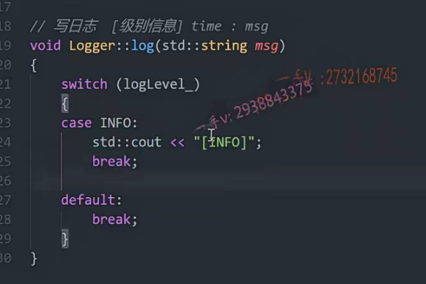

再case我们直接复制一下吧。

error.还有一个是。fatal对吧？还有一个是debug。调试的信息啊。

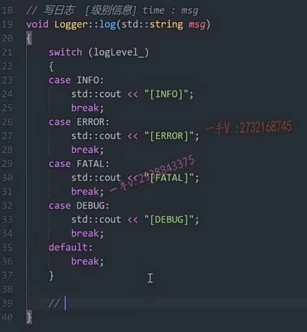

#### 打印时间

这个打印完了以后。是不是打印时间啊啊？

再打印时间和message啊？

那我们这个时间这个类呢，在muduo库里边也有啊，

你写muduo库你就知道注册那个onmessage方法的时候，

第三个参数是不是就是一个什么东西呢？第三个参数，你message call back。第三个参数就是这个timestap。是不是一个时间的这个邮戳啊？

#### muduo中的timestamp

在muduo库里边有这个timestap这么一个类。

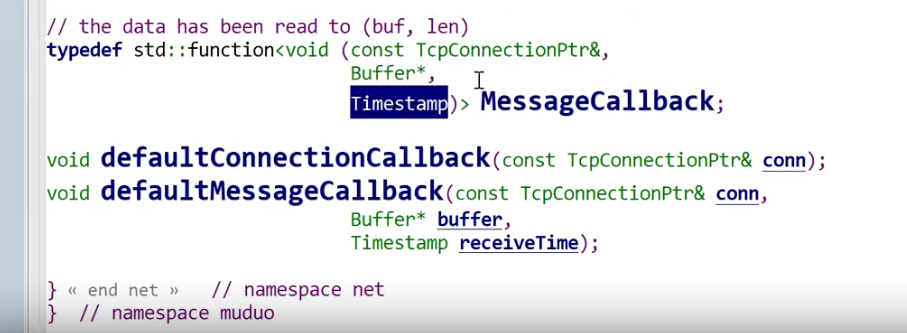

它主要提供了一个now方法，可以获取当前的这个时间任务。

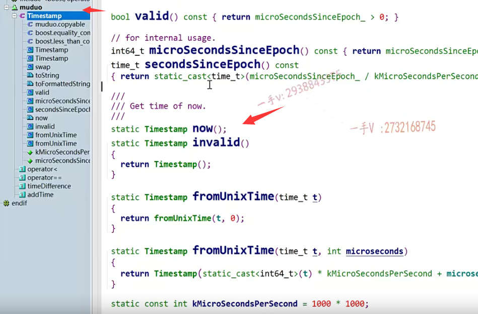

我们在讲解的过程中，也是带着大家去学如何去剖析源代码。

源代码写的非常的全，实际上很多方法我们。在剖析它核心逻辑的时候，根本就用不着，根本就用不着啊。

好，那在这里边儿，大家来跟我看一下啊，假如说我们把这个类叫做time stap啊。

它里边主要的两个方法呢，你实际上你跟着它的逻辑，

一看它里边主要两个方法，一个就是now get time of now 获取当前时间。

啊，然后呢？当前时间它是用成员变量一个int64一个长整形来存储的啊。

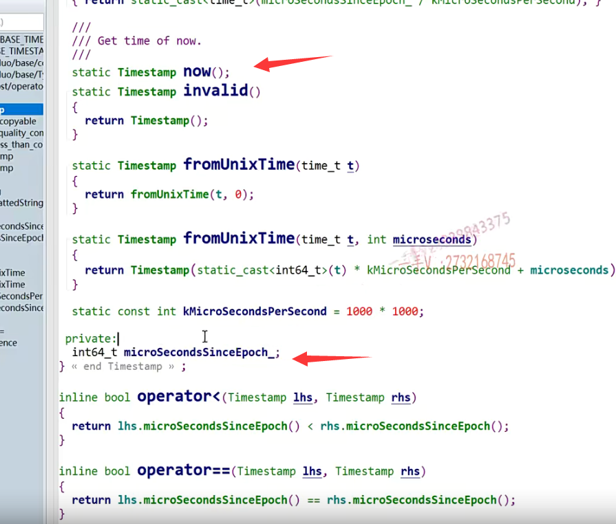

#### 库里有自定义的toString

然后呢？他把这个长整形表示的时间可以通过tostring转成这个年月日时分秒。

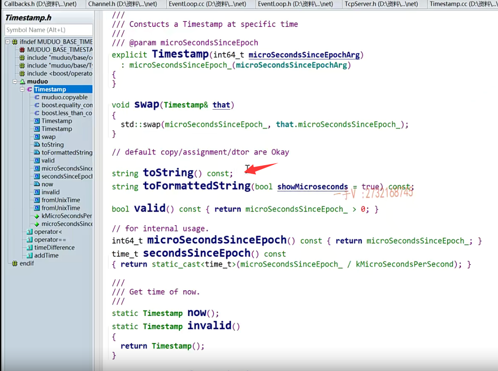

实际上，主要就是构造函数。就是这成成员变量。

还有一个now，还有一个tostring，主要就是这几个方法。

好的吧啊，那这样吧啊，我们先把它直接给用上啊，我们先把它直接给用上，

一会儿我们把timestamp这个类写完以后，我们再给它，反过头来再给它补上。

啊，涂上就可以了好吧啊。

那么这个是cout在这里边，我们是应该是先打印谁呀？

先打印时间对吧？这要print。time好的吧啊print time

一会我反过头来再给大家补上。

再输出一下，上面那个message。就可以了。

要不是反过头来补上就行了啊。

啊，整个儿的这个日志呢？在这里边儿打印，我们就这样打印就行了，就这么一种格式。

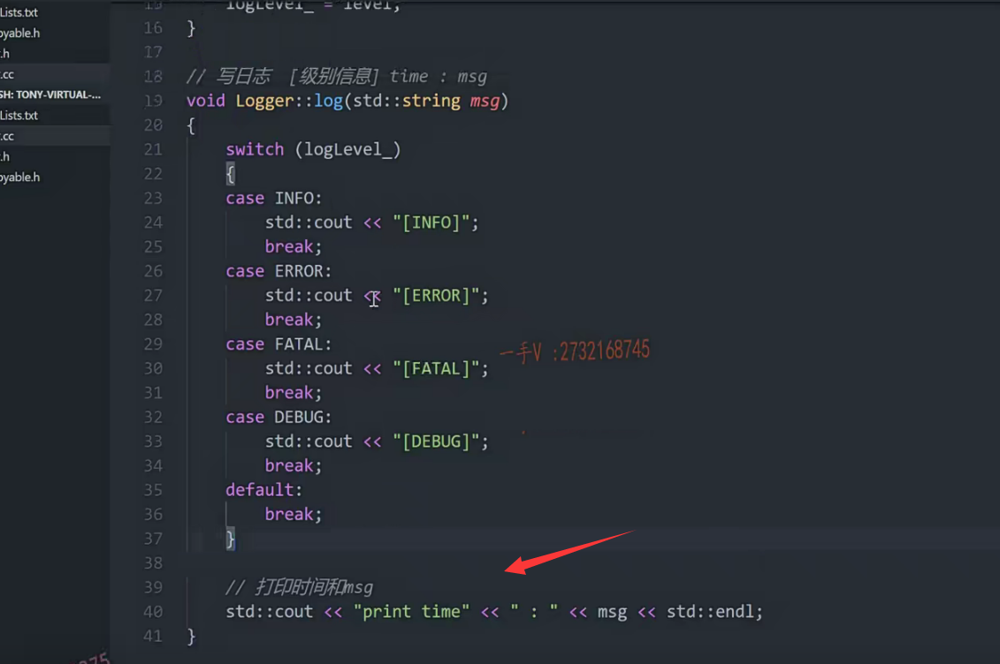

### 定义宏使用户更方便

好了吧啊。然后呢？那用的时候呢？

我们不需要用户去获取这个日志的这个实例，

设置日志级别，再写日志。

用户关心的是我要这个写日志。对不对？

他关注的是把这个写下去打印出来啊，你给他，你要让他获取实力去设置日志级别，

这些东西实际上你都可以定义成简单的宏。

啊来让用户的使用使用的更方便一点啊。

好，我们分别定义四种宏吧好吧啊，对应的就是。这四种日志级别啊。呃，

第一个是个什么呢？

loginfo吧。loginfo，

然后我们用的时候呢，也非常简单嘛，应该是这样用的。

loginfo.嗯，这个是百分之s呀，百分之d格式化字符串对不对？

然后后边给的就是arg 1 arg 2给的就是参数嘛。对不对？

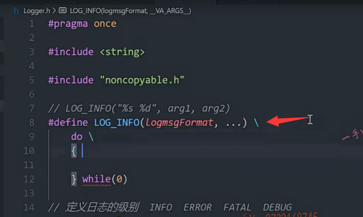

在这我们写一个。log message.format吧。

然后后边就是用红来接收，可变参这个的这些参数对不对？

#### 防止宏产生错误，做出do while

okay.我们在大型的这个项目里边儿，在正式的项目里边儿去写这些宏的时候呢，这个宏代表好几行代码的话。我们为了防止它产生错误，一般都是用个do while。对不对啊？

为了防止造成意想不到的一些错误，这个应该大家都有经验是吧啊？

这是编程上需要强调的啊。

do然后呢？这个是干嘛呢？

这是先获取logger instance 先获取log。等于log。instance.是不是？

然后再调用它的什么东西呀？

调用它的方法设置日志级别。设置info。对不对啊？

设置这个info。

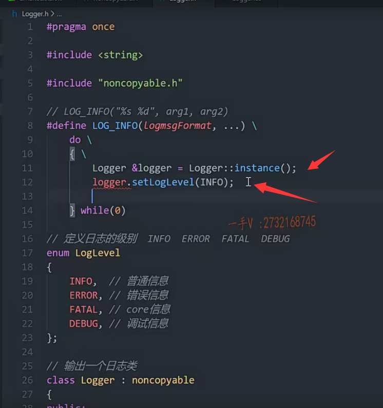

#### 格式化字符串 

#### snprintf 系统提供的获取可变参数列表的宏

然后呢，我们就开始填什么东西了？

然后我们就可以开始填这个字符串了格式化字符串了啊。

我们就说定一个buffer吧，幺零二四。

然后再调用这个方法啊，调用是printf的这个方法。buf幺零二四。

==snprintf这是一个比较安全的，可以指定缓冲区的长度的啊==。

log message format还有一个就是使用我们编译器给的这么一个获取可变参列表的这么一个宏嘛？杠杠va杠args。应该是这个，

我们之前在做项目的时候也使用过。

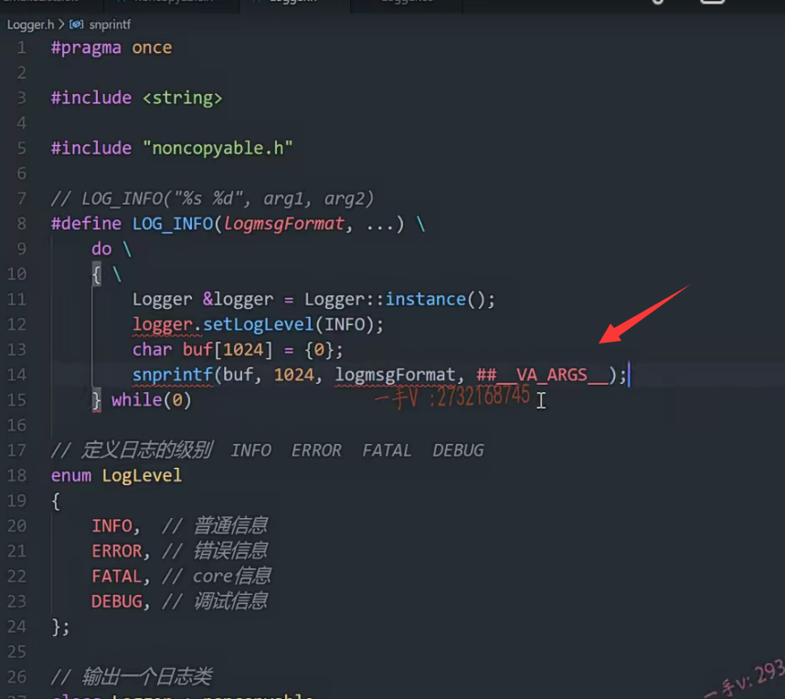

#### 将log写出来

是吧，最后呢，我们log点什么呀？点log。把这个buffer填进去就可以了。

小写吧。就是小写的是吧？

好了，那就这样子，这个在怎么样啊？

哦哦。这都没有加换行。

==在写宏的代码的时候呢，你要分多行的话，每一行的末尾都要加一个斜杠，而且斜杠的后边儿呢，不能再加空格儿。==

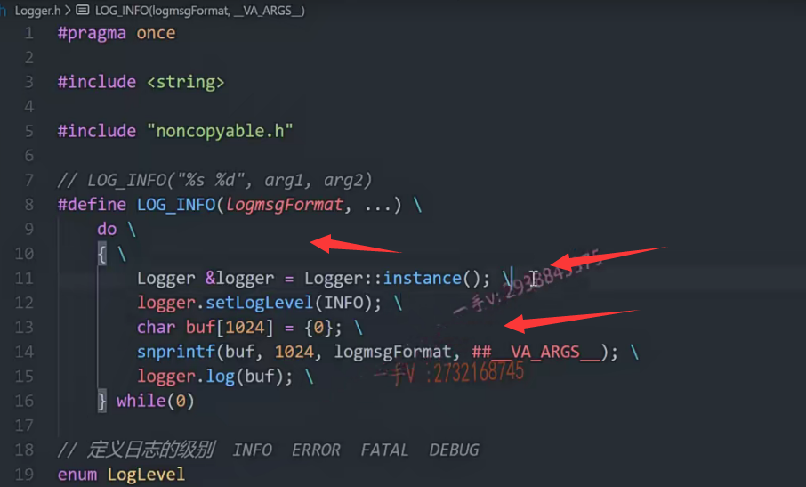

好吧，这应该没什么问题吧？好，我们把它给复制一下啊。

这儿就分别是。这使用起来就。非常好使用了啊。

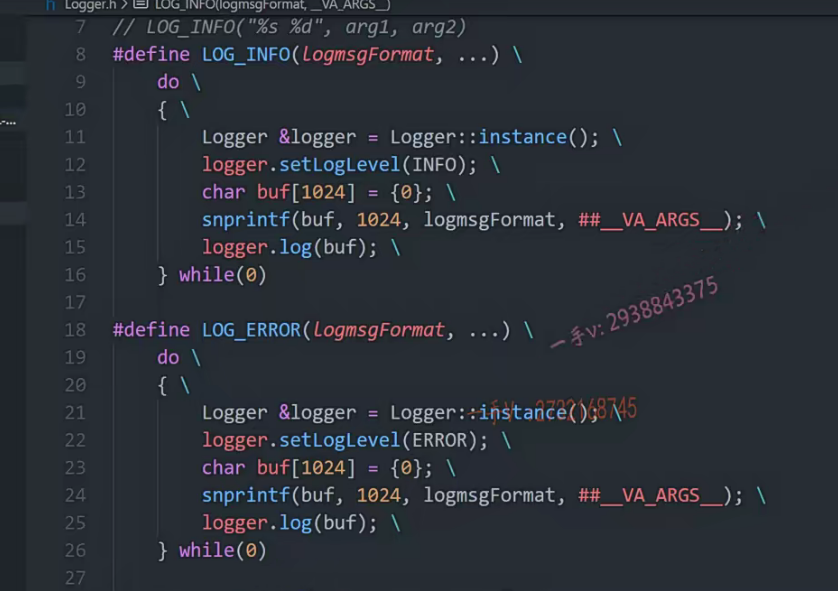

这是fatal。这还有一个就是debug。debug啊。

我们前面说了debug的信息一般比较多是吧？

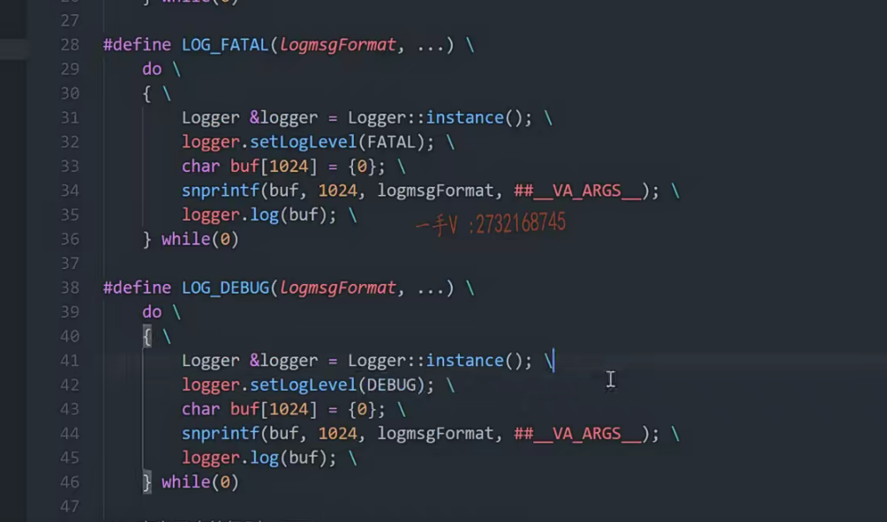

所以呢，默认打印出来呢，会非常非常的多影响我们查看正常的一些流程，

而且我们软件正常运行的话呢。

不断的去打印这些调试信息，也会造成我们这个软件运行的这个负担啊，

会拉低效率的，毕竟这是一个IO操作嘛，对吧？

所以呢，对于调试的信息呢，一般运行起来默认都是关闭的啊，

我们通过宏给它打开了啊，定一个什么样的宏呢？

就是if define。大家起个名字说叫做MU debug。muduo得bug是吧啊？

如果呢你定义了这个。那就输出正常的这个调试日志的信息啊。

else.那就是没定义的话，那这个红就是空的。

那相当于log debug。啥也不输出。是不是啊？

正正合我们的意思。

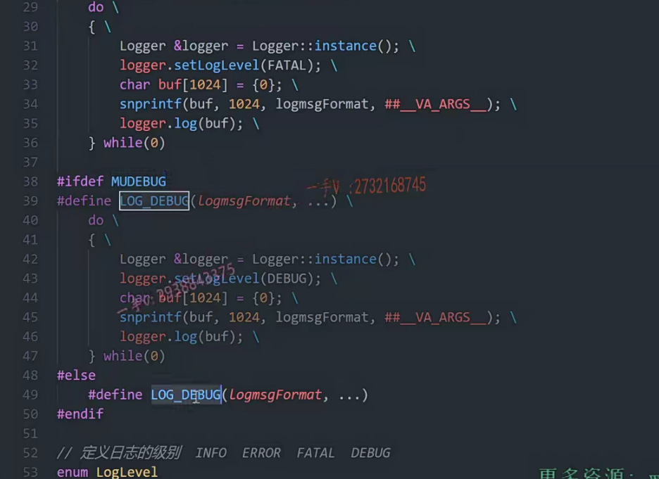

okay，那么这个日志的代码呢？

我们就写到这了。

我们表达的意思呢，大家是否能够明白呢？

到时候用户用的就是这些loginfo log error log fatal。

啊，这些东西好的吧啊。

他不需要自己再去创建这个类的对象了啊。

这使用起来非常简单，使用的话就像这样子啊。

## 总结

### 下一节课补时间类

好，那这节课我们的这个任务就到这里啊，

希望大家呢，也能跟着这堂课。

把我们这个项目的这个日志的这个模块儿的代码呢，也输出一下这块儿还欠一个时间，

对吧？我们下节课把时间的这个类呢，处理完了以后。再把相应的代码补到这里啊。

这节课的内容我们就先说到这里。