上节课呢，我们把这个项目的日志相关的这个代码，

我们写了一下啊，我们说它用到了这个时间类，

而且我们muduo库呢？

像我们的这个TCP server啊，eventloop也都用到了这个timestamp这么一个时间类啊，

那我们这节课呢，主要就把这个时间类给大家剖析一下

我们这个把不相关的啊，不相关的我们都不要啊，不要影响我们大家查看它的这个核心逻辑啊。

大家可以看完，然后自己操作一下啊，一步一步操作一下time stamp.h。

timestamp.CC。像这个后缀名是cpp cc c叉叉，这都属于标准的，

这个C++的这个原文件啊呃，不做区分不做区分，根据你具体做的项目而来。pragma once在这里边儿。

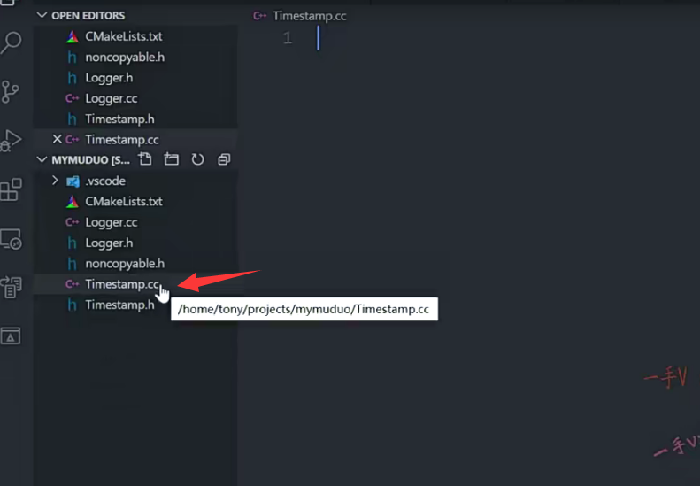

## 步骤

首先呢,我们把它的这个成员变量写一下。

它的成员变量是个什么东西啊？是个这个int64对吧？

是一个长整形这么一个变量来表示什么东西呢？

来表示一个时间的一个长整数啊。

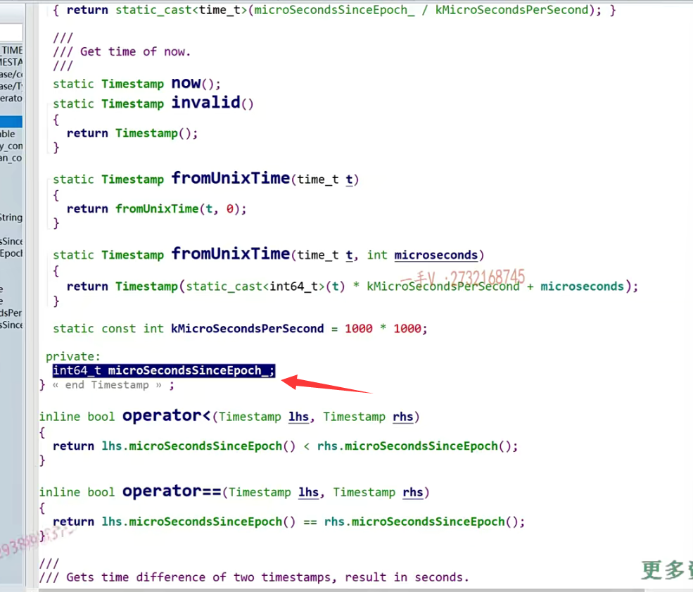

这里边儿定义还怎么样？还起冲突了是吧？

这个我们看一下啊，包含一下这个头文件。

在这个里边呢是吧？

这个不会产生二义性了啊。

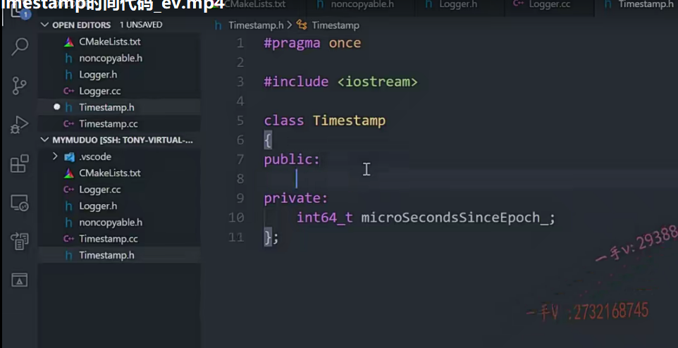

好在这儿呢，我们需要的这个方法呢，有它的什么呀？

有它的这个默认构造，还有它的这个带参数的这个构造。

大家来看一看。是这个吧？okay.

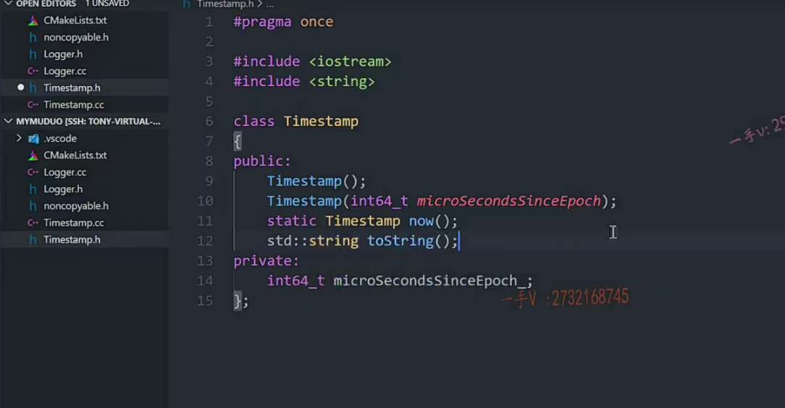

那么是一个int64_t？该参数的构造。还有一个就是它的什么方法呢？

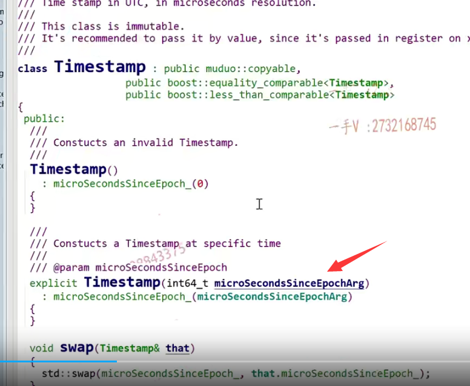

就是它的这个now方法。获取当前的这个时间，

还有一个就是获取这个当前时间的一个年月日时分秒的这么一个格式的一个输出啊。

这个是需要字符串类型，我们把字符串类型包含一下。

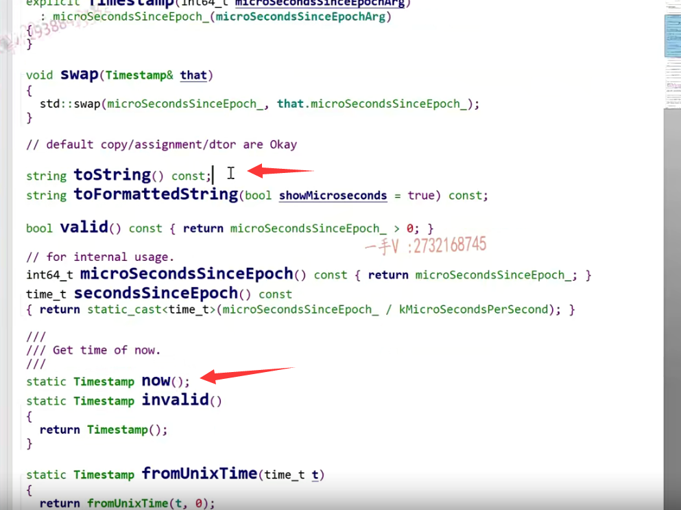

然后就是一个toString这么一个方法。

写成这个长方法吧。考虑比较周全是吧？

这是一个只读方法啊。实际上，我们要这个timestamp的这几个方法就可以了。好的吧啊，就可以了，我们足够完成我们的任务了，

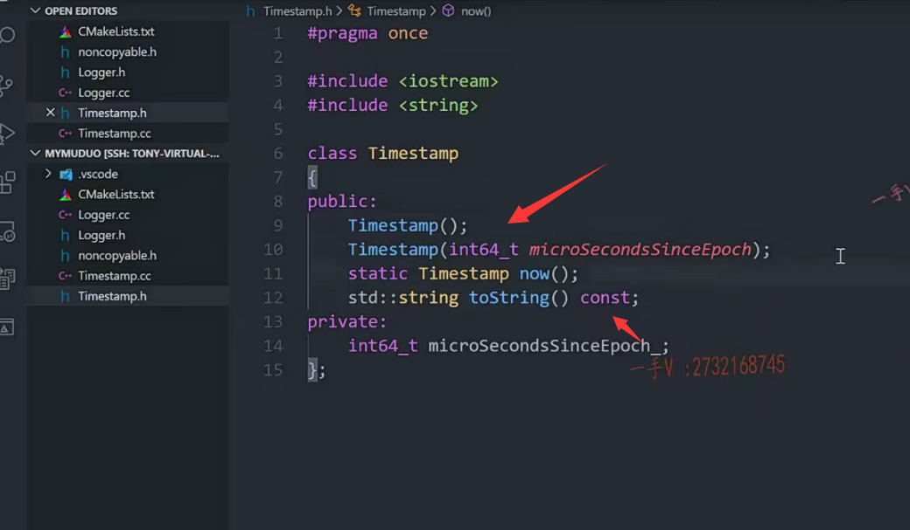

我muduo库也足够使用，这里边它提供了很多很多其他的方法，实际上呢？

不用也可以，很多东西都没有用着，只有在特定的场景下，可能你去调用它会获取一些相关的信息，但是我们现在不需要啊。

那么在这呢，我们把这些方法呢？贴到相应的CC文件里边去写一下啊。

time stamp.h。

那么这是它的这个什么东西啊？

这是它的这个默认构造。

把它的这个成员变量直接成零吧，因为默认构造嘛，啥信息也没有，对吧？

a.这个是得用参数成员变量初始化一下啊。

好，这就可以了。

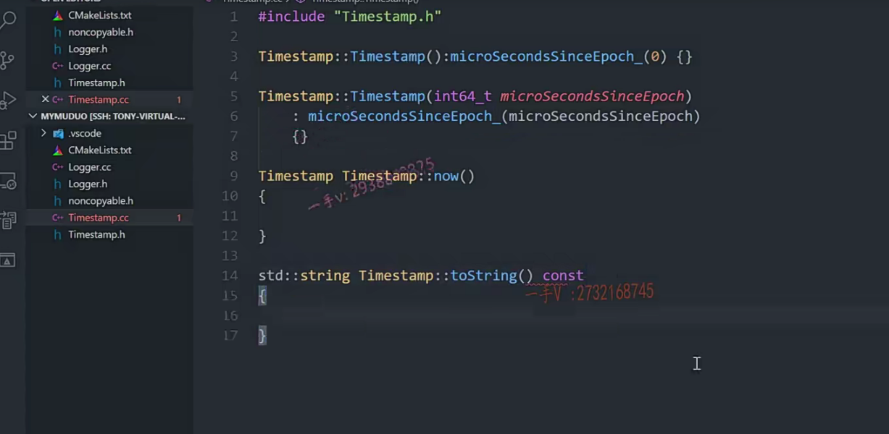

### explict关键字

now大家来看，想一想啊，你先想一想，这个now跟这个tostring怎么写？

我们看看它的这个源码的实现啊。

大家会发现有一个比较有意思的东西啊，

就是我们刚看到它的这个带参数的构造呢，前面都写了explicit。

啊，实际上你在看muduo库源码的时候，

你在看陈硕写的这个类的时候啊类的这个带参数的构造函数的时候，

你会发现它都加了这个explicit。

其实你想一想也是非常有道理的，为什么呀？

因为呢，如果你不加explicit，也就意味着这样的类对象就这个构造函数是

==支持相应的这个int64_t这个类型跟timestamp这个对象的一个隐式转换啊，==

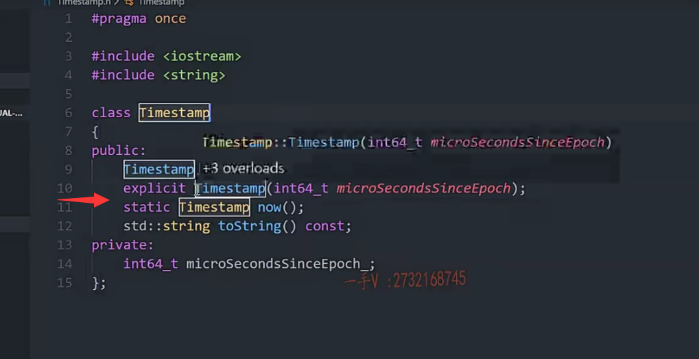

你在写代码的时候呢，很多时候你可能看到的。你可能想到的就是你看到的，看到的就是你想到的，

实际上你并没有想到那一句竟然会发生隐式对象转换，对吧？

对吧，很多时候呢，代码表现出来的这个行为呢，可能跟你想的千差万别，

所以呢，为了能够更好的控制代码的这个行为。

啊，想让人家带参数的构造函数呢，先explicit就必须指明你去构造一个timestamp对象，

它才会调用这个构造或者显示转换是允许通过的，

就是你在代码上已经明确表示了，我是需要对象而不是需要隐式转换对象，

对吧？这也是防止我们程序出现最后的这个程序的这个行为，跟我们预想的不一样啊。

所以大家这一招也要学上，可能平时大家学explicit都知道它的含义，写的时候呢，基本上来说没人用啊。

实际上呢，你还是要用一下它的，还是有好处的啊。

那么这个now，你看它是实现了什么东西呀？

now在这里边啊。

那我在这里边儿相当于就是获取了一下，它调用了一个系统的这个API函数

get time of day。

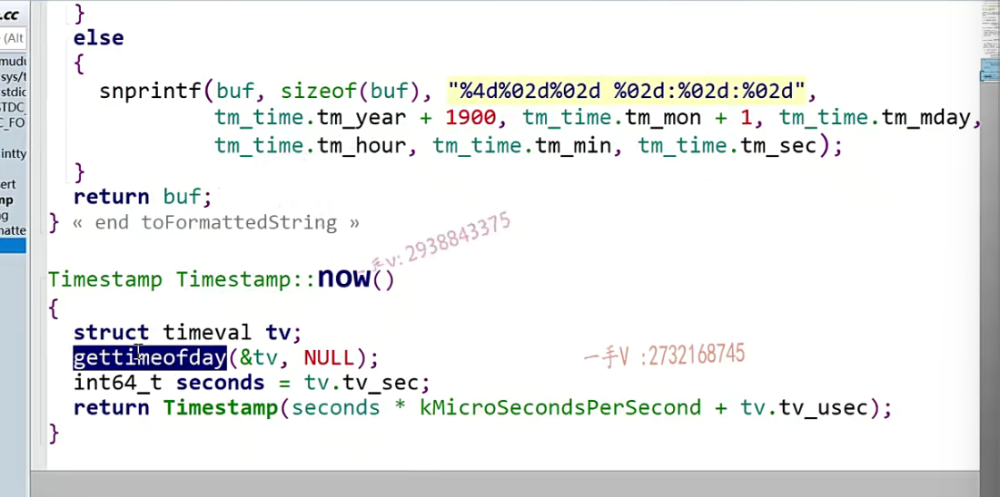

#### 感觉陈硕写的复杂了

#### 我们利用time.h

哎呀，我觉得这个他有点儿。

我们两行应该就能完事啊，就是调用什么东西呢？得用那个time那个函数就行了嘛。

time.h。

啊，在这里边就是time_t

这是一个指针是吧？我们用这个就行了。它参数是个指针嘛，是不是啊？

如果是个空的话呢？is not none。人家注释的是这个null，那我们就给这个null吧。

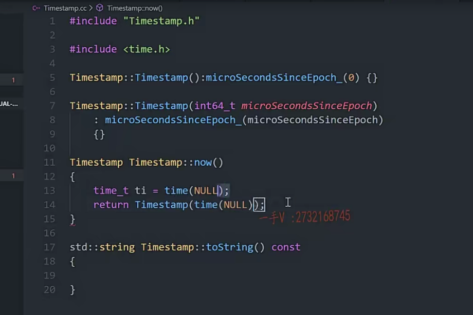

好了吧，这也是获取当前时间嘛，是不是return一个timestamp嘛？

哎呀，我觉得这个一句话就应该完了。能写一句。我们不写两句，因为这个本身就不复杂，对吧？逻辑呢？你能看明白。这是null，这也相当于就是。

通过调用now获取了一个用长整形表示的一个时间，对吧？

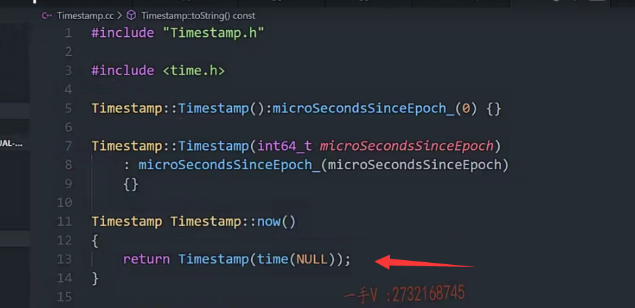

然后再调用它的这个tostring方法，

那tostring方法我们就需要把这个长整形转换成年月日以及时分秒了。

怎么写呢？各位大家想一想啊。那得先定义buf吧。比如说是个128啊。

#### 使用localtime做一个转换

那你得先用这个local time把这个长整形转成这个啊就是TM的这个数据结构嘛，

对不对？就是local time。

我们的成员变量，你看相当于time跟local time结合了一下，这两个函数对吧？tm里边就有年月日时分表嘛。

#### tm数据结构年year是从1900开始

对吧，但是它这是年是从一九零零年开始的。

唉，对不对啊？然后这个月呢，是从零到11，

所以我们到时候再加个年加个1900。对不对啊？非常完美，我们那这个代码就呼之欲出了。

嗯TM杠time等于。你可以看看它的这个to_string是怎怎么写的啊？

还有toformattedstring。

啊，其实一个意思是不是啊？一个意思它调用的方法跟我们不一样，我们调用的是localtime。那我们写一个snprintf。

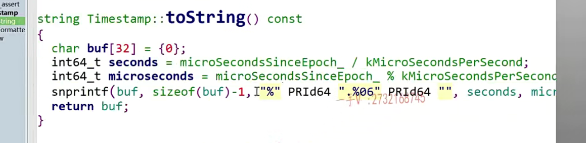

第一个先写八分，第二个写缓冲区大小幺二八啊。然后呢？再写个格式化字符。啊，年年是四个。

占四列对吧啊？年在年月日加下，这加这个斜杠来隔开月，

月占两个瓦零二然后是d整数。

然后再是日也是零二d，这是年月日对不对啊？

这是零二d。分零二d。秒零二d。

对着呢吧。零呃4d是吧？零二d要占呃，

==第一个没有的话补零啊==。

d年月日时分秒。然后就是TM杠time指向了这个年。年就是要加个多少啊？幺九零零。

月month。这是TM。month在。加一个一是吧？

日对。对着吧。

哦，十是hour。

分分是minute。

然后再是一个秒是一个second。

最后。return buffer.我把这个给它返回去。这就是我要的这个最终输出的年月日的格式啊。

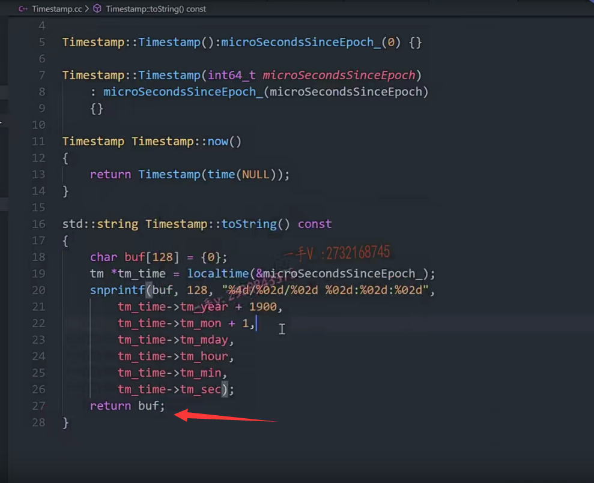

嗯，我在这儿写一个简单的这个内函数吧，测试一下啊。

==这个VS code比较方便的就是。它可以单个的源文件运行啊，我们只运行这个，我们看一下。==

这个是std cout。cout谁呢？

sell time step.no.点two string这个方法。

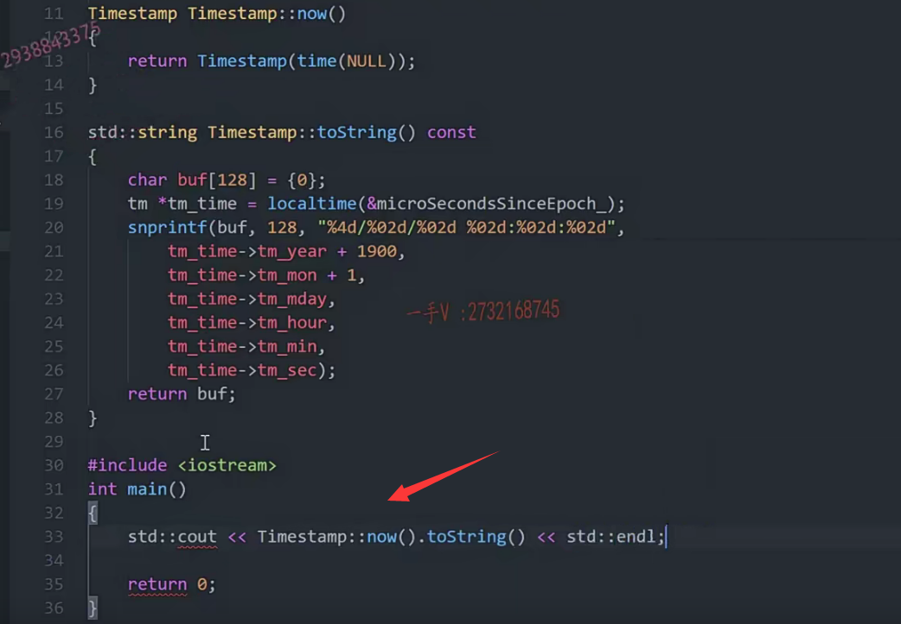

让我右键run一下code看对不对？

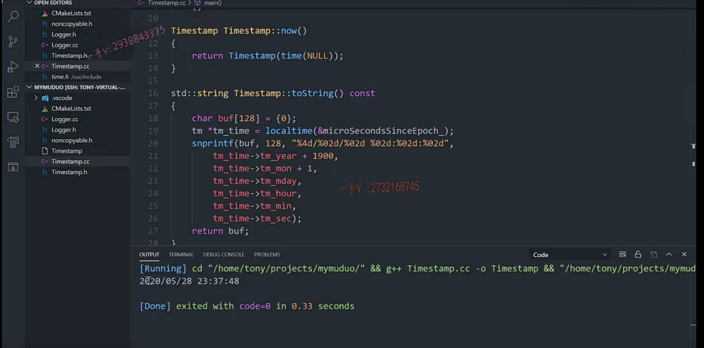

二零二零年五月二十八二十三点三十七分48秒没问题。

那就正常着呢，对吧啊？

好，这个代码呢？我们注释掉啊，也就不去了

以后想再测试个啥东西。那这个时间的这个类就OK了。

它实际上使用的话就是这么一个东西啊，就是这么一个东西。

其他关于时间更复杂的功能呢，我们也不一定能用上啊，我们先写这么多好吧，

### 添加时间类到日志中

那反过头来在这个日志这里边。

我们怎么样啊？包含一下呗这是timesstamp.h啊，

在这儿呢，那就是获取一下当前的时间timestap。now

这个方法点to_string。

哎，这打印了日志的这个级别的标识，打印了当前时间，

又打印了具体的一个信息。

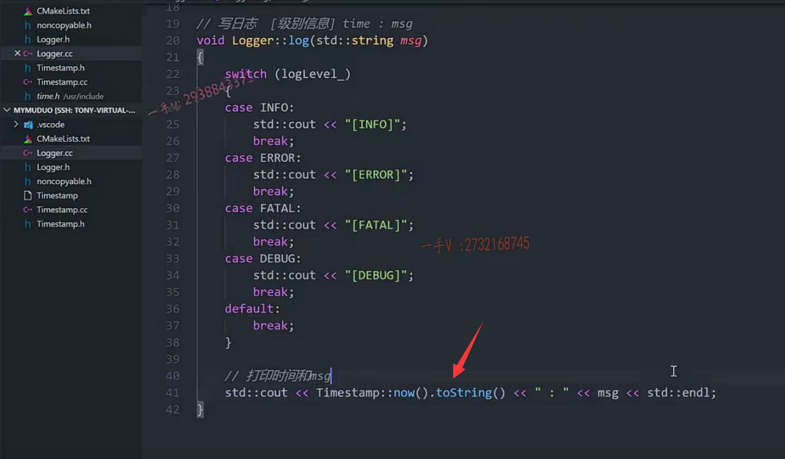

好的吧啊，那这个日志呢？那我们也就输出完了。

是吧啊，我们日志我们也就输出完了。

## 总结

好，那这节课的我们的主要任务就是把这个时间相关的这个类输出了一下啊，

希望大家呢。也理解理解，把这个代码呢也写完，

我们每一节课写的代码就是每一节课课后的这个任务。

啊，你一步一步跟着把这个写写了，以后多想一想，

包括这些细节的上的一些东西也都想一想啊，领略它的一些好处，把这些好的习惯细小点都积攒起来。

大家把这个知识呢，通过这个源码的这个书写给它往一块综合啊大的知识，

小的知识呢，都往一块综合，把他们用起来，共同来去解决问题啊。

那么经常这样子去做面试的时候，我们听到问题的时候呢，我们就能从脑子里边去把这些小的知识点调度出来，帮我们解决问题了好吧？

或者说是听到问题的时候，这些知识都在脑子里边睡大觉，我想都想不起来。

那就白学了啊，好这节课的内容我们就说到这里。