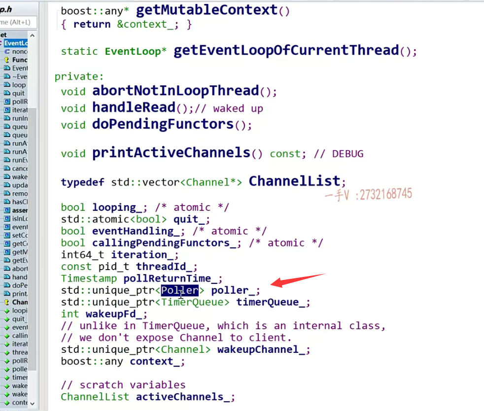
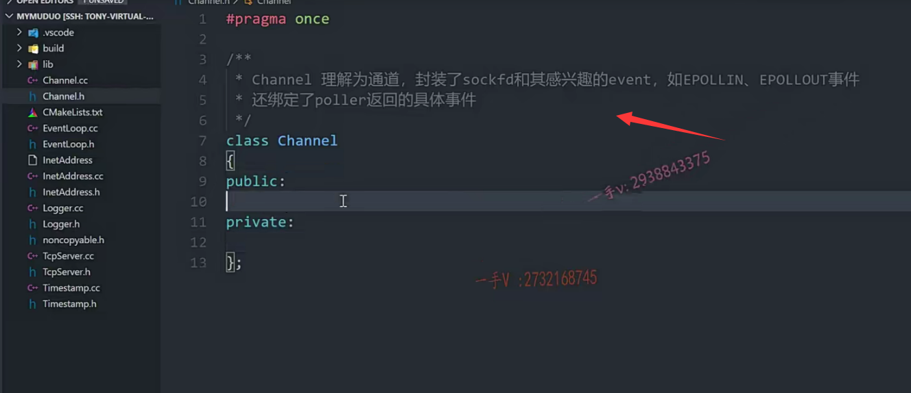

那解决了这个inetadress，相当于呢，就是TCP server构造这一块儿呢，

就剩一个eventloop了，对吧啊？

那么TCP server相当于是muduo库给外边儿提供编写服务器程序的一个入口的这么一个类啊。

它相当于就是一个大箱子，

把这个muduo库有关服务器这个编程的相关的所有的东西，

包括反应堆啊，包括事件分发器啊，包括事件回调啊。

都给它打包到一块儿了，对吧？


好，我们实际上从它的这个成员变量，我们也能看到，

你看它的成员变量里边儿有event loop啊。有accept or

这个看名字都能知道它是跟accept相关的操作，

是不是全部打包到这里了？

还有一个事件，这个循环的这个线程池，

还有我们说呢，这个事件分发器。相当于epoll。

它不可能只是一个线程嘛，对吧？

在我多核的CPU时代，我一个线程去做epoll_wait，去做事件分发，有点浪费啊。

啊，所以它肯定有一个事件循环的线程池。

对吧啊，还有一系列的回调，这些我们都不用说了，


再者它就有一个connection map，它维护了所有的一些连接。

对不对啊？都在这里边，所以我们从最重要的event loop先往下看，

就是在我们脑子里边啊，我们知道TCP server啊，相当于是一个打包所有资源的一个盒子，


## eventloop

evetn loop就是我们说的reactor模型里边最重要的那个。

事件循环了啊，事件循环了就是我们的一个事件分发器这个模块，


我们就该进来了啊。那event loop在这里边儿，

大家看到啊，都是non copy able的，都是不可复制的啊，

然后它的这个成员变量，

大家先想一想啊，一个event loop啊，事件循环嘛，事件循环相当于就是一个。epoll了对吧啊？

我们可以把它想象成epoll，里边主要管理。什么东西呢？




那么，大家看它的这个成员变量，看见是不是有一个poller啊？

这个poller相当于是一个抽象啊，它呃用poller当做一个基类啊，

在配生类里边实现了poll跟epoll这些lO复用的具体的一个事件分发操作啊。


那么poller相当于就是epoll的一个抽象的这么一个概念啊。

那么，光有epoll不行啊，对不对？

epoll里边还得监听这个socket呀。

啊，大家看啊，在event loop里边儿，另外一个比较重要的这个成员变量表示的类型就是channel。


你纵观event loop的成员变量，除了这些编辑器内置的这个类型以外啊，它自定义类型就两个，一个是channel。一个是poller，就是我们事件分发器里边儿最重要的两个东西啊，


我们在写的时候我们就。不去考虑它的poller的实现了，

我们就直接使用epoll直接写就可以了啊，

就是一个是考虑的是epoll，一个是epoll所感兴趣的事件，这些事件event。

==你写过吧，epoll的这个代码编程，你写过这个event里边就绑定了一个socket fd以及他所感兴趣的事件了，对不对啊？==


那么你看一看这个channel。

这个channel的成员变量往下一看，


你看是不是很明显就看出来这是fd

哦这是他所感兴趣的事件

our events receive events就是真真正正啊it's the received event types of epoll poll。

这也是具体的发生的事件啊，

这是不是就是相当于Channel，我们理解成通道啊？

## channel 

#### events是感兴趣的事件

#### revent就是实际发生的事件

==通道相当于就是代表的就是一个fd以及它所绑定的这个感兴趣的事件，==

==以及实际上发生事件epoll_wait的给我们返回以后，它在这个fd上发生的这个事件。==


其实就这么一个绑定，所以呢，

#### eventloop就是一个事件循环，事件分发器就是epoll_wait

==我们说一个eventloop啊，大家在脑子里边儿，你就可以把它想象成它就是事件循环，==

==事件分化器就是epoll wait对吧？==


## eventloop中管理2个东西

它里边主要管理了两个东西，

==就是一个是epoll poller本身。==

==一个就是epoll所管理的这些socket fd以及所对应的这些事件感兴趣的事件，以及实际发生的事件都被封装在这个channel里边。==

### connection

在muduo库里边有一个connection跟一个channel分别表示连接跟通道，

大家现在知道通道是什么意思了啊，

到时候我们在后边再剖析connection的时候呢？

你注意对比它们的区别。

OOP啊，就是这个样子的，有时候你定太多的类的话，就会涉及过度的一个封装。对吧啊，


这是需要经验的啊，我们muduo库呢设计还是非常不错的，

大家首先呢，我们在这里边儿不评判人家的好与坏啊。

能这么流行，肯定是有人家的可取之处。

我们首先搞清楚人家每一个组件它的意义是什么？

现在往简单了想。

eventloop是什么？就是事件循环。

==事件循环最重要的两个东西是什么？==

==一个是epoll，一个就是epoll所监听的fd以及他所感兴趣的事件，以及最终发生事件以后epoll_wait的给我们应用通知的这个事件，==


那么socket fd以及感兴趣的事件，通知的事件都在channel里叫做通道。

对吧啊，那么epoll本身就是这个epoll，

所以我们这节课的任务呢，就要依次的去实现它们。

进而我们把event loop要实现了。对不对？


我们理清楚了这个大树的根就是TCP server开始走主干开始发芽的对吧啊？

这个TCP server这个跟往上走就是这个event loop了。对不对？

你eventloop再分枝发芽的话就发出来了两个，

一个是channel，一个是poller。对吧啊，


那这节课我们主要来看这个Channel，

那看归看我们应该把相关的类呢，也都先创建一下啊。

TCP server，这个我们知道它的这个角色啊。

然后呢，反过头来后边呢，我们呢，需要把他们的实现呢

逐一的补上TCP server。

还有一个什么呢？event loop点h。event loop点CC，


希望你在写的时候脑子不要忘了我们前边儿讲理论的时候呢，

那个reactor模型的那张图好不好？

像大的框架都是按那个流程来走的啊。


once这个是TCP server。我们先把它留到这里。

这是对外的服务器编程使用的类。


这个我们包含他头文件就可以了啊。


## eventloop编写

然后就是event loop。

class event loop.

public.private.

这个是个事件循环类。

里边主要包含了两个大模块一个是Channel。

一个是poller。我们在这里边把它看作就是epoll的抽象好吧啊，

因为muduo库本身呢，人家poller只是基类里边定义了接口。

实现类的时候实现了两种机制，一个是epoll，对吧啊，一个是poll。

那么，我们在写的时候，我们只实现epoll的这个。

呃，逻辑就可以了。好的吧啊，


eventloop事件循环嘛，肯定这个包含了一个事件循环包含一个这个poller。

一个poller里边儿，不仅仅只有一个channel，肯定是有一堆channel的。

是不是啊？

肯定是有一堆channel的，所以我们看event loop下边儿也是有vector嘛。

这是不是定义了一堆channel啊？channel list。

定义了active channel，你看定义了一堆channel，


实际上跟我们这个过程式的epoll的编程呢？

逻辑啊，理论上都是一样的，

人家封装看看，理解一下人家封装的这么一个思想啊。

呃，相应的，我们在CC文件里边儿包含一下这个event。include.event loop点h。


## channel

好，那么我们就要去写这个什么了？channel点h。channel点CC。

来，我们要给channel去写注释，这怎么注释应该。


channel理解为通道啊。这个在muduo中。相当于封装了sock fd和其感兴趣。的event如epoll in如这个epoll out事件。

还绑定了这个是poller监听返回的具体事件。

啊，那channel就是把这些信息呢，给它封装起来了。




好了吧啊，接下来我们得看看channel的具体的一个实现了。

啊，首先它也是noncopyable。

所以我们必须包含我们的这个，之前我们写过的这个头文件啊。

include.non copy able.好，

那在这里边呢？我们是从noncopyable继承过来。对吧，


### 注意channel中的回调

注意它定了一些回调。啊，学好C++的话呢，

这些绑定及回调应该没有任何什么问题吧？对不对啊？

这是timestamp，

这头文件里边只用到了类型的声明，没有用到类型具体的定义以及方法，

所以我们相对来说呢，在这个头文件中只去写这些类型的前置声明就可以了啊。


### 前置声明，对外暴露的这个我的头文件类的信息就会更少

就是class它的，包括它的构造函数还用到了event loop，对不对？

我们都前置声明就行了。

因为具体的这些对象方法的使用肯定是在原文件中的，

都是在原文件中包含它的这个头文件就可以了。

啊，看这都是类型的前置声明，这就是我们从源码中啊，学习的一些代码工程的最佳实践好吧，

而我们同学在写的时候，不管你三七二十一，不管你用有没有用到这个对象的这个方法。还是说只是使用了一下这个类型啊，

我都是在这把头文件一包含。对不对啊？

那你到时候给用户提供的时候呢？除了提供so库，你还要提供头文件呢？

头文件你不可能不给人家。对不对啊？你如果你提供的这个头文件。

啊，如果这个提供的这个头文件里边包含了一系列的头文件，

那你到时候就都必须给到人家客户的手上。是不是暴露的信息就太多了啊？

那么在头文件中，我只给出什么东西啊？

类型的这个前置声明。

而什么时候在原文件中，在include具体的这个头文件。

对不对原文件最终都会被编成so库的啊？

所以这样的话呢，对外暴露的这个我的头文件类的信息就会更少，这是一个非常好的这个oop编程也就是C++编程的一个工程实践啊，大家也学到这么一招。


class timestamp，我要的是timestamp前置声明的。


这还有function。那这些东西我们就直接包含人家的这个系统的库了啊。


typedef in.function.这叫event callback。

事件的这么一个回调是吧？不关注啊，它这个。


哎，我们别用typedef吧？我们用C++11的这个语法用using啊。

我觉得会更清楚一点。这相当于定义了一个名字，这个名字是这么一个类型。


另外一个using叫做read event callback。一个是事件的回调，

一个是只读事件的这么一个回调，对不对？

function void 是timestamp。


### channel构造函数 析构函数

好了，那么在这里边，我要写它的构造函数了。

channel.event loop.event loop.还有一个什么，还有一个fd，

我说channel是打包什么东西的？

打包这些东西包括fd，所以你看构造函数有fd的是不是？

还有一个什么东西呢？析构啊。


### 什么时候用前置声明，什么时候用变量

注意来看，这些方法就多了啊。

这是handle event. receive time.

那么大家来看看啊。这个在这里边儿，

你用的时候你看这个event loop在这儿，你可以直接前置声明一下就行了，

因为这里边儿只用这个类型对应的指针。

这个不管什么类型的指针是四个字节，不影响人家代码的编译，

但这个不行啊，

这个在这里边儿形参是一个用这个类型定义的一个变量。对不对啊？

这在里边儿，要确定这个变量的大小的，所以这个timestamp呢，

不行啊。这个是需要包含它的什么头文件了啊？

好，那么再注意一下啊，再注意一下，是这样吧，


### 成员变量 对什么事件感兴趣

我们先把它的这个成员变量。先输出一下啊。

大家一块来看看。

static.count int.kn event.这三个东西表示什么呢？

这三个东西表示当前fd的它的一个状态啊，

是没有对任何事件感兴趣还是对？

读事件感兴趣，还是对写事件感兴趣这么一个状态。


啊，你也可以先理解成是对它状态信息的感兴趣的事件，信息的一个状态的描述啊。至于具体怎么用，我们到时候看人家代码上是怎么表达的好吧？这是三个。


首先呢，event loop 事件循环这个表示事件循环。是不是事件循环？

然后是什么呢？嗯，然后就是非常重要的一个东西了fd。这个就是。fd对吧啊，

也就是poller监听的对象是不是啊？

然后呢？这个是什么event events？这个是注册的，注册fd感兴趣的事件。

对不对？还有一个revent events。这个是什么？

啊，这个是poller返回的具体发生的事件对于fd来说。


是不是那么？这个index我们还是需要的啊诶。

这个index我们还是需要的。


这个loghup就是跟日志相关的，这个东西我们就不需要啊，我们就不需要。


这个tie我后边儿给大家解释啊，

这个tie是防止我们手动调用remove channel channel被手动remove，

以后呢，我们还在使用这个channel啊，

所以进行了一个跨线程的一个对象的这么一个生存状态的这么一个监听，


### weakptr tie

还记着没有？

我给大家大家在看我课程的时候讲这个share的ptr跟wake ptr它俩配合使用，

==既可以解决只使用shard_ptr的一个循环引用的问题，==

==还可以在多线程里边用weak ptr来监听他所观察的这个资源的生存状态，==


使用的时候呢，可以把这个弱智能指针提升成强智能指针。

提升成功访问，提升失败，那就不访问了，

说明他所观察的这个资源已经被释放掉了是吧？

你要用weakptr，那你不得先包含一下库的头文件了？

谁memory？对了吧啊memory。

这是std weak。这是用了一个void，什么类型都可以接收tie


tie是什么绑定嘛？这是绑谁呢？绑自己呢

实际它的这个用法呢？

你要绑自己的话呢，你还可以用这个shared from this.

==还有没有同学有印象啊？shared  from this啊，==

==也可以直接使用那个的，就是得到当前对象的一个强智能指针。==

好吧啊。

这个对于share的p trv个ptr对于这个shared from this。

希望大家可以通过我的博客，我写了一个博客啊，之前最早写了一博客，

在说这个shared from this。已经我觉得已经写的很清楚了，

大家感兴趣的话可以看一下这个博客。


那么剩下的这个event hand连跟edit to loop这个东西呢？

嗯，不用的话也无伤大雅啊，


为什么呢？

我们到时候在写代码的时候channel的代码的时候再给大家解释啊。

这一块儿呢，相当于就是四个什么，相当于四个函数对象，

到时候可以绑定啊啊，外部传进来的相关的一些操作。

对吧啊，毕竟我这个channel这里边儿能获知poller啊。


毕竟我这个channel能获知poll反过来的具体的发生的事件，

那我这个channel就可以根据具体的发生的事件是不是调用相应的回调啊？

你是发生读事件了，还是发生写事件了，还是关闭了，还是出错了，

是不是只有channel能知道啊？

因为channel里边儿才包含了revents嘛。

channel知道当前这个通道里边儿啊，

针对这个poller监听的这个通道poller就是一个线程里边儿，

一个poller，一个poller，可以监听很多的channel嘛。

相当于就是监听传统的fd是不是啊？

channel里边儿知道这个fd，它感兴趣的事件具体发生的事件，

所以这里边儿有一系列这个回调啊。readevent的call back read。call back.

这些类型 回调类型是我们上边定义的啊。


不知道今天怎么回事儿，我这个VS code怎么反应的好慢啊？这是red call back。event callback,event callback.这是close call back。

希望大家多。多自己写一写，多敲一敲，不要老是拷贝好吧？

我都是自己敲的，你为什么不敲呢？对不对啊？


你把这个大神张忆春的这种风格啊。又发挥的淋漓尽致一些啊。


因为channel通道里边这个能够获知fd最终发生的具体的事件revents。

所以它负责调用具体事件的回调操作。


## 总结

好吧，这些东西呢，你在说muduo库的实现的时候，你都可以给面试官去说嘛，

对不对？你都抛到源码上了，你的源码都抛了。

你还害怕他能问到哪里呢？是不是啊？

好，那这节课呢？我们就是时间稍微有一点长啊，

这节课我们主要就是把这个从TCP server分析到这个event loop，

我们知道它的这个角色主要是什么？

再到这个channel，

channel主要抽象了什么东西，

对吧？它里边包含了主要的成员变量以及我们写了一部分的这个方法。


啊，大家把这个东西呢，往我们之前的那个reactor模型的那张图上去靠一靠它大概。

处理的是哪一部分的事情？封装的是哪一部分的？这个逻辑好吧啊，

这节课我们先到这里。请大家也把代码完成一下。


# 其他

## 回调函数的意思，举例说明


回调函数是一种在编程中常用的技术，它允许将一个函数作为参数传递给另一个函数，以便在适当的时候被调用执行。这样的机制允许实现更灵活、可扩展的代码结构，使得程序能够根据不同的需求动态地改变行为。

举个简单的例子，假设我们要实现一个计时器，当计时器达到指定时间时，我们希望能够执行一些特定的操作。我们可以通过回调函数来实现这个功能。

```cpp
#include <iostream>
#include <functional>
#include <chrono>
#include <thread>

// 回调函数类型定义
using CallbackFunction = std::function<void()>;

// 计时器类
class Timer {
public:
    Timer() : isRunning(false) {}

    // 设置回调函数
    void setCallback(CallbackFunction callback) {
        callbackFunction = callback;
    }

    // 启动计时器，并在指定时间后调用回调函数
    void start(int durationMs) {
        isRunning = true;
        std::this_thread::sleep_for(std::chrono::milliseconds(durationMs));
        if (isRunning && callbackFunction) {
            callbackFunction(); // 调用回调函数
        }
        isRunning = false;
    }

    // 停止计时器
    void stop() {
        isRunning = false;
    }

private:
    bool isRunning;
    CallbackFunction callbackFunction;
};

// 回调函数示例
void onTimerDone() {
    std::cout << "Timer is done! Performing the callback operation." << std::endl;
}

int main() {
    Timer timer;

    // 设置回调函数
    timer.setCallback(onTimerDone);

    // 启动计时器并等待3秒
    std::cout << "Timer started. Waiting for 3 seconds..." << std::endl;
    timer.start(3000);

    // 停止计时器
    timer.stop();

    return 0;
}

```

在上面的示例中，我们定义了一个计时器类`Timer`，它允许设置回调函数并在指定时间后调用回调函数。我们定义了一个回调函数`onTimerDone`，当计时器完成后，该回调函数将被调用。

在`main`函数中，我们创建了一个计时器对象`timer`，并设置了回调函数为`onTimerDone`。然后启动计时器，在3秒后计时器完成并调用了回调函数，输出了相关信息。

这个例子展示了如何使用回调函数来实现计时器功能，并在计时器完成后执行特定的操作，这种灵活性使得我们可以根据需要自定义不同的回调函数来实现不同的行为。