channel呢？我们现在已经输出完了这个模块啊。

那接下来我们该输出哪个模块儿了？

大家想一想啊，我们之前已经接触过了TCP server。T


TCP server里边儿非常重要的一个东西呢，就是event loop

就是我们的事件循环啊，一个事件循环对应一个线程，

一个线程对应的事件循环。

一个事件循环就是event loop里边对应了一个poller跟一堆的channel，对吧？

channel，我们现在实现完了，

那最重要的就是里边的这个poller了，对吧？


# poller实现

所以这节课呢，我们最重要的这个任务就是把这个poller实现完。

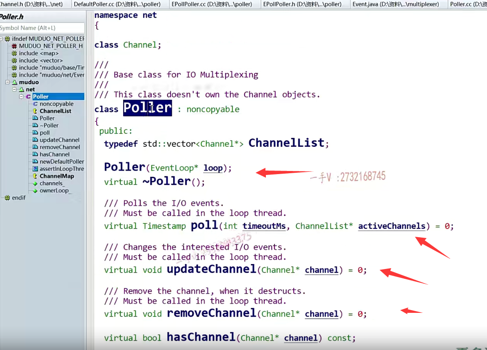


## poller是一个抽象类

==大家看poller里边全部都是纯虚的函数==，有好几个，

所以poller本身就是一个抽象类，不能够实例化的。对不对啊？


所以实际上你本身也不用去担心呢，它进行一个拷贝构造啊，它不能实例化。

那么，在这里边儿，大家考虑一个问题，


### 为什么muduo库里边儿要抽象一层这个poller呢

### 有2个

就是说为什么muduo库里边儿要抽象一层这个poller呢？

因为在event loop里边儿啊，

它在使用这个lO复用的时候啊。

就在这儿，因为呢，loop在使用lO复用的时候，

它并没有说是直接指定epoll，

==因为muduo库本身对外提供的l复用的能力包含两个，一个是poller。就是这个poller啊，poller点h跟poller点CC==


一个就是。e poller点h跟e poller点CC。

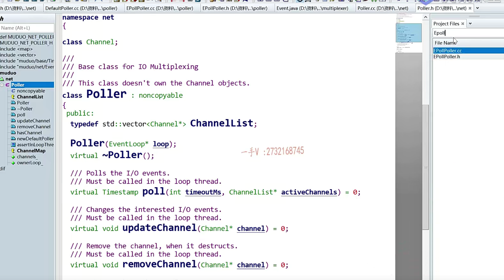

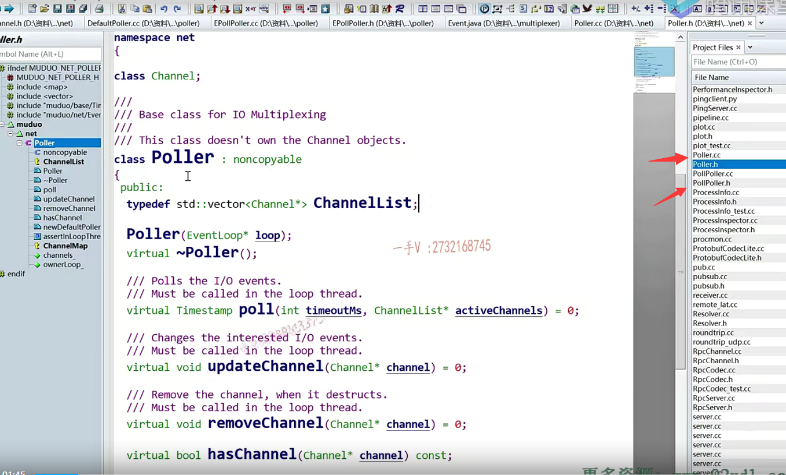


### 多态的思想

那么，在event loop里边儿，

它不可能直接去使用poll或者是epoll。

它是从抽象的层面直接使用了这个抽象类poller。

到时候引用了不同的派生类对象。调用它们的同名覆盖方法，

就可以非常方便的去扩展不同的lO复用能力了，就是多路分化器。


你这可以把select也给它上面扩充上去，对吧？

那也就是说让muduo库同时支持select poll跟epoll。

啊，这三种呢IO复用的能力。好吧啊，

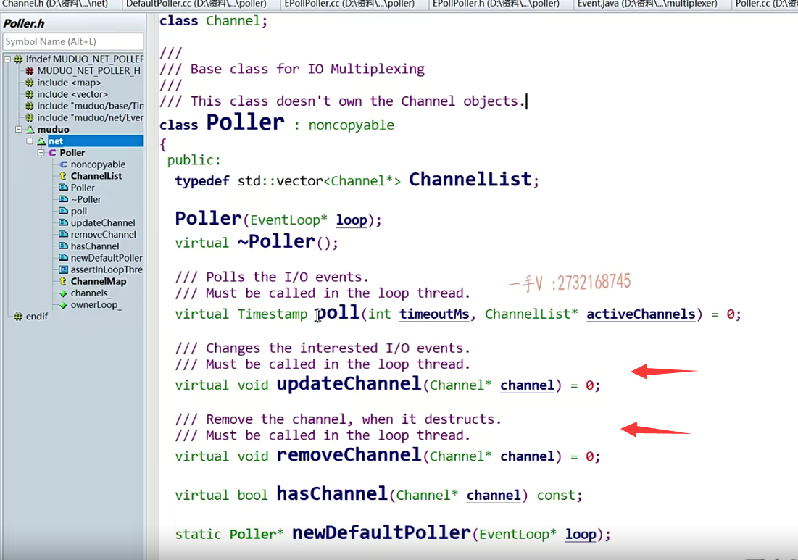


### 成员变量 channelmap

那么大家来看啊poller这个成员变量包含了一个map。channel map.

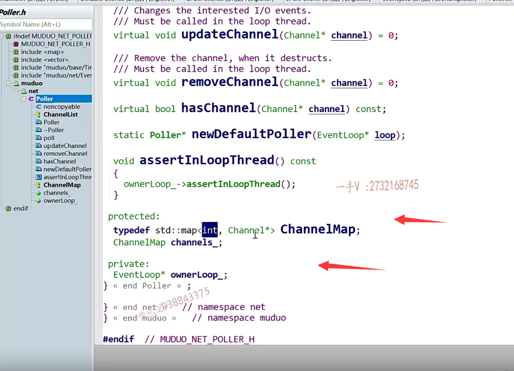


这是一个整形这是channel类型。poller所监听的channel嘛，

从哪来的嘛？

那event loop里边有channel list。以及一个poller，

所以poller监听的肯定是event loop里边保存的那些channel嘛，

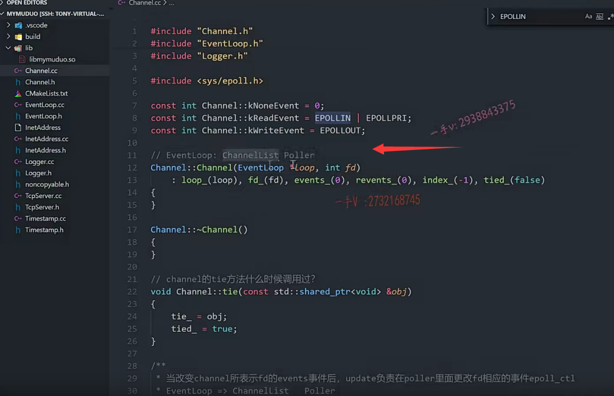


所以呢，在poller里边呢。也是存储下来了，

有一个map好吧啊，

再者呢，那也就是说poller这个抽象基类呢就？

有两个成员变量很明显，

### protected private的概念

==这个protect就是为了让派生类能访问的==，对吧？

==这个private就是派生类访问不了。==


跟channel一样嘛，channel也有一个成员变量就是保存了event loop，就表示这个channel是属于哪一个event loop的？

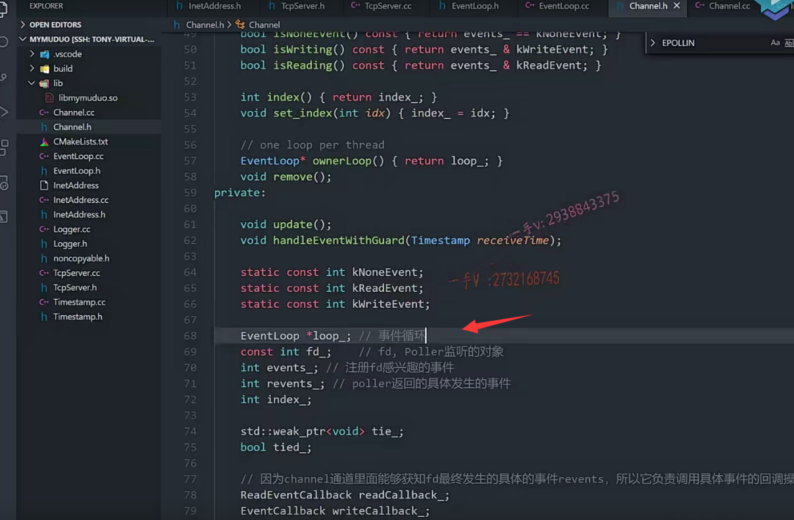


同样的，现在这个poller是不是也有一个owner loop就是poller所属的这个事件循环嘛，

因为一个事件循环拥有一个poller跟好多个channel啊，都在一个channel list里边放着呢。

好，那我们就把这个poller的这个类以及方法的这个声明啊成员。

这节课我们把这些东西呢先输出。

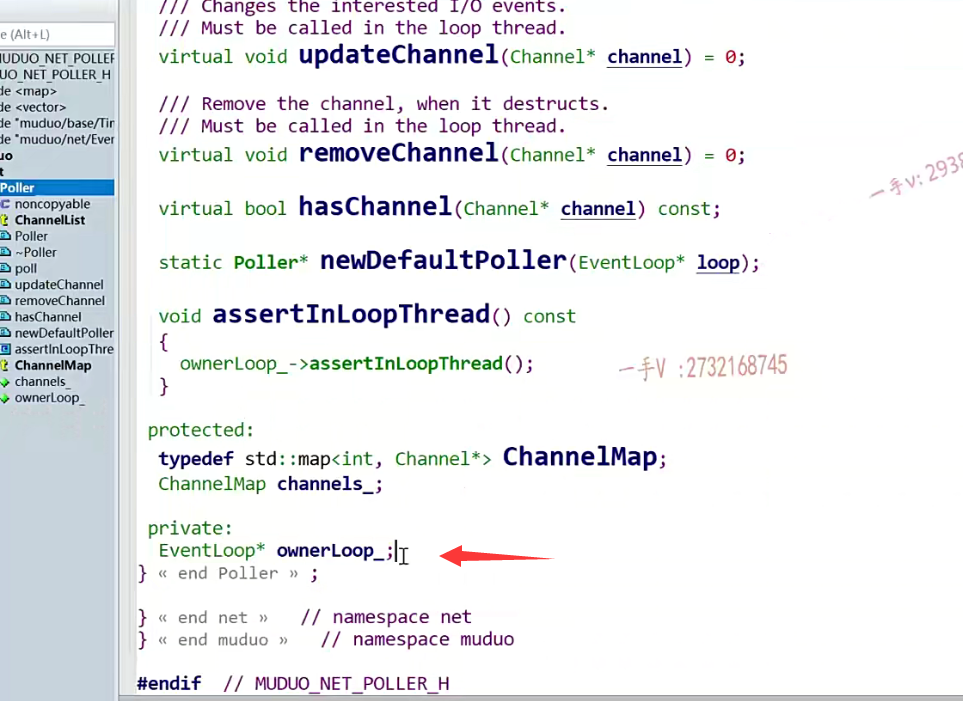


好，大家来跟我一起看一下。

我们输出这个poller点h。以及poller点CC。

大家呢，可以一边看一边写，或者说是呢，你觉得跟不上，

你可以把一节课先看完，看完以后呢？

你再去一边写一边去思考一下啊。

poller，这个是干嘛的呢？这个是相当于是muduo库中多路事件分发器。

也就是这个的核心。lO复用模块。对吧，

主要就是负责监事件的监听的啊epoll嘛，对不对？

就是这里边。

开启事件循环啊，开启了事件循环了。

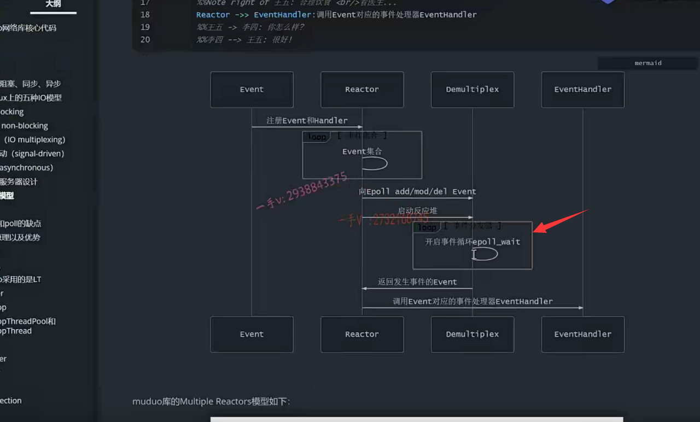


public.private.

虽然在这里边呢，它也是要noncopy able的，所以include noncopy able。

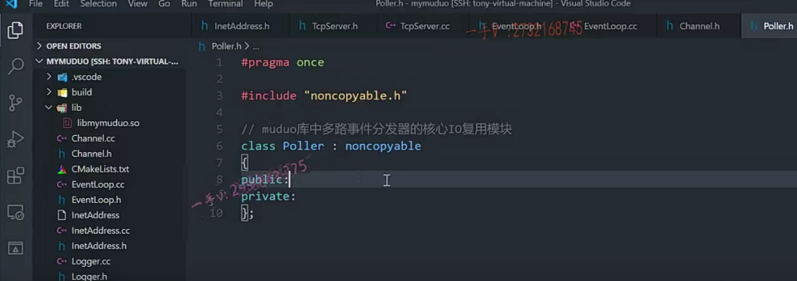


okay，那么在这呢，我们定一下它相应的一些类型啊。

我们不用typedef，用C++新的，这个using来定义新的这个类型。

channel list.用到了vector，

那我们需要把这个头文件也包含一下啊。

channel这用的是channel的这个指针类型，

我们在这里边直接类型的前置声明就可以了。

不用包含头文件，

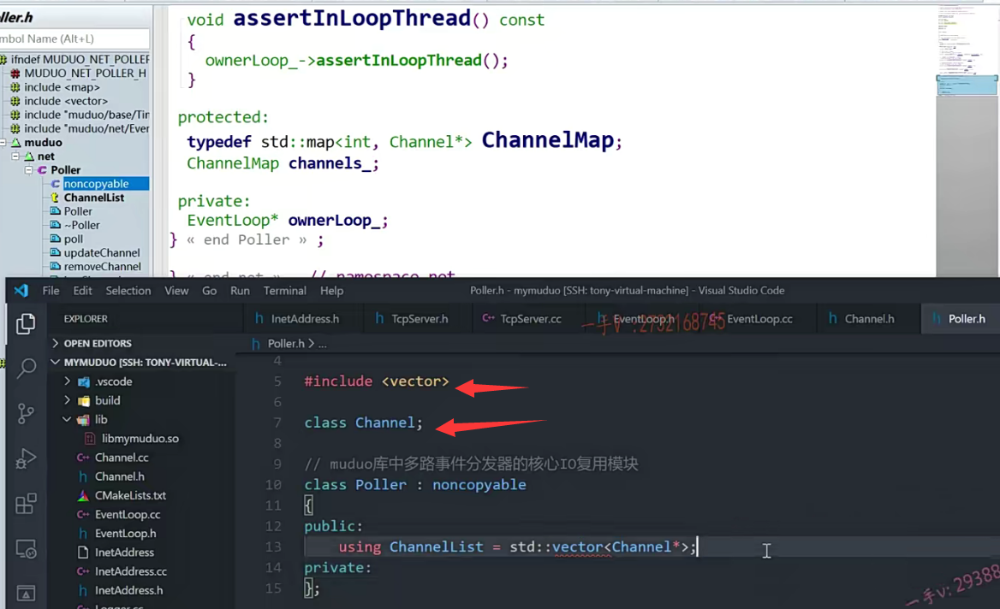


因为这是指针类型嘛，对吧？

呃，先写成员变量okay？那么在这里边。还有一个protected .

首字母是小写啊。

这儿底下还有一个event loop的一个指针，指针的大小跟具体的类型是无关的啊，具体的类型只是跟指针的偏移有关，

所以在这里边我们也是event loop.类型的前置声明就OK啊。

event loop星号owner.loop.就定义polle所属的事件循环。event loop.

好吧，然后在这里边就是一个using。又是一个channel map。等于这个呢，

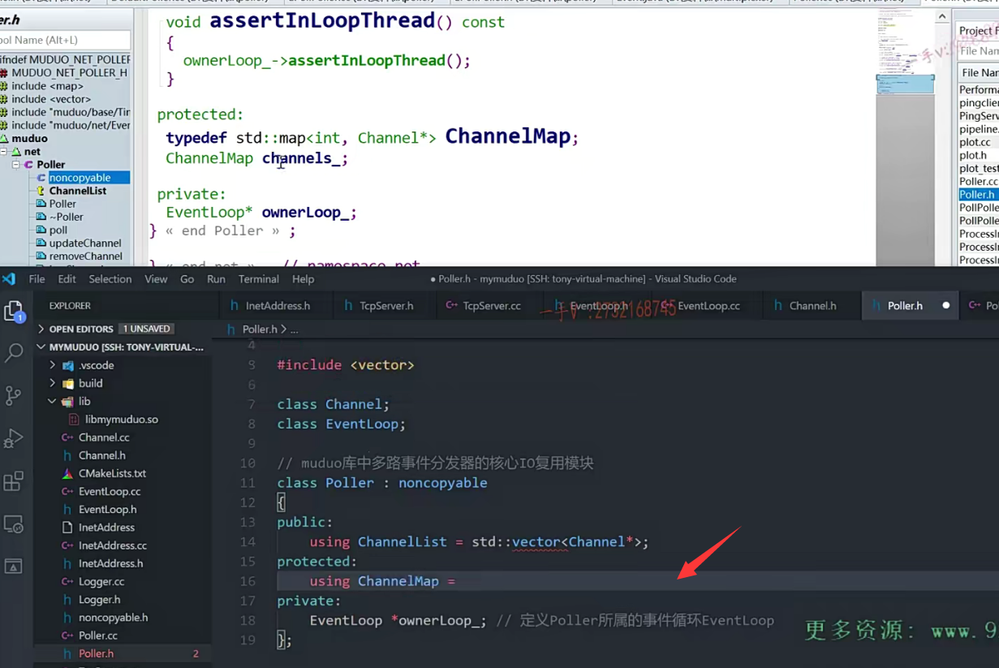


### 使用无序的关联容器

实际上不需要给这个什么啊？1不需要给这个键进行一个排序了啊，

所以在这儿呢，我们不需要用这个有序的关联容器，

我们直接用无序的关联容器就可以了。就是哈希表效率会更高一点，

这里边增加的对键额外的排序，我们没有必要啊。

on ordered map.STD.or dred on ordered map.

然后是channel。好了，

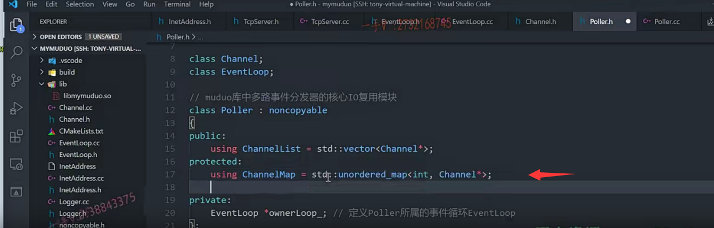


然后再定义成员变量就是channel map定的是channels.啊，所有的这个channel。OK，这是成员变量定义，

完了我们我们再输出一下它的这个方法啊。

在这里边的方法就是poller构造函数。有event loop。

有虚析构函数，虚析构函数为什么在继承结构中这么重要？

相信大家都没有忘了C++里边学的东西吧。

你看这里边人家muduo库上都给你注释这个，就是相当于就是epoll_wait的嘛。

啊，对于epoll来说。那么，对于poll来说呢，就是poll相当于就是用了基类，

在基类里边抽象类保留了统一的接口。

通过派生类不同的这个自定义的实现啊，实现应用在event loop中调用统一的一个poller的poll接口来实现不同的还有复用机制，

这本身就是继承与多态的这个好处之一嘛，对吧啊？

post l events must be called in the loop thread，在事件循环里边，在事件循环的线程里边去调用。

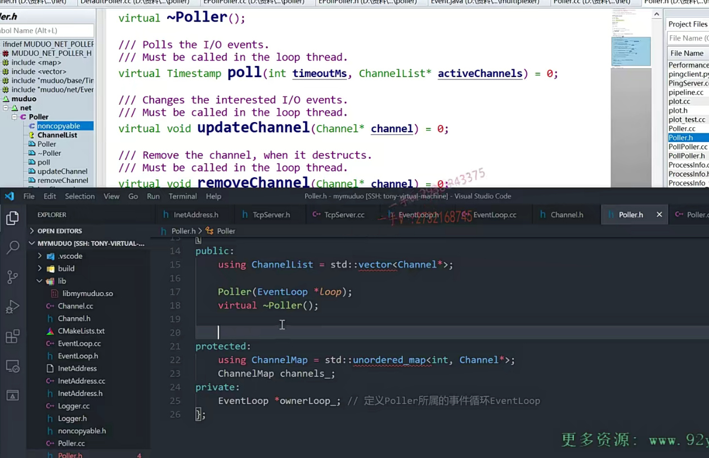


啊，那就是在event loop里边调用了。

对不对？好了，我们先把这个接口写上啊virtual timestamp.

这里边儿需要包含time stap。times tab点h啊。timestamp.pole int.

time out.个超时时间，

然后一个channel list。active.channels

当前激活的这个channel对吧啊就是。激活的channel正在运行的channel，

或者说是对某些事件感兴趣的这个channel，

需要poller去照顾的这些channel对不对啊？

好啊，在这里边。大家来看，这是第一个啊。写上吧。

保留统一的接口。是需要他们去重写的啊。

这也是了void update.channel这个我们在channel里边都调用过吧，是不是啊？

当channel里边所表达的一个fd事件有变更的话，就会去update这个channel啊。update channel的时候呢，你还记不记得当时传的是什么呀？

==传的是不是都是this啊？就是当前channel对吧？当前channel。==

所以呢，你看在这里边儿。update channel接收的是不是也都是channel的指针啊？因为那边传的就是channel的this嘛。这边是很明显的，对吧？

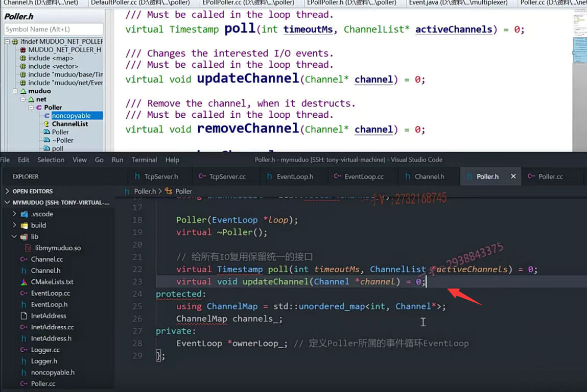


virtual 然后还有一个什么？remove channel.

remove channel它在调用的时候呢。

==它也是传的是当前的this，就channel对象。是不是啊？所以在这里边呢，它接收的也是channel的一个指针。跟上边是一样的。==

poll update remove.是不是

这个相当于就是启动了epollwait，

这个相当于就是通过epoll ctrl啊来？update嘛，就是add或者是modify fd的事件对不对？

remove channel这个相当于还要干嘛呢？

把这个fd所感兴趣的事件呢，是不是通过epoll control从epoll里边给它delete掉啊啊？

那到时候看一下具体的实现啊。

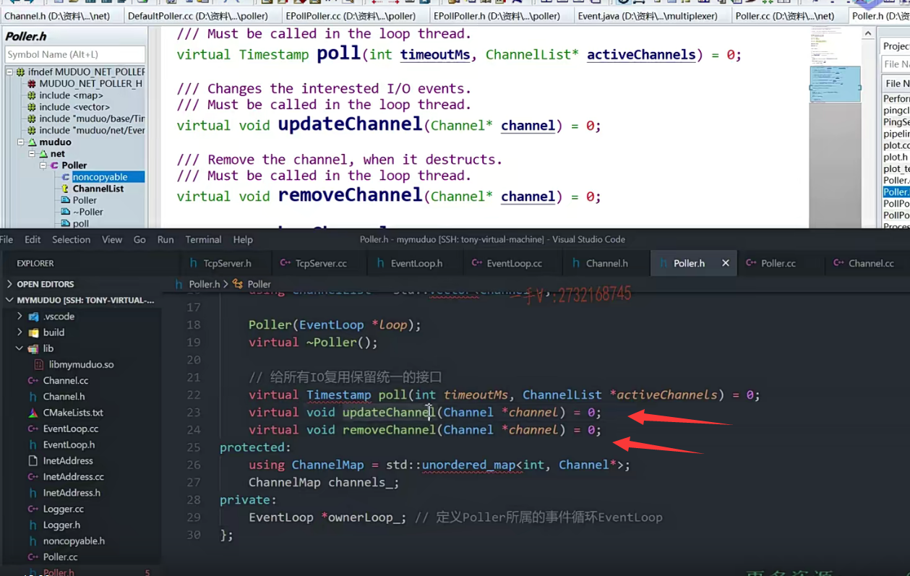


那这个里边呢？还有一个方法就是hash channel。

就判断一个poller里边是否拥有某一个channel啊，我们写上吧。

这个应该没有实实际的一些逻辑处理，应该还是muduo库做的一些断言里边可能用到的，没关系啊，我们把它写上吧。

在这里边还有一个方法，各位。我们注释写上啊。

就判断参数channel。是否在当前poller当中。

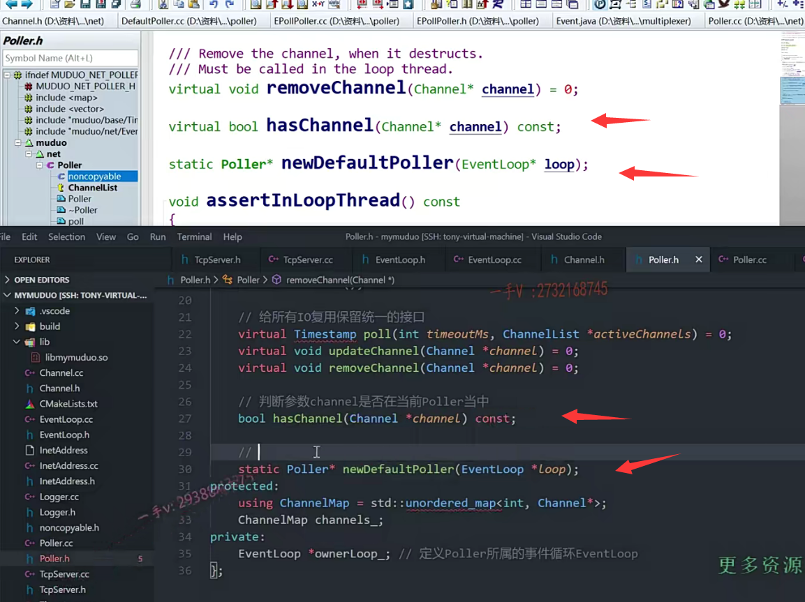


### newdefaultpoller

这是static poller*。new def.ault poller用default poller啊。

event loop.*loop 就是获取到这个事件循环的默认的一个poller。


对不对啊？这就像我们单例模式的那个get instance一样。

获取一个具体的实例，

因为event loop里边操作的直接是poller，它不可能直接操作poll或者是epoll去的对吧？

因为现在讲究的都是面向接口的编程，比较方便扩展它的能力，

不会是直接面向实现的编程。对不对？

那你要在代码上eventloop中写死用poll或者用epoll，那就改不了了，

所以呢，它通过poller的这么一个new default poller就可以拿到它默认的一个lO复用处理了。

对吧啊，你默认的可以用poll或者用epoll

muduo库，当然用的是epoll啊。

具体怎么获取的，我们到时候看它的一个实现啊。

这个是写到这儿event loop事件循环啊。可以通过该接口获取默认的。还有复用。的具体实现。实现的对象，对吧？

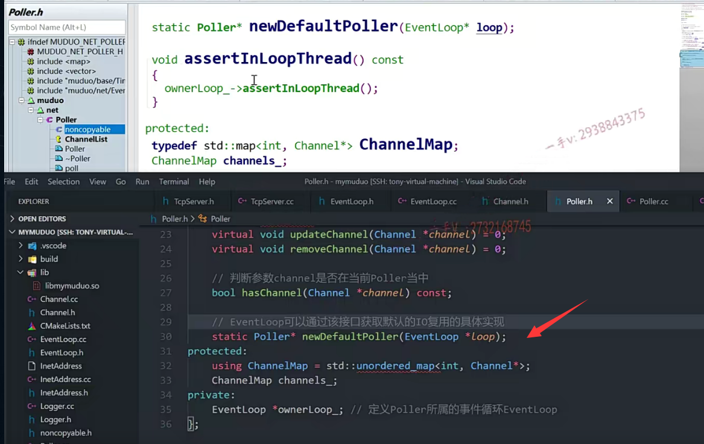


还有吗？没有了assert in loop thread，这个还是一个断言用的。

呃，我们现在先不写这个啊，

后边的话呢，我们有机会再给大家介绍一下它，实际上也非常简单的。

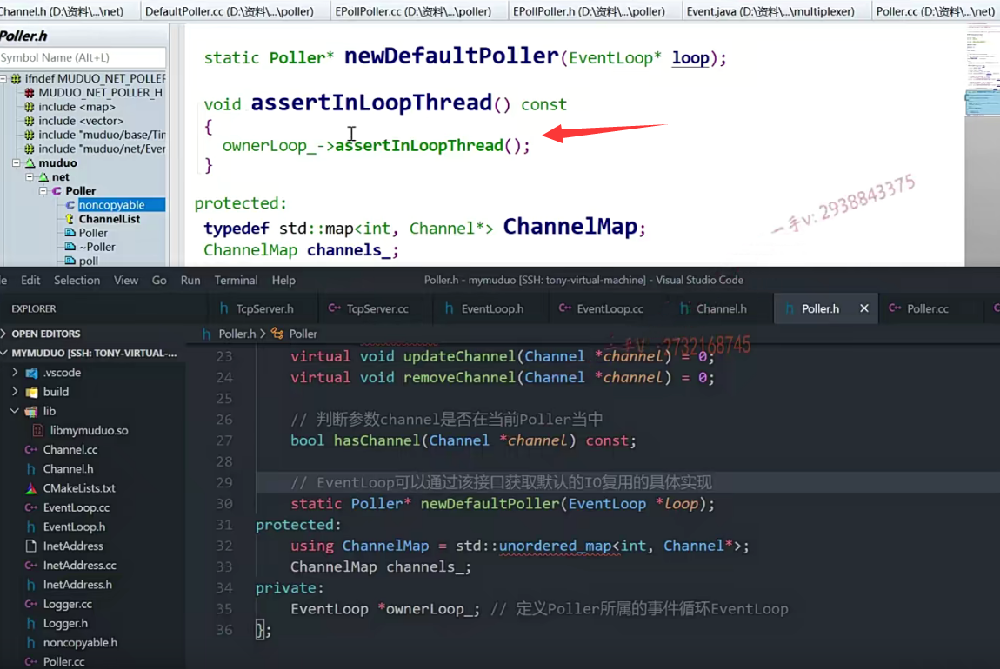


那么大家来看。这就是poller啊，它的具体的一些方法的声明了。

好吧啊。我们来看一下啊，它的这个实现呢？

它实际上它没有什么可实现的，它保留的都是纯虚函数。

都是等待派生类来实现的啊。

那我们看看呢？它这个是非常简单，那我们也写一下吧啊，

我们这节课刚好是把这个poller的方法的实现也给大家写了。

这个时间还是比较充裕的啊，我们继续把它写完。


## poller构造函数的实现

那就是把构造函数。这个就直接写个default吧，好吧，就是默认实现就行了啊。

这是构造函数。

构造函数在这里边儿，它做的事情呢，非常简单。

就是把poller所属的这个event loop记录下来就可以了。

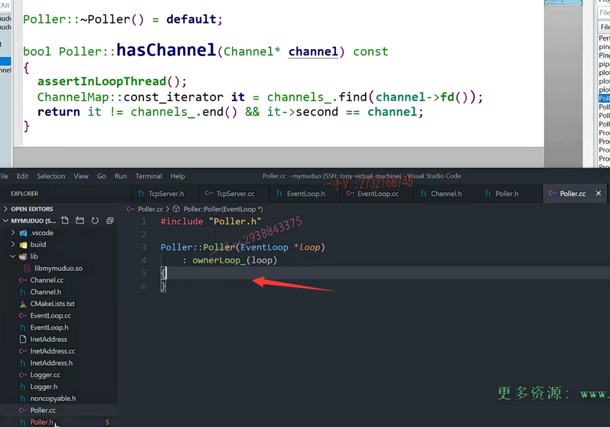


## haschannel

okay吧啊。然后就是实现了一下什么东西了。

实现了一下这个haschannel。

这参数传进来是一个channel嘛？对不对啊？

要判断呢，这个poller里边儿是否有参数传进来，

这个channel poller怎么存？这个channel的吗？

在一个map里边儿存着的。

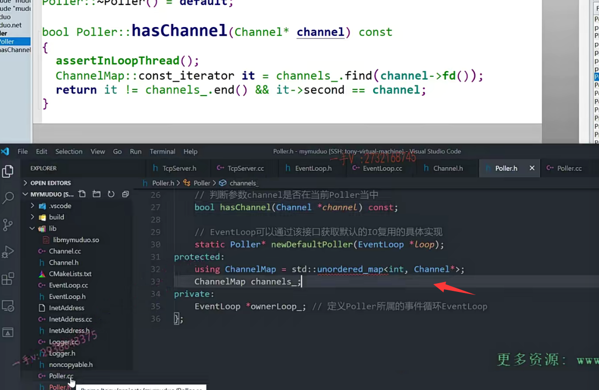


是吧啊，那大家来看一看它实现的逻辑呢，

就是用了这个迭代器。

通过channel的什么方法呀？

通过channel的这个fd获取channel底层的这个监听的事件fd哦，

那我们知道了，所以在这里边这个int表示什么呀？

这个map的key表示的就是sock fd 也就是channel的成员变量之一。

对不对啊？

value就是什么呢？这个sock fd所属的channel通道类型。

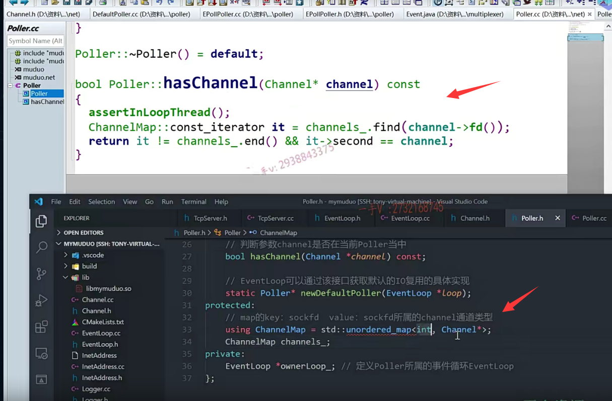


好吧，从这我们能看到你看find这个map的，

find传的参数是不是就是键啊？就是这个类型整形嘛？

我们看它传的是fd啊，我们知道了，

那就是说呢，这个map里边存在的映射关系就是这个channel以及这个channel里边所包含的这个fd。

==到时候可以通过快速的查找fd，是不是来找到这个fd所对应的这个封装channel啊？==


因为epoll wait本身给我们返回来的就是发生事件的这个fd嘛。

所以我们可以通过这个fd快速的找到它所对应的封装的这个channel，对吧？

这就是这个map的意义所在啊。

所以在这儿呢，应该是很明显的啊，迭代期类型非常长，没关系啊，

我们用这个auto就行了。channels.find 谁啊 channel fd.

那你现在既然调用了channel的这个方法了，你就得包含channel的头文件了，对吧？

啊，要不然呢，他看不见channel类型定义，不知道它有fd这么一个名字的方法嘛。

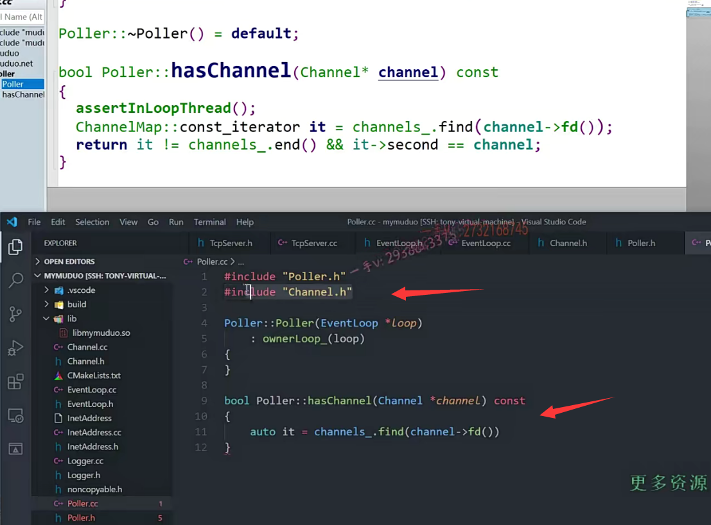


返回值是一个布尔值。

OK，他是写到一句话里边了，

实际上这种方式呢？嗯，省地方倒是省地方。但是没有这种方式明显啊，

如果等于channels点end。这表示什么呀？


哦布尔值是吧？布尔值我们写个if什么为true，或者说是else return FALSE也不好。

那我们还是只能写人家的这种。就是return 不等于end就表示存在，

如果等于end的话，这个条件不成立，是不是直接返回false了

而且就是这个成立的情况下。就表示呢，找着了。second就是一个channel*。就是这个fd对应的channel的这个地址对吧？

跟参数的这个channel是否相等？

==这两个条件都满足，表示呢，参数传递的这个channel确实是在这个poller里边存在的。==

好的吧啊，这个逻辑是没有什么大的问题的。

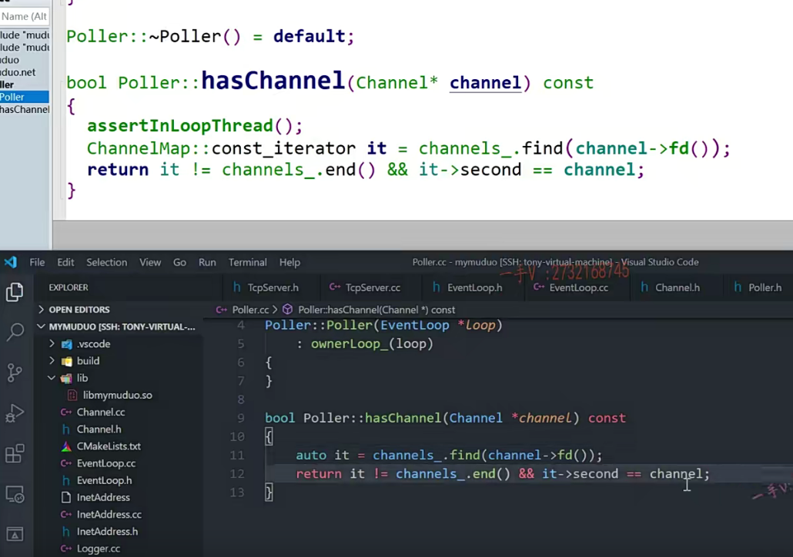


### newdefaultpoller为什么不写在poller.cc中

好，那你看poller呢？实际上。除了这，这两个都实现了。

这三个是派生类里边儿实现的，这个也实现了，

唯独就差这个newdefaultpoller。

有些同学会问这样的一个问题就是老师啊，

既然newdefaultpoller是poller里边的一个静态方法，


那为什么不把它的实现写在poller里？CC里边，

你即将在这里边又学到一招。为什么不把这个new defaultpoller写在poller这个CC里边？

各位，如果说你真的把这个方法的实现写在这个poller点CC里边，

从语法上来说，没有什么错误，

为什么？因为你是你的这个静态方法是在这个类类里边定义的嘛？

对吧，那你理所当然在对应的CC文件里边是不是去定义它的实现了，


但是你要注意。这个可是要返回这个函数里边，

可是要生成一个具体的一个lO复用对象并返回一个基本的指针。

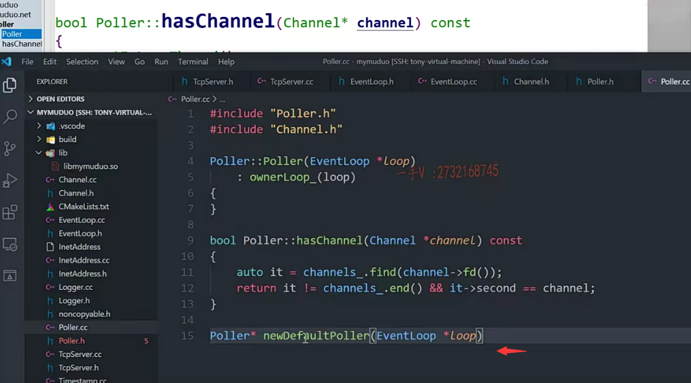

对吧，所以你在这里边是一定会包含。pollpoller.h。

还有什么呀？epollpoll.h。

是不是这个意思，你才能在这儿去创建一个具体的一个poller的实例化的对象，

并返回回去？

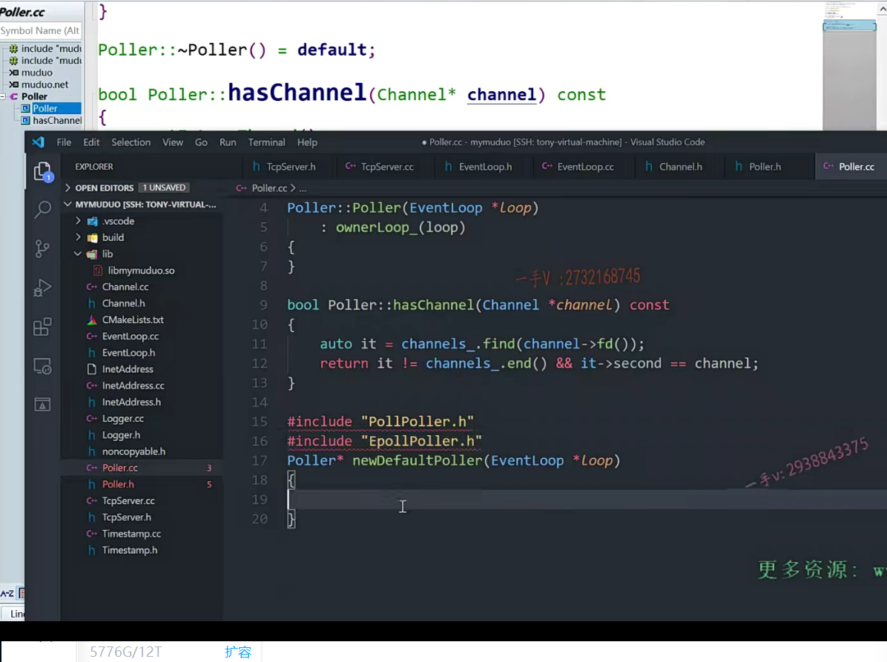


那么，请问这个合理吗？合不合理？

这肯定不合理，为什么呀？

==因为继承结构中poller是属于上面的，是属于基类。==

==对吧，派生类只能引用基类的，而基类不能引用派生类的呀。对不对啊？==

==所以呢，你在这个抽象这个基类里边直接引用派生类的这个头文件。==

这是一个不好的实现，

所以呢，你看啊muduo库，人家就考虑到这一点了。对不对啊？

我是属于基类的嘛，你们都是属于不同的派生类嘛？

你们用我你们包含我是天经地义的，我作为抽象层，我能不能去include你们某一个具体的实现头文件嘛，

可不可以不好？是不是不好啊？这设计不太好，


所以你也就看到了poller这个CC里边并没有什么呀，

并没有这个new def OT poller的实现，

那它到底在哪里呢？你看看我按一个f7啊，

这个source insight就直接给我。


哦，它在一个default power点CC里边，把它单独放在了一个源文件当中去实现它。意思很简单。

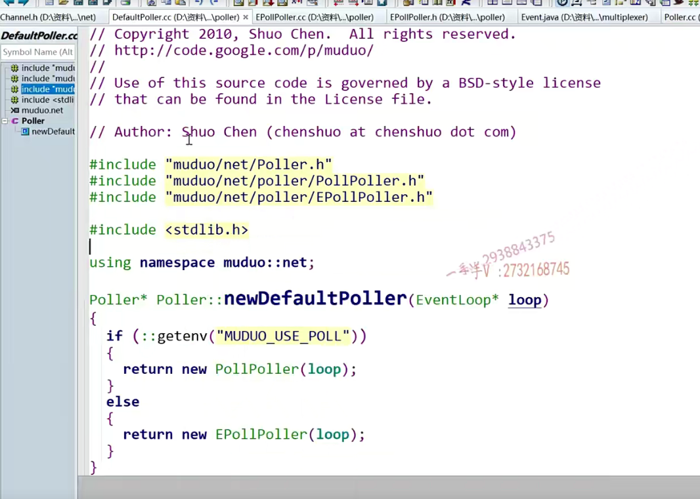


环境变量里边如果有这么一个变量muduo use poll。

它返回的就是一个poll的poller的一个实例，

如果没有muduo use poll这么一个环境变量名字。

啊，它默认返回的就是一个epoll的一个实例。

而我们肯定不会有人事先去设置这么一个环境变量，

所以它默认啊muduo库默认用的就是epoll，

除非你在环境变量里边设置一个muduo_use_poll啊，环境变量嘛，

你可以看一看当前shell的环境变量啊。

```
env 查看shell的环境变量
```

对吧，跟map一样有值，健值对儿是不是这个getenv是什么？

这个get env。这是获取条件变量啊，获取这个环境变量了啊，

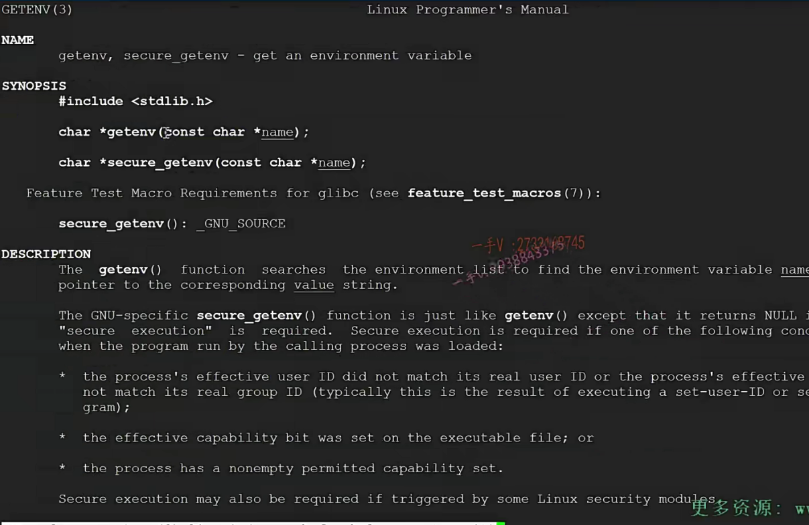

给一个name就是键返回它对应的值。是不是跟map表一样啊？


好，那我们现在就知道人家的套路了啊。

那么在这儿呢？default.poller点cc 

你知道人家为什么这么做吗？

你能不能把人家的这种思想呢保留下来，

到时候说的时候也可以把这一点阐述出来。

这是一种非常好的，细节性的设计。

好吧啊，像这种开源代码，实际上我们不用只关注它的这个大方向的，

比如说网络层的架构啊，缓存层的架构，存储层的架构。


实际上，它里边儿很多小点啊，类与类之间，组件与组件之间的这些比较小的，

但是非常优秀的设计呢，也是大家在学习剖析源码的时候需要实时的去积累的。啊，只有积累这些大的方向的设计，小的模块的这个优化。

你的水平才能提升的越来越快。你不能说是光积攒大方向的设计啊，

就说能说是不是一动手啊，写出来的东西呢？

不好看是吧啊，所以呢，这是一个综合能力，

大家都要注意，不要看不上这些小的点啊，这是非常好的设计啊。

万丈高楼平地起嘛，你高楼还得一层一层盖是吧啊？


okay，在这里边，我们得包含谁呀？poller嘛，是不是poller的h？


然后呢把？poller的这个对应的这个诶函数啊，我们拷贝过来。

当然了。函数名字前边儿加类的作用域，这是没有任何问题的。

这个是需要获取环境变量的，这个函数啊stdlib点h，

我们把这个头文件包含一下。stdlib点h。

那么，在这里边做的事情就是get env对吧？

它是一个muduo，use有这么一个环境变量。

在这里边return的就是一个什么啊。我先给它return成空吧，

好吧，这里边就是生成poll的实例。

这里边也是先return个空啊，这个是生成epoll的实例这个意思

应该是能够明白的吧？你到时候在这里边儿，你生成具体实例的时候，

你包含了poll poller点h跟epollpoller点h

就是包含了具体的实现类的这些头文件的话，这就没有关系了。

因为default poller点CC属于一个公共的源文件。

对吧，就属于poller相关的一个公共的源文件啊，

你添加依赖关系没有问题，但是poller是属于最上层基类层的。

派生类可以引用它，它最好不要去引用派生类相关的东西。

okay吧啊，这是一个非常好的思想。

那么poller写到这儿就完了，

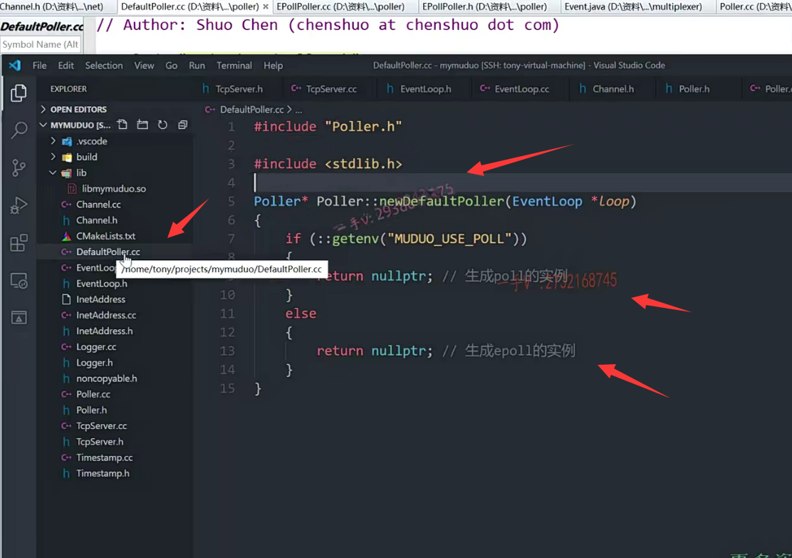


### epoll具体类实现

接下来我们的任务就是去写epoller

就是poller的一个具体的实现 epoll来重写这些纯虚函数

实现具体的IO复用的操作就是事件分发的操作。


## 总结

好吧，行，那我们这节课写到这儿的话，我们先编译一下呗啊。clear rebuild all projects.

好了，那就是编译一切顺利啊。

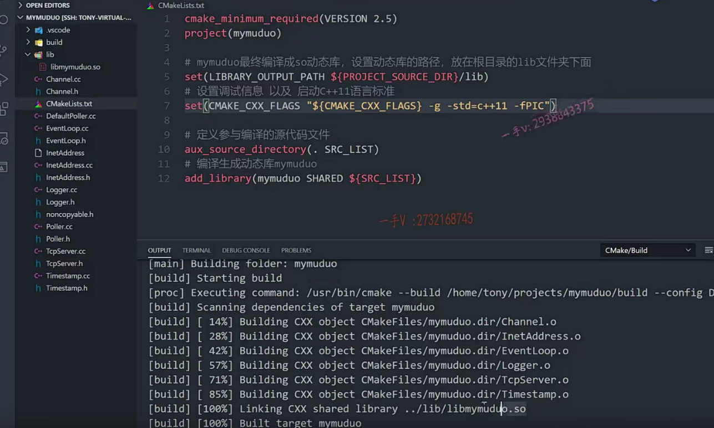


那我们这节课的内容就先给大家说到这里，

希望大家呢，也把这个poller相关的这个东西呢？

实现一下好吧，理解呢，

这个poller它所处的位置意义好吧，

以及人家这个default poller点CC的这个妙用，好不好啊？


来通过这么一个公共的文件分解了poller跟这个它具体的一个epoll poller的一个强偶合。

好不好啊？我们派生类只能依赖基类的基类，不要依赖派生类的，

因为基类本身就是抽象的概念，你不能依赖具体的实现的。


是不是这个大家在学这个C++基础课程，这个继承多态的时候呢？

应该已经给大家强调很多遍了啊，

希望大家呢，在具体的应用实践上。再去体会一下继承与多态的使用的一些工程上啊，需要注意的一些东西好吧OK，

那我们这节课的主要内容就先给大家说到这里。