上节课呢，我们把这个poller这个模块呢的代码，我们输出了啊。

poller这里边呢，是属于IO复用的一个出现的基类，

里边有一个newdefaultpoller啊，

给我们muduo库呢上层。

也就是event loop返回一个具体的IO复用的实例，

我们是它默认的通过一个环境变量来控制。

muduo库默认是支持epoll，还有epoll的，它默认生成的是epoll实例啊，

我们epoll就是poller的一个具体的lO复用实例

epoll还没有实现呢，我们这节课的主要任务就是来实现epollpoller

epollpoller实现完了以后，我们把epollpoller的这个模块儿的这个对象的生成。

我们给它补到这里啊。

那么，在muduo库的源码上，就是这两个文件epollpoller点h跟epollpoller点CC。

那我们知道它的这个主要实现什么呢？

那作为这个派生类，它主要的任务应该就是把基类给派生类保留的这些统一的接口，纯虚函数的接口。

是不是也实现了？update channel，remove channel，

也就是说通过它的这个具体的epoll ctl来进行一个add modify，还有delete。

是不是从epoll中去添加或者修改fd的事件以及删除这个fd啊？

# epollpoller类实现

对啊，主要就是做这些事情。

那好，我们先创建这个原文件啊epollpoller点h。然后再是epollpoller点CC，

我们把这个模块呢给出来。这是epollpoller public.private啊。

好，大家来跟我看一下啊。

首先，它得从这个epollpoller呢怎么样而来呀？

继承而来是吧啊？继承而来在这里边儿，我们得包含一下。poller点h啊。public.poller啊，

继承的时候是需要知道这个基类，详细的情况的，

所以我们需要包含这个poller的头文件，而不仅仅啊，只是做一个poller类型的前置声明，对吧？

所以要包含这个poller头文件啊。呃，

然后呢？我们就来看一下，你看epollpoller的这里边。

就需要去重写override override啊，这也就是C++11的一些新的语法表示呢，

在派生类里边儿啊，这些方法是覆盖方法override就是覆盖的意思。

那也就是说，必须由编译来保证，

在基类里边儿一定会有这些函数的，是不是接口的声明啊？

是虚函数在派生类里边儿？在这里边，我们要重写它了，如果这些方法在派生，

包括你给epollpoller的析构函数写override，

那一定是说啊，让编译器给你检查一下基类里边的这个析构一定是个虚函数。

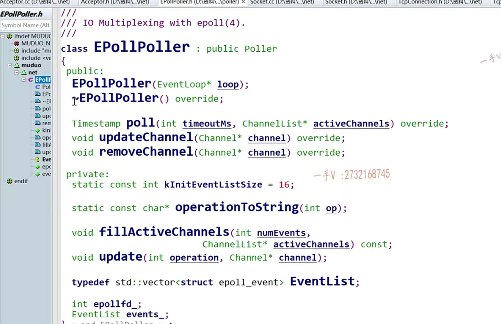

基类里边儿的函数如果连虚函数都不是

在派生类里边儿，也就没有什么覆盖的意思了，对吧啊这三个？

然后呢，这是epollpoller内部的一些接口，few active channels跟update。

然后它底层呢，是一个vector。放epoll event的

大家一般自己写一个epoll编程的实例的话，一般呢，对于就是。epollwait的第二个参数呢？

它需要一个epoll event的一个数组，

大家一般都是定义了一个定长的数组，

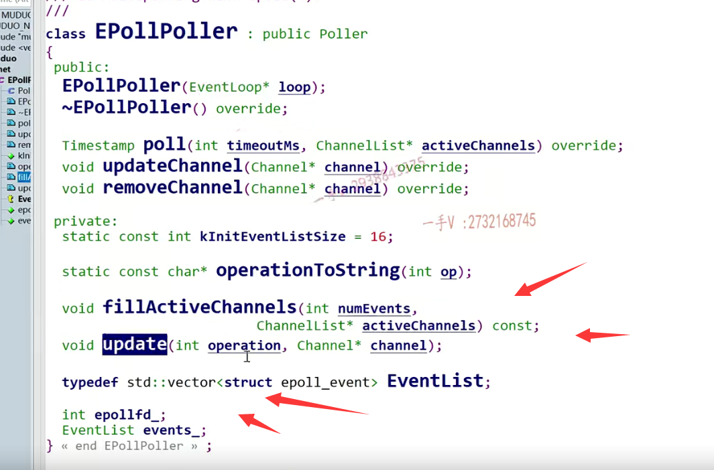

定长的数组呢？不好的地方就是它无法动态的扩容嘛，对吧啊，

因为大家写的都是一些测试性的，教学性的一些呃demo啊

demo代码也无所谓，扩容不扩容，

但是实际在线上运行的啊，能够真真正正上生产环境的这些网络库对吧？

那一定要就考虑呢？非常全面啊，考虑非常全面。

那么，在这里边就是用vector套了这个epoll wait进行了一个实例化，可以扩容嘛，

对吧啊？

另外呢，它的成员变量就是一个epollfd，

这是epoll相关的方法接口都需要用到的一个fd，

这个就是我们说了这个epollfd要通过epollcreate来创建。

啊，映射的就是epoll底层产生的这个特殊的文件系统啊，

在最早的理论阶段，我们给大家总结了一下epoll的一些理论知识啊。

要注意epollfd到底代表的是什么样的文件描述符啊？

好，那我们把这个类里边的成员。

我们先输出一下吧啊。大家来看。

那这里边你首先需要的是一个vector啊。然后你还得需要谁呢？sys.应该是epoll点h啊。

OK，在这儿需要一个type define，我们用using啊，用新的这个using来定一个vector用什么来实例化呢？

用epoll event在C++里边呢。struct可以省了

struct给你东西也是类，用类直接用类型名就行了啊。

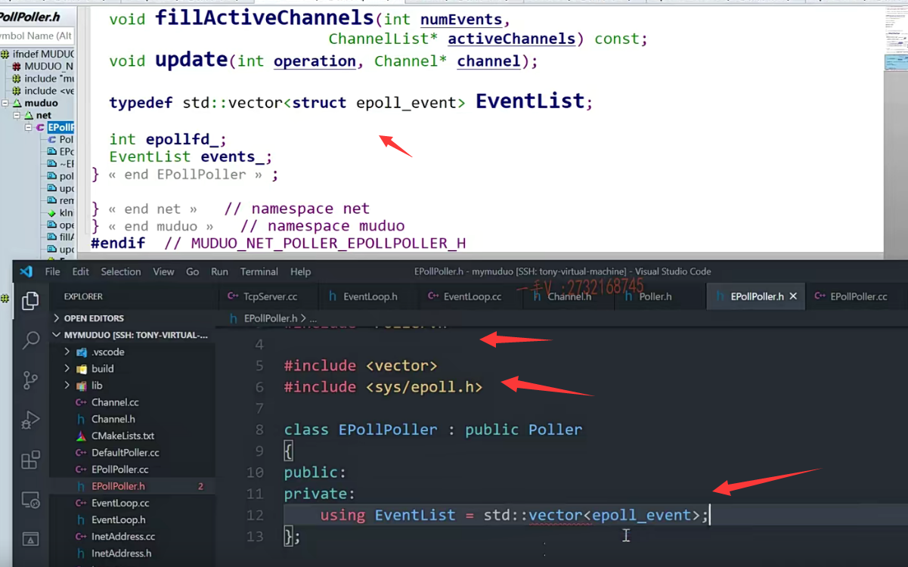

那么在这儿就是一个epolllfd下横杠，还有一个就是event list。

event list.events.这个应该不是错的啊，是我们这个VS code还没有刷新出来而已。

这是它两个主要的成员变量。

好的吧啊。就是一个是epoll。一个是events 这个将来就作为这个epoll位置的第二个参数。

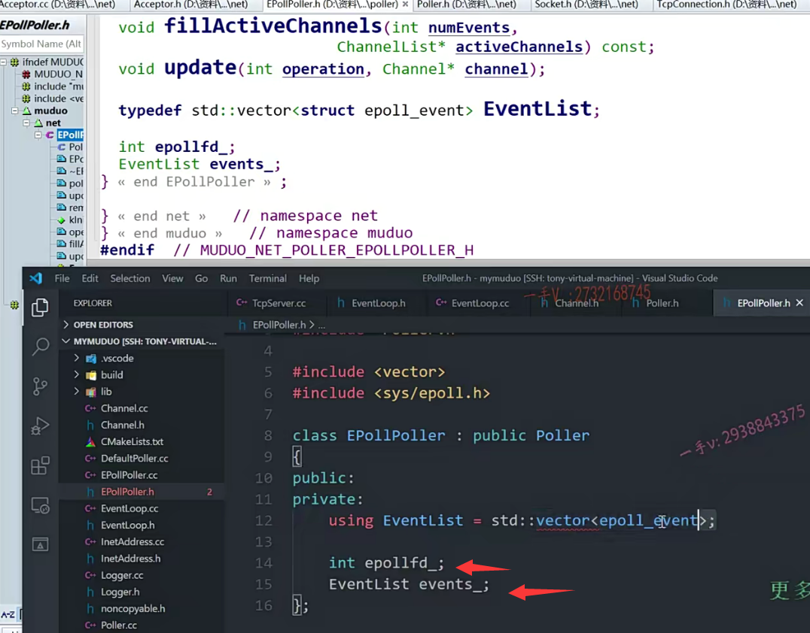

epollwait的大家还有有没有记得epoll wait的返回值

是返回了？我们看一看吧啊。epoll_wait.

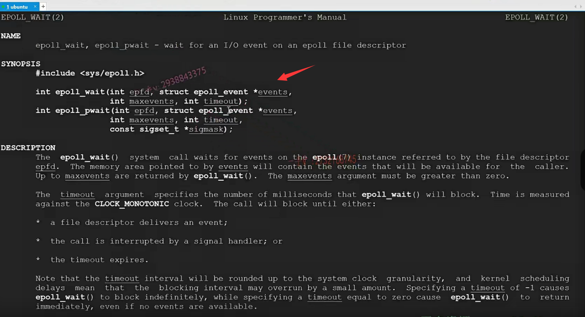

OK，第二个参数里边放的就是最终它发生事件的fd。

对不对？

返回值就是发生事件的fd的数量，events的数量对吧啊？

那么，这是我们这个vector的意义所在，都是epoll所必须的啊，

当然它从poller继承上来。

还继承了poller里边儿的成员变量叫channel map。

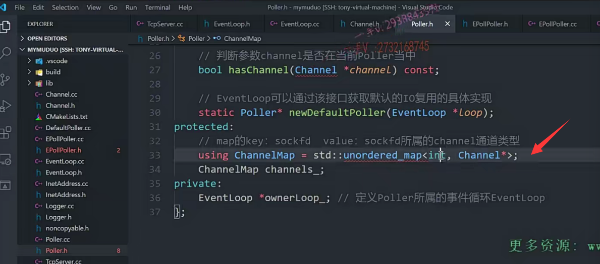

也就是说，它里边儿是一个map

键是整形，value是channel*

这个整形，我们之前说了，这就是channel里边儿所包含的所表达的那个fd对吧？

用文件描述符映射包含文件描述符这个的channel类型啊。

接下来呢，我们把这个方法呢，给它列出来。

### 构造函数

epollpoller还是event loop*

okay。那么，在这里边儿呢？

就是一个析构函数。override

这刚解释过了啊，这表示呢，让编译器去检查，帮我检查，我是一个覆盖函数，之所以说覆盖，

那就表示基类里边儿这方法一定是个虚函数，对吧啊？

好了，

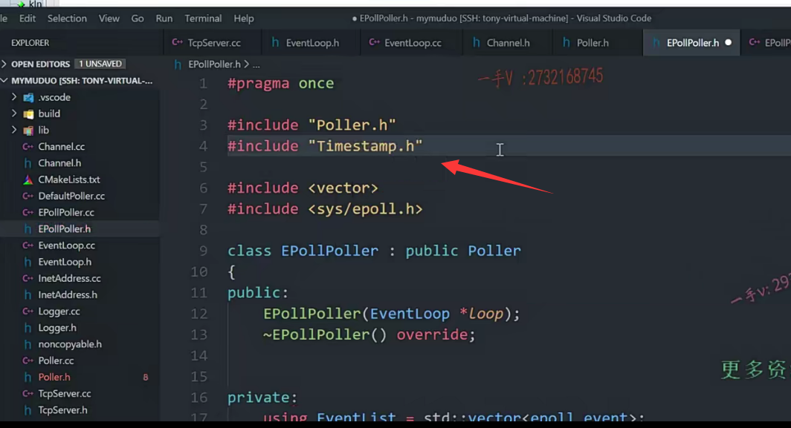

这里边还有用了time stap，我们得需要包含相应的这个头文件啊。time stamp.

### 重写基类poll

poll这是time out IO复用的这个超时时间，对不对？

还有这个channellist * activechannels

这个channellist我们是在poller里边定义过的。

它是一个vector channel*。

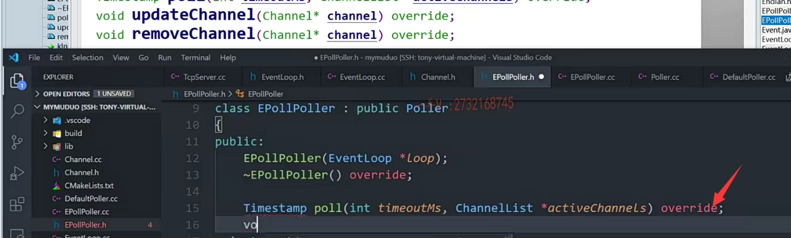

然后这也是一个override。对于基类来说，是一个重写的覆盖函数，对吧？

同名覆盖函数

### 重写updatechannel   remove函数

update channel这些接口都似曾相识吧？

在channel里边儿，当时都调用过是吧？

我们先把这个方法接口呢，输出一下啊，到时候呢，具体写它代码的时候，

我们到时候综合来看一下他们在channel的哪里调用的，你还能想起来吗？

你可以先想一想这些方法呢

update channel跟remove channel，我们都在channel里边调用过。

channel override OK主要就是这三个函数了，是不是？

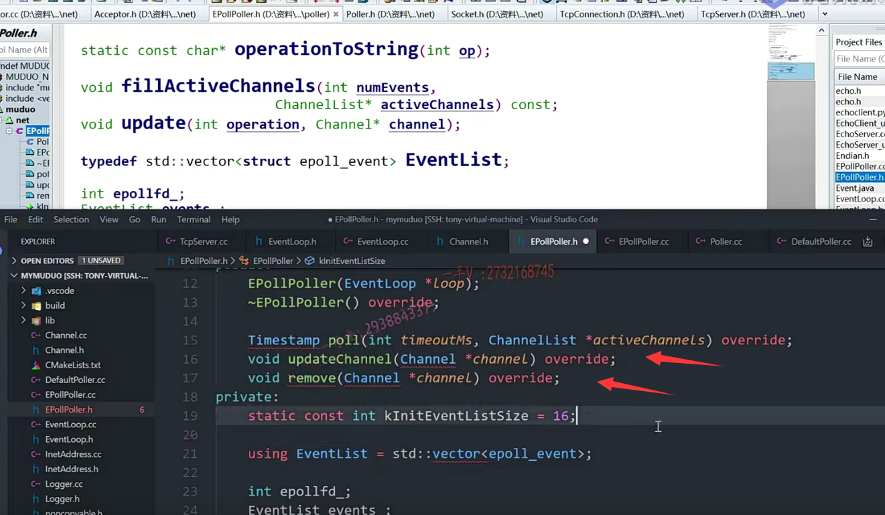

呃，里边还有一个重要的东西呢？

就是它的一个常量int event listsize =16.

这个呢，是给这个vector啊？

==就是epoll event这个vector初始的这么一个长度好吧，==

这个operation to string这是相当于一个debug信息用的一个函数，我们暂且就不要了啊。

### fillactivechannels

然后呢？这里边有两个辅助函数都在私有的接口里边。

fillactivechannels.就是fill是填写啊 active就是活跃的

填写活跃的channel对吧？number events.还有呢？channel list.

activechannels counts.

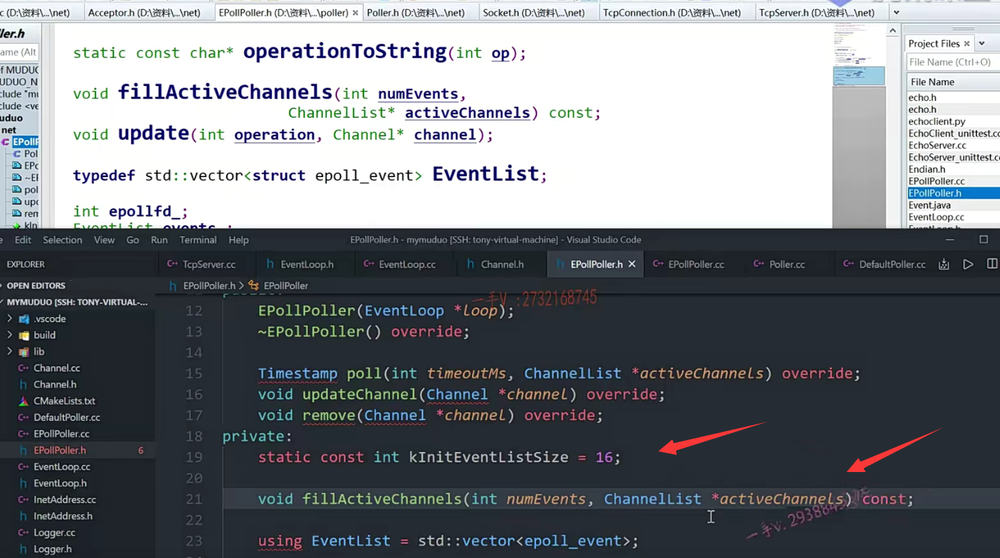

### update

还有一个什么方法呢？

update operation channel channel.

好了，大家来跟我看一下啊。

这三组呢是？重写基类poller的抽象方法，对不对？

这个filllactive这个是填写活跃的链接。对不对？

这个是干嘛呢？

更新啊channel通道

实际上在这个epollpoller里边，这个update相当于就是调用这个epoll _ctl来对channel里边儿所包含的这个fd事件，

你不是设置了fd事件的感兴趣的events吗？

对吧啊，就是channel里边的这个fd事件的这个events，

那它就要给epoll里边是不是进行设置啊？

就是epoll_ctl的调用啊，都是在update里边。

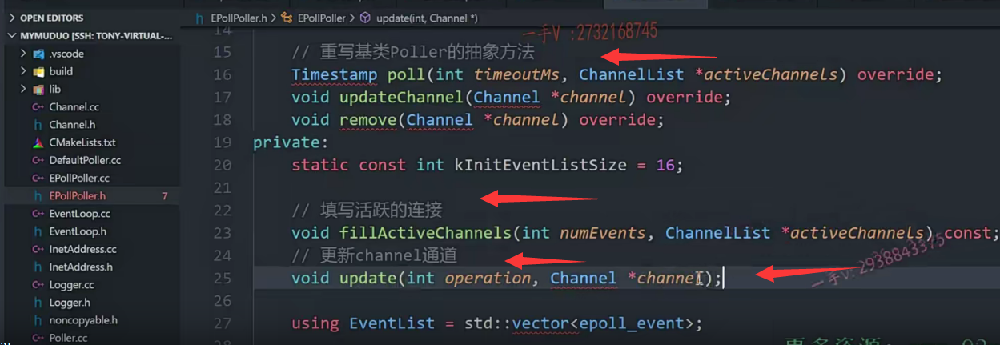

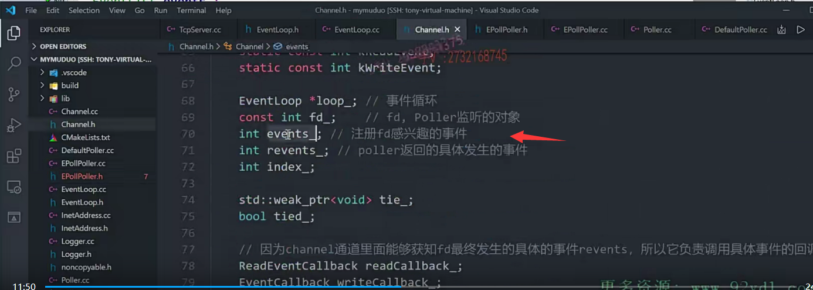

就是这几个接口，我们在写的时候呢，

写它逻辑代码的时候啊，再具体再给大家详细的进一步解释，

所以epollpoller呢主要的这个对外的接口就是这几个，

除了构造跟析构。这几个这几个。

大家先想一想啊，先想一想。

我们应该有这样的一个逻辑啊。

### 回顾epoll的使用

就首先epoll的使用。你还记得有什么吗？

首先是一个epollcreate吧，创建epoll的fd对不对？

然后就是epoll ctl。添加你想让epoll wait监听的这个fd，以及针对这个fd所感兴趣的事件，

对吧啊？最后呢 epoll_wait？对不对啊啊？

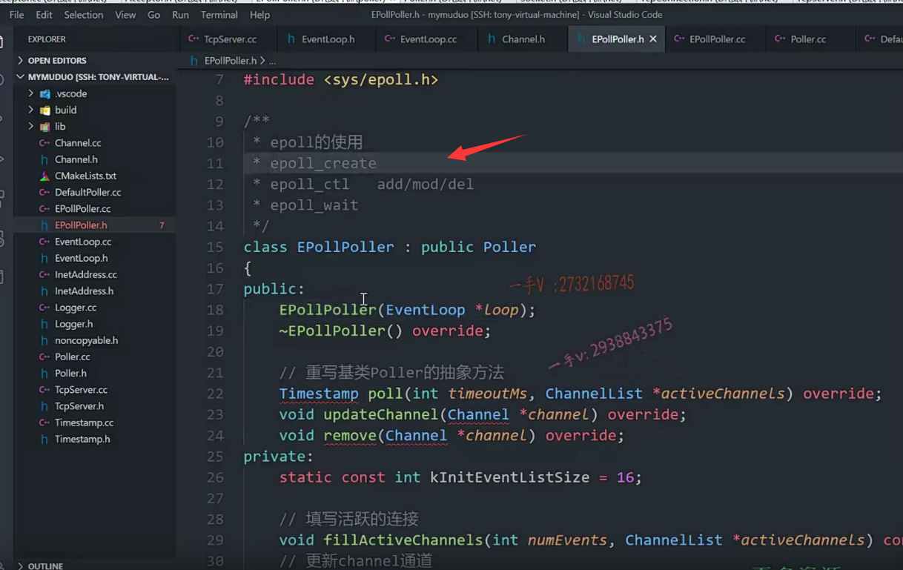

这个epoll ctl里边儿呢？主要就是add modify delete是不是相应的这个事件啊？

跟大家来看，其实你对应一下。

在构造函数里边，肯定就是epoll_create。

你create的这个epoll fd，到时候记录在这个成员变量里边析构的时候，

是不是应该要把这个epollfd给close掉啊？

对了吧啊，所以呢epollcreate这个创建了这个epollfd

设计了这个构造跟析构。想一想啊。

那么，这个epollwait很明显，epollwait就是在谁里面嘛。poll啊。

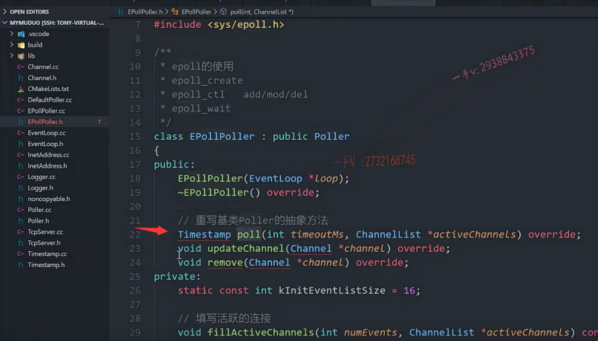

那么update channel。

这个应该是个update channel和remove channel吧，是不是？

唉update channel跟remove channel这两个方法是干什么用的呢啊？

那这个用到了，是不是channel啊？

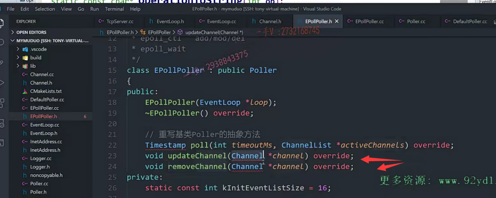

只是用了这个指针类型，所以我们直接在这里边前置声明一下就可以了。

class channel.

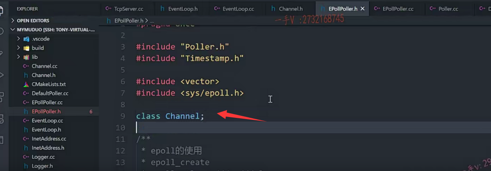

这里边用的update channel跟remove channel

主要不就表示的是epoll ctl的行为吗？

update就是更新，也就是add或者是modify是不是已有的一个fd感兴趣的事件

remove，就是把一个epoll之前签订监听的这个fd是不是给它删除掉啊啊？

所以update channel跟remove channel。对应的就是epoll ctl的这个行为。

这个私有的这个方法fill active channels。

跟update肯定是被上边的这些方法所调用的嘛，封装了一些模块化的操作。

OK吧，所以呢，这个epollpoller既然是以OOP的方式来封装了epoll的主要操作行为，

那么epoll的主要操作行为涉及哪几个系统API。

大家可以在这里边儿封装的方法呢，跟上边儿这些东西对应一下啊，以理解它的这个含义。

好吧啊。OK，那我们这节课的时间还是挺宽裕的啊，所以我们就继续讲吧。

这个是epollpoller.h。

那么在这儿呢，我们需要把它的这个构造函数跟析构函数，我们先完成了吧？

okay.这是构造。诶，这是析构对吧？

来，大家跟我在这儿看一看。啊，这里边还定义了三个什么东西呀，

### 定义三种不同的状态

还定义了这个三个呢常量这常量是干什么用的？

就是来标识呢？当前channel跟epoll的一个状态的是

knew，相当于就是你从来没有添加把这个channel添加到epoll吗？

added就是已经把一个channel添加到一个epoll里边了，

delete的就是你把这个channel已经从这个epoll里边删除掉了好吧，

就代表了三种不同的状态。

knew=-1表示，什么一个channel怎么样？还没有添加到里边对吧啊？

就是epoll里面现在。

added的这个表示什么？

这个表示一个channel已经添加到epoll

怎么完成是吧？已经添加到这个poller了啊

kdeleted=2这个表示什么啊？

这个表示有一个channel啊，已经从poller里边删除掉了OK？

好，那么在这儿呢，

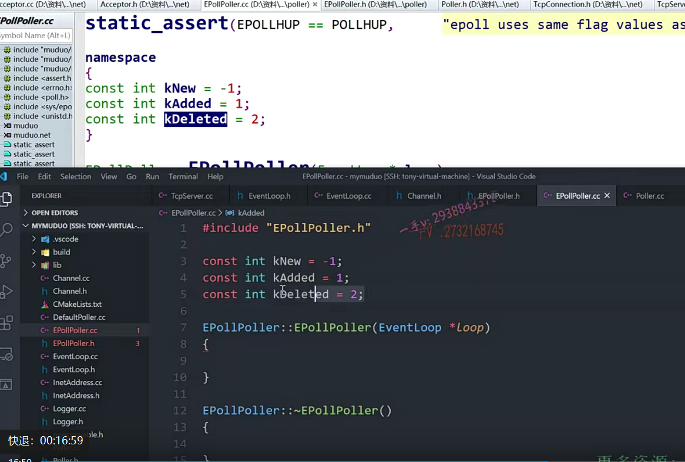

### 调用基类的构造函数来初始化从基类继承来的成员

看一下我们的这个成员变量啊。

首先，调用基类的构造函数来初始化，从基类继承来的成员对不对啊？

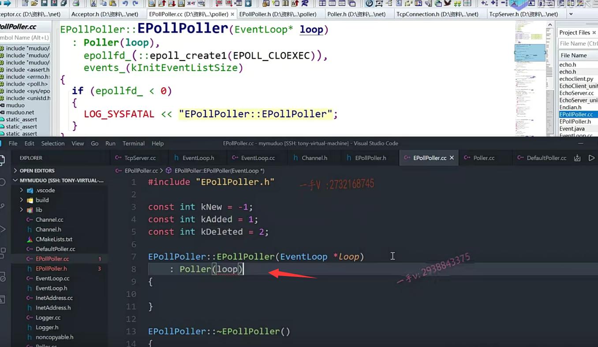

那从基类继承来的成员都有哪些呢？

那我们可以看一看。

一个channel map

是不是还有一个event loop啊？

就是当前呢这个poller所属的事件循环是哪个？

因为我们之前说了一个事件循环代表一个线程嘛，

一个线程里边儿就有这样的一个事件循环，是不是啊？

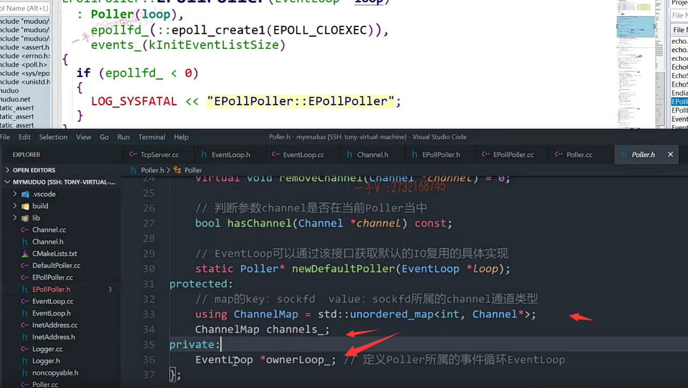

还有的话呢，就是它的。轮到自己了通过基类的构造函数，就把基类继承类的成员都给它进行初始化了，

然后就该到自己了。epollfd

你看调用的是不是就是？epoll。

它没有用epollcreate，各位。epoll.h里边包含了两个方法。

呃，我们不是epoll wait它啊。

应该是谁呀？epoll crate它有两个方法，

一个是epoll create，一个是epoll crate1，

epollcreate 的这个方法应该是大家写代码，代码最常用的啊，

create new epoll instance，返回一个epollfd实例。

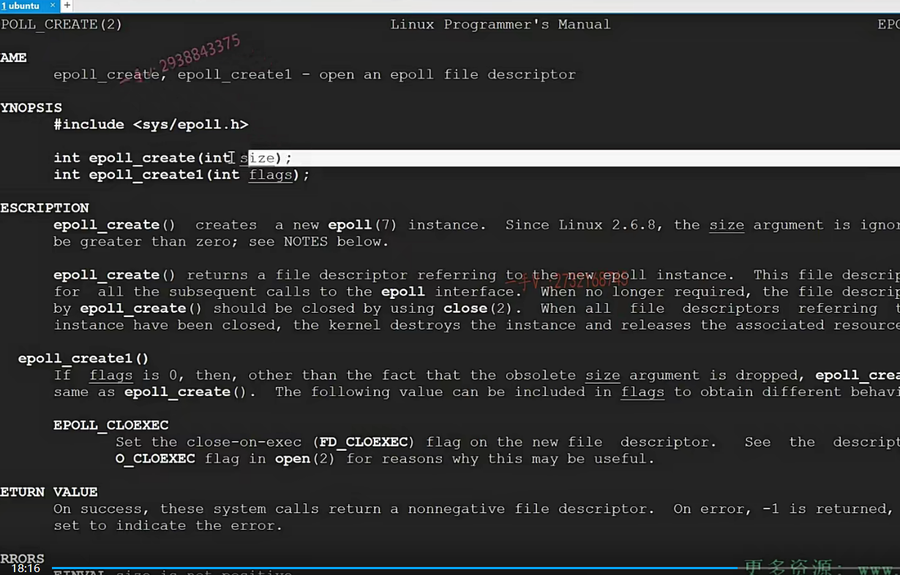

自从二点linux 26点八内核以后呢，the size argument is ignored，but must be greater than zero。

就是呢，这个内核版本以后啊。当你调用epollcreate的时候呢，这个参数呢，已经没有什么意义了啊，

但是必须是来一个大于零的数。对吧啊，大于零的数。

### epollcreate1概念

epollcreate1是什么意思呀？

就是a flag is zero。other than the fact that the.dropped啊。

这个方法呢，跟前面的epollcreate是不是一个意思呀啊？

一个意思。the following value can be included in flex to obtain different behavior，那就是说呢，它底下可以给你提供一个flags的这么一个行为选项。啊，这个。

cloexec就是close的意思exec。啊exec就是excef，

大家经常都用fork方法，然后马上就用execf方法来替换子进程的，是不是程序啊？

啊，那么跟之前大家在linux上学习的这个open操作

给fd啊通过FCntl.

就是文件描述符的这个控制函数啊，选项控制函数设置的这个标志呢，是一个意思。就表示说呢。

当我去使用这个epollcreate1的时候，创建的这个epollfd啊，然后呢？

#### 不会关闭父进程fd资源

==你在当前进程里边儿再去fork创建一个子进程，==

==然后用excel再去替换子进程的这个程序的时候啊。==

==在子进程里边呢。==

==就不会把这个就把父进程设置了这个标志的fd资源就都给关闭了。==

没问题吧啊，我们这个fd的flag还是经常见的啊，还是经常见的？

因为默认情况下，子进程是会继承父进程所有打开的这个fd资源的。

okay，这就是这个意思啊。

所以呢，这儿调用了epollcreate1，传入了这个epoll，

唉，传入了这个选项。相当于把epoll fd创建起来了。

然后就是events默认是就是那个vector嘛，

默认的长度是多长啊？就是这个init event list size。16对吧啊16。

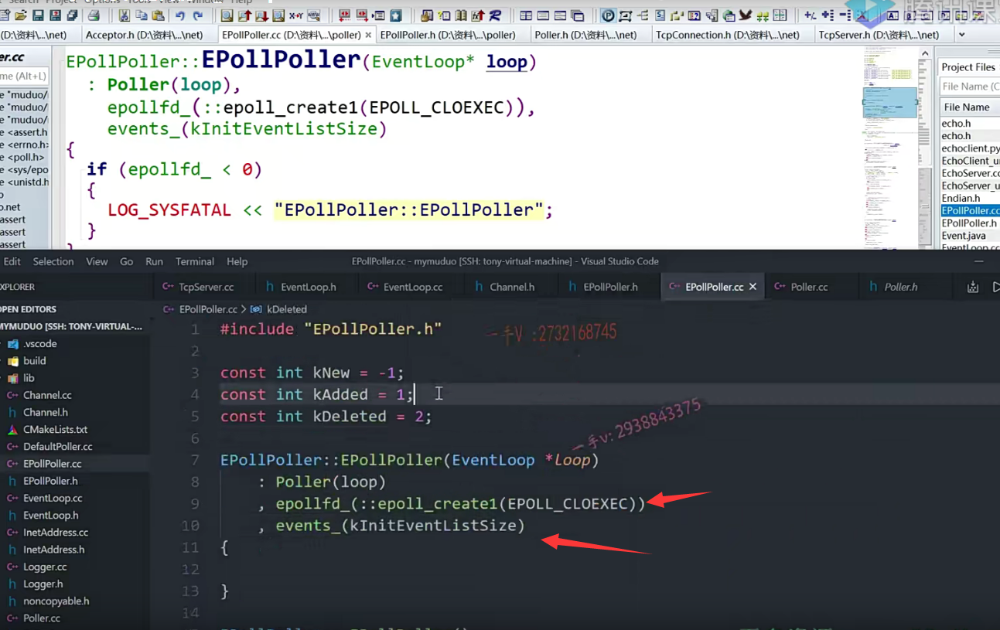

面试官要是不相信你看过muduo库的源码，

你直接把这个细节告诉他，你说那个muduo库底层的这个epoll啊。说这个。

所使用的这个epoll event，这个vector啊，默认的长度是16对吧？

不信你去源码上看一下，看我说的对不对？

是不是啊？因为现在的这个有些人啊，应该是很多人在简历上啊，夸夸其谈。

把自己根本没有做过的事情都写上去，是不是面试官肯定要鉴别真伪的啊？

你到底有没有看过是吧？OK，在这里边儿呢？

构造函数主要就是把成员变量初始化了一下，

这里边儿进行了一个判断，就是epoll fd，

如果小于零的话，代表创建失败了。

底层的lO复用都没有创建起来，整个程序就不需要运行了，对不对？

### 日志 fatal那 再添加退出

那么，注意在最开始的这个log这里边啊，我们再添加一个东西啊。

就这我们再添加一个东西。

因为我们之前说了这个fatal啊，就是不可挽回的call信息。对吧啊，

在这你打印完日志，你就直接干嘛？

你就直接exit吧。就表示出错了。好了吧啊，这个就表示直接就出错了。

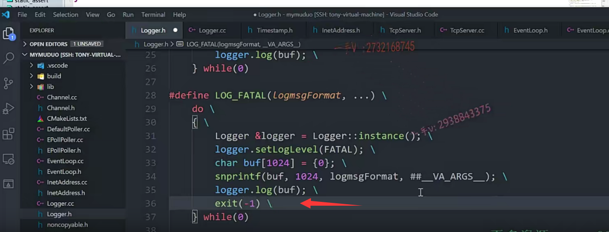

像这个error就是我是允许你这样错误发生的，我只做记录，

但是程序还是正常运行的fatal的话就是core down了。

啊，就玩不了了，直接我就退出了整个进程了。

好吧啊，那么在这里边呢，我们包含一下这个日志文件吧。

### 写一下日志

log点h。

o kay，log点h啊。

在这儿呢，我判断一下，

如果呢，我创建了这个epoll fd，如果小于零了。

那我在这就是log fatal。epolllfd e pol.create error.

好吧，我把打印一下。

打印一下全局的这个error number，

这个应该在我们要包含一个头文件。

errno点h。okay，

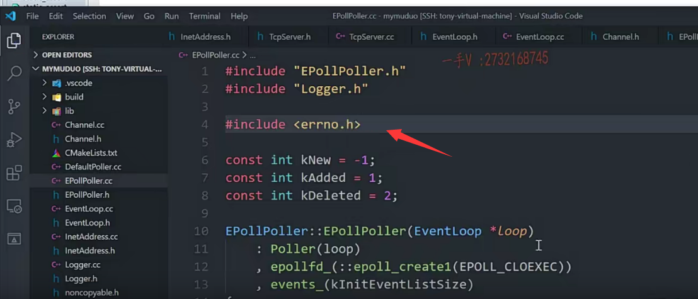

### 由日志的级别来判断

而你调用这个的话呢？这打印完日志，直接就跳出了，对吧啊？

所以呢，也就省得我们在这儿去调用exit了啊。

由日志的级别来判断，是程序继续往下运行呢，

还是由于不可挽回的信息直接？结束进程啊。

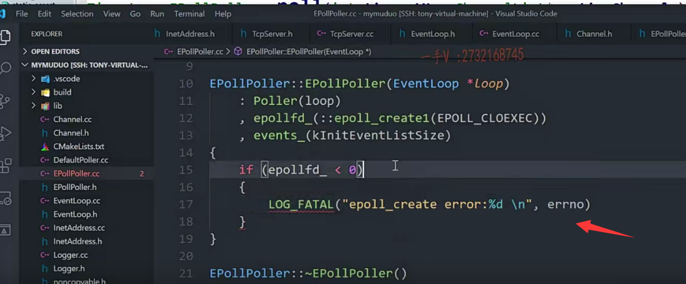

那么，在析构函数这里边，我们简单了，

就是close。epoll fd了。好吧啊，

就在这里边close epollfd了。

这就是完成了它的构造跟析构。

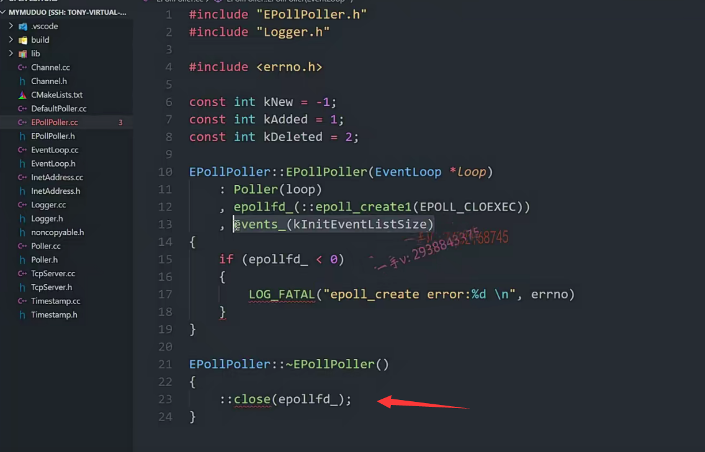

就是创建了epoll fd。创建了epoll events。对不对？

用vector。来作为这个线性的一个存储啊，内存块

epoll wait最终会把发生事件的fd的event都放到这个vector序列里边儿啊。

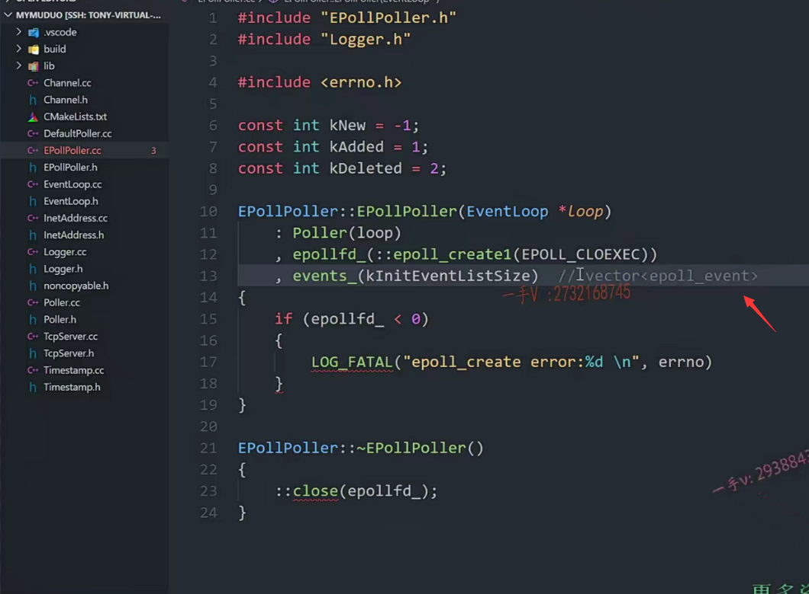

好，那我们今天这节课先说到这。

临时编译一下。没什么大问题啊。

好，那这节课的内容呢？我们就先到这里。大家呢？下节课我们继续呢，

把剩下的epollpoller，剩下的接口呢，它的这个功能我们给它完成了啊。

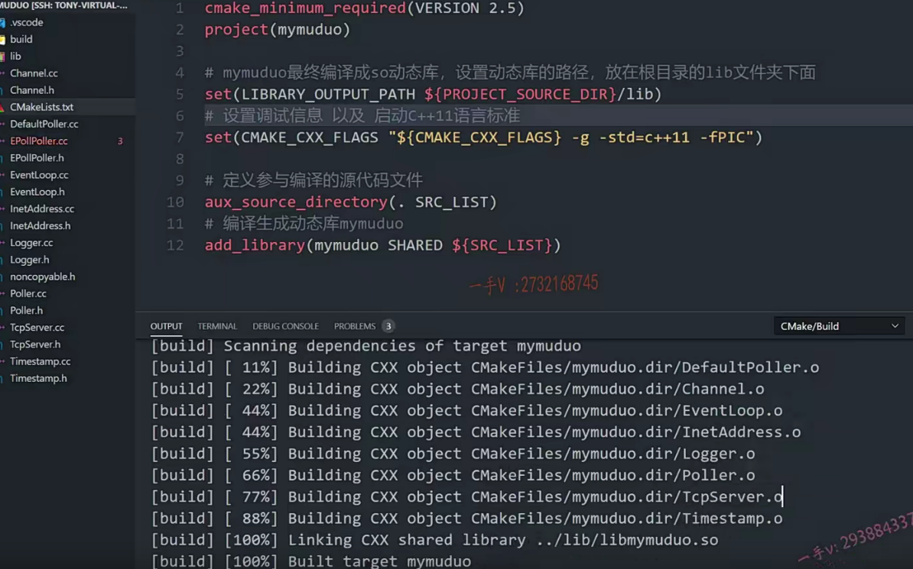