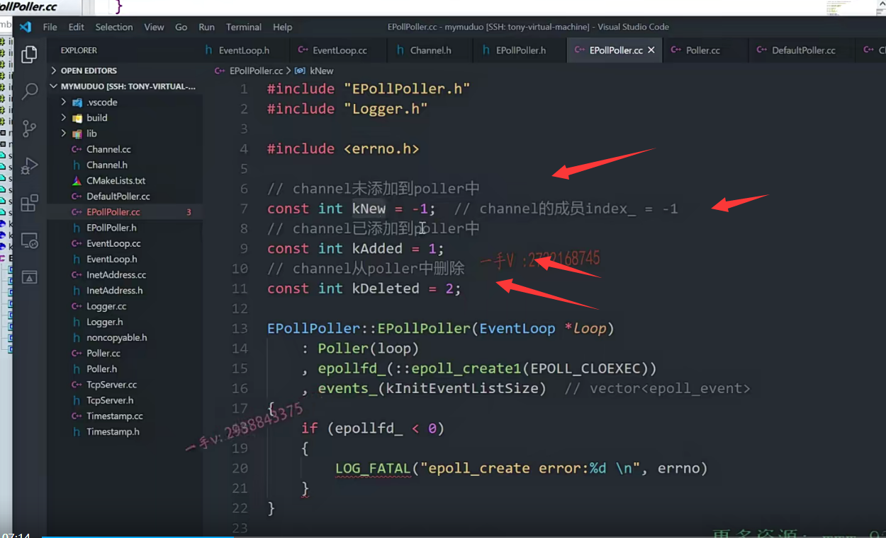

这节课呢，我们接着来说啊，

上节课呢，我们把epollpoller的构造函数跟析构函数我们。写完了，==也就是说对应的epoll的使用呢？就是epollcreate这个操作完了。==

接下来的这个epoll的操作就是epoll ctrl，对吧？

设置了给epoll设置了这个合适的这个fd以及相关的事件啊，

感兴趣的需要epoll监听的事件。

然后就是epoll wait 

==epoll ctl在这里边对应的动作就是这两个嘛update channel跟remove channel对吧？==

==最后的epoll wait对应的就是这个poll嘛，==

所以从顺序上来说，我们应该先处理epoll ctl，

所以我们就先来写这两个方法。

然后呢，再写这个poll。好吧啊。

## 实现五个接口

好，我们把我们这节课要写的都先给它。拷贝粘贴到相应的CC文件当中。

好，这节课我们看能不能把这五个接口呢？给它实现完了。

讲到这里，我们这个muduo库的代码书写也进行了一部分了，

大家实际上也可以呢。先照着源码，把这几个接口呢，先填一下啊。

然后呢，再来听我的这个剖析分析，

看你填的时候啊，你看代码有没有想那么多？

啊，思考的是否正确？或者说是有哪些地方呢？

你没有理解的透彻漏掉了，对吧啊？

好了，那在这里边呢，我们一一来看吧啊，先写什么呀？

先写这个update channel跟remove channel吧，

这两个对应的就是epoll ctl好吧？

我们把这接口呢，先给出来。

## update channel

#### channel的update跟remove最终调用的都是它的父组件event loop来调用相应的方法来访问poller相应的方法的啊

好，大家来跟我看一下update channel啊。update channel在这里。

大家来先跟我看一下这个逻辑啊

update channel跟这个remove channel，

我们之前呢知道啊。它是在什么时候调用的呢？

就是在channel的时候调用的。对吧啊，因为channel里边包含了fd。以及相应的这个对fd。

需要监听的fd的事件就是fd感兴趣的事件需要注册的对吧，

以及最终poller给这个channel返回的，你这个fd发生的这个事件。

所以呢，这个调用啊。因为channel是。

呃channel想去注册这些事件的话呢？

channel是没有直接访问，没有办法直接访问poller的，对吧？它得通过他们的这个父亲组建啊，就是这个event loop。

通过调用loop的update channel。

这个update channel最终呢，就调用了poller的这个update

是不是同样的这个channel的remove啊？

怎么从poller里边把当前这个channel删除掉呢？

不监听这个channel了，那就得通过它的这个父组件event loop。remove channel

那这里边儿肯定调用的就是poller的remove channel。对不对？

也就是说呢？channel这里边的update跟remove，最终调用了poller的update channel跟remove channel来把channel本身从poller里边添加修改或者是删除掉。

因为channel是无法直接访问poller，它们俩没有这个从属关系对吧？

但是它们俩都是属于event loop来管理的，

==所以channel的update跟remove最终调用的都是它的父组件event loop来调用相应的方法来访问poller相应的方法的啊。==

### 调用关系 channel => EventLoop => Poller => Epollpoller

好了，那我们update channel跟remove channel，

我们刚才说的就是什么时候他们被触发的对不对啊？

他们俩被触发就是channel的这个update跟remove，

然后呢？通过调用event loop的updatechannel跟remove channel。

这个poller写完以后，我们就该写eventloop了，

到时候大家可以留意一下这两个啊，最终呢，调用到了这个poller的update channel跟remove channel好吧啊，

再具体的调用到了epollpoller啊，poller只是一个IO复用的一个抽象层啊。

好，那么大家来先跟我看一下update channel。

首先在这里边，这是一个断言啊，断言就是这个操作呢，是在当前这个线程里边儿执行的，

这个我到后边儿再来说这个啊，

这是一个断言，我们暂且先不考虑这个逻辑。

#### index 主要用来判断channel状态

channel index当时我们实现channel的时候呢，给大家看了channel里边有一个index。

我们当时给大家说了，到用的时候再给大家来说这个意义。

index初始化的时候是多少？多少呢？

来同学们看看index channel里边有一个下标序号索引相关的一个东西啊，初始化是几

负一是吧？你有没有问？为什么不初始化成零呢？我们不是经常默认值初始化成零吗？

index为什么初始化成负一呢？来，

#### knew kadded kdeleted

大家睁大眼睛。跟这里边的这个knew看一下嗯，knew的初始化是不是也是负一啊？

哎channel的这个成员index。初始化就是负一。

我们给大家说了啊，这个new表示什么呀？

new表示channel未添加到poller中。

对不对added表示什么呀？channel已添加到poller中。

这个表示什么？这个是channel从poller中删除，

所以也就是说呢，

==channel的这个成员变量index实际上在这里边表示的就是它在poller中的一个状态或者epoll中的状态是未添加呢，还是已添加呢，还是已删除OK吧，==

所以你看初始化是负一对应的就是这里边的knew。

就表示什么呀？==就表示新创建的这个channel并未添加到poller当中==，

那当然了，你新创建的poller啊，

==新创建的这个channel肯定是未添加到poller当中嘛。==

对吧，你只有调用了channel的update啊，

==一看这个channel的这个状态啊，是什么是knew？比如未添加，==

==那就添加。==

如果update的时候发现这个channel的index状态已经是added，

就是说呢，你这个channel已经添加到poller当中了，

你再调用update，那就是什么意思？

哦你要更改你所感兴趣的这个事件events，对吧？

哎，就是这样区分的好了吧，

来大家往这儿。继续看，

这相当于就是获取了一下这个当前这个channel啊，在poller中的状态是knew呢，还是kadded，还是kdelete？是不是

这里边用日志呢？做了一个什么，做了一个信息的，这个打印好吧，

### channels是epollpoller从基类poller继承来的一个channel map

如果说，你这个channel的状态是一个knew未添加过，或者说是已删除。对吧，

那都进来这个if 

已删除的话，还有可能再次被添加到poller当中嘛，是不是啊？

那么，这时候通过fd函数获取了channel所封装的fd

如果index是new的话。什么意思啊？

哦，index new的话呢，那就把这个channel以及它所包含的fd键值对儿嘛。

写到是不是channels里边儿

==channels是什么？channels就是这个epollpoller从基类poller继承来的一个channel map嘛？对吧啊。==

键就是它的这个fd，值就是包含这个fd的channel，

这个我们之前看到。那没问题了，

### assert就是当后面为true时继续运行后面的

#### 这里就是poller从来没有管理过这个channel的时候，channel虽然存在，可能是之前的

如果index是kdeleted的话呢，那在这里边儿呢，

它只是做了两个断言啊，两个做了两个断言。

对应什么意思呢？

就是说呢，这个fd还是在这个channels里边儿，就channel map里边儿的？

就是在event loop里边还没有删除这个channel。

对吧，还没有删除这个channel，

但是这个channel呢，并没有注册到哪里呀，并没有注册到这个poller当中。

有可能刚开，从来未注册过那

==index就是new，有可能是你是之前注册过，但是从poller里边删除了，==

那么你现在index  kdeleted。好吧啊。

==那在这里边就是index=new的时候应该是poller是吧？poller从来没有管理过这个channel的时候呢啊，==

应该等于new的时候。添加到这个里边来。好吧啊，

### 再重新设置下index

那么你看给channel的这个index是不是设置了一下，

从最开始的负一就是knew到k added？

然后调用了update，你看是不是调用了这个这个update里边

肯定调用的就是epoll ctl啊？

是什么意思呢？要添加。要往这个epoll中添加一个channel啊

添加一个channel。

### index是added

else else的话呢，不是new不是delete，那就是added了。

已经是added，就是这个channel已经添加到poller当中，

你现在还要update，那就是啥呀？

啊，那就是剩下的逻辑了，我们看一下，

先获取fd。对吧，这都是一些断言，大家可以理解一下啊。理解一下。

find这个不等于end，就是说呢，它已经在channel map里边存在了，

它已经往poller里边注册过了。对不对啊？

index已经是kadded了，就是你进这个逻辑index必须是kadded的了。

如果说。你这个channel上没有？isnoneevent，

这之前我们看过吗？

就是把这个channel包含了这个fd的events改成none event

就是零嘛，就是对任何事件是不是都不感兴趣了哦？

### isNoneEvent 发现对任何事件都不感兴趣了

那意思是什么呀？就是说呢，你看你这个channel已经注册到poller当中了，

你现在要update它

update的时候发现这个channel上。

想对这个channel所表达的fd包含了fd感兴趣的事件，

==发现感兴趣的事件是个零，就是那就是对任何事件都不感兴趣了，相当于就是什么呀？==

==唉，要从poller中呢，把这个channel是不是删除掉啊，==

然后给这个channel的index呢？设置成什么？

==设置成deleted。==好吧啊

### 分别对应epoll_ctl中操作

else的话，那就是channel包含了那个fd的事件，是有事件的，

那就是。epoll ctl modify.

你看这分别就是对应了epoll ctl的add添加新的什么新的channel，

然后是什么删除已注册的channel，

对已注册的channel的感兴趣的事件进行一个modify？更改大家。

可以理解一下这一段逻辑好吧啊，对应的就是我们epoll ctl。

## 再强调一下 关系

好，那在这里边，我们再写一下啊，写一下。

嗯，在这写之前呢，我再来强调一下啊，

强调一下，强调什么呢？

就是我们给大家在剖析的时候呢，把核心点都给大家介绍到啊。

### 极端情况下，你把event do里边儿所有的channel都注册到了，是不是poller上

event.loop里边儿包含了什么呀？

包含了两个channel list以及一个poller。对不对

poller呢？现在它有一个什么channel map？

channel map里边啊，就是一个什么东西呢

键就是fd，值就是一个channel诺星。

好吧，event loop里边里边应该放的是所有的，因为它是属于事件循环的，

放的是所有的channel。

呃，一个channel呢，相当于就是表示一个fd对不对啊？

那么poller里边这个channel map就表示的是你向poller里边注册过的话。

那你就把当前这个channel的地址呢，记录在poller的这个channel map里面。

==也就是说，event loop里边这个channel list里边channel是大于等于poller里边的，这个channel map里边这个值的好吧啊。==

==什么叫大于等于呢？也就是说是极端情况下，你把event do里边儿所有的channel都注册到了，是不是poller上啊？==

#### update方法

OK吧啊，那么大家看你看在这里边进行删除的时候啊。

进行这个up delete的时候。modify的时候。add的时候，

那对应的是不是都是相应的一个channel啊？

那具体的他们在添加删除修改的时候，针对这个参数，

==第二个参数channel做了什么样的操作呢？==

==那我们到时候呢，在update方法里边再去看一下。==

### 将先前的前置声明channel，要在.h中包含其头文件

好吧，行，那我们先说到这儿啊，

我们把这个epollpoller的这个update channel的逻辑呢，我们实现一下。

先定义什么index=channel。指向的channel呢？

==在这里边儿啊，我们只是进行了一个类型的前置声明，==

==现在呢，需要访问它的方法了，成员了。在这儿，我们就得必须包含一下它的这个头文件了。叫channel啊，要不然呢，编译器在编译epollpoller点CC的时候呢，根本不知道。channel里边有什么东西啊？==

### 日志书写

channel。指向了这个index，现在这个index明白了吧？

对应的就是epollpoller的这三个状态啊。

然后呢？这里边儿是一个log，我们来一个login分儿吧，好吧？

呃，这个是events呃fd是吧？fd百分之d啊？嗯，然后是events。这也是一个。百分之d吧，整数啊。然后还有个什么index是吧？也是百分之d呀。channel fd.然后是channel。events，然后是个index。

==用这种格式化字符串的方式呢？进行日志的这个输出。还是非常方便的吧，==

因为格式化字符串跟具体的数据是分开的，对不对？

而不像呢C++这种方式呢格式化。跟数据是砸到一块儿了啊，这个不好看，不好控制啊。

就是日志推荐这这种输出方式还是比较好的。

那么，在这里边看了啊

index，如果等于knew或者是index=k deleted。

这是做的是index，如果等于knew的话，

那就是从来没有添加到poller当中。是不是啊？

那是需要干什么的？先把它增加到poller的这个channel map里边的。好吧啊，

那先获取fd=channel->fd

然后怎么样啊？channels。fd.等于什么？等于channel。

你看这里边的assert断言，就是通过fd在poller的channel map里边找，

应该是找不着的，等于end。

就是原来没有嘛，所以new嘛就往poller里边，从来没添加过是吧啊，

如果你已添加过的话呢，那就不可能是new了。

已添加过的话，它的状态呢？channel的状态index状态，要么是added，要么是delete。

是不是啊？好，那在这里边。

### 设置index状态，然后update 调用epoll_ctl 增加

完了以后呢，就是channel。set index.k added.

要么是新添加的。要么是你原来从poller里边删除了，现在又想往poller里边添加，

是不是把你的状态都改成kadded的，就是添加好了？

对不对update？epoll ctrl add是新的add啊，

然后再是是不是啊？把这个channel往这个epoll里边儿进行一个注册啊。

else else是什么逻辑呢？

你看updating existing one with equal ctl mode delete。就是做这个

else就表示啊。这个channel已经在poller上注册过了是吧？

那就是要么是update，要么就是delete 

int fd=channel指向的fd。

然后呢？如果说你这channel is none event，

就是你这个channel。已经对任何事件都不感兴趣了，

那意思就是说你。就是你不需要poller，

是不是监听你发生的事件了，因为你对任何事件都不感兴趣了，

这个就表示了什么东西啊？update ctrl.delete channel.好吧啊，

你要从poller中删除啊，

那完了以后呢，把你的这个set index设置成什么kdeleted. 好不好？

这个else就表示呢？

你这个channel 包含的这个fd。还是对某些事件是不是感兴趣的啊？

那这个呢？就可能这个事件呢？变了，跟原来不一样啊。

那应该是MOD modify了。channel对不对？

它整个逻辑就是这个样子，怎么样？

大家应该能够看明白的吧？

### 实现update()

啊好，顺着这个逻辑呢，我们再来实现这个update。

大家注意，这个update 一定要注意，

这个update update在这里边做的事情就是epoll ctl的。add，modify或者是delete的具体的一个操作啊。

### 底层是epoll_ctl

大家来看。

这里边儿是不是就是创建了epoll_event啊？

啊，然后呢？把这个呢memory zero是个什么？

是个memory set对吧？把这个event呢，清零了，

### 通过epoll_event 中的data里的void* ptr来指向channel

以后呢，就相当于创建了一个event啊，大家来看。

event点events是channel点events。

这里边儿包含的是不是就是当前这个channel所表示的fd的事件啊，

这个epoll event的结构，大家应该是熟悉的吧啊。

event点data点ptr放的就是这个fd对应的这个channel，

这里边儿注意一下啊，写demo代码的时候大家可能。

==我估计各位啊，我估计各位应该是。没有带过这些额外的数据的啊。==

这个epoll event啊，注意。

大家看一下这个events啊。

events就是表示的这个fd需要感兴趣的事件，想epoll注册的时候。

就epoll_data_t，data就是上面这个类型，fd就是相应的需要epoll监听的这个事件这个文件描述符对吧？

然后这个void *ptr就是。针对这个fd携带的这个数据

相当于我们现在把这个fd对应的channel就在这个里边，用这个ptr指向的相当于就是通过这个。携带了fd绑定的这个参数。

没问题吧，都可以通过这个void *指针来携带。

#### 逻辑 epol_ctl的参数分析

那现在携带的就是fd对应的这个channel啊，所以大家注意一下。

这里边儿表示的就是这个意思。

然后是获取了fd，大家看是不是调用了epoll ctl啊？

第一个是EP of d，第二个是operation就是你到底是？

我们之前写的epoll ctl AD depoll ctl mode，epoll epoll ctl delete

第三个就是你现在需要更改事件的fd啊？

第四个呢？就是这里边的这个event。

### 下面就是说event.data.ptr指向了channel的事件，所以event结构体很关键

好吧，相当于做的事情呢就是。

把这个fd相关的这个事件进行了一个更改。对吧，

一定要注意这里边啊，注意这里边给当前的这个fd的什么东西啊？的data呢？ptr我刚刚说了，

给当前这个fd绑定了参数，就是这个通过这个void *ptr来绑定的。

这个ptr指向了什么？指向了这个fd对应的这个channel，channel里边包含了这个fd以及感兴趣的事件。对不对啊？好，

## 实现

那我们把这个update呢写一下，非常简单，我强调这些东西是为了我们后边写这个epoll的时候呢，大家不要把我刚才强调的这些东西忘掉啊呃，

这些代码之间呢，都是有联系的对吧？

当然你对epoll的编程越熟，我相信muduo的epoll poller这一些方法呢，代码你看起来。

应该也是非常熟练的啊。epoll一定要搞熟悉。

update首先呢，我定一个epoll event 

然后呢？我写了一个memory set。是一个event 0。size of event.

okay吧。然后event的events等于谁呢？等于channel的events，

这个返回的就是fd所感兴趣的所有的事件嘛，对吧？组合啊。

然后event点这个data点ptr包含的就是这个channel。

相当于呢，携带了这个fd对应的一个绑定的一个参数，这个参数就是channel好吧？

然后就是这个fd等于什么等于这个channel。fd.

这个有没有什么问题？没有吧啊，

然后你看这个log trees又是一个什么又是一个？跟踪的这么一个打印啊。

啊，我们这个就省略了吧？

然后这里边调用了epoll ctl.先是epoll fd。

第二个是operation。第三个是fd，第四个就是event。

如果它小于零。就表示出错了。

这个错误的级别应该是属于错误error，不属于fatal，

毕竟你只是把相应的channel的这个事件更改的时候出错了。对不对啊？

这个呢？应该是可以挽回的啊。

那么。你看在这里边，人家还分情况了，

如果option只是一个delete的话。

只是delete的话，那在这里边相当于就是没有删掉嘛，是吧啊，没有删掉。

没有删掉，但是我可以不用啊，对不对？所以它ccl。

啊，但是如果说是added的或者是modify的话，

你出错了。那就完了，那就得fatal了，core down了程序，不能继续往下运行了。

也是啊，你如果是add或者modify

你add。你added的话，我希望肯定是你add成功嘛，因为add成功，

以后呢，我才会得到啊，这个channel上是不是有数据发生了？

如果呢，你added以后呢？发现呢，最后出错了，都没add上去，没有注册到epollpoller中，

那这个channel上是永远不可能会获取到数据的。

所以那也就是程序无法往下进行了是吧？所以这里边控制的力度会更细一点啊，

我们也照他的这个逻辑来处理一下一ctrl delete如果仅仅只是个delete的话呢？

无所谓了啊，这个还是可以容忍的，我们只是记录个日志就行了。

那epollc tl error。delete error.打印一下error number。

这个是需要能访问到啊，那就是我们头文件不用包含了。

else的话呢？fatal实际上这里边不用打fatal了，

因为我们日志呢，会根据日志的级别。前面最开始的有一个方括号，

里边填了是infer debug或者是error或者是f头，对吧？fatal啊。这个会自动的exit是不是？

啊，这个是add或者是modify就是会自动exit。

OK，那么这个逻辑呢？我们就写完了。

update.大家来看一下啊。对应的就是epoll ctl。

这个应该问题不是很大吧？

## 写的更加清楚一点

嗯，再想一想啊，看看。

这里边儿，我们为了清楚，我们把这里边也填上吧啊，各位

就是这个event。点data，点fd。填上啊，填上。呃，填上这里边儿的这个fd，

那我们把这个fd呢放到上边去吧。

okay，这样更清楚一点是吧？

好了，那这个update现在就是完成了啊。

完成了以后呢，我们看我们还缺少哪个接口？

还有这个remove，我们把这个remove channel这节课也说完吧啊。

remove remove做的话就是删除。

 

删除的话，在这里边儿，你看看啊。

呃，那就是把channel从poller里边删掉，

删掉的话先取了这个channel的fd。

啊，然后呢？

在这里边取了channel的这个当前的这个状态对不对？

状态在这里边进行了一个什么呀？进行了一个断言，

你要去掉就是没就是已添加过的，已添加过的，

那么就是added或者是delete的状态了。对吧啊，

就都在poller的这个channel map里边的。

所以在这里边做的就是，

删除那就把channel的这个从poller的channel map里边erase删掉，是不是啊？

如果是你是kadded的话。那就要从epoll里边具体的从poller通过epoll ctl啊。

要真的从epool里边儿是不是也要删掉啊？

这个是从poller的channel map里边儿是不是删掉，

然后再更改一下channel的这个index。

啊，视为最初的这个new状态，从来没有往poller中注册过啊，

这个channel是在event loop的，这个channel list里边儿。对吧啊，

### remove channel需要做的两件事

#### maplist中删除，epoll注册中删除（added状态）

相当于在这里边的意思就是我们说的。说的什么呢？呃。

这个channel还最终还是在event loop的channel list里边儿的。对吧，

==从poller里边remove掉。==

==那就是从poller里边儿channel map里边儿remove掉，==

==如果它的状态是added的话，就是向poller里边儿注册过了，==

==还需要从epoll里边儿是不是再删除掉啊？==

就是这么一个逻辑啊。来，我们把这个逻辑呢填完吧。

首先在这里边in tfd=channel指向的fd。

好的吧，在呃，这个index实际上我们应该是获取一下啊，要获取一下。

channel指向的这个index方法获取一下，它在poller中的一个状态啊。

channels.erase。

erase谁呀？erase fd。

然后呢？如果说。我们把这个逻辑分开吧啊。

跟fd操作的放一块儿。

如果说这个index啊，if这个index。啊，那我觉得我们这可以换成一行了。可以省一个index变量的定义啊，

==如果是kadded的话。那先要从epoll里边是不是把你删掉啊？==

delete channel.然后怎么样啊？

然后呢，把这个channel set index.set×knew就是从来没有往poller中添加过。

是不是唉？这就是remove channel。移除从poller中移除channel的逻辑啊。

从poller中删除。channel好的吧啊，那这个逻辑就完了。

## 总结

我们这节课主要的这个任务呢，就是把epollpoller的update跟channel跟remove channel。

以及相关联的这个update方法的这个主要逻辑给它实现完了。

主要就是围绕着这个epoll ctl。围绕着这个poller的channel map。来做相应的事情的好吧啊。

从poller中删除，注意刚才说的它有channel map，还有它里边儿管理的这个epollfd上是不是要真真正正的这个删除掉这个channel啊？

注意结合着这个他们的这个从属关系啊来理解

update channel跟我们所说的remove channel。update.

好，那我们这节课的主要任务就先说到这里，希望大家呢，也跟着把代码完成一下啊。