## eventloop loop函数

这节课呢，我们继续来看一下event loop的这个最核心的这个函数loop函数啊。

那么，它的主要任务肯定就是调度它底层poller开启呢，就是事件分发器对吧？

开始监听事件啊，

大家把我们之前写poller的这个代码。啊，回忆一下。

来先跟我看一上来这个断言，我们就不看了啊，

这就是未开启的状态，我们再开启。

呃，然后是assert in loop thread，这也就是断言是否在当前线程中啊？

## 标志 赋值

然后呢？在这里边儿做的事情呢？

就是looping这个等于true啊，然后这个quit。等于false。刚开始开始循环还未退出，

对吧？在这里边呢，

它做了一个日志的输出，那我们同样在这里边输出一下日志吧。

loginfo.这意思是event loop百分之。这是打了一下什么？打了一下，是不是this啊？

那我们打印一下地址啊。start.录屏。OK，

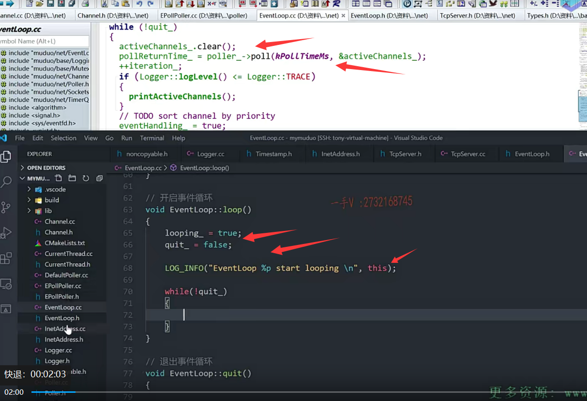

接着呢，开启了一个while循环。

quit那么在这里边，大家还记不记得？

就是在这个poller当中啊。

我们之前讲的在eventpoll当中。然后呢？

它的这个什么函数呢？就是它的这个poll函数啊。

啊，我们现在呢，你看在event loop里边，这里边调用的就是poller的，

是不是poll函数啊？就是这个函数。

我们参数呢，==这里边儿通过指针传进来了 eventloop给它传的一个active channels。==

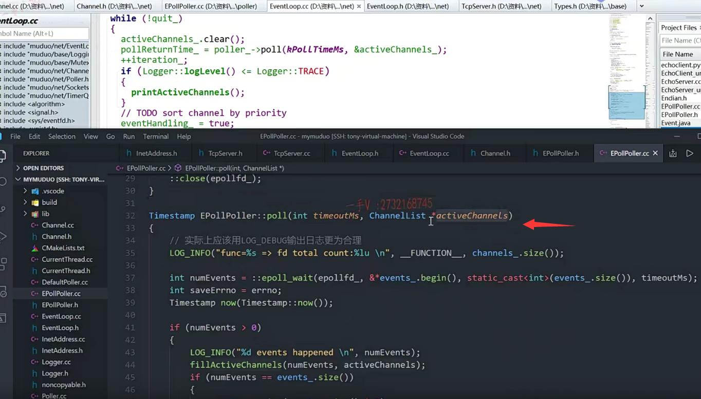

当然，这里边儿呢epollwait发生事件以后呢，

它会在这里边儿通过一个fillactive channels啊，把发生事件的channel呢。

诶，==都写到通过这个指针给它写到这个实参里边，==

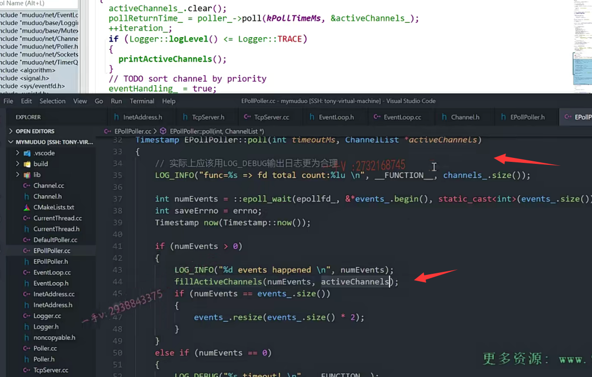

### 写日志

也就是说我们现在站在event loop的这个角色来看呢？

就是当底层的这个poller 发生事件以后。

active channels这个vector里边啊，放的就是所有发生事件的什么channel OK吧？

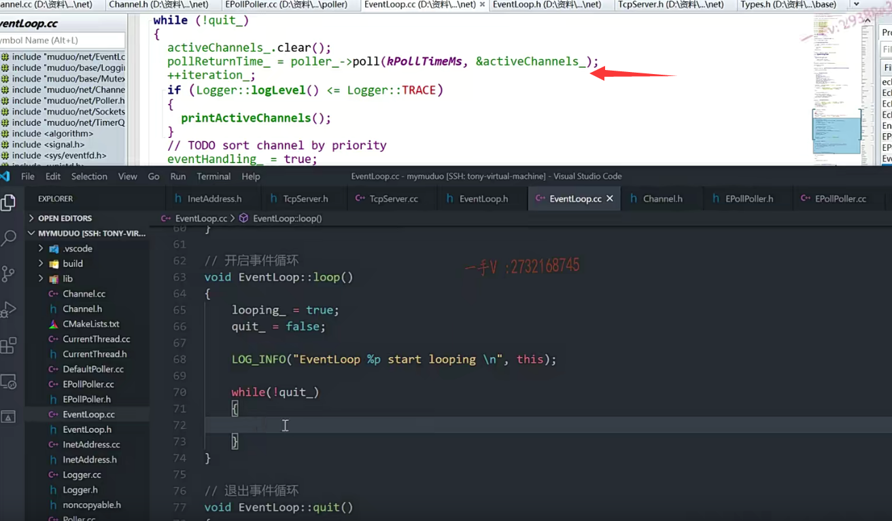

## 发生事件 开始处理

每次呢，一进来先把这个vector clear掉。

然后呢？Poll return time。就是发生事件的，就是poller返回的这个时间啊

poller调用它的这个poll函数传的首先是一个超时时间，

第二个呢，就是把这个vector的active channels的地地址传进去。OK吧，

这里边呢iteration，我们不需要，

这里边还有一个日志啊，如果日志是小于等于trace，就是日志的级别。

它打印了一下这个活跃的这个channels啊，当前活跃的channels我们就不需要了。

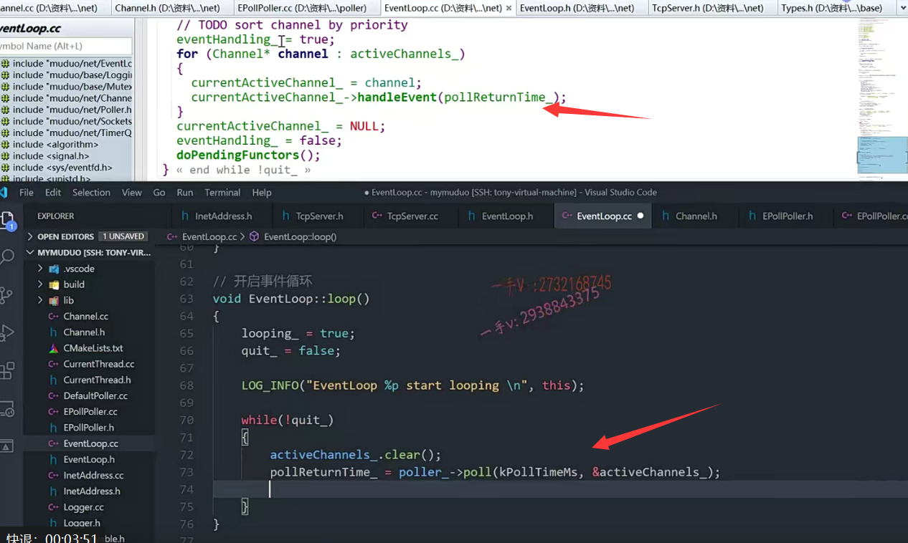

### 核心代码  不写断言了

这里边，大家继续来看啊，

这里边有event handling等于这个true啊，

还有event handling等于这个FALSE。

我们之前有没有写这个event handling呢？之前也没有输出的哈，对吧？

==而我们说呢，在muduo库上很多的这个变量啊，控制变量都是用来进行断言用的，==

你看我们搜一下它。这是true FALSE

这个标识了就是active channels的处理过程是吧

把这个区域扩起来了。你看在remove channel的时候呢，

在这里边儿作为了一个if的判断条件，里边儿做了一个断言操作。

==那就是说remove channel的话呢？啊，这个为true的话，==

==是不是上边就有正在发生事件的channel正在处理啊？==

这里边做了一些相关的断言。

啊，==你看就是这几个主要用在就是remove channel里边儿通过一个if来控制一个断言的这个生成。==

所以呢，我们在这儿呢，不需要它啊，我们不需要它，我们写核心代码，不需要它。

先把它省略掉了。

### 遍历active channels

那然后在这里边就是，

==既然我得到了发生事件的channels，那我现在就怎么样啊？===

==我现在就遍历它active channels。==

在这里边，current active channel。

同样的啊，那我们来看一看它定义了这么一个变量用来接收了一下这个局部的变量channel，

然后通过这个current active channel来调用channel的handle event。

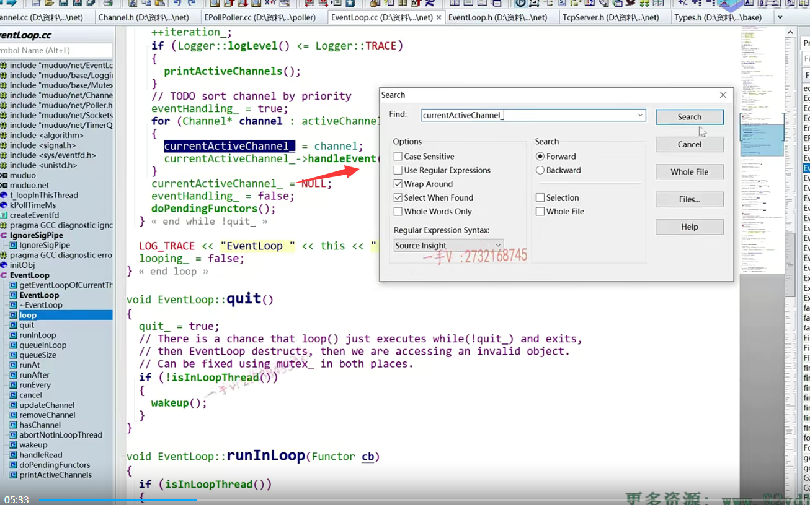

同样的，你看这里边用用到了，

同样的它还是干什么呀？它还是在remove channel里边啊，在这做断言使用的。好吧啊，做断言使用的。

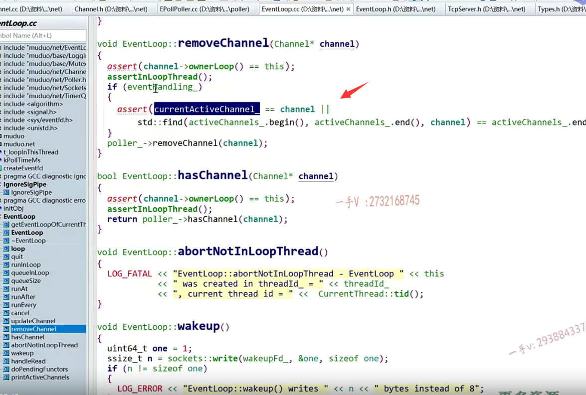

### 要删除的channel必须没有正在处理的事件的channel

那么，大家注意一下。你看这儿断言是什么意思吗？啊remove channel，

你非常好分析啊，这个为true的话呢，那就是说我们刚才的那个地方啊。

它正在是不是处理active channel啊？

那如果说在这儿啊，如果说在这儿。

你要删除的这个channel等于current active channel

或者在active channels里边搜索搜索这个channel。等于end。

等于end是什么意思啊？找不到的意思。是不是找不到的意思啊？

意思就是说呢，我要删除的这个channel啊，现在不能说是它发生事件的是不是channel啊？

发生事件的channel的话，在这里边儿是不是就找到了这断言式等于这个end？对不对？也就是说呢，==你删除的这个channel啊，它必须是这个没有事件，没有发生的事件，需要处理的，不在active channels里边儿==。才，okay。

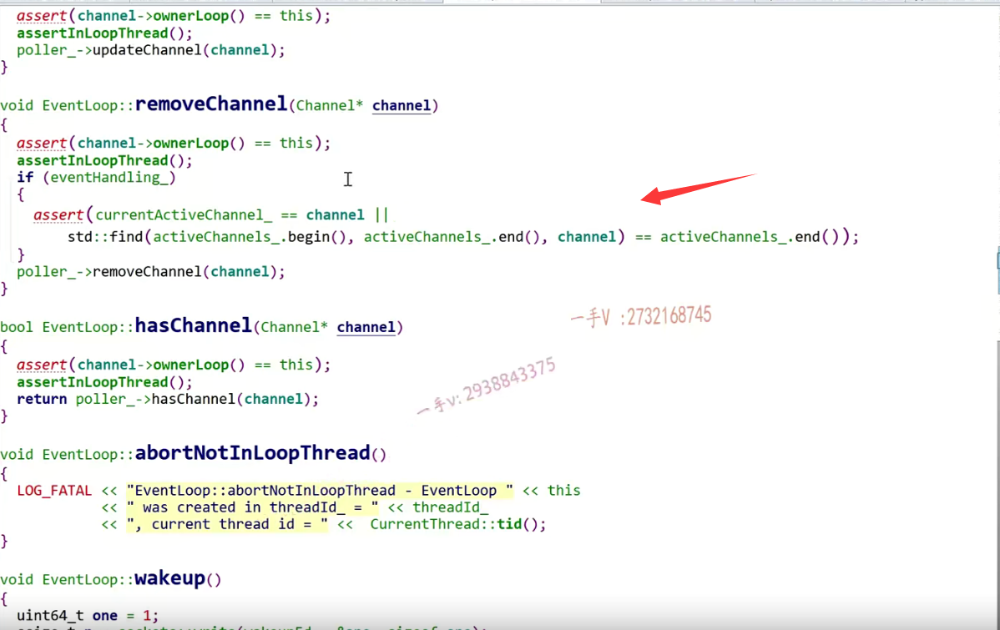

### 删掉成员变量current active channel

是吧啊。好那么。继续返回回去。

所以在这里边，这个event handling跟current active channel都是做断言用的，

但是我们在输出成员变量的时候呢？current active channel已经输出了。

呃。那在这里边，你也可以删掉我们删掉吧，不需要了啊。

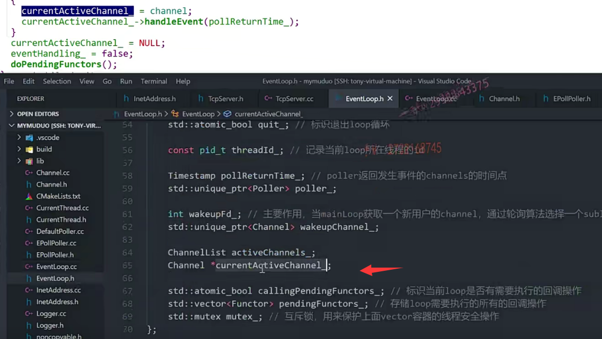

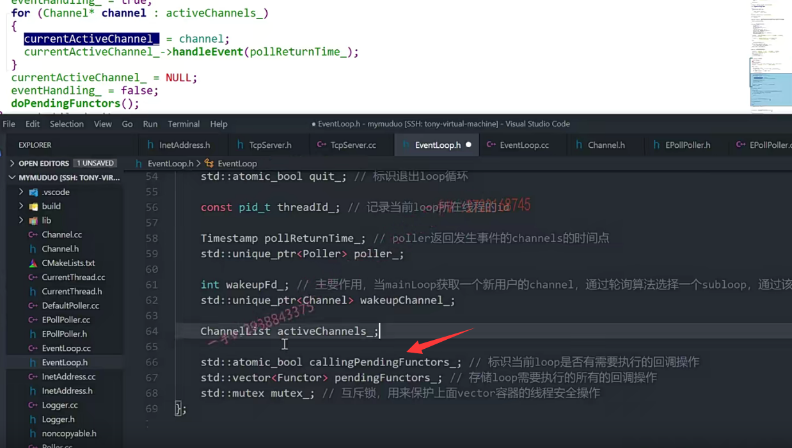

## 调用handleEvent()

那在这儿我就直接调用channel，

我们来关注它的这个核心逻辑就行了啊，handleEvent。

然后是poll return time。

那么，大家来看，这是发生时间的channel。poller能够监听哪些channel发生事件了。然后上报给谁呀？

上报给event loop。然后呢？eventloop在这里边呢，就能够这个通知channel，

通知channel处理相应的什么？相应的事件。

在这里边儿呢，通过相应的channel调用handle event来处理事件，

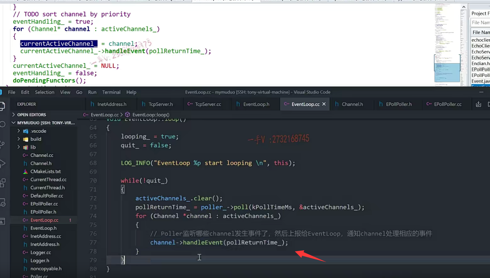

## 处理什么事件

处理是什么事件呢？这个呢，我们之前写channel的时候都写过了嘛，它无非就是那些。读了的事件，写了的事件，close关闭事件以及一些error事件

handle event，你看这就是最终调用到这里边来了。

对吧啊。

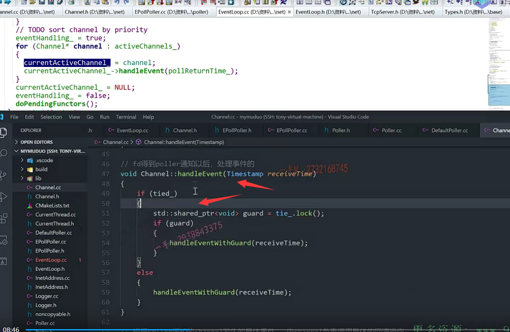

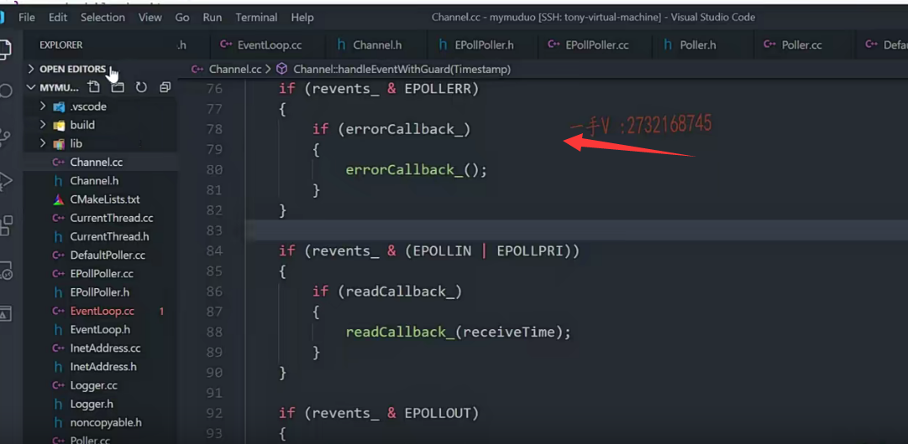

## doPendingFunctions()

好回到eventloop。那完了以后呢，在这儿大家来看啊，

还有最后一个比较重要的就是for循环外边儿，你看看这一句，

看看这一句doPendingFunctions。

doPendingFunctions，这是在干什么呢啊？

执行当前eventloop在事件循环需要处理的回调操作。

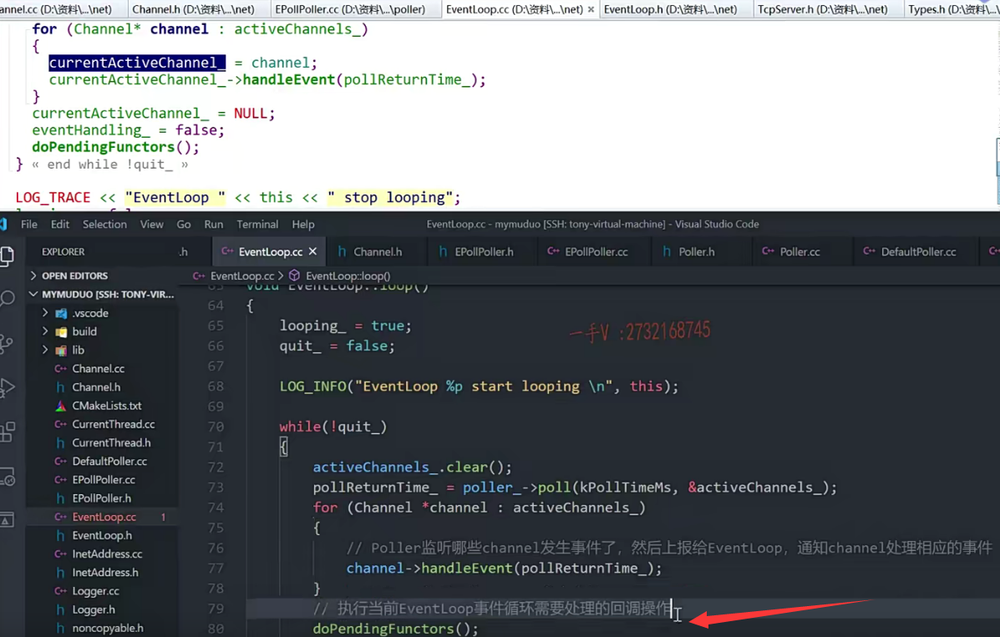

在这里边注意一下。什么意思呢啊？

在这里边儿，为什么我当前的event loop还要执行这个回调操作呢？

好吧，大家注意一下啊，注意一下。

在这儿我给大家举一个例子。你就直接能够明白了。

我们呢，这个IO线程。IO线程就是我们的mainloop就是的main reactor嘛，对吧？

它主要做的是什么呀？accept的工作。就是接收新用户的连接。

那我们在这里边接收新用户的连接以后呢？相当于呢？就是呢，返回accept就会返回一个跟客户端专门通信用的是不是fd啊？

我们肯定会用一个channel来打包fd的吧？是把这个fd打包。

那么，因为main loop只做新用户的连接？

而已连接用户的这个channel得分发给谁呀？得分发给sub loop。

没问题吧啊，如果说我们从来没有调用过muduo库的set threat number，也就是说呢，muduo库只有一个loop，那就是main loop，

那也就是说到时候main loop它不仅仅怎么样？要监听新用户的连接，

还要负责已连接用户的读写事件。

如果说我们调用了set threat number作为服务器，我们一般肯定是会调用set threat number的，因为我们现在都是多核的，这个CPU对吧？

啊，不可能浪费我们的硬件的，

那在这里边我们肯定会去起，比如说set thread number 三。

我们就会去起三个sub loop。

那么main loop拿到一个channel以后，跟新用户通信的channel以后呢，

就会唤醒wake up某一个sub loop ，OK吧啊，

那么事先呢，把这个回调。就是这个main loop

事先注册一个回调，就是一个cb。

这个Cb需要谁来执行啊？需要sub loop来执行。

但是呢，此时sub loop起来了没？

此时的sub loop，你看大家把这个现在想象成一个sub loop。

subloop现在还在睡觉呢，没起来，它阻塞着呢。

对吧啊，main loop 呢wake up以后。

wake up我们通过event fd是不是啊？

通过这个event fd把这个sub loop唤醒以后，它起来了。

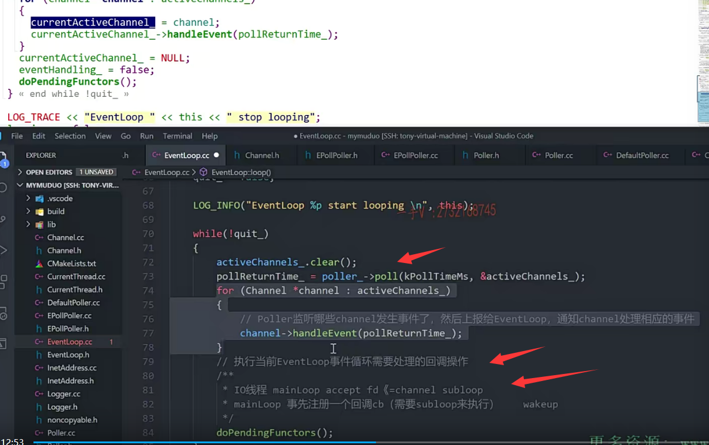

起来了，以后呢，在这里边儿做的，在这里边儿做的事情就是干什么呢？

就是do pending factors。他的handleevent，他很简单。它的handle event

在构造函数我们已经注册过了，对不对？

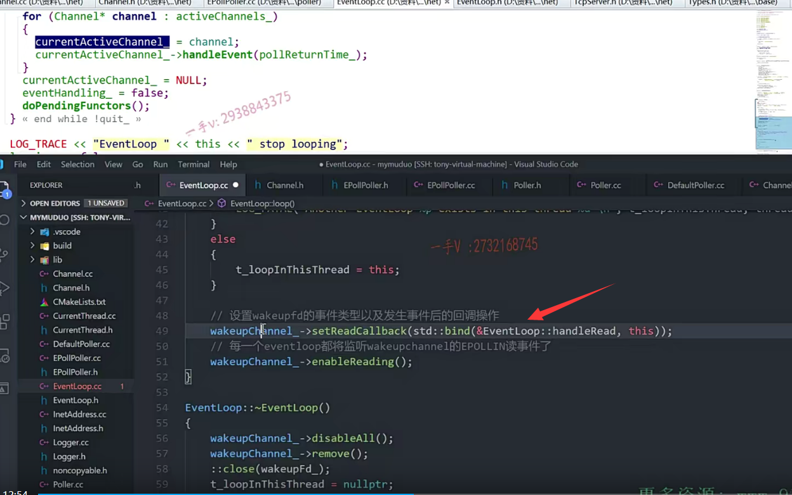

它的read call back干嘛呢？它啥也没干，实际上就是读了一个八字节的数字。

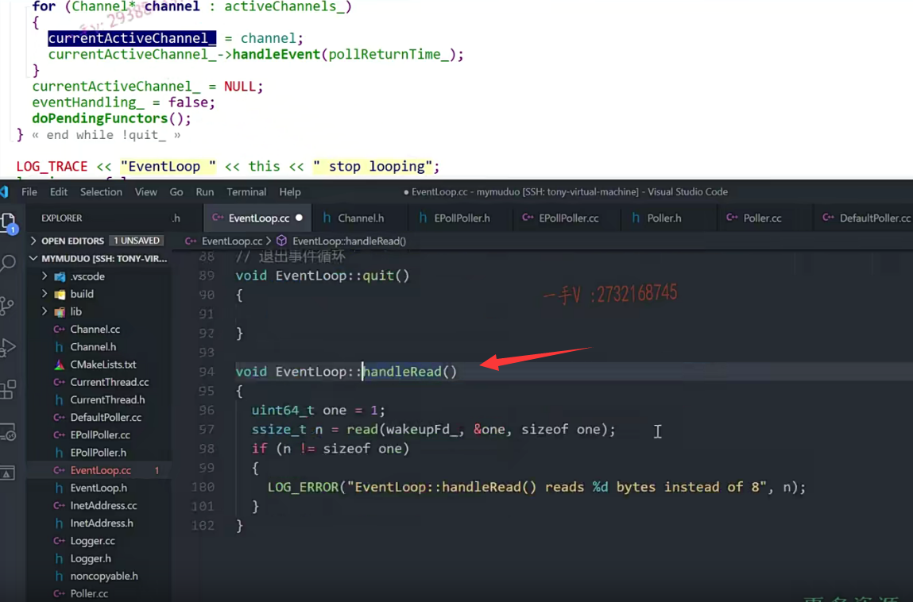

### 在这儿唤醒

实际上，它的数据不重要，关键是呢，我们main loop就可以通过呢wake up fd把这个sub loop是不是给唤醒了？

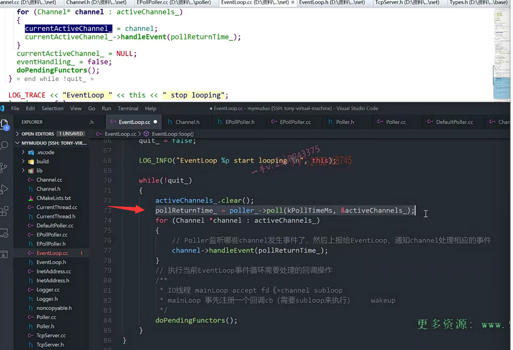

### 唤醒后，处理handleRead（）读

唤醒了以后呢，在这里边儿相当于就是我们的呃sub loop。

这里边最终我们给他注册的这个wake up

这个呃fd注册的回调就是这个对吧？读啊读就是一个read，read完了以后呢？

### 还要执行回调

你不要光read，我把你唤醒起来，让你做事情呢，你干嘛呢？

要执行回调。好吧，他要执行回调。执行回调，

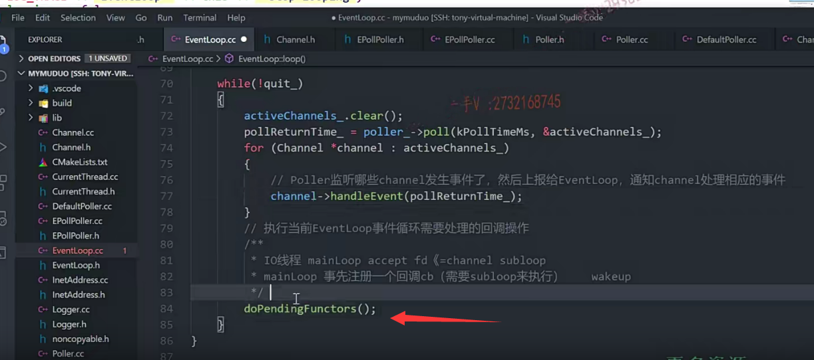

那么回调在哪里写着呢？==你看一下回调都在这个pending factors里边写着呢。okay吧啊。==

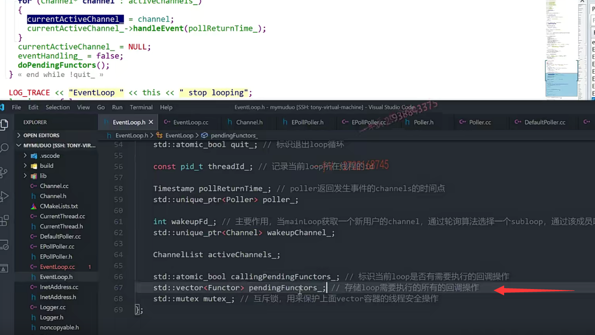

那么，这个回调是什么呢？

回调就是。谁唤醒你，让你做事情做什么事情呢？

那main loop唤醒你，让你做事情做什么事情？

main loop呢？要事先给你注册一个回调。OK吧啊，

唤醒wake up sub loop后执行下。

执行下面的方法。啊，那么执行什么啊，

执行之前main loop注册的cb操作啊，

有可能是一个cb，也有可能是多个cb。

没问题吧，所以在这里边用了一个vector，放了所有的function回调。

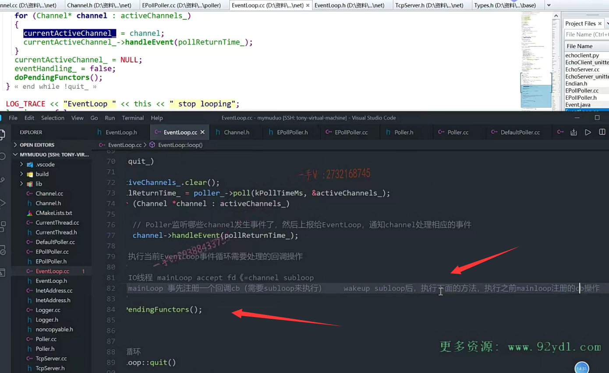

那么它怎么去实现逻辑？我们先不关注。

大家主要关注在这里边儿做这个do pending functors执行回调操作。能不能够理解？

这个应该能够理解的吧？

## 再次总结

### 两种fd clientfd wakeupfd

啊，相当于就是说呢。

当前一个event loop这里边调用的poller啊。主要是两类，主要是监听两类fd。两类fd

 一种是这个client的fd。一种是wake up fd.

client的fd就是正常的，跟客户端通信用的是不是fd channel啊？

wake up fd就是我们Main loop跟sub loop之间通信。

啊，就是main loop唤醒sub loop呢？

用的这个wake up fd用的这个相应的channel。

好吧啊，我唤醒你是需要你做事情的，

做什么事情我会事先的把这个回调写到你的vector里边，

那么把你唤醒起来以后呢？

哎，你就去vector里边去找你需要执行的回调去执行就行了。

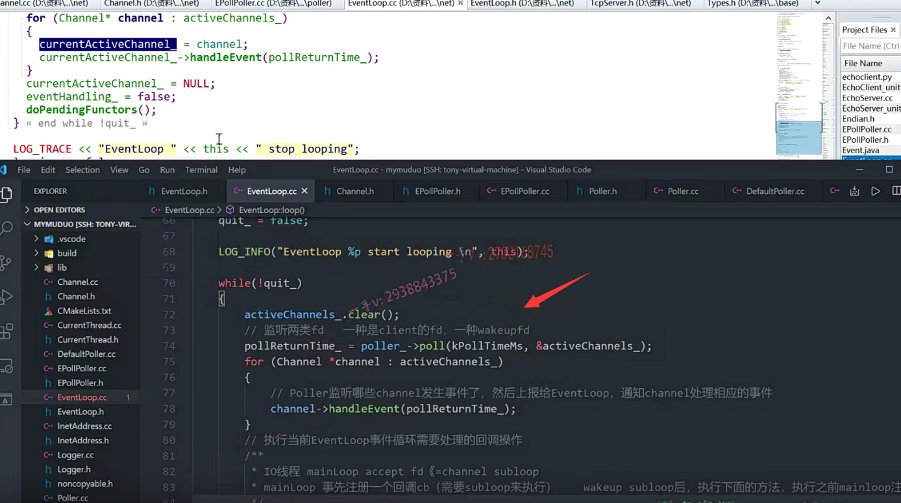

没问题吧？唉，这就是我们的什么呀？外边我们再写一个login fo。

再补一个日志啊event loop。百分之p啊。这个stop looping。然后呢loping。等于force。

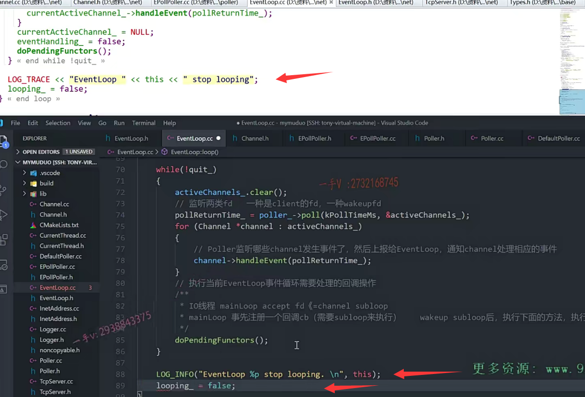

## 总结eventloop的核心 loop

那写到这呢，我们就说啊，

这个event loop的核心loop，它就做完了，

实际上它主要就是驱动了底层的poller来执行poll。好吧啊。

那返回以后呢？

就是拿到了所有发生事件的channels以后呢？

那就执行channels的handle event。

这个channel发生事件以后执行什么操作呢？实际上事先都怎么样了？

事先都已经绑定好回调函数了。

### 这里删掉之前的

你就像我们这里边的wake up fd一样。这我们不需要了啊，这刚已经去掉了，

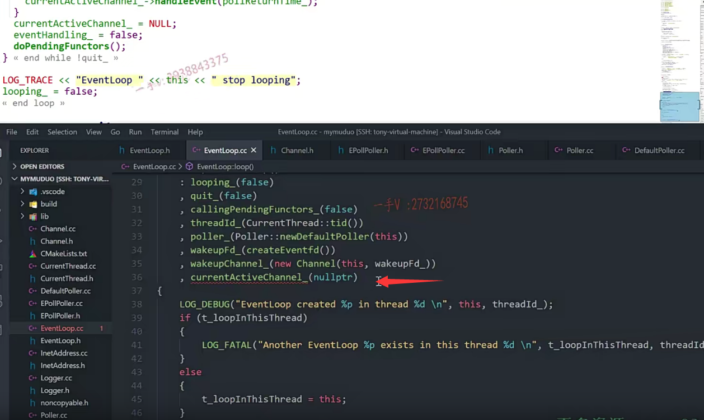

就像这里边的wake up fd一样，把它唤醒，以后做什么事情，

这里边是不是早都已经绑定操作了啊，已经绑定操作。

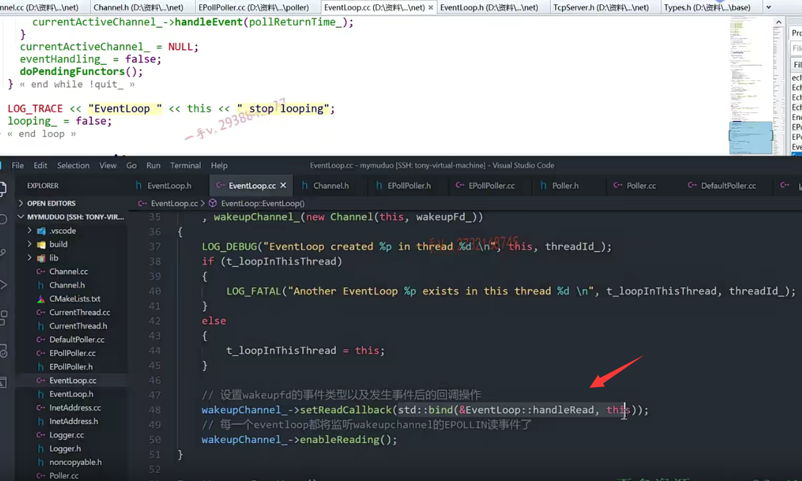

### main loop给你这个派发的一些回调操作

okay吧。

完了以后就是你起来以后你还要执行，有可能是其他loop，

==那肯定是main loop，对吧啊？给你这个啊派发的一些回调操作。==

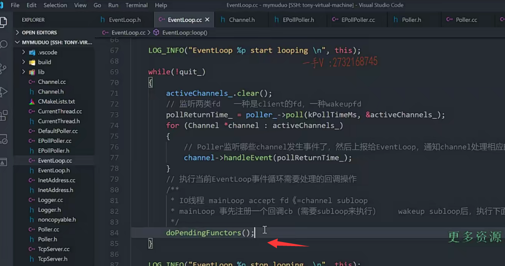

之所以要让你派发新的回调操作，那肯定是给你分配新的channel，让你去接收处理了。对不对啊？

人家main loop分配了一个新的channel给你了，把你唤醒对不对？

那你最起码需要把这个channel加到你的这个channel列表里边。

==把channel往你的poller上，往你当前的这个sub loop的poller上去注册吧==。对不对啊？

那你做这件事情由谁来驱动呢？

==就是由main loop事先给你注册的这个回调啊，就在这里边执行。==

这个我应该已经解释了很多了，希望大家呢，把这个loop的逻辑呢，好好的再去理解一下。okay吧啊。

好，那这个quit的这个处理呢，

那就是quit等于true。你看。他实际上这么一句话，他就完了。

但是呢，在muduo库里边，这又加了这么一句话，你能不能理解它的意思呢？

is loop thread.然后要wake up。请问各位是否能够理解呢？

你看你要想到这个quit的呢？

有可能是自己需要quit了。

## quit两种情况

就是两种情况，

第一种情况是这个loop在自己的线程中。

线程中每一个线程是一个eventloop，one loop per thread嘛，

对吧？在自己的线程中调用这个quit。

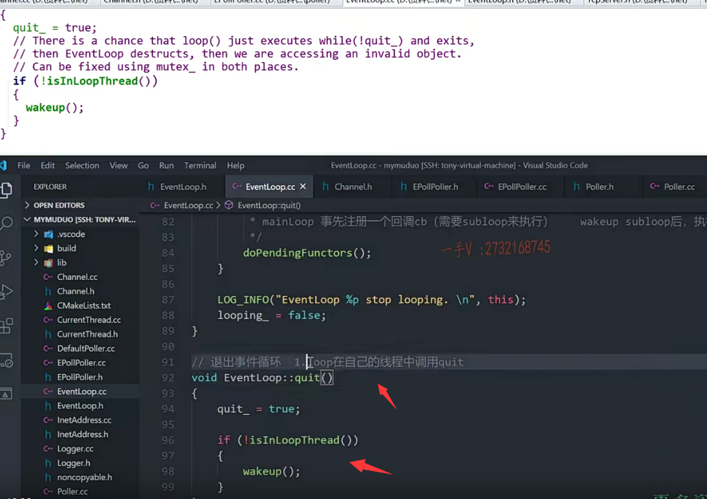

唉，我问你一下啊，你loop都在自己的线程中调用quit了，

它会不会阻塞到poll这个这里边啊

他不会吧。是不是因为他在自己的线程中去调用一个函数执行操作，

他肯定是从poll已经返回了。返回了

执行某个逻辑了，以后呢，他调用了eventloop，他调用了他的这个quit唉，

==然后呢，把这个quit变量设置成true。==

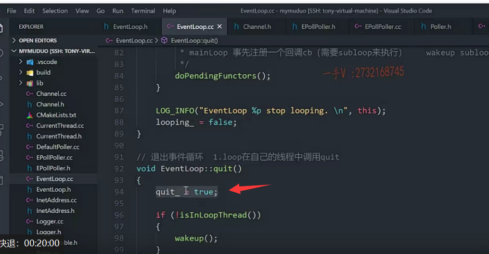

==然后这个while再一次转回这个while的时候呢，发现这个quit为true了那这。==

==这个表达式是不是就成一个FALSE了==，就跳出来了，那就正常的结束了当前自己线程的这个loop了。

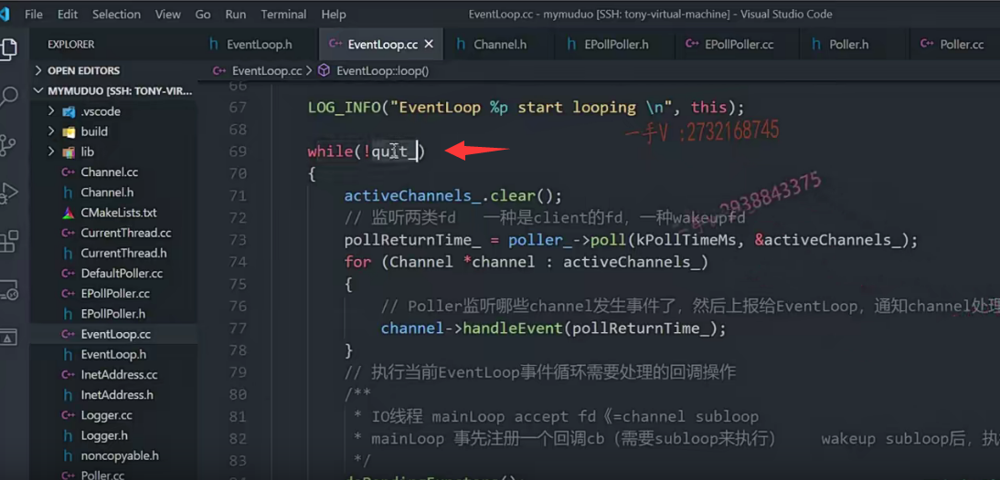

这个能理解吧。

但是如果是在其他线程中调用的quit。

比如说在一个sub loop中，调用了main loop的quit这很有可能。

是不是很有可能啊啊？很有可能。

我们也经常写，那我们写一个muduo库，我们用muduo库的这个接口函数的时候呢，

经常在on connection或者on message里边。

啊，某些情况发生以后啊，直接调用了这个main loop的quit。

那么各位，你想一想。

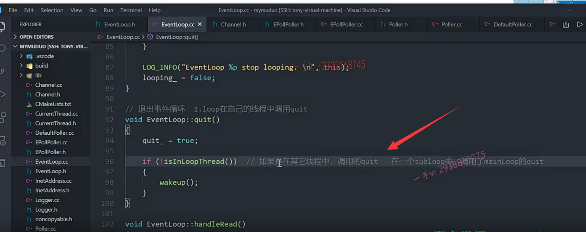

假如说我现在啊。在非loop的线程中调用loop的quit。

我现在这个当前的这个线程是在一个sub loop。

对吧，在一个工作线程中啊，workers thread中。在一个worker工作线程当中。

那么我调用了这个主线程，就是main loop的这个quit。也就是lO线程。

对不对啊？那么这时候我应该干什么呀？

你调用人家的这个。你看啊，你调用人家。你应该怎么样啊？

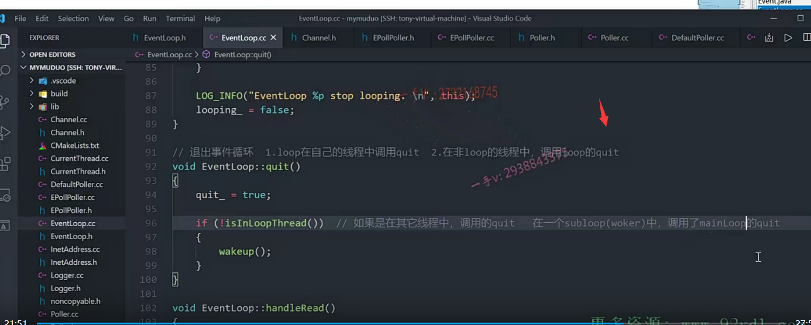

你应该把人家先唤醒了。你把它唤醒，以后呢？

他就从poll返回回来了。

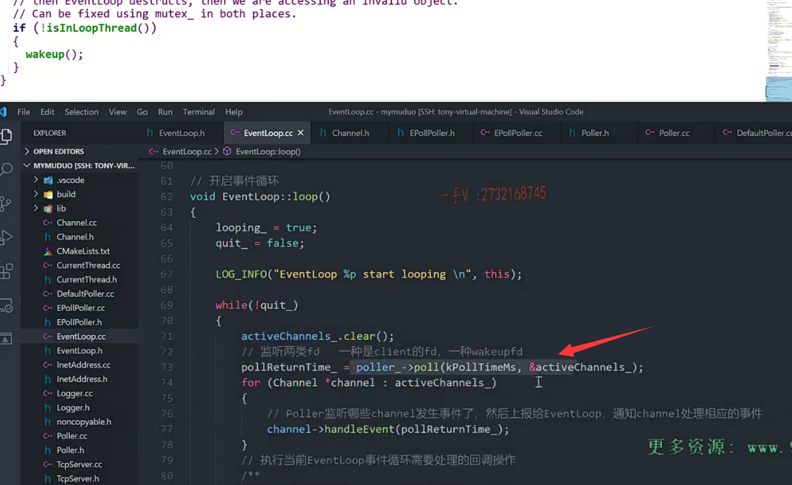

==返回以后呢，因为你把它的这个loop的quit呢，已经制成true了，==

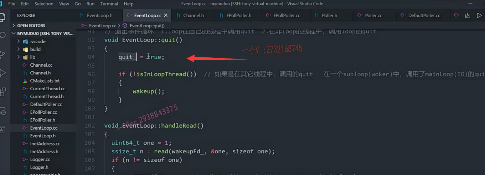

你看它再回到while的时候呢，就怎么样了？

诶，这个表达式呢？就不满足条件了，就跳出来了，那也就结束了。

这个能够理解吧啊，

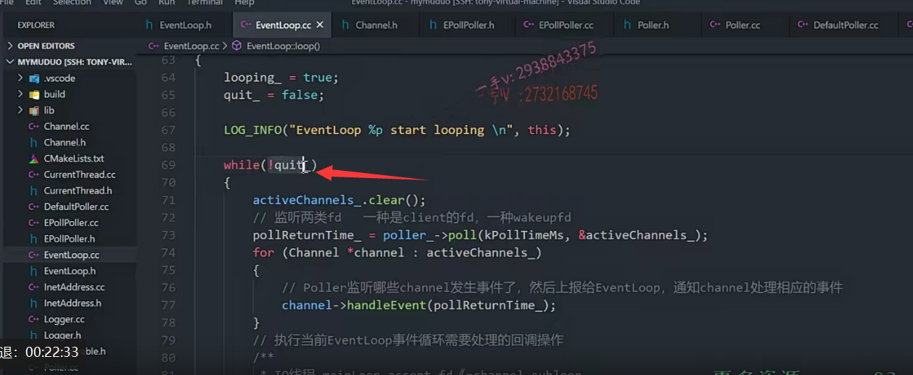

### 需要判断quit当前执行的线程是不是main loop 线程

就是这个，在这里边，这个执行的这个流程啊，

当前这个线程啊。你改的你调用的，你修改的变量啊，确实是main loop的变量，对吧？

但是呢，你却是不是在这个lO线程中执行的。

你是在一个worker的线程中执行的。

所以这里边儿就判断了。

这里边儿判断的时候呢，你看这个thread ID就是main loop所在的这个l线程，

而我当前的线程是在一个worker线程。它俩是不是不相等啊？

哎，不相等就是FALSE就进来了。

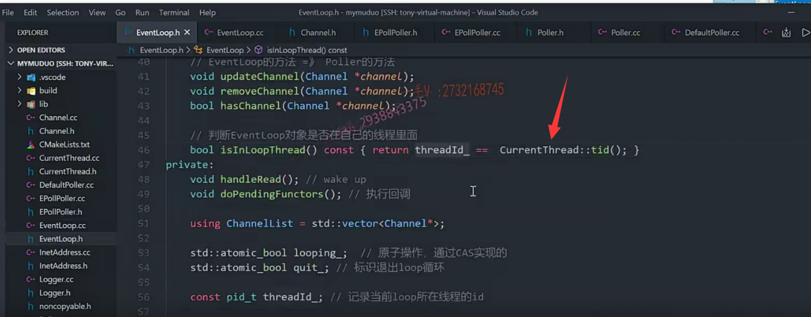

啊啊，因为呢，我现在也不知道主线程到底是个什么情况，

是不是啊？那我需要把它唤醒一下。是不是需要把它唤醒一下啊？

它如果呢？

原来就在阻塞我，

把它唤醒它转一圈儿回来跳出它，

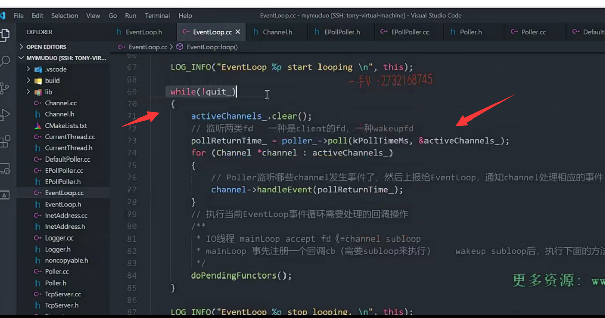

如果原来人家忙着呢，忙着呢，

把这个事情处理完了以后，它再回到poll的话呢。阻塞住我，

再把它wake up，唤醒它起来转一圈。quit是true。跳出位了。

main loop也就结束了。

这个能够理解吧。

## muduo库没有在IO线程和工作线程中间加一个队列，来缓冲

在这里边muduo muduo库里边儿啊，它没有用什么呢？

它没有在这个lO线程啊，跟worker线程的中间用一个就是像这种队列啊，

来缓冲一下main loop啊。

拿到channel以后放到队列里边儿，所有的worker线程呢，就是sub loop呢，

从队列里边儿是不是拿channel进行一个消费呀？

啊，没有，

而是呢，直接派发的，而直接派发的，怎么派发呢？

通过轮巡的算法派发。

啊，怎么唤醒呢？就是通过event fd这个wake up fd来唤醒的。

好吧啊，注意这里边的这个。

if在这里边加了这个条件，它什么意思？==不能没有这个。不能没有这个好吧啊，==

==因为呢，你调用loop的quit不一定都在自己的线程中，==

是不是去quit的自己啊？

你有可能在其他的线程中去quit他，

另外的loop，一个loop是一个线程，一个线程是一个loop。

这个能明白吧？

没问题啊，我觉得大家应该是没问题，已经给大家讲的这个很清楚了啊，已经很清楚了。

那么希望大家呢，如果你还不明白，

我说希望呢，你在这里边可以画一画，

这是什么呀？main loop.唉。

你看你可以在这画一个sub loop。1 sub loop.二还有sub loop。三

对吧啊，那他们之间呢？

都是怎么去处理的呢？怎么去通知的啊？

通过wake up fd就可以了，

因为每一个loop里边都有一个什么呀？呃，都有一个wake up，

wake up fd是可以唤醒对应的这个loop的。

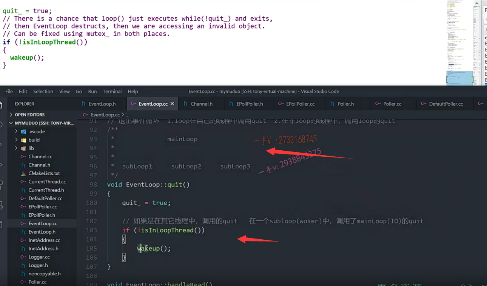

## loop退出的逻辑

对不对啊？如果只有这一句，那就说明呢，在自己的loop中去怎么样？唉，去quit自己，把自己给退出了，对吧？

如果是这个的话，相当于就是说我在sub loop 1想退出sub loop 2，

我在subloop2这个线程里边啊。想把这个loop三给它退出了。

==那你要在其他的线程去退出其他的loop，你是不是得把人家的loop先唤醒一下啊？==

==不唤醒它怎么起来做事情，不唤醒它就回不到。==

==他就无法转圈，回到while,不回到while，==

==他怎么可能去判断这个东西来跳出while，结束这个loop。==

## 总结

这能明白吧啊？好，那我们这节课的这个内容就给大家讲到这里，

这节课我们主要讲了这个event loop模块的loop跟quit函数啊，它的逻辑。

呃，代码非常少，

但是涉及的这个思考的点还是比较多的，

主要就是它采用的这种嗯，one loop per thread的模型以及涉及的这个主loop跟子loop之间。

那它是怎么协作的？好吧啊，

它通过轮巡算法通过呢wake up fd来进行互相通知的退出的时候呢，

怎么有一个退出的逻辑对吧啊？每一个loop的退出。它都有两种情况啊。

这里边就都考虑到了啊。好，那我们这节课的内容就给大家先讲到这里。