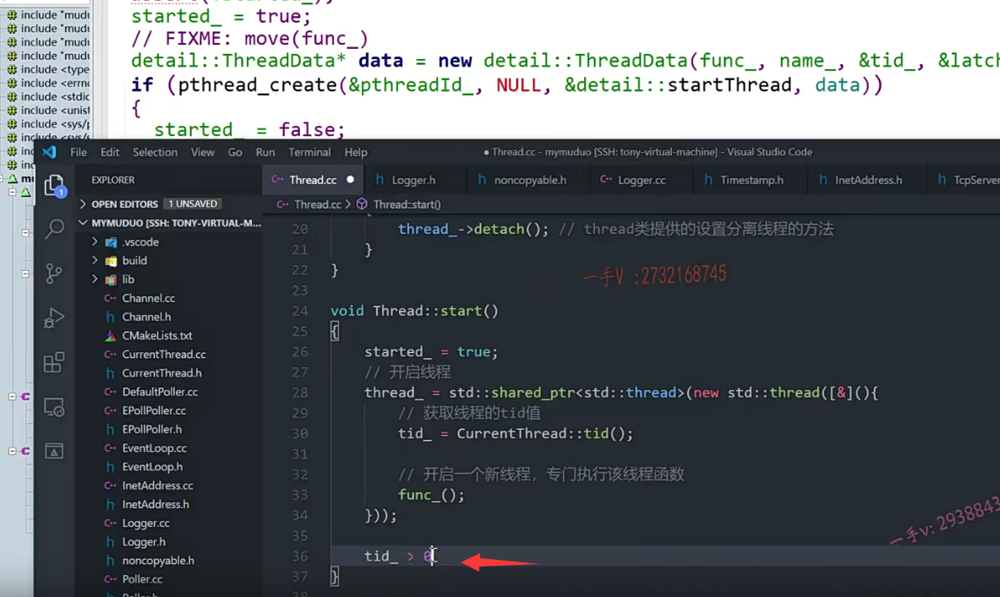

到上节课呢，我们把TCP server这个muduo库给我们提供的服务器编程的这个入口类，它的event loop 还有channel，还有这个poller这些模块我们都写完了，对吧？

实际上我们说呢？呃，这个event loop，包括它底层的这个poller啊。

也就是它的这个事件分发器啊，epoll wait它不会仅仅只工作在一个线程上。

它是one loop per thread，就是一个loop对应一个线程，一个线程对应一个loop。

好吧，我们现在相当于是把这个loop event loop事件循环以及底层的这个依赖的这个channel啊poller对不对？我们都实现完了，

## 涉及三个类

### Thread eventloopthread  eventloopthreadpool

那我们现在呢？就继续来剖析一下，来书写一下，跟这个event loop相关的这个thread。操作类主要涉及了三个类。

==一个是event loop thread pool，从这名字上就能看出来啊，==

==它是一个事件循环的线程池。==

==这个线程池是管理事件循环线程调度的对吧？==

那么点到这个event loop thread里边啊？

又看到了一个event loop thread。

==event loop thread应该就是event loop thread pool管理的是不是对象啊？==

对你从这个名字上就能看出来啊，one loop per thread啊per thread one loop，

==这相当于就是打包了一个eventloop和一个线程？OK吧啊，==

那么再往底层。

这个thread就是底层封装的这个线程了啊，

那么muduo库底层的这个线程，在实现的时候呢，因为直接使用了linux原生的pthread的啊，相对来说代码还是稍显繁杂的，

你看这个代码还是比较繁杂的啊啊，我们需要精简，因为C++11里边已经提供了这个thread线程类，对吧啊，

我们直接用thread来进行这个底层的这个线程编程就行了，非常的轻量，代码也非常的少。

好吧，那我们就是one loop pro就是跟loop相关的线程，

这块的实现啊就是event loop thread pool设计的三个类啊，

就是底层呢，从下往上就是thread线程。

然后往上就是event loop thread就绑定了一个loop跟thread，

再往上就是event loop thread pool啊，这三个类呢，我们分别来实现一下。

那这节课我们先来看一下这个thread好，我们先从小往大的这个模块逐渐给它输出。

那么，先着眼于细节呃，处理完了以后，我们从大的方面呢，再给它进行一个总括啊。

### 创建头文件和源文件

在这里边呢，我们要定一个thread点h和。thread点CC。pragma once。

这是我们的线程类啊。线程类。写到现在了，我希望有能力的同学呢，你可以先自己呢去输出一下啊，先自己输出一下。去感受一下，看你在输出的过程中会碰到什么样的问题，你是怎么解决的啊？那实际上在。怎么样解决更好？

你再参考一下我们的视频啊。

那么在这，首先呢，要继承noncallable不可复置，对吧？

需要包含相应的这个头文件啊。non copy able那么从这儿呢？

继承过来non copy able。

## 线程函数  回调函数  

### 带参数的函数类型，可以使用绑定器   函数对象

好在这里边呢，大家看我们先着眼于细节啊，我们先不考虑event loop。

先不考虑loop，我们就考虑线程，线程总得有一个线程函数吧，

对吧？呃，这里边定义的这个thread func就。就是所谓的线程函数好吧，

这里边儿还用到了这个function，那我们也包含一下人家头文件吧

functional函数对象所在的这个头文件都在这儿，对不对？

using thread func等于谁啊？tion.void.啊，

==这就是线程函数的函数类型，==

有些同学可能在这里边问老师啊，你这样写的意思就是说。

线程函数长的都是返回值，是不带参数，

==那我线程如果想带参数怎么办啊啊？非常简单嘛，绑定器跟函数对象嘛，对吧啊？==

如果呢，你对绑定器跟函数对象呢，有一些理解的话，这儿应该能想明白的，对不对？

我们事先呢，给它把参数绑定过来。那么，绑定器跟函数对象呢？

也是在C++面向对象编程里边儿做事件回调。

也就是说，如果是由于事件驱动，事件回调的。

诸如此类，基于此类这个方式的网络库的话，

这个如果用C++写绑定器跟函数对象肯定是省不？这个省不掉了啊，是肯定会用到的，在C++高级课程里边都有讲到，

如果你绑定期跟函数对象有点儿忘了，你赶紧把这一块儿拾起来，这块儿呢，

是一个不管是在编写代码上还是在你这个面试去。

说的时候呢，都是比较好的啊，比较拿得出手的，比较热门的一个东西啊。

## Thread成员变量

### bool 变量

好，那在这里边呢，我们先把成员变量输出一下吧。

在这儿呢，它首先有一个started对吧？布尔值started

还有一个什么呢？joined.这个应该大家都明白啊呃，

这是当前线程的等待，其他线程运行完了，当前线程再继续往下运行嘛，是不是？

### 不能直接定义thread 变量，这个合pthread_create()一样，直接启动一个线程

p thread，杠tp thread，这里边我们就不用什么了，就不用这个linux原生的这个线程了啊，

因为是个c函数绑定的是个c函数。

处理起来相当麻烦啊，代码量也比较多，

我们在这直接用什么呀？直接用我们C++提供的这个线程类就行了，

但是你注意啊，你在这儿可不要直接去写这么一个东西啊。

### 需要使用智能指针来管理线程的启动时间

因为你知道啊，这个跟这个什么一样啊，

==跟这个linux的这个pthread create一样linux的p thread create。==

==呃，这个API函数一调用的话呢，线程就直接开始启动了，==

==同样的啊，你用C++的这个thread，这个类定义对象。那就直接启动了它绑定一个线程函数，就直接启动了，==

实际上在这里边我们并不需要，==我们要控置线程的这个启动的时机==。

所以在这里边，我们不能直接用thread类去定义一个对象，

==我们需要定义一个智能指针来封装它，自己来掌控它这个线程对象产生的时机，==

所以在这里边儿既然用到了什么东西呀？==智能指针我们就包含一下memory头文件啊。==

那在这儿。

用一下share的ptr吧。在这我写一个thread。

好了啊，在这我就写一个thread。

### pid_t tid_

okay，继续。

有PID杠T TID。这个是需要包含我们的linux的头文件的啊。UN STD.

### 线程函数  函数的名称

然后还有这个thread func func ，这是存储线程函数的啊。

另外一个就是name。这是每一个线程都有一个名字。

可以在调试的时候打印一下相关的信息啊。你想加 就加不想加无所谓，

这个不是核心的

### count countdown latch 用信号量替换

count countdown latch这个呢，我们不用，

这个是这个相当于是个栅栏儿啊。

实际上呢？这个栅栏儿在我们linux里边儿，

我们用信号量也可以同样的做到它，

实际上就是你看啊。你看这个东西就是对于这个条件变量的一个封装，我们用这个linux的信号量同样可以完成相同的这个工作啊。

### number created_ 线程的数量

然后最后有一个原子类型的number created_，

应该是用来记录产生的线程的个数的啊。

那我们C++11也提供了相应的这个原子类型啊。

在这我们用一下，==它是个static，因为它是对所有线程的数量进行计数的啊，所以是一个静态的int三二。==

应该是int就可以了啊。number created.在这里边没有？代码这个帮助是吧？

没关系，我们到时候，编译的时候看啊，编译的时候看是否产生错误。

这个是应该是我这插件我都装了啊。不管了，咱直接写吧，盲写代码啊。

这是成员变量输出了一下啊，然后再把什么补上啊，把这个成员方法。

thread thread func.然后是const。

仿写代码的好处就是。写代码的这个准确性是越来越高啊，

因为我们不用太过于依赖其他的这个插件来定义。给我们提供呢。那些功能啊。

好了，这个是构造跟析构。很明显，这个是start方法啊。这个是join方法。

返回值我们不需要了，我们不调用这个linux的，这个系统API。

啊，我们调用的都是C++给我们提供的。

这是布尔值started 

好，这里边还有PID杠TT ID返回线程的这个tid啊。

我给大家说了。==这个muduo库上返回的线程tid是用相当于就是在linux上用top命令查看出来的进程，里边儿线程的这个tid啊。==

==不是p thread的self打印出来的，那不是真真正正的线程的，这个线程号啊。==

counts TD string.name cost. return name.

然后这里边有一个静态的方法name created。return number created就行了。

好吧，我们直接return它就行了，不用get了，

因为我们用的是C++11给我们提供的这个类型啊，这个类型。

呃，不清楚它后边儿有没有提供的这么细致int三二的啊？

到时候编译一下就可以。

#### 又换成了atomic int

它直接呢，会把这个atomic int呢转成这个int啊。

那既然这是int的话，这也用一个int吧。

然后底下呢，还有一个set default name。应该是给线程设置默认的名称的，对吧？

set default name。

# Thread类实现

### 参数的默认值只出现在一个地方就行了，已经在头文件中写了，源文件不需要

那么我把这一块的成员方法呢？都放在这个源文件中，我们要打算去实现一下啊。

参数的这个默认值只出现一个地方就行了。

好，大家来跟我看看啊，在这个地方。

你看用c的API就是pthread的create，要给线程传东西的时候呢，还需要单独的定义一个结构体，对吧？

因为你要打包一系列的数据啊。比较麻烦，

我们用C++结合lambda表达式，非常的方便。

### 静态成员变量需要在类外进行单独初始化

这首先是静态的，这个成员变量。需要在内外单独进行什么？单独进行一个初始化。

这一点不要忘了啊。这初始化是零对吧？

## 构造函数实现

然后这个构造函数啊，构造函数的话在这里边。

start it刚开始呢，给它置成一个FALSE。

然后呢，joined在这里边呢，置成一个false 对不对？

哦，还有呢tid啊？tid给它置成一个零。

还有这个线程的这个函数啊。那在这儿，大家来看看。是不是获取一下啊？

move 相当于把func这个对象的底层的资源直接给我的成员变量，效率会更高一点啊。

那么，在这里边还有什么？还有这个name是吧？name啊。

那么还有lunch，我们不需要啊，这个我们不需要。

这个还有一个成员变量就是智能指针对吧，智能指针我们默认构造就行了，我们现在还没有说开始去起这个线程啊。

set default name.就这name它默认不是一个空嘛，对吧啊？

## setDefaultName函数实现

它是个空嘛？那在这里边，如果是个空的话呢，在这我们给它设置一个默认的这个名称啊。

大家来看看。哦，能看明白意思了，就是按照这个静态的变量number created按它的这个创建的这个序号来给这个线程设置一个默认的名字啊，

那么首先int number等于。number created.这是in create and get好吧啊，

in create and get。呃，就是先加加，然后再怎么样？再获取它的值，对吧？

### atomic相关的类型都是类，会有响应运算符的重载

相当于我们给这个number credit进行一个前置的加加就行了。

==atomic相关的这个类型呢，相当于是个类类型，给这些运算符都提供了相应运算符的重载函数啊，我们直接用就行了。==

如果说你的name它是一个empty，那就是说线程的这个名字呢？还没有名字呢，是不是？

给它按一个默认的名字。三二定义变量的初始化是一个好习惯啊，

那么在这呢用SN printf buffer size of buffer，

然后我给这里边定义了一个thread序号对吧？作为线程的这个名字啊？

okay，那么。等于buf。

啊，这个函数没什么大的问题了啊，

好，那就是构造函数完了，

## 析构函数实现

析构函数我们看一下。

析构函数在这里边就是那你要析构呢？

他在这里边啊。就是线程已经运行起来了，才需要做线程相关的一些回收的动作，

如果线程根本就没有运行起来，那析构什么也不干就行了，对吧？

这里边大家看detach ，==detach相当于把线程设置成一个分离线程，也就是说呢，成了一个守护线程了==。

==当主线程结束的话，这些守护线程会自动结束的，==对不对啊？也不也不担心啊，

### 设置成分离线程的前提之一，不能是join的工作线程

也不担心。它存在这个呃孤儿线程的这个出现啊，把这个产生的新的线程啊等内核资源呢给泄露了啊，我们都不用担心，

==但是detach跟join它是不能同不能够同时去执行的啊。==

就是说呢，它就是一个普通的线程，工作线程对吧？

在你主线程里边必须得等待它的这个工作线程执行完以后啊才能这个继续往下，

如果你不等待子线程的话呢，这里边就会产生问题了啊。

==要么就是它是一个工作线程，要么就是它就是一个守护线程detach就是分离线程啊，==必须只能工作在一种模式下。

所以在这里边，你看started，而且它并不是join，

所以就把它设置成设置成一个分离的。对不对？

就是你这个线程完了以后呢？

这个内核资源会自动回收了啊，不会出现孤儿线程了啊。

那在这里边 !joined。

我们现在不需要调用pthread的detach了，

因为我们用的是智能指针。是pthread指向的谁呀detach？

thread的类提供的设置分离线程的方法。

==实际上，如果呢，我们这程序运行在Linux系统下的话，这个detach呢，==

==其实还是底层的这个pthread的detach是一样的啊。作用是一样。==

## start()启动线程

### linux下原生的需要创建ThreadData类传入许多数据

接下来，我们看start。线程的启动啊，线程的启动。

我们用start启动一个线程了，大家来看一看我们该怎么写？在这儿，

首先呢，started是不是先置成一个true啊？

然后你看啊，在muduo库里边就定了一个thread data，

因为它需要给这个p thread create传的这个参数比较多。

啊，不是说是带一个参数就能带完的，你看它又带了线程函数，又带了线程的名称，又带了这个tid。

这是这个，这个thread跟这个东西应该是一个输出参数对吧啊，然后把它打包成一个结构体变量对不对啊？new出来的在堆上，

然后传到这个线程函数里边去。是不是啊？

### thread 智能指针  lambda表达式 函数对象

实际上呢？我们没有这么麻烦啊，没有这么麻烦，

在这里边我们直接。用我们的这个thread。大家来看啊。

thread等于什么呢?

呃，相当于用这个智能指针，让它指向一个线程的是不是对象啊？

这个应该还是不能够直接这么写啊，因为share的ptr没有提供相应的这个直接接收外部任意类型的这个。

这应该是算赋值了，对吧啊？

我们应该这么写。STD.thread.new STD.thread这里边给一个lambda表达式。

okay，大家来看。在这里边，我们相当于就是产生了一个线程对象啊。

这给它传一个线程函数。对不对啊？给它传一个线程函数。

在这里边，我们用lambda表达式来以引用的方式接收外部的这个thread对象，

当然就可以在这个新的线程里边访问外部对象任意的成员变量了。

比这个是不是比起来要方便很多啊啊？

这个开启线程。那这个线程里边都做了什么事情呢？

就是start thread，你看啊，它的这个线程函数里边啊，做的事情非常简单啊。

它的核心过来就是执行什么啊？就是执行你给它传入的这个线程函数的嘛？

是不是哎，就传入这个执行这个线程函数呢？

这个线程函数你不是在你的成员变量这里边记录着呢吗？开启一个新线程。

啊，专门执行该线程函数。

也就是这个函数是必须在一个线程里边儿专门执行的。

啊，这个线程函数里边肯定包含了一个event loop，one loop per thread嘛，对吧？

实际上，当前这个线程啊，当前这个线程类定义一个对象就代表一个线程对吧啊，

你看啊，这个做的事情，还有什么事情呢哦？

你看啊，这个是不是这个线程执行起来了，还要把这个线程的tid是不是要获取一下啊？

### 还需要获取线程的Tid值

好，那我们继续来看，这要获取线程的tid。获取线程的tid值。

那么，获取线程的tid值，

这个我们应该已经都写过了吧？对不对？

tid.等于什么呀？等于我们包含一下这个相应的这个头文件啊。

啊，我们是在哪个里边啊？是不在current thread点h里边儿。

调用的是tid。对不对啊？调用的是tid。

好，那我们来看一下啊，叫做current thread tid这个获取线程的这个tid值。

### countdown函数需要用信号量替换

那么。注意一下啊，在这里边，大家来看啊。它在这里边进行了一个countdown。

当把这个线程创建的这个子线程的tid获取了以后呢？

这countdown这个计数门栅 调了一下。

他在创建线程的这个地方呢。wait，这什么时候会往下执行呢？

就是等上边儿。这个计数门栅countdown，

也就是说在这儿做的事情是什么事情啊？

因为呢？你看，当我们上层调用这个start的时候，是不是代表启动一个线程啊？

那程序呢？

在这儿创建一个thread的对象，以后这个线程就继续往下执行了，

而这是创建的一个新的，是不是子线程啊？对不对。

子线程的第一行里边才获取了当前这个线程所管控的线程对象所管控线程的是不是tid呀？

所以呢，在这里边，你如果说是。你看人家在这里边呢start这里边。

是不是加了一个断言啊，在这tid必须是大于零。

### start()判断不了tid大于0

我们在这儿能够判断tid已经大于零吗？在这里边我们是判断不了的啊。

### 信号量来处理

这个应该都能明白吧，线程跟线程之间的这个调度没有任何的顺序而言，

那也就是说呢，我们这个start什么时候返回呢？对不对啊？

这里必须等待上面的新线程。

等待获取上面。新创建的线程的tid值。

那么很方便啊，我们这里边用一个信号量去处理一下就可以了。

包含我们linux里边的s点h。

像这个互斥锁，条件变量，信号量是在我们多线程程序里边啊，

出现的最多的也是我们Linux系统啊。

给我们多线程编程提供了三个非常有利的线程间同步的同步操作啊。非常有力的工具啊。

### sem  sem_init()

在这我们先定一个sem。好吧，

然后sem_init大家来看，第一个是sem。

第二个这个是shared，就是这个信号量是否是进程间所共享的，我们现在不涉及多进程啊。给false。

第三个，初始的这个value是零。就是没信号可获取，对不对？

### sem_wait()

那在这里边，我们就sem wait。

wait谁呀？wait sem。

那也就是说呢，如果这信号量没有资源的话，

这儿是不是会把当前的start调用的这个线程给阻塞住啊？

### ==信号量执行逻辑==

什么时候呢？给这个信号量资源加一呢？是sem post。

大家看假如说啊，

假如说在这里边，我们start这个线程走的快，这走了以后。

这个要开启这个线程是吧？

然后他就直接到这儿（sem_wait()），

由于呢，这个子线程还没有执行到这里(sem_post)，还没有给信号量资源加一，

所以呢。这儿(sem_wait())根本获取不到信号量的资源是调用start的这个线程呢，

就阻塞在这里了，等待这个子线程给信号量资源加一，那也就是说呢啊，

能到这tid子线程的tid值已经有了，对不对？

#### 上面这些处理，主要就是为了获取子线程的tid而作的，使用信号量来确定子线程tid已经获取到，没有获取到sem_wait()就会阻塞 等待

此时呢？这里边start这个线程呢诶，就可以往回走了（执行完了）。

没问题吧啊，就是这个意思。

好吧，那么当有人调用完这个thread对象的start方法以后，

他就可以放心的去访问这个线程的tid了。

因为这个线程的tid是绝对已经有了好吧啊。

### thread记录一个新线程的详细信息

==一个thread对象啊，记录的就是一个新线程的详细信息。==

对不对诶？

详细信息。都有什么呢？

都有它的，这个是否启动啊啊？

是否是join啊

tid线程的ID值啊？

线程函数啊？线程的名称啊？对不对啊？

还有一个静态的，这个全局的一个变量啊，用来记录呢所有产生线程的这个个数，

目前到哪个number了啊？

### join()实现

好Join。就是join 

join的。等于什么？等于true，对吧？

然后我们不用return了啊，这里边就是thread，指向的这个什么呀？

thread指向的这个join。

这些东西我们不需要了，这些东西东西都是已经实现了。

好，那这个相当于就是我们线程内就实现完了，

## 总结

大家来看一看。我们结合了这个thread这个类，结合了C++11的thread类，

还有它的atomic类。还有它的这个linux的信号量。

用大概50行啊，应该有效代码大概也就50行的代码来完成了。

你看这里大概有200行呢，对吧啊？

这就叫提高了这个生产效率嘛，对不对啊？

这个有效的生产工具大大的提高了生产效率。

那所以为什么C++的这个一直也在更新呢？

C++呢？实际上它的效率是非常高的，但是它一直为人诟病的就是它的开发效率，

那开发效率。

什么东西呢？都得一点一点自己造轮子，有点太过于慢了，开发效率特别低，

实际上呢，以前这样说可以，现在慢慢。

随着C++11幺四幺七二零。

虽然有的同学呢，会感觉到C++的这个语法本来就繁杂越来。

这个随着这个新标准越来越多啊，感觉呢，这个好多新的语法呢，好像很陌生，

实际上啊。大家不要这样想。C++11呢？新出现的这个语法包括14 17都是为了弥补C++以前比较累赘的操作的。

对吧，它前后呢，都是有关联关系啊，

每当你去学习新东西的时候呢C++标准新东西的时候你都要想一想，

之前没有这个东西的时候，之前在C++里边是怎么做的，

现在呢？这样做的话，是否真的是可以提高？开发效率可以让代码变得更简洁。对吧啊，更明显，甚至我们代码这个明显了。以后呢，

是否让我们的开发效率以及最终代码的执行效率？会更高呢啊，把这种联系呢去想一想。好，那这个thread类呢？我们就输出完了，输出完了，

我们来编译一下吧，看有什么问题没啊？

那目前为止，我们看到。他还没报什么错，对吧？

啊，目前为止没报什么错。

OK，那我们这节课的主要内容就说到这里，希望大家呢呃，跟着这个muduo库。啊thread类。也把相关的代码呢输出一下好吧好，那这节课的内容就讲到这。