到现在我们已经把这个thread。以及event loop thread梳理完了，

我们接下来再来看event loop thread pool。

这个很明显是一个池的概念。是一个事件线程池对吧啊？

就是通过这个池呢，主要是来管理这个event loop的。

event loop呢？本身绑定的就是一线程，

是不是你从它的成员变量来看啊？也可以看到vector。

这里边儿放了好多的event loop thread，就是事件线程。对吧啊，

那这里边有一个vector放的是eventloop，

因为我们上节课不是都写了吗？

通过调用eventloopthread的这个start loop。

底层就会起一线程，线程里边去创建loop。就是eventloop。

哎，这个start呢，会返回这个新线程创建的这个loop的一个地址。

对的吧啊。

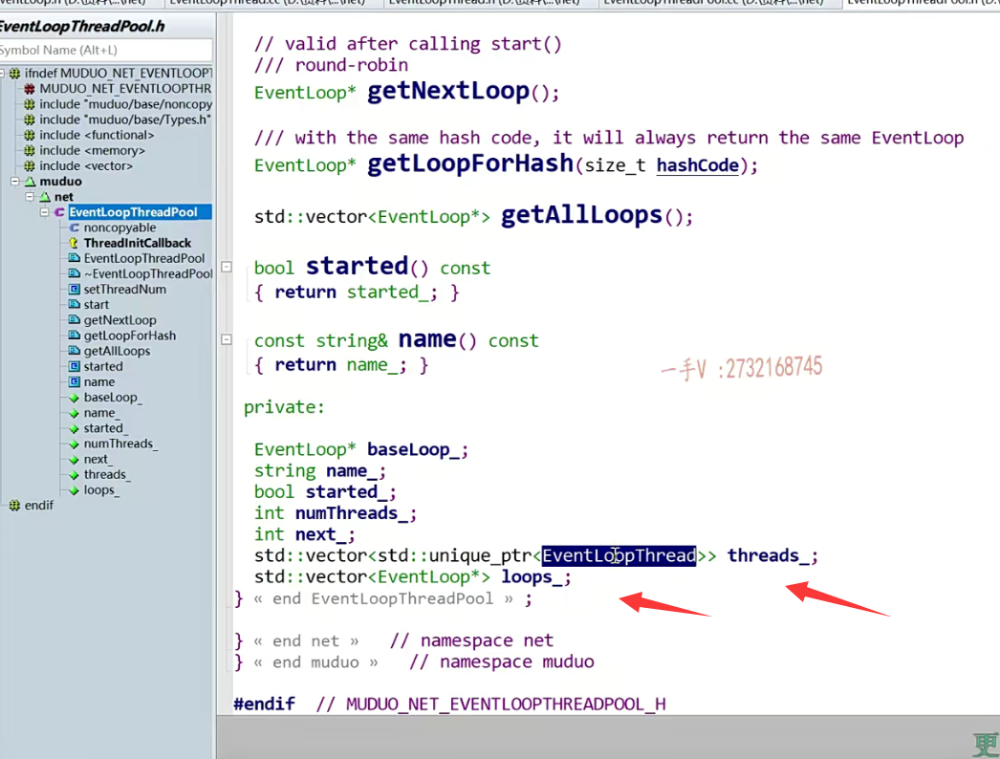

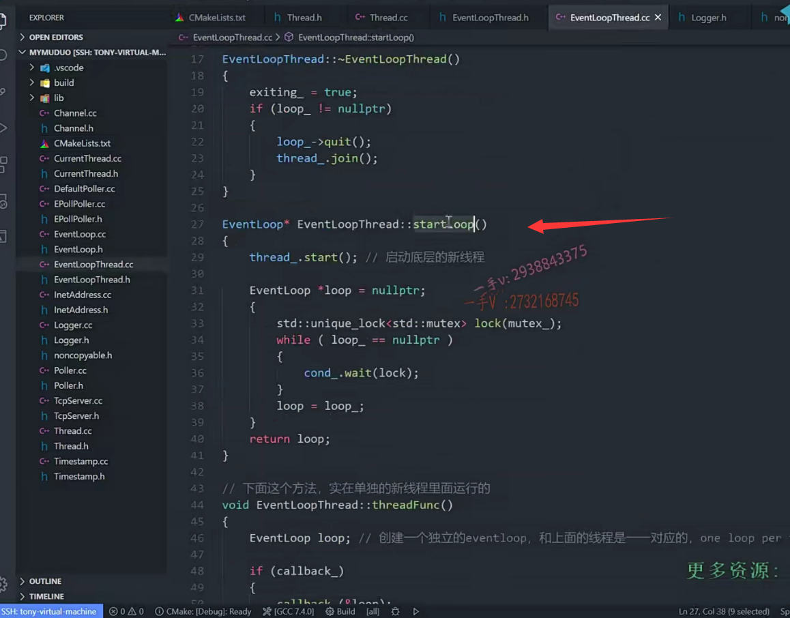

### EventLoopThreadPool实现

好，那在这里边儿呢，我们这节课主要就是来把这个类的核心呢，给大家来输出一下啊。

那我们同样呢，先来定义上相应的这个文件啊，代码文件event loopthreadpool点h。再把CC给出来。

class event loop.threadpool

那大家来看，首先同样的还是得包含noncopyable是吧？

这里边呢，我们需要前置声明event loop，还有event loop thread。

来继续看人家的代码，继承noncopy able，

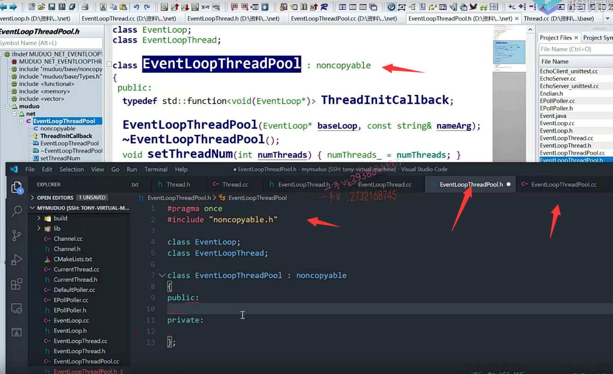

## 成员变量

先把成员变量输出一下。

啊，在这同样的。

我们需要把这个线程的初始化回调类型给它先定义出来啊。

因为event loopthread pool底层管理的就是event loop thread嘛，

你看我们在写event loopthread的时候是不是也定义过这个呀？

这个线程初始化的回调操作，就是从上边儿传传下来的啊。

所以我们把这个类型刚好拿过来吧。

那这个需要包含相应的头文件了functional啊。

然后它的成员变量就是大家注意看啊，注意注意，

有一个eventloop base loop.

大家使用的这个使用muduo库的时候，

编写服务器程序的时候是不是都会去自己去在代码上，

首先先创建一个event loop 啊。对不对啊？

把这个呢给到tcpc给给到你的这个服务器类里边。

那么，这就是所谓的base loop？

我们说了，如果你不通过啊，不通过TCP server的set thread number。

对吧，==那set thread number来设置底层的这个线程的数量的话，==

==那整个的这个服务器muduo库呢？采用的就是单线程模型了。==

就是这个base loop啊。就是对应的是一个线程，这个线程里边呢，

就是我们当前的这个用户线程啊，用户使用的线程不仅仅作为新用户的连接，还要作为已连接用户的读写事件，那就无法有效的利用我们多核的这个硬件资源了，对吧？

所以一般上来说呢，我们会去设置一下线程的数量，设置线程数量。

那就会产生新的eventloop啊？

你就是造成了one loop per thread对不对啊？

注意这个base loop，什么叫base loop就是我们用户创建的那个一开始的loop，

最起码你得有一个loop，对吧啊？

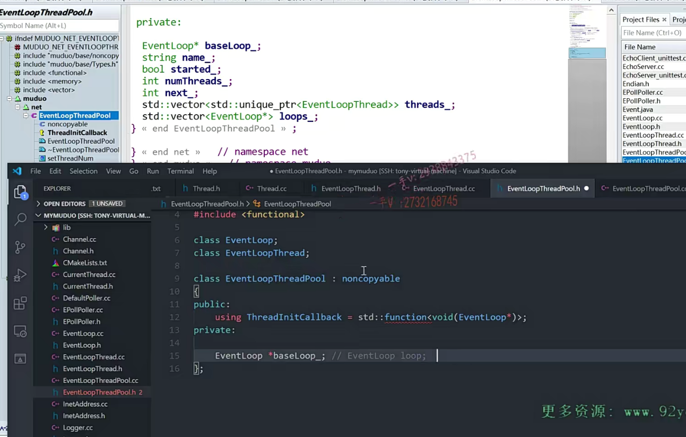

然后就是string name，

==那我们用到了string就得包含一下头文件了==。std string name.

然后是布尔值started。对吧，

然后是numberthreads。

然后是next。

还有vector，我们也用到了vector，==需要把vector这个头文件呢，我们也需要包含一下。==STD.vectors TD

还用到了智能指针，==那我们需要包含一下哪个头文件呢？memory对吧==？unique，unique ptr是event loop thread。threads好吧，

还有一个vector包含了什么东西呢？包含了这个event loop*，叫做loops。

哎，这个相当于包含了所有创建的事件的线程。

这个是包含了什么事件线程里边那些eventloop指针？

好吧，通过调用event loop thread的什么？start lup函数，

你就会得到一个新线程里边的一个loop的一个指针了。

okay吧。这是成员变量，我们现在输出完了啊，

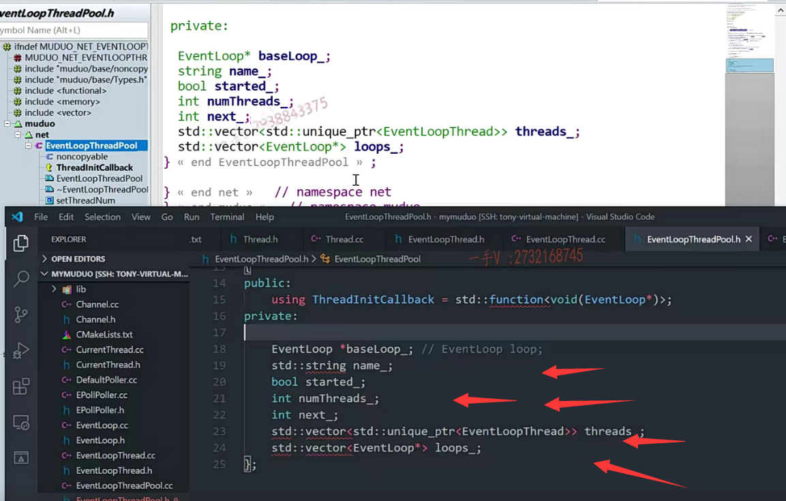

## 成员方法

成员方法我们给一下。

首先是eventloop thread pool的构造函数。

需要一个什么东西呀？

需要一个事件循环 baseloop。

还需要一个const string.name arg.

然后这个析构这个析构实际上不用做任何事情。这个析构不用做任何事情啊。

好，这个就是呢，你在写的时候，你是调用了这个TCP server的set thread number对吧？

最终呢，TCP server的这个set thread number底层调用的还是event loop thread pool的set thread number.啊，

设置底层的这个线程的数量int number threads。

number thread.等于numbersthreads？OK吧，

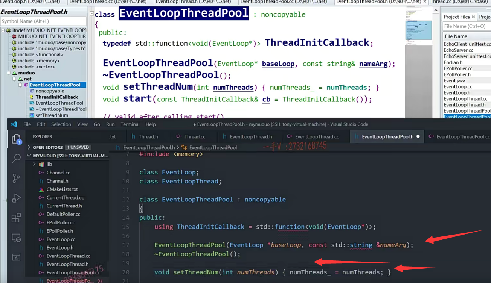

然后呢？这是start。干什么呢？开启整个的这个事件啊，

开启整个的这个事件循环线程。

就是根据你所谓你指定的这个数量嘛，对吧？

在池里边儿呢，给你创建number thread s个数的这个事件线程啊。事件循环线程对吧？

这是初始化的一些回调啊。好，还有吗？

还有就是event loop*是get next loop。

那么注意各位啊，在这里边呢，就是如果是多线程的话，

如果工作在多线程中啊。那么，这个baseloop啊？

会默认以轮询的方式呢？分配channel给sub loop.好吧，

就用我们新创建的loop，这个相当于就是Main loop就是base loop。

OK，默认就是以轮巡的方式啊，

这个还有一个就是以固定的这个hashcode的这个方式，这个方式呢？

是一个定制的方式啊？啊，我们不用不用，所以我们就。不写它了OK吧啊，不写它了。

这个get all loops也不一定用到。

那我们先给出吧啊，先给出我们这个分配就是以这个轮巡的方式就默认的这个函数，这个我们是必须要的啊。

这个相当于提供了一个接口，返回了这个池里边所有的这个loops。

然后是布尔值start ed。

然后这是个什么东西呀？这是返回name.

OK，那么这里边儿需要在外边儿进行在CC文件里边儿需要定义的，那就是这几个了是吧？

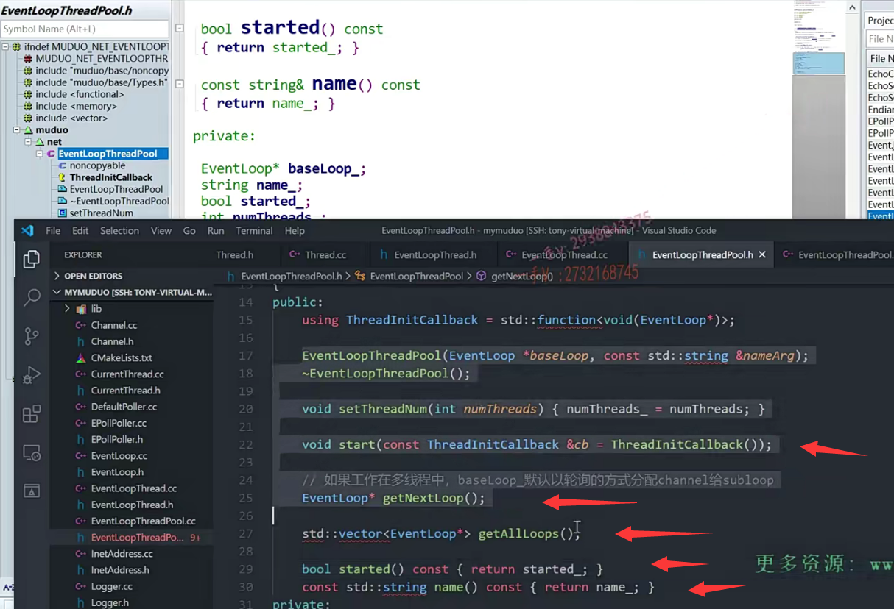

好了，我们把相应的这个原文件包含一下。

大家来一起跟我看一看它的这个实现啊。

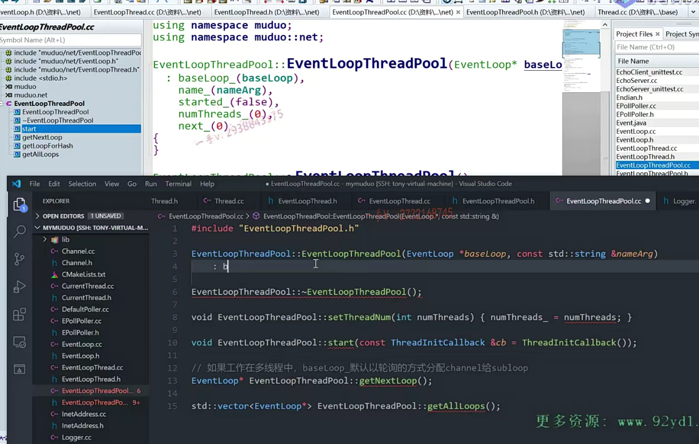

## 构造函数的实现

首先。构造函数需要做哪些的初始化操作呢？

当然，需要先把这个谁初始化一下呀。base look对吧？

这是用户创建的啊。

然后还有呢name。name arg.这都是一些无关紧要，无伤大雅的东西啊。

started刚开始是false未启动，对吧？

这是number thread s。初始化的时候写成零呗。

这也是next。是来做什么的？做轮询的这个下标的啊，刚开始也是零。好

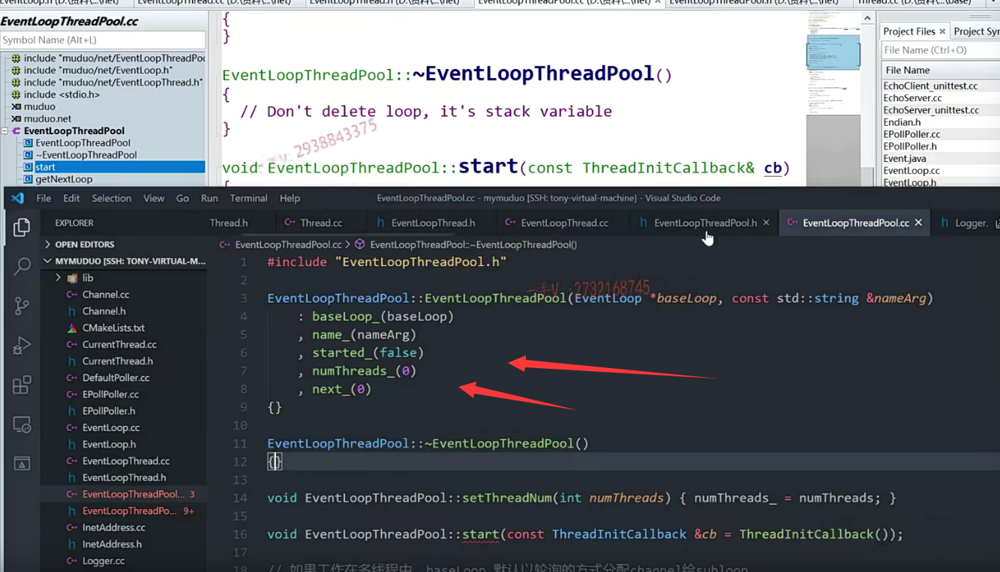

## 析构函数没有实现任何

析构没有做什么事情。

don't delete loop，it's tag variable。

也就是说，这里边啊，你不需要关注vector析构的时候呢，

它里边存的指针指向的外部资源。是否需要单独的去delete一下呢？

不需要为什么，因为这人家已经跟你说了啊，

因为呢，线程里边绑定的loop。都是栈上的对象，你也不用担心呢，需要手动去delete它。

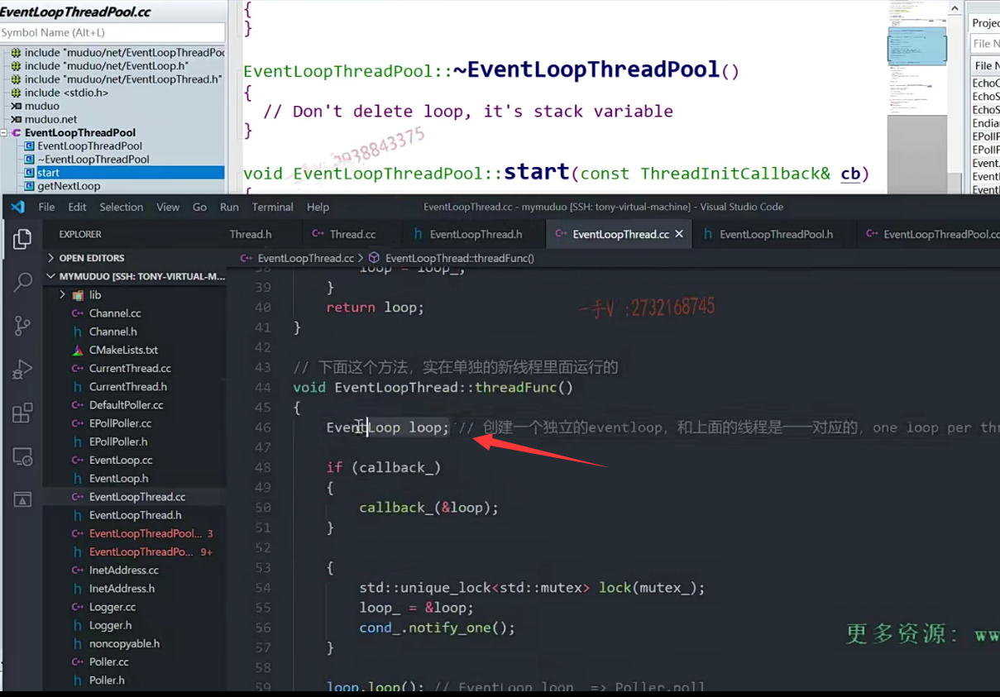

他也不会去释放掉，为什么？

因为他下边的这个loop就一直在这循环到这工作了。

这个函数是不会出右括号的好吧，

除非这个事件循环底层的poller不工作了结束了，

那结束的话出右括号。这个loop对象会自动吸购的OK吧，

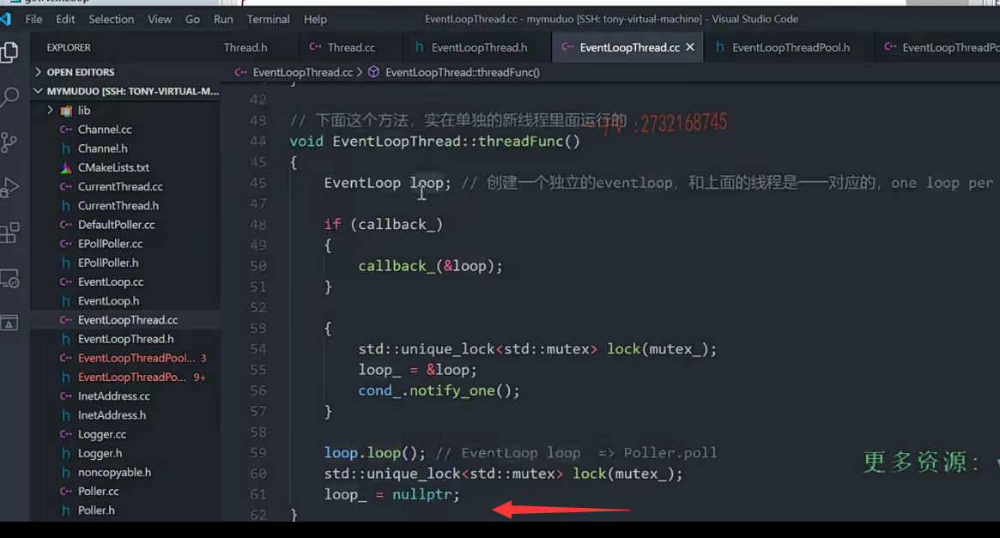

所以呢，线程底层创建的这个事件循环对象啊，不需要你手动delete。

它是在线程函数的线程栈上创建。好的吧。

所以这个析构就什么也不用做了啊。

啊，这个start开启。

这个，我们不需要了。

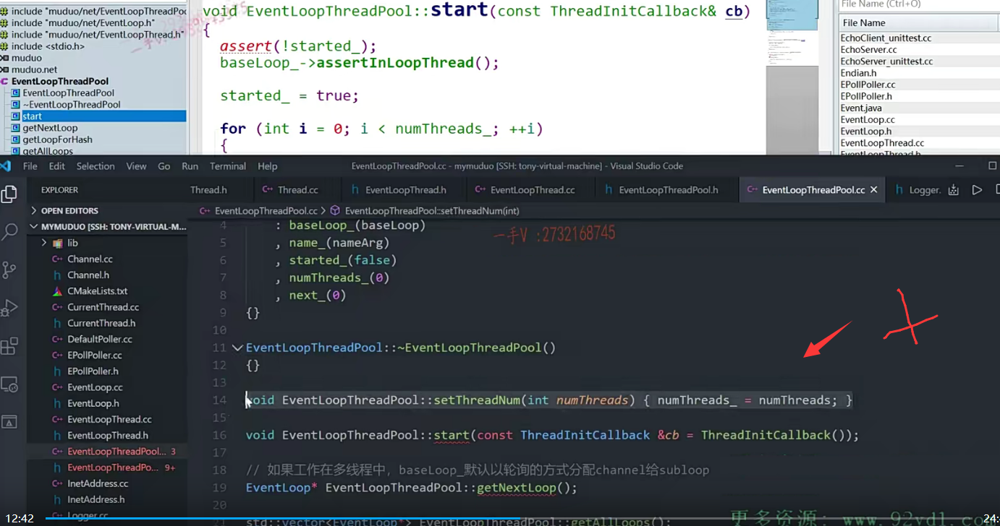

## start()实现

参数的默认值只需要声明时给就可以了。

先是start it等于什么啊？等于true

前面这些断言呢？我们就都不要了啊。

好在这里边呢，

首先int i =0 I小于什么呀？numberthreads.

就根据你设置的线程数量。++i

那各位。有的人根本就没有设置过，没有调用过set thread number。

哎，没有调用过set thread的number来设置了muduo库底层的这个线程的，

是不是数量啊？

所以在这儿这个for循环能进来不？进不来？

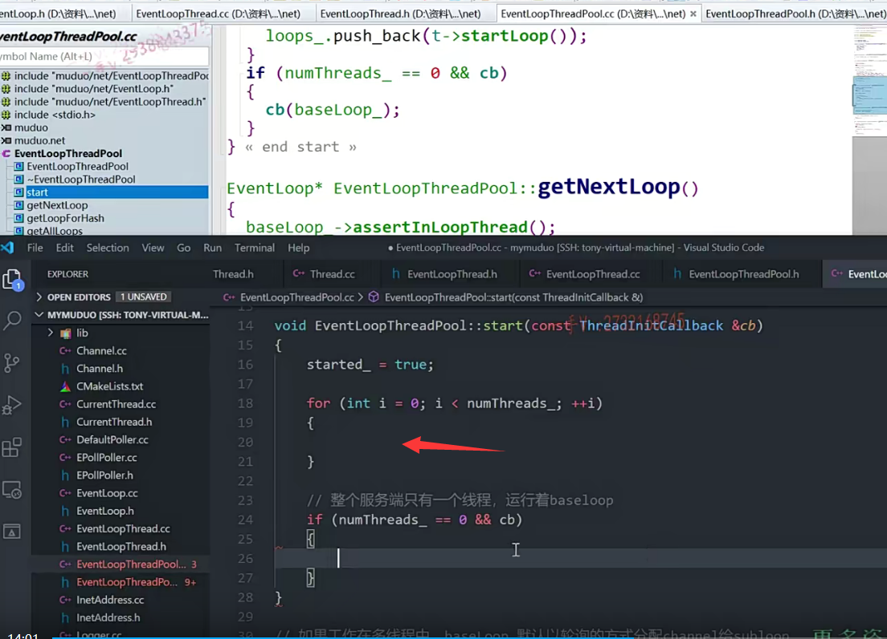

好吧啊，进不来，进不来也就意味着这里边的numbers rise，如果等于零，

那也就是说呢，只有谁啊？整个服务端只有一个线程运行着。

是不是这个base loop啊？也就是用户创建的那个main loop？没问题吧啊，

而且呢，这个threaded call back呢，不为空也就是线程的初始化回调。

你要用户给了，不为空那你作为网络库你就给人家执行一下用户事先设置的这个回调。OK吧，

给这个base loop，这是用户创建的。

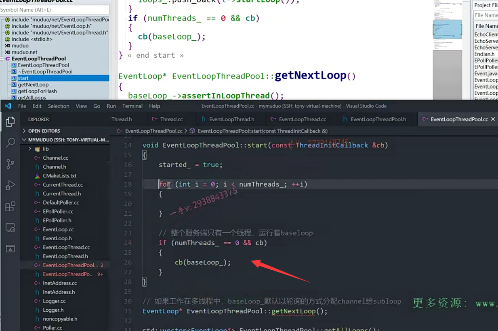

那么如果说你要用户通过set thread number设置了底层的线程数量的话，

那就进这个for，就不会进这儿了。okay吧啊，就不会进下边了。

### 先创建一个名字

那么大家来看。在这里边，

首先是char buf。name size+ 1个什么呀？加上一个32。

==这是呢，给他的这个底层的这个线程啊。==

==就是命名的一个规则，就是用当前eventloopthreadpool 用这个线程池的一个名字啊，再加上 一个下标序号作为底层线程的是不是名字呀？===

你看SN printf。buffer set off buffer.然后是。百分之s，百分之d啊。name点c杠STR。

在看到了吧，它用线程池的名字呢，再加上这个循环的这个下标，作为底层线程的名字。

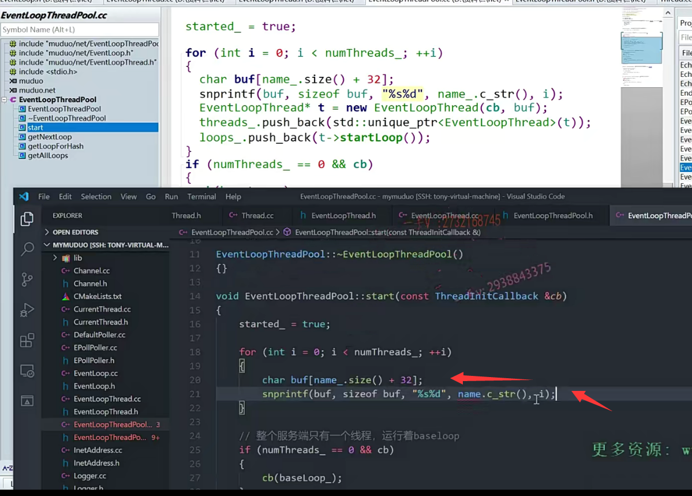

在这呢。那我需要包含event  loop thread.头文件是吧？

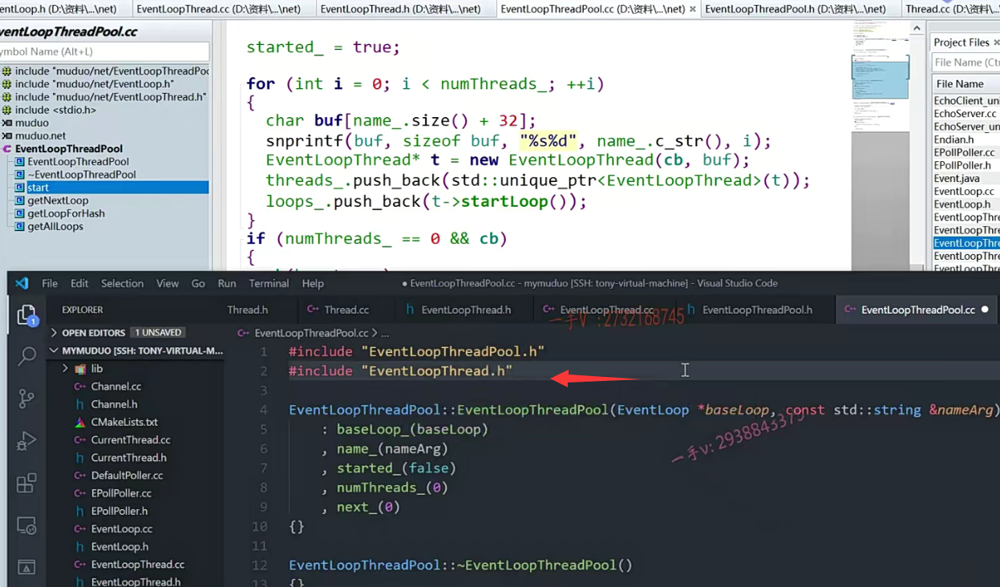

### vector容器元素都是智能指针，自动释放资源

在这儿呢，我就要创建什么了。event  loop thread啦？

t=new event loop thread。

第一个是thread any的call back，

第二个就是这个名字对不对？

然后把它添加到哪个里边啊？push back.unique ppr这还用到了这个智能指针。==需要包含一下相应的这个头文件啊。==memory.unique ptr.是even的loop thread。okay了吧，

这相当于呢就是。用unique ptr存储，它就是我们不想手动去delete了，对不对啊？

智能指针呢？会自动的帮我们去释放资源。这个threads，这个vector存储的就是我们创建的所有的事件循环线程嘛。对不对啊？

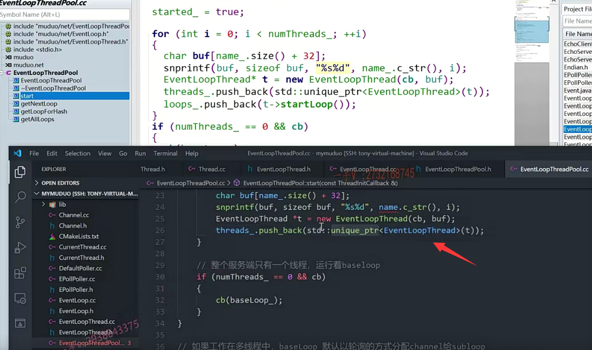

事件循环线程创建起来呢（EventLoopThread   t）？实际上就是一个对象，什么也没做呢。

啊，你要启动底层的东西呢？

你得调用它的start loop。

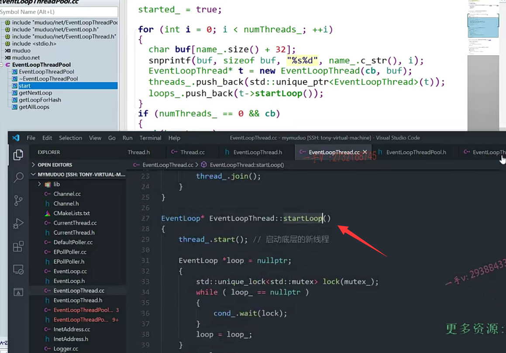

## 事件循环线程池的创建过程

#### 通过loops.push_back(t->startLoop)    startLoop来创建线程并且返回线程loop地址

对了，loops点push back？

==当你用它的这个starloop一调用的话，这个就没了啊，这个就是底层啊。创建线程啊。绑定一个新的eventloop。并返回该loop的地址，==

==还有我们线程池呢。事件循环线程池，我们就给它存起来啦。看到了吧啊，就是这个样子的。==

那这个start做的事情呢，就是这么多。看一看。

好，那start完了，就是继续往下边儿，

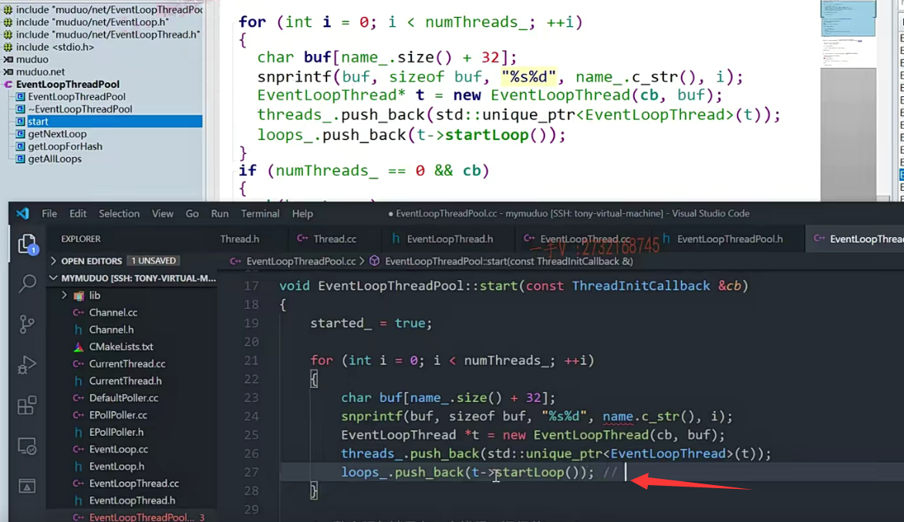

就是get next look了。get all loops应该是非常简单的，对吧？

啊，我们先写简单的吧。

if loops.是个empty。那就是没有创建过线程啊。

那就是只有一个base loop，是不是只有一个贝斯loop啊？

vector.eventloop星只有一个是谁呀？是base loop啊，

因为返回值需要的是一个vector。

啊else那就把loops。给它返回回去就可以了。

#### ==少了一个return==

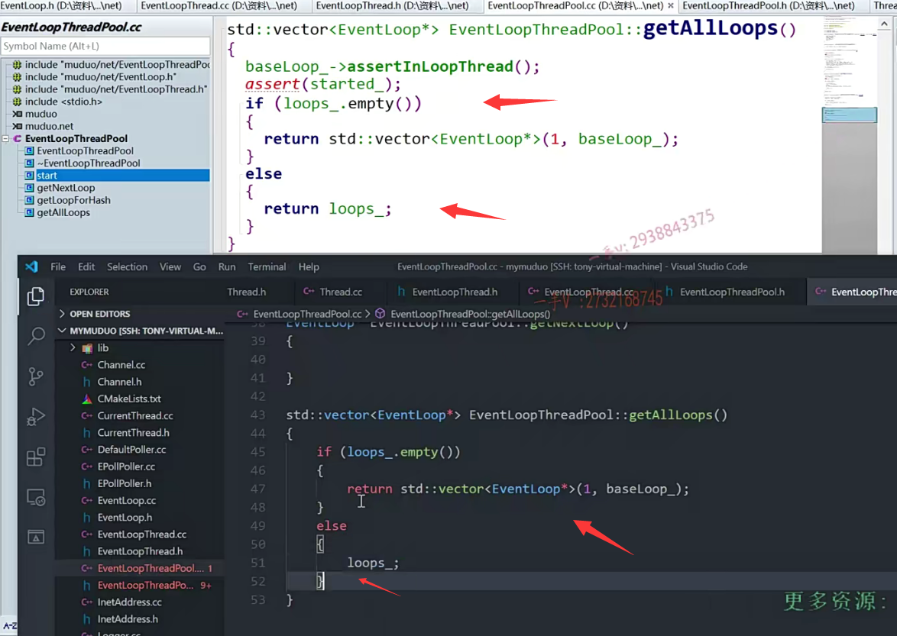

## get next loop

### 没有去创建其他线程数量

get next loop就是轮巡，大家来看这里边呢，

通过它的这个轮巡你也。呃，能很明显的明确一件事情啊，

首先呢，大家来看啊，前面断言我们就不看了。

一上来就是eventloop。loop=base loop。

==让这个loop指向了谁呀？让这个loop指向了这个main loop，就是用户创建的这个loop。==

如果我们没有创建过任何的其他的这个设置过其他的这个线程数量，

你就不会去创建其他的，是不是eventloop啊？

那在这儿，你看returned就是谁？

那从这儿我们也可以看到，就是说呢，如果呢，我们没有去调用啊，它的set straight number创建底层的。

事件循环线程的数量，那在这里边永远用的就是什么base loop，什么事情都在base loop上做。

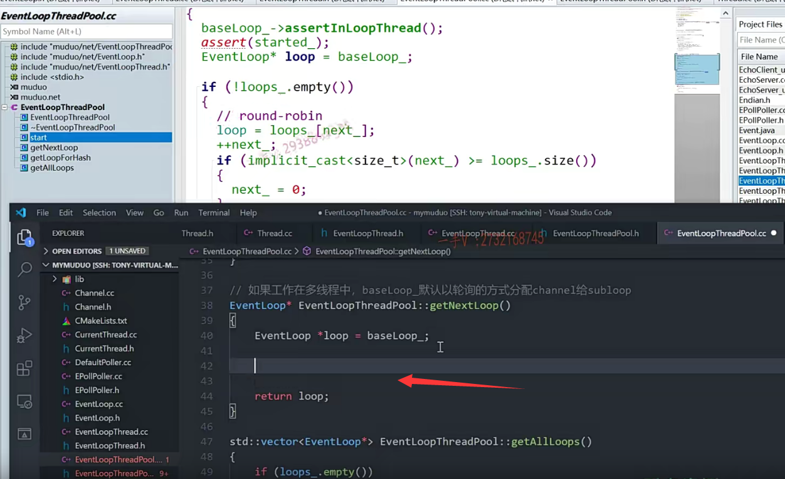

### loops不为空

但如果loops点。empty.如果呢，这个loops不为空，

那也就是说在这里边呢，number threads不为零。

这里边创建过独立的，是不是事件循环线程啊？

那在这儿就是。loop。等于loops 谁呀next next初始化是几啊？

初始化是零嘛，是不是啊？

那在这儿做了一件什么事情呢？在这儿做了一件next++。

就获取了当前的这个loop啊。

然后做什么事情啊？然后就是next的值，如果大于等于了loops的size。

next就要再归成零了。

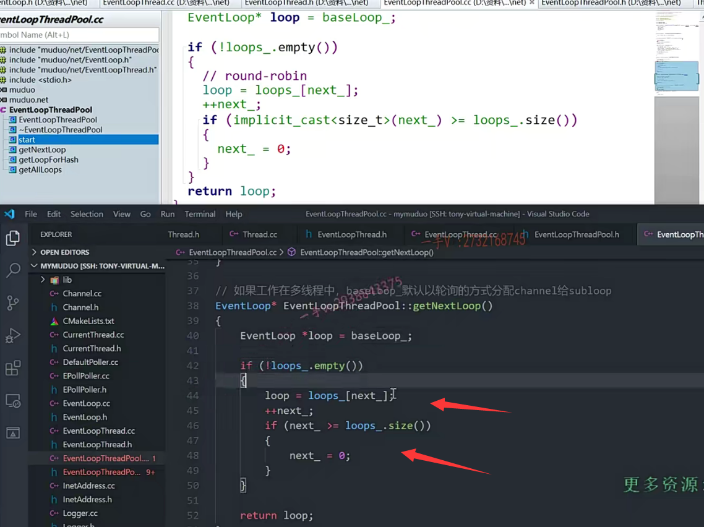

大家看，如果在这里边get next loop的时候啊。

这相当于就是。main loop线程通过轮循的方式呢，循环的去从这个子线程里边儿去取loop。对吧，

相当于呢，就是只有一个main base loop的时候呢，

我的这个lO线程跟工作线程做的事情就是接受新用户的连接以及已连接用户的读写事件，都在一个loop中去处理。

### setThreadNumber是创建子线程的数量，即工作线程数量

如果你set thread的number是一，也就是底层创建了一个新的线程的话，

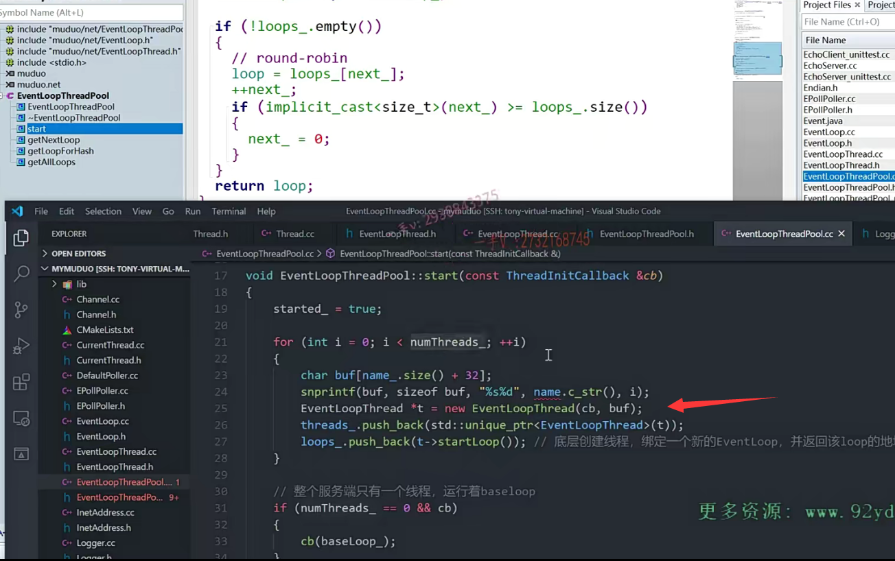

### 典型的轮询

那在这里边。就是lO线程是运行的base loop，

工作线程运行的就是你新创建的这个loop了。

对吧，lO线程我们一般都是只做新用户的连接事件啊，

工作线程就是处理已连接用户的读写事件。是不是这个意思啊？

这就是典型的这个轮询啊。

通过轮询这个获取下一个处理事件的loop。

好了吧，再来看loop不不为空啊，以next为索引获取当前loop ，next++。

如果你加出loops的size了，那么把你再置为零，典型的轮询。好了吧

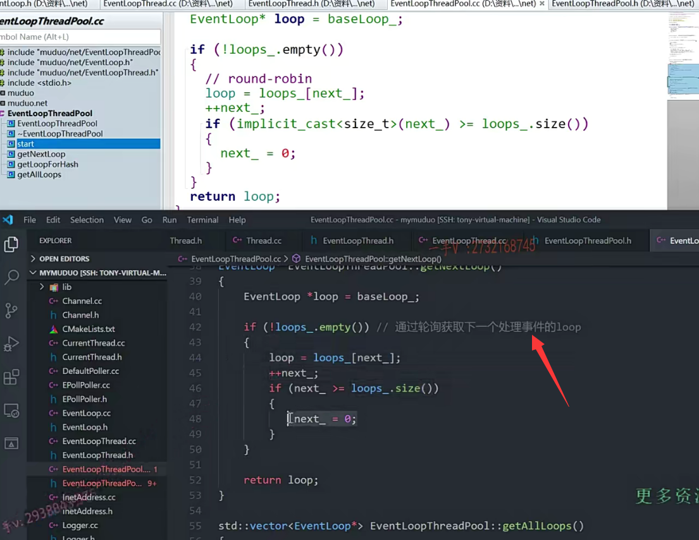

## 总结

OK，那么这个event loop thread pool这个类的相关的核心的方法代码呢？

我们也就都写完了啊，我们也就都写完了，

希望大家呢？理解一下，

并且呢，自行的把代码输出一下啊。嗯。好那么。

目前，由于我们新写的这几个代码文件呢，没有被引用到啊，没有被引用到，

所以呢。目前好像编译一下。看他们没有参与编译。是不是没有参与编译呀？

唉，没有参与编译。啊，没关系。呃。

这节这个这节课我们主要讲的这个eventloopthreadpool啊，

相当于呢我们把事件循环跟线程相关的三个类thread event loop thread以及event loop thread pool，我们给大家在这里边就说完了。

接下来呢，我们就要说TCP server其他的这个组件了啊，

其他组件说完了以后呢，我们整个把TCP server输出来输出出来以后。

TCP server被我们使用以后呢？

那么整个相关的组件，他们都会参与到编译中来。

好吧啊，我们先写到这里目前。看编译动态库是没什么问题的，后边再有编译问题，我们再去解决好吧，

希望大家通过呢，这三节课的学习能够把这个thread以及event loop thread以及event loop thread pool，它们之间的这个调度关系啊。好好的看明白好，

那这节课的主要内容就给大家说到这里。