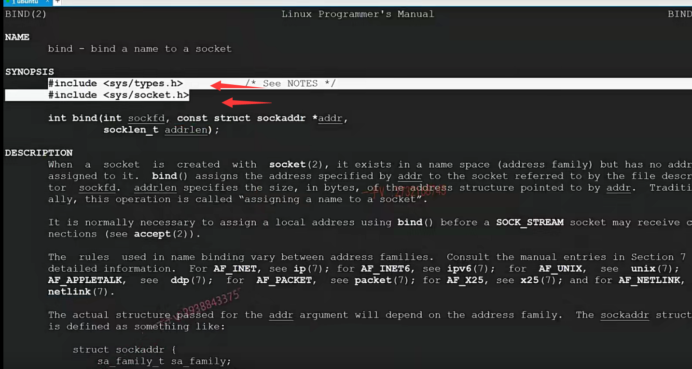
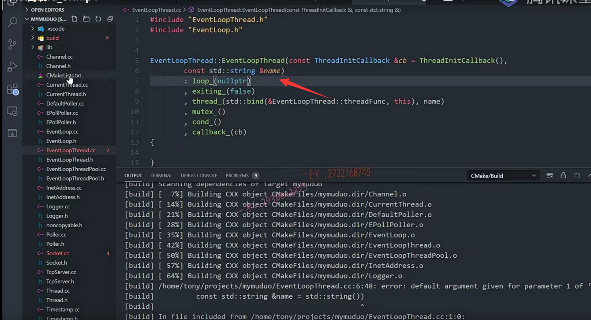

同学们，到这一节课，我们已经把muduo库。核心的代码，模块的channel。poller和epollpoller以及event looppool。三部分我们写完了。

这三部分代表的是reactor模型的什么呀？

我们就说呢，代表中间的这个反应堆还有它的这个事件分发器。对吧啊。

啊，经典的这个网络模型one loop per thread在这里边呢，我们把这个事件循环。

的这个书写过程呢，已经给大家完成了。

那接着呢，我们去说了一下它的thread。这个event loop thread。还有event loop thread pool。

最终我们明白啊，它是在一一个线程里边啊，去创建的。

绑定线程的是不是一个loop啊？相当于一个线程一个loop，一个loop在一个线程。

muduo库在使用的时候，

我们需要首先用户自己去定义一个event loop。

那个我们相当于就是一个base loop。对吧啊，

==如果说呢，我们用户在使用的时候没有通过他这个提供的这个set threadnumber这个接口来设置muduo库底层线程的个数的话呢，==

==那么也就是说它的这个lO线程跟工作线程实际上用的是一个线程。就是main线程base loop所在的这个线程。==

对吧啊，很明显这对我们硬件资源的这个利用呢，不够充分效率呢，没有达到这个最优。

所以呢呃，实际上呢啊，我们说啊。

## 逻辑梳理

我们muduo库是一个multiple reactors。

它可以通过呢set thread的number来设置底层的这个线程的这个数量，

实际上它设置的是sub reactor。就是subloop 这个线程的这个数量。

那么，我们现在已经呢把这几部分说完了。

## acceptor的作用

接着呢，就该说我们组成TCP server，另外一点非常重要的就是acceptor了。

通过这名字，我们都能看到啊，它主要是不是就是嗯干嘛的，就是处理accept。

啊，监听新用户的连接。

==呃，有用新用户的连接响应以后呢？就会把这个就是拿到跟客户端通信的一个新的一个client fd，就是通信的socket，对吧？把它打包成一个channel。==

然后呢？根据muduo库默认的轮询算法。

是不是找一个这个sub loop，

然后呢？把接收的这个channel扔给sub loop对吧？

==在扔给sub loop的时候，他还得先把sub loop是不是给他唤醒一下啊？==

实际上呢，这里边是怎么唤醒的呢？

这个我们之前都讲了啊，是每一个loop呢，是不是都有一个wake up fd啊？

wake up fd是通过呢，系统的这个linux这个内核的API event fd创建的。

啊，一个带有线程间notify wait notify啊，就是通知机制的这么一个fd，

我们也是呢，在sub loop的这个poller中啊，去监听的啊，

我们main loop 可以通过呢，给wake up fd去写一个东西啊，写一个整数。

对吧，然后呢？唤醒相应的这个sub loop，然后把拿到的新用户连接的这个封装好的这个channel。扔给sub loop。

那我们说最终典型的模型就是Main reactor专门在这里边做什么啊？专门在这里边做新用户的连接事件，

你看Main reactor在这里边做，主要就是acceptor操作。对吧啊，

accept函数本身给我们返回的就是一个跟客户端通信的socket fd。对不对？

然后把它打包成这个channel，

然后根据轮巡算法采用的一个算法啊，轮巡算法啊。然后呢？

通过相应的这个loop的一个给相应loop的wake up fd写一个东西啊，

然后呢，就可以把相应的这个sub loop或者叫sub reactor给它唤醒，

然后把这个channel给到相应的sub loop里边。

给到sub loop相当于也就是给到sub loop的这个poller里边，对吧啊？

开始让指定的轮巡算法指定的这个sub loop来监听新的这个channel上的读写事件。

OK吧啊好。

那么这节课呢？我们主要就是来处理这个TCP server。

大家看啊TCP server，我们现在呢，这一些东西呢，我们现在都已经有了，

现在就差一个acceptor跟TCP connection了好吧啊。

那么TCP connection呢？我们先不关注啊，这节课我们先主要关注一下acceptor。

acceptor的角色呢？刚才通过给大家做一个简述，大家应该知道呢accept or是处在什么位置的？

它主要就是运行在我们这个base loop里边也就叫做Main reactor里边的好吧，

要实现acceptor 呢？那肯定他得从哪个这个？

从那个监听队列里边是不是监听新用户的连接呀，所以它得有一个listen fd。

对不对啊？所以大家来看啊，

这里边封装了一个socket。相当于呢muduo库里边把这个简单的用整形表示的文件描述符表示一个套接字也给它封装成一个类了。

啊，其他的我们像channel啊event loop啊，这些东西呢，我们就都已经实现过了啊。

## socket类实现

好，那这节课呢？我们为了实现accept，先把这个socket的简单封装，我们来看一下啊，

也就是说呢，这节课代码上我们主要完成socket。

实际上也没什么好完成的啊，它你看它纯粹就是对一个fd是不是进行一个封装啊？

这里边通过构造函数获取外边肯定是一个listen fd吧，对吧啊？

在accept or里边。

然后这是返回呢，底层的这个文件描述符啊，

然后这些东西我们就都不需要了，

bindadress这里边相当于就是在绑定嘛。

啊，创建这个是有了这个socket，然后是绑定相应的IP地址端口。

这个IP地址跟端口是我们用户帮我们传进来的，对吧？

然后是listen开始监听。是吧

accept accept就开始干嘛了啊？在这里边呢，就开始从监听堆里边拿通信的fd了，对吧？

### shutdownWrite() 

shutdownWrite()  TCP通信是一个双向的通信啊，每一端都可读可写。

看这函数名字，就是把写端是不是给关闭掉啊？

接下来set TCP no delay,s ET reuse a ddr ,setreuse port ,setkeep alive啊，

这些东西相当于就是更改了一下啊，通过setsockopt系统函数来更改一下TCP的这个选项啊，这些东西呢？没什么可说的啊。

所以这个socket的这个封装还是很简单的，纯粹就是对于这个TCP的这个socket啊fd一个简单的封装，这节课我们主要把它来完成了啊，来完成了。

好，大家来跟我看一下。我们创建socket点h。还有socket点CC。

哎，这不是include啊。class socket.public.private.封装socket fd啊。

这里边用到了inet address啊。

inet address.前置声明一下啊。

## 成员变量

好，首先看它的这个成员变量。

成员变量是个const int sock fd。

那么在这里边。还是同样的，我们需要包含这个non copy able。对不对？

然后呢？继承一下non copy able

class定义的类，这是默认是私有继承，struct定义的类，默认是公有继承啊。

## 成员函数

### 构造函数和析构函数

那么在这呢？

防止产生隐式转换，产生临时对象，对吧？

这个呢C++里边我们都说过了啊，sock fd（sockfd），

然后是干嘛呢？

这个析构函数析构函数应该是。就是close一下fd呗，对吧？

### fd()

这个是in tfd。很明显，这是一个只读接口，所以写成const方法(不允许修改成员变量的值)了。return sock fd。

### bindAddress()

然后呢？这里边儿是。vo ID bind address.castine t address.local addr.

### listen()

还有呢，还有是listen。

啊，还有什么呢？

还有是accept accept im address。peraddr

void.shut down.实际上，这个接口我们都用不着啊，我们写上吧。

还有，这是一些。什么东西呢？更改TCP选项呢是吧啊？

void set TCP no delay.就是直接发送，对于数据不进行TCP缓冲对吧？

然后呢，是void set reuse a ddr。编译选项有很多，大家可以呢呃，在网上查或者是在linux上用man来查一下。man命令来查一下啊。这个说明都是非常详细的啊，

还有set use.reuse port是否打开啊？

还有set keep alive.

好了，那么我们要实现的就是这析构以及这几个函数啊。

好，大家来跟我看，我们在相应的这个socket点CC里边。socket点h啊。

这个我们就不需要了。我们看相应的这个实现啊。

首先在这里边，在这里边的这个方法，他都把这个相应的这个系统的API调用啊，封装在了又封装了一层，你看相当于close啊，它就是定义了一个sock sockets ops点h。封装了一下这个close，实际上它这个。close啊，

大家来。看看啊，他这个close掉呢，是不是还是系统的这个API close呀啊？

你像这个writet掉呢，还是write?read的 shut down red调用的就是shut down。OK吧啊，就做了一下简单的这么一个封装而已啊。

好，我们返回回去。

那在这里边呢，相当于就是做了一个close。好，我们需要包含一下头文件。

close sock fd.没问题吧？

好。那么在这里边呢，我们再来看这个bind啊bind。bind的这个就是绑定嘛，是不是啊？

绑定操作bindOrDie。

什么叫bindOrDie啊，我们进去啊，这是一个namespace，

所以呢，bindOrDie到底是什么意思呢？我们来看看啊。bindOrDie就是还是绑定啊，

那就是失败的话就直接fatal了，

因为绑定都绑定不成功，不需要再往后继续运行了，是不是我们日志呢？

有相应的不同的级别，这里边fatal就直接exit了，

我们把exit直接集成在了这里边的fatal里边，muduo库也是这样做的啊。

好，我们需要包含我们的这个日志啊log点h。

那么，在这里边就是绑定。int ret等于或者说是我们不用RET了吧，我们直接bind的啊。

bind的需要包含这两个头文件。

我们复制一下。粘贴到我们的代代码文件中来。

这 零不等于bind对吧啊。办的第一个是。什么呀，第一个就是sock fd。

第二个是什么？第二个，这里边local addr就是inet address，里边本身是不是就有一个什么呀？呃，这个得需要包含它的这个头文件了。

get sock addr.看到了吧，本身就有这么一个啊。返回一个sock add ren对吧？

那我们的这个bind的第二个参数需要什么啊？是需要sock addr？

那在这里边。给它进行一个addr。复制okay。

第三个是什么？第三个是长度是吧啊？那就是size of。size of socket len.

我们看一下它是怎么传的？哎no，我们还是要进来啊。bindOrDie。啊，

他给的这个是。这个sock addr杠in 6 IPV 6的这个我们不做IPV 6的支持了啊。

set off这里边，我们直接写个sock。addr杠in就可以了。

OK，那在这里边，如果说是它不等于零啊，不等于零，那在这我们就要写一个log。fat这表示什么啊？sock fd.办的socket fd。fail百分之d啊。

好在这里边，我们把这个sock fd呢的值给它打印到这里边。好了，这个bindaddr的dress呢，我们就完成了啊。

## listen()实现

再来看一下这个listen。

这里边的这个listen肯定调用的也是这个listenOrDie 是吧？

他调用的也就是系统的这个listen这个API啊。

所以在这我们也写这个了。

零如果不等于listen。sock fd.我写个1024啊。

这同样的。要加一个fatal的日志啊。listen fd fail.

好了吧啊。我们这儿最好把这个全局作用域加上吧。

啊，以免跟我们定义的一些局部的方法呢，产生冲突啊啊，刚才这就是啊。

嗯，好了，这个就是listen就完了啊。

那我们再把这个accept来看一下。

accept.在这里边。

accept相当于就是我们有什么东西啦。

有用户来连接了，对吧啊？

调用系统的这个accept啊来获取了跟用客户通信的一个connect fd。对不对啊？

这里边呢，就是把这个addr呢设置给谁啊？

设置给参数呢？这个peeraddr相当于通过这个，这是一个输出参数嘛，对吧？

==相当于通过这个输出参数，我们就把连接我服务器的这个客户端的这个地址信息，==

==包括IP地址跟端口号呢，我就都送出去了。==

==然后呢，把客户端通信用的这个connection fd呢，给它返回回去。==

好在这呢，我写一下啊。同样的，我只支持IPV 4就行了。sock add rina DDR.

那在这里边用bzero啊，我们给它初始化一下，要用bzero的话呢，==我们需要包含一下系统的这个头文件。是strength点h啊。==

b zero.这个是addr。size of a ddr.OK，

然后是CON nfd等于什么呀？accept sock fd.

第二个是sock addr啊。sock addr.addr.

第三个是什么啊？是一个sock len杠t一个。长度的一个地址，对吧？

把这个给他啊。

啊，如果说是CON nfd。是大于等于零的。

就表示这是一个有效的fd是吧？

我们唉呦，你看啊，==我们给inet address呢，没有提供相应的这个set sock。==相应的这个方法啊，

我们给他提供上吧，好吧？

return我们先把这个return语句给人家补上啊。

### 给inetAddress.h中添加一个新的成员方法setSockAddr()

好，那在这里边呢？大家来看啊。

我们给他补充一个这个方法吧。inet inet address我们不需要给谁啊？不需要这个支持，这个add。r6啊，这个实际上是一个联合体是吧？它俩共用的是一块内存啊。

我到这个inet address在哪里呢？在这里。各位，我来给他补一个方法啊。有get就有set。void set sock.addr.就写了这吧啊，

上面是get，底下是set。cast sock addr.一母二。ae DDR.addr杠等于addr。

好了啊，

### accept()返回connfd并且会通过传出参数peeraddr来设置客户端的地址，也是相当于传出去了

那有了这个方法，以后呢，

相当于就是我们上层如果调用啊，传入一个inet address，一个对象的地址的话呢。

这个底层呢accept得到一个新用户通信用的fd，以及它的这个地址的话，

我们首先呢，会把这个通信用的fd通过函数的返回值返回回去。

然后再把这个客户端的这个具体的地址啊，sock addr_in。打包的这个IP地址端口号啊，

通过这个输出参数啊，给它传出去啊。per dddr.set so add rae DDR.

好，那这个方法我们也就写完了。没问题吧啊，大家？

### shut down write()

看一下这个accept。

接下来就是这个shut down write，就只是关闭谁啊？

只是关闭它的这个写端对吧啊？只是关闭它的这个写端。

我们看看它调用的也是相应的系统方法。shut down的就是这个。

你对于这个方法不熟悉的话呢，你可以怎么样啊？用的少，不熟悉。

你可以看一看。它的这个说明。

shut down 需要包含的six socket点h，我们有没有？有了是吧？

这是sock，这是how啊？how if how is shut rd，这很明显是read的简写嘛啊，

further receptions will be。dis load.

那就是不再读了啊。那fis shut wr就是write就不再写了。对不对啊？

好在这里边，大家来看。对于这个方法来说呢，人家还是比较什么呢？比较不是那么严格的啊。write如果说是小于零。

==不是fatal，仅仅只是个什么error而已，error不影响程序继续往下运行嘛，==对吧？

只是做了一个打点日志啊。嗯。shut down.error,

## 设置socket选项的函数

好吧。那在这里边，我们再来看这是设置socket的选项的啊。

==这个我写一个，剩下的直接copy啊。==

都是通过这个系统的set sock opt啊。opt value.

这个on的话就是打开是吧？否则的话，零就是关闭啊。

set sock opt第一个就是sock fd。第二个呢？我修改的是TCP的选项嘛啊，选项名字叫啥呢？叫no delay。TCP no delay.

找不着，找不着的话呢，==我们应该是set sock opt相应的头文件没有包含是吧？==

tabs点h跟socket点h。tabs点h跟socket点h都已经有了是吧？嗯，那我们就直接写吧。

叫TCP杠node。lay no delay.然后就是opt VAL。

再者呢，就是一个长度啊。pcp杠no delay，

这是还是？读不到啊。先不管，先不管。到时候编译报错再说。

第二个是。==TCP no delay这个是什么级别的？协议级别的啊，这个是协议级别的==

==reuse a dbl reuse pod都是socket级别的。==

以呢，这里边。第二个参数呢？我们得改一改啊。

sQL叫做socket。这个是。so.reuse什么addr对吧？这是sore use port.okay吧啊。

最后一个也是socket级别的。叫做set keep alive.

好了，那这几个呢？socket编译选项跟协议编译选项相关的，我们也就都实现完了。

编译一下看看。

有一些问题啊，我们来瞧一瞧。

## 编译出错，找问题

### 默认值不能给多个，头文件已经给了默认值

这个是在event loop threat点CC第六行。第六行。第六行这里边儿怎么了？

啊default默认值不能给多个，对吧？那么这是一个我们改了。

改一个编一下啊，因为很多错误都是由于前面的错误所引起的。

再来看CC还是第六行。

哦，前面这个也是啊。参数默认值声明的时候给就行了，定义的时候就不用给了。

### 不用赋值的构造，因为explict会干扰，就用括号的构造

呃。这个是thread点CC。第六行是吧？第六行这个是。啊，

就是初始化的时候呢，这个是不能这么初始化的。对吧啊。

这么初始化的话呢，相当于在这里边，我们说是我们用了它的什么？

呃，用了他的这个，你看用了这个看起来是他的这个拷贝构造。对不对啊？

用了这么一个拷贝构造显我们。所以这个atomic这个类该怎么去初始化呢？大家来看一看啊。我们应该是直接这样写。

指定的啊，它的这个带这个参数的，这个构造函数。编译一下，再看看。

嗯，好吧啊，我们大家都这么写啊。就是在这里边给大家强调一点啊。就是大家尽量啊，

写的时候都这样写，就跟构造函数构造对象指定参数一样啊。

==因为你这样写的话呢（就是用赋值的形式初始化构造），如果人家相应的构造函数前面加explicit的话呢，你这不是标准的，这个指定构造。指定相应的构造函数好吧，==

标准的指定构造函数都是用括号来指定的好不好啊？

==如果你用等号的话呢？如果人家相应的就是构造前面加explicit的话呢，就用不了了，==

何况人家我们刚才得到这个。得到这个报错啊，相应的方法已经被delete掉了，

所以我们就规规矩矩的啊，用人家指定带整形参数的这个构造函数给它，

初始化为零就可以了。

## 总结

在这里边，我们之前写的都参与编译了，对吧啊？都参与编译了。

这个socket没有没关系啊，没关系，后边我们更新引用的话呢，它也会被调用到了啊，也会被调用到。

OK，那这节课我们主要就是给大家把这个socket实现了一下啊，对于fd的这么一个封装。那么，socket由用户来创建，创建好了以后扔给我，

我进行一个绑定啊，绑定的话你也得需要传一个。打包好的sock addr嘛，对吧啊？

这个s这个inet address的成员变量就是一个sock addr

打包了IP地址跟端口号绑定监听

啊，然后呢？在线程里边进行一个accept。

那到时候我们就看accept or里边是怎么用这个socket的？

好吧，socket本身的方法就是这几个以及它的这个实现。

就纯粹以对于大家以前TCP socket的这个编程进行了一个封装啊，大家。

看完这节课，也把相应的代码呢输出一下。OK，那这节课的内容我们就说到这里。

