这节课呢，我们主要就是来讲一下这个acceptor。

acceptor相当于就是对于这个listen fd操作的一个封装，对accept函数调用的一个封装啊。

那么这块我们说啊，在这个它所处的角色呢，就是在Main reactor就在main loop里边做的事情。

大家来看啊，这个acceptor呢？

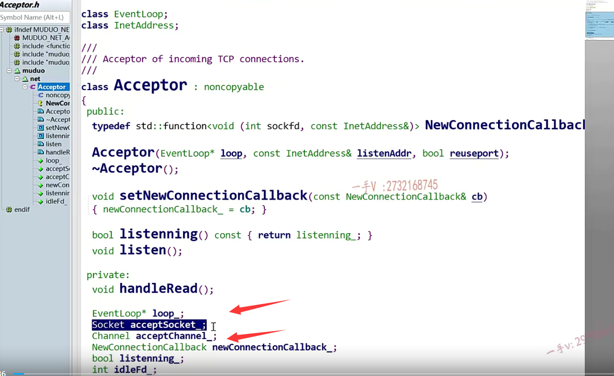

它本质上底层是不是也得是一个listen fd啊？

这个listen fd它也得放在一个poller上。是不是来监听这个listen fd上有没有新用户的连接呀？

所以呢，这里边也有个实际上这个channel，大家知道这个channel之前写了。

它打包的就是一个fd跟他fd感兴趣的事件，以及一个revents嘛，

就是最终poller给他这个channel返回的发生的这个事件对吧？

实际上这个channel呢？里边的这个打包的这个fd就是上边这个fd ，okay吧。

你看这里边还有个eventloop。

谁来帮忙监听这个listen fd的事件了嘛，你就得通过这个loop嘛，

实际上我们把acceptor输出完，以后呢我们，紧接着下来啊，在逻辑意义上，有关联的就是输出TCP server，

大家会看到啊TCP server直接是把用户定义那个base loop。直接就扔给了acceptor也就是说acceptor是运行在哪个loop里边的，

acceptor是运行在这个main loop里边的。好吧啊，是运行在Main loop里边儿，

之前我们在写这个event loop thread的时候嘛。

我们是不是写过一个getnextloop啊？这就是被诉用户定义的那个eventloop。

如果我们没有去创建过这个任何的这个线程的话呢，那也就是说只有主线程啊。

他拿到新用户的连接。它也是放到base poll的，

因为这个空的话呢，直接跳过来。

他get next loop返回的，是不是还是base loop啊？

如果呢，它有sub loop的话呢，在这里边通过轮询就会找一个sub loop给它返回的。啊，

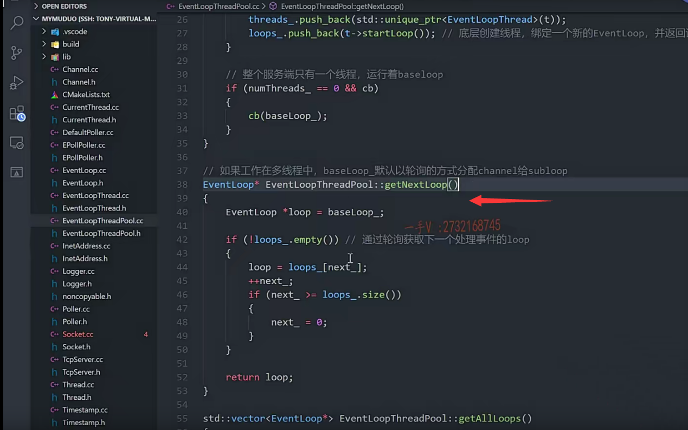

现在呢？我们把各个组件呢？就是一部分的零件呢？

都已经慢慢的就全部造好了啊，我们现在似乎也能够看到啊零件跟零件之间到底是怎么装在一块的？对吧啊？

那即将完成啊，即将完成。

大家呢？把之前写的这些组件呢啊，

如果呢你？不是太熟悉的话呢，我希望呢，也是大家一行一行手码的，对吧？

我回过头去呢，再去熟悉熟悉啊，把各个组件呢小零件儿。

给它整明白了，然后呢啊，我们把它很快的，我们就会把它凑到一块，

我们来窥视一下它整个的这个运行流程啊，

那今天这节课我们就着眼于这个acceptor。

# Acceptor类实现

那么大家来给我看一下acceptor主要的这个成员变量，

就是它所属的这个loop。

没人说这就是main loop base loop，对吧？

它管理的就是一个listen fd。封装成这个socketaccept socket。

那这个listen fd也是需要一个poller来监听它的，这个读写事件的，对吧？

呃，主要是读事件啊。

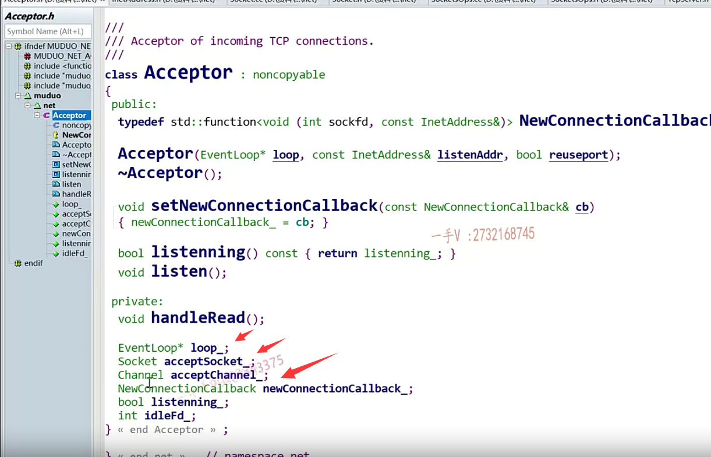

==那poller操作的这个单位是channel嘛，所以他要把这个listen fd就是accept socket，然后打包成一个什么？打包成一个channel，是不是才能扔给poller啊？==

## acceptor的工作逻辑

那么如果说。acceptor给你返回一个connection fd，

也就是说呢，有一个客户端怎么样？有一个客户端连接成功了，

连接成功了以后。一个客户端connect success连接成功了，

我们是不是接下来？就应该干什么

### Tcpserver怎么做

TCP server接下来应该干什么？

哎，应该呢，在这里边通过轮询。是不是选择一个？唤醒并把main loop里边。

在这里边刚拿到的这个connect fd，给它打包成一个channel。是不是扔给这个sub loop啊？

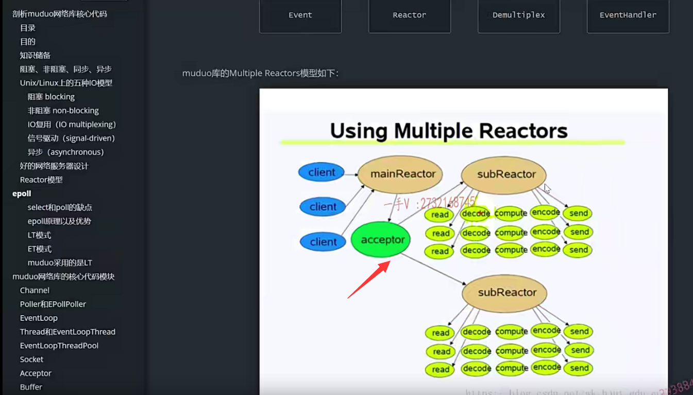

### new connection call back（）回调函数做的事

那我们刚才说的这几件事情，总得有一个函数来做。

看，这就是new connection call back的意思。

从这名字我们能看出来，new connection来了一条新连接的回调。

来了一条新连接的回调，

==你做什么事情呢？不就是做的事情。==

==就是把它呢进行一个打包。fd打包成一个什么啊channel对吧？==

==打包成这个channel以后呢？再把它再通过呢get next loop唤醒一个sub loop，==

==然后呢，再把这个channel。分发给相应的，是不是loop啊？==

==去监听已连接用户的channel的读写事件了，对不对？==

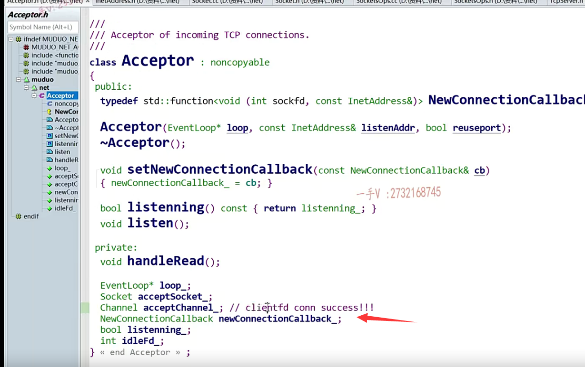

这是listening是否一个控制变量啊？

这是lfd我们用不着。

# Acceptor

好，那我们把acceptor呢来输出一下。定一个acceptor点h。还有一个accept or点CC。prag MA once 

class accept or.public.private.

好，大家注意跟我往这看也是呢，需要包含啊，

首先是non copy able啊。这里边需要前置声明event loop还有m at.address.

继承这个non copy able。

## 成员变量

先写成员变量。

首先是一个event loop。我们给大家注释一下啊，

accept or用的就是用户定义的base loop也称作main loop在reactor模型上对吧？

然后呢？就是这个socket。

我们socket呢，是定义变量的，所以得需要知道socket的详细信息，这里边呢，就不能前置声明是不能解决问题的。需要包含相应的头文件啊。accept socket.

然后是一个channel，channel也是定义非指针引用变量，需要知道变量的大小，那你得包含相应的头文件了。channel accept.channel

还有一个new connection call back。

我们用using来定义这个类型啊new。connection.call back.new connection call back啊。

这是函数对象类型啊。

包含相应的头文件。functional.function.返回值是void。有一个什么？socket fd.还有一个inet address。

okay.我们用这个类型定一个啥东西啊？

new connection call back.

bool 值 listening.很讲究啊，这个后边的这个字母。这个要重写一个啊。

好，这个。不说了。

## 成员函数

### 构造函数 析构函数

首先是它的什么呀？acceptor构造函数。

需要你给我传一个这个event loop。

然后第二个就是inet address. listen addr.   reuse port.

==这个的muduo库，这个参数是默认是从这个你看这三个参数本身也是TCP server的三个参数，对吧？==

这个默认是true啊，都是默认可以传进来的。

这是析构。

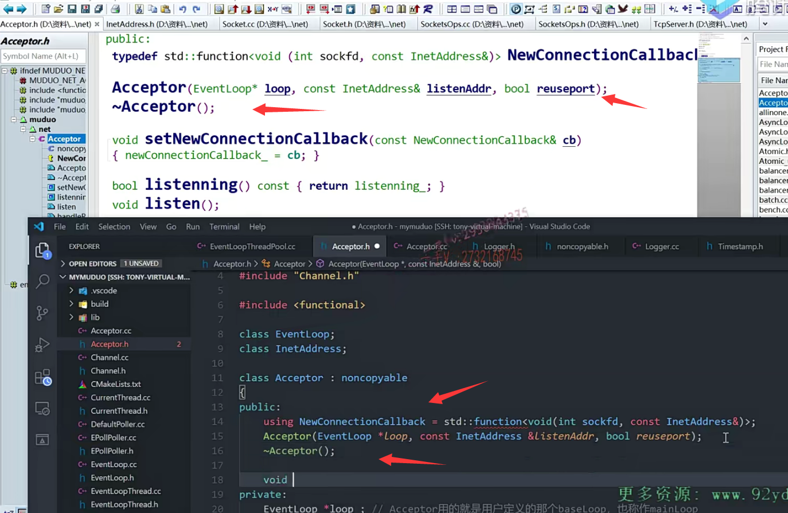

### set new connection call back（）

这是它的set new connection call back.const cb.这是直接实现了是吧？这个是直接实现了啊。

new connection callback=cb.所以有时候就是说呢，

这个作者本身呢，也没有过多的进行讲究，他在其他类的时候呢，去给function这种函数对象去做赋值的时候呢，还用的是右值引用的这个赋值对吧啊这个？加了sdd move，

所以这里边还有没加啊？我大家可以加上。

==这里可以加上右值引用 std::move()==

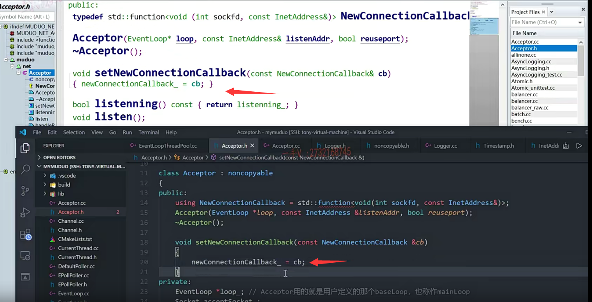

### listenning()

布尔值listening。return把这个控制变量呢，给它返回一下啊。

listen().

这有一个handle read()啊。

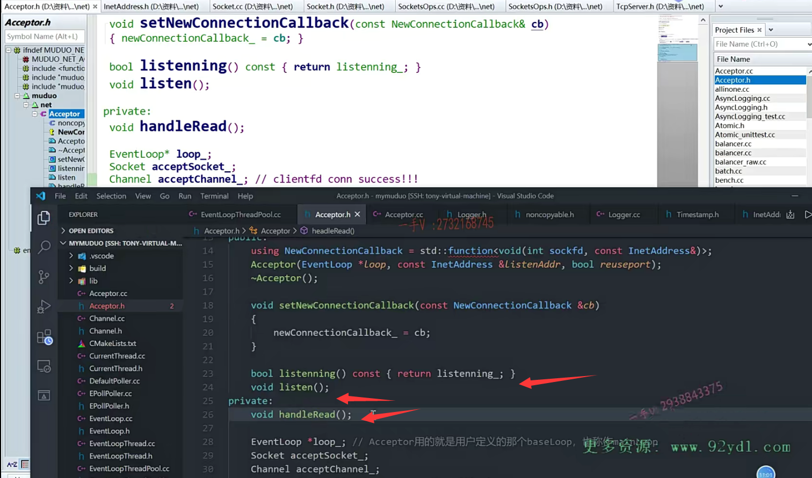

好，那么接下来我们主要实现的就是它的构造，析构，listen以及handle rate。han.

希望大家接下来的时间打起12分精神，跟我好好的去看一下这几个函数的这个实现好吧，

非常的重要啊，非常的重要。

也是基本上也是到核心理解，这个Main reactor Main loop所做的这个事情了。

虽然我们因为没有实现了TCP server啊，没有在这里边起这个做这个分发轮询的这个逻辑对吧？

但是呢，acceptor本身做的事情呢，在这里边我们可以看他的这个详细的这个逻辑了啊。

我把这个代码呢？拷贝到相应的CC原代码文件当中。

acceptor先把类的作用域我们那个不用了啊。这个不用了。

好，大家来跟我看一下。

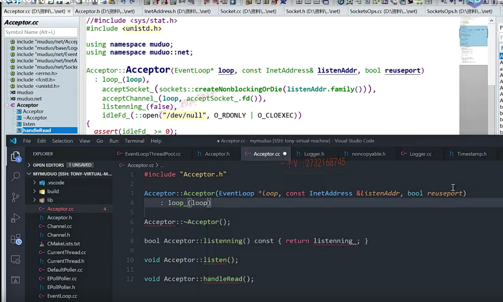

## 构造函数的实现

首先呢，accept的构造函数做的事情呢？

第一件事情来。跟我来看啊，跟我来看。

第一件事情就是对于他的这个成员变量loop进行一个初始化，这没得说，是不是啊？

有了loop才能访问它这个loop里边的poller啊。

有了poller，才能把当前acceptor的这个channel是不是扔给poller，

让poller来监听它上面的这个listenfd的这个事件，有没有新用户连接对吧？

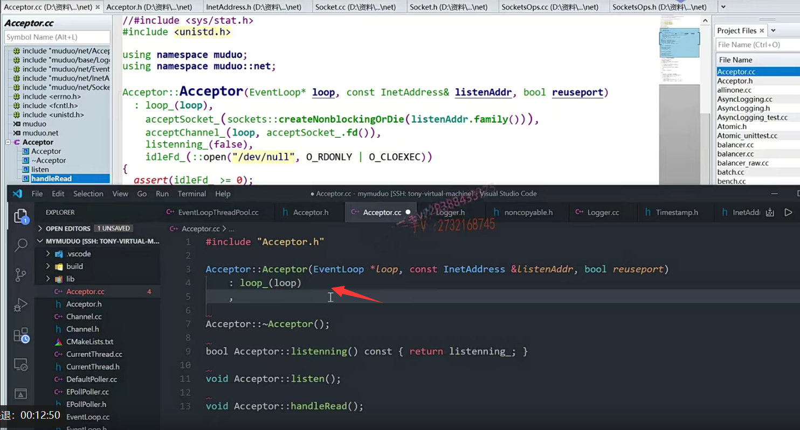

然后呢，就是对于accept socket的这么一个创建啦。对不对？

你看它的这个socket构造函数，

我们上节课刚写了，它需要的就是一个fd。

对吧啊，他需要的就是一个fd，那么在这里边accept or给的就是什么，这创建的就是这个listen fd。

它有一个create Non blockingOrDie。这是什么意思呢？

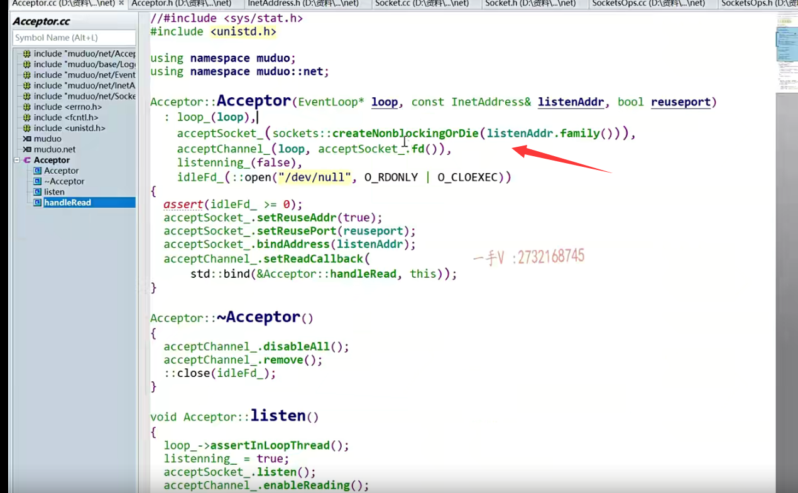

又是在这里边封装了一下啊。

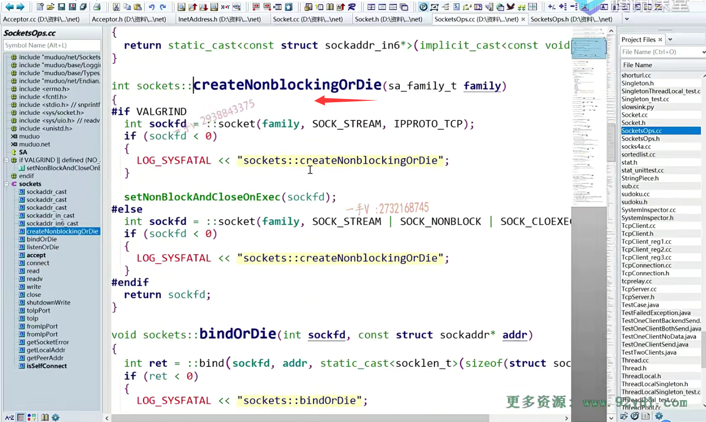

那么大家来跟我看一下它的这个实现。

那我们就直接把它写在这个函数里边了。

#### 复习static修饰作用

写成全局的了啊。

==为了防止呢跟其他文件里边定义相同的重名的函数而产生的名字重复定义，

我这里边把它定义成一个static的。==

叫做createnonblocking.从这名字也能看到，它需要创建一个非阻塞的IO啊？

诶，好在这里边呢。

我们创建的就是IPV 4地址家族的，所以参数我们就不用传了啊。

socket我们看一下它加了这么一个标记。

我们看一下这个socket。man socket。

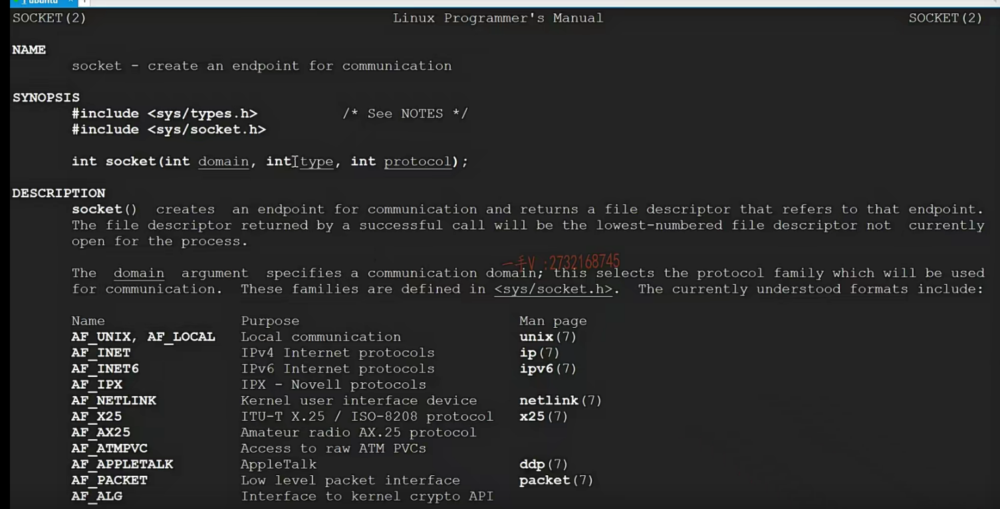

那么，socket第二个tap啊？大家来往这看一下啊。

sense linux 26点二七从Linux内核26点二七以后呢？the type argument就是socket的第二个参数啊tap。the tab argument serves a second purpose，就

是呢，它提供了另外一个意图，另外一种服务。in addition to specifying a socket tap。

就是呢，可以去指定呢，一个socket的这个类型啊it May include the bitwise or of any。of the following values，

你可以用这个逻辑的这个或啊来把这个选项带上啊to modify the behavior of sort。

来更改呢，所有的这个函数的这个行为啊，

==就是你可以在创建所有的同时呢，用这个逻辑或来直接设置呢，创建的这个所有的是一个nonblock。非阻塞。==

啊，而且还是close exec的啊，这个标志选项大家有一定的这个学过fork的话呢，应该都会知道这个选项对吧？

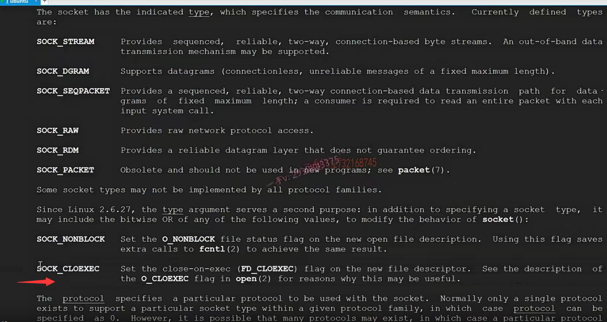

==这个选项就意思是子进程嘛，会会继承父进程所有的打开的fd的嘛，对吧？==

==这个相当于标志了这个选项的这个fd啊，在子进程里边默认是关闭的，没有打开嘛啊。==

好，我们最主要关注的就是这个non block，所以在这里边非常简单啊，

是int sock。sock fd等于。哎呀，那在这里边，我们得需要包含人家的什么啦？相应的头文件了是吧？

OK，也是这两个头文件，我们得include上啊。

不大写啊，socket第一个参数是。第一个参数,地址家族是不是

第二个呢是？tap啊，在这里边我们。就来看这个了。

sock stream是一个TCP的套接字。然后呢，用逻辑或啊是socknonblock是一个非阻塞IO。

再把这个选项也都加上。对不对？

还有没有呢？啊，这个实际上传。实际上呢，这个不不写也行，写成零也可以，对吧？写成零也可以啊，

因为第二个参数写的话，这儿默认就是这个选项啊。

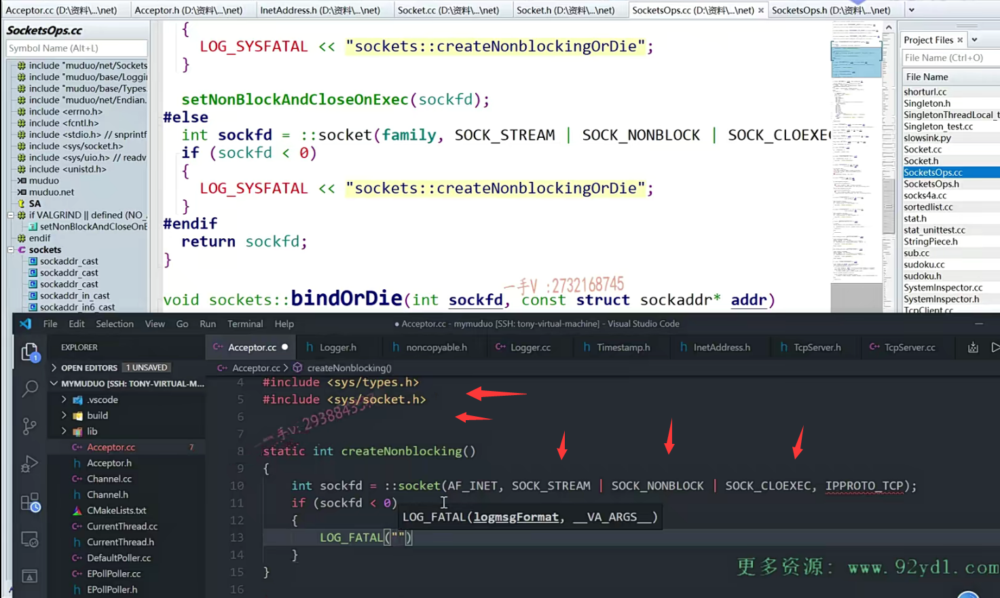

### 完善日志的打印

同样的需要包含我们的log日志。

项目线上运行，最重要的就是日志了啊，

这个内存fd都没有创建成功，那你就别玩了。

小于零的话，那这里边日志级别就直接是log什么了fatal了啊？

在这里边呢，大家。有些同学在打印的时候呢嗯，发现了自己写的代码出错了，

出错的话呢嗯，然后呢又不知道呢是哪里打印的，因为他打印比较多啊。

实际上，打印的话，大家在这里边可以打印一些，==因为我们编辑器都有一些默认的这个什么呀。默认的这个宏嘛，对吧啊？==

大家来看啊。你可以打印的，非常非常详细的啊。socket.listen socket.create error.

==好吧，你还是甚至可以把error number你也打印上啊。==

==我们包含相应的头文件。==

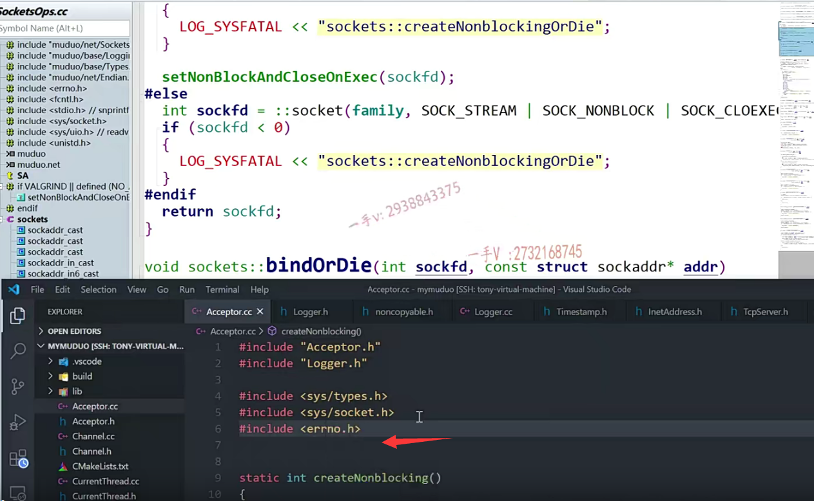

就是每一个项目都有每个项目日志打印的，这个严格的这个格式啊。

那么，第一个百分之s是什么呢？你就可以把。用编辑器的宏 __ FILE __。

这到时候可以打印出来呢，

我们当前文件的文件名。CF点CC。是不是？这个可以打印出来什么function？啊，

还可以打印出来函数名哪个函数出错了，对吧？

这还可以打印出来什么行数？

到时候呢，真的是这儿出错的话，这儿就会打印出来accept or点CC。

然后create non blocking。然后第14行唉，

这样的日志呢？那找取错误，那就非常方便了，对吧啊？非常方便了，在这儿呢，我们再打印一下l number。到底是什么样的错误呢？

对吧啊，好了，那这我就介绍完了啊。好，那这块儿呢就是。介绍完了，

介绍完了以后呢？我们直接可以把这个函数呢调用一下。它的返回值直接就给了我们的accept socket。

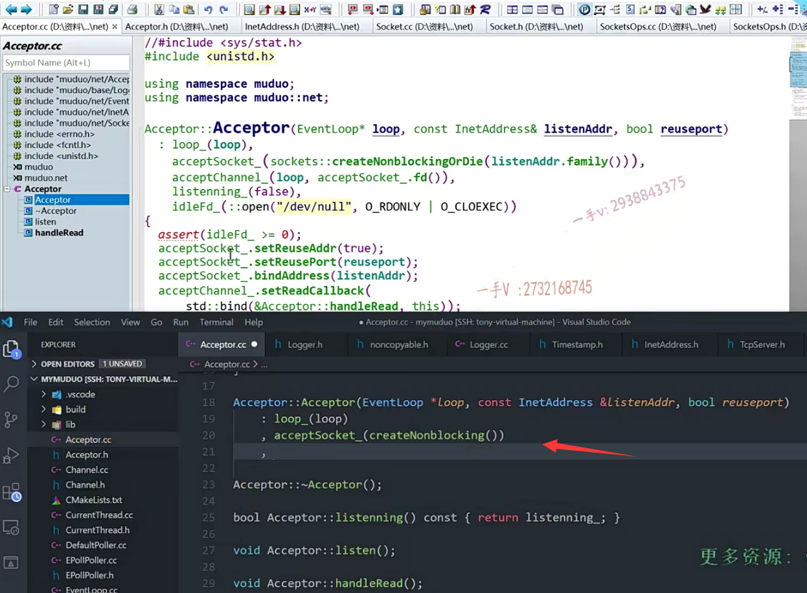

接着呢，就是accept channel。

accept channel，大家还记得没？

这是我们最开始写的这个模块，它的构造需要什么呢？

它的构造需要一个loop，需要一个fd，对吧？

好，那我们需要一个loop，那就是当前的这个loop嘛？

好吧，还有什么呢？还有就是accept socket点fd。

就是我们刚才创建的这个listen fd嘛。

被这个accept socket，这个socket对象是不是封装起来了？它提供有方法fd返回它底层封装的fd啊。

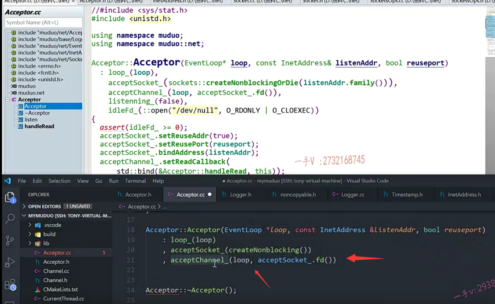

### 复习channel为什么要依赖一个loop

channel为什么要依赖一个loop？大家还记着没？

唉，因为channel需要把自己往poller上不断的注册或者是修改对吧？

而channel又是无法直接访问poller的啊，

loop底下管理了poller跟一系列的channel。

啊，所以呢？channel跟poller进行通信的时候都是通过请求它本线程的这个loop来跟poller呢进行通信的。这个不要忘啊。

好listening。刚开始呢，是个什么FALSE对吧？好了，

那么在这。注意一下。

set reuse are use a ddr设置成true，更改了一些TCP的选项啊，

accept socket还有。set reuse port也是true啊，accept socket。

还然后呢？开始绑定。唉，绑定listen addr。

这是不是相当于就是在创建一个套接字了？这相当于就是什么绑定这个套接字了？对不对啊？然后呢？

### 后面需要实现TCP server的start()

大家来看啊。这个完成以后。

我们TCP server还没写，

TCP server，到时候呢，你还记着没有？

我们是不是会调用这个TCP server的什么方法呢？

它的这个start的方法呢？这个start的话呢？

最后呢？就会去启动呢？我们当前这个acceptor的这个listen，acceptor listen呢？

我们在我们在后边后边，我们一会要实现对吧啊？

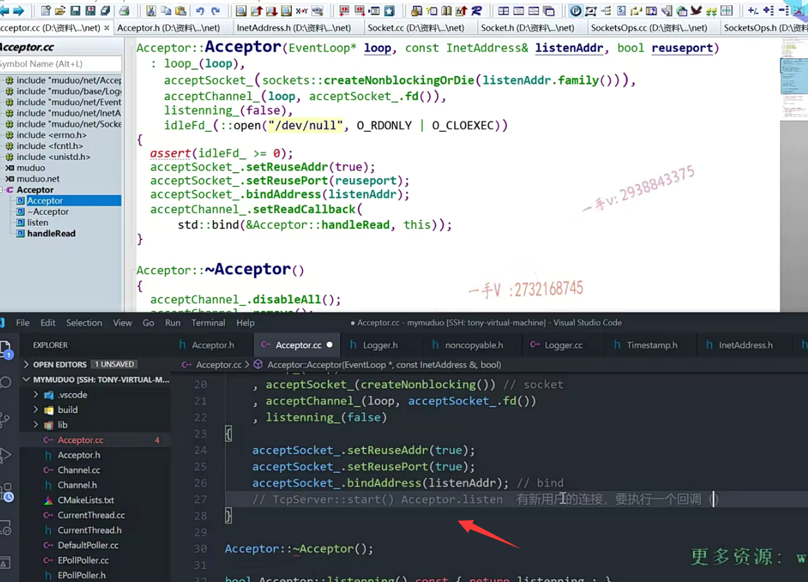

### 我们需要执行一个回调    的逻辑

那么你注意一下啊，各位注意一下。

那也就是说，假设我们现在这个acceptor已经运行起来了，

如果有新用户的连接，我们说呢？他是不是要执行一个回调，

在这个回调里边呢，就是把这个connect fd，就是跟客户端跟服务器连接用的fd给它打包成这个channel。

打包成channel以后呢？是不是还要去唤醒什么啊？

唤醒一个sub loop。

然后把这个channel给到这个sub loop，

由这个sub loop呢来负责后续的监听，这个channel的也就是对应一个客户端的读写事件啊。

对吧啊，所以呢，当我们acceptor去响应一个新用户连接的时候，

他需要一个回调。你看接下来这个。就是在绑定回调。

accept channel，因为最终我们会把这个channel扔给这个poller，是不是去监听啊？

set read call back.STD.半。办的谁呢？ACC eept.handle read.啊，

### 再理一遍 baseloop监听到fd有事件发生后处理的逻辑

那我知道了，到时候呢，这个base loop呀。

监听到啊。这个accept channel也就是listen fd 有事件发生的话呢？

唉，这个channel监听某一个channel有事件发生的话，

如果是读事件的话，你看在这里边是不是就会调用一个read call back呀？

啊，那在这里边，我们事先给他注册的这个 read call back

就是accept handle read函数。

注意，这就是一个回调函数的应用，对吧？

我们在事件在listen fd还没有发生事件的时候呢，我们就给他预先注册一个。

事件回调对吧？

当真真正正类似fd上有客户端连接的话呢？

那么，底层就是反应堆，会帮我们去调用这里边这个回调。

okay吧啊，反应堆调用回调嘛，调用event对应的事件处理器是不是啊？

所有的这个事件event打包fd event是channel啊，在我们poller上注册的时候呢，都会携带相应的，是不是回调啊？

唉，当poller通知channel，你有相应的事件发生的话，channel就会去执行你事先给他相应事件，相应fd事件注册的回应。

对吧，在这里边非常重要啊，非常重要。

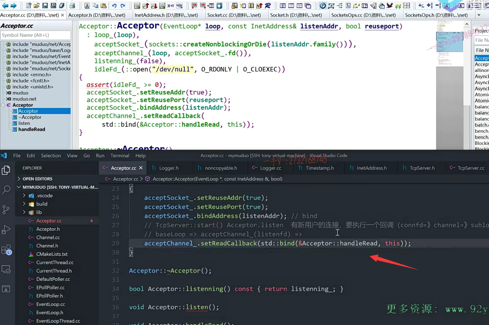

那么，我们不如在这里边就直接跳到这个handle read，

我们来看一看。

那么，大家现在知道了handleread什么时候执行吧？

就是在channel的这个收到这个读事件的时候，

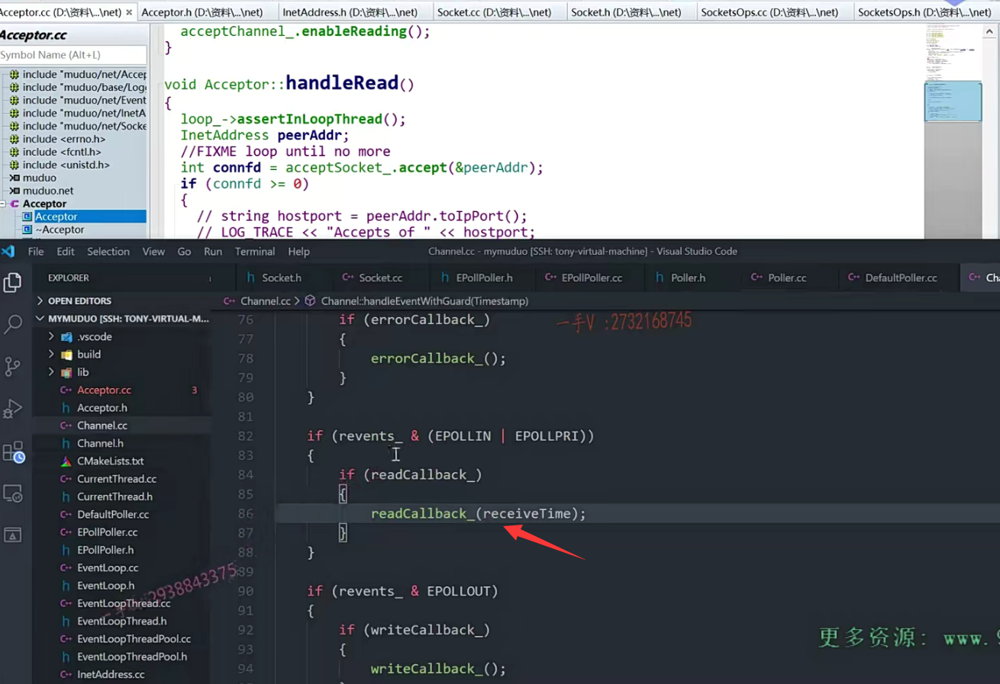

哪个socket的读事件呢？

listen fd有事件发生了，什么事件呢？就是有新用户连接了。

我说的刚才说的这一段描述，如果你能够明白的话呢？

基本上啊muduo库的这个。核心的这个reactor模型你也就明白，

它涉及的这几个相关的类啊，好大家来看啊，

首先呢，在这里边inet address。这peeraddress指的是谁啊？客户端嘛。

客户端连接来了，是不是int connectfd=acceptsocket？

嗯，调用它的什么方法呀？accept accept方法，

我们刚写过吧？写过了，peeraddr。

它的所有的方法呢，通过返回值返回呢，通信用的这个connfd。是不是？

而且通过输出参数呢，返回了客户端通信的这个IP地址跟端口号啊。

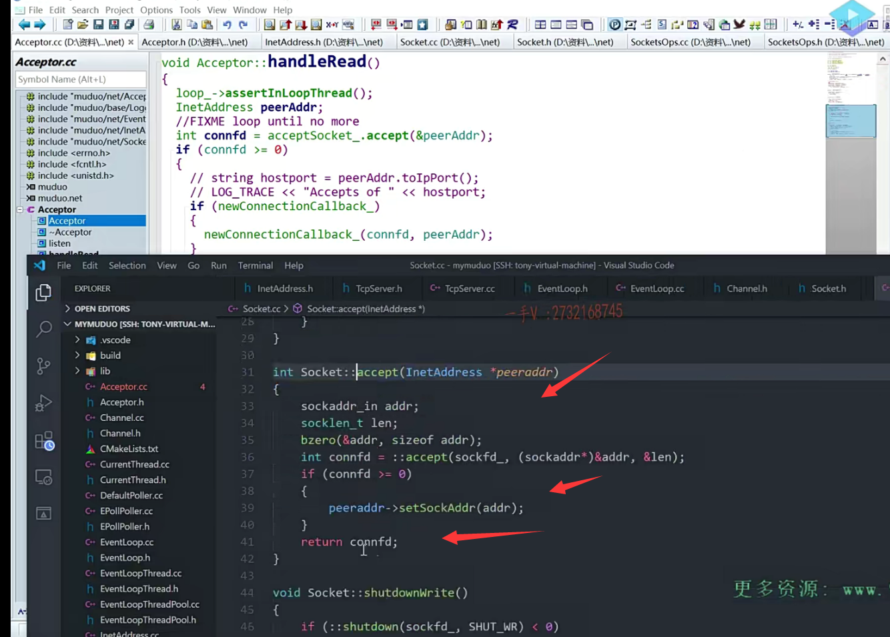

具体的回调是由TCPserver给到的

好在这里边connect fd如果大于等于零。干嘛呢？就执行回调了。

是不是执行回调了？哎，执行回调。

其实，执行回调就是我们刚才给大家说的，在这里边做的这些事情啊，

但是这个具体的回调呢，是由谁来给到的？是由TCP server来给到的，

而我们呢？还没有，怎么样啊？我们还没有写到呢，对吧？

我们知道这个new connection call back，就是有一个新连接来了，需要做什么事情呢？对不对啊？做什么事情能做什么事情吗？

那是通过轮巡嘛，唤醒一个sub loop呢，进行channel的分发嘛，对吧？

==这个是由TCP server给的啊，==

==我们accept这里边直接负责执行就可以了。==

如果这个call back有。你看这个就是新用户连接的这个connection fd。这个就是谁，这个就是客户端的IP地址端口号。

对吧，如果呢，有一新用户连接来了，你却没有相应的回调，那就证明呢，这个客户端根本是不是就没有办法去服务啊，

所以在这直接做什么事情啊？直接给close了。他就是这么任性啊。

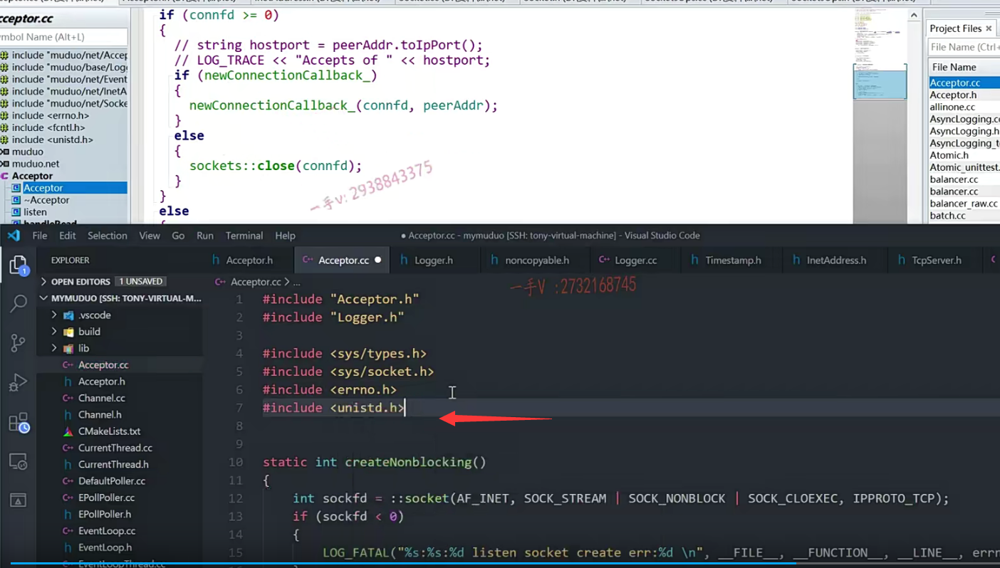

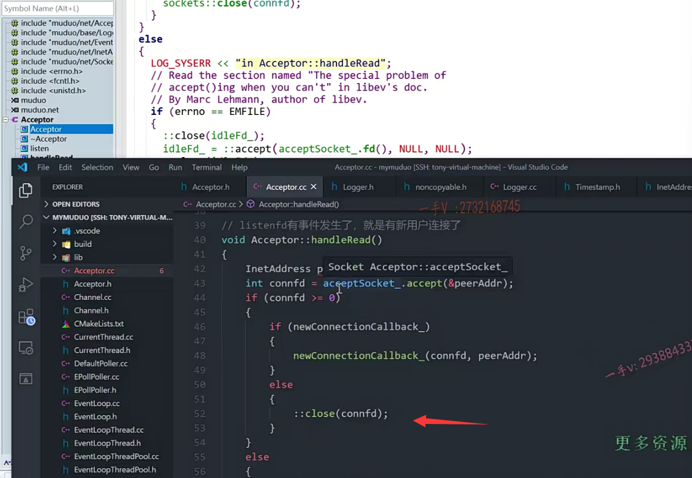

### accept出现错误，可能是fd文件描述符上限了

实际上，这里边儿的new connection call back不可能不赋值的啊，

不可能不赋值的，这里边儿else呢，就是出错了啊。出错的话呢，

我们在这儿呢，把这个日志呢？先打一下，这是一个error级别的日志。

是accept。accept error.

这个判断了一下啊，大家可以去man一下这个accept。

你会发现它对于返回值的这个说明啊，这个应该是。

它对于返回值的这个说明。the process limit on the number of the open field descriptors has been reached，

就是说呢，process就是当前进程啊，资源的限制。

the number of the open disk就是对于当前进程资源的限制。

什么资源呢？可以打开的文件，描述的上限has been reached，已经达到了。也就是说，当前进程没有可用的fd，再怎么样再分配了对吧？

因为大家都知道系统呢，给我们管理进程的时候，每一个进程可用的资源呢，

都是有限的。

是不是这里边呢？每一次有一个新用户连接的话，都会给返回一个，专门跟这个客户端通信用的，这个connection fd。

是不是啊？资源用完了。在这里边呢 fail。单独处理了一下啊。

#### 怎么样去处理fd上限

在这我们可以也是怎么样啊？这里边处理的这个原因，我们就不深究了，不同的这个服务器在这里边，

对于这种错误呢处理呢，是有不同的这个方式的啊。

像这里边处理的方式呢，就没有去适配这种错误来提供更多的客户端的这个连接啊。

实际上在这儿呢，如果真的发现这种错误的话，一种方式是调整一下当前进程怎么样，当前进程的这个文件描述符的是不是上限啊？

对另外的话，也就是说呢，就意味着如果日志上出现这种情况，意味着就是单台服务器已经不足以怎么样啊？

不足以支撑啊，我们现有的这个流量了，对吧？

==我们得进行集群或者分布式部署了。OK吧啊。==

这个是accept呃。sock fd.这个reached  limit.啊reached limit。

好吧，那既然已经是这个错误了，我们就不用去打印error number了。

没问题吧？这里边我们输出一个错误打印就行了。

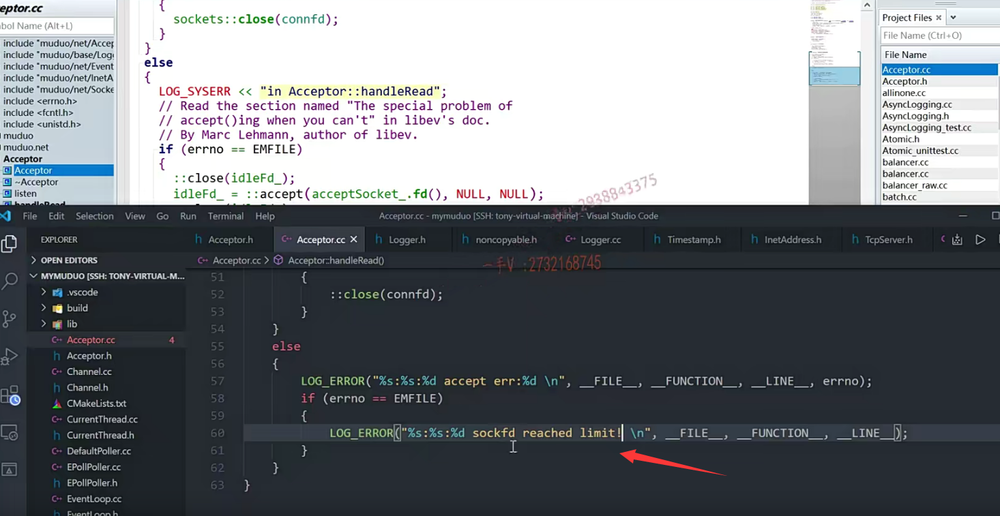

## 析构函数的实现

好，那在这里边，我们接着把剩下的写完啊。acceptor析构？

那就是把accept channel disable all disable all

相当于就是这里边，

==相当于我们之前写的就是把channel从当前这个里边的这个poller里边全部给清除掉，对吧啊？==

清除掉就是不再去像poller里边注册它的这个读写事件了。

==然后再把自己本身从poller里边怎么样删除掉，对吧？==

然后在connfd这个fd我们没有用它，所以呢，我们只需要处理这两件事情就可以了。

好的吧。

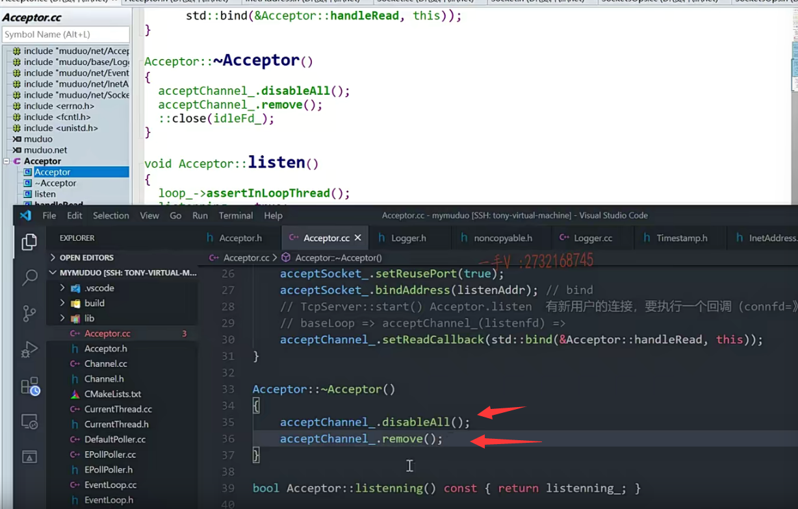

listen也很好处理吧，这个listen是做什么事情呢？listening等于true。

开始监听了是吧？

然后是调用的accept socket启动，它这个listen监听，

你看这有。创建socket。band，这里边是不是？

有这个listen啦，listen了以后呢？怎么listen呢？

你要把。你怎么样？

enable reading.就是要把这个accept channel呢？要注册到这个poller里边啊？

是不是才能帮你去？监听是否有事件发生，对吧？

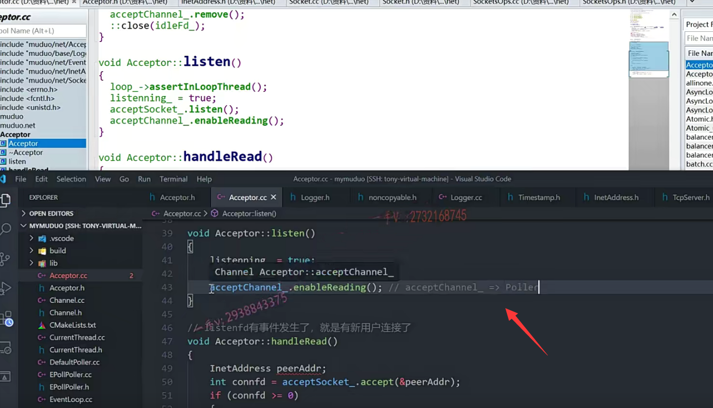

如果呢？有事件发生的话呢？怎么做啊？唉，就会呢。channel就会调用事先给它注册的这个read call back，我们事先给它注册的就是read call back就是这个函数。就执行到这。

执行到这了，以后拿到了这个新用户连接的这个fd以及客户端的这个IP地址端口直接呢，执行一个回调。

好吧啊，这个回调里边做的事情就是什么事情呢？

轮询找到sub loop.唤醒分发当前的新客户端的是不是channel啊？

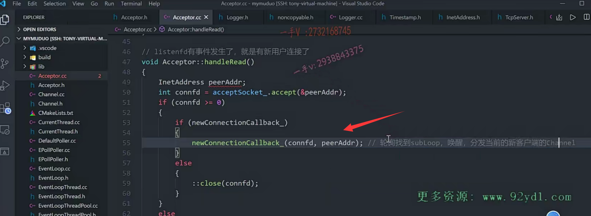

## 总结

做的事情就这些事情嘛，我们到时候接下来再去写TCP server的时候，我们就能看到了代码上印证我们这个思路的，这个具体的逻辑实现的地方了。

好吧啊OK，那么到这里边呢？

我们accept也就实现完了，对于accept这几个函数虽然不多。

但是它的这个逻辑呢，是非常重要的，希望大家呢，把我这节课所强调的acceptor我们需要理解的东西呢。好好的再去思考思考。好不好啊？

你平时呢？想的越多啊，这个muduo库的这个代码是非常好的，

对吧啊？one loop pro thread的这个reactor模型的这个网络服务器的设计在muduo库里边已经体现了这个非常完美了。

啊，你不要贪多对不对？

然后我把lib event lib event我都分析一下，你分析来分析去都是一个reactor模型的，这个网络服务器。是不是啊？

只不过他们实现的这个具体的细节上有一些差别。

看多了就精不了，好好的去把它思考一下，把每一句代码逻辑呢去想一想，把每一个小螺丝钉组件之间的关系呢，也想一想我们已经写过了。OK吧啊，

### 先做TCP server的原因

==那下节课呢，我们就着重的来给大家推出这个TCP server的具体实现了。==

唉，有的同学说呢，你的这个TCP connection还没实现呢吗？

我们先不着急TCP connection，我们先把TCP server，

因为我们已经现在在这里边，相当于在这里边全部实现完了，对吧？

==那谁来帮我们把这个mainloop跟subloop之间给它串起来呢，对不对？==

就我们刚说的啊。

==通过轮巡找到这个subloop在进行唤醒，再进行分发新用户的这个channel，==

==这都由谁来帮我们去做的这些事情呢？都是由TCP server。来做的OK吧啊？==

那么，唤醒我们也实现了这个分发，我们也实现了，对吧？

就是缺少一个人总体的进行一个调度，那么TCP server就是我们总体的这么一个调度官啊。呃，调度器可以这样说。

好吧，当我们把TCP server说完了以后呢？

我们最后呢，再来实现一下TCP connection，它又是一个什么样的角色呢？

我们在后边儿。再一一给大家介绍，

希望大家通过这节课的学习，把acceptor多想一想，

然后把代码呢，也自己输出一下。

okay，我尝试呢，先去编译一下啊。

应该是。没有编译到对吧啊？应该是没有编译到那么大家也可以编译一下啊，

编译完了以后有什么错误的话呢？跟着错误去修改。

把错误跟warning警告都给它处理完了啊。好，那我们这节课的内容就说到这里，下节课我们再继续。