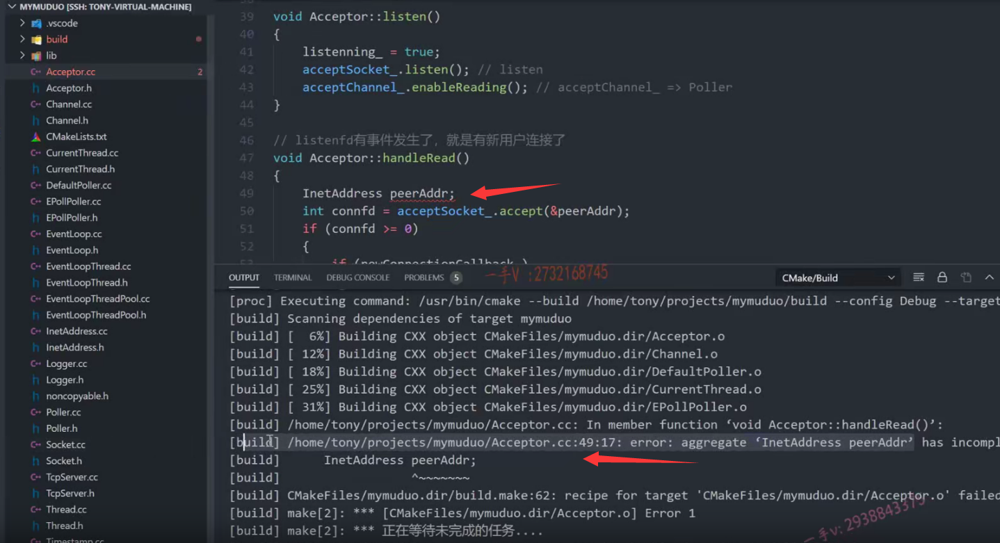
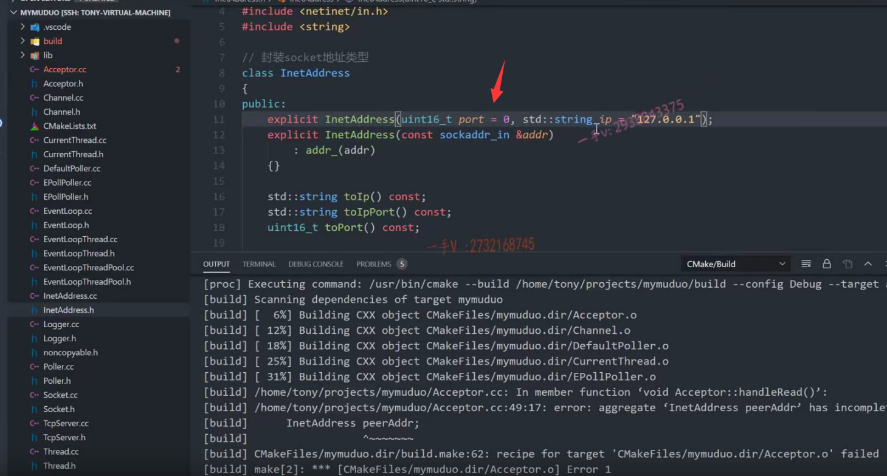
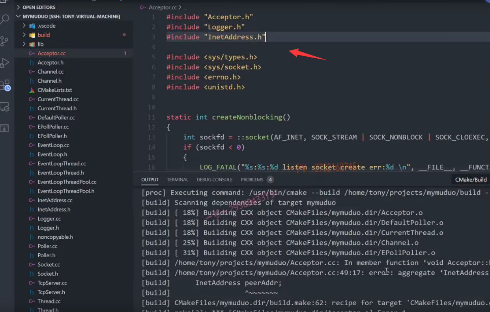
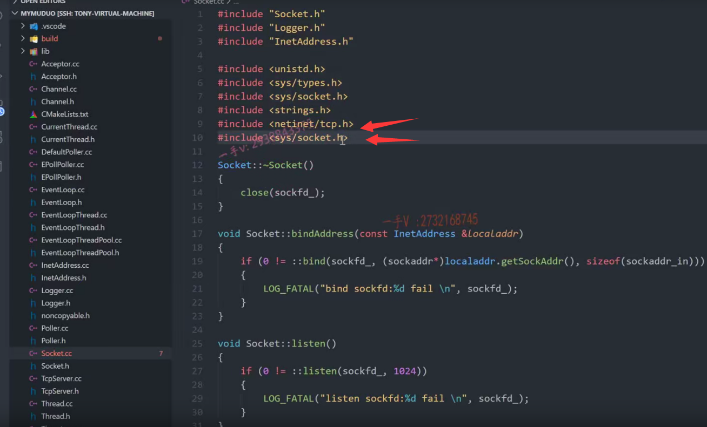
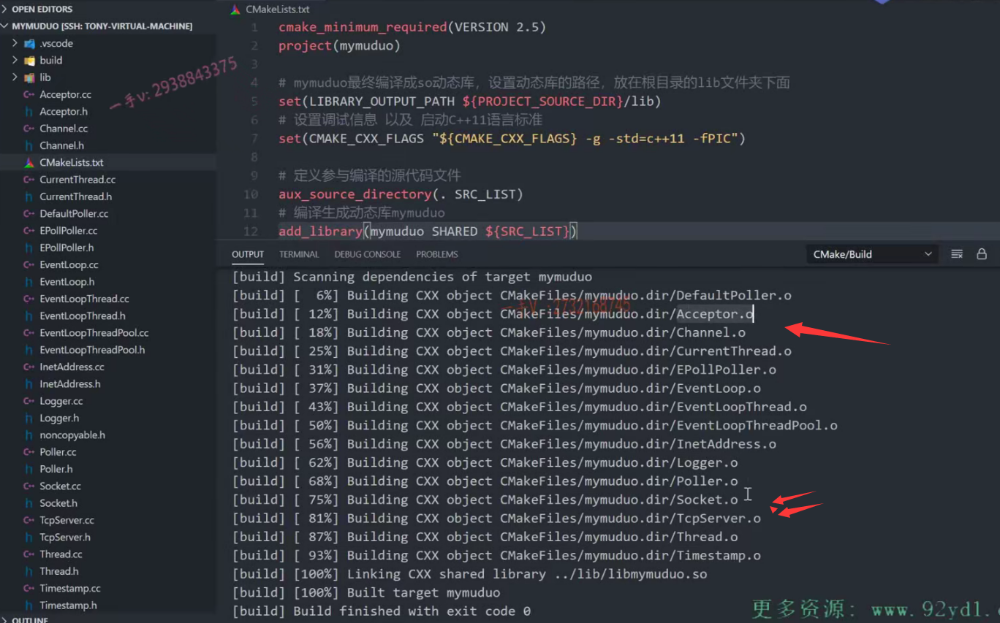

这节课给大家说一下，这个我的项目的编译啊，

这个我们很多次呢，在编译的时候我发现我们新增加的文件，

在编译的时候cmake并没有编译进去啊。

呃，实际上不是这样的啊，我这个环境的这个问题啊，

我发现呢，我们在建这个工程的时候呢，我可能更改了一些配置，

导致呢在编写代码的时候，代码帮助呢，也不能够及时的去补上，对吧？

这个我们在新写一些文件的时候呢，我们发现了并没有编译啊，并没有编译。

那是因为cm ake呢，没有去识别到新文件的增加，

==那么大家可以在这儿呢刷新一下啊，刷新一下。==

呃，如果你没有问题的话，你应你的这个环境应该是可以直接编译的啊，

或者说是你把这个VS code关闭了，重新打开一下，或者你在这儿刷新一下啊。

就像我们这个上节课呢，写完这个accept or以后我们编译发现没问题，

是因为没有编译acceptor点o文件，对吧？

刷新一下啊，我们重新去编。

### 不识别就填0

重新编译修改错误

重新编以后发现还是有错误的，对吧？

我们把这个错误一一来改一下啊。

CC第12行啊。这个我们不识别，我们写上零就行了，这个不需要填啊。

### 没有提供默认构造，因为默认值没有给上

看还有没有其他错误？还有这个啊，

第49行。第49行，我们来看看这是什么错误呢？

这是。has incomplete complete tab and can't be defined.

我们来看看是不是因为它没有默认的构造呢？Inetaddress在这里边呢，

他果然是什么啊？果然是没有默认的，是不是构造啊？

在这里边，我们给呢(port)，我们也加一个零吧好吧，这样它就可以默认构造起来了。

因为在这里边，我们也不需要给它传值，我们也不知道传什么值呢？

是不是我们是通过这个输出参数啊？这个函数的输出参数来给peeraddress来。写直了啊。再进行一个编译。

### 没有完整的类型，原来是没有包含头文件

嗯，还是这个是吧？

哦。那我们是不是这样的错误啊？

没有包含inetaddess的什么啊？头文件对吧？

所以它有一个incompletable tab，

应该是我们在这里边只有一个什么类型的前置声明，对吧？

啊，好了，我们现在再去编一下。

还有错误啊。OK，我们终于到这个错误了。

TCP no delay was no declared啊，

这里边儿是这些标志呢，都怎么样啊？这些标志全部都是无法识别的，对吧？

在这啊。那就还是相应的这个头文件我们没有包含。

是不是？

我们来看一看啊。这个头文件应该是在哪里呢？

我们再man一下这个函数啊，看看这个上面好像也没有跟我们说明是吧？

应该是像这些常用的这个类型的头文件，大家应该是在TCP.h里边儿啊net and net tc ph里边儿。诶，可以找到是吧？那可以找到。

### 原来是拼错了，不是SQL,而是SOL

然后在一起回想一下这个sol socket，这个是在哪个头文件里边来着呢？

这个应该是在。嗯，看一下啊neti net里边有没有？socket没有socket啊，这是在哪个socket点h是在哪个头文件当中来着？应该是在。诶，系统。这个sis system啊，socket点h里边儿。写错了，不是circle啊，是sol。

对吧啊，我们写错了啊，写错了。拼错了。

### 所有文件都编译成功了

好在这里边重新去编一下整个项目的这个代码。

好了，现在是编译全部成功了！

accept点o socket点o我们。最近写的这两个文件呢，就都被编译上了，

应该是我们现在啊，整个项目所有的原文件都被编译上了。

对吧啊OK，大家注意一下，我这节课强调的我们项目编译的这么一些问题，

如果你遇到了相同的问题。

希望你进行跟我一样进行相应的处理一下，好这节课的这个项目编译的问题就说到这里。