上几节课呢，我们把socket还有acceptor。给大家呢说了。啊

也就是说呢，我们现在再来去学习TCP server的时候啊。

基本上，==90%的内容呢，我们就都实现了，唯独就剩了一个TCP connection。==

啊，我们说呢，这个TCP connection我们放到后边。

我们为什么现在急于先把TCP server就是使用muduo库的时候，对外应用的这么一个提供的这么一个类啊？

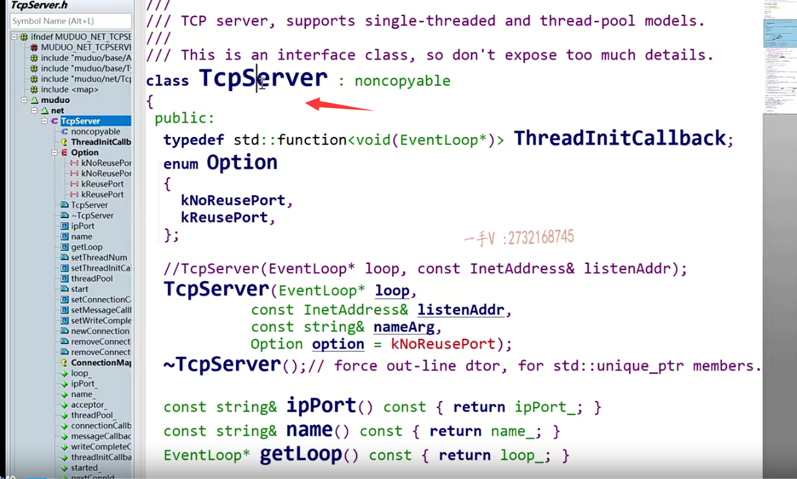

就是我们在使用muduo库呢，再去编写一个服务器程序的时候用的就是一个TCP server，对吧？

那么为什么要用它的这个TCP server？

我们赶紧去把它去实现一下，因为趁着大家对于socket跟acceptor理解的刚刚到位啊，

而我们说呢？acceptor就是在这个main loop里边是不是做的这个事情啊？

那么，它具体做什么事情啊？做事情的这个回调都有哪些？

==这都是TCP server 赋给accept or的对吧啊？==

好废话不多说，我们就开始来学习它的TCP server，学习过程中所有有关TCP connection呢，我们就可以先理解其意思，然后把代码先给它注释掉啊，后边我们再来补上就可以了，

==那么着重去理解它整个的一个调度的过程。==

TCP server比较重要，所以我们打算呢分成几节课来给大家把它讲完整啊。

好，首先呢，我们来定义代码文件啊tcp server点h。

呃，这个我们定义过了是吧？

我们最早就定义过了啊，那OK我们就直接使用了。

这个我们在最开始写的时候应该定义过它。那么，大家注意在这里边啊。

### 为了用户体验，我们就包含头文件

在这里边儿，首先我们考虑一个问题。就什么问题呢？

就是用户使用这个muduo库。编写这个服务器程序。你用过muduo库，

你还记着没啊？

它除了那个环境搭建，然后又先编译boost库，再编译muduo库，对吧啊？

特别的复杂，我们在用它的时候呢，还得去包含这个一系列的头文件，

有TCP server点h，有event loop点h，有inet address点h，包含了很多甚至。是不是啊？

就是我们用户来说呢，学习muduo库的使用就是尤其这个包含头文件这一块儿学习的成本儿还是有的。

用户当然是喜欢越简单越好。使用起来越简单，功能越强大越好，对吧？

==所以在这里边儿呢，我们就在这个对外的这个服务器类TCP server点h这个这个类里边儿呢。把服务器编程所用的相关的头文件，我们在这里边就都包含就可以了，也就不做简单的这个类型的前置声明了好吧啊，==

否则的话，用户使用的时候他需要包含这个好几个头文件啊，他的这个感触啊，不太舒服啊。

好，我们看一下，这个是包含event loop点h，这是必须的，对吧？

还有我们写的什么呀？accept or点h，这是必须的，

还有inetaddress点h

好了，我们继续看它的这个实现需要什么，

我们再进行一个添加，当然还需要none copy able。

### 很多类都是继承noncopyable

首先继承了。所以从这儿来看，我们基本上写的所有的类都是继承了nan COP，也就是muduo库里边儿，这里边儿类对象都是不允许进行拷贝构造或者是进行赋值的对吧啊？

### 先定义了一个TCP server 线程回调函数类型

好，先看一下各位。这里边呢，我们先定义一下什么东西啊？

functional先定义下 一个线程的这个初始化的这么一个回调类型thread in it。call back.

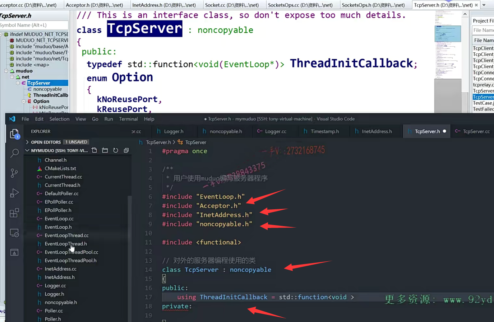

### 这个回调在哪里使用

这个我们也知道什么时候调嘛。就是在起一个线程的时候啊。还记不记得啊？

在这个thread类里边。

一起帮大家回忆一下啊，不要把前边给忘了。

启动一个线程的时候啊。

当我们去启动一个loop线程，应该是event loop thread啊，启动一个loop线程的时候呢，在这里边啊。

定义了一个loop，然后呢，就是在这里边是不是有一个？

这是起一个新的线程，定义了新的loop一个线程的初始化函数。

这里边儿是不是就执行了把新定义的loop给你，你可以针对这个loop进行一些初始化操作。okay吧啊。

当然，在这里边没有一些特殊的这个需求的话呢，我们一般是不会去修改它的啊。

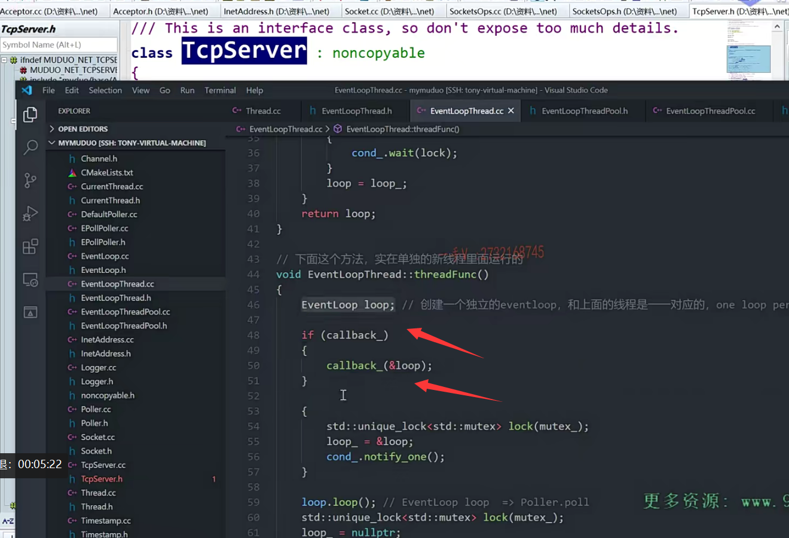

那么在这里边。根据刚调用的时候是不是传了一个loop的地址啊？

所以在这里边儿参数就是一个loop的指针OK吧？

线程的一个初始化类型啊。

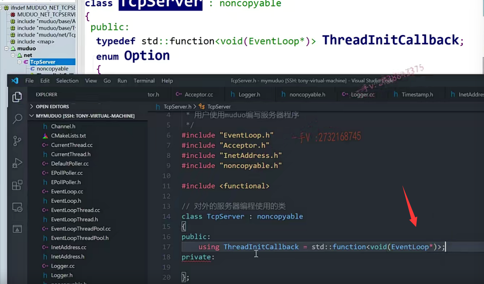

好，我们往下看看它的这个成员变量啊，看它的这个成员变量。

首先在这里边有个connection map啊，这是一个string TCP connection，

connection相关的我们先不要啊，先不要。

当然，我们也能呃，虽然不写它，我们大致的理解一下它的意思啊

TCP server里边包含了很多的connection。

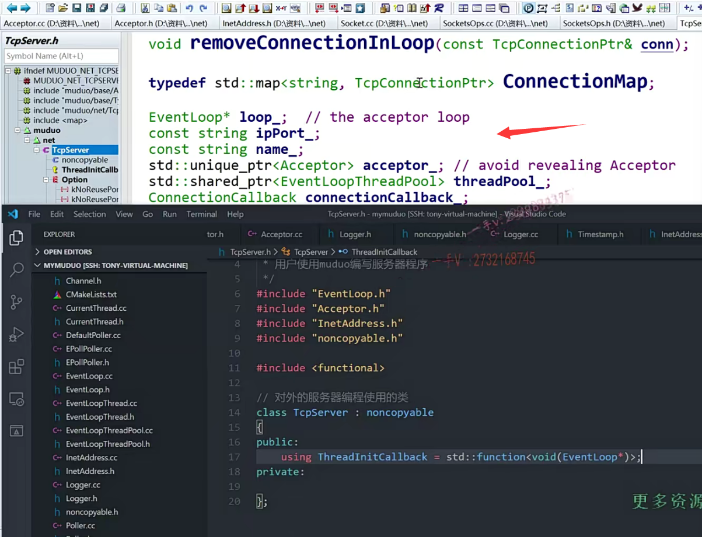

是不是有些同学在muduo库里边这个connection跟channel分不清楚啊

channel大家已经讲给大家已经讲了很多遍了。

TCP connection又跟channel又有什么不同的地方呢啊？

我们讲connection的时候呢，大家注意留意听一下啊。

呃，讲完这些，希望大家呢，把所学的这个组件啊，都给它搞明白好吧啊，所有的组件的总结，我们放在最后来给大家说。

那么在这儿呢？

首先event loop 这也就是那个所谓的base loop。就是用户定义的loop。

用户需要自己编一个loop。是不是传进来呀？

唉。这是const还有string呢，所以我们包含一下相应的这个头文件啊。

这也是IP pot。把IP跟port呢打打包成一字符串了啊const。name这一名字。

然后是什么智能指针对吧？智能的这个托管资源。

SD de先用了一个unique ptr。ACC.ept or acceptor cep.to r  

ok，这是一个，还有一个什么呢？

share的ptr是什么event loop thread pool 是一事件循环的这个线程池对吧？event loop thread pool.

好，我们看看啊。event loop thread pole.这是thread pool。

one loop per thread.这个event loop threadpool 

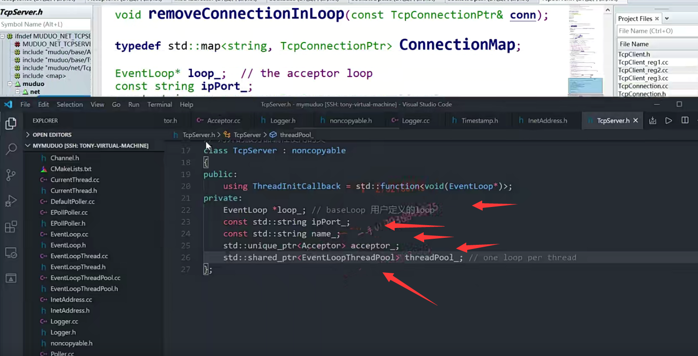

绝对是muduo库里边一个非常出彩的这个组件啊，东西。

甚至我们大家呢，把这个代码保留下来，以后还可以在自己的其他的工作环境中去使用，直接使用它啊。

非常经典的对吧啊，这个是池管理了event loop thread对不对？loop thread,loop thread.

在这里边做的就是一个线程，一个循环事件，循环一个线程，一个事件循环。OK吧啊，设计的非常好，

这之前已经给大家详解了呃，希望大家呢，好好的去理解一下啊。

言归正传，回到我们的这个TCP server点h里边来，

## muduo库提供的回调函数

再来看有什么呢？这是connection call back，message call back，write complete callback，这些东西是什么呢？这些东西你不陌生吧？

各位陌不陌生啊？这个应该不陌生吧？

啊，这个应该不陌生。这是什么东西呢？

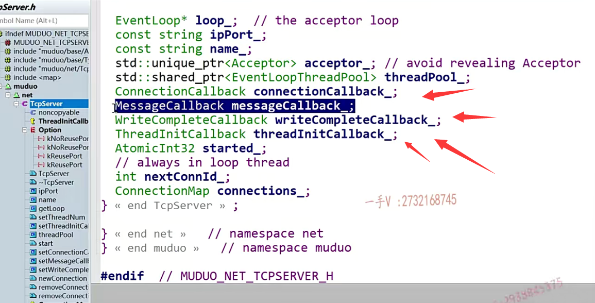

### 回调函数的执行逻辑

这就是我们用户。你还记得没？

你在使用这个TCP server编写服务器程序的时候，你是不是要调用的TCP server的？

set on connection call back ，set message on message

这个call back是不是来设置当这个muduo库给你监听有新连接到来的时候呢，执行你预制的一个回调操作。

当muduo库给你监听到已连接用户有读写事件发生的时候呢，会给你去调用什么，去调用一个message call back，你预制的一个message call back，这么一个回调啊，

当他写的时候呢，写数据的时候，你把数据写完以后呢？

唉，就是把缓冲区的数据选写完以后发送完成以后呢，它会又给你调用啊，这个read complete callback，

如果你设置了的话。基本上我们大家在用的时候，你有印象，

这两个我们是一定会设置的设置这两个回调对吧？

### 区分业务和网络代码

muduo库很好的帮我们把网络代码跟业务代码给它完整的区分开。

我们设置一个on connection call back，这个函数被调用的时候呢，

我们就知道有新连接用户来了，我们该处理什么样的业务呢？对不对啊？

这个呢？就表示已连接用户有读写事件来了，我们这个回调就会被调用了，被底层调用了，被reactor帮我们调用了嘛。是不是有事件发生？reactor就帮我们进行调用了。对不对的啊？

好reactor知道的，这些回调都是我们用户先传给TCP server。

TCP server呢？再传给这个event loop的。好吧啊。

### 回调函数定义在callback.h中

OK，那么我们看一下这些回调的这个类型啊。

像这个connection call back，它都是在一个call backs点h在这个头文件里边统一的去定义了这么一些。类型啊，这么一些类型。

那么在这里边呢？都用到了TCP什么呀？都用到了这个TCP connection啊？

### 里面的类涉及到TcpConnection所以我们先把TcpConnection框架列出来

呃，那这样吧，各位。我们为了让这个代码完整一点，

我们先把这个TCP connection这个相关的代码文件，我们创建出来吧啊，只是搭个空架子，先不写它。

要不然我们这都没法进行了是吧？tcd。connection不要拼错啊。tcpconneztion点h。然后再来一个TCP。connection点CC。

okay，在这里边呢，我们。定一个空类就行。pcp connection.

这是表示一个连接好吧。

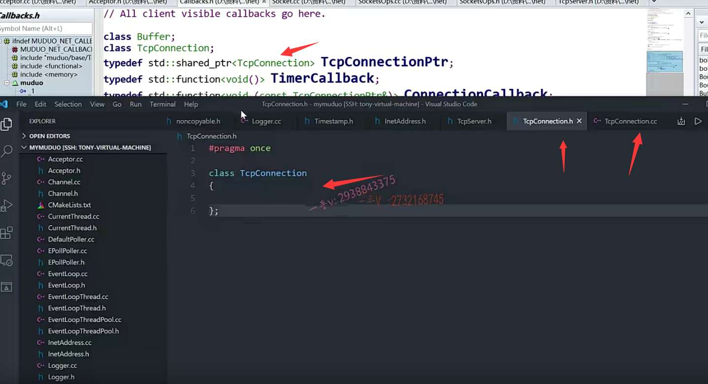

### callbacks中需要用到buffer这个类，我们也先定义出来，具体实现后面再弄

那么大家来看啊，那我们也。callbacks点h。

那么在这里边，我们需要定义了啊。

需要定义这些什么啦？回调的这个消息回调的这个操作的这个类型了啊。

那么这还有buffer呢。

这个message call back有用到这个buffer。

好吧啊，有用到这个buffer，那我们把这个buffer儿类型呢，也定一下吧，这都是跟TCP connection相关的，

我们在讲TCP connection的时候呢？

给大家详述，先在这里边呢。把相关的这个代码文件我们先列出来啊。

我们尽量给大家在讲的时候把各模块给它独立起来，分割起来啊，

但是呢，一个项目里边的代码呢。不可能说是模块跟模块之间干干净净的，水至清则无鱼，对吧啊？

模块跟模块之间干干净净的，那模块之间就没有交互了，没有交互了。

那也就完成不了多么复杂的功能了，对吧？

我们在这里边只是添加了一个buffer，一个TCP connection，这都是跟连接有关的好吧。

具体的这个里边儿实现什么内容在muduo库所处的角色意义是什么？

我们后边儿来给大家详述啊。

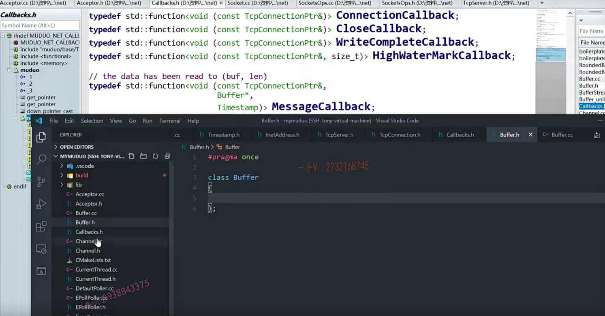

# callbacks.h

## 回调函数的类型定义

好，那我们继续回到这个call backs里边，

首先呢，在这我们进行两个类型的一个什么？前置声明。

好在这儿呢，我们需要先定一个TCP connection ptr等于。

那这儿就得包含什么头文件了？memory智能指针的头文件了，对吧？

shared ppr TCP.connection.

相当于TCP connection，ptr就是一个指向了谁啊？

就是一个指向了TCP connection对象的一个智能指针。

好吧啊，这个能能够明确啊。

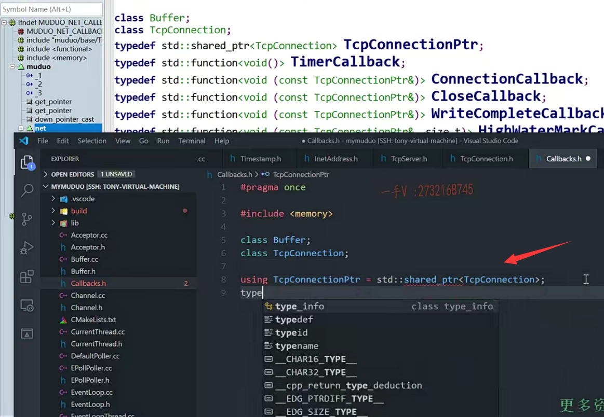

okay，再来看。是using啊。时间定时器相关的，我们不实现啊。

connection call back。

你还记得你在用muduo库的时候，那个connection call back呢，有几个参数吗？啊，那个on connection函数是不是就有一个参数啊？

给你一个TCP connection ptr，你可以通过这个参数呢获取连接的，

这个状态是不是啊？对端连接的一些信息 。IP地址端口号的一些详细信息是吧？

这涉及了function，我们得包含functional，

这个包含了C++所有函数对象的这个头文件啊。

kon.void.const TCP connection.ptr引用啊，这是这个类型，

还有close call back。等于std function。然后是void。这都是一样的。回调函数的类型都是一样的。

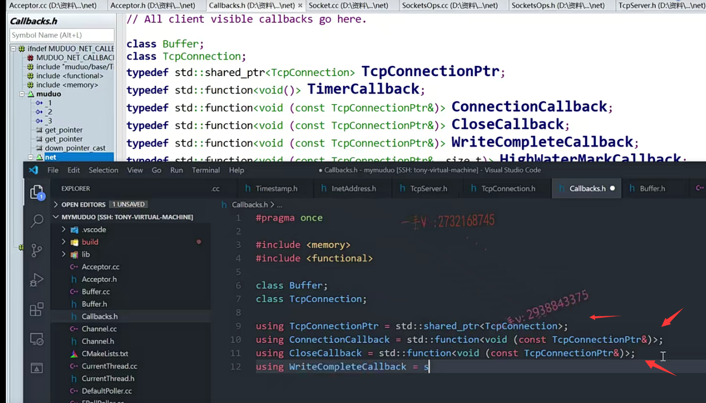

然后再use，right？complete callback

这个回调，我们基本上也很少用，

我们主要关注的就是on connection跟on message。有连接了，有消息了，对吧啊？

其他的呢？我们大家写的时候呢，用的不多啊。

好在这里边儿呢，还有一个高水位的，这个回调高水位这个东西呢，有什么用，我们后边儿给大家说吧，所以这个我们就先不输出了啊。

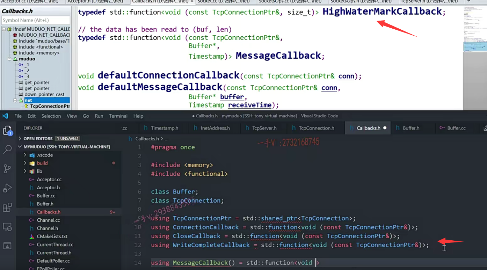

还有一个比较重要的就是using。message.call back.

okay吧啊。是什么类型呢？是function。void。const TCP connection ptr.conn.

呃，不是啊。看差行了，看差行了啊。这是一个参数，还有一个参数呢是。buffer的指针。

还有一个是。time step.okay.   

类型，前置声明一下。

这个没有括号啊。好了，我们这几个类型呢，就先定义到这。

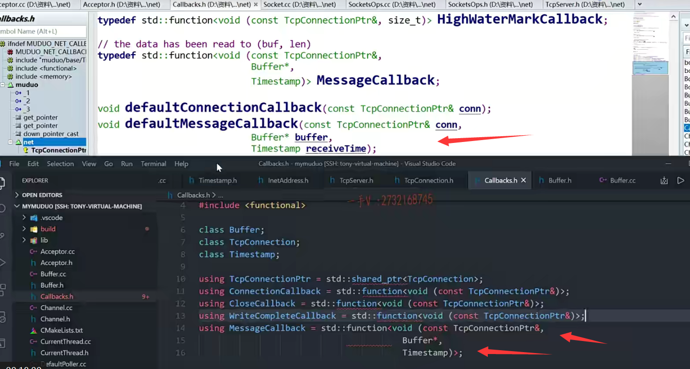

那么，我们回到TCP server点h里边。

那相应的，这个成员变量我们就可以给出来了，

在这我们需要包含呢，它的这个call backs点h啊。

这就是connection call back。connection.call back首字母小写。

有新连接时的回调啊

message call back。message call back.我给大家在这里边注释一下。回想一下啊，这是有新连接时的回调。

这有消息有读写消息时的回调好吧啊。

然后呢？就是有一个read complete消息，写完以后的这么一个回调啊。

消息发送完成以后的回调。

好吧啊。那么，在这里边还有一个什么呀thread in it call back啊，thread in it call back。线程初始化。loop线程初始化的回调。

这有一个started啊。

我们需要是一个原子类型的，我们直接用C++11。

我们全部把muduo库更改成C++11的了，它也就不需要再依赖boost库了啊。atomic atomic.int

这也是我们去重写它的一个亮点所在啊。

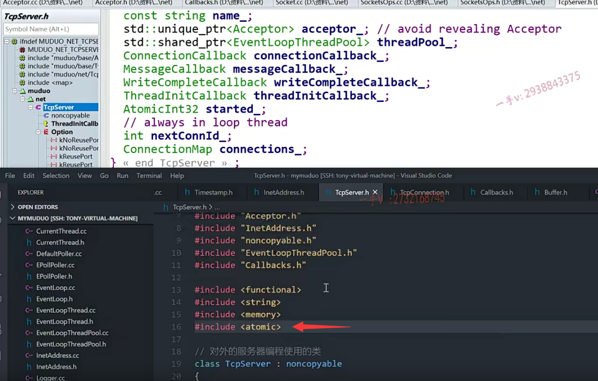

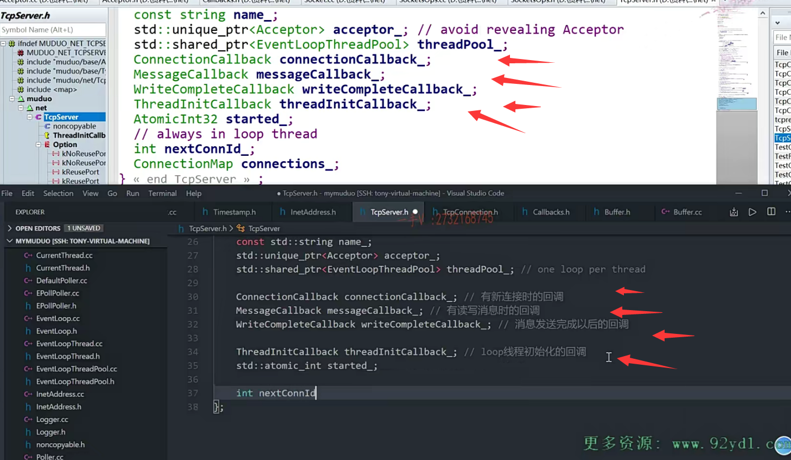

int next CON nid.还有一个connection loop，这个是跟connection相关的啊。

那么在这里边，我们也可以定义出来了，刚才pcp connection ptr是不是都已经定义了啊，只不过没有实现。

==这里边儿的这个map啊，各位，我们不需要用红黑树的map，因为它对于始终来说不需要排序。所以没必要我们用一个效率更高的，这个哈希表啊。on ordered map，==

好吧。using.connection map.等于什么呀？STD。on ordered.

string TCP connection ptr.

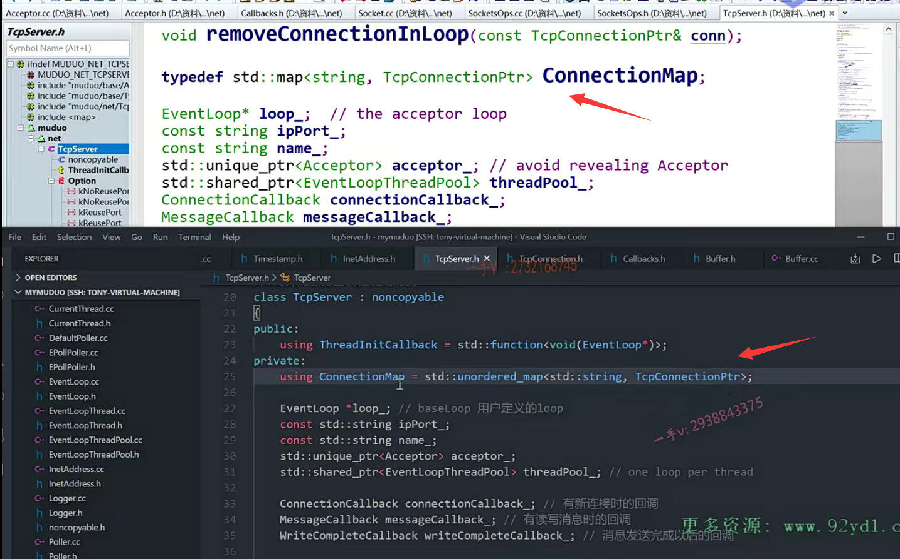

这个用connection map。定一个connections，

connections。保存所有的连接。

对吧啊，这是他的这个成员的这个变量，

我们就给大家呢，先输出到这里了，再检查一下，不要漏掉了啊。

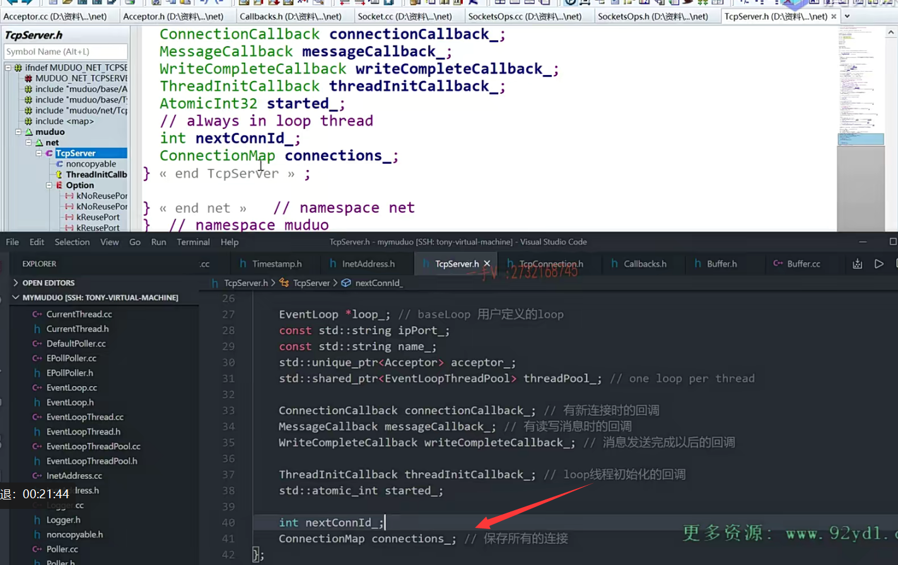

## 关于TCPserver中的loop思考

那么loop。注意在脑子里边儿反映一下，这是base loop用户创建它的那个loop，

就这里边儿的这个这个。

这个main loop对吧？

唉，里边主要是这个loop里边主要是运行这个accept or的监听新用户的连接。

啊，剩下的事情就是分发。

根据轮询算法，分发连接了对吧啊？

具体的事情我们到时候看在TCP server里边怎么做？

他脑子里边儿都要想一想呢，不能光看这一句，就看了一个eventloop

loop杠对吧？

没什么意义啊。

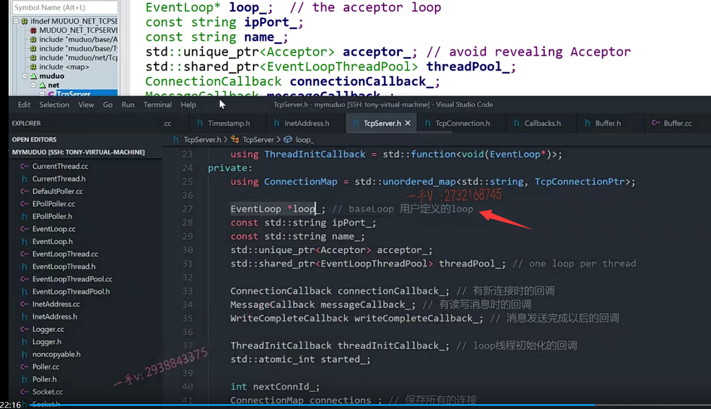

这应该是保存了这个服务器相关的，这个IP地址端口号一个名称是不是不同的功能呢？

我们给它分类一下啊。

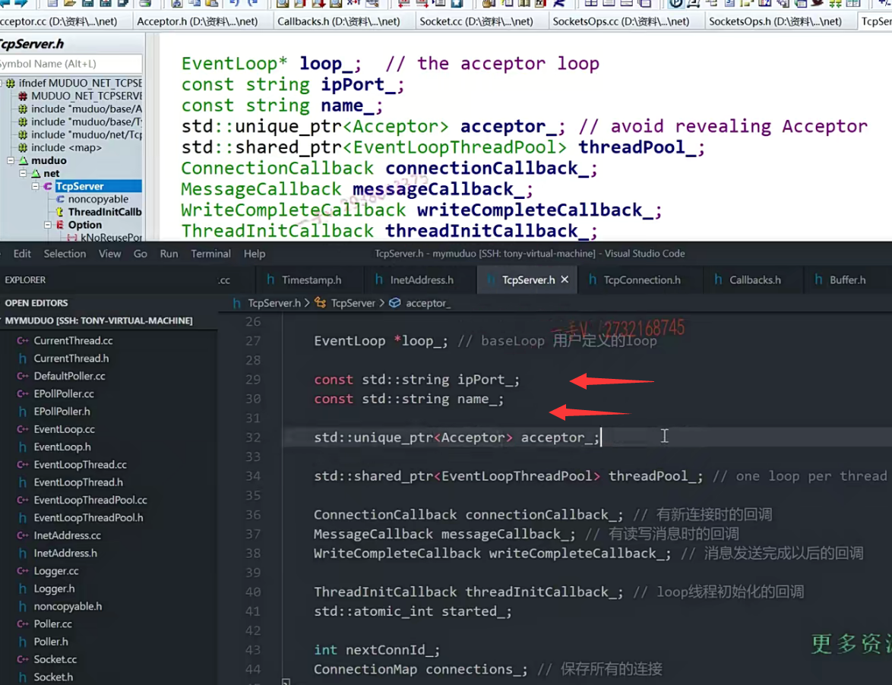

这是accept or。mian loop里边accept or是不是啊？

main loop.运行在main loop是不是啊？

主要任务就是任务就是监听新连接事件。

好，这是底层的这个event loop事件循环线程池啊，

因为我们说了，我们用户会调用set thread number。来设置这个反应堆的这个线程的这个数量呢，对不对？我们不一定只有一个loop存在啊。

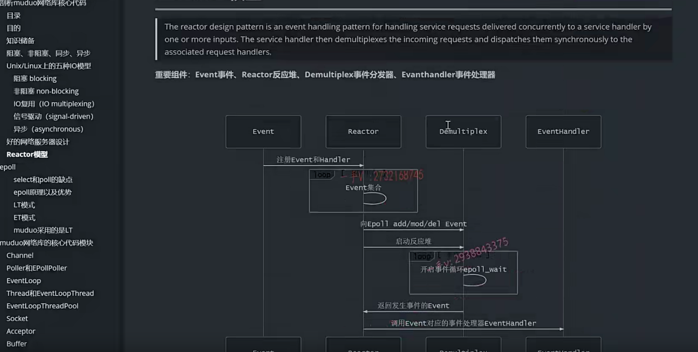

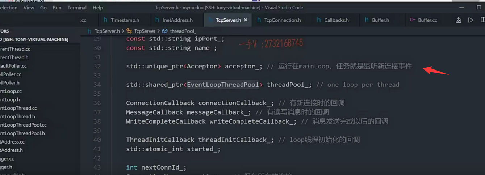

好，然后就是用户设置的回调，主要就是connection call back，message call back。

start it，这是一个标志，肯定是诶，这个int32 没问题啊。

## 成员方法定义

好，我们再把它的这个相关的这个成员方法呢，我们也输出一下。

在这里边儿呢。

首先有一个枚举。有一个option。

这个option 这是预制了两个。use point.

预知了两个选项来表示是否对端口可重用啊。

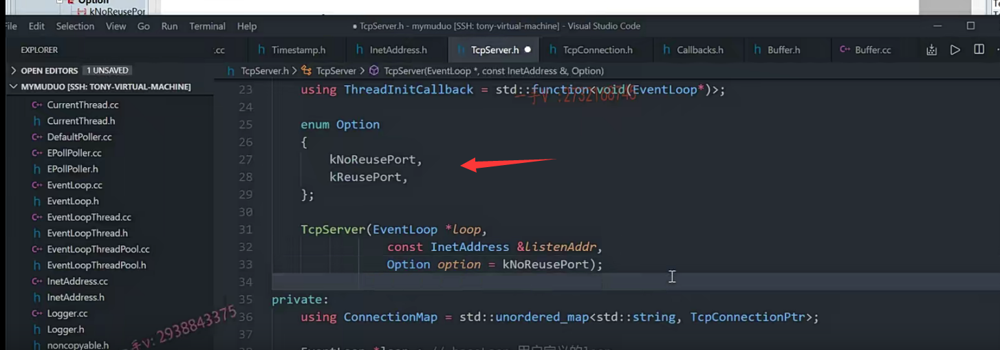

TCP server.这是它的这个构造函数啊，

第一个呢就是event loop星。loop。

第二个是什么呢？第二就是const inet address。listen addr.

第三个是什么呢？第三个就是这一选项啊。它默认是不重用端口对吧啊，

我们看到它这个默认值了。

然后就是它的这个析构函数。

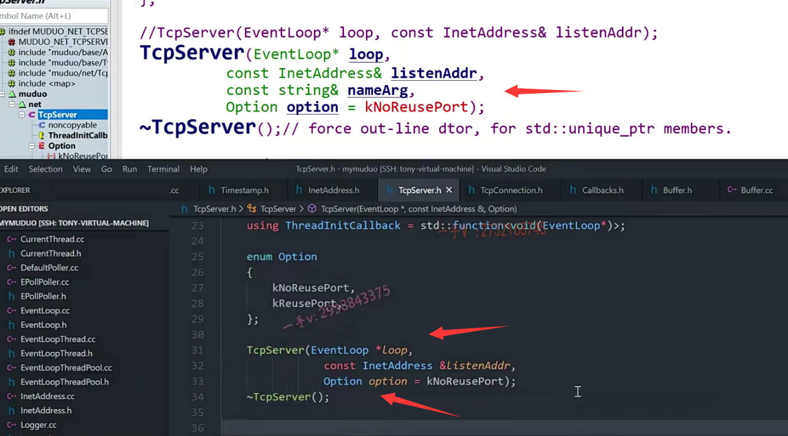

### 查询接口暂不实现

再往下。

像这些都是。对外的一些查询接口。

是不是啊？我们把这个。我们会不会用到？

我们貌似在外边的时候，我们自己。还没有用过。这些方法对吧啊，可以先不实现。

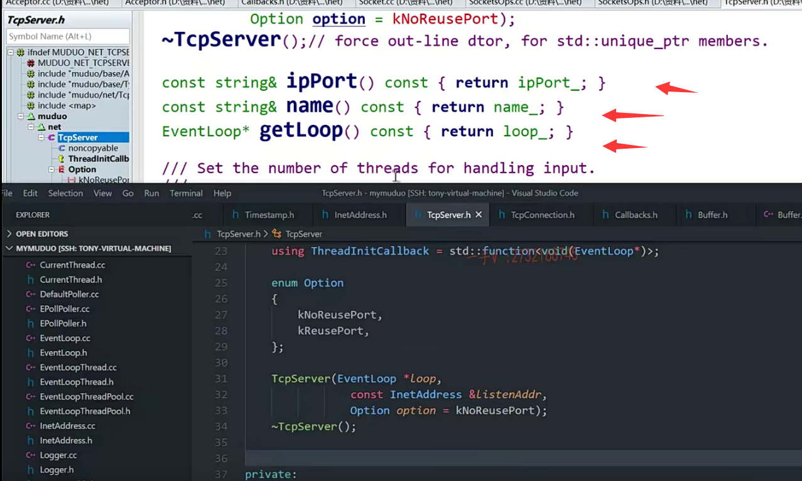

set thread number，这也非常重要了啊。

set先把底下那个给写吧，init call back，

实际上我们没事也不会自己去设置这个线程的这个初始化回调啊。

我们写上吧。

threat in it call back，这都是它的一些非常经典的方法。

### setthreadnumber()

然后呢，就是set thread number。numbers reds.

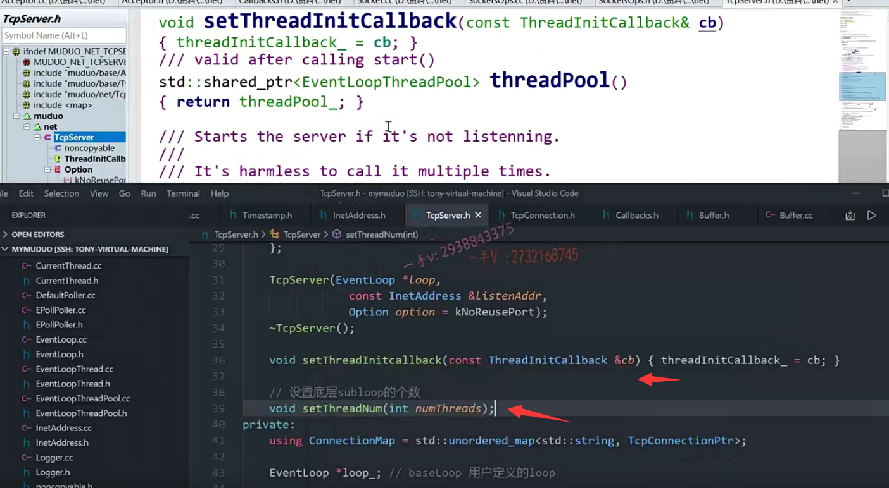

我们写那些thread呀

==event loop thread, event loop thread pool都是呢，==

==通过这个接口来触发的啊。==

==设置底层相当于sub loop的什么个数，好吧诶，就是这里边。==

==充分利用了我们硬件CPU多核的能力啊。==

threat pool这是返回呢，底层的这个疑问的loop threat pool了啊。

不对外暴露有点危险。

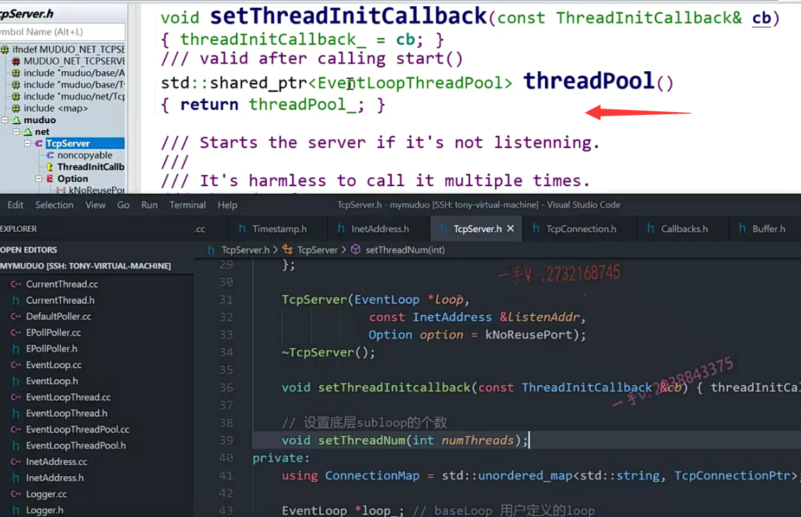

这个就是void start.

这是开启服务器监听。

实际上，你开启Tcp server的start就是开启底层的这个mainloop listen

我们到时候去看一下它的这个实现啊。

那么，这些方法就好用了。

set connection call back，这都是大家在使用muduo库的时候。

必须去设置的吧，不设置这些，你用muduo库呢就没啥意思了，

因为你对新连接事件不感兴趣，对已连接用户的读写事件你也不感兴趣。那你写什么服务器呢？

好了set message call back。count message call back.cb.

在这里边就是一个message。call back=cb。

这儿还有一个什么red complete，对吧？set right.plete.call back.right complete callback.cb=cb。

好了，这几个回调，我们就给大家写完了好吧啊，

这些接口我们给大家列到这。

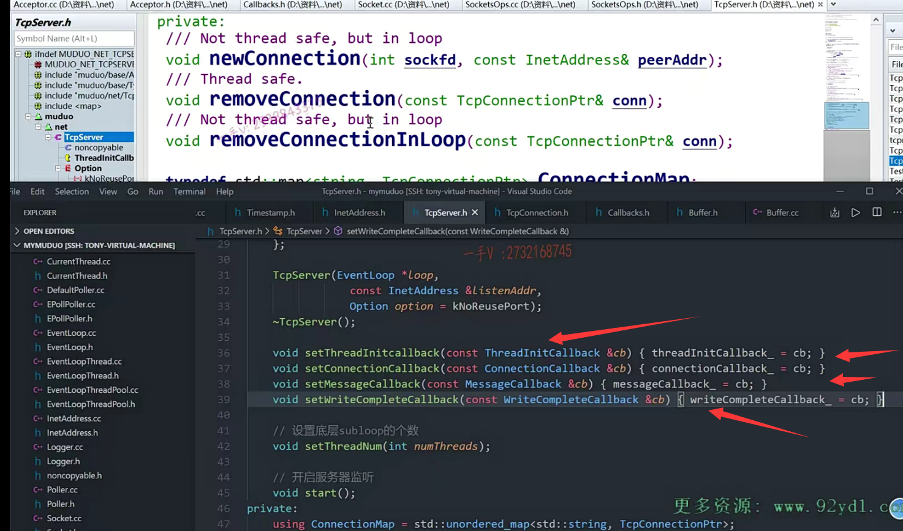

那么，在这里边儿呢？

它的这个私有的这里边儿还提供了三个内部的，这个使用的这个三个接口new connection。remove connection以及remove connection in loop啊，

这些呢，都是必须使用的，我们把这个也列出来吧，

好吧？这都是跟connection相关的啊。

先列出来，用的时候我们先用具体的业务方法啊，我们等TCP connection写完以后呢，我们反过头来。再去理解它也不迟。

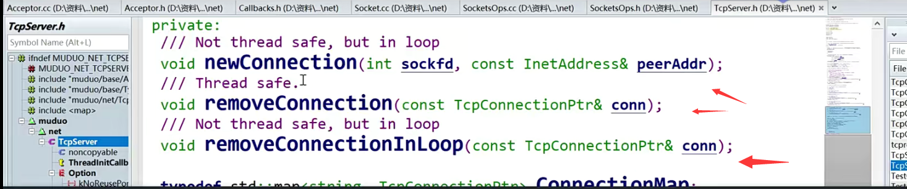

const inet address address.paddr.这个是void remove。

其实你想都能想来他的一个角色啊。这个new connection肯定是有一条新连接来了嘛！

remove connection肯定应该是一条连接断了。那我不要这条连接了，是不是啊？不要这条连接了。

那肯定就是从TCP server里边这个connection map里边把它移除嘛，对不对？

然后是void remove什么？connection in loop.const TCP.connection.

好，这些方法呢？我们方法的这个接口啊，声明我们现在基本上是实现完了。

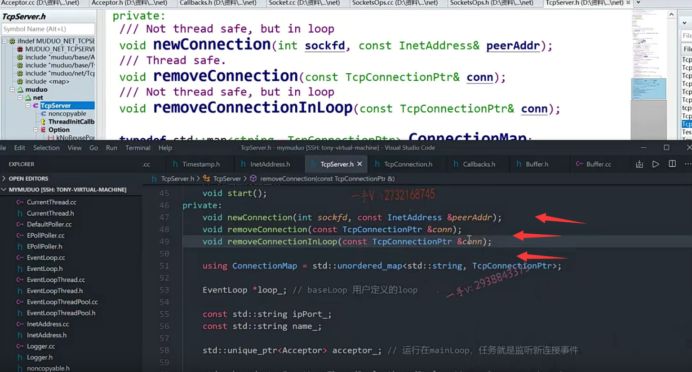

大家整体的再来观赏一下这个TCP server啊。

这是对外使用的类。

到时候呢，我们再用我们自己写的这个muduo库的时候呢，

只需要包含这个TCP server点h就行了。

## 总结

好吧好，那这节课呢？我们任务就到这，

希望同学们呢呃，这个。这节课也是嗯，把相应的代码呢添添加上，

另外呢，就是再回顾一下我们之前给大家说的accept or的这么一个处理逻辑。它在main loop里边主要做什么事情。

accept or拿到新用户的连接以后呢？接下来。又该做什么事情？又该做些什么事情？对吧？

那这些事情就是我们在pcp server里边即将要驱动的啊。好，那这节课的内容我们就先给大家说到这里。