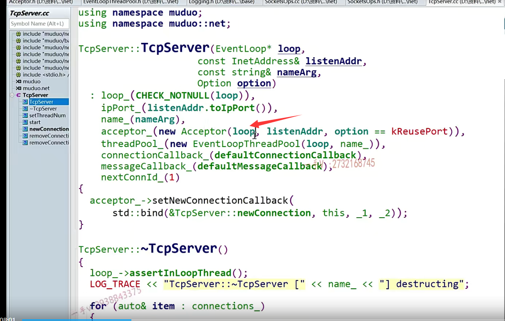
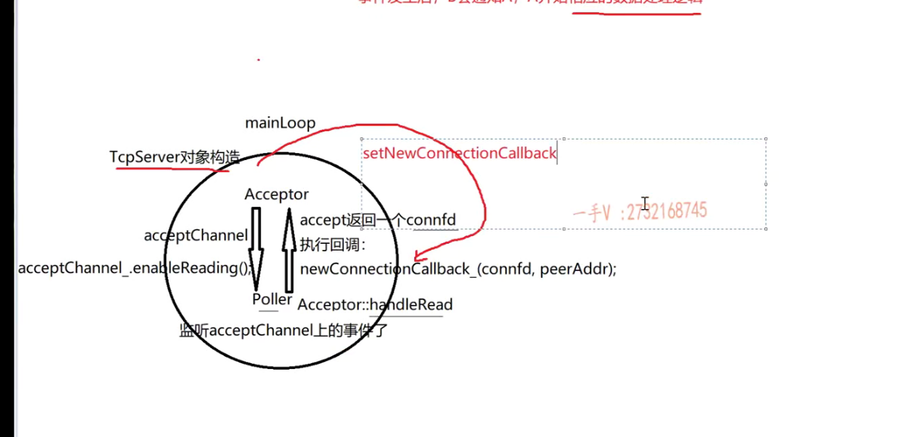
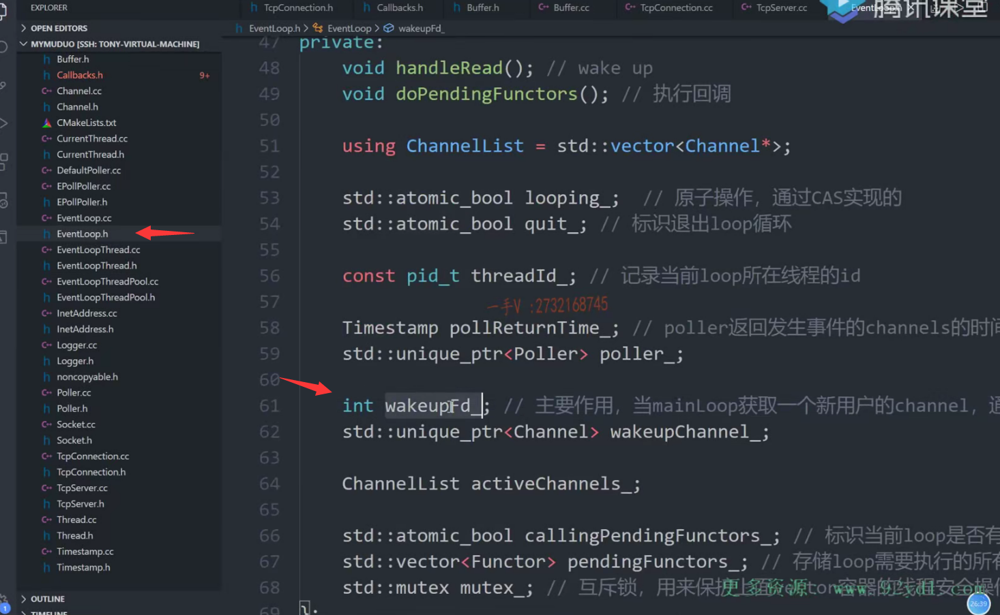

各位同学，这节课呢，应该属于一个比较重要的，

那我们要窥视它的这个muduo库的，这个整个调用全貌的这么一节课啊。

也就是我们要实现TCP server这么一个总的调度，相关的一个代码，

但是呢，我们又不会把这些接口呢，全部实现完，

因为我们毕竟呢TCP connection相关的这个代码我们还没有实现，对吧？

啊，我们这节课实现TCP server的一部分，但就是这一部分已经足够呢，

==让大家把这个muduo库的整体的基于这个multi thread的这个reactor反应堆模型的整个的这个调用过程呢？大致给它摸明白了啊。==

## 构造函数的实现

好，那么在这里边啊，大家跟我来看，

首先呢，我们来实现一下TCP server的这个构造函数。

大家来跟我看一下它的这个构造函数啊。

构造函数在这里边首先做了什么事情？

首先呢，我是给这个成员变量谁呀loop，

也就是base loop main loop是不是进行赋值啊？

### main loop的赋值需要做判断，不能接收空指针

人家做了一个check note null。

呃，相当于做了这么一件事情。就意思是呢，不能不接受用户传，

对于这个loop呢，传一个空指针，

如果是这样的话，就意味着连main loop都没有了。

那怎么样啊？那就不能够怎么样啊？程序就不能够继续再往下执行了，

那应该是要进行一个log fatal这样级别的一个日志输出结束程序对吧？

logger.

那我们写一个吧。event loop.这个或者说是我们也像它一样，我们也定义成这个宏吧。

叫做 check not null啊。

okay.然后这里边儿呢是1x。度这个。这是一个简单的初始化。

简单的初始化在这里边，我们先写一下吧啊。

简单的初始化没有写过这么复杂的，这个宏定义啊。

==算了，我们还是给它写成一个什么，写成一个函数来检测吧。==

好吧，写成一个函数来检测吧。

我们也指名道姓一下，

因为这个check not null 并没有指明是只是在check eventloop。是吧啊，

所以我们日志打印，到时候我只是打印为空或者不为空。

我们也不知道到底是谁为空了，是不是？

所以在这里边儿呢，我们就写一个event loop* check。check loop not. null 啊。

event loop星。loop好，

最终我们返回的还是这个loop。

OK吧，这不要检测一下啊。就是如果这个loop等于一个什么？等于空。

不行，不答应是吧啊，不答应。

log fat.这是百分之s，百分之s，百分之d啊。这个loop应该我们写一个main loop。is none.

好吧，写了这么一个东西啊。okay，在这里边是首先是feel哪个文件？UN unction每个函数。哪一行对吧啊？出错了。

okay,loop.

这个我们看看再来下一个。IP port.这是用户传的这个。inet address是不是？two IP pot.OK，就是这个啊。

### 之前定义的时候少了一个名称参数

然后namain啊，就是这服务器的名字。

是吧哦，它还有一个参数呢，是不是？

我们好像在定义的时候少写一个参数啊。这服务器的名称。

const string.namain arg.就还是打印的时候用的啊。给一个namain arg。

好，接下来就是非常重要的一个什么东西呀？acceptor.

new ACC EP.accept第一个是loop。

大家看到了没有？

我们说accept or是不是运行在main loop里边儿？

==此时呢，因为TCP server是对外使用的类。啊，==

==这是在定义t tcp server这个对象对吧？==

==所以说根本就没有调用set thread number，根本没有这个sub loop产生。==

==此时的这个loop只是这个main loop。==

listen addr accept or就是处理新用户连接的嘛，所以它需要监听这个listen fd。

所以这个listen addr我们就给到accept or了。

这是一个TCP选项的问题啊。好了。再回想一下。

首先呢？在这里边儿，大家来看。

这是我们的谁呀？客户端发请求，我们就不画了啊。

这也是我们定义的main loop。

mian loop也就是用户定义的这个base loop。

对吧，每一个loop底层是不是都有一个poller啊？

首先是。没问题吧啊，我们使用的是epollpoller啊，

帮这个loop呢去监听事件的Main loop，相当于就是这loop，

相当于就是这里边的reactor。poller 就是相当于这里边的多路事件分发器是不是啊？

核心就是做epoll相关的操作的。

现在呢，这里边运行了什么呀？运行了acceptor。

我们现在创建这个对象以后。

各位，我们把main loop是不是给到它了？

相当于就是它是属于mainloop的。

看一下这个，它的构造函数做了什么事情？

各位，这之前我们写过对吧？

它的这个构造函数啊？在这里边儿做的事情呢，就是写出来就是创建那个socket。就是那一组啊，创建socket。然后是listen。是不是唉，

然后就是TCP编程的那一套。

大家可以看到，这就是socket。

对吧，然后把这socket呢封装成这个channel。accept channel。

为什么要封装成channel呢？

因为呢？acceptor本身只是拥有了listen fd。

它把这个listen fd。封装成这个accept channel

它通过这个loop，把它的这个accept channel是不是？给它注册到这个poller里边啊poller呢，

在这里边就可以监听什么了。

就可以监听accept channel上的事件了。对不对？

如果发生事件，如果这有事件了。

对吧，如果有事件的话。

那么在这里边。channel就会执行相应的这个回调。

你给这个accept channel 绑定的这个read call back执行的回调是什么呢？

就是accept这个handle read。

这个我们也之前写过。是不是那么这个handleread的做的事情是什么事情呢？就是accept了拿了一个新用户的连接connect。

在这里边执行了一个什么？执行了一个相应的这么一个回调操作。

看到了吧？

我们把这个写到这儿啊。

就说明了accept。返回一个connect fd，这就是跟某一个客户端通信用的是不是fd啊？

执行回调。那么，这个回调是谁给他的呢？

这个回调呢？你看acceptor呢，是不是还提供了一个set new connection call back这么一个？好，这个成员方法啊，可以让你去设置回调，

让谁呢？==让TCP server嘛？==

好的吧啊，那么在这里边，你看这个handleread，

我们也给大家呢。把这个呢贴到这里边啊。

### 再总结一次

我再说一遍。TCP server的对象。

创建这个TCP server。对一下构造。

来往这看。是不是创建了一个accept or对象啊？

那accept or对象又做了什么事情呢？

就创建socket。把这个拿把这个socket拿过来封装channel？是不是哎？

==然后呢？就把它呢，往谁里边添加呀？往这个当前loop的poller里边添加。==

好吧，然后注册一个回调。

当然，添加是在这里边儿的，这个listen里边儿好吧，

这就是调用TCP server的start就会调用这里边儿的。

这里边就一块了enable reading嘛。

把它往这个。

我把这一个都写出来吧啊。

enable reading.就把这个accept or呢往poller上注册，

就是把一个listen fd是不是往poller上注册呀？

啊。那么注册的时候呢，

他还打包了一个什么？

因为在这里边儿，我们之前说过嘛。channel上有事件发生的话呢，

它就会根据呢fd事件的类型，读类型，写类型，错误类型还是close类型。

执行相等回调，

你在这里边儿事先是不是给它注册了一个什么什么call back呀？read call back。

来read handle read嘛，said read call back。

所以在这里边呢poller啊。监听到这个accept channel上有事件发生了后，

它就会调用这个handle read，回调这个handle read对吧啊？

这个handle rate里边呢？

就调用accept函数返回一个connection fd。对不对诶？

然后呢？

去执行你这个回调new connection call back.

这个回调是谁设置的呀？这个回调肯定是我们这里边的这个TCP server.给它设置了。

通过调用哪个函数呢？通过调用它的什么函数啊？

通过调用它的set new connection call back函数嘛。okay吧诶。

注意该认清，该认清现实了，不要再太单单纯了啊，

那整个的这个现在到目前为止，它整个的过程就是这个样子。好不好啊？

注意在这里边理解一下啊。

这是呢，在TCP server点h这个点CC。

实现TCP server对象构造的时候，创建这个acceptor他整个儿做的一些事情。还是挺多的，对吧？啊，

包括呢在这里边创建了listen fd。

首先，在这创建这个。listen fd，

listen fd，创建好了以后呢？就把它封装成谁。accept是不是channel啊，

然后再通过accept channel的enable reading这个enable reading我们之前都写过了，相当于就是往poller里边注册一个读事件。

并把这个listen fd添加到这个poller里边去。是的吧。

poller开始监听啊，因为你最终要调用loop的。loop嘛，是不是开启循环，

那么也就是说启动了poller 

poller监听到这个accept channel上有事件发生以后呢？

就会执行一个读事件的回调，

因为你之前对读事件感兴趣嘛，读事件的回调也绑定的是accept，

the handle read。handle read里边就通过accept函数呢，怎么样啊？返回一个跟客户端通讯的connection fd，然后执行相应的回调，这个回调就是我们TCP server预先注册的这一块，

我们在代码上没写，我们即将就要写。

好了，我在这里边儿给了足够的时间，让大家去理解这一块儿，我们代码上所驱动到图上展示的这一系列的调用通信的这个过程，希望大家好好的去理解一下。OK吧嗯。那么我觉得这跟大家之前写裸的这个epol加线程池的代码是一样的，只不过都是以面向对象的思想。

呃，非常好的oop的封装思想来实现它，这一切我觉得是挺优美的，大家好好的去。学习一下啊。

好接着呢，我们该做什么事情了，来看一下啊。

接着呢，我们这个thread pool终于出来了。new event.thread po.loop namain杠。

大家看这个啊。threadpool线程池对象创建了，但是现在里边儿还没有开启线程呢。

好吧啊，还没有开启呢，

它默认不会开启额外的线程的默认，只有主线程，主线程运行这个main loop。

好吧，那么在这里边，你看这个connection call back。

这是一个default connection call back，也就是说用户嗯。

用户在没有去注册过on connection call back以及on mainssage call back的时候呢，

它执行的是这两个默认的这个函数调用。好不好？

在这儿呢，我们也怎么样？写一下吧，简单写一下啊。next,connection ID.

一这里边我们先空上吧好吧，

那默认构造起来了。

啊，我们后边儿再把这个默认的给大家添上吧，

因为这里边儿现在不是我们剖析逻辑的这个重点所在。

现在你看一下，在这里边，

我刚才画的这个红色的线就TCP server对象呢。会给这个accept or去注册一个什么new connection call back，这个函数到底做什么事情呢？

对吧？看到了吧acceptor。调用它的set new connection call back。std.bind

没有包含这个函数对象的这个头文件。functional.

绑定的是谁呀？诶，就是我们TCP server自己的函数，哪个函数呢啊？

new connection。对吧this。总共有两个参数STD。please holders.

杠1 sdd。please holders.杠二。

这是绑定器所用的这个函数参数的，这个占位符。

为什么有两个占位符？这不传俩参数吗？啊，有新用户连接来来的话呢，传了一个用户用的这个跟客户端通信的这个socket fd对吧？

还有一个就是客户端的这个IP地址端口号。

就是从这两个函数过来的。明白了吧。注意一下啊，

注意一下，我在这边再注释一下。

这个等有新用户连接时。会执行TCP new connection.是不是回调啊？

唉，这个函数呢？将做一个回调。在这里边执行，

在代码上是哪里呢？在代码上就是我们的这个acceptor点CC里边handle read里边的这块。

明白了吧啊。注意一下啊。

那我们现在赶紧。趁热打铁，把这个on connection我们来看一下。

大家先不看on connection，先来跟我分析一下啊。

那么，现在这里边儿，我们现在知道它执行的是谁呀？

现在知道它执行的就是TCP的这个on connection。对吧，

我们现在知道它执行的就是。写到这啊。

on connection，那这个函数应该做什么事情呢？

这个函数这是main loop嘛？main loop做不做以连接用户的读写时间不做，

它只监听新用户连接，对吧？

在这里边儿应该做的事情是这样的事情啊，就是根据轮询算法，选择一个sub loop。OK吧，然后是唤醒sub loop。把这个当前connect fd封装成什么？

封装成这个相应的这个channel。

是不是分发给谁呀？分发给sub loop。

当然了啊。你分发给subloop之前，

你还得在这个上面注册相应的什么相应的一些回调啊，什么回调？

比如说事件处理的这个有消息来的时候。need一个回调吧。对不对啊？

我们在这里边简单写一下，那么在这里边，

假如说我们set thread  number=3。

就是开启了几个线程啊？

开启了三个线程。所以开启了三个线程，也就是说在这里边开启了几个loop啊？开启了三个loop。

thread 1。对应啊，这对应的就是sub loop 1绑定sub loop 1对吧？

这是thread 2。对应的就是sub loop 2。

你看一下。这是thread 3。对应的就是sub loop3。

好，我们来看一下它的这个new connection，而我们在代码上，

我们就先不写了吧，我们先留上。

好吧，我们先来在逻辑上分析一下。

这断言我们不看。ioloop看到了吧？thread pool get next loop。

嗯，这个我们之前看过吧。

看过来到代码中，我们再回忆一下。

get next loop event loop thread pool.什么意思啊？这叫选择一个loop了。

把新连接用户的这个channel给他，是不是？

定义一个局部变量loop，先指向base loop。

如果说你没有设置过线程数量，也就是没有创建过这个线程的话呢？

它最终返回的还是谁呀？最终返回过来的是不是就是这loop就是base loop本身，

那也就是说呢，不管是新用户的这个连接事件还是已连接用户的读写事件，都是在Main loop里边去处理的。

这个明确吧。

那现在我们已经set thread number已经设置成几个线程了，设置三个线程了。

OK吧，那在这里边儿是不是就是一个轮询算法啊？next刚开始为零。转圈儿是吧？轮循算法。哎loop就是loop，现在开始选择第零个。

啊，那也就是说呢，在这里边啊。lO loop.最终指向的是谁呀？唉，在这里边儿。我们选了一个。选了一个IO loop。这个lO loop现在指向的是谁？

各位。不用花这么远了。现在指向的是不是就是这个呀？下一次就是这个，下一次这个再这个这个这个轮询嘛，对不对啊？

大家注意啊，现在我们这个loop指向啊，指向的是这里边线程一的这个sub loop1，注意sub loop1。

subloop一这个loop里边儿有一个什么东西啊，各位？

这些loop啊，这些loop都是在睡觉啊，

因为他们每一个loop都有个事件分发器epoll啊，

他们都在epollwait的上去阻塞着呢，对吧？

没关系，每一个loop里边都有一个wake up fd嘛。还有没有记得啊？

这就是我们main loop怎么去唤醒sub loop用的就是这个wake up fd嘛？

这个fd本身也是在这个loop的poller上，是不是去监听wake up fd的事件呢？对准没有？

是不是这个wake up fd啊event loop的wake up fd？

## 重点 线程 分析

okay，那么来看。

拿到了这个lO loop。注意对应图上。指向了线程一的这个loop，

但是呢，当前的这个lO loop在谁里边儿执行的？啊，

各位是在谁里边儿执行的？

==是在我这个程序里边儿执行的。是在我Main loop里边儿执行的，因为我Main loop里边儿才去调用这个new connection的。==

对了吧啊new new connection，

这是。运行在主线程当中的。

啊主线程的main loop。这个调用什么啊？

调用这个new connection 选择了一个lO loop那这个指针是指向这个loop，

但是呢，这是运行在当前线程当中，

==还有没有记得我给大家说的一个事情就是每一个loop在执行自己loop上的操作的时候，都得在自己的线程中，是不是去处理啊？对吧，==

==所以呢？eventloop提供了两个方法，一个是run inloop。一个queueinloop。===

所以runinloop什么意思呢？就是唉，你这个loop呢？

就是在你这个loop相应的线程里边，那你就直接执行相应的回调就行了。

==如果呢，就像这个lO loop，这个lO loop现在是在主线程中去选择了这么样的一个指针。相当于拿了线程一里边的，是不是一个loop啊？==

==能不能在主线程里边去执行这个lOloop的回调呢？不能，==

你必须queueinloop，所有的queueinloop呢？

唉，那相当于就是要唤醒你这个lOloop所在的线程，

==怎么唤醒呢？这个lO loop不就指向这个loop了吗？这个是个指针嘛？指向这个loop唉，==

==这个loop上这不有一个wake up fd的吗？我向你这个wake up fd。是不是写个？八字节的数据。==

你这个sub loop呢？因为你监听了，你自己的wake up fd。

你这个sub loop1是不是就被唤醒了？

唉，你被唤醒了以后你就去执行你这个l loop上。就是你自己这个loop上给你设置的这个相应的这个回调操作就可以了。

能明白吧，这就是我们以前写过的这个逻辑啊，

你现在知道它的这个runinloop跟queueinloop。做的事情是什么事情呢啊？

我们很多同学在分析muduo库的时候，不知道为什么总是在他要判断当前这个loop在不在他自己的线程是什么意思呀？

### muduo库不是使用同步队列这一套

对吧，因为呢，在muduo库里边main loop跟sub loop之间没有加同步队列。

没有利用生产者，消费者的这个模型main loop，只管生产channel往同步队列里边放，

这个sub loop啊，从同步队列里边拿channel进行一个消费，并不是这个样子。

它的效率更高，它直接通过这个wake up fd对吧啊，

自己签订自己的wake up fd。

你是想唤醒我，给我的这个event loop里边的wake up fd去写一个数字。

我当前这个线程呢。就会被唤醒起来。

### 封装成channel，这里更狠，封装成connection

好吧啊，来我们继续看，

首先呢，是这个样子，获取了一个loop。OK吧，获取loop以后呢，

在这里边就组织了一下。组织了一下name ，就这个连接的name进行了一个日志的打印输出，

这里边你看创建了一个什么，创建了一个连接。

给这个连接呢，设置了这个connection的，是不是call back呀？

又是mainssage的call back，又是read complete的call back。啊，还有closed，是不是call back呀？

==没问题吧，这里边相当于就是我们这里边说的封装啊，封装channel。==

==对吧，封装成connection，这里边封装的更狠，==

==封装成什么了，封装成这个connection了。==

==OK吧啊，connection有成员变量也是channel。==

okay.完了以后呢，

你看这里边用了什么run in loop是不是哎

run in loop里边执行的东西呢？这个我们run in loop.

你看这一上来是不是就是我刚说的先判断？你当前这个loop。你的thread ID。

他判断，将来这个loop的thread ID，那肯定是个thread 1的thread ID，是不是啊？

那当前线程的ID，那肯定是主线程的ID啊，那这俩肯定不相等啊。

不相等的话，那也就是说呢，你现在实行的这个回调并不是在loop所在的线程。

那也是啊。

你现在相当于是封装了一个TCP connection。

是不是需要把这个TCP connection要加到你这个线程的这个loop里边啊？

但是你现在这个线程没有唤醒啊，我是在主线程里边去操作l loop的，

所以在这里边呢。

做了一个什么操作，queueinloop。是不是queueinloop啊？唉，

queueinloop在这里边儿做的事情呢，就是 wake up。

把你这个thread1 唤醒一下，相当于就是给你这个eventloop的wake up fd去写了一个数字，把你这个线程唤醒一下。

然后就把这个新的这个TCP connection。注册到你这个sub loop1里边。

没问题吧，整个逻辑应该通了吧？

啊，那操作到其他loop的时候呢，情况也是一样的。它就是这个过程。好吧啊。

把我们给大家这节课说的这个流程呢，大家好好的去理解一下。这个图能够理解的话，

其实muduo库整个通信的这个大致的这个全貌呢，你就都明白了啊。

就是就差一个谁就差一个这个TCP connection。

okay吧。那么在这里边。

你看这是有一个新用户的连接。

在这儿，这是connection call back，

这是message call back。

那各位。你在这里边儿创建了一个TCP connection。

给它设置了就是connection call back跟message call back

然后呢？把这个东西呢？直接注册到相应的这个loop里边。

注意，我把这块逻辑放上来了。

这就是选择了一个loop嘛，对吧啊？

选择了一个loop。这个loop指向的就是一个具体的子线程，里边一个sub loop把这个封装好，TCP connection就扔给他们了。

这个connection call back就直接被回调了，因为它就表示有新连接到来了，

这个message call back什么时候掉呢？就是当这个sub loop底层的这个poller在监听到这条connection有新有数据到来的话呢，

这个message call back就会被调用了。没问题吧，

这个就对应的是我们在代码上，我们使用muduo库的时候在代码上经常写的那个connection回调方法啊。

这个呢，对应的就是那个什么方法呢？啊，message那个回调方法。

没问题吧啊，希望大家在这里边呢。

搞清楚啊，搞清楚，搞清楚这每一个里边呢，都有一个都是一个epollpoller过来。

我们把这个呢。应该不能仅仅叫epollpoller，每一个都是一个反应堆reactor.

反应堆实际上就是对应这里边的event loop嘛，对吧？

画这个图会更好一点啊。好。

## 总结

那么。我们这节课主要给大家呢，

相当于是把TCP server的这个构造函数给大家说了一下。

又把这个new connection呢的逻辑意义给大家说了一下。

好吧啊，那么在这里边呢？TCP server，剩下的其余的接口呢？

我们到后边把TCP connection说完以后。

我们再统一来说，包括这个new connection，大家现在只需要知道new connection具体的执行时机就可以了好吧？

来，我们把相关的这个代码补上吧啊。TCP server.

我们只给它列一个空函数啊，只列个空函数在这。

另外一个就是把它的这个什么实现一下。

这两个实现一下吧，好吧？这两个我们是可以实现的啊。

### set thread number()

set thread number大家来给我看看。

这里边儿做的事情呢，就是给底层的thread pool。set一下thread number。numbersthreads.好吧，

### start()

那这个start。

首先一上来，先是这个什么方法啊？

started这个原子整形类型啊？那么等于零，

这什么意思呢？这就说是防止一个TCP server对象，被start多次。

哎，因为第一次start的话呢，在这里边儿。是不是刚开始它是零？

第一次条件满足，但这个start就加加了，

后边如果你重复调用start的话，这个就不会为0 ，if进不来，

相当于没有被重复启动多次是不是？

哎，thread pool你看。start了init call back。

这个相当于就是启动底层的这个什么啦？启动底层的线程池了。loop线程池了。

就是把我们这里边的sub loop全部起起来了。

起的个数是多少呢？就是我们上边儿设给thread pool设置的，是不是这个thread number啊？

okay，然后这里边要把acceptor也起起来。

你看做的事情就是loop 指向了run in loop。STD.band.谁呢acceptor listen.对不对？还有一个acceptor。点get。这是需要一个裸指针。

啊，现在呢？我们就全部就都清楚了，整个的启动逻辑，我们是不是也清楚了？

调用start以后。

唉，这个底层的这个loop的线程池就都启动了。

还有什么呢？还有这里边呢？执行了这么一个回调。

这个loop是主loop，那当然是在主线程里边儿执行的，

所以这里边儿就直接执行这个回调

执行这个回调的意思是干嘛呢？那就是呢listen了。

然后 enable reading了，enable reading就是把这个accept channel注册在这个poller上了。

啊，调用完这个start，

我们马上是不是调用？loop的loop方法开启事件循环了对呢，

就是图上的这个poller。事件分发器开始运行了，epoll wait了就开始监听accept channel上有没有新用户的连接了，

后续的操作就是我们刚才给大家说的。

好了，那TCP server的代码我们就先说到这里，后边呢，我们再把它补齐，

希望大家呢这节课把相关的代码完成一下，好好的把我画的这张图所描述的整个的这个流转的这个过程。

好好的想明白。多想几次好吧，甚至呢，自己画一画OK吧，

再去讲moduo库的时候呢，高兴的这个服务器设计的时候epoll加线程池。

呃，一个基于这个多线程的这个reactor模型的时候呢？

说这个模型。你应该说的就非常的得心应手了。

好，这节课所有的内容我们就先说到这里。