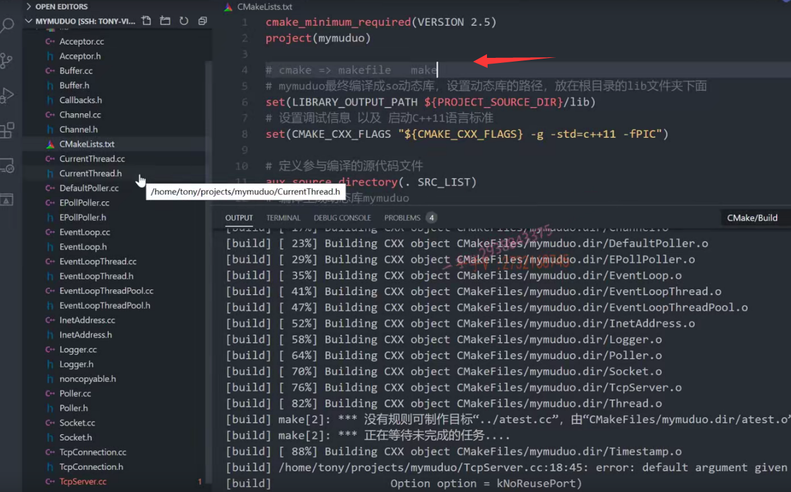
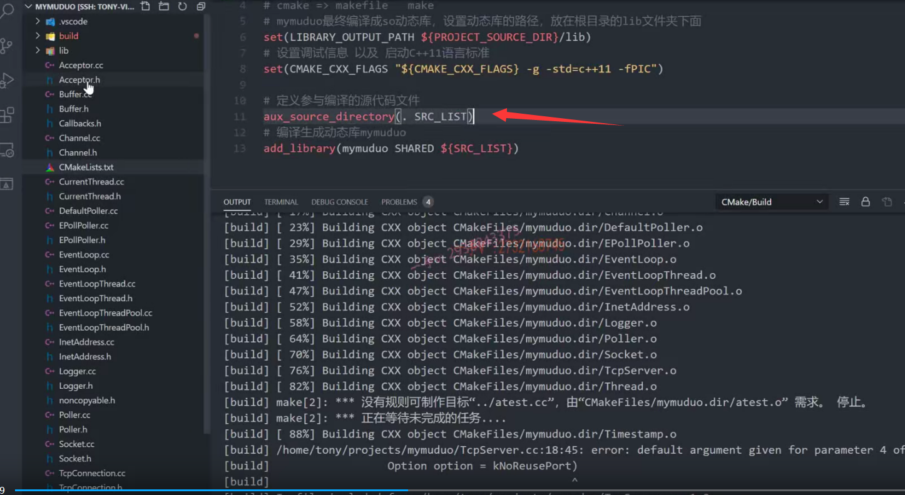
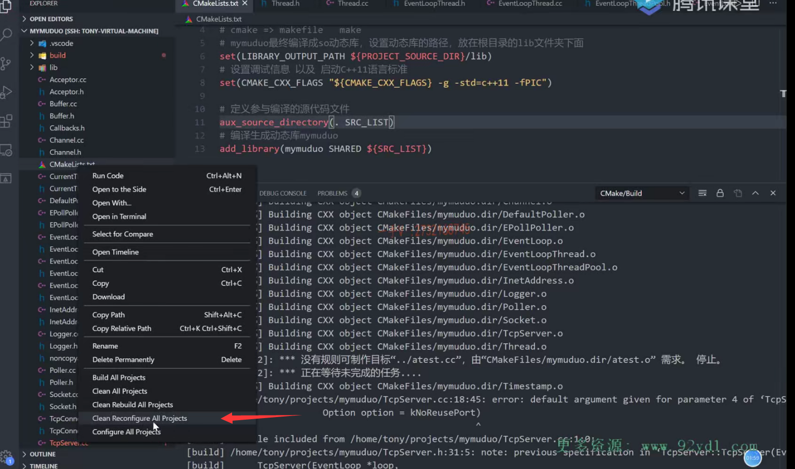
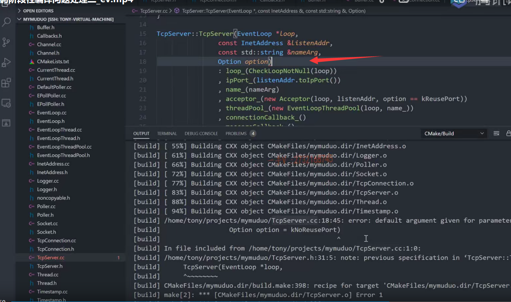

这节课我们把之前写的代码呢？这个也先进行一下编译啊。

好在这里边呢。我先强调一下这个代码的，这个编译啊，

我们之前也遇到了新添加的这个文件啊。就是没有参与编译，是不是啊？

那么这里边呢？实际上我给大家把这个最终的这个问题的原因呢？给大家说一下啊，这个之前呢？我们好像都没有给大家说明白。

## 问题所在

那是因为什么呢？是因为我们每一次在这里边build的时候呢？

在这儿注意一下啊，build的时候相当于只是执行了这个make。

实际上cmake整个首先它要执行cmake命令。cmake命令干嘛呢？

执行是不是生成这个makefile啊？

然后make才根据makefile定义的这个内容了，是不是进行代码的编译呀？

那也就是说呢，如果我们cmake之前执行过了，就是configure构建过了的话呢？makefile里边记录的就是项目原来的这个文件呢？是不是这个什么？什么原来的这个文件的个数，

==我们在不管make来make去，你新添加的文件没有写在makefile里边，==

==你make来make去你根本编译不了，是不是新添加的文件啊？==

所以呢，如果你在这个新添加文件以后出现了新添加的文件，没有被编译，

我们这里边需要把它之前通过cmake命令产生的所有的makefile相关的文件全部清除掉，

让它根据呢项目目录所有的源文件啊，重新产生makefile，

因为我们的cmake规则写的是以当前目录的所有的源文件。是不是参与进行编译呀诶？

## 解决办法

这个很好办。右键就是。clean就是这个clean reconfigure all projects。

就重新配置，也就重新cmake啊。

重新cm ake起来了以后，那生成再再编译生成的新的make fail，

就肯定包含了我们当前目录所有的源文件。你再进行一个编译。

你就会发现，我们会把新添加的这些文件呢，就都会怎么样都会编译上好吧啊，

## 发现编译错误

来我们看看什么样的这个错误吧

### 默认值在定义的时候不能再给

tcp server点CCD。第18行啊。第18行。18行，这里边怎么了？好，

这个是默认值。定义的时候不能再给了，因为声明的时候已经给过了，对吧？

大家注意这个，我们好像这个错误已经犯了好多次了啊。

OK TCP connection TCP server.以及这个八分儿虽然是空类，我没写都已经参与编译了OK，那这个代码的这个编译是没有问题的。

希望大家呢，注意一下我这节课给大家强调了一个用VS code，

用cm ake来构建工程的时候呢，如果你在这里边儿是用aux source directory让它自动识别指定目录的所有源文件参与编译的话。

当你新添加文件的时候呢，不用说你光build就行了，

最关键的是你cmake生成的makefile文件里边儿有没有变过？

如果makefile没有变过，记录的还只是原来的旧的文件的话，

那新添加的文件肯定是参与不了编译啊，

此时很简单。右键重新configure ,

configure完了以后再重新去rebuild就可以了。

好吧啊OK，那么希望大家呢？代码有错误的，也照做修改一下。