前面呢，我们把TCP server这个编写用muduo库编写服务器程序对外公布的这个类呢，我们基本上呢，写了一半儿。对吧啊，我们写了一半。

那么，因为我们还有一个TCP connection 没有完成，

那我们接下来的几节课呢？把TCP connection相关的内容呢，我们给它完成了。

啊，最后呢，我们就可以从整体上啊，再去把muduo库的各个模块之间的这个通信给它再理清楚一些啊，

之前呢，我给大家画的那张图呢，基本上来说大家已经能够百分之90啊，80%到90%已经掌握了它的这个基于多线程的这个one loop per thread的这个reactor模型了，对吧？

好，话不多说，我们看一下TCP connection。

# TCP connection类

TCP connection主要负责连接的嘛，对不对啊？负责连接的。

那一个连接说的就是服务器跟这个客户端，客户端跟服务器之间建立的一条连接。

所以呢，它肯定表示的是通信成功的连接，

成功的用户在服务端的一些数据的这个封装的一种表示，对吧？

### 再说一下mainloop逻辑

我们说呢，这个mainloop呢，通过acceptor获取一个新用户的这个连接以后。啊，就会呢，把相应的socket呀channel啊，都给它封装在TCP connection里边，

是不是通过轮巡算法交给一个subloop啊？

以我们看到这个TCP connection呢，它的成员啊。它就包含了这个socket啊，

包含了这个channel，

实际上这个channel里边也有一个fd ，socket fd，对吧？就是这个socket 。

啊，就是这个socket底层的这个封装的这个fd啊，

他们表示的都是一个角色的东西啊，一个角色的东西。

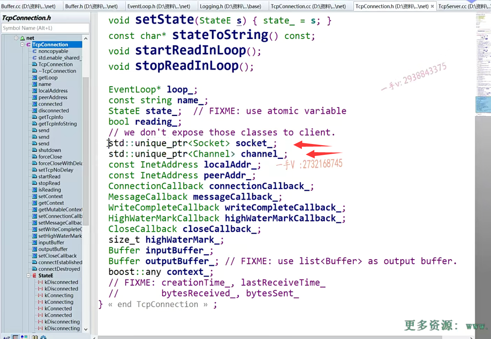

### 更重要的是预制的一些回调函数

更重要的是，什么更重要的还有两个，

就是tcp connection里边拿到了用户给这条连接预设置的一些呃

连接成功以后执行的回调，

这条连接上有数据发生执行的回调。

啊，这条连接上的这个数据写完了，就是服务端给这个客户端发送数据send数据写完了以后这个执行的回调，

还有一个高水位执行的回调，对吧啊？

这个高水位在这里边做什么事情呢？我们后边再给大家说啊。

然后就是连接断开。我可以执行你预制的这个回调啊，都这些回调操作都是在tcp connection里边儿封装的好吧啊。

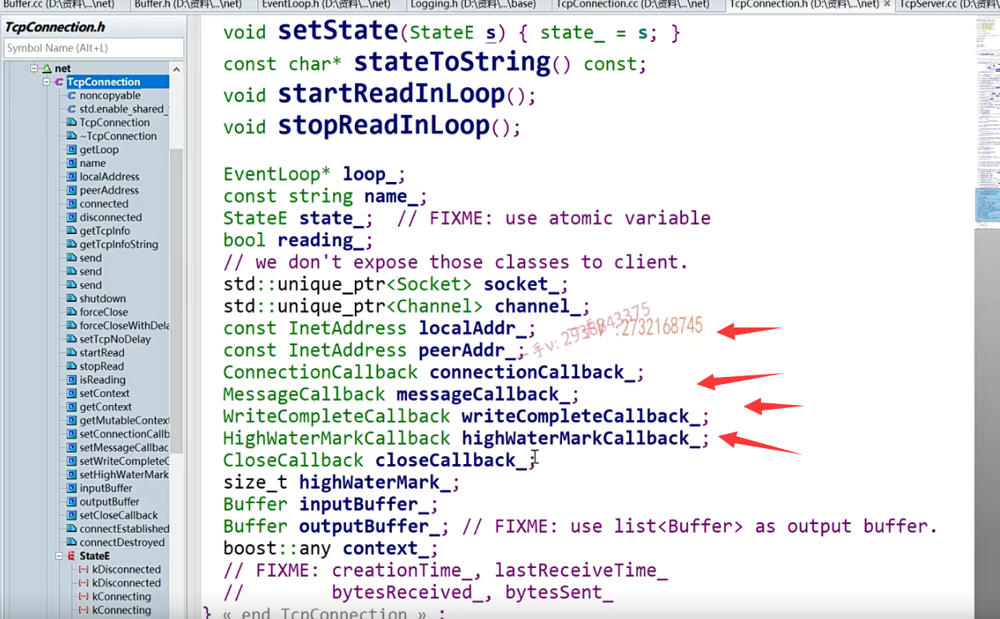

那么，在这里边还有另外一个重要的就是buffer啊，就是buffer，

那我们其他的我们都实现了啊。

啊，在这节课呢，我们重点不是说TCP connection了，只是说啊，我们实现TCP connection唯一缺的一个角色就是这个buffer了。

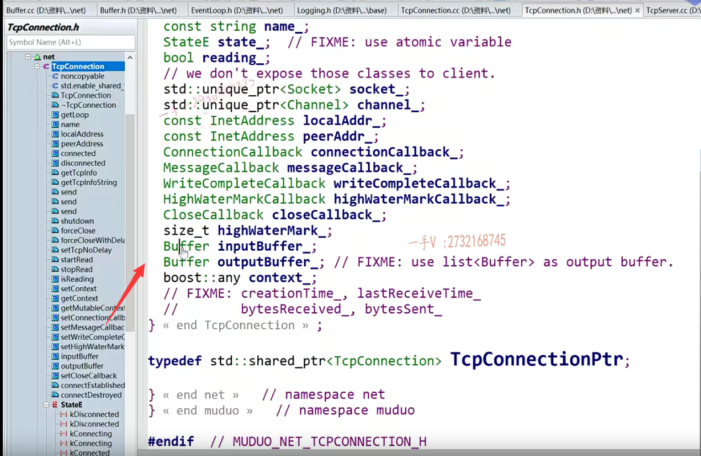

## 缓冲区的作用

通过这名字，我们都能知道它是一个缓冲区，对吧啊？

它是一个缓冲区。

这个缓冲区在我们这个基于nonblocking啊，非阻塞IO的这个服务端编程里边儿一个缓冲区还是非常有必要的啊。

### 可以解决粘包问题

而且呢，我们在TCP编程过程中经常出现的这个TCP的这个粘包问题对吧啊？

我们一般呢都会在通讯的数据里边儿去加一个，这个数据头数据的长度来描述数据的长度对吧啊？

每一次呢？根据我们数据的长度来截取相应的这个包的大小，进行一个这个反序列化进行处理，对吧啊？

那么可能这一次接触的数据比较多，但是我们应用呢，只需要读取，

只需要根据包头的大小读取一部分。

所以未读的那些数据呢，就得在缓冲区里边儿存储下来。

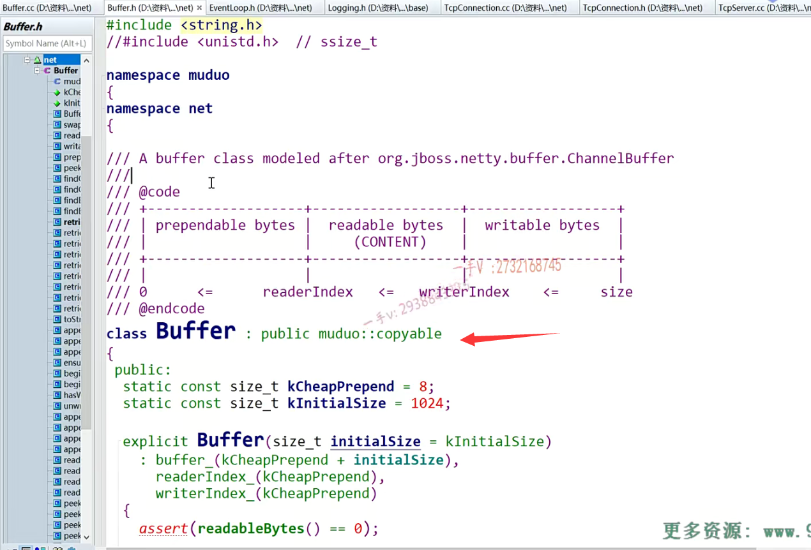

OK吧，我们发送也一样，发送也是一样的，

应用的这个要write的数据可能比较多。

但是底层的这个跟socket绑定的这个TCP缓冲区啊，大小可能比较小。

对吧，我们上次的数据无法一次性的，这个发送完成，

那我们这个未发送的数据呢？我们得在这个缓冲区里边缓冲起来。

没问题吧啊，得缓冲起来。

所以在我们这个非阻塞lO编程里边，一个buffer呢，还是非常的有必要的啊，非常的有必要。

大家来看一下啊，这个是对buffer儿的一个简单的，它的这个底层的一个描述啊，

它分为三部分，一个是prependable bytes，这是一个八字节的长度，大家看它定义了一常量啊，八就是八字节的长度。

==这个呢，主要就是来经常用来解决呢粘包问题，==

我们可以在这个头八个字节呢。放一个什么？唉，在这里边放一个啊，==这一次我要解析的这个包的长度对吧啊？==

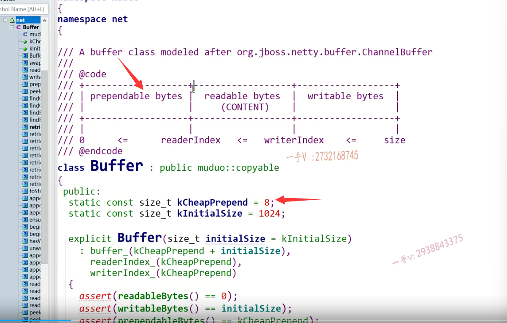

后边就是放的数据了。啊，后边就是放的数据了。

那么，如果你要向缓冲区里边写的话呢，你就从这个wirter index。从writer index指向的地方，你写应用程序，

要读的话，你就从reader index这个地方进行读，这就是可读的数据。

运行程序在读的时候呢啊，我们当前的这个socket有可能收到新的数据，对吧？

新的数据呢？就往writer index。从这个索引开始呢，往后写OK吧啊，

这个buffer呢，在这里边应该注释 buffer呃class mudeled after netty。

这是参照这个JAVA里边儿有一个netty库，

它人家这个netty也是一个第三方的网络库啊，

也是一个基于这个经典的在JAVA里边叫selector，对应的就是linux上的这个epoll啊。WINDOWS上的iocp啊。这个mac上的kkun啊。

在这里边儿呢，跟我们经常在linux上去写裸服务器的这个lO模型采用的是一样的啊。netty网络库底层的buffer在这里边呢，作者也是借鉴了人家的这个buffer的设计好，我们话不多说，我们来看一下啊。

这个图已经画出来了，所以它的这个成员呢？

非常的这个明显三个。三个成员变量，一个是vector。表示的那个数组对吧啊？

一个是reader index表示数据可读的下标儿啊？

writer index就是写数据。数据可写的这个位置的这个下标。

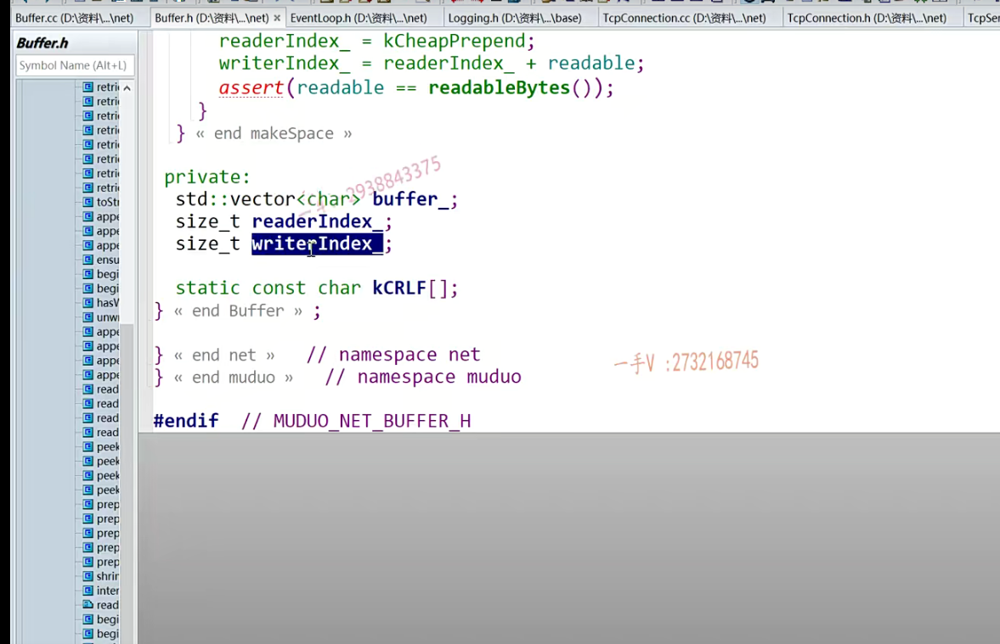

好，我们之前呢，已经把相关的这个头文件跟CC文件已经定义了啊，

这个是网络库底层的缓冲区类型定义啊。

好，大家来跟我看看public，再一个是private。

在这呢，我们用到vector。大家把vector同文件先已包含。

vector，这是char buffer。

okay啊，然后呢？是一个。cst.reader index.3 ST.writer index.好吧啊，

这是我们定义的三个成员变量。

然后呢？底下那个我们不需要啊。我们说了，最开始就说了，我们实现它的这个核心的这个。处理一些细节的处理呢。我们就省略了大家后续可以自行添加上啊。

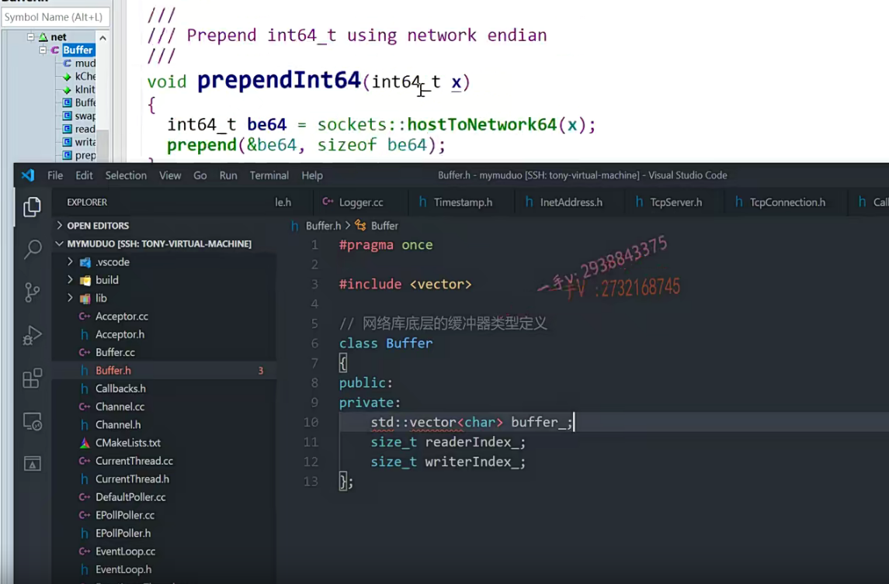

那么在这儿又定义了两个常量static const。一个是k。chip prepend.八啊

static const size杠TK。ial initial size等于幺0241k。

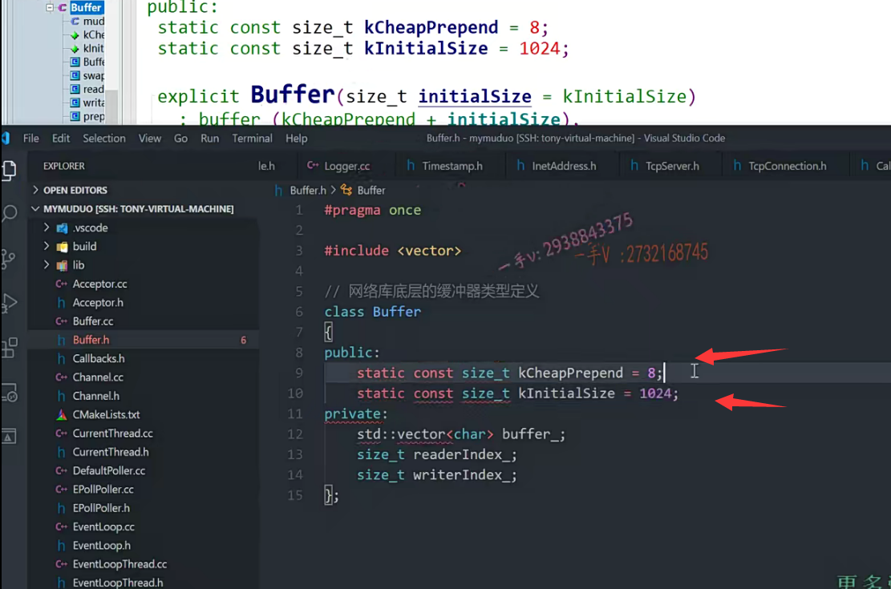

那这个相当于就是什么？

这个相当于就是它的这个前边这画的可以记录数据包的长度，对吧？

这个是后边这个缓冲区的，这个初始的大小是1024啊。

那我们来看看他的这个。各位，我们来看看它的这个构造函数，

同样啊，不允许默认生成这个对象啊。initial size.等于k。initial size给了一默认值。

这个是buffer。k chip.pretend加上。

那也就是说，这里边儿相当于给vector初始化，给vector初始化的时候呢？

第一个参数表示的就是给vector底层默认开辟的长度嘛，那就是8加上1024嘛。

就这个加上1024对吧啊，

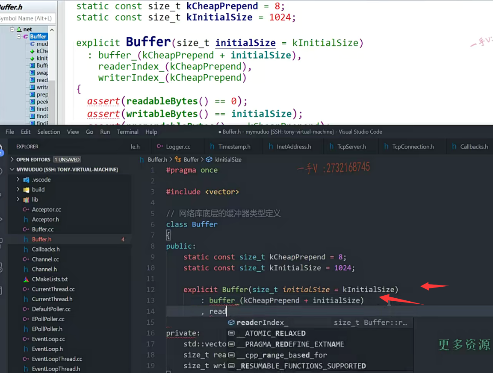

readerindex和writerindex都指向一个地方

那然后这个reader index指向哪里呢？k chip prepend啊。

writer呢？指向一个地方。是不是啊？指向的是一个地方。好，

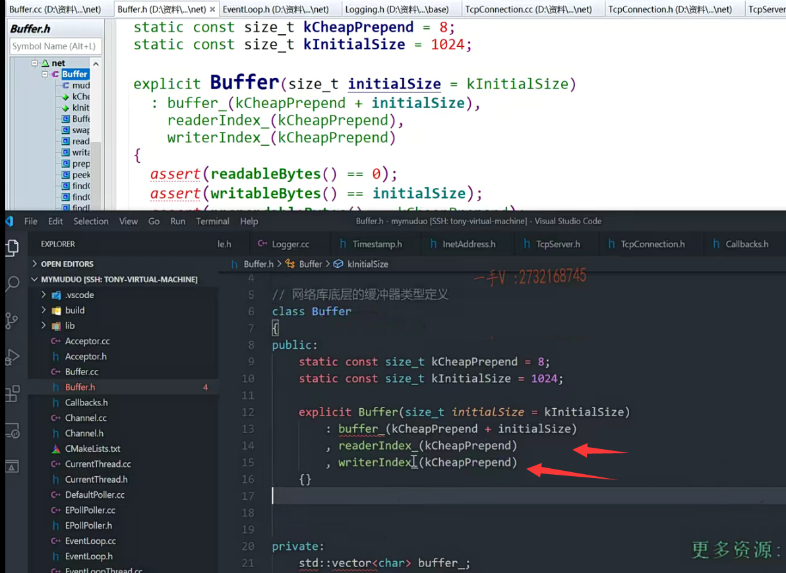

那大家来跟我看啊。在这里边儿，相当于就是reader index跟writer index刚开始指向的是都是这个地方啊，

因为刚开始没有数据嘛。

对吧啊，没有数据诶，这应该是属于reader index跟writer index初始的这个位置啊。

好在这里边都是一些断言，我们就不去用了。啊，相关的这个方法呢？

那么在这儿，因为它的成员变量是底层的，内存是直接通过vector来管理的，

所以我们buffer也不需要自己去析构什么资源了对吧啊？

当前对象析构的时候呢？成员对象析构哦vector在析构的时候呢？会自动释放外边管理的这个堆内存资源的啊。

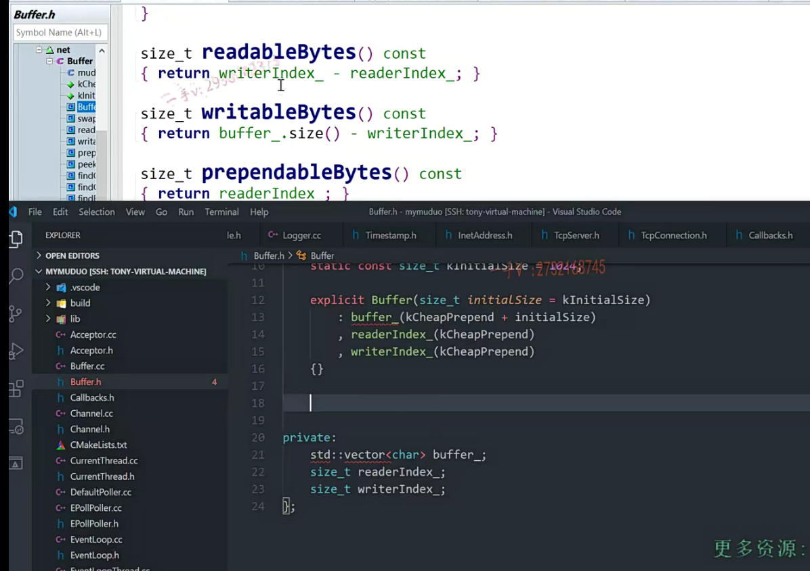

### 可读的数据长度

readable bytes.readable bytes.就是可读的。

可读的这个数据对吧啊的这个长度。writer index减去什么？reader index。可读的嘛。就是这一部分。中间这一部分好吧，就是可读的数据啊，可读数据。

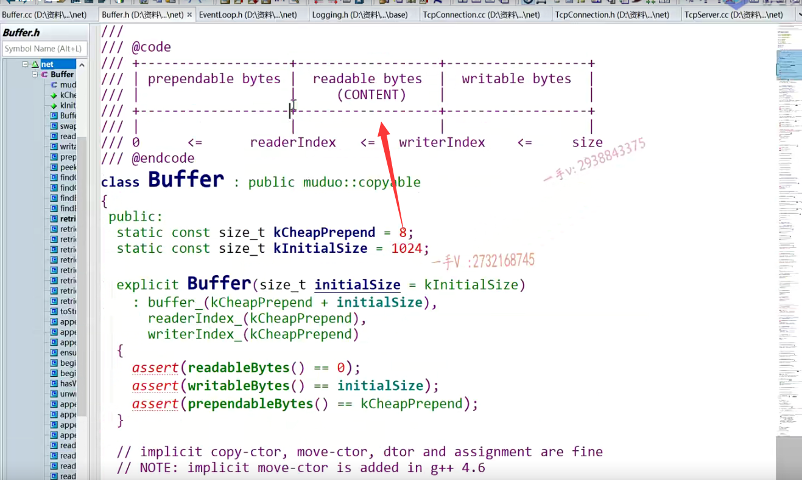

然后呢，底下的这个是什么size杠t？叫做write。able bytes.cost reader.buffer点size。减去什么呀？可读的数呃，可写的不是可写的数据的长度啊，

==这就是可写的缓冲区的长度，那就是整个的这个buffer的这个长度减去这个reader index。就这一部分。==

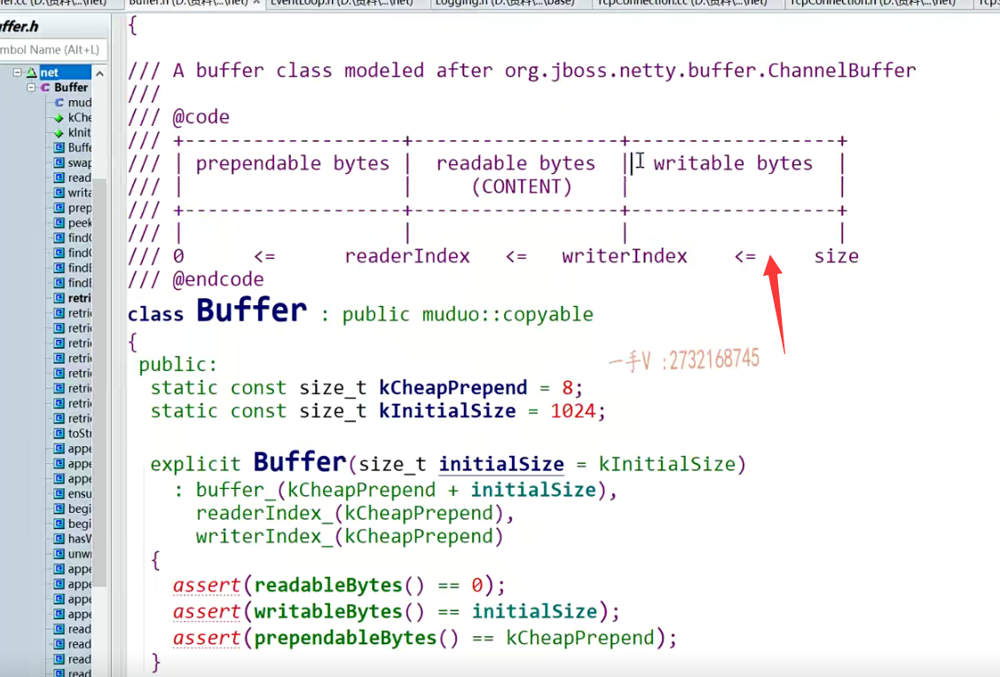

就是目前啊底层缓冲区可容纳你从fd从socket上读取数据以后可写的这个空间的大小。

够的话，那你就写到这儿，不够的话，你得扩容啊，对吧啊？

好在这里边呢，我们还有一个size杠t，prependable bytes。return.reader index.啊，

那就是。返回前边的前面的这一这这个空间的这个大小，那就是这个位置嘛，表示的就是前边这个空间的大小，对吧啊？可以prependable bytes。

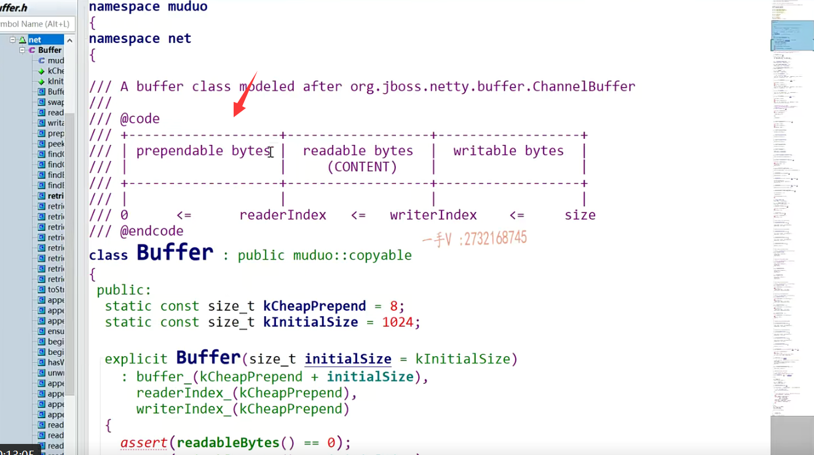

### 一些辅助方法 需要用到裸指针 ，那就把vector底层裸指针返回

好，那么在这里边儿相辅助的一些方法啊。

我们再看一下啊。大家注意，它底层的vector数组嘛，对吧？

但是呢，上边儿的方法操作的时候，需要的都是一些我们c的裸指针。

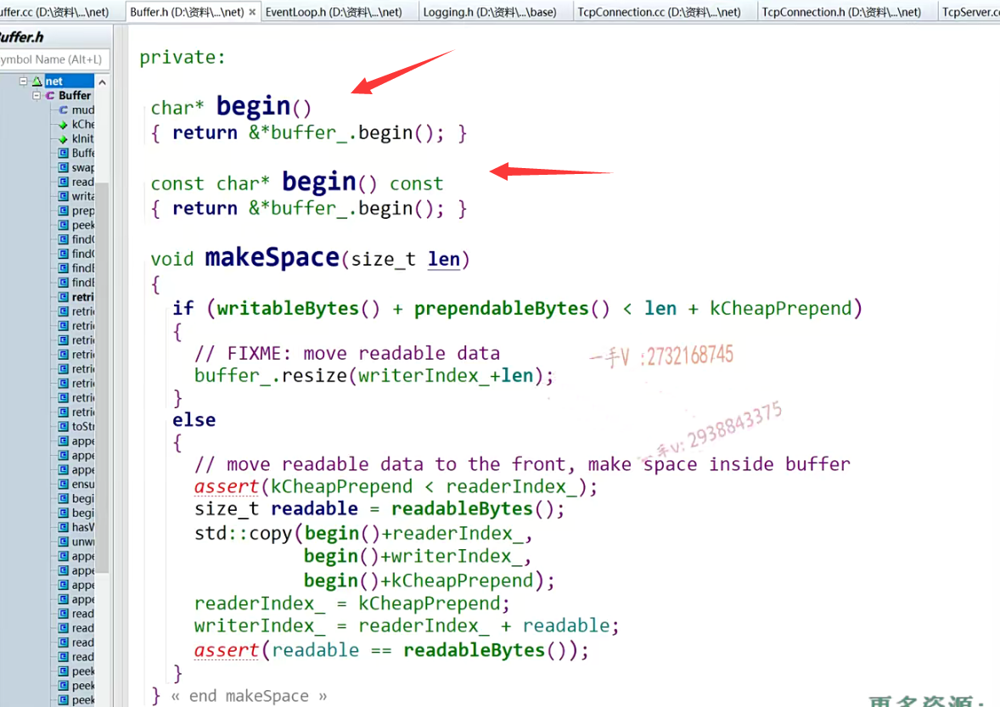

啊，我们不可能把vector跟裸指针直接画等号，所以把vector底层的这个数组的指针就直接返回回去了啊啊，

为什么用vector还用它底层的这个裸指针呢？

因为我们在操作这个数据的时候呢。

这个socket这个编程相关编程读取数据的时候需要用到这个裸指针啊，缓冲区的裸指针，

但是我们在这里边呢，为什么用buffer封装起来，用buffer封装起来就是底层靠==vector，到时候呢，我们缓冲区不够再进行扩容的时候呢，就非常的方便了好吧啊，==

毕竟vector在这里边给我们帮了很大的忙啊。

### 获取vector底层的这个数组的起始地址

呃，那也简单嘛，在这里边怎么去获取vector底层的这个数组的起始地址呢啊？

首先在这里边buffer的begin返回的就是首元素的这个迭代器嘛，

是不是再解个引用注意这里边啊？比较觉得这应该取个星号啊，再取个地址，这不是刚好没了吗？这不是还是一迭代器吗？一个迭代器类型怎么给一个叉星类型呢？同学们，

不要这么理解啊，不要这么理解。不理解你就完蛋了，

==在这里边儿呢，相当于先是调用了迭代器的什么星号运算符重载函数啊。==

好吧，星号运算符，重载函数访问的是什么哎？

就访问的就是容器底层第零号位元素的本身对吧啊，再取地址，这是干什么啊啊？

==这是相当于在这个的基础上。又调用了谁呀？唉，又调用了它的这个取地址运算符的这个重载函数。==

没问题了吧啊，或者这个你都可以不用理解重载函数了啊，不是重载函数了啊，

在这说的有点过了。啊，实际上还是一个意思啊，一个意思，

因为取地址运算符的重载函数，默认访问的就是数据的地址。那么在这儿呢，相当于就是获取了迭代器星号运算重载函数，相当于就是获取了迭代器指向的一个元素，

取个地址是不是就是？vector底层数组首元素的地址啊。

就是vector底下那个vector buffer底层数组首元素的地址，

那也就是数组的起始地址。起始地址。好吧啊，

不要在这里边说星号跟引用这个取地址符号就抵消了啊，没有抵消这么一说好不好啊？

#### 还给了常方法

你把它搞清楚。那么在这呢，还有给了常方法，

害怕就是当有常对象在用的时候啊。const那做的事情呢，是一样的。

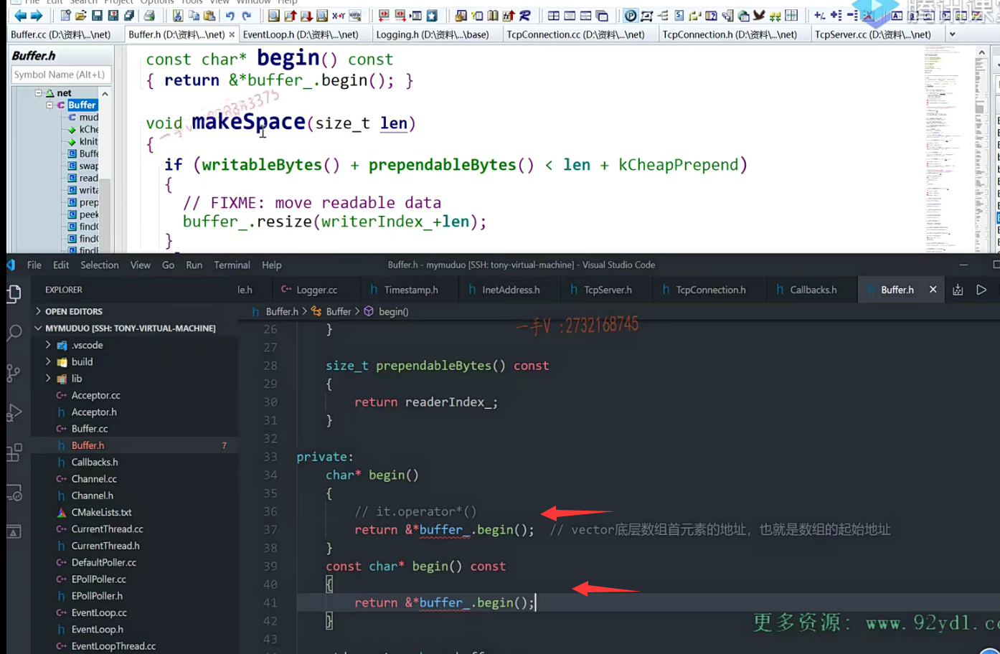

OK吧，这里边还有mix space来保证它底层的空间是否充足啊？

这个相关的接口还没有用到它，所以我们就先不实现它了。

那在这里边，我们刚才。往上看看啊，我们继续把这个方法相关的方法，我们实现完啊。

好，这里边我们又遇到了一个我们必须写的方法就是这里边儿的这个peak。

peek 偷窥的意思是吧啊，就看一下这这什么意思呢？

看哪儿呢？我们来通过它的这个方法的实践理解一下啊。

那这个peak返回的就是什么？这个begin是什么起始地址对吧啊？

reader index那相当于就是从这个数组的起始地址，加上这个reader index，

所以呢，这个peak就是返回的是什么？返回就是可读数据缓冲区的。

应该是返回缓冲区中可读数据的起始地址。对不对的啊？

你从它的这个了解它底层的这个实现它的方法，

这个具体怎么实现，你也就能明白了啊。

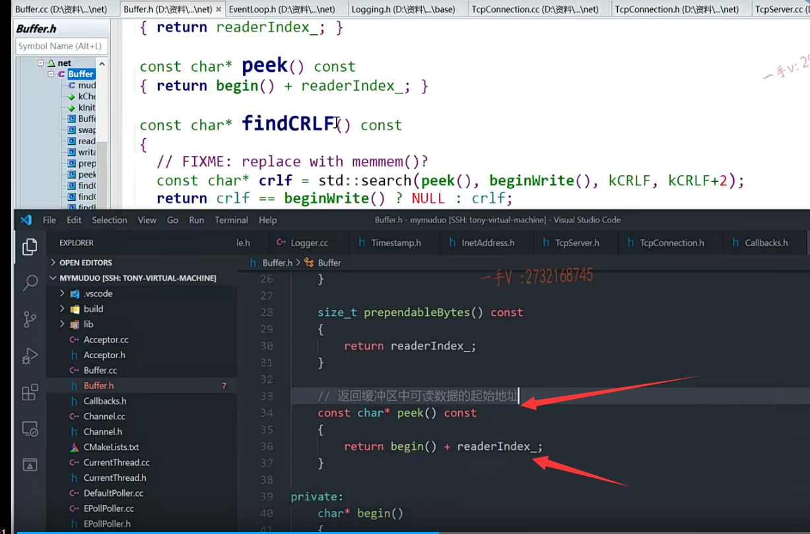

那么，这里边还有相应的这个。大家来看啊。tri Eve retrieve

为什么retrieve有用呢？

你应该用过muduo库嘛，你这剖析muduo库，你肯定先用muduo库了嘛，对吧？

你都用它做过项目。啊，我们用muduo库的时候呢？

在muduo库的这个什么的时候on message的时候呢？

这注册回调的时候onmessage是不是就是什么时候会？muduo库给我们调用呢，

就是底层的相关的这个connection有数据到来的时候对吧？

它把数据会放到一个buffer里边，我们一般都会调用buffer来retrieve alls string。

把数据从buffer转成我们C++的，是不是string类型啊呃？

从就是当前这个buffer类型转成C++的string类型，我们就可以进行相应的一些处理了，这个string类型经常会是一些数据。序列化以后的这个格式。json啊，proto buffer啊PB类型对不对啊？

这都是我们在实际的这个公司级的项目里边呢。

啊，经常用的一些数据的这个序列化协议嗯。

好，这个接口呢？我们先放着啊，都是都是retrieve alls能用到的这个接口。

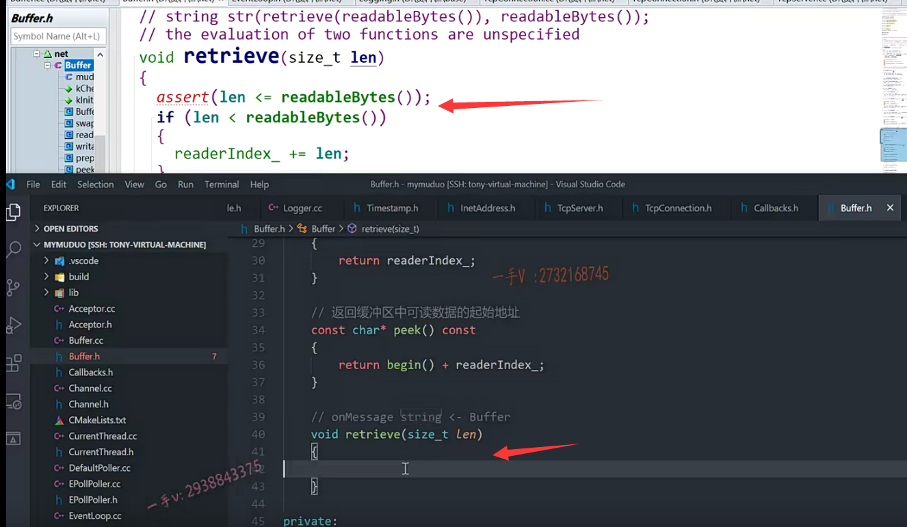

那么还有这个retrieve。retrieve all.STD还需要用到这个字符串，

我们包含一下谁呀？string这个头文件啊。STD.string trie ve.retrieve alls string，

这个是不是就是我们想用的这个方法啊？哎，想用的这个方法。

okay吧啊，这就是我们想要的方法，

==这个方法呢，最重要的就是把on message函数上报的buffer数据转成string类型的数据返回给我们应用所用对吧？==

这底层直接调用了retrieves string啊，封装还挺多的啊。

那我们再来。下边就没了啊，就是这个方法了retrieve。就不是all了，

这是ASS是吧？

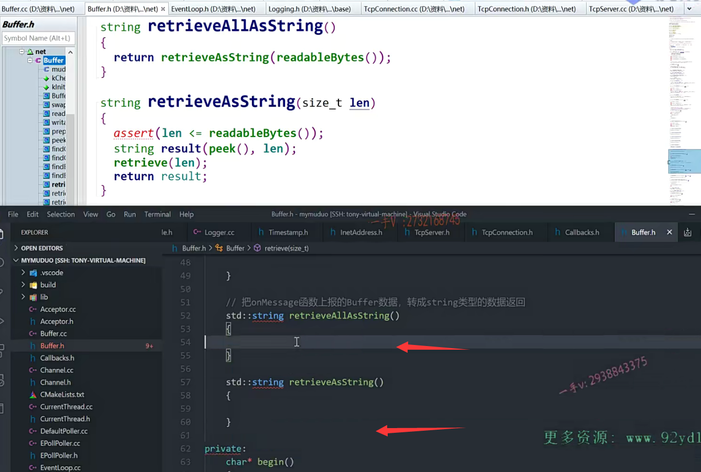

好，大家来看啊，

这个呢，是直接调用了retrieve alls string是直接调用了retrieves string。里边传了一个。

on science int的一个长度，对吧？

这是把什么传进来的呢？readable bytes。

这刚写了，这指的是哪一块的长度啊？

就是应用可读取数据的长度嘛。

那我们现在on message里边儿就是想调用buffer这个retrieve alls string，

当然是我们应用在这里边儿要读数据了嘛？

读数据的话，是不是这底层缓冲区？给应用准备的可读的数据就是在reader index跟writer index之间啊，

reader bytes我们前面写了嘛，readerable base就是writerer index-reader index，这没有什么问题吧？

好，这就是我们数据可读取的程度啊给应用进行返回处理，

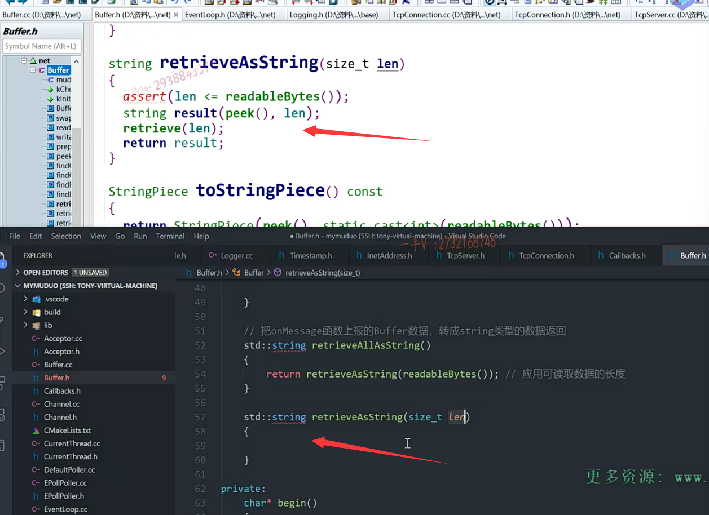

好在这里边首先一断言len，你得小于radiable bytes，

所以你这样就要读取的数据的长度，你得在可读取数据长度的范围之内。这两个是相等的，对不对啊？

==这然后又定一个什么STD？string result来peek，请告诉我peek返回的是哪一个内存的地址啊，peek刚这个应该都已经写了是吧？可读数据的地址。==

没问题吧啊，这个应该脑子能想来。

这现在啊，传进来的就是可读数据的这个长度，这peek就是可读数据的起始地址就是这个reader index那个位置。是吧啊，这就是len。

就从这儿开始。读这么长，就刚好把readable bytes这一块内存的数据就全读了。

好不好嗯okay？

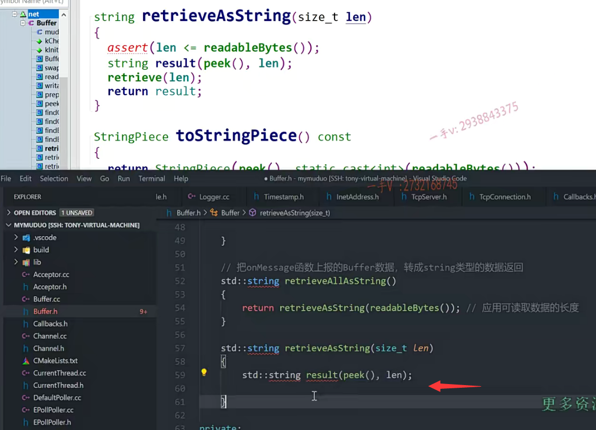

那么在这里边。再来啊。相当于就是用这一串儿，这一串儿的数据呢，来构造了一个result是吧啊？然后最后呢，把谁返回去了？result

最后呢，把这个result是不是返回回去了啊？

### retrieve缓冲区复位操作

好，那么接下来呢？接下来我们做的事情就是要定一个retrieve了这块是什么意思呢？

这块肯定肯定处理的，大家想一想啊。

上面把上面一句把缓冲区中可读的数据已经读取出来。

这里肯定要对缓冲区进行什么进行复位操作吗？是不是进行复位操作啊？

所以我们有retrieve来，

你可以脑子里边先想一想啊retrieve呢，在这里边要做什么事情了啊，要retrieve len。

现在呢，我们读取的这个。读取的长度是readable bytes，

所以这个len呢就是reader index的writer index之间的这个长度啊。

好看看它里边是怎么实现的呢？那么大家来看。

如果说你的len小于readable bytes。咱这个分支一会儿再看，现在咱的这个分支俩是一样长的对吧？

因为应用呢，把所有的数据就全读走了retrieve all stream嘛。是不是啊？

因为这个buffer里边，你看它还给你提供了一些read 64啊，read int 32啊就是。

呃，读取呢不同长度的啊，不同长度的这个接口对吧？

有可能你并没有一次性的把这个readable bytes全部读完，所以这里边retrieve有一个else分支。

我们相当于在这里边儿啊。这里边儿就是len跟谁是相等的red able bytes是相等的，我们现在是不是在应用层on message里边儿调用buffer的retrieve alls顺，

相当于就是这么一种情况啊。这么一种情况的话，那就是retrieve all了啊，它把这些接口呢，全部都封装成小函数。可以进行一些复用啊。

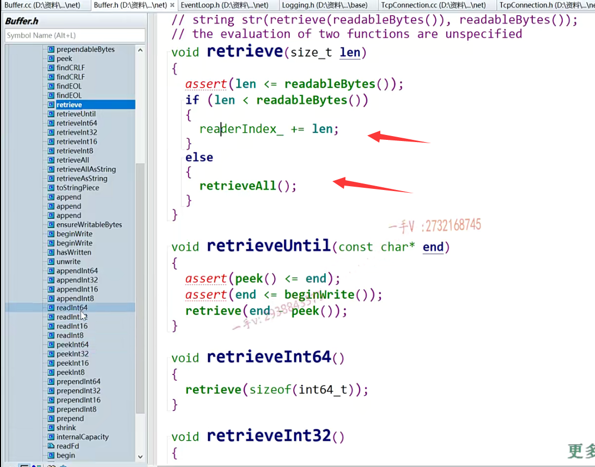

retrieval那就又成什么了？reader index.好，我们简单点吧，

writeindex=k？cheap pretend啊，

那相当于就是中间这个可读的都已经被应用读完了。所以那就没有必要再存了，

把writer index。直接拉到哪里啊？拉到是不是这个reader index就可以了啊？等于呢？这个位置好吧，相当于复位了，

是不是啊？因为现在呢，该读的都已经应用都已经读完了，

所以这一块儿呢，相当于缓冲区就空闲下来了。okay，

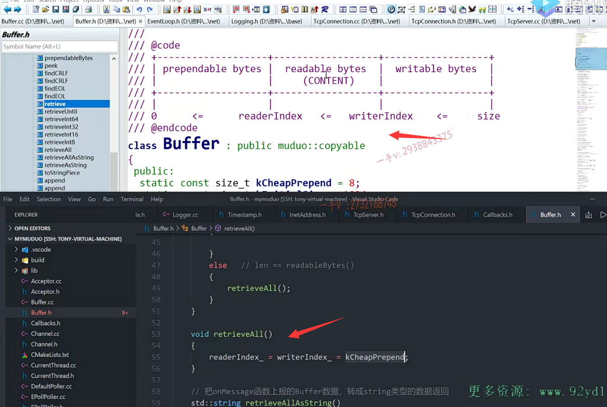

那如果说在这里边呢？

我们应用只读取了一部分。

这个可读缓冲区里边儿还有数据，是不是没读啊？

那在这儿reader index就怎么样？就加等len。

这块应该能看明白吧，能看明白是吧啊？

这个说明应用只读取了可读缓冲区数据的一部分。就是len长度。

那么还剩下。多少没读啊？

还剩下的就是从这个位置到哪里啊？do writer.index.就是从这个地址到write in that，write in that这个位置还有数据，是不是没读啊啊？

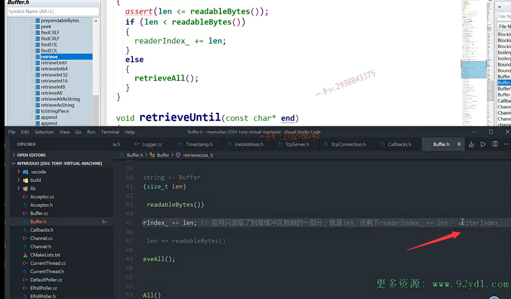

他就做了这么一件事情。OK吧啊，

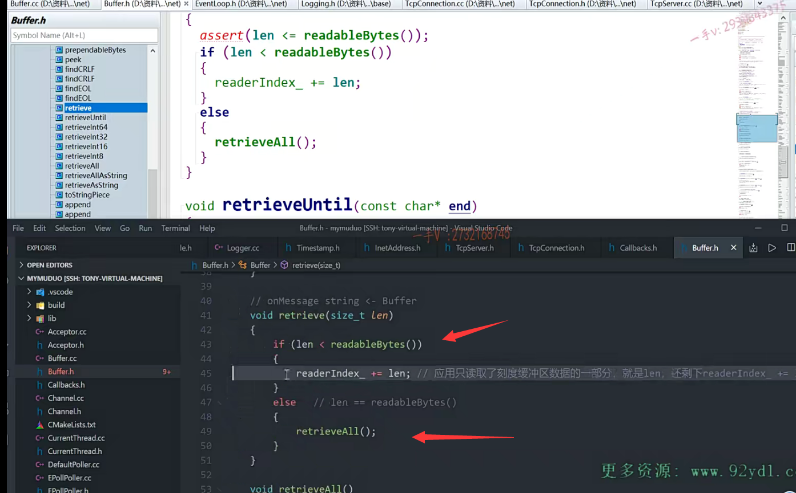

注意我们。在这里边输出的这几个函数。

它的含义围绕着这个缓冲区。把它搞明白好吧啊，搞明白。

看一下还有什么方法，我们需要去完成的啊。

还有这个啊。呃，我看一下相关的这个方法啊。

那我们来。把这个方法写完，我们结束这节课啊。

哦，还有这个pen的呢啊？还有这个pen的。

### ensureWriteableBytes，我要写的数据更长，需要扩容

写pen的之前先把这个写了吧？来，大家一起跟我看一下。就叫ensure write able.bytes

就是我现在要写的嘛。

我现在往缓冲区写，是不是缓冲区可写的就是buffer儿的size减去？writer是不是index呀？

但这个可写的缓冲区如果不够呢？

因为我写的数据呢更长。

ensure red able bed就是我现在要写这么长的数据。

我现在写这么长 len长的数据，那么这里边儿也就意味着len跟你剩下的可写缓冲区里边儿的这个数据的这个长度啊。

它又有一个大小比较了。

你可你要保证这么多长度的可写缓冲区，如果这个len小于等于我这个，

那你就直接写呗，

如果你len大于这个，那我是不是要考虑扩容了啊？

那么在这儿大家来看。readable bytes.如果小于len哎呦，那就不行了，

那你要写的多，那就makes base得扩容了，是不是啊？得扩容了。

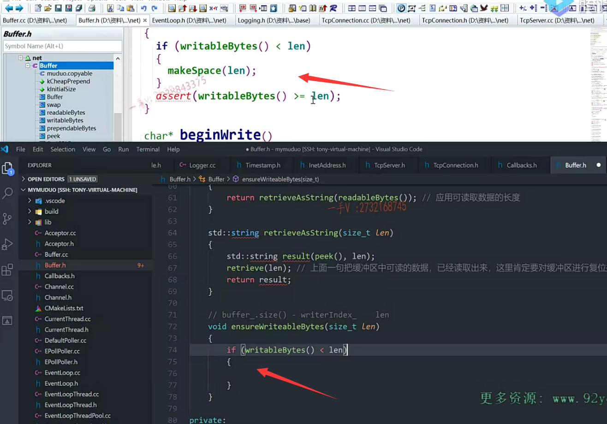

那如果呃是这个可写的缓冲区大于等于的，那无所谓，那你就直接写呗。

你在这里边加了一个断言是吧啊？

这实际上都不用加你,if要是没进来的话呢啊，这里边加了，

主要是看扩容以后是否满足这个条件，扩容以后那你肯定。你不够len，你才扩容，扩容以后你肯定得大于等于len啊，是吧啊？

### makespace()扩容函数

那在这儿，我们再写一个makespace，这就是它的什么函数啊，扩容函数对吧啊，来大家跟我在一起呢，把这个make space。这个扩容函数我们写完。

扩容函数，这个函数是在私有的里边儿，

大家先可以自己去试想一想怎么实现，如果让你写的话呢？你打算是怎么实现的啊？之前的扩容我们写了不少是吧？

在这里边儿呢，我们也是有两个。有一个判断条件是需要考虑的，大家先看一下啊，从代码上从人家代码上这个if这个表什么意思？

想一想，能不能一口给我爆出人家这个代码，需要表示的是什么样的这个逻辑含义？满足这个条件buffer直接resize。

很明显在这里边呢。我就担心我们有一些同学呢。对于缓冲区。不好好理解啊。

学习呢，耐心不够，总是火急火燎的跟救火队员一样啊。学习呢，静下心来。花同样的时间呢，你不断的着急啊。什么意思？什么意思？看着看了很多，最后都是稀里糊涂的。把一个东西呢，给它想透想明白了，这样不管是你理解对自己的提升，还是你在表达的时候呢，都会胸有成竹啊。

如果你连这一句你都看不出来的话呢，那我觉得吧。你的学习的效率呢？或者学习的方法。你就得改一改了啊。

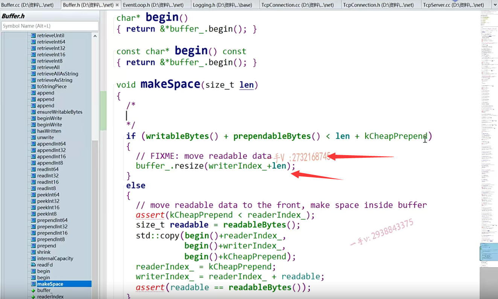

这是你要写的这个长度，

首先呢，你脑子里边要清楚。我们有一个什么？cheap print.prepend然后呢就是。这加了一个，然后中间就是。reader，然后后边这个就是writer。这是reader index，这是writer index。

你现在呢？要保证这么长的这个长度。

那也就是说呢。我现在需要的长度呢？还出去的程度。就这么长。len啊，就这么长。

我们为了满足人家的这个条件的这个表示，我们把这个len写长一点。啊，写长一点。

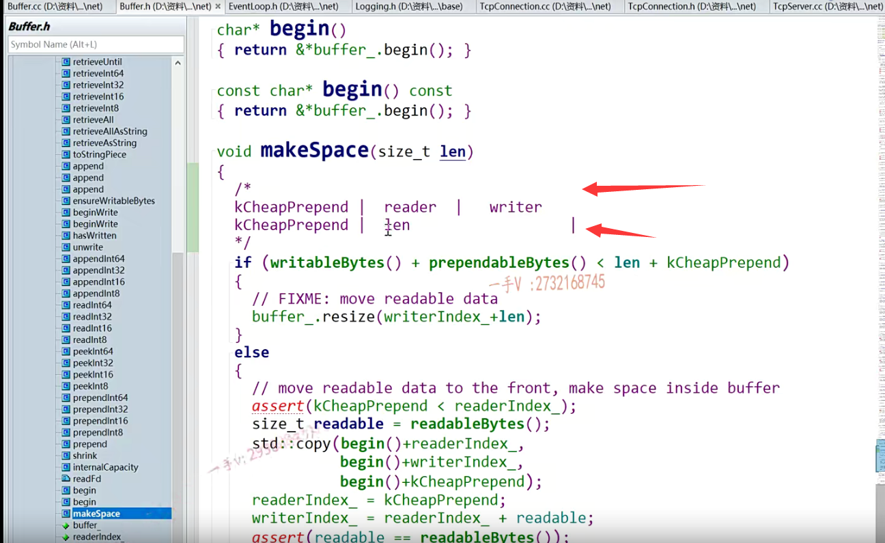

也就是说，你要开辟这么长的这个长度的话呢啊，加上它的这个数据的这个数据头，那么就是这么长一长度。

这是什么意思呢？

你中间的reader，这已经不能再写东西了，这是你缓冲起来给应用去读的，对吧？writeable bytes就是说这里边儿现在是可写的，是不是这个缓冲区啊？可写的缓冲区就是这么长。加上prepend able bytes，

==prepend able bytes返回的是什么reader index？==

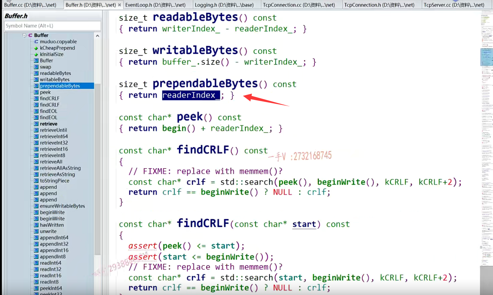

### readindex不一定就是在8字节这，如果有数据读了，那么就空闲下来了，那么readindex就往后移了

那么同学们。我请问reader index定是在这吗？一定是在这8字节的后边吗？

==他永远返回都是8吗？不是的嘛，肯定不是的嘛，是不是你再给我回答是你简简直是啊，前边的这个内容你根本没有听清楚。==

因为呢，在这里边reader这是给应用进行读取的。

有可能它并不是并不是每一次啊，应用都会读retrieve all string是吧？

它有可能只读了一部分。

你要只读一部分的话呢reader index是不是就跑到这儿来了？他只读了一部分，

只要是应用，把这一部分读走了，这一部分相当于就是空闲了。

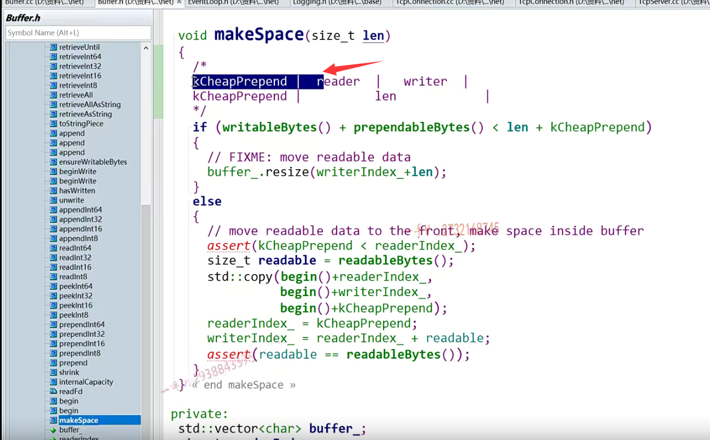

好吧啊，那也就是说呢，这句话是什么意思？

这句话就是我后边儿真真正正怎么样？真真正正可写的，加上你前边都已经空闲出来了。

你如果没有读的话，那空闲出来就是八个字节，如果你前边已经读了，在reader这个地方已经读了十个字节的话，那你这个pretend able bytes，那你返回的就是18。

把18个字节空闲的。对不对？

也就是说你真真正正前边已经空闲下来了，加上后边可写的缓冲区的大小还没有我要求的。还不够我要求的这个大小，那没有办法，是不是啊？

你怎么挪数据都给我腾不腾不出来，我需要的大小的，那你就只能怎么样？

只能进行一个resize了啊。

==想清楚啊，想清楚可谓writeable bytes加上pretend able bytes，小于len+kcheap pretend==

### 扩容直接在后面加

那在这里边就是buffer点resize多长呢？reader index加上了。

啊，你看他的这个操作呢，就是那前边就不管了，直接在后边。啊，直接在后边呢。gore size writerindex+len.啊，

这个长度是不是就比较长了？就是从这个位置written index加了啊。开这么长的。没问题吧啊，这后边直接再补上len个啊，补上len个OK？

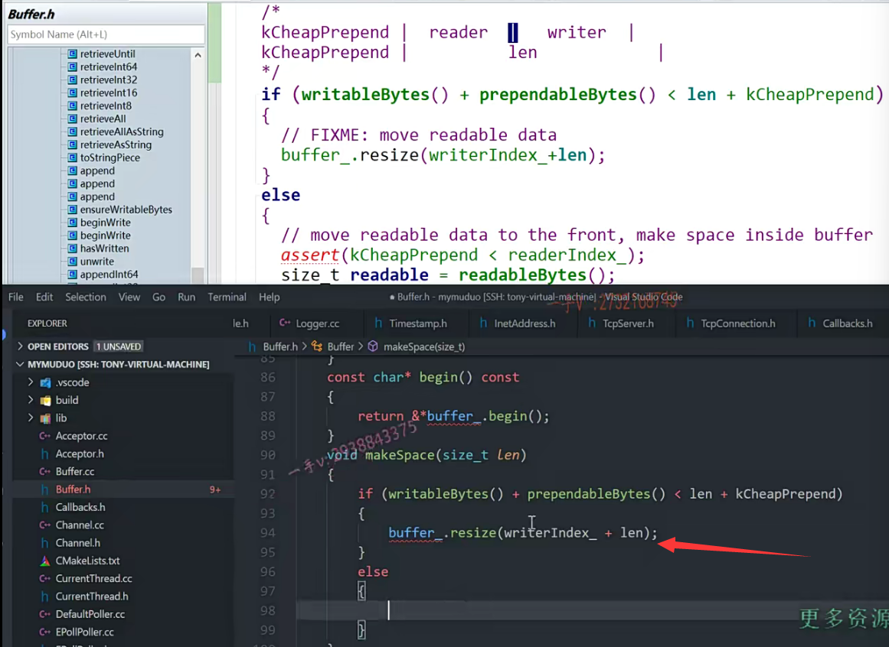

### writeable bytes不够，但是加上之前空余的readable index的够 len 的话，就可以把readbytes数据往前挪，这样write缓冲区大小就连起来了 变大了

那么如果说。各位else！

就是说呢，虽然呢，我的writer in writer就是可写的这个缓冲区呢，比你len需求的。怎么样啊？需求的要怎么样？哎，需求的要少，

但是啊诶，我随着这个应用读数据。我可读数据这一部分已经被运用，

读的这一部分的数据。就是缓冲区空闲下来了，再加上前边这八个字节，

你把这前边空闲的加上writer了，是不是已经足够你这个len了？

那我就把什么啊，我就把这些数据呢，怎么样啊，我就把这些数据统一的往前挪一挪，把这空前边空闲的空间。

==相当于把中间的这一部分还没有被应用读的数据往前靠，靠到最前边儿，==

==然后相当于就是把前边儿已经读的空闲下来的缓冲区，是不是就补给后边儿的可写缓冲区里边儿了？就连到一块了，==

==就可以足够需要的这个len的长度了，==

### copy泛型算法移动缓冲区内存位置

所以你来看啊，你来看在这里边

首先readable bytes现在已经不是中间这一块了，

因为它前面已经读了一块了，所以它是未读的这一块的长度。

==copy泛型算法对吧啊？==

那么从哪开始读啊？

从reader index那就是从诶这儿。读到哪里呀？

读到这儿这儿，这中间这个蓝色部分就是未读的，这是不是啊？

往这个哪里拷贝啊？

你看往begin加上cheap pretend就是往从序号来说，从往第八个位置。

是不是相当于把这一块的数据往哪里搬哎？往从这个地方的开始搬，搬到这儿。

那前边儿空闲的数据，空闲的缓冲区是不是相当于就是给它换到后边儿来了，

跟后边儿的可写缓冲区是不是连到一块儿了，

然后再把这个write index怎么样？再挪一下啊，

read index又跑到这个第八个来了，

read index就等于readindex+readable。可读的。

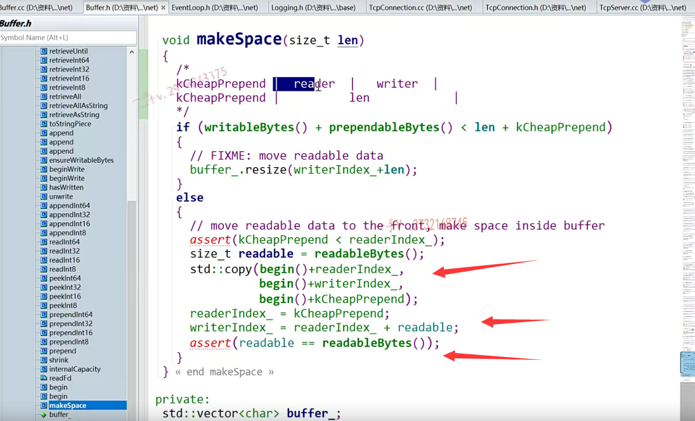

好吧啊。这个应该是。能想明白吧啊，能想明白这个应该不复杂啊。

那么，在这首先。size杠treadable=readablebytes。这就是未读的数据嘛，是吧啊？泛型算法同学们，我们得包含相应的头文件了啊。泛型算法。啊，

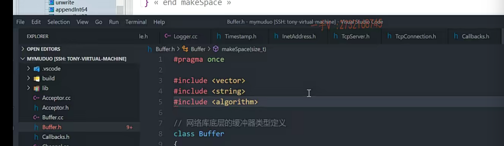

这里边就是谁呢？std copy.begin.加上reader index第一个参数。对不对啊？

然后再是。begin.再加上writer index，这是可读的。就是还没有被应用读取的这个缓冲区的这个区间啊。

往哪里拷贝呢？k cheap prepend.往这个地方靠背拷贝完了以后呢，

这个reader index是不是就又回到原位置第八个位置啦？

writer index呢，就等于reader index。加上还未读取的数据的长度就是readable。

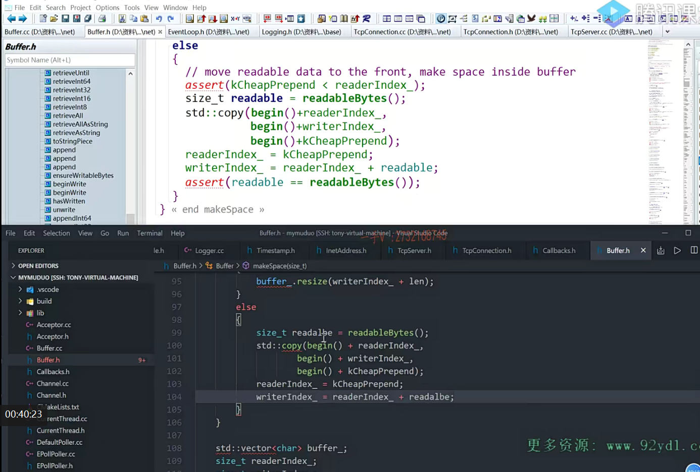

这没问题吧啊。好了，那这个所谓的扩容操作就完了，针对于我们的缓冲区。

## 总结

好，这节课呢，大家主要是把这个buffer 1是把buffer存在的意义，

第二个就是把buffer的底层的这个数据结构，

第三个就是我们输出的这些相关的方法。先意义理解一下，

然后再把代码输出一下啊，我们接口还没有说完，

下节课我们再继续。