这节课呢，我们再说一下，buffer的剩下的这个接口啊，剩下的这几个都是比较重要的啊。

## append()函数

常用先来看这个append就是添加数据嘛，应该不是应用要发送数据啊，

就是我们从fd上啊。我们有两个嘛，一个是input out buffer，

一个是output buffer，对吧？

也就是不管是从fd上读数据写到缓冲区，还是我们应用发数据，要往这个缓冲区里边儿去写的话呢？

在这里边，我们都得在这个write able这个缓冲区里边是不是添加这个data数据啊？

啊，这就是我们写的这个append的这个意义所在啊，

大家来看append append。const叉星。data啊，size杠t len。

那么，这个是怎么去处理呢，

先ensure。len唉，先是保证你有这么长度的，这个空间是不是可用啊？

唉，没有空间，空间不够，你就怎么样啊你就分配resize更长的空间啊，

如果你整个空闲的空间够的话呢，因为前边有空闲的空间，后边有空闲空间，中间有未读取的数据，对吧？

他就把中间未读取的数据向前靠啊，然后呢，把前边儿空闲的空间相当于就让到后边儿来了，是不是？

好，那在这里边儿，接下来就是一个STD。copy.data.data+len.往这个data这里边。进行怎么样啊？进行拷贝。

呃，这个应该是把前边儿的数据呢？往第三个参数的地方开始拷贝

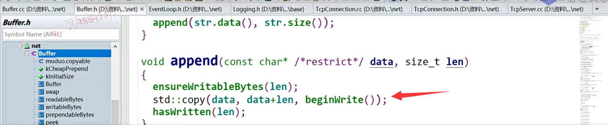

### 先来完成的begin write（）

begin write？beginwrite这个接口我们应该还没写是吧？这个简单啊。

这个就是从这个底层vector的，这个数组的起始地址加到这个write index，

这就是可以写的这个地方嘛，对吧？

char * begin write？okay，

那在这里边就是return begin加上什么？writer index啊。

还有就是再写一个const常方法。

小心有常对象来调用是吧啊？可以减少我们编译错误return begin，再加上什么？writer index啊。

好，那在这里边的这个append就是。begin,begin,write?

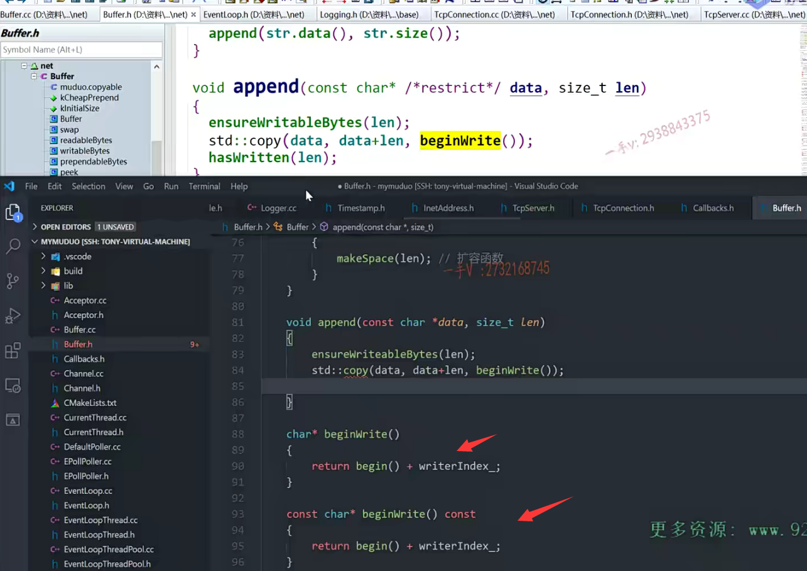

okay吧诶，就是把我们的数据呢，把你要添加的数据。提交到可写的缓冲区当中啊，

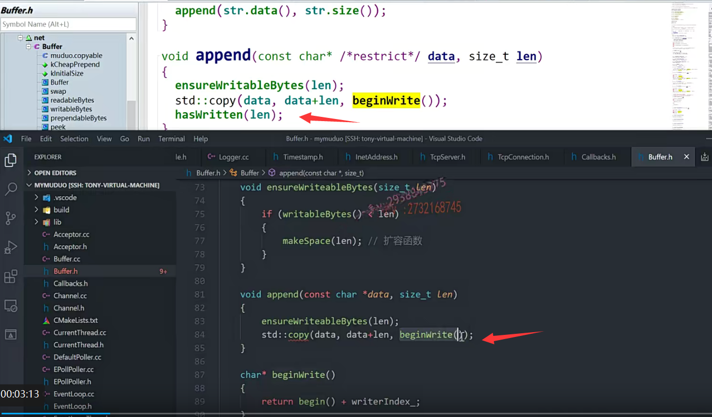

当然你要把这个write index是不是要移一下？

它这个封装了一个has written啊。

has written在这里边儿呢，就是先做了一个断言啊，接着呢，我们直接就把这句话呢，written index加等len。就放到这儿就可以了。

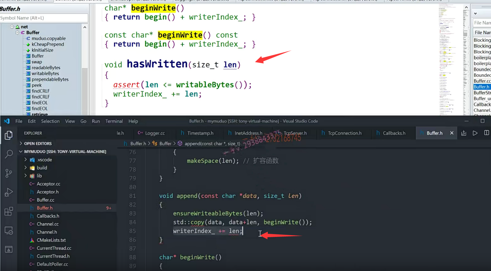

这就是append添加数据好吧啊。

这个把data data+len这个内存上的数据。添加到write able缓冲区当中。

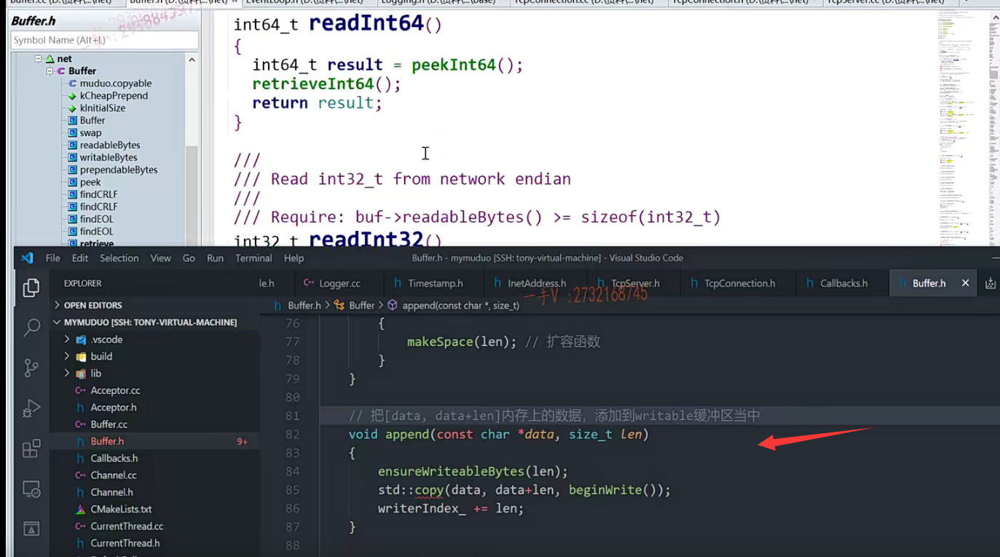

好，那么接着我们还有一个方法呢，就是比较重要的啊，

因为它是buffer嘛buffer里边这就封装了，我们的read跟write，

但是好像这里边儿它muduo库在做的时候呢，

我觉得这一块儿它封装的不是非常好，它把read 放到这儿write又进行一个裸编程了啊。

那我们先不说write，到时候再写TCP connection的时候呢，用到write的时候呢，我们再来改造一下啊，再来添加一下。

在这儿呢，它先是给出了这个方法啊。s4s杠t，这是一个有符号的整型锐的fd。

in TF dint.save

因为读数据是要往缓冲区读呢，对吧啊？buffer本身就是缓冲区，所

以它把这个从fd上读数据的这个方法直接封装在buffer里边了，合情合理是吧啊，合情合理。

从fd上读取数据。这个方法是非常不错的啊，从这个方法里边我们也要学到人家一个linux里边常用的一个系统方法。啊，

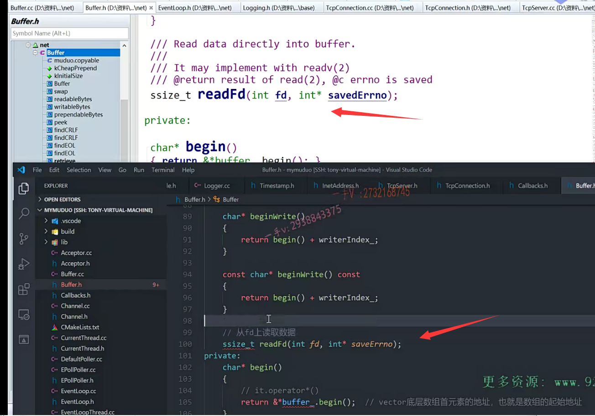

我们一起看一下。效率是非常不错的啊，buffer儿点h。buffer一起来看看。

首先呢啊，就是这个方法是干什么的？

这个方法就是读数据的嘛，对吧啊，读取数据。

从这是从fd上读取数据。

那至于muduo库，它的这个fd呢？默认工作是在LT模式的，

就是它底层的这个poller啊工作在LT模式，

那也就是说fd上的数据没有读完的话呢？底层的poller会不断的去上报是不是啊？

==所以用LT的模式，它的这个好处之一就是说是数据，它是绝对不会丢失的啊。==

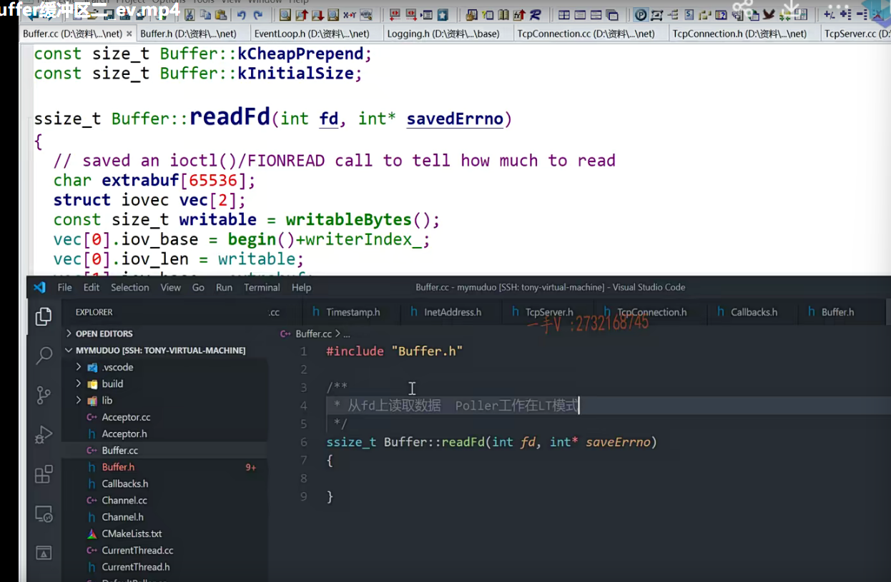

## 关于底层buffer的申请大小的考虑

那么，在这大家来考虑一下。我底层的这个buffer缓冲区是有大小的。对吧啊，但是从fd上读数据的时候。却不知道TCP是流式数据嘛，对吧啊这个？

却不知道TCP数据最终的这个大小。

所以呢，就读数据我没有读完，我哪知道呢，它这个数据的大小有多大呢？对吧？

那我没有读完的话呢？那我得一边读一边把这个数据往缓冲区放啊。

是不是那没有读完，我不知道数据的大小，

那我之前在接收数据的这个缓冲区，我也不知道得确定多大呀。

啊，我不管它的大小，那我读着读着，缓冲区不够怎么办？

或者说是我把缓冲区开的特别特别大，我保证你能够把数据写完，

那我开那么大的话，内存浪费了怎么办？

那这buffer呢？底层是vector申请的，都是堆上的内存。是不是啊？

你开那么大，用不了你一直放在那儿，是不是有点浪费呀？

对，所以在这里边大家看一下啊，大家来跟我跟我看一下，这里边我们一边写一边去解读一下这个方法。

这边应该还要用到这个全局的erron错误号啊，所以我们包含一下相应的头文件。errno.h。

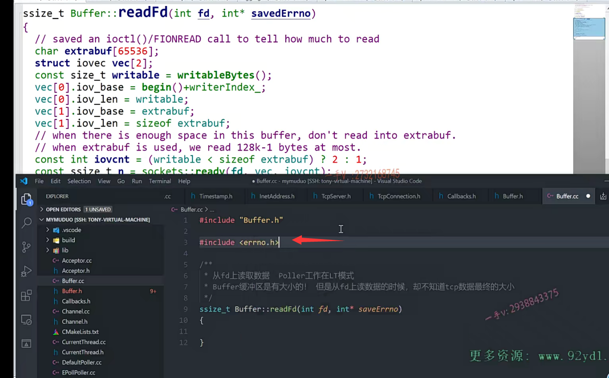

这里边儿首先是char extrabuffer叫做65536。okay吧。

同学们，这是栈上了内存。栈上了内存空间啊。内存空间。好了吧啊，

栈上了这个内存空间。

那么这里边struct iovec.VC中括号二。

啊，这个不是vector是什么东西呢？

那么大家来看一下这里边人家给你推荐了read v。跟write v函数。

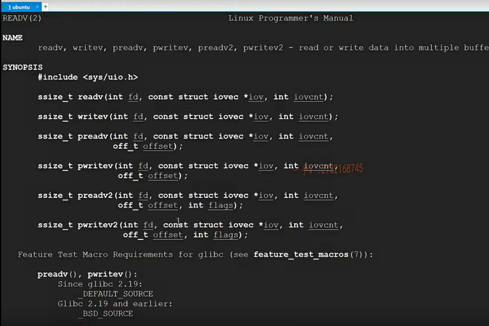呃，大家之前有没有用到过呢？我估计是应该没有用到过。因为大家没有写这个比较正式的这个网络库的话呢，

你底层缓冲区可能也不会考虑的这么周全。

对吧啊，但是read v跟write v是一个非常重要的，非常强大啊，功能非常强大，两个函数啊。

那么你看一下there adv system call，这是一个系统调用read LV cnt。

第三个参数 是个数对吧？

buffers from the few associated with the few descriptor ft into the buffers descriptor by LV。

啊，它的一个非常大的一个作用，我看啊，后边有没有？

你看love c里边放的是啥？放lov base starting address就这个结构体呢，有两个成员分量。

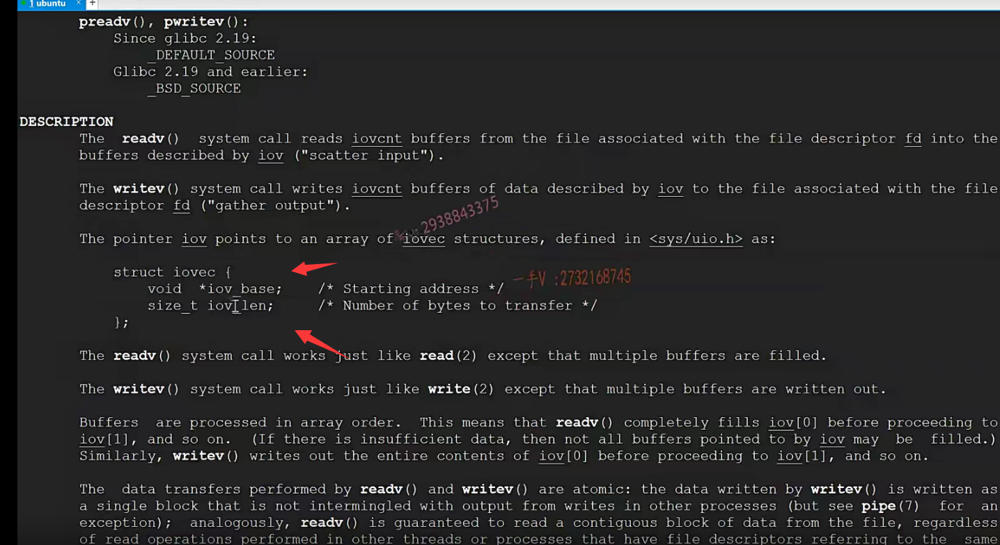

第一个成员分类要放的是一个缓冲区的，是不是起始地址啊？

第二个放的是这个缓冲区的长度啊

## readv和read的区别

### readv可以指定多个不同缓冲区

read with system call works just like read。啊

read首先它可以读数据啊

except that multiple buffers are filled

==就是read呢，普通的read你只能往一个连续的缓冲区里边是不是放数据啊？==

你看这个read v啊，可以根据你传入的这个iovec结构，这表示的一个内存的这个起始地址跟长度。

啊，你可以传多个，因为这里边第三个参数不是有一个lov cnt嘛，对吧？

那每一个lovec表示的都是不同缓冲区的一个起始，地址长度，

==那就是readv呢，可以根据呢？读出的数据自动的去填充多个缓冲区。==

就这些缓冲区，不需要在一块readv，可以根据它读出来的数据呢，自动的填充你输出的这些缓冲区。这就是它这个功能。

好跟我看啊，这const size杠t。write able等于writeable bytes.

这是这个buffer啊，底层缓冲区剩余的可写空间大小。一定够存储fd上读出来的数据嘛，不一定啊，它真不一定是吧啊，不一定，所以在这里边大家来看看啊。

点LV这里边我们得包含相应的头文件啊。在哪呢？在sis UI o点h里边啊？复制包含一下相应的头文件。

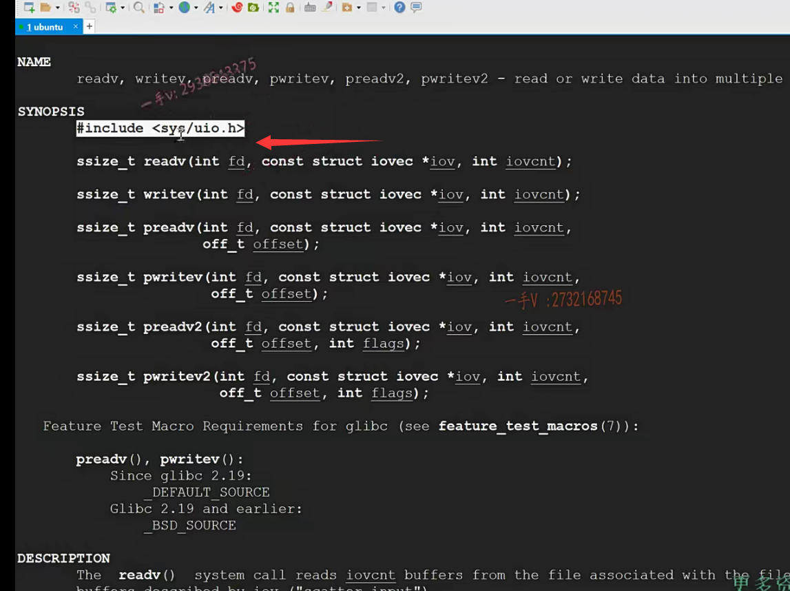

### 第一块缓冲区大小

点LV base等于谁呢？

等于begin()这块内存的起始地址对吧啊？write index 

OK那vec 0，它的这个LV len等于谁呢？

就等于write able嘛，上边写的这是第一块缓冲区了。啊，这是第一块缓冲区，大家看到了没？

### 第二块缓冲区大小

来在第二块一点lov base等于谁呀？等于extra。tra extra buffer.好吧ve ce点lvl en。等于size of extra buffer。有没有啥问题？

这里边是给出第二个。

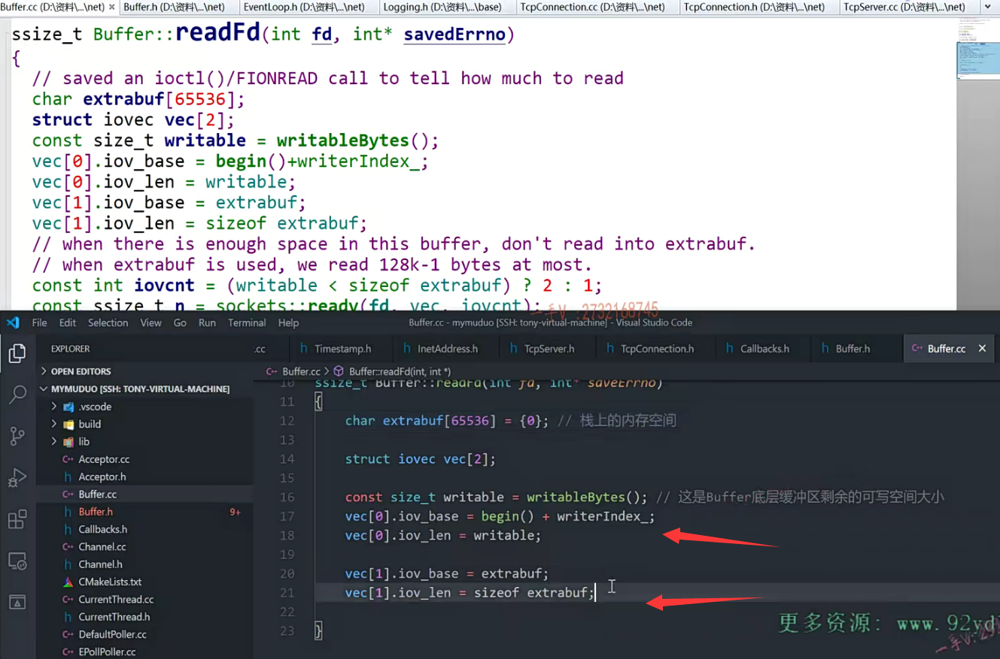

那也就是说呢，在这里边儿栈上的空间分配的效率可是很快的，

而且呢，出入作用域呢，是不是内存就自随着函数的栈帧回退呀？

这个栈上的这个数组空间的内存，就自动的就回收了。

是不是啊？自动的就回收了。效率是相当高，

### readv读入缓冲区逻辑  优点

那么当我们用readv从fd上读数据的话，

它会先填充这个就是VC0描述的这块缓冲区。

如果呢，这块够的话。这块就不用管了，

如果这块不够填，它把这块填满以后，它会自动的把数据填到这个extra buffer里边来。

到最后呢，我们看extra buffer里边儿，如果有内容的话，我们把extra buffer里边儿内容直接添加到我们的，是不是缓冲区里边儿啊？

那这样的结果就是缓冲区到时候呢，是刚刚好存放我们所有的需要协助的内容，一点儿空间都不浪费。对了没有？

啊，而且我们buffer呢，最后中需要多少空间？

我们根据xx extra buffer里边的这个。就是有效数据的长度，再去分配多长的空间，所以它的这个空间内存空间的利用率呢，是非常高的啊。

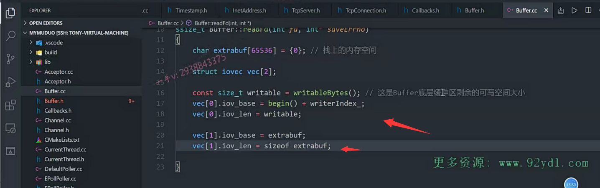

好，接着来看。

const int.IO v cnt.

它在这儿是写了一个啥东西呢？readable如果小于size of谁呀？extra啊，

它做了这样的一个逻辑处理啊，各位。

就是write able就是这块缓冲区的这个长度呢，如果小于谁啊？如果小于这个。65535.好吧，这是个字节啊。算一下65535。诶6553几啊6536是吧？65536÷1个1024啊。64k.

64k的空间啊。

==那么也就是说呢，如果呢，这不够64k的空间。是不是啊？那么在这儿我就选择二。选择二，如果说是write able，已经是大于等于64k了。那么就选择一只需要第一个空间，==

### 一次读取64k

那也就是说啊，从这我们就可以看到啊，它一次最多读多少啊？

==它一次最多是不是读64k的数据啊？哎，读64k的数据。没问题吧，他最起码要把64k的数据要读完啊。==

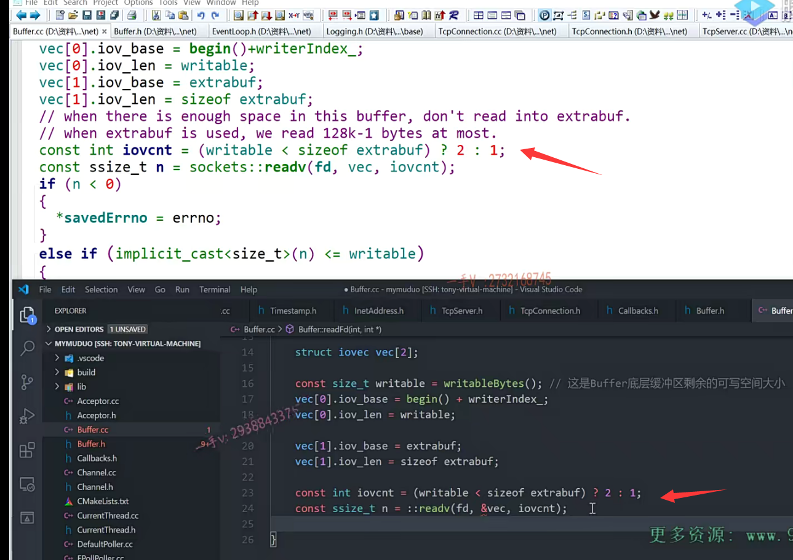

好接着呢，就是const size。杠tn等于什么呀？read我们就直接readv了啊，

第一个参数就是fd，第二个参数是什么啊，第二个参数就是vec。

okay，第三个参数就是lov cnt。好吧，它就这三个参数啊123。

好。那么，在这里边大家来跟我看一下，

如果n小于零的话，那就证明出错了啊，

通过这个参数save error number啊，把这个出错的这个数据我们带出去。

实际上，在这里边，到时候可以加一些日志打印，对吧？在调用处加就行了。

### 本身缓冲区大小够了

else if大家来看，这里边的n如果小于等于writeable。

这表示什么意思呀？

就读的数据小于等于这个writeable啊，小于等于write able的话，

那也就是说我这个buffer本身的这个可写空间是不是已经足够存了啊？

那在这里边确实比较简单啊。而且它存储的这个缓冲区的效率啊，是非常高的。

这个存完数据以后呢？直接怎么样？

直接在这里边儿read index直接加了一下对吧？数据是怎么放进去的？

数据是通过readv直接放进去的。因为我们给它已经写好了，这个缓冲区的起始起始地址了。okay吧啊。

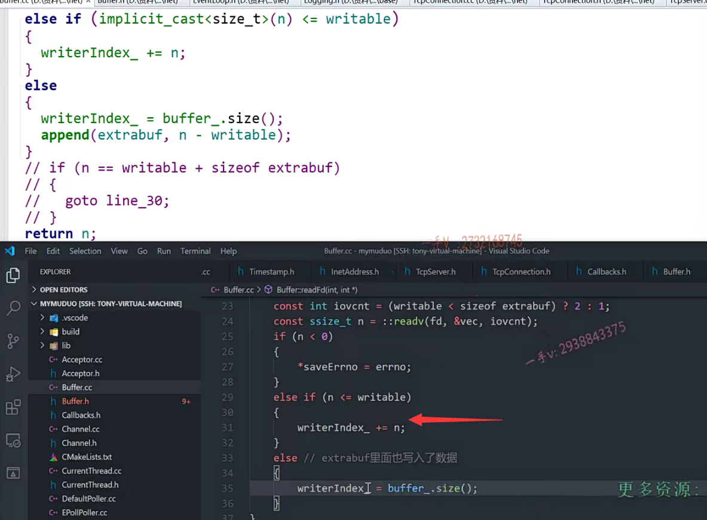

那么再else。再else的话，也就是说这个表示什么呀？

这个表示啊extra buffer里面也写入了数据，对吧？

因为n大于write table了。那在这里边啊，就要根据extra buffer里边有效数据进行buffer扩容，扩容以后再把数据添加进去，对吧？

==好writer什么w rater writer index等于这是buffer的这个s。==

==那也就是说已经放到最后了，是不是啊？==

==然后调用了这个append之前写的这个pend。extra buffer，==

==然后是n减去谁write able==

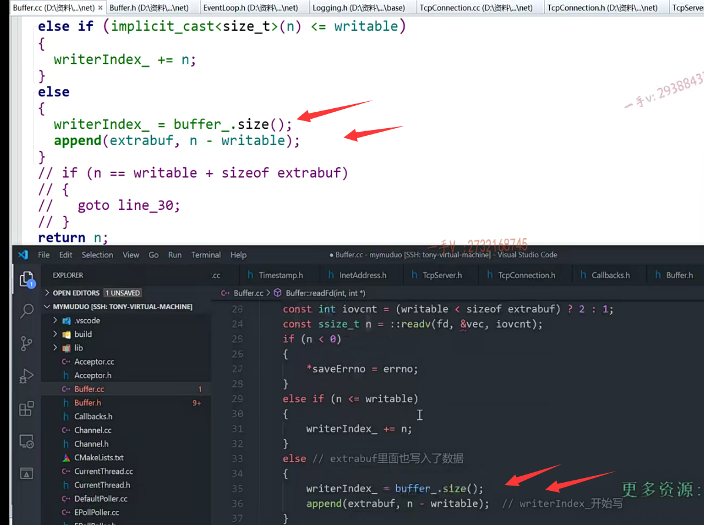

好吧啊，那这句话是不是就是从read index开始？

因为它往extra buffer里边儿写之前，肯定是能往extra buffer里边儿写，肯定是把这个原来buffer的可写缓冲区已经写满了，是不是？

啊，开始写的数据在谁里边儿呢？

写的数据在这儿写多少呢？总共是读了n。write buffer，write able里边已经写了。写了write able字节的这个数据了，

那么也就是说在extra buffer里边存的数据呢？那就是n-write able。

没问题吧诶，那这个就没有问题了，开始写。n-write able.大小的这个数据。

啊，数据从哪儿来？从extra buffer里边儿来。

好吧诶，这个没有问题，

最终呢，我们把这个return n。就是读取的字节数，我们给它返回回去。

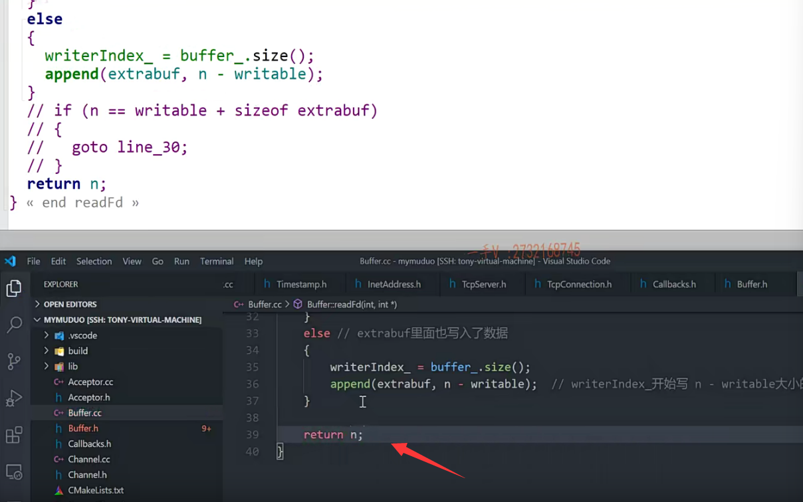

大家看一下这个read。

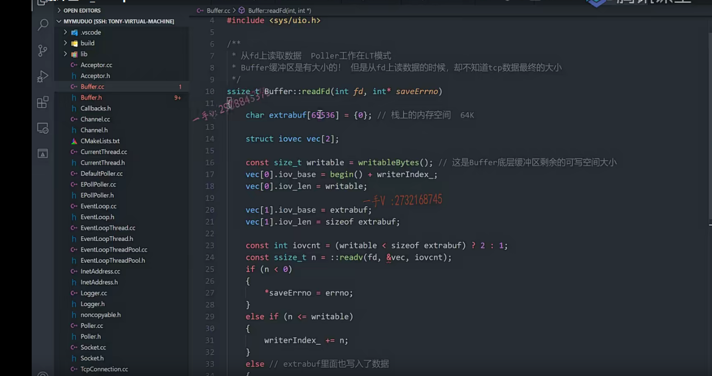

我觉得大家从人家muduo库这里边的这个操作，

希望大家把这个readv，还有writev呢，这个系统Linux系统调用记住。

它的这个效率还是非常不错的，

==它可以在非连续的多块缓冲区里边去写入同一个==，这个不用取地址了，

数组名本身就是地址啊。

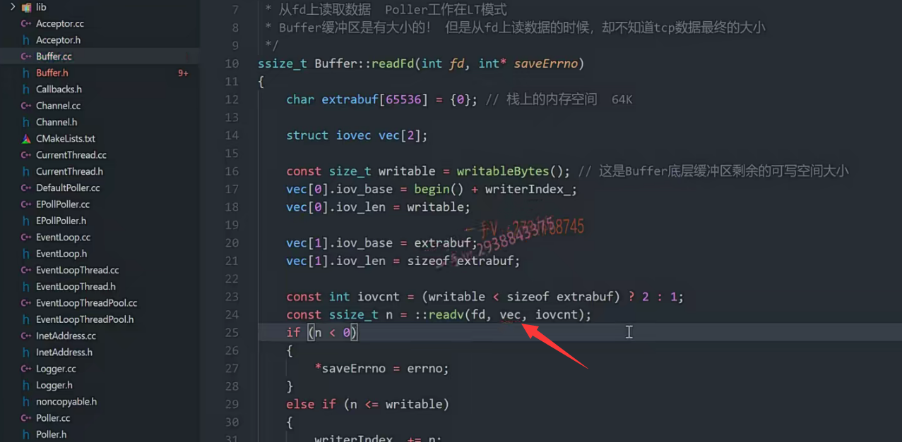

==写入同一个fd上读出来的这个数据对吧？==

你可以通过进行相应的判断，是在一个缓冲区就写完了呢。

还是在多个缓冲区里边都有写了，对吧啊？

这个是buffer的可写缓冲区。已经够存储读出来的数据。

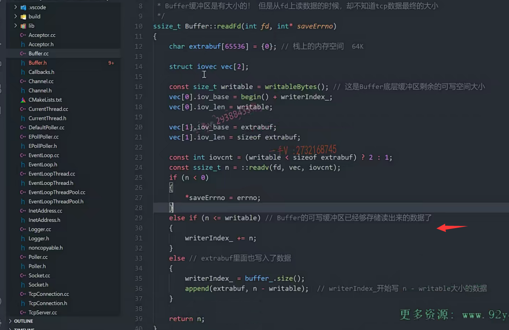

好吧啊OK，那我们buffer相关的这个方法呢，我们就把它写完了。

好吧啊，我们把它写完了，它就可以给我们TCP connection进行一个服务了啊

## 总结

buffer，我们就先写到这儿。

对于buffer，如果有任何的调整的话呢，我们在写TCP connection的时候呢，都可以随时的过来去把它修改一下。

希望大家呢，通过这两节课的学习，能够把buffer这个缓冲区呢的内容给大家掌握了啊，

而且这个buffer的代码你也可以存储起来，以后只要是写服务器相关的，需要用到缓冲区管理的这么一个类，

那我们buffer就可以直接使用，具体怎么使用呢？

我们TCP connection里边马上就会见到啊。

啊来编译一下吧，添加了新文件，我们close呃clean reconfigure of projects。重新生成makefile，

把我们新添加的文件都给它加进来啊。然后再重新的去去build。

buffer编到了，没编到，已经编到了啊，buffer连欧OK，那我们这节课的内容就给大家说到这里。

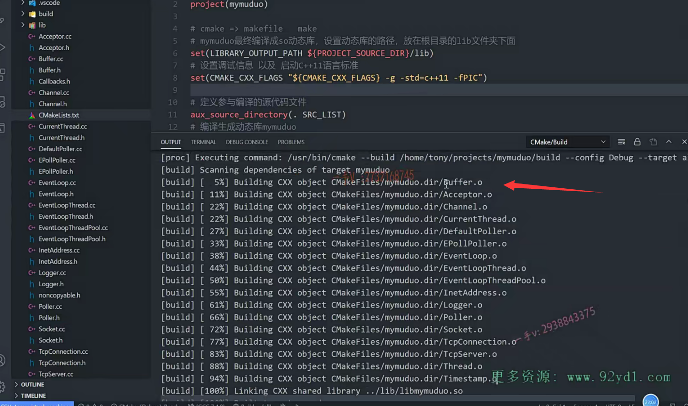