上节课呢，我们把TCP connection的这个send方法呢，给它实现了。

这节课，我们继续来把TCP connection剩余的这个方法，我们也实现了啊。

呃，首先就是这shutdown。这是在关闭是吧啊，

要要写shutdown的话，我觉得应该是先把这两个一写吧。

connection established跟connection destroyed这两个方法。

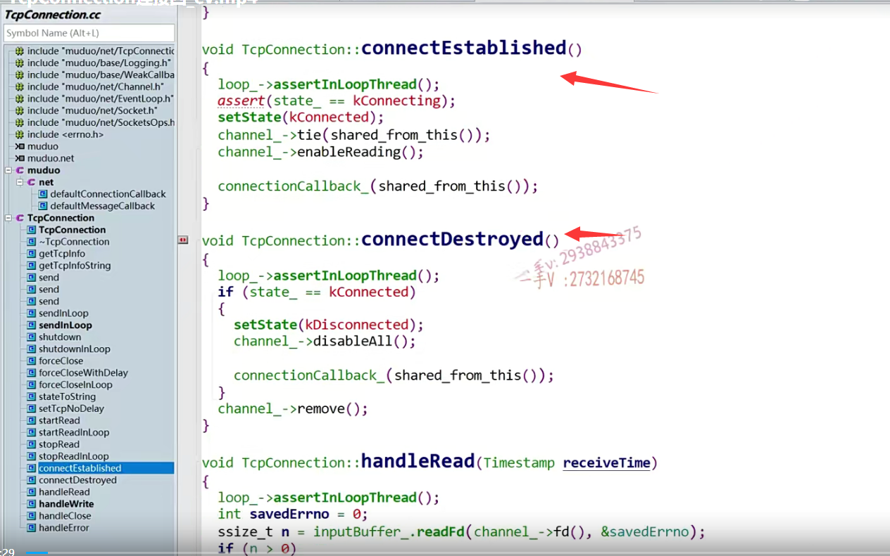

大家可以自己先想一想，这两个方法什么时候会调用？

这肯定也是两个在回调中才会调用的方法啊。

那么，connection established肯定就是在创建连接的时候调用了。

销毁连接，那就是连接关闭的时候。

对吧啊，连接这个关闭的时候，我们定这个，比如说shut down啊，关闭的时候。那么肯定也是由我们上层TCP server跟我们绑定调用的啊。

那具体怎么调？我们到时候写TCP server的时候再看一下它的这个逻辑，

我们先来看它本身是怎么实现的啊？要加上这个类的作用域，不要忘了。

connection established连接建立。断言我们就不看了啊，先set谁呀

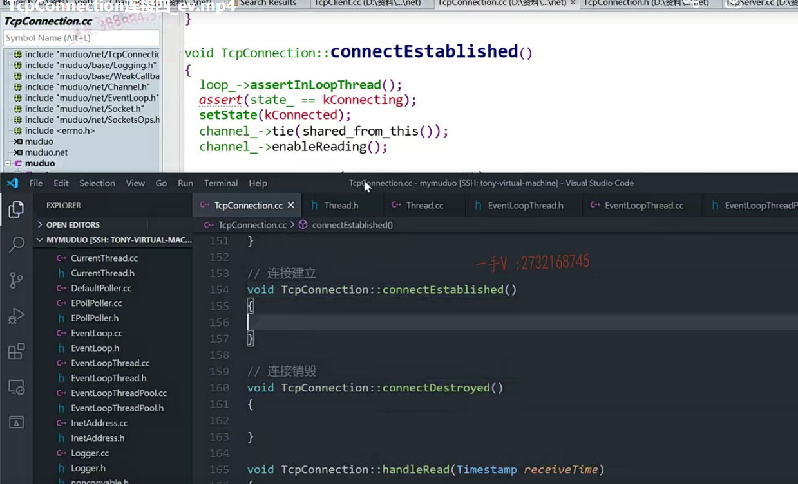

state？现在你属于连接成功。connected最开始初始化的时候state初始化的是connecting对吧啊channel。

诶，在这里边看见这个channel tie了吧啊，我们终于看见了是吧，终于看见了啊。

那么，这个钛我们当时呢？给大家说了啊，

给大家说了。这个tie呢，相当于在底层呢，记录了一个用void实例化的一个share的ptr，

实际上底层就是一个void*指针嘛，对吧啊？那么有一个强智能指针，

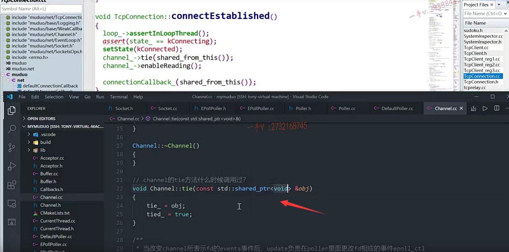记着它所指向的这个资源就不会被。怎么样啊？不会被释放对吧？

你想一想啊，我们TCP connection底层绑定了一个，管理了一个channel。是的吧啊，

那么而且呢，我们之前也看了啊TCP connection相应这个channel啊，

有事件被poller通知以后调用相应的回调，

这些回调也都是TCP connection。是不是里边儿的方法啊啊，把它绑定了一下，塞给这个channel了，作为回调了。

那么你想。如果呢TCP connection在这个底层相应的，这个channel在poller上还注册着呢。啊，还会感知到poller的这个通知的事件，并且调用相应的回调，

那调用的时候如果它所对应的这个它所回调的这个TCP connection这个对象没有了，怎么办？

对吧，因为呢，这些回调啊，你看它给的这些回调，我们看一下这些构造函数啊，它给的这些回调函数呢，都是TCP connection这个方法绑定的，是不是都是当前的这个对象啊？

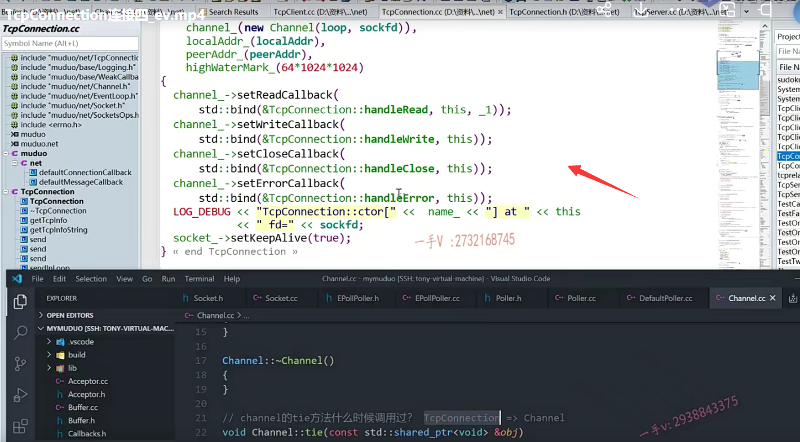

那TCP connection被人再remove掉怎么办？

它在被人remove掉了以后呢哎

channel然后再去调用相应的回调。然后呢啊？channel调用的回调调用的是不是就是TCP connection，这里边儿绑定的TCP connection这个对象呢？是不是成员方法啊？那产生的结果就是未知的。对不对啊？

那产生的这个结果就是未知的了，我们看一下这个tie。

它这是用一个弱智能指针来记录着的，

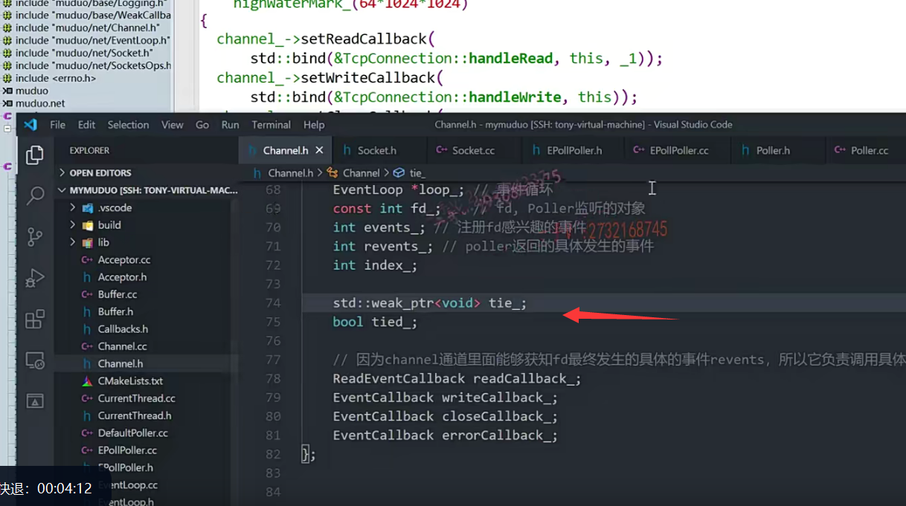

那这个处理的这个逻辑呢？你看在处理事件的时候被tie过，我们肯定是被tie过是吧？被tie过的话呢？

那在这里边怎么样？提升一下，如果提升失败，那就不做任何的，是不是回调调用啊？

啊，不做任何的回调调用就说明呢TCP connection呢，这个对象已经没有了。

okay吧，他做的事情就是这样的事情。

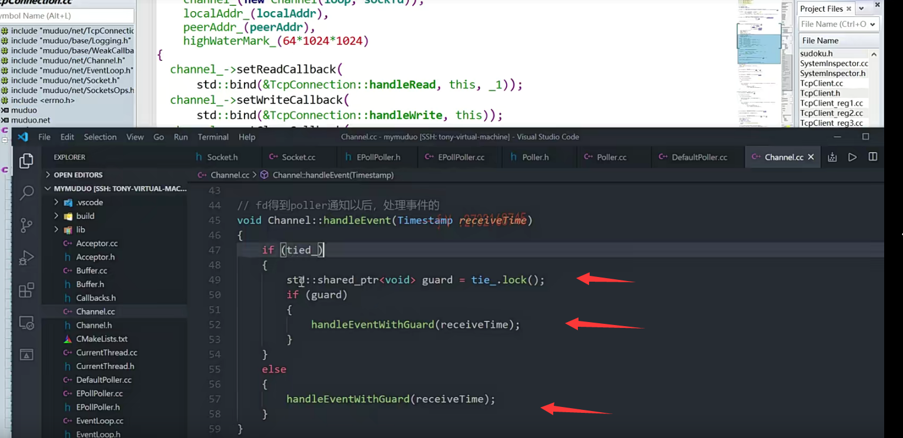

什么时候调用的就是连接？一个TCP connection新连接创建的时候，因为一个连接底层绑定一个channel，相当于channel呢，又握有一个弱智能指针。是不是指向它上层的这个TCP connection对象啊啊？

就做了这样的一件事情，各位。

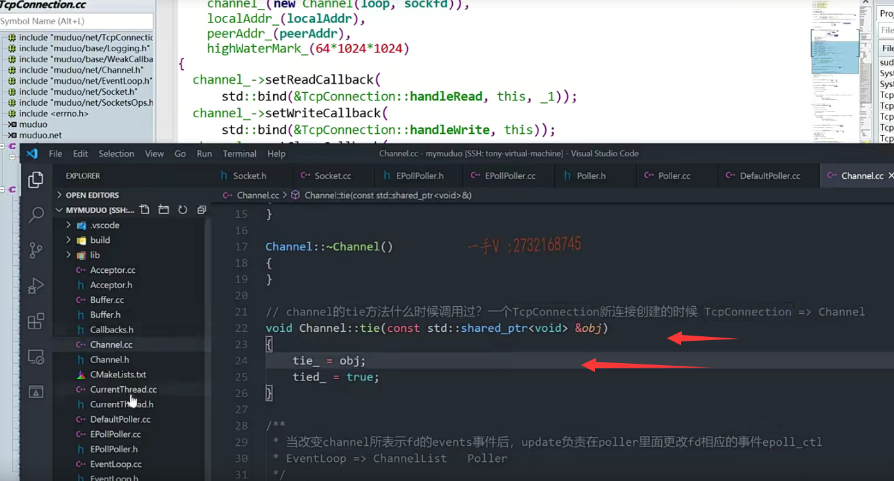

好。那么在这里边，我们继续来把TCP connection这个connection established，因为这些东西呢，都是对外提供的方法。

TCP connection也是对外用户直接可以访问的，

### 防止用户一些非法操作把channel的上层connection对象remove掉

所以呢，用户可能对connection做任何的操作啊，我们底层的channel既然依赖于一个TCP connection。

所以就要防止呢，用户呢的一些非法操作把channel还正在poller中，正在进行呢是吧？把channel对应的上层的connection对象给remove掉啊。

这就出问题了。

### 继续完善connectionEstablished()

好在这里边呢，我们把这个connection establish的我们继续来写完。

这个操作应该是很简单了。

那再接下来的就是channel enable什么？enable reading.这就是向poller注册channel的读事件嘛，就是epollin事件。对不对啊？

然后呢？这是有一个新连接建立了啊。新连接建立。

然后呢，执行回调是吧啊，执行回调。connection.tl n call back.shared from this.就是连接建立了。是不是唉，连接建立了。

### 连接断开时也会执行connectioncallback

这个我们之前不是有过。你看啊。嗯嗯。这儿还有什么？这儿有handle close的是吧啊？

handle close我们跟shut down是有关联的，在这里边儿它还会调用connection call，就是我们用户给绑定的

on connection on connection本身就是。新连接有新连接的时候，它会调用。啊，对吧？

然后呢？连接断开的时候呢？这个回调也会被调用上。

好吧啊，在这儿我再啰嗦一句吧，

我们之前在handle write这里边儿是不是有这样的一个方法啊，

这么一个异常的处理，这个异常的处理还是得跟shutdown有关系的啊，

跟shutdown有关系的。我现在还没有写上，当一会儿写shutdown，我们再给大家解释这一块儿吧，好吧啊。

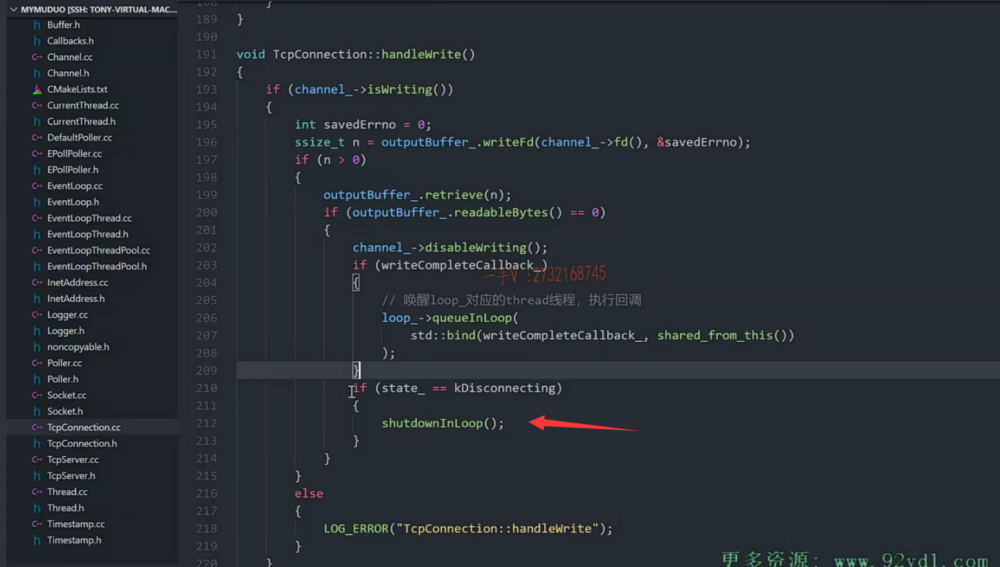

### 因为TcpConnection是给到用户的，所以非法操作是危险的

这代码我们都是每一行都给大家力求解释清楚，那么connection established就完了，连接的建立，

首先你看啊设置一下这个当记录当前连接状态的这个state，这个变量啊。

然后呢？呃，连接底层绑定这个管理的一个channel啊，让这个channel呢跟TCP记录了一下TCP connection的这个对象的一个存活的状态，

因为毕竟啊，这个TCP connection是要给到用户手里边儿的，那这个就危险了，对吧啊？

那我们的这个channel跟底层的socket，包括这个accept or都是不会直接给到用户手里边的，所以那些东西对象的生存周期是可控的。

TCP connection是给直接给到用户的手里啊，

这个呢，涉及到底层channel的回调调用的是TCP connection的这个成员方法，这里边就危险了。

是吧啊，就危险了。

这里边顺便你回忆一下我们之前的这个智能指针，强弱智能指针搭配既可以监控对象的存活状态，

而且可以解决多线程访问共享对象的一个线程安全问题，对吧啊？

这个功能非常的不错。

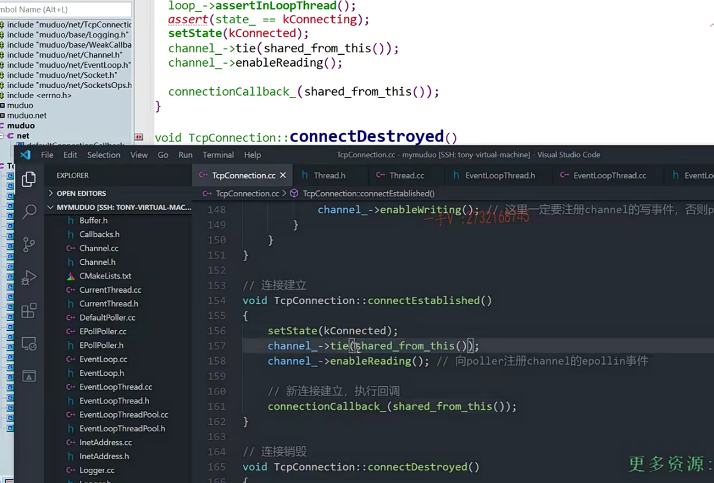

再来看一下这个connection destroyed connection destroyed。

你的state是个什么？connected是以建立连接，建立成功，

然后呢，才能到这个状态destroyed，对吧啊？

set statek disconnected.就已经关闭完成啊，

然后channel disableall这就是 把什么？把channel的所有感兴趣的事件啊。通过从poller中delete掉。

相当于就是通过那个epoll control，是不是啊epoll control？

==然后这里边还会调用connection。什么call back？连接断开了是吧？==

最后呢？就是channel remove这相当于就是把channel从poller中删除掉。好吧，那这个connection destroyed也就完了。

大家瞧一下啊。

这两个完了以后呢，我们就可以放心的来写这个shutdown了，唉，这个shutdown就有意思了。

我们看一下，首先呢，给出这个方法的这个声明啊。

我们是在哪里呢？看一下啊TCP connection。这个在哪里？

在这儿是吧？啊，这个是外部要调用的，不能写到谁里边儿啊，不能写到私有的里边儿啊。这个不能写到私有的里边儿。

这个我们要写到哦，这是前边上，但我们已经定义过了啊，那我把这个拿出来。shut down.

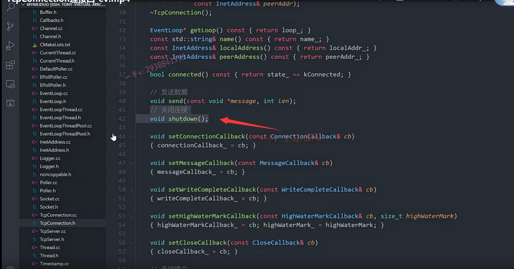

这有一个shutdown还有一个什么？还有一个对应的一个shutdown loop。

### 之前多定义了一个私有的send,去掉

这同样的啊，send不能放到私有的里边，

send外部要调用。哦。那我们这个send呢，就不需要了啊。

我们直接提供在此string类型的这个send，这个更灵活一点啊。方便实用是吧？

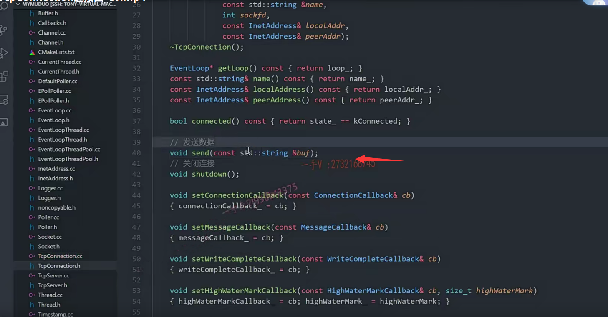

好，那么我们现在呢？把这个shutdown，还有shutdown loop呢？

实现一下啊。在muduo库里边都考虑了，在执行方法的时候都考虑了这个，因为它都是通过loop来操作的啊。

因为所有东西都写到反应堆里边了，eventloop相当于就是一反应堆呃，

他总是在考虑呢，当前的loop有没有在他所执行的线程里边？是吧，

每一个loop所执行的方法都要在loop对应的线程里边儿去处理啊。

那么，这是shutdown if state.呃，这是没有加什么？没有加类的作用域，所以你看它识别不了这个方法对应的类，没有代码提示啊，

识识别不了相应的这个类里边的这个成员变量state。

如果等于k connected，那么它现在是可以怎么样？

set state.k disconnected disconnect disconnecting.

它在这里边就设置了一个disconnecting。好吧啊。set什么？这里边为什么要给我报一个错呢？o在这里边儿呢，我们这个set state跟全局的这个方法怎么样啊？冲突了是吧？是因为我们这个s怎么样？没大写。识别的不是我们的方法啊。

然后就是loop执行的run in loop。run in loop.STD.band

第一个就是TCP connection的这个shutdowninloop。

第二个就是this。

好了，那这个方法。就OK，具体的这个shutdowninloop呢？做了什么事情？

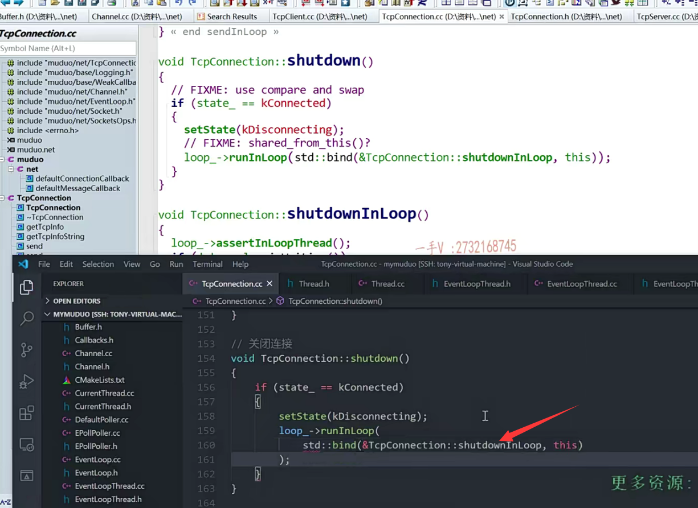

### 如果缓冲区数据没有发送完，那么不会去调用shutdown，而是调用shutdowninloop

他做的事情非常简单。

如果channel channel呢？没有什么。如果channel呢，没有注册过这个写事件是不是啊？

没有，那就证明它已经把发送缓冲区的数据，是不是都已经发送完了？

说明这个当前output。buffer中的数据已经全部发送完成。

那你看如果缓冲区待发送缓冲区 有数据没有发送完成的话，你调用了shut down它，相当于是disconnecting。

但是这里边儿不会真的去shutdown的。对吧啊，

然后呢？它在这里边呢handlewrite的时候呢？不断的去发，把发送缓冲区的数据不断的发送。

最后发送完了以后呢啊，最后发送完了以后你看readable bytes=0就发送完了以后。

如果发现这个state的状态被制成disconnecting，那也就意味着在发送的过程中有个地方调用什么了。调用这个shutdown了。是不是调用shutdown了，shutdown把状态改成disconnecting，

但是它没有真的shutdown，因为这里边儿呢数据没有发送完channel还是？writing状态的对吧？有这个感兴趣过这各方正在感兴趣这个epollout的事件。是不是啊？

所以呢，在这里边。你看之前记录的是disconnecting，那么所以它就调用了shutdowninloop。没问题吧啊。

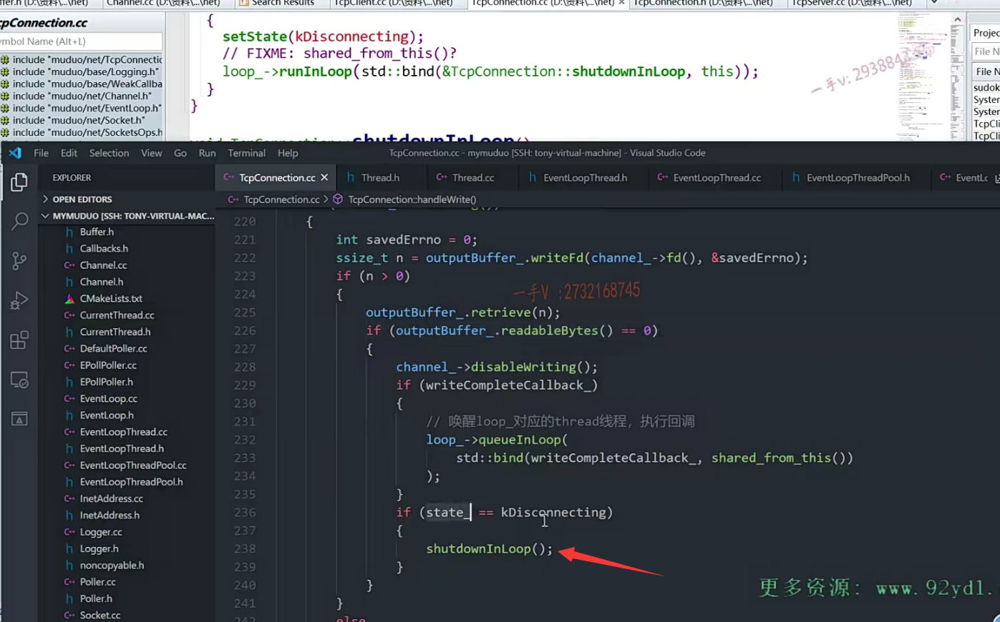

### 这都是和之前有关联的，很相似，数据不发送完，不shutdown

跟这都是相关联的啊，那考虑到了，

因为shutdown时用户调用这个方法的时候呢？

相应的，这个connection底层有可能正在把相应的这个发送缓冲的数据呢？正在发送呢，对不对？

我不可能数据没有发送完，我就shutdown了啊。好

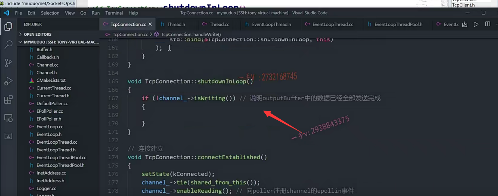

在这如果说没有数据可发送了，在这就怎么样啊？

socket。shut down,write 在这里边儿就关闭写端啊。

关闭写端的话，在这里边就会触发呢。就会触发什么事件了，

就会触发这个socket对应的这个channel的这个epoll  HUp这个事件呢，

是不用专门向epoll注册的啊，不用向专门向epoll注册的，

这个是本身呢epoll就给所有的这个socket fd注册过这个事件了啊。

所以你看这里边，如果这个fd发生的事件是epoll hub，而且呢？

不是这个可读事件啊啊？

那在这里边就判定成什么close这个socket要进行一个关闭。

就调用了这个close call back，

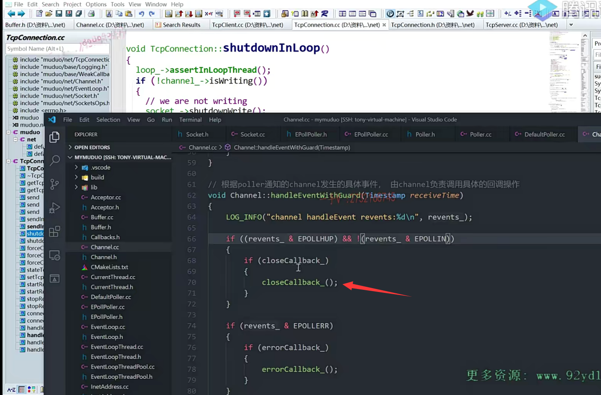

==那你调用close call back调用的就是TCP connection的什么方法啊？就是他的这个handle close方法。==

### shutdown逻辑梳理

OK吧，也就是说在这儿是这样调用的，当你在上层调用了某一个connection的，这个shut down方法的话。

唉，它在这里边设置了当前服务器端这条连接的状态，是disconnecting，然后在这儿执行了这个shutdowninloop，

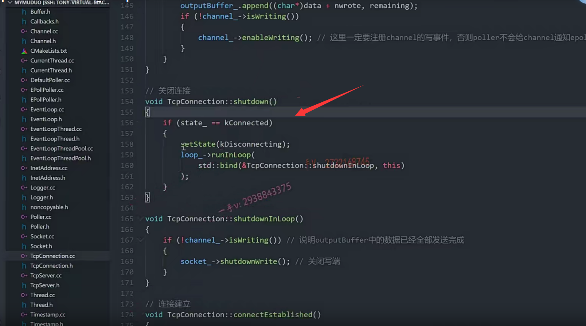

因为关闭了socket的这个write端。对吧

poller就给channel呢？通知了就关闭事件，那么就会回调TCP connection的handle close方法。好吧

handle close方法呢，在这里边相当于就是把这个channel的这个所有的事件都怎么样了？哎，所有的事件呢，都去掉了。okay了吧啊，所有的事件都去掉了啊。

呃，还做了哪些相关联的事件呢？

那到时候我们得在TCP server里边儿去看一下呢？

TCP connection handle close相关的这个调用的地方。

OK，那么在这里边就是我们把shutdown呢，也在这里边给大家强调了一下啊。

大家可以先看一下它本身的一些逻辑。

它只不过在这里边就是把我们经常遇见的epoll+lO blocking socket编程所遇到常见的问题呢，都封装在这个OOP相对应的，这个对象里边儿啊，以及这个对象跟对象之间的这个回调当中啊，是不是啊？

不得不说，看起来呢，过程比较多，

但设计还是相当精美啊。

希望大家在这里边呢，好好去体会一下。

我们来看一下啊，这个TCP的构造send sendinloop shutdown shutdown inloop。还有connect connectestablish destroyed啊，

这都已经我们都已经实现完了。

这个connection主要关注的就是连接建立。连接断开。就这几个方法啊。

连接建立connection established以及connection destroyed。

连接建立，连接断开，

然后就是四个回调handle glows error read write，

然后就是发送。是吧啊，发送以及关闭接口啊，关闭这个连接。

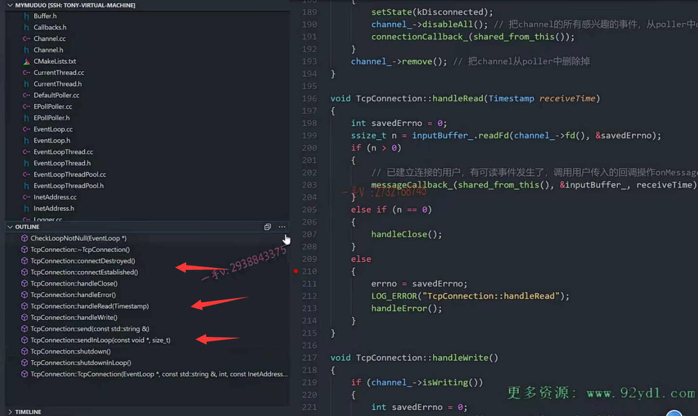

## 总结

好，那么这节课的这个内容写到这儿，我们相当于把TCP connection主要的成员方法就实现完了，来编译一下。

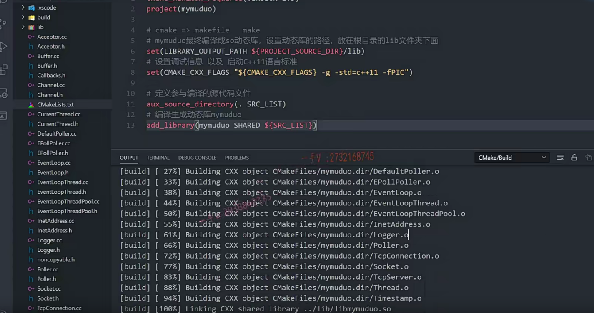

没什么大的问题，那我们TCP connection.就终于把它折腾完了啊。

终于折腾完了。

在这呢，我们也搞清楚了啊，搞清楚了在这里边啊，

具体数据读写是怎么完成的？是吧啊，

以及呢，相应的回调都实现了哪些？

就是跟客户端跟服务器建立连接的客户端相应的这个socket fd的这个读啊写啊的close啊error啊，是怎么去进行的啊？

那最后我们就剩下一个总领全局的相当于一个调度器的一个TCP server，

我们需要把它相应的这个方法呢去实现完，

这个我们就放到下节课开始了啊。这节课内容就到这里，希望大家呢，把这个相应的这个代码啊。写完该思考的好好把代码的结合代码，好好思考一下。