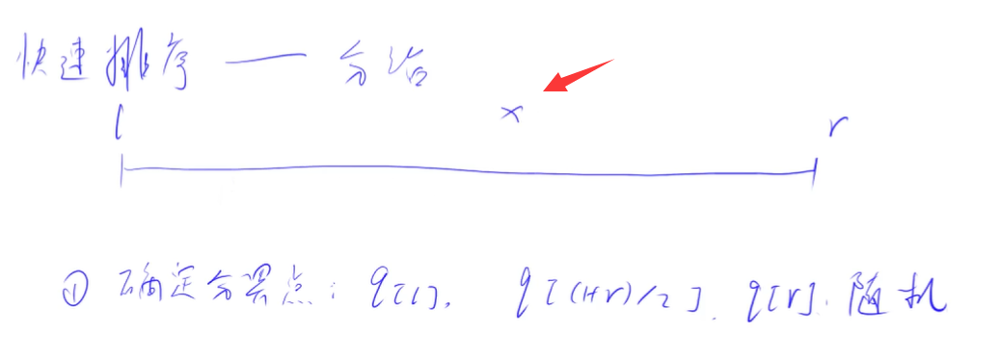

# 快速排序

快排思想 分治

第一步确定分界点pivot

随便挑一个值，常用挑l，或者l+r/2

第二步调整区间

所有小于等于x的在左半边，所有大于等于x的在右半边，记住x不一定在分界点,只要满足这个性能就行了

第三步 递归

递归处理左右两段，把左边排好序，把右边排好序

然后拼接在一起，就排好序了

因为左边最大值是小于右边最小值的

## 最重要一步

就是第二步，划分区间

提供一个比较简单的方法，但是有额外空间

### 暴力解法

1.先定义2个数组

2.扫描q，然后分类到2个数组中

3.依次添加到q数组

### 但是如何优美的解法

使用两个指针，一个是i，一个是j，然后这两个指针同时往中间走

i先移动，如果下标i的值小于x，那么i就往右移动，直到i指向的数大于x

那么这个数就应该放到右边去。

然后我们再去移动j，如果j指向的数大于x，那么j就往左移，直到j指向的数小于x

那么这个j指向的数就应该放到左半边

### 交换

那么此时我们把i指向的数和j指向的数 交换一下

那么这样该小于x的数就在左边，大于x的数就还在右边

然后i和j继续移动，直到i和j相遇为止

这样就可以把整个区间一分为2了

## 为什么?

首先i左边的数一定是小于x的，并且如果是交换过来的数，也是小于x的

不论在i什么时候，都是小于x

同理j右边的数都是大于等于x

所以当i和j相遇，那么就分为了2半，小于x，大于x

## 举例模拟

确定x=3，最左边的数

最开始2个指针，一个指向最开始，一个指向最末尾

### 第一次

i指向的数3 不满足小于3，所以i停下来

j指向的数5 满足大于3，j继续向左移动

然后j指向的数3 不满足大于3 所以j停下来

然后将i和j指向的数交换

交换完后，i和j向中间移动

此时i指向的数为1 小于3 

红色i在往右移动，现在两个指针i,j都是指向2

2也是小于3的，然后i再往右移动，碰到3好像不满足，i停下来

然后看j指向的数2，j我们发现不满足大于3，所以也停下来，

这时我们发现i指针左边数小于x=3，j右边数都是大于3

==但是我发现y总讲的是不是要i大于j就应该退出了？==

# 模板

## 1 do while

