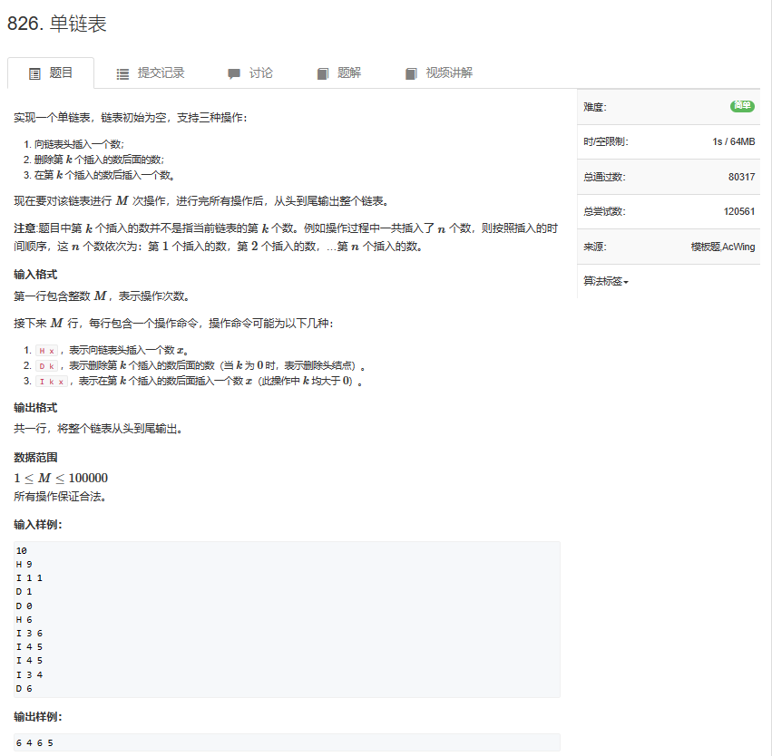
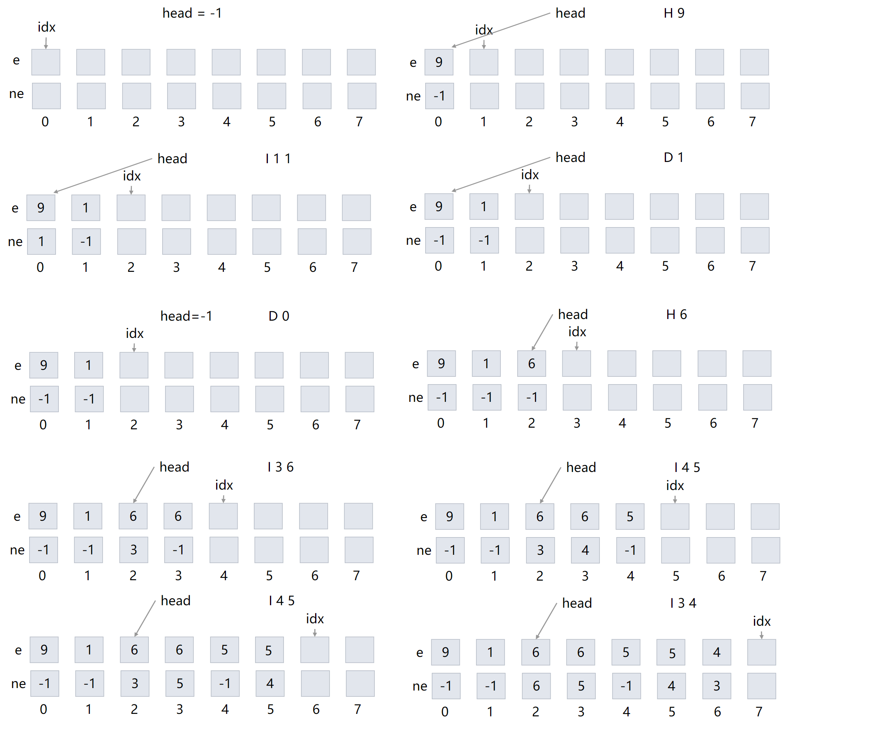
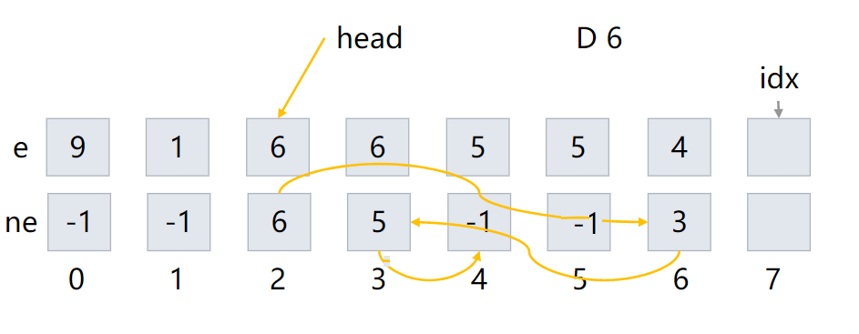
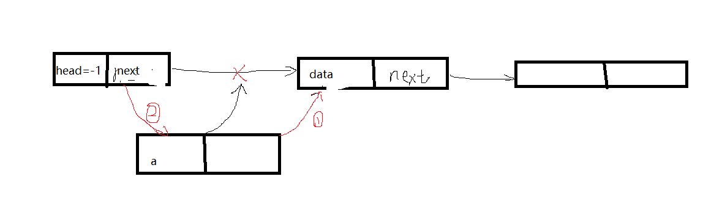
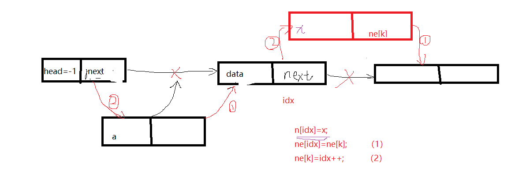
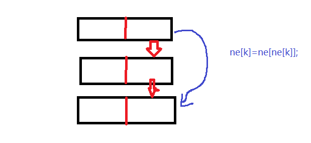

# 题目



# 我的题解


# 其他题解

## other1

### 就这个题，看视频+理解+写代码+写题解，我呜呜呜，干了四小时了

### 我太菜了

```cpp
#include <iostream>

using namespace std;

const int N = 100010;

int n;
int h[N], e[N], ne[N], head, idx;

//对链表进行初始化
void init(){
    head = -1;//最开始的时候，链表的头节点要指向-1，
    //为的就是在后面进行不断操作后仍然可以知道链表是在什么时候结束
    /*
    插句题外话，我个人认为head其实就是一个指针，是一个特殊的指针罢了。
    刚开始的时候它负责指向空结点，在链表里有元素的时候，它变成了一个指向第一个元素的指针

    当它在初始化的时候指向-1，来表示链表离没有内容。
    */
    idx = 0;//idx在我看来扮演两个角色，第一个是在一开始的时候，作为链表的下标，让我们好找
    //第二在链表进行各种插入，删除等操作的时候，作为一个临时的辅助性的所要操作的元素的下
    //标来帮助操作。并且是在每一次插入操作的时候，给插入元素一个下标，给他一个窝，感动！
    /*
    再次插句话，虽然我们在进行各种操作的时候，元素所在的下标看上去很乱，但是当我们访问的
    时候，是靠着指针，也就是靠ne[]来访问的，这样下标乱，也就我们要做的事不相关了。
    另外，我们遍历链表的时候也是这样，靠的是ne[]
    */
}
//将x插入到头节点上
void int_to_head(int x){//和链表中间插入的区别就在于它有head头节点
    e[idx] = x;//第一步，先将值放进去
    ne[idx] = head;//head作为一个指针指向空节点，现在ne[idx] = head;做这把交椅的人换了
    //先在只是做到了第一步，将元素x的指针指向了head原本指向的
    head = idx;//head现在表示指向第一个元素了，它不在是空指针了。（不指向空气了）
    idx ++;//指针向下移一位，为下一次插入元素做准备。
}

//将x插入到下标为k的点的后面
void add(int k, int x){
    e[idx] = x;//先将元素插进去
    ne[idx] = ne[k];//让元素x配套的指针，指向它要占位的元素的下一个位置
    ne[k] = idx;//让原来元素的指针指向自己
    idx ++;//将idx向后挪
    /*
    为了将这个过程更好的理解，现在
    将指针转变的这个过程用比喻描述一下，牛顿老师为了省事，想插个队，队里有两个熟人
    张三和李四，所以，他想插到两个人中间，但是三个人平时关系太好了，只要在一起，就
    要让后面的人的手插到前面的人的屁兜里。如果前面的人屁兜里没有基佬的手，将浑身不
    适。所以，必须保证前面的人屁兜里有一只手。（张三在前，李四在后）
    这个时候，牛顿大步向前，将自己的手轻轻的放入张三的屁兜里，（这是第一步）
    然后，将李四放在张三屁兜里的手抽出来放到自己屁兜里。（这是第二步）
    经过这一顿骚操作，三个人都同时感觉到了来自灵魂的战栗，打了个哆嗦。
    */
}

//将下标是k的点后面的点个删掉
void remove(int k){
    ne[k] = ne[ne[k]];//让k的指针指向，k下一个人的下一个人，那中间的那位就被挤掉了。
}
int main(){
    cin >> n;
    init();//初始化
    for (int i = 0; i < n; i ++ ) {
        char s;
        cin >> s;
        if (s == 'H') {
            int x;
            cin >> x;
            int_to_head(x);
        }
        if (s == 'D'){
            int k;
            cin >> k;
            if (k == 0) head = ne[head];//删除头节点
            else remove(k - 1);//注意删除第k个输入后面的数，那函数里放的是下标，k要减去1
        }
        if (s == 'I'){
            int k, x;
            cin >> k >> x;
            add(k - 1, x);//同样的，第k个数，和下标不同，所以要减1
        }
    }

    for (int i = head; i != -1; i = ne[i]) cout << e[i] << ' ' ;
    cout << endl;

    return 0;
}
```

## other2

### 第 k 个插入的元素在哪里？

在本道题目中，有两个问题：

`删除第 k 个插入的数后面的数`

`在第 k 个插入的数后插入一个数`

先解释一下什么叫`第k个插入的元素`：

-   把插入操作按先后排序，第 k 次执行插入操作的那个元素。
-   并不是链表中从前往后数第 k 个元素。

在链表中删除指针指向的元素的后一个元素，或者在指针指向的某个元素后面插入一个新元素是很容易实现的。

所以，只要弄明白`第 k 个插入的数`的指针在哪里，这两个问题就很容易解决。

来分析一下插入操作：

-   链表为空的时候：idx 的值为 0,
-   插入第一个元素 a 后：e\[0\] = a, idx 的值变为 1，
-   插入第二个元素 b 后：e\[1\] = b, idx 的值变为 2,
-   插入第三个元素 c 后：e\[2\] = c, idx 的值变为 3，

所以： **第 k 个出入元素的索引值 k - 1**。

有人会说，如果中间删除了某些元素呢？

在看一下伴随着删除操作的插入：

-   链表为空的时候：idx 的值为 0,
-   插入第一个元素 a 后：e\[0\] = a, idx 的值变为 1，
-   插入第二个元素 b 后：e\[1\] = b, idx 的值变为 2,
-   删除第一个插入的元素 a：head 变为 1， idx 不变，依旧为 2。
-   删除第二个插入的元素 b：head 变为 2， idx 不变，依旧为 2。
-   插入第三个元素 c 后：e\[2\] = c, idx 的值变为 3。

所以删除操作并不改变第 k 个插入元素的索引。

故第 `k` 个元素的索引一定是 `k - 1`。

___

题解：  
head 表示头结点，e数组存储元素，ne数组存储下一个节点索引，indx表示下一个可以存储元素的位置索引。

头结点后面添加元素：

-   在e的idx处存储元素e\[ide\] = x;
    
-   该元素插入到头结点后面 ne\[idx\] = head;
    
-   头结点指向该元素 head = idx;
    
-   idx 指向下一个可存储元素的位置 idx++。
    

在索引 k 后插入一个数

-   在e的idx处存储元素e\[index\] = x
    
-   该元素插入到第k个插入的数后面 ne\[idx\] = ne\[k\];
    
-   第k个插入的数指向该元素 ne\[k\] = idx;
    
-   idx 指向下一个可存储元素的位置 idx++。
    

删索引为 k 的元素的后一个元素：

-   ne\[k\] 的值更新为 ne\[ne\[k\]\]

## 画个图

以题目为例：

```
10
H 9
I 1 1
D 1
D 0
H 6
I 3 6
I 4 5
I 4 5
I 3 4
D 6
```



最终结果如下：



```cpp
#include <iostream>
using namespace std;
const int N = 100010;

int head, e[N], ne[N], idx;

void init()
{
    head = -1;
    idx = 0;
}

void add_to_head(int x)
{
    e[idx] = x, ne[idx] = head, head = idx++;
}

void add(int k, int x)
{
    e[idx] = x, ne[idx] = ne[k], ne[k] = idx++;
}

void remove(int k)
{
    ne[k] = ne[ne[k]];
}

int main()
{
    int m;
    cin >> m;

    init();

    while(m--)
    {
        char op;
        int k, x;
        cin >> op;
        if(op == 'H')
        {
            cin >> x;
            add_to_head(x);
        }
        else if(op == 'D')
        {
            cin >> k;
            if(!k) head = ne[head];
            else remove(k - 1);//第k个元素对应的索引为k - 1
        }
        else 
        {
            cin >> k >> x;
            add(k - 1, x);//第k个元素对应的索引为k - 1
        }
    }
    for(int i = head; i != -1; i = ne[i]) cout << e[i] << " ";

    cout<< endl;
}
```

### 为什么不用课本上学的结构体来构造链表？？

学过数据结构课的人，对链表的第一反应就是：

链表由节点构成，每个节点保存了 **值** 和 **下一个元素的位置** 这两个信息。节点的表示形式如下：

```
class Node{
public:
    int val;
    Node* next;
};
```

这样构造出链表节点的是一个好方法，也是许多人一开始就学到的。

使用这种方法，在创建一个值为 `x` 新节点的时候，语法是：

```cpp
Node* node = new Node();
node->val = x
```

看一下创建新节点的代码的第一行：

`Node* node = new Node();`，中间有一个 `new` 关键字来为新对象分配空间。

`new`的底层涉及内存分配，调用构造函数，指针转换等多种**复杂**且**费时**的操作。一秒大概能`new`1w次左右。

在平时的工程代码中，不会涉及上万次的`new`操作，所以这种结构是一种 **见代码知意** 的好结构。

但是在算法比赛中，经常碰到操作在10w级别的链表操作，如果使用结构体这种操作，是无法在算法规定时间完成的。

所以，在算法比赛这种有严格的**时间要求**的环境中，不能频繁使用`new`操作。也就不能使用结构体来实现数组。  
如果有问题，直接评论，欢迎找bug

完结，撒花。求赞~~

## other3

### 题目描述

实现一个单链表，链表初始为空，支持三种操作：

(1) 向链表头插入一个数；

(2) 删除第k个插入的数后面的数；

(3) 在第k个插入的数后插入一个数

现在要对该链表进行M次操作，进行完所有操作后，从头到尾输出整个链表。

注意:题目中第k个插入的数并不是指当前链表的第k个数。例如操作过程中一共插入了n个数，则按照插入的时间顺序，这n个数依次为：第1个插入的数，第2个插入的数，…第n个插入的数。

输入格式  
第一行包含整数M，表示操作次数。

接下来M行，每行包含一个操作命令，操作命令可能为以下几种：

(1) “H x”，表示向链表头插入一个数x。

(2) “D k”，表示删除第k个输入的数后面的数（当k为0时，表示删除头结点）。

(3) “I k x”，表示在第k个输入的数后面插入一个数x（此操作中k均大于0）。

输出格式  
共一行，将整个链表从头到尾输出。

数据范围  
1≤M≤100000  
所有操作保证合法。

#### 样例

```cpp
输入样例：
10
H 9
I 1 1
D 1
D 0
H 6
I 3 6
I 4 5
I 4 5
I 3 4
D 6
输出样例：
6 4 6 5
```

___

### 算法1

时间复杂度分析：链表在插入的时候可以达到O(1)的复杂度

#### 理解

```cpp
int head, e[N], ne[N], idx;

// 初始化
void init()
{
    head = -1;
    idx = 0;
}
```

// 在链表头插入一个数a

```cpp
void insert(int a)
{
    e[idx] = a, ne[idx] = head, head = idx ++ ;
}
```



解释一下 就先把值赋到数据域，然后让head的地址值存入指针域，让idx向下移一位；

//向表中k位置插图x

```cpp
void add(int k,int x){
    n[idx]=x;
    ne[idx]=ne[k];
    ne[k]=idx++;
}
```



// 将k删除，需要保证头结点存在

```
void remove(int k)
{
    ne[k]=ne[ne[k]];

}
```

这个与插入思想类似：  


#### C++ 代码

```cpp
#include<iostream>
using namespace std;
const int N=100010;
int idx,head,n[N],ne[N];
int a;
void add_head(int x){
    n[idx]=x;
    ne[idx]=head;
    head=idx++;
}
void add(int k,int x){
    n[idx]=x;
    ne[idx]=ne[k];
    ne[k]=idx++;
}
void remove(int k){
    ne[k]=ne[ne[k]];
}

int main(){

    head=-1;idx=0;
    cin>>a;
    while(a--){
        string op;
        int k,x;
        cin>>op;
        if(op=="D")
        {

            cin>>k;
            if(!k)head=ne[head];
            remove(k-1);
        }
        else if(op=="H")
        {
            cin>>x;
            add_head(x);
        }
        else if(op=="I"){
            int k,x;
            cin>>k>>x;
            add(k-1,x);
        }
    }
    for(int i=head;i!=-1;i=ne[i])
      cout<<n[i]<<" ";
    return 0;

}
```