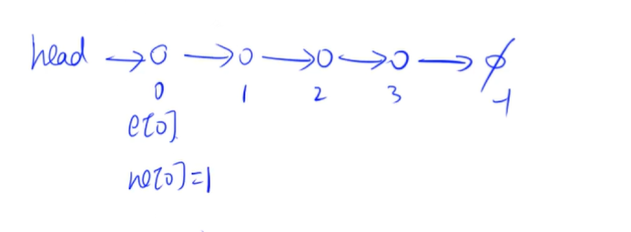
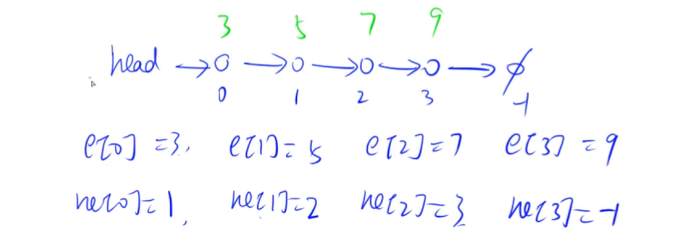

这样去建立链表有点慢

# 使用数组来模拟链表

## 使用数组模拟单链表 

单链表用的最多的是邻接表，邻接表最主要的应用是存储树和图

所以单链表最长用来储存树和图

之后的最短路，最大流问题都是用链表来存，

## 使用数组模拟双链表

主要用来优化某些问题

单链表 有一个head,一开始是指向空节点

然后我们会插入一些元素，然后单链表就会长成这样

每个点都会有一个值，和一个next指针

习惯用两个数组来存某个点的值和next指针

e和ne是用下标关联起来的

每个节点都有下标，空节点的话是-1来表示

0号点的值是e[0],0号点的next指针是ne[0]，然后我们的0号点指向的是1号点是吧，那么我们的ne[0]就是1

然后val用绿色值来表示

然后列出所有

得到链表在数组里的表达式

e和ne都是整形数组，空节点下标使用-1来表示

## 解一道题 使用链表模板

