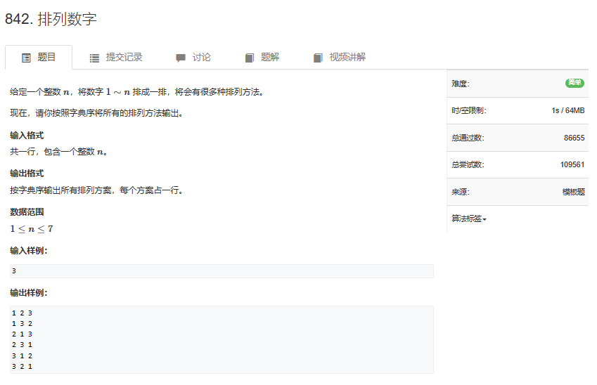

# 题目



# 我的题解


# 其他题解

## other1

如何用 dfs 解决全排列问题？

dfs 最重要的是搜索顺序。用什么顺序遍历所有方案。

对于全排列问题，以 n = 3 为例，可以这样进行搜索：


假设有 3 个空位，从前往后填数字，每次填一个位置，填的数字不能和前面一样。

最开始的时候，三个空位都是空的：\_\_ \_\_ \_\_

首先填写第一个空位，第一个空位可以填 1，填写后为：1 \_\_ \_\_

填好第一个空位，填第二个空位，第二个空位可以填 2，填写后为：1 2 \_\_

填好第二个空位，填第三个空位，第三个空位可以填 3，填写后为： 1 2 3

**这时候，空位填完，无法继续填数，所以这是一种方案，输出。**

然后往后退一步，退到了状态：1 2 \_\_ 。剩余第三个空位没有填数。第三个空位上除了填过的 3 ，没有其他数字可以填。

因此再往后退一步，退到了状态：1 \_\_ \_\_。第二个空位上除了填过的 2，还可以填 3。第二个空位上填写 3，填写后为：1 3 \_\_

填好第二个空位，填第三个空位，第三个空位可以填 2，填写后为： 1 3 2

**这时候，空位填完，无法继续填数，所以这是一种方案，输出。**

然后往后退一步，退到了状态：1 3 \_\_ 。剩余第三个空位没有填数。第三个空位上除了填过的 2，没有其他数字可以填。

因此再往后退一步，退到了状态：1 \_\_ \_\_。第二个空位上除了填过的 2，3，没有其他数字可以填。

因此再往后退一步，退到了状态：\_\_ \_\_ \_\_。第一个空位上除了填过的 1，还可以填 2。第一个空位上填写 2，填写后为：2 \_\_ \_\_

填好第一个空位，填第二个空位，第二个空位可以填 1，填写后为：2 1 \_\_

填好第二个空位，填第三个空位，第三个空位可以填 3，填写后为：2 1 3

**这时候，空位填完，无法继续填数，所以这是一种方案，输出。**

然后往后退一步，退到了状态：2 1 \_\_ 。剩余第三个空位没有填数。第三个空位上除了填过的 3，没有其他数字可以填。

因此再往后退一步，退到了状态：2 \_\_ \_\_。第二个空位上除了填过的 1，还可以填 3。第二个空位上填写 3，填写后为：2 3 \_\_

填好第二个空位，填第三个空位，第三个空位可以填 1，填写后为：2 3 1

**这时候，空位填完，无法继续填数，所以这是一种方案，输出。**

然后往后退一步，退到了状态：2 3 \_\_ 。剩余第三个空位没有填数。第三个空位上除了填过的 1，没有其他数字可以填。

因此再往后退一步，退到了状态：2 \_\_ \_\_。第二个空位上除了填过的 1，3，没有其他数字可以填。

因此再往后退一步，退到了状态：\_\_ \_\_ \_\_。第一个空位上除了填过的 1，2，还可以填 3。第一个空位上填写 3，填写后为：3 \_\_ \_\_

填好第一个空位，填第二个空位，第二个空位可以填 1，填写后为：3 1 \_\_

填好第二个空位，填第三个空位，第三个空位可以填 2，填写后为：3 1 2

**这时候，空位填完，无法继续填数，所以这是一种方案，输出。**

然后往后退一步，退到了状态：3 1 \_\_ 。剩余第三个空位没有填数。第三个空位上除了填过的 2，没有其他数字可以填。

因此再往后退一步，退到了状态：3 \_\_ \_\_。第二个空位上除了填过的 1，还可以填 2。第二个空位上填写 2，填写后为：3 2 \_\_

填好第二个空位，填第三个空位，第三个空位可以填 1，填写后为：3 2 1

**这时候，空位填完，无法继续填数，所以这是一种方案，输出。**

然后往后退一步，退到了状态：3 2 \_\_ 。剩余第三个空位没有填数。第三个空位上除了填过的 1，2，没有其他数字可以填。

因此再往后退一步，退到了状态：3 \_\_ \_\_。第二个空位上除了填过的 1，2，没有其他数字可以填。

因此再往后退一步，退到了状态：\_\_ \_\_ \_\_。第一个空位上除了填过的 1，2，3，没有其他数字可以填。

**此时深度优先搜索结束，输出了所有的方案。**

___

#### 算法：

-   用 path 数组保存排列，当排列的长度为 n 时，是一种方案，输出。
-   用 state 数组表示数字是否用过。当 state\[i\] 为 1 时：i 已经被用过，state\[i\] 为 0 时，i 没有被用过。
-   dfs(i) 表示的含义是：在 path\[i\] 处填写数字，然后递归的在下一个位置填写数字。
-   回溯：第 i 个位置填写某个数字的所有情况都遍历后， 第 i 个位置填写下一个数字。

___

#### 代码

```cpp
#include<iostream>
using namespace std;
const int N = 10;
int path[N];//保存序列
int state[N];//数字是否被用过
int n;
void dfs(int u)
{
    if(u > n)//数字填完了，输出
    {
        for(int i = 1; i <= n; i++)//输出方案
            cout << path[i] << " ";
        cout << endl;
    }

    for(int i = 1; i <= n; i++)//空位上可以选择的数字为:1 ~ n
    {
        if(!state[i])//如果数字 i 没有被用过
        {
            path[u] = i;//放入空位
            state[i] = 1;//数字被用，修改状态
            dfs(u + 1);//填下一个位
            state[i] = 0;//回溯，取出 i
        }
    }
}

int main()
{

    cin >> n;
    dfs(1);
}

```

___

时间复杂度为 O(n\*n!)。

空间复杂度为 O(n)。

