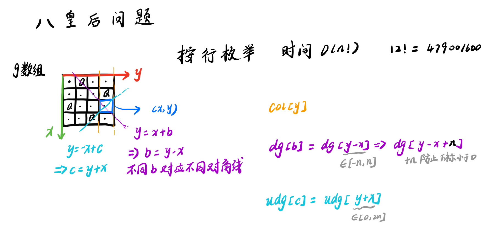

# 题目


# 我的题解


# 其他题解

## other1

## [n-皇后问题](https://www.acwing.com/problem/content/845/)

### 题目描述

n-皇后问题是指将 n 个皇后放在 n∗n 的国际象棋棋盘上，使得皇后不能相互攻击到，即任意两个皇后都不能处于同一行、同一列或同一斜线上。

现在给定整数n，请你输出所有的满足条件的棋子摆法。

输入格式

共一行，包含整数n。

输出格式

每个解决方案占n行，每行输出一个长度为n的字符串，用来表示完整的棋盘状态。

其中”.”表示某一个位置的方格状态为空，”Q”表示某一个位置的方格上摆着皇后。

每个方案输出完成后，输出一个空行。

数据范围

1≤n≤9

#### 样例

```
输入样例：
4
```

```
输出样例：
.Q..
...Q
Q...
..Q.

..Q.
Q...
...Q
.Q..
```

___

### 算法1 最新清晰写法



```cpp
#include <iostream>
using namespace std;
const int N = 20; 

// bool数组用来判断搜索的下一个位置是否可行
// col列，dg对角线，udg反对角线
// g[N][N]用来存路径

int n;
char g[N][N];
bool col[N], dg[N], udg[N];

void dfs(int u) {
    // u == n 表示已经搜了n行，故输出这条路径
    if (u == n) {
        for (int i = 0; i < n; i ++ ) puts(g[i]);   // 等价于cout << g[i] << endl;
        puts("");  // 换行
        return;
    }

    // 枚举u这一行，搜索合法的列
    int x = u;
    for (int y = 0; y < n; y ++ )
        // 剪枝(对于不满足要求的点，不再继续往下搜索)  
        if (col[y] == false && dg[y - x + n] == false && udg[y + x] == false) {
            col[y] = dg[y - x + n] = udg[y + x] = true;
            g[x][y] = 'Q';
            dfs(x + 1);
            g[x][y] = '.';  // 恢复现场
            col[y] = dg[y - x + n] = udg[y + x] = false;
        }
}

int main() {
    cin >> n;
    for (int i = 0; i < n; i ++ )
        for (int j = 0; j < n; j ++ )
            g[i][j] = '.';

    dfs(0);

    return 0;
}   
```

### 算法1（旧的写法）

过去的写法（DFS按行枚举） 时间复杂度$O(n!)$$O(n!)$

**代码分析**

> 对角线 $dg[u + i]$$dg[u + i]$，反对角线$udg[n - u + i]$$udg[n - u + i]$中的下标 $u + i$$u + i$和 $n - u + i$$n - u + i$ 表示的是截距

下面分析中的$(x, y)$$(x, y)$相当于上面的$(u, i)$$(u, i)$

1.  反对角线 $y = x + b$$y = x + b$, 截距 $b = y - x$$b = y - x$，因为我们要把 $b$$b$ 当做数组下标来用，显然 $b$$b$ 不能是负的，所以我们加上 $+n$$+n$ （实际上+n+4,+2n都行），来保证是结果是正的，即 y - x + n
2.  而对角线 $y = -x + b$$y = -x + b$, 截距是 $b = y + x$$b = y + x$，这里截距一定是正的，所以不需要加偏移量

**核心目的**：找一些合法的下标来表示$dg$$dg$或$udg$$udg$是否被标记过，所以如果你愿意，你取 $udg[n + n - u + i]$$udg[n + n - u + i]$ 也可以，只要所有$(u, i)$$(u, i)$对可以映射过去就行

#### C++ 代码

```cpp
#include <iostream>
using namespace std;
const int N = 20; 

// bool数组用来判断搜索的下一个位置是否可行
// col列，dg对角线，udg反对角线
// g[N][N]用来存路径

int n;
char g[N][N];
bool col[N], dg[N], udg[N];

void dfs(int u) {
    // u == n 表示已经搜了n行，故输出这条路径
    if (u == n) {
        for (int i = 0; i < n; i ++ ) puts(g[i]);   // 等价于cout << g[i] << endl;
        puts("");  // 换行
        return;
    }

    //对n个位置按行搜索
    for (int i = 0; i < n; i ++ )
        // 剪枝(对于不满足要求的点，不再继续往下搜索)  
        // udg[n - u + i]，+n是为了保证下标非负
        if (!col[i] && !dg[u + i] && !udg[n - u + i]) {
            g[u][i] = 'Q';
            col[i] = dg[u + i] = udg[n - u + i] = true;
            dfs(u + 1);
            col[i] = dg[u + i] = udg[n - u + i] = false; // 恢复现场 这步很关键
            g[u][i] = '.';

        }
}

int main() {
    cin >> n;
    for (int i = 0; i < n; i ++ )
        for (int j = 0; j < n; j ++ )
            g[i][j] = '.';

    dfs(0);

    return 0;
}   

```

___

### 算法2

（DFS按每个元素枚举）时间复杂度$O(2^{n^2})$$O(2^{n^2})$

时间复杂度分析：每个位置都有两种情况，总共有 $n^2$$n^2$ 个位置

#### C++ 代码

```cpp
// 不同搜索顺序 时间复杂度不同  所以搜索顺序很重要！
#include <iostream>
using namespace std;
const int N = 20;

int n;
char g[N][N];
bool row[N], col[N], dg[N], udg[N]; // 因为是一个个搜索，所以加了row

// s表示已经放上去的皇后个数
void dfs(int x, int y, int s)
{
    // 处理超出边界的情况
    if (y == n) y = 0, x ++ ;

    if (x == n) { // x==n说明已经枚举完n^2个位置了
        if (s == n) { // s==n说明成功放上去了n个皇后
            for (int i = 0; i < n; i ++ ) puts(g[i]);
            puts("");
        }
        return;
    }

    // 分支1：放皇后
    if (!row[x] && !col[y] && !dg[x + y] && !udg[x - y + n]) {
        g[x][y] = 'Q';
        row[x] = col[y] = dg[x + y] = udg[x - y + n] = true;
        dfs(x, y + 1, s + 1);
        row[x] = col[y] = dg[x + y] = udg[x - y + n] = false;
        g[x][y] = '.';
    }

    // 分支2：不放皇后
    dfs(x, y + 1, s);
}


int main() {
    cin >> n;
    for (int i = 0; i < n; i ++ )
        for (int j = 0; j < n; j ++ )
            g[i][j] = '.';

    dfs(0, 0, 0);

    return 0;
}
```

按元素位置枚举是要比按位置枚举慢很多的：  


## other2

深度优先遍历dfs。

每一行必定有一个皇后，对行进行深度遍历。

对于第 r 行的第 i 个位置，判断每个点是否可以放皇后，如果可以，则放皇后，然后处理 r + 1 行。

直到 r = n，程序指行完毕。

[点击看大图](https://git.acwing.com/Hasity/jnu/-/raw/master/acwing/n-hh.png)


**核心思路**：深度优先遍历

-   函数名：`void dfs(int r)`: 深度优先遍历函数。参数`r`：从第`r`行开始放棋子，处理第`r`行。
    
-   递归结束判定：`见代码`，当 `r == n`的时候，说明应该处理第 `n`行了，也代表第 `0~n-1`行放好棋子，也就是整个棋盘放好了棋子，也就是得到了一种解，也就是递归结束。
    
-   第`r`行，第`i`列能不能放棋子：用数组`dg` `udg` `cor` 分别表示：点对应的两个斜线以及列上是否有皇后。  
    `dg[i + r]` 表示 `r`行`i`列处，所在的对角线上有没有棋子，`udg[n - i + r]`表示 `r`行`i`列处，所在的反对角线上有没有棋子，`cor[i]`表示第`i`列上有没有棋子。如果 `r`行`i`列的对角线，反对角线上都没有棋子，即`!cor[i] && !dg[i + r] && !udg[n - i + r]`为真，则代表 `r`行`i`列处可以放棋子。
    

```cpp
//cpp
#include <iostream>
using namespace std;

const int N = 11;

char q[N][N];//存储棋盘
bool dg[N * 2], udg[N * 2], cor[N];//点对应的两个斜线以及列上是否有皇后

int n;

void dfs(int r)
{
    if(r == n)//放满了棋盘，输出棋盘
    {
        for(int i = 0; i < n; i++)
        {
            for(int j = 0; j < n; j++)
                cout << q[i][j];
            cout << endl;
        }
        cout << endl;
        return;
    }

    for(int i = 0; i < n; i++)//第 r 行，第 i 列 是否放皇后
    {
        if(!cor[i] && !dg[i + r] && !udg[n - i + r])//不冲突，放皇后
        {
            q[r][i] = 'Q';
            cor[i] = dg[i + r] = udg[n - i + r] = 1;//对应的 列， 斜线 状态改变
            dfs(r + 1);//处理下一行
            cor[i] = dg[i + r] = udg[n - i + r] = 0;//恢复现场
            q[r][i] = '.';
        }
    }
}

int main()
{
    cin >> n;
    for (int i = 0; i < n; i ++ )
        for (int j = 0; j < n; j ++ )
            q[i][j] = '.';
    dfs(0);
    return 0;
}
```

求个点赞~